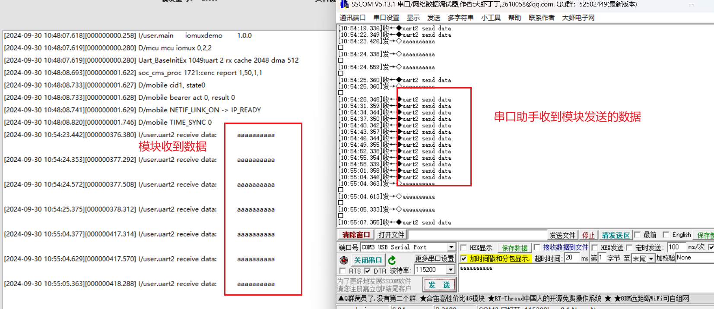

# IO复用

## 复用简要介绍

由于固件特性的存在, LuatOS的io复用默认是固定的, 从V1107开始, 通过mcu.iomux函数可以部分修改映射.

不同模块的外部管脚布局不一样, 但PAD(paddr)值是一致的, 要对应 “PIN/GPIO对应表格” 文档, 该文档可以在 air780e.cn 找到

由于芯片的引脚少,存在大量复用的场景,有很多功能是会冲突的

若使用SIM2, 会占用 4个IO(gpio4/5/6/23)

## 780E复用说明

参考文档：[GPIO复用说明](https://wiki.luatos.com/chips/air780e/iomux.html#pwm)

[780E引脚table](https://cdn.openluat-luatcommunity.openluat.com/attachment/20240813172012124_Air780E&Air780EG&Air780EX&Air700E_GPIO_table_20240812.pdf)

### 复用api介绍：

[api接口文档](https://wiki.luatos.com/api/mcu.html#mcu-altfun-type-sn-pad-index-alt-fun-is-input)

mcu.iomux(type, channel, value)

在外设打开前，将外设IO复用到非默认配置上，目前只支持Air780E的部分外设复用到其他配置，这是一个临时接口，如果后续有更合适的api，本接口将不再更新

**参数**

| 传入值类型 | 解释                               |
| ---------- | ---------------------------------- |
| int        | 外设类型，目前只有mcu.UART,mcu.I2C |
| int        | 总线序号，0~N，比如UART2的总线序号就是2 |
| int        | 新的配置，这个需要根据具体平台决定 |

**返回值**

无

**例子**

```lua
mcu.iomux(mcu.UART, 2, 1)    -- Air780E的UART2复用到gpio12和gpio13(Air780EG默认是这个复用，不要动)
mcu.iomux(mcu.UART, 2, 2)    -- Air780E的UART2复用到gpio6和gpio7
mcu.iomux(mcu.I2C, 0, 1)    -- Air780E的I2C0复用到gpio12和gpio13
mcu.iomux(mcu.I2C, 0, 2)    -- Air780E的I2C0复用到gpio16和gpio17
mcu.iomux(mcu.I2C, 1, 1)    -- Air780E的I2C1复用到gpio4和gpio5
```

## 780E-IO复用示例

本示例展示了将UART2复用到IO6和IO7.

```lua
-- Luatools需要PROJECT和VERSION这两个信息
PROJECT = "iomuxdemo"
VERSION = "1.0.0"

log.info("main", PROJECT, VERSION)

-- sys库是标配
_G.sys = require("sys")

if wdt then
    -- 添加硬狗防止程序卡死，在支持的设备上启用这个功能
    wdt.init(9000)--初始化watchdog设置为9s
    sys.timerLoopStart(wdt.feed, 3000)--3s喂一次狗
end

-- 将UART2RX和TX复用到GPIO6和GPIO7
mcu.iomux(mcu.UART,2,2)

local uart_id = 2

-- 设置串口2
uart.setup(uart_id,115200,8,1)

-- 注册串口接收事件回调
uart.on(uart_id,"receive",function(id,len)
    local data = uart.read(id,len)
    log.info("uart2 receive data:",data)
end)

sys.taskInit(function()
    local buff = "uart2 send data"
    while true do
        sys.wait(3000)
        -- 循环发送数据
        uart.write(uart_id,buff)
    end
end)
sys.run()
-- sys.run()之后后面不要加任何语句!!!!!
```
## 示例效果展示

### 接线

    串口        780E
    RXD         IO6
    TXD         IO7
    GND         GND

### 示例效果展示

IO6和IO7可以作为串口2使用


