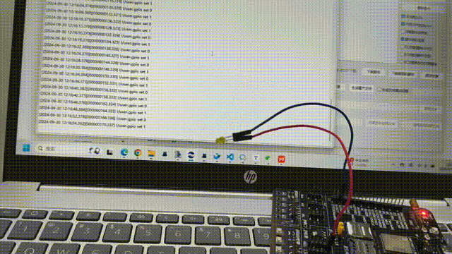

# 开漏模式

## 开漏模式简介

开漏模式是一种GPIO引脚的配置方式。在开漏模式下，GPIO引脚在输出高电平时处于高阻抗（高阻状态），而在输出低电平时主动将引脚拉低到地（GND）。这种模式不同于传统的推挽输出模式，后者能够主动驱动引脚到高电平或低电平。

## 开漏模式示例

### 示例demo

因为处于开漏模式时，当引脚输出高电平时是高阻态，当引脚输出低电平时是接GND。

所以可以使用IO7连接led负极，led正极连接电源来测试。当IO7输出高电平时 led灭，当IO7输出低电平时 led亮。

```lua


-- Luatools需要PROJECT和VERSION这两个信息
PROJECT = "iomuxdemo"
VERSION = "1.0.0"

log.info("main", PROJECT, VERSION)

-- sys库是标配
_G.sys = require("sys")

if wdt then
    -- 添加硬狗防止程序卡死，在支持的设备上启用这个功能
    wdt.init(9000)--初始化watchdog设置为9s
    sys.timerLoopStart(wdt.feed, 3000)--3s喂一次狗
end

local gpio_pin = 7

-- 设置IO7为开漏输出模式
gpio.setup(gpio_pin,1,0)

sys.taskInit(function ()
    while true do
        gpio.set(gpio_pin,0)
        log.info("gpio set 0")
        sys.wait(2000)
        gpio.set(gpio_pin,1)
        log.info("gpio set 1")
        sys.wait(4000)
    end
end)

sys.run()
-- sys.run()之后后面不要加任何语句!!!!!

```
## 示例效果展示

当IO7输出低电平时，led亮。当IO7输出高电平时，led灭。

当然，也可以通过万用表或者示波器看引脚电压。


