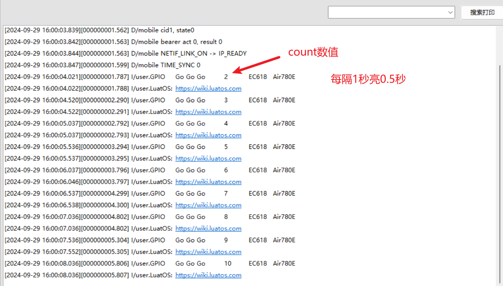

# 输出模式

## 输出模式简介

GPIO的输出模式是指将GPIO配置为向外界输出高低电平的模式。

## 输出模式示例

### 测试demo

这里粘贴的代码相比较demo中删减了一些判断板子型号的功能，更加精简，最终效果还是一样的。

```lua
-- LuaTools需要PROJECT和VERSION这两个信息
PROJECT = "gpiodemo"
VERSION = "1.0.1"

log.info("main", PROJECT, VERSION)

-- sys库是标配
_G.sys = require("sys")

if wdt then
    --添加硬狗防止程序卡死，在支持的设备上启用这个功能
    wdt.init(9000)--初始化watchdog设置为9s
    sys.timerLoopStart(wdt.feed, 3000)--3s喂一次狗
end

-- Air780E的AT固件默认会为开机键防抖, 导致部分用户刷机很麻烦
if rtos.bsp() == "EC618" and pm and pm.PWK_MODE then
    pm.power(pm.PWK_MODE, false)
end

--LED引脚判断赋值结束

local P1 = 27--赋值开发板LED引脚编号
local LEDA= gpio.setup(P1, 0, gpio.PULLUP)


sys.taskInit(function()
--开始流水灯
    local count = 0
    while 1 do
    --流水灯程序
        sys.wait(500) --点亮时间
        -- 轮流点灯
        LEDA(count % 3 == 0 and 1 or 0)
        log.info("GPIO", "Go Go Go", count, rtos.bsp(), hmeta and hmeta.model() or "")
        log.info("LuatOS:", "https://wiki.luatos.com")
        count = count + 1
    end
end)

-- API文档 https://wiki.luatos.com/api/gpio.html

-- 用户代码已结束
sys.run()
-- sys.run()之后后面不要加任何语句!!!!!

```

## 示例效果展示：

每隔1秒亮0.5秒。




