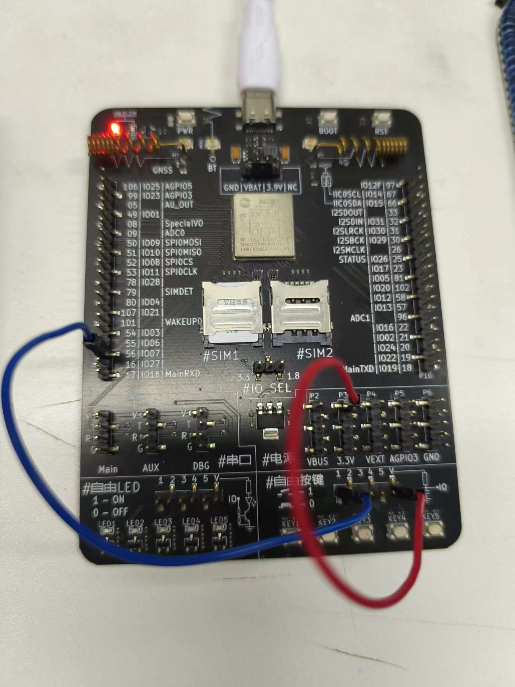
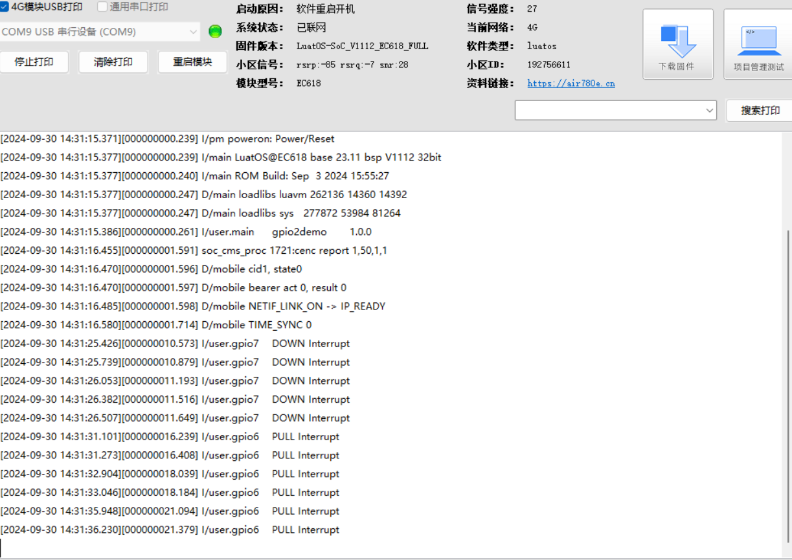

# 上拉下拉

## 上拉下拉简介

在使用GPIO引脚作为输入时，上拉电阻和下拉电阻是两种常见的配置方式，用于确保引脚在未被驱动时具有稳定的电平状态，避免引脚处于悬空状态，容易受到环境噪声影响，从而提高系统的可靠性和稳定性。

## 上下拉示例

### 测试demo

```lua

-- Luatools需要PROJECT和VERSION这两个信息
PROJECT = "gpio2demo"
VERSION = "1.0.0"

log.info("main", PROJECT, VERSION)

-- sys库是标配
_G.sys = require("sys")

if wdt then
    --添加硬狗防止程序卡死，在支持的设备上启用这个功能
    wdt.init(9000)--初始化watchdog设置为9s
    sys.timerLoopStart(wdt.feed, 3000)--3s喂一次狗
end

--配置gpio7为输入模式，下拉，并会触发中断
--请根据实际需求更改gpio编号和上下拉
local gpio_pin1 = 7
local gpio_pin2 = 6
-- 按键防抖函数
gpio.debounce(gpio_pin1, 100)
gpio.debounce(gpio_pin2, 100)

-- 设置引脚为上拉模式，按键检测到下降沿触发中断
gpio.setup(gpio_pin1, function()
    log.info("gpio7", "DOWN Interrupt")
end, gpio.PULLUP)

-- 设置引脚为下拉模式，按键检测到上升沿触发中断
gpio.setup(gpio_pin2, function()
    log.info("gpio6", "PULL Interrupt")
end, gpio.PULLDOWN)

-- 用户代码已结束---------------------------------------------
-- 结尾总是这一句
sys.run()
-- sys.run()之后后面不要加任何语句!!!!!

```
### 硬件连接

如果使用的是全IO板，可以用自带的自由按键。如果是核心板，需要准备一个按键和两个杜邦线。或者找两根杜邦线短接高电平和GND。



### 示例效果展示

IO6默认低电平，每检测到一次高电平会触发一次中断，打印gpio6 PULL Interrupt。IO7默认高电平，每检测到一次低电平会触发一次中断。


