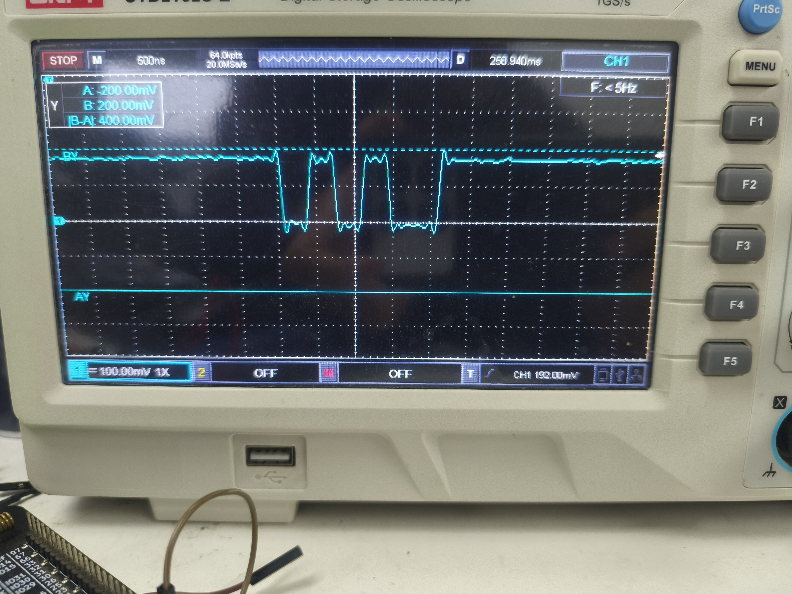

# IO翻转速度

## IO翻转速度简介

        IO翻转速度即IO电平变化一次消耗的时间

## 使用API介绍

### gpio.pulse(pin,level,len,delay)

在同一个GPIO输出一组脉冲, 注意, len的单位是bit, 高位在前.

**参数**

| 传入值类型 | 解释                          |
| ---------- | ----------------------------- |
| int        | gpio号                        |
| int/string | 数值或者字符串.               |
| int        | len 长度 单位是bit, 高位在前. |
| int        | delay 延迟,当前无固定时间单位 |

**返回值**

| 返回值类型 | 解释     |
| ---------- | -------- |
| nil        | 无返回值 |

## IO翻转速度示例

```lua

-- Luatools需要PROJECT和VERSION这两个信息
PROJECT = "gpio2demo"
VERSION = "1.0.0"

log.info("main", PROJECT, VERSION)

-- sys库是标配
_G.sys = require("sys")

if wdt then
    --添加硬狗防止程序卡死，在支持的设备上启用这个功能
    wdt.init(9000)--初始化watchdog设置为9s
    sys.timerLoopStart(wdt.feed, 3000)--3s喂一次狗
end

-- Air780E的AT固件默认会为开机键防抖, 导致部分用户刷机很麻烦
if rtos.bsp() == "EC618" and pm and pm.PWK_MODE then
    pm.power(pm.PWK_MODE, false)
end

gpio.setup(27,0,gpio.PULLUP)

sys.taskInit(function ()
    sys.wait(100)
    while true do
        sys.wait(100)
        gpio.pulse(27,0xA9, 8, 0)
        log.info("gpio----------->pulse2")
    end
end)

-- 用户代码已结束---------------------------------------------
-- 结尾总是这一句
sys.run()
-- sys.run()之后后面不要加任何语句!!!!!

```

### 示例效果展示

由测试可知，翻转一次大概100ns。



