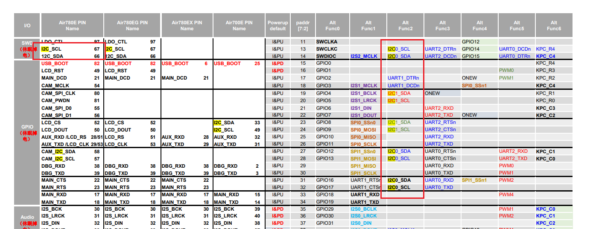

## 一、I2C 概述：

Air780E 可支持 1 路 I2C 接口，如果复用的话最多有两路：



I2C 配置：

兼容 Philips I2C 标准协议。

支持 Fast mode （400Kbps）和 Slow mode（100Kbps）。

只支持 master 模式，不支持 slave 模式。

理论上最多可支持 127 个从设备。

| 管脚名<br/>  | 类型<br/> | 序号<br/> | 电压域<br/>  | 描述<br/>                                |
| ------------ | --------- | --------- | ------------ | ---------------------------------------- |
| I2C_SCL<br/> | IO<br/>   | 67<br/>   | VDD_EXT<br/> | I2C 时钟信号，用作 I2C 时需外加上拉<br/> |
| I2C_SDA<br/> | IO<br/>   | 66<br/>   | VDD_EXT<br/> | I2C 时钟信号，用作 I2C 时需外加上拉<br/> |

I2C 的参考电路如下：


Air780E 的 I2C 接口电压是 1.8V/3.3V 可配置，通过 PIN100 IO_SEL 配置 IO 口电平，能够满足大部分外 设的直接需求，但是如果要和 5V 或者以上电平的外设通信，那就必须要加电平转换电路


## 二、演示功能概述

本例程将使用 I2C 协议读取传感器数据并打印出来。

## 三、准备硬件环境

### 3.1 780E 开发板一套

淘宝购买链接：[Air780E 核心板淘宝购买链接](https://item.taobao.com/item.htm?id=693774140934&pisk=f1eiwOqL25l1_HYiV6D1ize3wN5d5FMjRrpxkx3VT2uIHCCskWm4kysffAEqor4KRRIskGT0ooqi_coq7DWE000qbVr2mmzKQjNtkV3mnoalvaBRelZshA7RyTFdpD4xQco2_VS2Tcnvc89h5lZshq-pu_FUfEDVVdOmgrkET0ir3mkq_MDEmmM2QjJaY2uI0UGAoNueWRjiw4YTC-_opNr-zluaXleFpfR_X2fhTJVn94W--KJ4KcqQreCDEs3zNVh-DyWpIxqEmyc8savgoor7gX2D7GUzmW4jBJS2_4PTWjestFRZqA0iaRlwjdkIgW2nBR7XNkEn7bDL96_tMA4gN4GNOwa0xVU4IX8G4iReapZyhDSYLIOj_DinyhbSB2IHjbEhxMA51foIXaIhxItMPKJlyMjHNEGZAcQR.&spm=a1z10.5-c-s.w4002-24045920841.33.639f1fd1YrS4b6&skuId=5098266470883) ；

此核心板的详细使用说明参考：[Air780E 产品手册](https://docs.openluat.com/air780e/product/) 中的 << 开发板 Core_Air780E 使用说明 V1.0.5.pdf>>；核心板使用过程中遇到任何问题，可以直接参考这份使用说明 pdf 文档。


### 3.2 数据通信线

typec 接口 USB 数据线即可。

### 3.3 PC 电脑

WINDOWS 系统。

### 3.4 sht20 温湿度传感器一个


### 3.5 780E 与 sht20 接线图如下


## 四、准备软件环境

### 4.1 基本的下载调试工具

使用说明参考：[Luatools 下载和详细使用](https://docs.openluat.com/Luatools/) ；

## 五、使用 I2C 读取 sht20 软硬件资料：

### 5.1 文档和工具：

- 780E 模块使用固件：[SDK& Demo - 合宙文档中心](https://docs.openluat.com/air780e/luatos/firmware/)，本 demo 使用的固件版本是：LuatOS-SoC_V1112_EC618_FULL.soc
- 本教程使用的 demo：[https://gitee.com/openLuat/LuatOS-Air780E/tree/master/demo/sht20](https://gitee.com/openLuat/LuatOS-Air780E/tree/master/demo/sht20)
- 将固件和脚本烧录到模块中：[Luatools 下载和使用教程 - 合宙模组资料中心](https://docs.openluat.com/Luatools/)
- 源码和固件已打包，如下所示：
[点我,下载完整压缩文件包](file/完整文件包.zip){:target="_blank"}

### 5.2 demo 使用 api 介绍

#### i2c.setup(id, speed, pullup)

作用：i2c 初始化

**参数：**

| **传入值类型**<br/> | **解释**<br/>                                       |
| ------------------- | --------------------------------------------------- |
| int<br/>            | 设备 id, 例如 i2c1 的 id 为 1, i2c2 的 id 为 2<br/> |
| int<br/>            | I2C 速度, 例如 i2c.FAST<br/>                        |
| bool<br/>           | 是否软件上拉, 默认不开启，需要硬件支持<br/>         |

**返回值：**

| **返回值类型**<br/> | **解释**<br/>                |
| ------------------- | ---------------------------- |
| int<br/>            | 成功就返回 1,否则返回 0<br/> |

#### i2c.send(id, addr, data, stop)

作用：i2c 发送数据

**参数：**

| **传入值类型**<br/>       | **解释**<br/>                                                     |
| ------------------------- | ----------------------------------------------------------------- |
| int<br/>                  | 设备 id, 例如 i2c1 的 id 为 1, i2c2 的 id 为 2<br/>               |
| int<br/>                  | I2C 子设备的地址, 7 位地址<br/>                                   |
| integer/string/table<br/> | 待发送的数据,自适应参数类型<br/>                                  |
| integer<br/>              | 可选参数 是否发送停止位 1 发送 0 不发送 默认发送(105 不支持)<br/> |

**返回值：**

| **传入值类型**<br/> | **解释**<br/>     |
| ------------------- | ----------------- |
| true/false<br/>     | 发送是否成功<br/> |

#### i2c.recv(id, addr, len)

作用：i2c 接收数据

| **传入值类型**<br/> | **解释**<br/>                                       |
| ------------------- | --------------------------------------------------- |
| int<br/>            | 设备 id, 例如 i2c1 的 id 为 1, i2c2 的 id 为 2<br/> |
| int<br/>            | I2C 子设备的地址, 7 位地址<br/>                     |
| int<br/>            | 接收数据的长度<br/>                                 |

**返回值：**

| **传入值类型**<br/> | **解释**<br/>   |
| ------------------- | --------------- |
| string<br/>         | 收到的数据<br/> |

## 六、代码示例介绍

### 6.1 读取 SHT20 温湿度传感器

#### 6.1.1 SHT20 简介：

SHT20 是使用 I2C 协议进行通信的温湿度传感器。

首先我们可以发送 STH20 的 7 位从机地址 +1 位读写位（写 0 读 1），然后发送 8 位的命令，0xF3 是读取温度的命令，0xF5 是读取湿度的命令。发送完后接收应答，等待 20us 之后我们发出 I2C 的结束时序。

#### 6.1.2 demo 介绍

首先初始化 i2c，然后给 sht20 发送读取温湿度命令，接收 sht20 回传的数据即可。

```lua
-- LuaTools需要PROJECT和VERSION这两个信息
PROJECT = "sht20demo"
VERSION = "1.0.0"

-- sys库是标配
sys = require("sys")

-- 接线
--[[
SHT20 --- 模块
SDA   -   I2C_SDA
SCL   -   I2C_SCL
VCC   -   VDDIO
GND   -   GND
]]

-- 启动个task, 定时查询SHT20的数据
sys.taskInit(function()

    local tmp,hum -- 原始数据
    local temp,hump -- 真实值

    --1010 000x
    local addr = 0x40
    -- 按实际修改哦
    local id = 0

    --[[
        i2c初始化
        @param1    设备id, 例如i2c1的id为1, i2c2的id为2
        @param2    I2C速度, 例如i2c.FAST
        @param3    是否软件上拉, 默认不开启，需要硬件支持
        @return    成功就返回1,否则返回0
    ]]
    log.info("i2c", "initial",i2c.setup(id))

    while true do
        --第一种方式
        --[[
            i2c发送读取温度的命令
            @param1    设备id, 例如i2c1的id为1, i2c2的id为2
            @param2    I2C子设备的地址, 7位地址
            @param3    待发送的数据,自适应参数类型
            @param4    可选参数 是否发送停止位 1发送 0不发送 默认发送(105不支持)
            @return    发送是否成功
        ]]
        i2c.send(id, addr, string.char(0xF3))
        sys.wait(100)
        --[[
            i2c接收温度数据
            @param1    设备id, 例如i2c1的id为1, i2c2的id为2
            @param2    I2C子设备的地址, 7位地址
            @param3    接收数据的长度
            @return    收到的数据
        ]]
        tmp = i2c.recv(id, addr, 2)
        log.info("SHT20", "read tem data", tmp:toHex())

        --[[ 发送读取湿度的命令 ]]
        i2c.send(id, addr, string.char(0xF5))
        sys.wait(100)
        --[[ 接收湿度的数据 ]]
        hum = i2c.recv(id, addr, 2)
        log.info("SHT20", "read hum data", hum:toHex())

        local _,tval = pack.unpack(tmp,'>H')
        local _,hval = pack.unpack(hum,'>H')
        if tval and hval then
            --[[ 将温湿度数据转化成常规数据 ]]
            temp = (((17572 * tval) >> 16) - 4685)/100
            hump = (((12500 * hval) >> 16) - 600)/100
            log.info("SHT20", "temp,humi",temp,hump)
        end
        sys.wait(1000)
    end
end)

sys.run()
-- sys.run()之后后面不要加任何语句!!!!!
```

#### 6.1.3 将程序下载到开发板：

使用说明参考：[Luatools 下载和详细使用](https://docs.openluat.com/Luatools/)

## 七、功能验证：

成功使用 I2C 协议读取到 sht20 传感器的温湿度数值。


## 八、总结

本例程使用 i2c 协议读取了 sht20 传感器传输的温湿度数值。

## 扩展

## 常见问题

### 1、i2c 每次读写数据前都需要 setup 一次吗？

不需要

正常的业务逻辑为：

i2c.setup

…此处可以多次读写数据

i2c.close

setup 之后，只要没有 close，就可以反复读写数据

一旦执行了 close，下次读写数据前，必须再次 setup

### 2、i2c 通信时模块可以做从设备吗？

注意：模块 I2C 只能做主设备，(虽然有内部上拉电阻，但是暂时还未实现软件配置)使用时需要外部上拉，在配置 FAST 速率时，上拉电阻阻值不要大于 4.7K。

### 3、i2c 设备 7 位的地址为 0x38 ，需要我手动转换到 8 位地址吗？

这里 i2c_addr 地址是 7bit 地址

如果 i2c 外设手册中给的是 8bit 地址，需要把 8bit 地址右移 1 位，赋值给 i2c_addr 变量

如果 i2c 外设手册中给的是 7bit 地址，直接把 7bit 地址赋值给 i2c_addr 变量即可

## 给读者的话

> 本篇文章由`Linden`开发；
>
> 本篇文章描述的内容，如果有错误、细节缺失、细节不清晰或者其他任何问题，总之就是无法解决您遇到的问题；
>
> 请登录[合宙技术交流论坛](https://chat.openluat.com/)，点击[文档找错赢奖金-Air780E-LuatOS-软件指南-硬件驱动-I2C](https://chat.openluat.com/#/page/matter?125=1846799249380081665&126=%E6%96%87%E6%A1%A3%E6%89%BE%E9%94%99%E8%B5%A2%E5%A5%96%E9%87%91-Air780E-LuatOS-%E8%BD%AF%E4%BB%B6%E6%8C%87%E5%8D%97-%E7%A1%AC%E4%BB%B6%E9%A9%B1%E5%8A%A8-I2C&askid=1846799249380081665)；
>
> 用截图标注+文字描述的方式跟帖回复，记录清楚您发现的问题；
>
> 我们会迅速核实并且修改文档；
>
> 同时也会为您累计找错积分，您还可能赢取月度找错奖金！
