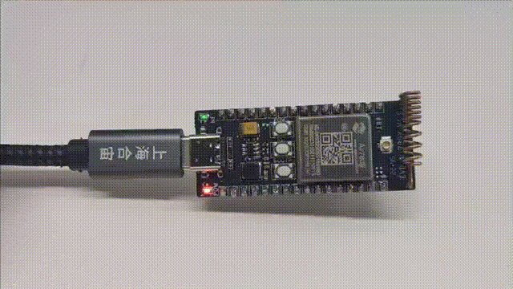

## 一、PWM 概述

### 1.1 **pwm 是什么**

脉冲宽度调制(PWM)，是英文“Pulse Width Modulation”的缩写，简称**脉宽调制**，是利用微处理器的数字输出来对模拟电路进行控制的一种非常有效的技术，广泛应用在从测量、通信到功率控制与变换的许多领域中。

要想使用 pwm 还需了解 PWM 的相关参数：

> 1. PWM 的频率：
>    是指 1 秒钟内信号从高电平到低电平再回到高电平的次数（一个周期），也就是说一秒钟 PWM 有多少个周期
>    单位：Hz
> 2. PWM 的周期：
>    T=1/f
>    周期=1/频率
>    例：如果频率为 50Hz ，也就是说一个周期是 20ms，那么一秒钟就有 50 次 PWM 周期
> 3. PWM 的占空比：
>    是一个脉冲周期内，高电平的时间占整个周期时间的比例
>    单位： % (0%-100%)
>    例：一个周期 10ms,高电平占 8ms，那么此占空比就是 8/10=80%

### 1.2 **pwm 原理**

单片机的 IO 引脚输出的是数字信号，且只能输出 1 和 0，那如果 TTL 电平中，高电平为 5V，低电平为 0V，但是我们想要输出不同的模拟电压，比如输出 3.75V 应该怎么操作？

> 此时要用到 PWM，通过改变 IO 口输出方波的占空比，得到不同的模拟电压。
> 3.75/5=0.75 ，也就是高电平时间占整个周期的 75%，即占空比为 75%，可得到模拟电压 3.75V.
> 
> 注意上图中蓝线，代表着输出的模拟电压，占空比越大，则模拟电压也越大。

### 1.3 pwm 通道说明

说明:

1. 查阅 GPIO 复用表格,即 [Air780E 产品手册](https://docs.openluat.com/air780e/product/)内的《Air780E_GPIO_table_20240812.pdf》可知 780E 的实际可用 PWM 通道就 4 个(0/1/2/4), 但每个都有 3 种配置, PWM3/PWM5 已经被底层使用，例如 PWM1 和 PWM11 都使用硬件通道 1, **只能选其中一个使用。**
2. 启用 PWM1 就不能启用 PWM11, 调用 pwm 库的 API 时,填 `软件通道id`

PS:

1. 软件通道 10/11/12/14 需要 V1002 以上的固件, 20221219 之后编译的版本
2. 软件通道 20/21/22 需要 V1016 以上的固件, 20230330 之后编译的版本
3. 上述映射是固定的, mcu.iomux 也没有配置项, 而且已经枚举了全部可用 PWM 通道.

## 二、演示功能概述

本章节分别用两个示例演示了如何使用 Air780E 的 PWM 功能

1. 控制 Air780E 核心板 pwm4 通道的 pwm 输出，设置不同的占空比，让小灯有不同的亮度
2. 使用 Air780E 核心板的 pwm1 通道，外接发光二极管来查看呼吸灯效果

## 三、准备硬件环境

### 3.1 开发板准备

使用 Air780E 核心板，如下图所示：


淘宝购买链接：[Air780E 核心板淘宝购买链接](https://item.taobao.com/item.htm?id=693774140934&pisk=f1eiwOqL25l1_HYiV6D1ize3wN5d5FMjRrpxkx3VT2uIHCCskWm4kysffAEqor4KRRIskGT0ooqi_coq7DWE000qbVr2mmzKQjNtkV3mnoalvaBRelZshA7RyTFdpD4xQco2_VS2Tcnvc89h5lZshq-pu_FUfEDVVdOmgrkET0ir3mkq_MDEmmM2QjJaY2uI0UGAoNueWRjiw4YTC-_opNr-zluaXleFpfR_X2fhTJVn94W--KJ4KcqQreCDEs3zNVh-DyWpIxqEmyc8savgoor7gX2D7GUzmW4jBJS2_4PTWjestFRZqA0iaRlwjdkIgW2nBR7XNkEn7bDL96_tMA4gN4GNOwa0xVU4IX8G4iReapZyhDSYLIOj_DinyhbSB2IHjbEhxMA51foIXaIhxItMPKJlyMjHNEGZAcQR.&spm=a1z10.5-c-s.w4002-24045920841.33.639f1fd1YrS4b6&skuId=5098266470883) ；

此核心板的详细使用说明参考：[Air780E 产品手册](https://docs.openluat.com/air780e/product/) 中的 << 开发板 Core_Air780E 使用说明 VX.X.X.pdf>>，写这篇文章时最新版本的使用说明为：<< 开发板 Core_Air780E 使用说明 V1.0.5.pdf>> ；核心板使用过程中遇到任何问题，可以直接参考这份使用说明 pdf 文档。

### 3.2 数据通信线

USB 转 typeC 数据线一根

### 3.3 PC 电脑

WINDOWS 系统，其他暂无特别要求

## 四、准备软件环境

### 4.1 下载调试工具

使用说明参考：[Luatools 下载和详细使用](https://docs.openluat.com/Luatools/)

### 4.2 源码及固件

1. 底层 core 下载地址：[LuatOS 固件版本下载地址](https://docs.openluat.com/air780e/luatos/firmware/) 
本 demo 使用的固件是 core_V1112 压缩包内的 LuatOS-SoC_V1112_EC618_FULL.soc

2. 本教程使用的 demo：[https://gitee.com/openLuat/LuatOS-Air780E/tree/master/demo/pwm](https://gitee.com/openLuat/LuatOS-Air780E/tree/master/demo/pwm)
3. 源码和固件已打包，如下所示：
> 注：压缩包中 core 文件夹存放固件，code 文件夹存放 demo

## 五、PWM 软硬件资料

### 5.1 API 接口介绍

本教程使用 api 接口为：[pwm - PWM 模块 - LuatOS 文档](https://wiki.luatos.com/api/pwm.html?highlight=pwm)

### 5.2 Air780E 烧录说明

将 Air780E 通过通过 usb 数据线连接电脑，如下图所示：

> 注：
> 1、按住下载模式按键（boot 键）不放，同时再长按开机键开机，这时开发板会进入下载模式，Luatools 下载进度条会开始跑，这时可以松开 boot 按键。直到工具提示下载完成。
> 2、如果，未能成功进入下载模式，而是进入正常开机模式，这时可以按住 boot 键，再短按复位按键，让开发板重启，重新进入下载模式。


如何判断有没有进入下载模式:可以通过 PC 端的设备管理器中虚拟出来的 USB 断开数量来判断，

**正常开机模式：**


**下载模式：**


## 六、代码示例介绍

### 6.1 PWM 输出

本例使用 Air780E 核心板上的 NetLed(网络状态灯)，pwm 通道 id=4
打开 pwm4 通道的 pwm 输出，设置不同的占空比，小灯会有不同的亮度

#### 6.1.1 代码介绍

```lua
sys.taskInit(function()
    while true do
        -- 开启pwm通道4，设置脉冲频率为1kHz，分频精度为1000，占空比为10/1000=1% 持续输出
        pwm.open(4, 1000, 10, 0, 1000) -- 小灯微微发光
        sys.wait(1000)
        -- 开启pwm通道4，设置脉冲频率为1kHz，分频精度为1000，占空比为500/1000=50% 持续输出
        pwm.open(4, 1000, 500, 0, 1000) -- 小灯中等亮度
        sys.wait(1000)
        -- 开启pwm通道4，设置脉冲频率为1kHz，分频精度为1000，占空比为1000/1000=100% 持续输出
        pwm.open(4, 1000, 1000, 0, 1000) -- 小灯很高亮度
        sys.wait(1000)
    end
end)
```

#### 6.1.2 效果展示



### 6.2 呼吸灯效果

本例使用 Air780E 核心板的 pwm1 通道，外接发光二极管来查看呼吸灯效果

> 呼吸灯效果就是小灯由亮到暗逐渐变化，很有节奏感地一起一伏，”感觉，好像人在呼吸“，我们可以通过不断调高占空比让小灯一点点亮起，再不断调低占空比让小灯一点点熄灭从而达到此效果。

#### 6.2.1 硬件接线

`GPIO24 --------发光二极管正极`

`GND------------发光二极管负极`


#### 6.2.2 代码介绍

```lua
local PWM_ID = 1
sys.taskInit(function()
    log.info("pwm", "ch", PWM_ID)
    while 1 d
        -- 仿呼吸灯效果
        log.info("pwm", ">>>>>")
        -- 占空比从90%（i=10时）到9%（i=1时）
        for i = 10,1,-1 do
            pwm.open(PWM_ID, 1000, i*) -- 频率1000hz, 占空比0-100
            sys.wait(100 + i*10)
        end
        -- 占空比从10%增加到90%。
        for i = 10,1,-1 do
            pwm.open(PWM_ID, 1000, 100 - i*9)
            sys.wait(100 + i*10)
        end
        sys.wait(2000)
    end
end)
```

#### 6.2.3 效果展示

外接发光二极管，效果如下图所示：

> 也可用 Air780E 核心板上的 NetLed(网络状态灯)来观察呼吸灯效果，但 demo 里的 pwm 通道要改成相应的 id,可查看上面的 PWM 通道说明。


通过示波器查看 PWM 输出波形，如下所示，可以看到占空比在 10%-90% 之间变化。


## 七、总结

本教程旨在通过合宙开发板展示 PWM（脉冲宽度调制）输出呼吸灯的实现方法，帮助读者深入理解如何在项目中应用 PWM 技术。PWM 作为一种灵活且高效的信号调制手段，在电气设备的性能控制和调节中发挥着重要作用。通过精确控制信号的占空比，PWM 能够实现电能的有效管理。

**PWM 的主要应用**：

1. 电机控制：通过调节电机供电的 PWM 信号，控制电机转速和扭矩。
2. 灯光调光：用于调节 LED 灯的亮度，改变状态的快慢来实现不同亮度效果。
3. 音频信号生成：在音频电子设备中生成不同的声音频率和音量。
4. 加热控制：在加热元件中使用 PWM 来调整输出功率，从而实现精确的温度控制。

**PWM 的优点：**

1. 高效性：PWM 有效降低能量损耗，因为其开关操作使功率元件始终处于全导通或全关闭状态。
2. 控制精度高：可以通过调节占空比进行非常精确的控制。
3. 实现简便：可以通过简单的数字电路或微控制器轻松实现。

**PWM 的缺点：**

1. 高频噪声：由于快速切换，PWM 信号可能产生高频噪声，需要滤波以减小干扰。
2. 硬件要求：某些应用需要特定的硬件支持，如支持 PWM 输入的微控制器或电路。

## 扩展

## 常见问题

1. 如何验证所产生的 PWM 信号？
   > 可以使用示波器检测 PWM 输出，查看频率、占空比和波形的完整性。确保波形按照设计参数正常工作，必要时进行调整。

2. PWM 的信号的频率如何选择？
   > 频率的选择通常取决于具体应用，根据自己的项目需要来选择:
   > （1）电机控制:常用频率为 1 kHz 到 20 kHz，以确保足够的反应速度和控制精度。
   > （2）LED 调光：频率通常在 1 kHz 以上，以避免人眼感知到闪烁。
   > （3）音频信号：频率设置应高于音频信号的最高频率（例如，至少为 20 kHz）。

3. 什么是占空比，如何计算 PWM 的占空比？
   > 占空比即是一个脉冲周期内，高电平的时间占整个周期
   > 例如，如果 PWM 信号的高电平时间为 2 ms，周期为 10 ms，占空比 = (2 / 10) × 100 = 20%。

## 给读者的话

> 本篇文章由`王世豪`开发；
>
> 本篇文章描述的内容，如果有错误、细节缺失、细节不清晰或者其他任何问题，总之就是无法解决您遇到的问题；
>
> 请登录[合宙技术交流论坛](https://chat.openluat.com/)，点击[文档找错赢奖金-Air780E-LuatOS-软件指南-硬件驱动-PWM](https://chat.openluat.com/#/page/matter?125=1847178801914707970&126=%E6%96%87%E6%A1%A3%E6%89%BE%E9%94%99%E8%B5%A2%E5%A5%96%E9%87%91-Air780E-LuatOS-%E8%BD%AF%E4%BB%B6%E6%8C%87%E5%8D%97-%E7%A1%AC%E4%BB%B6%E9%A9%B1%E5%8A%A8-PWM&askid=1847178801914707970)
>
> 用截图标注+文字描述的方式跟帖回复，记录清楚您发现的问题；
>
> 我们会迅速核实并且修改文档；
>
> 同时也会为您累计找错积分，您还可能赢取月度找错奖金！
