# 003：Air780E-LuatOS-软件 demo-硬件驱动-SPI

> [!TIP]
> ！！！不要删除这个高亮块中的内容！！！

每次版本迭代时，重新复制之前最近的一份文章内容，放到本文档最上面，然后修改；

必读文章：
[docs.openluat.com 文档开发过程（新人必看）](https://e3zt58hesn.feishu.cn/wiki/BJWIwMWI0ijF2zkiamUcI0s7nwd)
[docs 文章基本要求（大家仔细阅读，严格遵守）](https://e3zt58hesn.feishu.cn/docx/UplIdAaKso4k09xZSG4cMBGfn6e)

写本篇文章时，文章内容可以参考的一些合宙内部的资料（有些资料可能不是 Air780E 的，仅供参考）：

- **基于 LuatOS 代码仓库中的 spi 有关的 demo 来写，要有很方便可以买到的 spi 外设可以验证，选好 spi 外设后，在群里面讨论，确定外设合适之后，再开始写文章；**
- 如果 demo 实现的功能不足以支撑编写本文章，例如功能不完整或者有错误，及时提出来，编写文档的同时完善 demo；
- [Air780E 简介](https://docs.openluat.com/air780e/)
- [Air780E 产品手册](https://docs.openluat.com/air780e/product/)
- [https://doc.openluat.com/wiki/21?wiki_page_id=1937](https://doc.openluat.com/wiki/21?wiki_page_id=1937)
- [https://doc.openluat.com/wiki/21?wiki_page_id=2032](https://doc.openluat.com/wiki/21?wiki_page_id=2032)

写本篇文章时，文章目录结构可以参考一下文章：

- [Air780E LuatOS 快速入门示例 HelloWorld](https://docs.openluat.com/air780e/luatos/quick_start/hello/)
- [合宙 DTU 整机产品线文档中心](https://e3zt58hesn.feishu.cn/wiki/CFgkw6I66idUVnkAeaQcGpL4nfe?chunked=false)
- [Air780E AT 快速入门示例 TCP 通信](https://docs.openluat.com/air780e/at/quick_start/tcp/tcp/)

# 2024-10-14 第一版

## 一、SPI 概述

SPI（Serial Peripheral Interface）是一种同步串行通信协议，广泛应用于微控制器和外围设备之间的数据传输。它由摩托罗拉公司开发，具有全双工通信能力，即可以同时进行数据的发送和接收。

SPI 通信通常涉及四条信号线：

1. **MOSI（Master Out Slave In）**：主设备发送数据，外设接收数据。
2. **MISO（Master In Slave Out）**：外设发送数据，主设备接收数据。
3. **SCLK（Serial Clock）**：由主设备生成的时钟信号，用于同步数据传输。
4. **SS（Slave Select）**：选择特定的从设备进行通信。

SPI 的优点包括简单的硬件连接、高速数据传输和全双工通信。其缺点是通常需要更多的引脚，尤其是在多个从设备的情况下，每个从设备需要一个独立的 SS 引脚。此外，SPI 没有标准化的协议层，因此设备间的兼容性需要仔细管理。

## 二、演示功能概述

本文使用 Air780E 核心板的 SPI 总线读写 FLASH。

## 三、准备硬件环境

## 四、准备软件环境

注：以下软件下载链接，请复制后，粘贴到浏览器 URL 地址栏进行下载；

### 4.1 相关软件

### 4.2 core 固件和源码脚本

注：core 固件，是基础环境，该固件由合宙官方提供，用户不可修改；源码脚本，为应用程序，可由客户自行修改；

## 五、软硬件资料

1、AIR708E 开发板原理图，打开 [Air780E 产品手册](https://docs.openluat.com/air780e/product/) ，访问页面中的 《[EVB_Air780X_V1.6.zip](https://cdn.openluat-luatcommunity.openluat.com/attachment/20240513100446379_EVB_Air780X_V1.6.zip)》

2、[API 使用介绍说明](https://wiki.luatos.com/api/index.html)

3、AIR708E 开发板使用说明，打开 [Air780E 产品手册](https://docs.openluat.com/air780e/product/) ，访问页面中的 《Core_Air780E 使用说明 V1.0.5.pdf》

### 5.1 开发板按钮与指示灯图示与说明

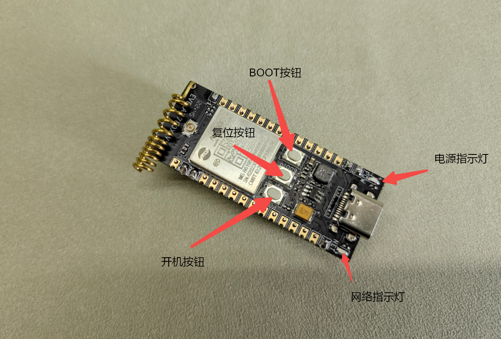

### 5.2 硬件安装与连接

#### 5.2.1 SIM 卡安装


#### 5.2.2 实物连接图

##### 5.2.2.1 线序定义与颜色对应

##### 5.2.2.2 FLASH 端

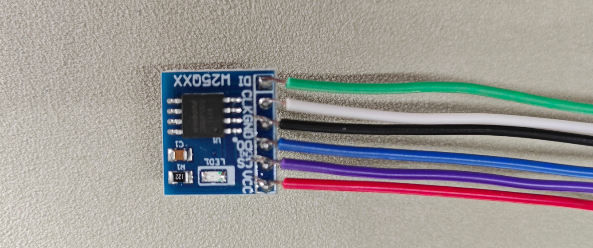

##### 5.2.2.3 开发板端

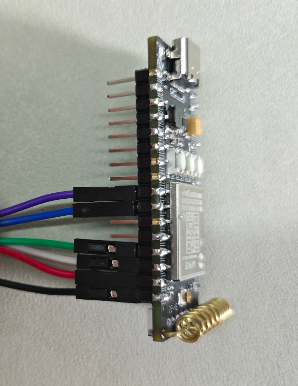

## 六、代码示例介绍

### 6.1 程序流程图


### 6.2 完整程序清单

注：完整复制后保存为 main.lua，可直接使用

```lua
-- LuaTools需要PROJECT和VERSION这两个信息
PROJECT = "w25q_spi_demo"
VERSION = "1.0.1"

sys = require("sys")
sysplus = require("sysplus")

-- Air780E的AT固件默认会为开机键防抖, 导致部分用户刷机很麻烦
if rtos.bsp() == "EC618" and pm and pm.PWK_MODE then
    pm.power(pm.PWK_MODE, false)
end

--spi编号，请按实际情况修改！
local spiId = 0
--cs脚，请按需修改！
local cs = 8 -- CS使用GPIO8
local cspin = gpio.setup(cs, 1)  --配置CS为输出

local netLed = require("netLed")
--GPIO18配置为输出，默认输出低电平，可通过setGpio18Fnc(0或者1)设置输出电平
local LEDA= gpio.setup(27, 0, gpio.PULLUP)

--收发数据
local function sendRecv(data,len)
    local r = ""
    cspin(0)
    if data then spi.send(spiId,data) end
    if len then r = spi.recv(spiId,len) end
    cspin(1)
    return r
end


sys.taskInit(function()
    
    local result = spi.setup(
        spiId,--串口id
        nil,
        0,--CPHA
        0,--CPOL
        8,--数据宽度
        100000--,--频率
        -- spi.MSB,--高低位顺序    可选，默认高位在前
        -- spi.master,--主模式     可选，默认主
        -- spi.full--全双工       可选，默认全双工
    )
    print("open",result)
    if result ~= 0 then--返回值为0，表示打开成功
        print("spi open error",result)
        return
    end

    --检查芯片型号
    local chip = sendRecv(string.char(0x9f),3)
    if chip == string.char(0xef,0x40,0x17) then
        log.info("spi", "chip id read ok 0xef,0x40,0x17")
    else
        log.info("spi", "chip id read error")
        for i=1,#chip do
            print(chip:byte(i))
        end
        return
    end

    local data = "test data 123456"

    --enable write
    sendRecv(string.char(0x06))

    --写页数据到地址0x000001
    sendRecv(string.char(0x02,0x00,0x00,0x01)..data)
    log.info("spi","write",data)

    sys.wait(500)--等写入操作完成

    --读数据
    local r = sendRecv(string.char(0x03,0x00,0x00,0x01),data:len())
    log.info("spi","read",r)

    --disable write
    sendRecv(string.char(0x04))

    spi.close(spiId)
end)

-- 这里演示4G模块上网后，会自动点亮网络灯，方便用户判断模块是否正常开机
sys.taskInit(function()
    while true do
        sys.wait(6000)
                if mobile.status() == 1 then
                        gpio.set(27, 1)  
                else
                        gpio.set(27, 0) 
                        mobile.reset()
        end
    end
end)

-- 结尾总是这一句哦
sys.run()
```

## 七、功能验证

### 7.1 开机

按图 1 进行连接无误后，开发板电源指示红灯常亮，网络指示灯灭，此时按下开机键，约 2 秒后释放，等待几秒网络指示绿灯常亮，即开机成功，如下图：

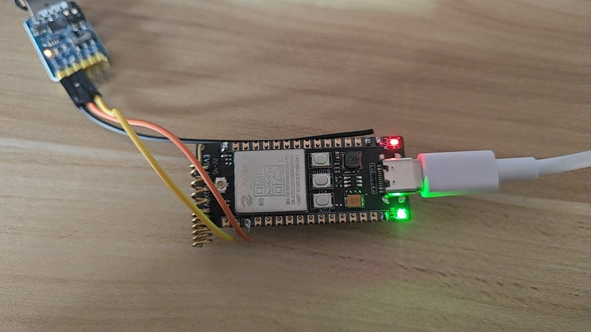

### 7.2 打开 Luatool 软件工具并进入项目管理测试页面


### 7.3 按序号步骤创建项目

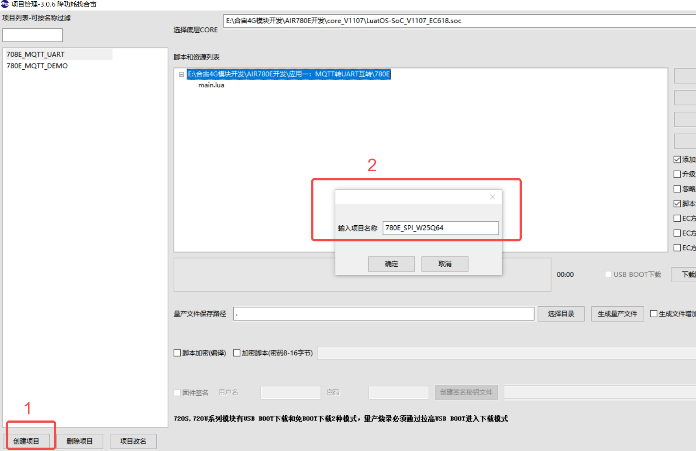

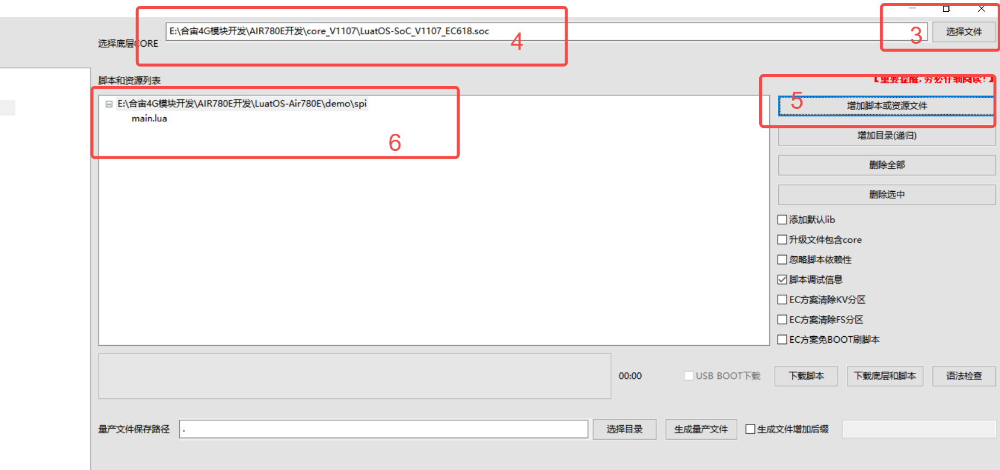

### 7.4 按如下步骤进行程序烧录

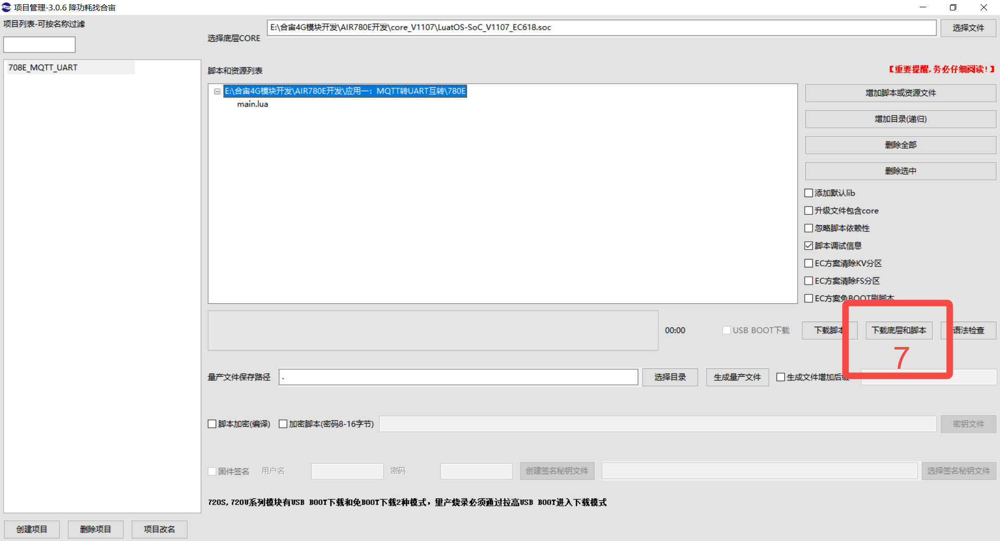

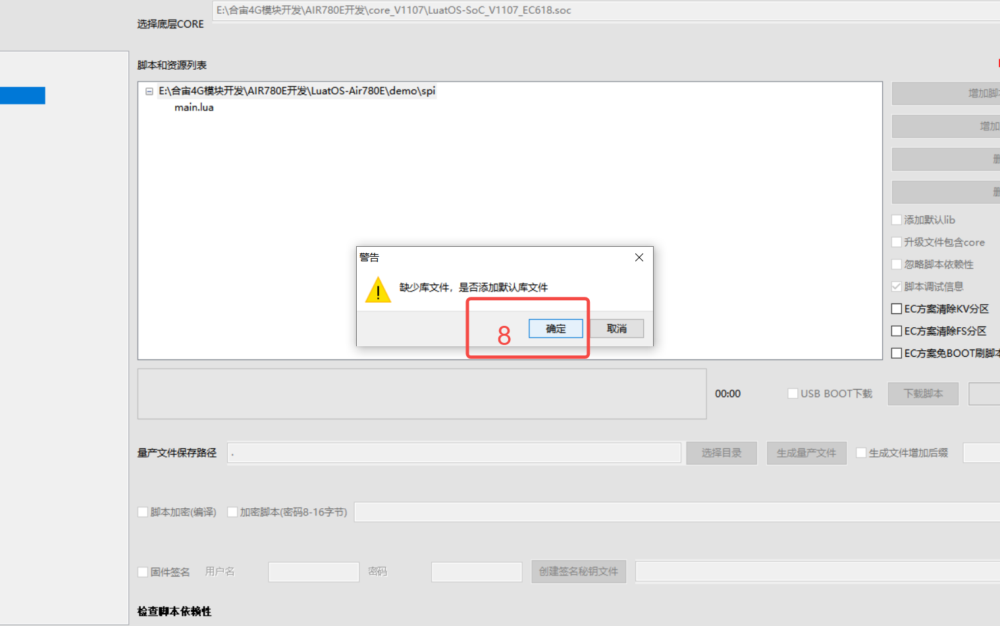

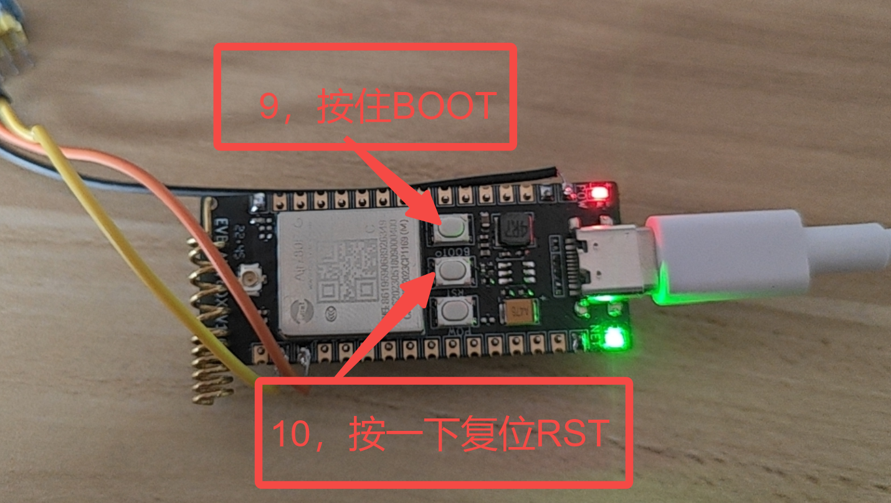

### 7.5 观察下载过程后确认烧录结果


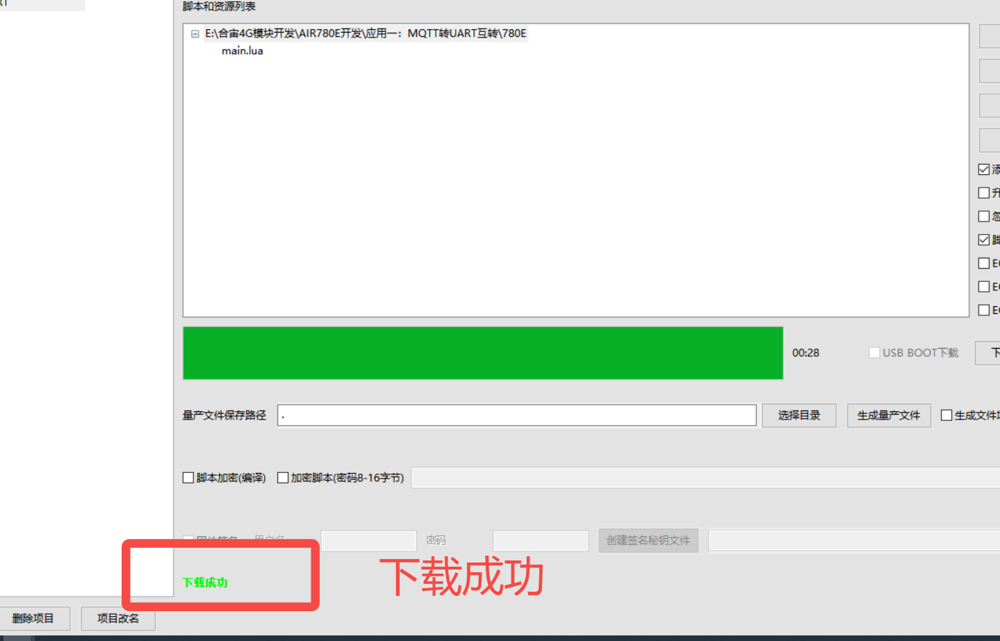

### 7.6 关闭下载页面回到查看日志页面

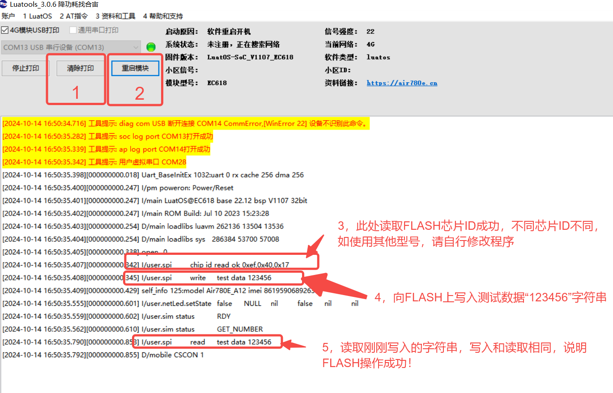

## 八、总结

至此，我们已使用 AIR708E 开发板的 SPI 接口完成了对 W25Q64 读写操作。
