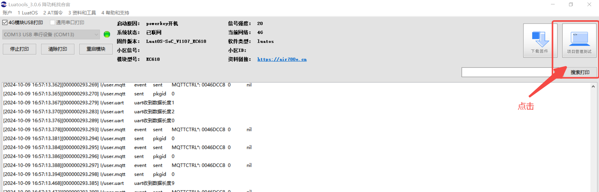

## 一、SPI 概述

SPI（Serial Peripheral Interface）是一种同步串行通信协议，广泛应用于微控制器和外围设备之间的数据传输。它由摩托罗拉公司开发，具有全双工通信能力，即可以同时进行数据的发送和接收。

SPI 通信通常涉及四条信号线：

1. **MOSI（Master Out Slave In）**：主设备发送数据，外设接收数据。
2. **MISO（Master In Slave Out）**：外设发送数据，主设备接收数据。
3. **SCLK（Serial Clock）**：由主设备生成的时钟信号，用于同步数据传输。
4. **SS（Slave Select）**：选择特定的从设备进行通信。

SPI 的优点包括简单的硬件连接、高速数据传输和全双工通信。其缺点是通常需要更多的引脚，尤其是在多个从设备的情况下，每个从设备需要一个独立的 SS 引脚。此外，SPI 没有标准化的协议层，因此设备间的兼容性需要仔细管理。

## 二、演示功能概述

本文使用 Air780E 核心板的 SPI 总线读写 FLASH。

## 三、准备硬件环境

### 3.1 AIR780E 开发板


[购买链接（数量：1，注意：需要配套采购 4G 物联网卡！）](https://item.taobao.com/item.htm?id=693774140934&pisk=fhpqwk6HuxH4KGubOZWNYNN42s6AH93Cod_1jhxGcZbD5i6Nja-nDZGtMFRySUCfoqhAjR8HyGZXmsVlrMI4nSXGiaAykHfX7hnAjNYM7NOjNvtvDOBiROkIdnLlWvxH7sbDqzxRA-4062417OBiRVP7IsHFBedNnUSNZ0S1fRjMS1xlraINjRYGo_4lXGBGSbuCaJDS6s0HvaA15B4hHrX5zR2Uvi50onP_QRkNmsbhZw2MVLSVgwxDhJaPbgvWU617f46kvQTc49k4JiRkYtjwBDVN71JAUa8EKRIJiEJl_Lits3JNo6JcaVwwYt-lsL53YJ7Wai6knBrgI3WVSesAgruP-KKkpTfSKD-keEtvUhZiIgTCrnpcQvmd3tbcUgWaWg2F7dd4S55c2g7I40lKbcr6leOTt5FOZ9IPRmsbs54dORN2LJVT6_bd4wibK&skuId=5098266470883&spm=a1z10.5-c-s.w4002-24045920841.33.75b21fd1Su4B3X)

### 3.2 TYPE-C 线快充线


[购买链接（数量1，注意：必须是快充线！）](https://item.taobao.com/item.htm?id=693774140934&pisk=fhpqwk6HuxH4KGubOZWNYNN42s6AH93Cod_1jhxGcZbD5i6Nja-nDZGtMFRySUCfoqhAjR8HyGZXmsVlrMI4nSXGiaAykHfX7hnAjNYM7NOjNvtvDOBiROkIdnLlWvxH7sbDqzxRA-4062417OBiRVP7IsHFBedNnUSNZ0S1fRjMS1xlraINjRYGo_4lXGBGSbuCaJDS6s0HvaA15B4hHrX5zR2Uvi50onP_QRkNmsbhZw2MVLSVgwxDhJaPbgvWU617f46kvQTc49k4JiRkYtjwBDVN71JAUa8EKRIJiEJl_Lits3JNo6JcaVwwYt-lsL53YJ7Wai6knBrgI3WVSesAgruP-KKkpTfSKD-keEtvUhZiIgTCrnpcQvmd3tbcUgWaWg2F7dd4S55c2g7I40lKbcr6leOTt5FOZ9IPRmsbs54dORN2LJVT6_bd4wibK&skuId=5098266470883&spm=a1z10.5-c-s.w4002-24045920841.33.75b21fd1Su4B3X)

### 3.3 16 针 2.54MM 间距排针


[购买链接（数量：2）](https://item.szlcsc.com/8582483.html?fromZone=s_s__%2522%25E5%258D%2595%25E6%258E%2592%25E9%2592%2588%252016%2522)

### 3.4 杜邦线


[购买链接（数量：6）](https://item.szlcsc.com/342967.html?mro=1&fromZone=s_s__%2522%25E6%259D%259C%25E9%2582%25A6%25E7%25BA%25BF%2522)

### 3.5 USB 延长线


[购买链接（数量：1）](https://detail.tmall.com/item.htm?id=42429259292&ns=1&pisk=g3qELVm0TMIULVIjCAnr3bG50InKqDffYuGSE82odXcnO8Do45V5pXwl97rrs8UCp41pUpEag3tC9wek40ilGssfcJBK20fXPmTmVBHoKYjSZ3mgp2vOCGsfcJewdvXbIiZBJVBinUxuZ20ijvhiKvDnqOoidxnkx4xHSCctE0mor3DMSxDoK3cnqOkiUxDkK4DhjVDIF0cuZ0DJ0J2kbxghhD4UZsdEb2l0Kf-4Blk3eeeE_61LbPuEinGwq3qZLRnjc6KVPj4xOqg4sGtE4RDz_qaFgHPzE-Uo7uRhdSVgz7DTW_8rgz2Qky3NKMyiYXrjJqJluJoiZ4r3fsjYgDProk0wEHoTdfoZIoXWkfZZO7qESttqPcqjoD41W6gSYxPuvWJyqS2_hk3T4sRiwyMxjYrRnUlrrguJwAxqauUeZUunBAlfQO7AUTJ7yJRpAUL-SmHZG9MBrUAxl3TU0nYJyVcxQj6Bm&priceTId=2147807c17284635424824087edfb8&skuId=4882986072551&spm=a21n57.1.item.1.1c1c523c7u0T17&utparam=%7B%22aplus_abtest%22%3A%229e541584a7db6bbefdaae1043680670d%22%7D&xxc=ad_ztc)

### 3.6 FLASH 模块


[购买链接（数量：1，注意，一定要选 W25Q64 型号）](https://detail.tmall.com/item.htm?id=643974264651&ns=1&pisk=g8DmL7bXIjPjMt1753yXsKYRlmA8liw_GVBTWRUwazz5H5z9GVViW4NZH-nxrPuKSlHxBAc5IDisHnw9c-ibCR8pJp3icmw_z-jyhx4r4loPQNWwpEn4BiTpJppMggyMoe3xS2s34kqUQoPa_0-uckb4QS54z3qaXZ5N3VoyqzZg7tPau85zjlZ4QlzazLrUYl5a7lWzUzZaQPkJDOznQYMylC5bPPltSYq0iyokOOWgn9F48uzPQFHumeaE0zXNIrNjRFnoDEXI2-iE-k3vUt0nbDGaZAby-PMo4xlZVZxzK0c-9SckuO4-HoFUQ7SGI0cjD7kq3MWiY8zmd7yRusr3nrVE3WJOImVZZY2x3F1I2044t8hJNEFTnqcQRSRWPVmukVk0aZY8WXn-370eyT0_sfkYUx8yKgROa67a0OZyXY511Sr7qyIDR-U-vVubd3xlOIN4VoLKB3fwHw6NKetkq6sbguZxg&priceTId=213e380c17288920622578631e1b9d&skuId=5191497195584&spm=a21n57.1.item.1.16e5523c4grZfj&utparam=%7B%22aplus_abtest%22%3A%2241e8cdb61f1d508bfa2e5d6fa0309065%22%7D&xxc=ad_ztc)

## 四、准备软件环境

注：以下软件下载链接，请复制后，粘贴到浏览器 URL 地址栏进行下载；

### 4.1 Luatools

[Luatools 日志打印与程序烧录软件下载](https://doc.openluat.com/wiki/52?wiki_page_id=5071)

### 4.2 core 固件和源码脚本

注：core 固件，是基础环境，该固件由合宙官方提供，用户不可修改；源码脚本，为应用程序，可由客户自行修改；

[core 固件和源码脚本下载链接](http://airtest.openluat.com:2900/download/core%E5%9B%BA%E4%BB%B6%E5%92%8C%E6%BA%90%E7%A0%81%E8%84%9A%E6%9C%AC.zip)

## 五、软硬件资料

1、AIR708E 开发板原理图，打开 [Air780E 产品手册](https://docs.openluat.com/air780e/product/) ，访问页面中的 《[EVB_Air780X_V1.6.zip](https://cdn.openluat-luatcommunity.openluat.com/attachment/20240513100446379_EVB_Air780X_V1.6.zip)》

2、[API 使用介绍说明](https://wiki.luatos.com/api/spi.html)

3、AIR708E 开发板使用说明，打开 [Air780E 产品手册](https://docs.openluat.com/air780e/product/) ，访问页面中的 《Core_Air780E 使用说明 V1.0.5.pdf》

### 5.1 开发板按钮与指示灯图示与说明

BOOT 按钮：启动引导，主要用于进入程序下载模式；

复位按钮：系统复位；

开机按钮：冷起动，用于给 4G 模块开机；

电源指示：供电后常亮，红色；

网络行指示：入网后常亮，翠绿色；


### 5.2 硬件安装与连接

#### 5.2.1 SIM 卡安装


#### 5.2.2 实物连接图

##### 5.2.2.1 线序定义与颜色对应


##### 5.2.2.2 FLASH 端


##### 5.2.2.3 开发板端


## 六、代码示例介绍

### 6.1 程序流程图


### 6.2 完整程序清单

注：完整复制后保存为 main.lua，可直接使用

```lua
-- LuaTools需要PROJECT和VERSION这两个信息
PROJECT = "w25q_spi_demo"
VERSION = "1.0.1"

sys = require("sys")
sysplus = require("sysplus")

-- Air780E的AT固件默认会为开机键防抖, 导致部分用户刷机很麻烦
if rtos.bsp() == "EC618" and pm and pm.PWK_MODE then
    pm.power(pm.PWK_MODE, false)
end

--spi编号，请按实际情况修改！
local spiId = 0
--cs脚，请按需修改！
local cs = 8 -- CS使用GPIO8
local cspin = gpio.setup(cs, 1)  --配置CS为输出

local netLed = require("netLed")
--GPIO18配置为输出，默认输出低电平，可通过setGpio18Fnc(0或者1)设置输出电平
local LEDA= gpio.setup(27, 0, gpio.PULLUP)

--收发数据
local function sendRecv(data,len)
    local r = ""
    cspin(0)
    if data then spi.send(spiId,data) end
    if len then r = spi.recv(spiId,len) end
    cspin(1)
    return r
end


sys.taskInit(function()
    
    local result = spi.setup(
        spiId,--串口id
        nil,
        0,--CPHA
        0,--CPOL
        8,--数据宽度
        100000--,--频率
        -- spi.MSB,--高低位顺序    可选，默认高位在前
        -- spi.master,--主模式     可选，默认主
        -- spi.full--全双工       可选，默认全双工
    )
    print("open",result)
    if result ~= 0 then--返回值为0，表示打开成功
        print("spi open error",result)
        return
    end

    --检查芯片型号
    local chip = sendRecv(string.char(0x9f),3)
    if chip == string.char(0xef,0x40,0x17) then
        log.info("spi", "chip id read ok 0xef,0x40,0x17")
    else
        log.info("spi", "chip id read error")
        for i=1,#chip do
            print(chip:byte(i))
        end
        return
    end

    local data = "test data 123456"

    --enable write
    sendRecv(string.char(0x06))

    --写页数据到地址0x000001
    sendRecv(string.char(0x02,0x00,0x00,0x01)..data)
    log.info("spi","write",data)

    sys.wait(500)--等写入操作完成

    --读数据
    local r = sendRecv(string.char(0x03,0x00,0x00,0x01),data:len())
    log.info("spi","read",r)

    --disable write
    sendRecv(string.char(0x04))

    spi.close(spiId)
end)

-- 这里演示4G模块上网后，会自动点亮网络灯，方便用户判断模块是否正常开机
sys.taskInit(function()
    while true do
        sys.wait(6000)
                if mobile.status() == 1 then
                        gpio.set(27, 1)  
                else
                        gpio.set(27, 0) 
                        mobile.reset()
        end
    end
end)

-- 结尾总是这一句哦
sys.run()
```

## 七、功能验证

### 7.1 开机

按图 1 进行连接无误后，开发板电源指示红灯常亮，网络指示灯灭，此时按下开机键，约 2 秒后释放，等待几秒网络指示绿灯常亮，即开机成功，如下图：


### 7.2 打开 Luatool 软件工具并进入项目管理测试页面



### 7.3 按序号步骤创建项目


### 7.4 按如下步骤进行程序烧录


### 7.5 观察下载过程后确认烧录结果


### 7.6 关闭下载页面回到查看日志页面


## 八、总结

至此，我们已使用 AIR708E 开发板的 SPI 接口完成了对 W25Q64 读写操作。

## 给读者的话

> 本篇文章由`肇朔`开发；
>
> 本篇文章描述的内容，如果有错误、细节缺失、细节不清晰或者其他任何问题，总之就是无法解决您遇到的问题；
>
> 请登录[合宙技术交流论坛](https://chat.openluat.com/)，点击[文档找错赢奖金-Air780E-LuatOS-软件指南-硬件驱动-SPI](https://chat.openluat.com/#/page/matter?125=1846742035952959490&126=%E6%96%87%E6%A1%A3%E6%89%BE%E9%94%99%E8%B5%A2%E5%A5%96%E9%87%91-Air780E-LuatOS-%E8%BD%AF%E4%BB%B6%E6%8C%87%E5%8D%97-%E7%A1%AC%E4%BB%B6%E9%A9%B1%E5%8A%A8-SPI&askid=1846742035952959490)
> 
> 用截图标注+文字描述的方式跟帖回复，记录清楚您发现的问题；
>
> 我们会迅速核实并且修改文档；
>
> 同时也会为您累计找错积分，您还可能赢取月度找错奖金！