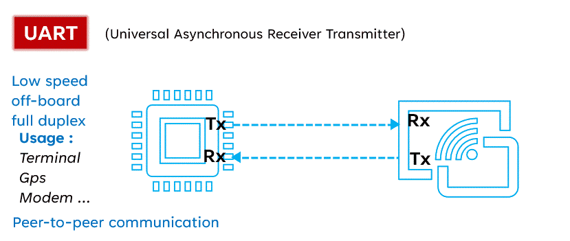
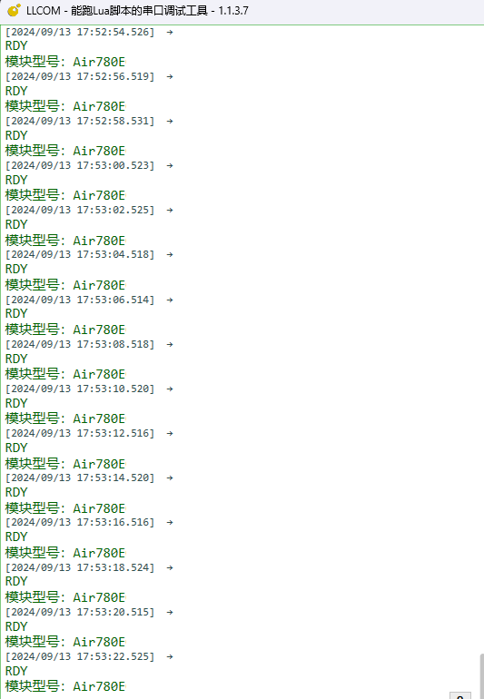

# 基本用法

## 介绍UART(串口)

UART（通用异步接收器/发送器）是一种串行通信协议，因其多功能性和简单性而被广泛使用。与 I2C 和 SPI 不同，UART 只需要两条线即可运行：TX（发送）和 RX（接收）。该协议允许异步通信，也就是说发送器和接收器之间无需共享时钟。数据被组织成数据包，每个数据包包含一个起始位、5 到 9 个数据位、一个可选的奇偶校验位和一个或两个停止位。

**优点**：

- 简单：UART通信协议相对简单，易于实现和调试。
- 适用性广泛：UART被广泛应用于各种设备之间的通信，具有较好的兼容性。
- 距离：UART通信距离较远，适用于需要长距离传输的场景。

**缺点**：

- 速度较低：UART通信速度相对较低，不适用于对速度要求较高的应用。
- 双工：UART通信是双工的，可以进行低速双工传输数据，进行数据的发送和接收。
- 不可靠：由于UART是异步通信，可能会受到噪声和干扰的影响，导致数据传输不可靠。

## 接线

780E模块上有2个通用串口，和1个输出DBG日志串口，本文内容包含对main_uart和aux_uart，这2个通用串口的使用方式。

| 模块引脚  |      模块      | 连接mcu或串口线  |
|----------|----------------|----------------|
|   18     |  main_uart_tx  |    uart_rx     |
|   17     |  main_uart_rx  |    uart_tx     |
|   29     |  aux_uart_tx   |    uart_rx     |
|   28     |  aux_uart_rx   |    uart_tx     |

## 一、初始化uart

### 1.1 使用MAIN_UART(uart1)串口

~~~lua
local uartid = 1 -- 使用uart1，可根据实际设备选取不同的uartid

--初始化 参数都可以根据实施情况修改
uart.setup(
    uartid,--串口id
    115200,--波特率
    8,--数据位
    1--停止位
)
~~~

### 1.2 使用AUX_UART(uart2)串口

~~~lua
local uartid = 2 -- 使用uart2

--初始化 参数都可以根据实施情况修改
uart.setup(
    uartid,--串口id
    115200,--波特率
    8,--数据位
    1--停止位
)
~~~

## 二、注册接收数据的回调函数

~~~lua
-- 收取数据会触发回调, 这里的"receive" 是固定值不要修改。
uart.on(uartid, "receive", function(id, len)
    local s = ""
    repeat
        s = uart.read(id, 128)
        if #s > 0 then -- #s 是取字符串的长度
            -- 关于收发hex值,请查阅 https://doc.openluat.com/article/583
            log.info("uart", "receive", id, #s, s)
            log.info("uart", "receive(hex)", id, #s, s:toHex())   -- 如果传输二进制/十六进制数据, 部分字符不可见, 不代表没收到，可以用以hex格式打印
        end
    until s == ""
end)
~~~

## 三、发送数据

### 发送普通字符串

~~~lua
uart.write(uartid, "\r\nRDY\r\n模块型号：" .. hmeta.model())
~~~

### 发送十六进制的数据串

~~~lua
uart.write(uartid, string.char(0x55,0xAA,0x4B,0x03,0x86))
~~~

### 通过zbuff的方式发送数据

~~~lua
local buff = zbuff.create(1024)
buff:copy(0, "aa:bb:cc:dd, zbuff!")
uart.tx(uartid, buff)
~~~

### 发送json格式的数据

~~~lua
local data =
{
    host = "abcdefg.com",
    port = "1883",
    clientID = "c88885",
    username = "user",
    password = "123456",
    ca_self = {ssl=false},
}

local jsondata = json.encode(data)
uart.write(uartid, jsondata)
~~~

## 四、完整例程

~~~lua
-- LuaTools需要PROJECT和VERSION这两个信息
PROJECT = "uart"
VERSION = "1.0.0"

log.info("main", PROJECT, VERSION)

-- 引入必要的库文件(lua编写), 内部库不需要require
sys = require("sys")

if wdt then
    --添加硬狗防止程序卡死，在支持的设备上启用这个功能
    wdt.init(9000)--初始化watchdog设置为9s
    sys.timerLoopStart(wdt.feed, 3000)--3s喂一次狗
end

log.info("main", "uart demo run......")

local uartid = 1 -- 根据实际设备选取不同的uartid

--初始化
uart.setup(
    uartid,--串口id
    115200,--波特率
    8,--数据位
    1--停止位
)

-- 收取数据会触发回调, 这里的"receive" 是固定值
uart.on(uartid, "receive", function(id, len)
    local s = ""
    repeat
        s = uart.read(id, 128)
        if #s > 0 then -- #s 是取字符串的长度
            -- 关于收发hex值,请查阅 https://doc.openluat.com/article/583
            log.info("uart", "receive", id, #s, s)
            -- log.info("uart", "receive", id, #s, s:toHex()) --如果传输二进制/十六进制数据, 部分字符不可见, 不代表没收到
        end
    until s == ""
end)

sys.taskinit(function()
    -- 循环两秒向串口发一次数据
    while true do
        sys.wait(2000)
        uart.write(uartid, "\r\nRDY\r\n模块型号：" .. hmeta.model())
    end
end)

-- 用户代码已结束---------------------------------------------
sys.run()
-- sys.run()之后后面不要加任何语句!!!!!
~~~

 

**代码运行结果**：

