## 一、串口（UART）概述

串口（UART，Universal Asynchronous Receiver/Transmitter，通用异步收发传输器）是一种广泛使用的硬件通信协议。它用于异步通信，即数据在每条线上分别发送，不需要时钟信号同步。数据被组织成数据包，每个数据包包含一个起始位、5 到 9 个数据位、一个可选的奇偶校验位和一个或两个停止位。UART 本身是一种硬件设备，用于实现异步串行通信。它通常用于计算机和微控制器之间的通信，以及许多嵌入式系统之间或与计算机的通信。

### 1.1 基本原理

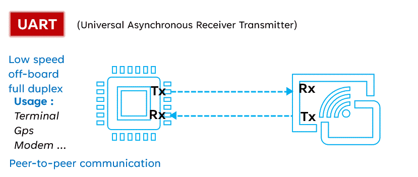

串口通信基于串行通信方式，数据一位一位地顺序传送。UART 通过两个信号线进行通信：

**TX（Transmitter，发送）**：用于发送数据。

**RX（Receiver，接收）**：用于接收数据。

在某些情况下，还会使用额外的信号线：

**GND（Ground，地）**：提供共同的参考点。

**RTS（Request To Send，请求发送）** 和 **CTS（Clear To Send，清除发送）**：用于流控制，以避免数据冲突。

**DTR（Data Terminal Ready，数据终端准备）** 和 **DSR（Data Set Ready，数据集准备）**：用于设备状态指示。

### 1.2 主要特性

- **异步性**：数据传输不依赖于统一的时钟信号，而是通过起始位、停止位和校验位来同步。
- **面向字符**：UART 传输的数据通常以字符为单位，每个字符之间通过起始位（通常是 1 位）分隔。
- **简单性**：UART 协议简单，容易实现，适合于多种设备和系统之间的通信。

### 1.3 关键参数

- **波特率（Baud Rate）**：表示每秒传输的符号数，是衡量串行通信速度的指标。
- **数据位（Data Bits）**：表示每个数据包中的位数，通常为 7 位或 8 位，有时也使用其他位数。
- **停止位（Stop Bits）**：表示数据位后面的停止位数量，通常是 1 位或 2 位。
- **校验位（Parity Bit）**：用于错误检测的一位，可以是奇校验或偶校验。

### 1.4 优点

- **简单：**UART 通信协议相对简单，易于实现和调试。
- **适用性广泛：**UART 被广泛应用于各种设备之间的通信，具有较好的兼容性。
- **距离：**UART 通信距离较远，适用于需要长距离传输的场景。

### 1.5 **缺点**

- **速度较低：**UART 通信速度相对较低，不适用于对速度要求较高的应用。
- **双工：**UART 通信是双工的，可以进行低速双工传输数据，进行数据的发送和接收。
- **不可靠：**由于 UART 是异步通信，可能会受到噪声和干扰的影响，导致数据传输不可靠。

## 二、演示功能概述

本文将演示如何在 Air780E 核心板上实现 UART（通用异步收发传输器）的通信。演示功能主要包括以下几个方面：

1. 初始化 UART：将介绍如何配置 UART 的波特率、数据位、停止位和校验位等参数，并初始化 UART。
2. 接收数据：将展示如何通过注册接收事件的回调函数来接收来自 UART 的数据，并处理接收到的数据。
3. 发送数据：将介绍如何使用 UART 的 API 接口来发送数据，包括发送普通字符串、十六进制数据和 JSON 格式的数据。
4. 单串口通信：将展示如何在 Air780E 核心板上实现单串口通信，包括配置和发送接收数据的步骤。
5. 多串口通信：将展示如何在 Air780E 核心板上实现多串口通信，包括配置和发送接收数据的步骤。
6. RS485 通信：将展示如何在 Air780E 核心板上实现 RS485 通信，包括配置和发送接收数据的步骤。
7. USB 虚拟串口：将介绍如何在 Air780E 核心板上使用 USB 虚拟串口进行通信，包括配置和发送接收数据的步骤。
8. UART 电平：将介绍 UART 电平的标准和如何在 Air780E 核心板上修改 UART 电平。

通过这些演示，大家可以了解如何在 Air780E 核心板上实现 UART 通信，包括初始化、接收和发送数据、以及实现单串口、多串口、RS485 和 USB 虚拟串口通信等。

## 三、演示硬件环境

### 3.1 开发板

本文以 **Air780E 核心板 **为例，如下图所示：

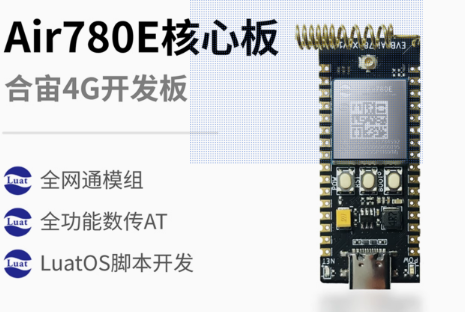

淘宝购买链接：[Air780E 核心板淘宝购买链接](https://item.taobao.com/item.htm?id=693774140934&pisk=f1eiwOqL25l1_HYiV6D1ize3wN5d5FMjRrpxkx3VT2uIHCCskWm4kysffAEqor4KRRIskGT0ooqi_coq7DWE000qbVr2mmzKQjNtkV3mnoalvaBRelZshA7RyTFdpD4xQco2_VS2Tcnvc89h5lZshq-pu_FUfEDVVdOmgrkET0ir3mkq_MDEmmM2QjJaY2uI0UGAoNueWRjiw4YTC-_opNr-zluaXleFpfR_X2fhTJVn94W--KJ4KcqQreCDEs3zNVh-DyWpIxqEmyc8savgoor7gX2D7GUzmW4jBJS2_4PTWjestFRZqA0iaRlwjdkIgW2nBR7XNkEn7bDL96_tMA4gN4GNOwa0xVU4IX8G4iReapZyhDSYLIOj_DinyhbSB2IHjbEhxMA51foIXaIhxItMPKJlyMjHNEGZAcQR.&spm=a1z10.5-c-s.w4002-24045920841.33.639f1fd1YrS4b6&skuId=5098266470883)

详细使用说明参考：[Air780E 产品手册](https://docs.openluat.com/air780e/product/) 中的 << 开发板 Core_Air780E 使用说明 VX.X.X.pdf>>，写这篇文章时最新版本的使用说明为：**开发板 Core_Air780E 使用说明 V1.0.5.pdf** ；若在使用过程中遇到任何问题，可以直接参考这份使用说明 PDF 文档。

### 3.2 SIM 卡

在中国大陆环境下，使用移动，电信，联通的物联网卡或者手机卡都可以。

### 3.3 PC 电脑

PC 电脑推荐使用 Windows10 及以上版本。

### 3.4 数据通信线

1\. USB 转 Type-C 数据线

> 它的一端是 USB 接口，另一端是 Type-C 接口。


2\. USB 转 TTL 工具或者串口线

> 由于本文教程与串口有关，所以需要大家准备 USB 转 TTL 工具或者串口线，例如 CH340、FT232 等。

本文教程使用的是高速串口板，此为 [购买链接](https://item.taobao.com/item.htm?abbucket=12&id=608773837508&ns=1&pisk=gM2iHHqsm5l_brOIlMk1i10xvtu0KhMj1rpxkx3VT2uBBjuA1rc0kyG4BAET-qz8omeTH-VBnuZbBGMAfAZshx7RyT30flMXYCX9M-DUY0oRHClZgl_9YxXdyTB8x1osHk78BxmiR0nJ3xlZ3HJERm027jzqTpoj8do2Qm8FxmgE3moZb9rEX0dwbqz2TkosVFJw3V8eLmiZ3qzq3wNH3424dJ7137Wg-79ewDcizluHEkVobUmAFmvVEJobxUri-MILKccirXCMP5waJoyTCX9V4DOeaos6hk_z6IOj_Diny1NpoPbGTvsPxMA51foIXaIhxIwWPKJlpMjHakGZAcEd.&priceTId=214640db17291600001397870eb48b&skuId=4449333351143&spm=a21n57.1.item.319.487c523c1WpDjW&utparam=%7B%22aplus_abtest%22%3A%22062f9b6c0e4cc9c5268b2350d8d11526%22%7D&xxc=taobaoSearch) ，店铺中也有 CH340，大家自行选择。
需要注意的是，该购买链接只是推荐，大家也可以多看看几个店铺。

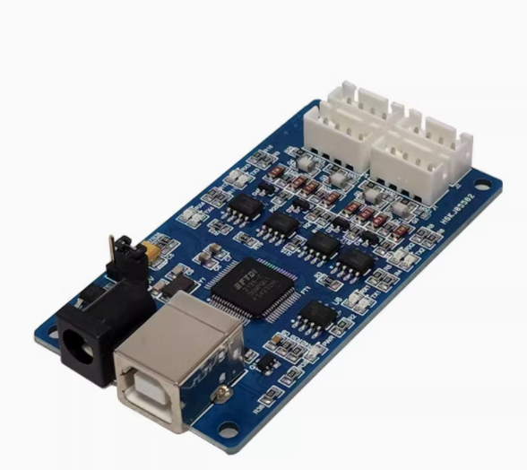

3\. TTL 转 RS485 模块

> 由于本文教程涉及 RS485 通信，所以需要大家准备 TTL 转 RS485 模块。此为 [购买链接](https://detail.tmall.com/item.htm?abbucket=12&id=609616777223&ns=1&pisk=gLXKHx20zP437xnZU4NMZ8jr2zM8JTIU-wSjEUYnNNQOVFDuYpVyeaLOzeAHdeDJegQPraIzY3T5PaLlt52cYMJyFrD8n-jFdIjEqwKBFCZW0nlQo2eMLk9yFr4-sYOUHL72yr86Vft673LSPH_WCGtJcLtWALZ953KqN2_WFlE92nhIALGI1AtHcLGWFXG6CnKqR2OWNFZ94FtWAwIYyFiBrYCrG93ClzqH4369vBLfXSHZIY8no3SQyYH5F1UpkM1rFY69vB6oCpj1vBf50IWHWg7fntB1gqbDlXZTXblyOhREzu-vEiT3WhL0v8hraCrwXEqtpbGSPS-9olYoabRNu&priceTId=2146402417291593304052114e5630&skuId=4387706588967&spm=a21n57.1.item.227.487c523c1WpDjW&utparam=%7B%22aplus_abtest%22%3A%229231e72621ac548ac3391f30d5d6a7e0%22%7D&xxc=taobaoSearch) 。

需要注意的是，该购买链接只是推荐，大家也可以多看看几个店铺。

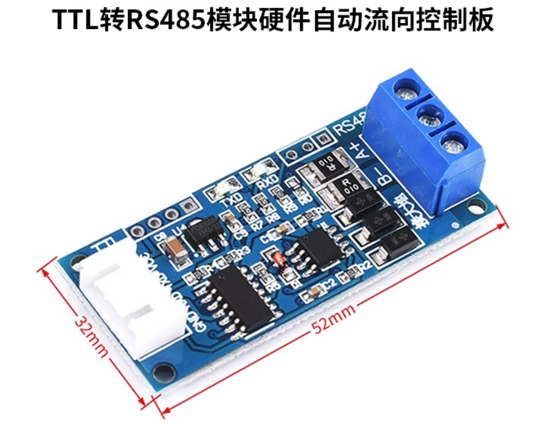

4\. USB 转 RS485 模块

> 由于本文教程涉及 RS485 通信，所以需要大家准备 USB 转 RS485 模块。此为 [购买链接](https://detail.tmall.com/item.htm?abbucket=12&id=607264051474&ns=1&pisk=gVgxhYTHQLvDgYCP7OtujFcN6d_9kVh2nxlCSR2cfYH-18bMgrxaWAe-Q-q0l-bTWfHZIAhwg5wsCAeim3Yngjza5pb9-ecqlkcVsxQ_hUO_tS6XKtLuuIaa5pvOqNZ2JPkUBp74GgN7U5e1CSM_PbNQTPN_GPO8F5FFftM_5Qd86WIfGPsfVaN0OPs_5ZZ5VWP1cSw1l7O8_8w1R2JTFswGWcSIktMB-Oe8E4FYDJGJvaby9WX3TjZfWa2vIowQ-8Q154FjahiyXwKgdDy0xjsrC20KPDWnKJsXwQINboNz0ORa9PcQnLF8KILObGrya7eHwZI1fOtUwJAuIGSa4v5..&priceTId=2146402417291592532647820e5630&skuId=4389943960595&spm=a21n57.1.item.183.487c523c1WpDjW&utparam=%7B%22aplus_abtest%22%3A%22586362286f857861f02862f21e75cde4%22%7D&xxc=taobaoSearch) 。

需要注意的是，该购买链接只是推荐，大家也可以多看看几个店铺。

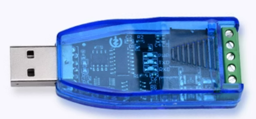

## 四、演示软件环境

### 4.1 Luatools 下载调试工具

Luatools 工具由合宙推出，支持最新固件获取、固件打包、trace 打印及单机烧录等功能。

工具使用说明参考：[Luatools 下载和详细使用](https://docs.openluat.com/Luatools/)

### 4.3 SSCOM 串口通信工具

> SSCOM 作为简单实用的串口通信助手工具，可以在计算机与设备之间建立串口通信连接，实现数据的发送与接收。

工具使用说明参考：[SSCOM 下载和详细说明](https://gitee.com/openLuat/luatos-doc-pool/blob/master/doc/%E5%BC%80%E5%8F%91%E5%B7%A5%E5%85%B7%E5%8F%8A%E4%BD%BF%E7%94%A8%E8%AF%B4%E6%98%8E/SSCOM%E4%B8%B2%E5%8F%A3%E8%B0%83%E8%AF%95%E5%B7%A5%E5%85%B7.md#https://gitee.com/link?target=https%3A%2F%2Fcdn.openluat-luatcommunity.openluat.com%2Fattachment%2F20240712154150770_sscom5131.zip)

### 4.3 源码及固件

1\. 底层 core 下载地址：[LuatOS 固件版本下载地址](https://docs.openluat.com/air780e/luatos/firmware/)

> 本 demo 使用的固件是 core_V1112 压缩包 内的 LuatOS-SoC_V1112_EC618_FULL.soc


2\. demo 位置

> 本 demo 为单串口的标准串口通信代码，其他脚本代码可下载下方压缩包查看。
>

demo 位置：[https://gitee.com/openLuat/LuatOS-Air780E/blob/master/demo/uart/main.lua](https://gitee.com/openLuat/LuatOS-Air780E/blob/master/demo/uart/main.lua)

3\. 源码及固件已打包压缩，如下所示

> 压缩包中 core 文件夹存放的是固件，code 文件夹存放的是脚本代码。
>
> 大家在使用脚本代码时一定要记得修改参数，至于修改什么参数，后面演示时会告诉大家。

[右键点我,另存为,下载完整压缩文件包](file/uart.zip)

## 五、软硬件资料

### 5.1 uart 库介绍

#### 5.1.1 主要功能介绍

uart 库即串口操作库，该库为内部库，因此在程序中使用时无需 require 调用。该库主要用于支持 UART（通用异步收发传输）功能，适用于一些嵌入式设备或平台。它使用 C 语言，并结合 Lua 脚本提供了一些 API 供用户方便地控制和操作串口。该库包含如下主要功能：

- 初始化、配置和管理多个串口设备，包括支持软件 UART。
- 发送和接收数据，支持串口的基本通信功能。
- 提供事件回调机制，用户可以注册接收和发送的数据处理函数。
- 允许用户检查串口的存在以及读取剩余数据缓存的大小。
- 支持 485 模式的特定操作及其管理。

#### 5.1.2 API 接口介绍

本教程所用 API 接口参考：[uart - 串口操作库 - 合宙文档中心](https://docs.openluat.com/air780e/luatos/api/core/uart/)

### 5.2 串口接线介绍

780E 模组支持 3 个串口，分别为主串口 MAIN_UART，扩展串口 AUX_UART，调试串口 DBG_UART。在使用串口时，默认将主串口 MAIN_UART 作为串口 1（UART1），扩展串口 AUX_UART 作为串口 2（UART2）。在本文中，将会使用到 UART1 和 UART2 。

#### 5.2.1 Air780 核心板串口管脚位置介绍

> Air780 核心板串口管脚位置如下图所示
> 其中有部分管脚可以复用成串口使用，此处不做介绍，请参考下方资料
> 关于 GPIO 如何复用参考：[LuatOS 固件下的 IO 复用配置 - LuatOS 文档](https://wiki.luatos.com/chips/air780e/iomux.html#gpio)
> GPIO 复用表参考： [Air780E 产品手册](https://docs.openluat.com/air780e/product/) 中的 《Air780E_GPIO_table_xxxx.pdf》

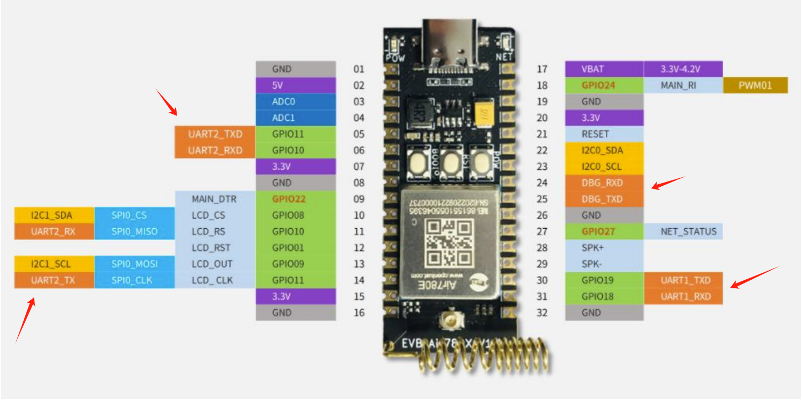

#### 5.2.2 串口接线说明

接下来进行接线操作，注意模块与 MCU 之间要交叉接线，即 TX 接 RX，RX 接 TX，GND 接 GND 。由于本文只需用到 MAIN_UART 和 AUX_UART 两个通用串口，因此下表中只列出了这两个通用串口的模块引脚编号及模块与 MCU 之间接线说明。

### 5.3 Air780E 核心板烧录说明

#### 5.3.1 选择固件和脚本

1\. 打开 Luatools 工具

2\. 点击 **项目管理测试**

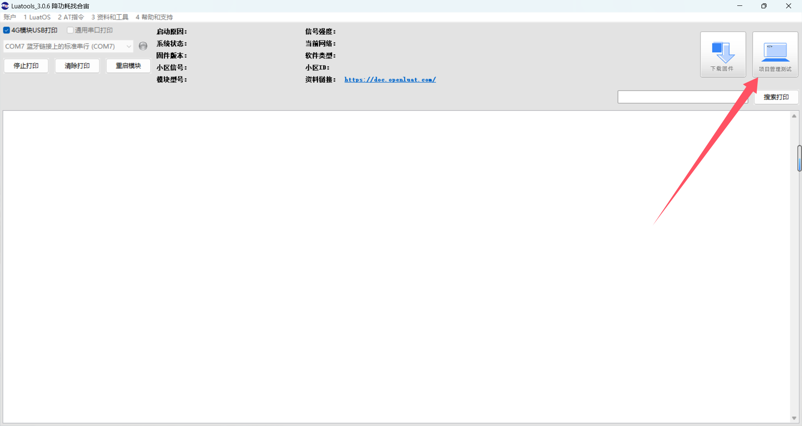

3\. 根据图示操作

> 注意，大家只需要跟着做到第四步即可，第五步跟着后面的操作再做。


#### 5.3.2 烧录

1\. 将 Air780E 核心板通过 USB 数据线连接至电脑，如下图所示：


2\. 根据下方操作进行烧录

> 此时就需要大家先点击 Luatools 工具上的 下载底层与脚本/下载脚本，再执行下方操作了。
> **开发板处于未开机状态：**此时先按住下载模式按键（BOOT 键）不放，再长按开机键（POW 键）开机，若不出意外开发板将会进入下载模式，Luatools 工具下载进度条会开始跑，这时便可以松开 BOOT 键和 POW 键，等到工具提示下载完成即可。
> **开发板已经处于开机状态：**此时可以先按住 BOOT 键不放，再短按复位键（RST 键）后开发板会重启并进入下载模式。

#### 5.3.3 不同模式下的端口显示

1\. 正常开机模式


2\. 下载模式


## 六、代码示例介绍

### 6.1 初始化

#### 6.1.1 单串口

> 大家任选其中一个就行，本文使用 MAIN_UART（ UART1 ）串口进行演示。

- 使用 MAIN_UART（ UART1 ）串口：
  ```lua
  local uartid = 1 -- 使用uart1，可根据实际设备选取不同的uartid
  
  --初始化 参数都可以根据实施情况修改
  uart.setup(
      uartid,--串口id
      115200,--波特率
      8,--数据位
      1--停止位
  )
  ```

- 使用AUX_UART（ UART2 ）串口：

	```lua
	local uartid = 2 -- 使用uart2
	
	--初始化 参数都可以根据实施情况修改
	uart.setup(
	    uartid,--串口id
	    115200,--波特率
	    8,--数据位
	    1--停止位
	)
	```

#### 6.1.2 多串口

> 本文以 MAIN_UART（ UART1 ） 和 AUX_UART（ UART2 ） 两个串口进行演示

```lua
-- 根据实际设备选取不同的uartid
local uartid1 = 1 -- 第一个串口id
local uartid2 = 2 -- 第二个串口id

-- 初始化第一个串口
uart.setup(
    uartid1,--串口id
    115200,--波特率
    8,--数据位
    1--停止位
)

-- 初始化第一个串口
uart.setup(
    uartid2,--串口id
    115200,--波特率
    8,--数据位
    1--停止位
)
```

#### 6.1.3 RS485 串口

```lua
local uartid = 1        -- 根据实际设备选取不同的uartid
local uart485Pin = 16   -- 用于控制485接收和发送的使能引脚

--初始化 
uart.setup(
    uartid,     -- 串口id
    9600,       -- 波特率
    8,          -- 数据位
    1,          -- 停止位
    uart.NONE,  -- 校验位
    uart.LSB,   -- 大小端，uart.LSB为小端，uart.MSB为大端
    1024,       -- 缓冲区大小 1024
    uart485Pin, -- 485转换的GPIO
    0,          -- 485模式rx方向的gpio的电平，默认0 低电平
    2000,       -- 485模式下tx向rx转换的延迟时间，单位us
    )
```

#### 6.1.4 USB 虚拟串口

```lua
local uartid = uart.VUART_0 -- 使用USB虚拟串口，固定id

--初始化 参数都可以根据实施情况修改
uart.setup(
    uartid,--串口id
    115200,--虚拟串口的波特率选择多少都无所谓
    8,--数据位
    1--停止位
)
```

### 6.2 注册接收数据的回调函数

> `uart.on` 函数用于注册一个接收事件的回调函数，当指定的串口 `uartid` 接收到数据时，该回调函数会被自动触发并执行。回调函数通过 `uart.on(uartid1, "receive", function(id, len) ... end)` 定义，并处理接收到的数据。数据的读取是通过 `uart.read()` 函数进行的，`uart.read()` 函数是非阻塞的，它是直接从现有缓存区中直接读取数据。

```lua
-- 收取数据会触发回调, 这里的 "receive" 是固定值不要修改。
uart.on(uartid, "receive", function(id, len)
    local s = ""
    repeat
        s = uart.read(id, 128)
        if #s > 0 then -- #s 是取字符串的长度
            -- 关于收发hex值,请查阅 https://doc.openluat.com/article/583
            log.info("uart", "receive", id, #s, s)
            log.info("uart", "receive(hex)", id, #s, s:toHex())   -- 如果传输二进制/十六进制数据, 部分字符不可见, 不代表没收到，可以用以hex格式打印
        end
    until s == ""
end)
```

### 6.3 发送数据

> 本文中字符串编码格式为 UTF-8 编码格式，SSCOM 串口调试工具无法正确显示字符串中的中文，需要注意。

- 发送普通字符串

	```lua
	uart.write(uartid, "\r\nRDY\r\n模块型号：" .. hmeta.model())
	```

- 发送十六进制的数据串

	```lua
	uart.write(uartid, string.char(0x55,0xAA,0x4B,0x03,0x86))
	```

- 通过zbuff的方式发送数据

	```lua
	local buff = zbuff.create(1024)
	buff:copy(0, "aa:bb:cc:dd, zbuff!")
	uart.tx(uartid, buff)
	```

- 发送json格式的数据

	```lua
	local data =
	{
	    host = "abcdefg.com",
	    port = "1883",
	    clientID = "c88885",
	    username = "user",
	    password = "123456",
	    ca_self = {ssl=false},
	}
	
	local jsondata = json.encode(data)
	uart.write(uartid, jsondata)
	```

## 七、功能验证

### 7.1 单串口

#### 7.1.1 完整例程

```lua
-- Luatools需要PROJECT和VERSION这两个信息
PROJECT = "uart"
VERSION = "1.0.0"

log.info("main", PROJECT, VERSION)

-- 引入必要的库文件(lua编写), 内部库不需要require
sys = require("sys")

if wdt then
    --添加硬狗防止程序卡死，在支持的设备上启用这个功能
    wdt.init(9000)--初始化watchdog设置为9s
    sys.timerLoopStart(wdt.feed, 3000)--3s喂一次狗
end

log.info("main", "uart demo run......")

local uartid = 1 -- 根据实际设备选取不同的uartid

--初始化
uart.setup(
    uartid,--串口id
    115200,--波特率
    8,--数据位
    1--停止位
)

-- 收取数据会触发回调, 这里的"receive" 是固定值
uart.on(uartid, "receive", function(id, len)
    local s = ""
    repeat
        s = uart.read(id, 128)
        if #s > 0 then -- #s 是取字符串的长度
            -- 关于收发hex值,请查阅 https://doc.openluat.com/article/583
            log.info("uart", "receive", id, #s, s)
            -- log.info("uart", "receive", id, #s, s:toHex()) --如果传输二进制/十六进制数据, 部分字符不可见, 不代表没收到
        end
    until s == ""
end)

sys.taskInit(function()
    -- 循环两秒向串口发一次数据
    while true do
        sys.wait(2000)
        uart.write(uartid, "\r\nRDY\r\n模块型号：" .. hmeta.model())
    end
end)

-- 用户代码已结束---------------------------------------------
sys.run()
-- sys.run()之后后面不要加任何语句!!!!!
```

#### 7.1.2 运行结果展示

> 由于 SSCOM 工具显示 UTF-8 编码格式的中文内容时会乱码，所以采用 HEX 显示方式进行演示。

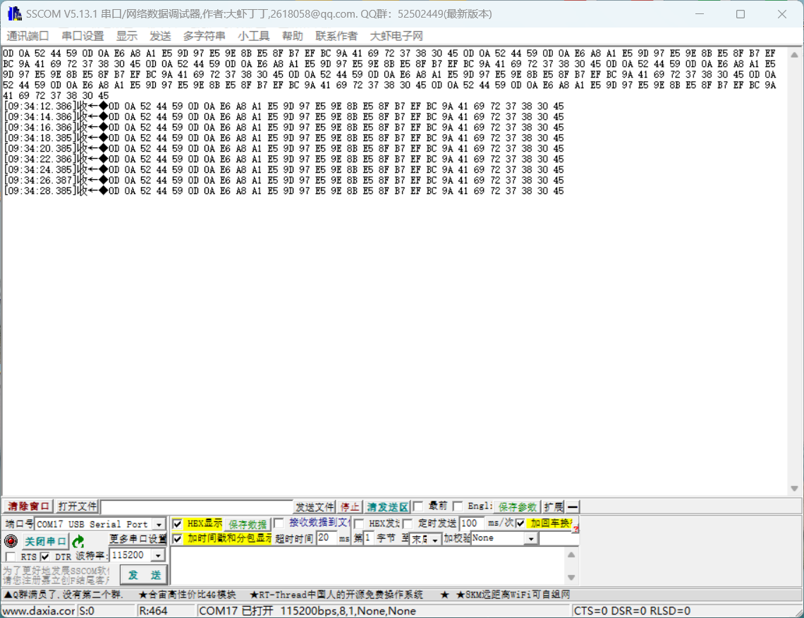

### 7.2 多串口

#### 7.2.1 完整例程

```lua
-- Luatools需要PROJECT和VERSION这两个信息
PROJECT = "uart_two"
VERSION = "1.0.0"

log.info("main", PROJECT, VERSION)

-- 引入必要的库文件(lua编写), 内部库不需要require
sys = require("sys")

if wdt then
    --添加硬狗防止程序卡死，在支持的设备上启用这个功能
    wdt.init(9000)--初始化watchdog设置为9s
    sys.timerLoopStart(wdt.feed, 3000)--3s喂一次狗
end

log.info("main", "uart_two demo run......")

-- 根据实际设备选取不同的uartid
local uartid1 = 1 -- 第一个串口id
local uartid2 = 2 -- 第二个串口id

-- 初始化第一个串口
uart.setup(
    uartid1,--串口id
    115200,--波特率
    8,--数据位
    1--停止位
)

-- 初始化第一个串口
uart.setup(
    uartid2,--串口id
    115200,--波特率
    8,--数据位
    1--停止位
)

-- 第一个串口接收数据回调函数
-- 收取数据会触发回调, 这里的"receive" 是固定值
uart.on(uartid1, "receive", function(id, len)
    local s = ""
    repeat
        s = uart.read(id, 128)
        if #s > 0 then -- #s 是取字符串的长度
            -- 关于收发hex值,请查阅 https://doc.openluat.com/article/583
            log.info("uart", "receive", id, #s, s)
            -- log.info("uart", "receive", id, #s, s:toHex()) --如果传输二进制/十六进制数据, 部分字符不可见, 不代表没收到
        end
    until s == ""
end)

-- 第二个串口接收数据回调函数
-- 收取数据会触发回调, 这里的"receive" 是固定值
uart.on(uartid2, "receive", function(id, len)
    local s = ""
    repeat
        s = uart.read(id, 128)
        if #s > 0 then -- #s 是取字符串的长度
            -- 关于收发hex值,请查阅 https://doc.openluat.com/article/583
            log.info("uart", "receive", id, #s, s)
            -- log.info("uart", "receive", id, #s, s:toHex()) --如果传输二进制/十六进制数据, 部分字符不可见, 不代表没收到
        end
    until s == ""
end)

sys.taskInit(function()
    -- 循环两秒分别向两个串口发一次数据
    while true do
        sys.wait(2000)
        uart.write(uartid1, "\r\nuartid1\r\nRDY\r\n模块型号：" .. hmeta.model())
        uart.write(uartid2, "\r\nuartid2\r\nRDY\r\n模块型号：" .. hmeta.model())
    end
end)

-- 用户代码已结束---------------------------------------------
sys.run()
-- sys.run()之后后面不要加任何语句!!!!!
```

#### 7.2.2 运行结果展示

> 由于 SSCOM 工具显示 UTF-8 编码格式的中文内容时会乱码，所以采用 HEX 显示方式进行演示。

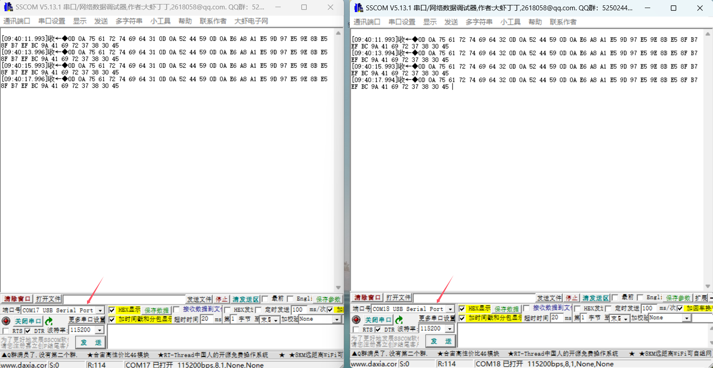

### 7.3 RS485 通信

#### 7.3.1 RS485 通信介绍

物联网（IoT）在工业场景中的应用越来越广泛，而 RS485 是一种常见的通信协议，广泛应用于工业自动化和物联网系统中。RS485 是一种串行通信标准，主要用于长距离、多节点通信。适用于工业环境中的传感器、执行器、控制器等设备之间的数据传输，且支持多点通信，可以连接多个设备，实现分布式控制。因为具有较好的抗干扰能力，也很适用于噪声环境下的通信。RS485 支持长距离传输，通常可达 1200 米，适用于工业现场中的远程监控和控制。

RS485 是一种半双工通信协议。半双工通信协议允许数据在两个方向上传输，但同一时间只能在一个方向上传输数据。在 RS485 通信中，当发送数据时，只能发送数据而不能接收数据；当接收数据时，只能接收数据而不能发送数据。

比如：在 RS485 通信中，通常使用一个引脚（如 A 或 RX ）作为发送引脚，另一个引脚（如 B 或 TX ）作为接收引脚。当发送数据时，发送引脚输出高电平或低电平，接收引脚不工作；当接收数据时，接收引脚输出高电平或低电平，发送引脚不工作。有的也有单独一根线专门用于控制收发逻辑，输出高低电平，负责管理 RS485 的通讯，包括发送、接收、处理错误等数据。

**优点**：

- 抗干扰能力强：RS485 采用差分信号传输，抗干扰能力强，适用于工业环境中的噪声干扰。
- 传输距离远：RS485 支持长距离传输，适用于工业现场中的远程监控和控制。
- 多节点通信：RS485 支持多点通信，可以连接多个设备，实现分布式控制。
- 兼容性好：RS485 是一种标准化的通信协议，具有较好的兼容性，可以与其他设备进行通信。
- 成本较低：RS485 模块和电缆的成本相对较低，适用于工业现场中的成本控制。

**缺点**：

- 信号衰减：随着距离的增加，信号衰减会加剧，影响通信质量。
- 速率限制：RS485 的传输速率相对较低，通常在 9600bps 到 115200bps 之间，适用于低速数据传输。
- 电气特性要求：RS485 对电气特性有较高的要求，需要使用特定的电缆和连接器。
- 布线复杂：RS485 需要使用双绞线进行布线，布线复杂度较高。

#### 7.3.2 接线展示

> 注意，下面的硬件使用的 RS485-TTL 为硬件自动转换，实际使用根据硬件设置去选择 gpio 转换或者硬件自动转换

需要注意，理论上是 TX 与 RX 交叉接线，如果是直接看板子丝印，那就需要 TX 接 TX，RX 接 RX。

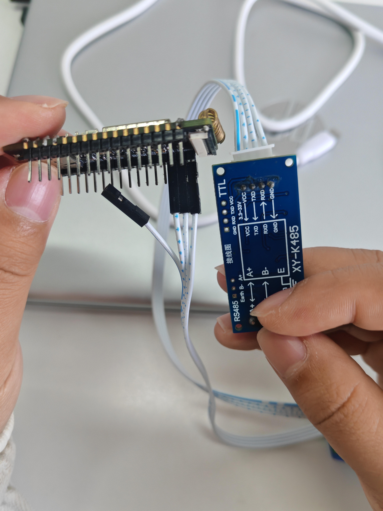

A 接 A，B 接 B。

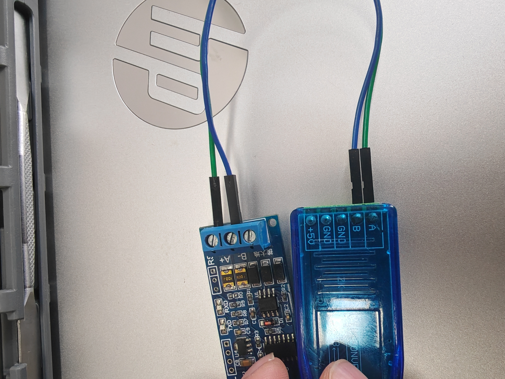

完整接线图：

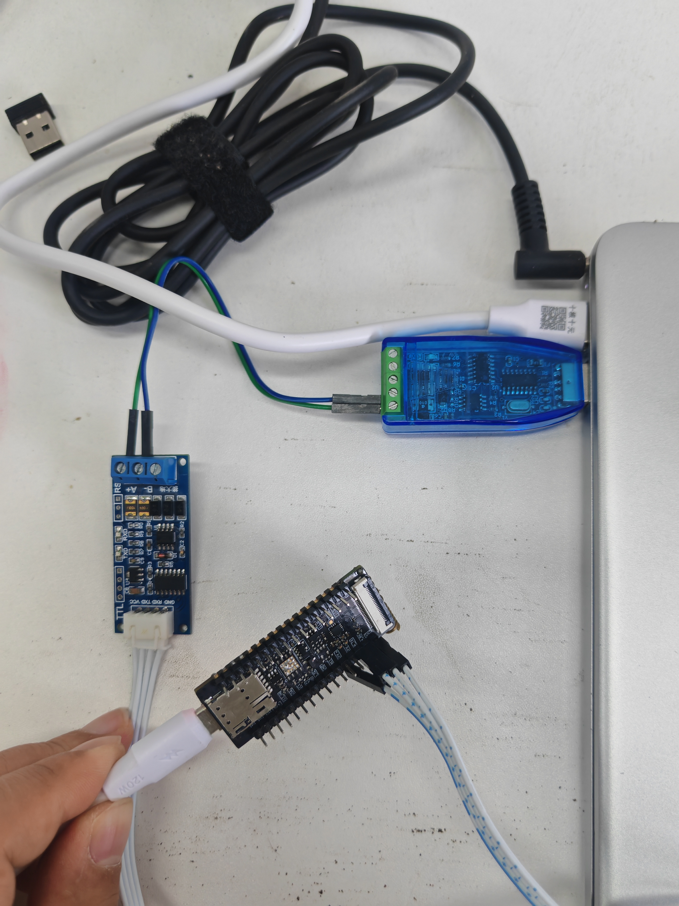

#### 7.3.2 完整例程

```lua
-- Luatools需要PROJECT和VERSION这两个信息
PROJECT = "uart"
VERSION = "1.0.0"

log.info("main", PROJECT, VERSION)

-- 引入必要的库文件(lua编写), 内部库不需要require
sys = require("sys")

if wdt then
    --添加硬狗防止程序卡死，在支持的设备上启用这个功能
    wdt.init(9000)--初始化watchdog设置为9s
    sys.timerLoopStart(wdt.feed, 3000)--3s喂一次狗
end

log.info("main", "uart demo run......")

local uartid = 1        -- 根据实际设备选取不同的uartid
local uart485Pin = 16   -- 用于控制485接收和发送的使能引脚

--初始化
uart.setup(uartid, 9600, 8, 1, uart.NONE, uart.LSB, 1024, uart485Pin, 0, 2000)

-- 收取数据会触发回调, 这里的"receive" 是固定值
uart.on(uartid, "receive", function(id, len)
    local s = ""
    repeat
        s = uart.read(id, 128)
        if #s > 0 then -- #s 是取字符串的长度
            -- 关于收发hex值,请查阅 https://doc.openluat.com/article/583
            log.info("uart", "receive", id, #s, s)
            -- log.info("uart", "receive", id, #s, s:toHex()) --如果传输二进制/十六进制数据, 部分字符不可见, 不代表没收到
        end
    until s == ""
end)

sys.taskInit(function()
    -- 循环两秒向串口发一次数据
    while true do
        sys.wait(2000)
        uart.write(uartid, "test data.")
    end
end)

-- 用户代码已结束---------------------------------------------
sys.run()
-- sys.run()之后后面不要加任何语句!!!!!
```

#### 7.3.3 运行结果展示

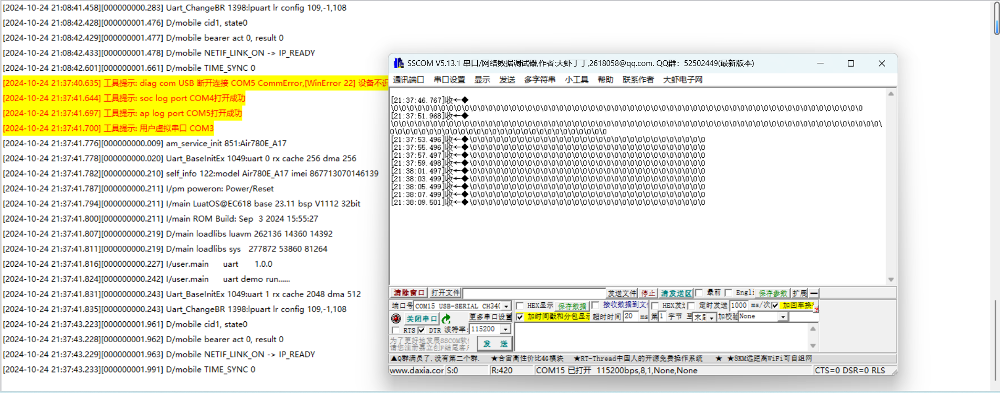

### 7.4 USB 虚拟串口

#### 7.4.1 USB 虚拟串口介绍

USB 虚拟串口是一种将 USB 接口转换为串行通信接口的技术。它允许计算机通过 USB 接口与其他设备进行串行通信，如调制解调器、打印机、扫描仪等。USB 虚拟串口通常由一个 USB 转串行适配器和一个驱动程序组成。

并且虚拟串口通常没有波特率要求，因为它们是软件模拟的串行通信接口，不依赖于物理硬件。然而，在实际应用中，虚拟串口仍然需要遵守一些基本的通信协议，比如数据位、停止位和校验位等。

USB 虚拟串口的主要功能包括：

- 串行通信：USB 虚拟串口可以模拟串行通信接口，实现数据的串行传输。它支持各种串行通信协议，如 RS-232、RS-485 等。
- 传输可靠：传统的串口连接线容易受到干扰，而 USB 虚拟串口采用的 USB 技术可以更好地抵抗干扰，提高了通信的可靠性。
- 串行控制：USB 虚拟串口可以控制串行通信参数，如波特率、数据位、停止位、奇偶校验等。它还支持串行通信的流控制和错误处理。
- 使用方便：USB 虚拟串口无需再使用传统的串口连接线，只需要一个标准的 USB 数据线即可连接计算机和外部设备，使得设备连接更加方便

USB 虚拟串口广泛应用于各种领域，如工业自动化、物联网、智能家居等。它为各种设备提供了便捷的串行通信解决方案，提高了系统的灵活性和可靠性。

#### 7.4.2 虚拟通讯串口-端口位置说明

首先通过带有 DM、DP 的 USB 数据线两端连接 模块 和 Windows10 或者 Windows11 系统的电脑。

然后将模块开机，就可以从电脑的设备管理器中看到端口处多出来 3 个 USB 端口。

找到"USB\VID_19D1&PID_0001&MI_06\7&17910EBA&0&0006"就是用于软件控制串口传输的 USB 虚拟串口。

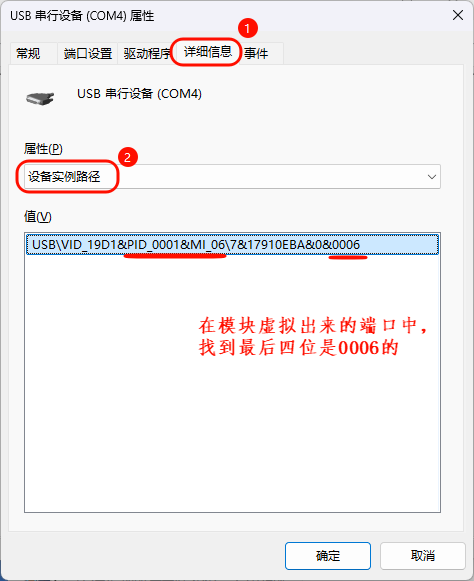


#### 7.4.3 完整例程

```lua
-- Luatools需要PROJECT和VERSION这两个信息
PROJECT = "uart"
VERSION = "1.0.0"

log.info("main", PROJECT, VERSION)

-- 引入必要的库文件(lua编写), 内部库不需要require
sys = require("sys")

if wdt then
    --添加硬狗防止程序卡死，在支持的设备上启用这个功能
    wdt.init(9000)--初始化watchdog设置为9s
    sys.timerLoopStart(wdt.feed, 3000)--3s喂一次狗
end

log.info("main", "uart demo run......")

local uartid = uart.VUART_0 -- 使用USB虚拟串口，固定id

--初始化
uart.setup(
    uartid,--串口id
    115200,--波特率
    8,--数据位
    1--停止位
)

-- 收取数据会触发回调, 这里的"receive" 是固定值
uart.on(uartid, "receive", function(id, len)
    local s = ""
    repeat
        s = uart.read(id, 128)
        if #s > 0 then -- #s 是取字符串的长度
            -- 关于收发hex值,请查阅 https://doc.openluat.com/article/583
            log.info("uart", "receive", id, #s, s)
            -- log.info("uart", "receive", id, #s, s:toHex()) --如果传输二进制/十六进制数据, 部分字符不可见, 不代表没收到
        end
    until s == ""
end)

sys.taskInit(function()
    local data =
    {
        host = "abcdefg.com",
        port = "1883",
        clientID = "c88885",
        username = "user",
        password = "123456",
        ca_self = {ssl=false},
    }
    local jsondata = json.encode(data)
    -- 循环每两秒向串口发一次数据
    while true do
        sys.wait(2000)
        uart.write(uartid, jsondata)
    end
end)

-- 用户代码已结束---------------------------------------------
sys.run()
-- sys.run()之后后面不要加任何语句!!!!!
```

#### 7.4.4 运行结果展示

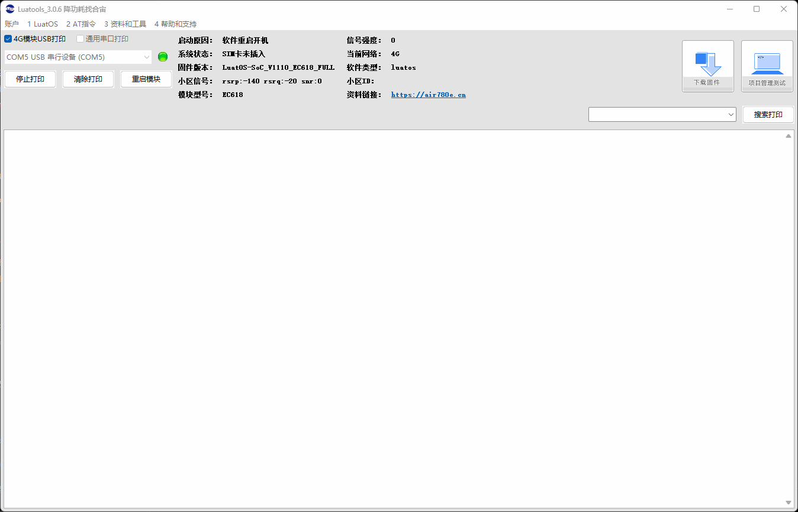

### 7.5 UART2 复用到另外一组管脚

#### 7.5.1 简介

780E 模块除了默认使用的 28/29 管脚可以作为 UART2 的串口通讯以外，UART2 功能也可以复用到另外两组管脚上使用。

#### 7.5.2 复用到 58/57 脚

软件在代码中，需要在串口初始化之前，执行 `mcu.iomux(mcu.UART, 2, 1)` ，这个函数接口可以将外设 IO 复用到非默认配置上。第 1 个参数表示外设类型，第 2 个参数为总线序号，第 3 个参数为新的配置，第 3 个参数需要根据具体平台决定。

```lua
mcu.iomux(mcu.UART, 2, 1)       -- Air780E的UART2复用到gpio12(58脚_RX)和gpio13(57脚_TX)
```

#### 7.5.3 复用到 55/56 脚

软件在代码中，需要在串口初始化之前，执行 `mcu.iomux(mcu.UART, 2, 2)` ，这个函数接口可以将外设 IO 复用到非默认配置上。第 1 个参数表示外设类型，第 2 个参数为总线序号，第 3 个参数为新的配置，第 3 个参数需要根据具体平台决定。

```lua
mcu.iomux(mcu.UART, 2, 2)       -- Air780E的UART2复用到gpio6(55脚_RX)和gpio7(56脚_TX)
```

#### 7.5.4 完整例程

```lua
-- Luatools需要PROJECT和VERSION这两个信息
PROJECT = "uart_mux"
VERSION = "1.0.0"

log.info("main", PROJECT, VERSION)

-- 引入必要的库文件(lua编写), 内部库不需要require
sys = require("sys")

if wdt then
    --添加硬狗防止程序卡死，在支持的设备上启用这个功能
    wdt.init(9000)--初始化watchdog设置为9s
    sys.timerLoopStart(wdt.feed, 3000)--3s喂一次狗
end

local uartid = 2 -- 根据实际设备选取不同的uartid

-- mcu.iomux(mcu.UART, 2, 1)       -- Air780E的UART2复用到gpio12(58脚_RX)和gpio13(57脚_TX)
mcu.iomux(mcu.UART, 2, 2)       -- Air780E的UART2复用到gpio6(55脚_RX)和gpio7(56脚_TX)

--初始化
uart.setup(
    uartid,--串口id
    115200,--波特率
    8,--数据位
    1--停止位
)

--循环发数据
sys.timerLoopStart(uart.write,3000, uartid, "test")

-- 收取数据会触发回调, 这里的"receive" 是固定值
uart.on(uartid, "receive", function(id, len)
    local data = ""
    while 1 do
        local tmp = uart.read(uartid)
        if not tmp or #tmp == 0 then
            break
        end
        data = data .. tmp
    end
    log.info("uart", "uart收到数据长度", #data)
end)

-- 用户代码已结束---------------------------------------------
-- 结尾总是这一句
sys.run()
-- sys.run()之后后面不要加任何语句!!!!!
```

#### 7.5.5 运行结果展示

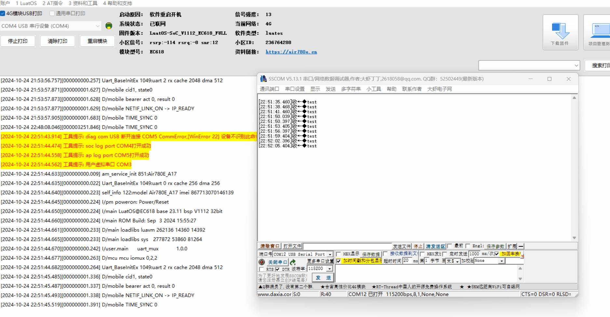

### 7.6 UART 电平

#### 7.6.1 UART 电平介绍

UART 电平是指串行通信中使用的电压电平标准。常见的串口电平标准有 RS-232、TTL 和 RS-485 等。

1\. RS-232 电平：RS-232 是一种常用的串口通信标准，它使用负逻辑电平，即逻辑 1 用 -3V 到 -15V 表示，逻辑 0 用 +3V 到 +15V 表示。RS-232 电平适用于短距离、低速率的通信。

2\. TTL 电平：TTL（Transistor-Transistor Logic）电平是一种常见的数字电路电平标准，它使用正逻辑电平，即逻辑 1 用 +5V 表示，逻辑 0 用 0V 表示。TTL 电平适用于短距离、高速率的通信。

3\. RS-485 电平：RS-485 是一种常用的串口通信标准，它使用差分电平，即逻辑 1 用 +2V 到 +6V 表示，逻辑 0 用 -2V 到 -6V 表示。RS-485 电平适用于长距离、高速率的通信。

在串口通信中，选择合适的电平标准非常重要，它直接影响到通信的可靠性和稳定性。

780E 模块的 UART IO 电压默认为 1.8V，如果不满足使用场景需要更改电压，那么有两种方式。

#### 7.6.2 默认 UART 电压如何修改

##### 7.6.2.1 通过软件调用接口

在 luatOS 开发中，开机时通过使用 `pm.ioVol()` 接口，可以实现更改串口的电压。下面是使用实例：

> 注意：软件通过接口设置的电压优先级要比硬件 iosel 引脚的要高。
> 例如：将 100 脚接 GND，但软件配置了 `pm.ioVol(pm.IOVOL_ALL_GPIO, 1800)` ，
> 那么在模块开机时 IO 高电平的电压首先会以硬件 3.3V 输出，然后执行到软件脚本上面配置的 `pm.ioVol()` 接口时，IO 电压最终会变为输出 1.8V 。

```lua
-- pm.ioVol接口第二个参数设置电压范围：(1650~2000，2650~3400) 单位毫伏
-- 接口调用位置可以放到task里面，也可以放在task外面
-- 切换成3.3v
pm.ioVol(pm.IOVOL_ALL_GPIO, 3300)    -- 所有GPIO高电平输出3.3V

-- 切换成1.8v
pm.ioVol(pm.IOVOL_ALL_GPIO, 1800)    -- 所有GPIO高电平输出1.8V
```

##### 7.6.2.2 通过硬件 iosel 引脚控制电压

780E 模块硬件中可通过 100 脚（io_sel），此脚悬空 IO 电平在开机时会变为 1.8V，如果接 GND 那模块在开机时 IO 电平就会变成 3.3V。

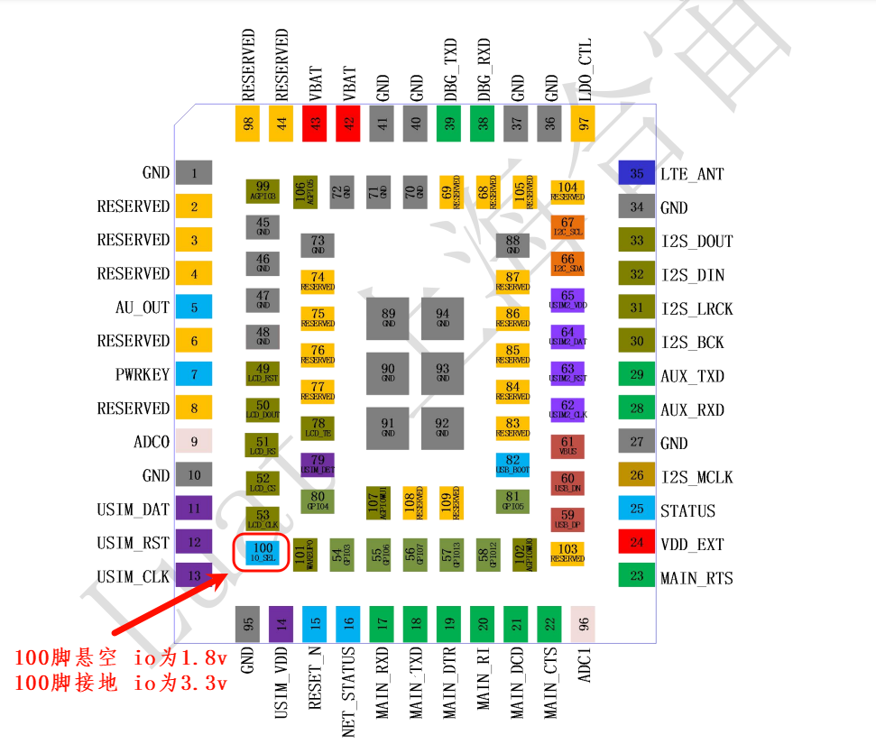

## 八、总结

本文将演示如何在 Air780E 核心板上实现 UART（通用异步收发传输器）的通信。

## 九、扩展

## 十、常见问题

1\. **串口电平电压过低或过高可能会导致什么问题？**

> 如果电压过低，可能会导致接收器无法正确识别信号，如果过高，可能会导致信号损坏或损坏接收器。
> 概述：可能会导致串口无法正常通讯，或通讯数据会突然出现乱码，数据错乱等问题。
>

2\. **有没有推荐的串口设计电路可以作为参考？**

> 有，请跳转至 [https://docs.openluat.com/air780e/luatos/hardware/design/uart1/](https://docs.openluat.com/air780e/luatos/hardware/design/uart1/) 查看
>

## 给读者的话

> 本篇文章由 `马梦阳` 开发；
>
>
>
> 本篇文章描述的内容，如果有错误、细节缺失、细节不清晰或者其他任何问题，总之就是无法解决您遇到的问题；
>
>
>
> 请登录[合宙技术交流论坛](https://chat.openluat.com/)，点击 [文档找错赢奖金-Air780E-LuatOS-软件指南-硬件驱动-UART](https://chat.openluat.com/#/page/matter?125=1849696170763485186&126=文档找错赢奖金-Air780E-LuatOS-软件指南-硬件驱动-UART&askid=1849696170763485186)
>
>
>
> 用截图标注 + 文字描述的方式跟帖回复，记录清楚您发现的问题；
>
>
>
> 我们会迅速核实并且修改文档；
>
>
>
> 同时也会为您累计找错积分，您还可能赢取月度找错奖金！
