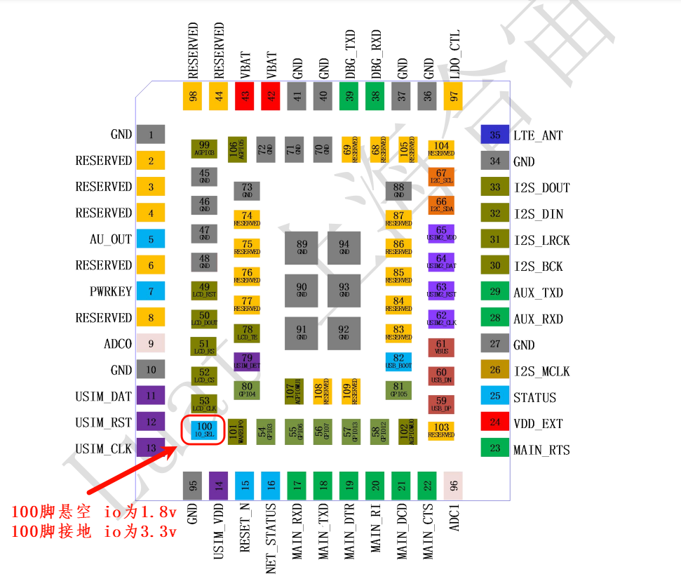

# UART电平

UART电平是指串行通信中使用的电压电平标准。常见的串口电平标准有RS-232、TTL和RS-485等。

1. RS-232电平：RS-232是一种常用的串口通信标准，它使用负逻辑电平，即逻辑1用-3V到-15V表示，逻辑0用+3V到+15V表示。RS-232电平适用于短距离、低速率的通信。

2. TTL电平：TTL（Transistor-Transistor Logic）电平是一种常见的数字电路电平标准，它使用正逻辑电平，即逻辑1用+5V表示，逻辑0用0V表示。TTL电平适用于短距离、高速率的通信。

3. RS-485电平：RS-485是一种常用的串口通信标准，它使用差分电平，即逻辑1用+2V到+6V表示，逻辑0用-2V到-6V表示。RS-485电平适用于长距离、高速率的通信。

在串口通信中，选择合适的电平标准非常重要，它直接影响到通信的可靠性和稳定性。

780E 模块的uart io电压默认为1.8v，如果不满足使用场景需要更改电压，那么有两种方式。

## 1.通过软件调用接口

在luatOS开发中，开机时通过使用pm.ioVol接口，可以实现更改串口的电压。下面是使用实例：

> 注意：软件通过接口设置的电压优先级要比硬件iosel引脚的要高。
> 例如：将100脚接GND，但软件配置了pm.ioVol(pm.IOVOL_ALL_GPIO, 1800)，
> 那么在模块开机时io高电平的电压首先会以硬件3.3v输出，然后执行到软件脚本上面配置的pm.ioVol接口时，io电压最终会变为输出1.8v。

~~~lua
-- pm.ioVol接口第二个参数设置电压范围：(1650~2000，2650~3400) 单位毫伏
-- 接口调用位置可以放到task里面，也可以放在task外面
-- 切换成3.3v
pm.ioVol(pm.IOVOL_ALL_GPIO, 3300)    -- 所有GPIO高电平输出3.3V

-- 切换成1.8v
pm.ioVol(pm.IOVOL_ALL_GPIO, 1800)    -- 所有GPIO高电平输出1.8V
~~~

## 2.通过硬件iosel引脚控制电压

780E模块硬件中可通过100脚（io_sel），此脚悬空io电平在开机时会变为1.8v，如果接GND 那模块在开机时io电平就会变成3.3v。

## 常见问题

1. **串口电平电压过低或过高可能会导致什么问题？**
    如果电压过低，可能会导致接收器无法正确识别信号，如果过高，可能会导致信号损坏或损坏接收器。
    概述：可能会导致串口无法正常通讯，或通讯数据会突然出现乱码，数据错乱等问题。

2. **有没有推荐的串口设计电路可以作为参考？**
    有，请跳转至 [https://docs.openluat.com/air780e/luatos/hardware/design/uart1/](https://docs.openluat.com/air780e/luatos/hardware/design/uart1/) 查看
