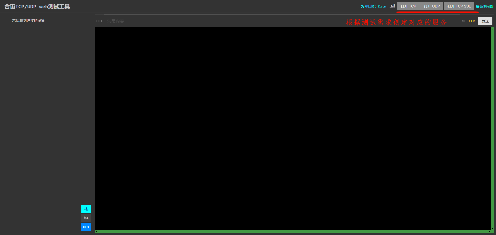

# UDP-UART透传

## 介绍

UDP-UART透传是一种将UDP数据流直接传输到UART接口的通信方式。它允许用户通过UDP连接将数据发送到远程设备，然后将这些数据通过UART接口发送到本地设备。这种通信方式在需要将远程设备的数据传输到本地设备时非常有用，例如在远程监控和远程控制系统中。

以下是UDP-UART透传的一些主要功能：

- 数据传输：UDP-UART透传可以将UDP数据流直接传输到UART接口，实现数据的实时传输。

- 远程控制：通过UDP-UART透传，用户可以在远程设备上控制本地设备，例如远程控制机器人、远程控制摄像头、远程控制开关等。

- 数据监控：UDP-UART透传可以将远程设备的数据传输到本地设备，实现数据的实时监控。

- 数据备份：UDP-UART透传可以将远程设备的数据传输到本地设备，实现数据的实时备份。

### TCP和UDP两种传输协议的区别

#### UDP协议

- 无连接的协议，数据传输之前不需要建立连接。数据包直接发送到目标地址，不保证数据包的顺序或完整性。
- 不保证数据包的顺序或完整性。它不提供确认机制，因此数据包可能会丢失、重复或乱序到达。
- 由于没有这些额外的开销，因此传输速度较快，适用于对时间敏感的应用，如视频流等。
- UDP头部较小（8字节），因此有效载荷较大，通常为65507字节（不包括IP头部）。
- 适用于对实时性要求高、对数据丢失不敏感的应用，如视频流、在线游戏、VoIP等。
- 支持广播和多播。

#### TCP协议

- 面向连接的协议，在数据传输之前必须建立连接。这意味着在发送数据之前，双方必须进行三次握手（SYN、SYN-ACK、ACK）
- 提供可靠的数据传输，确保数据包按顺序到达，并且没有数据丢失。它通过使用序列号、确认和重传机制来实现这一点。
- 由于需要额外的开销（如确认、重传等），因此传输速度相对较慢。
- 由于TCP头部较大（约20字节），因此有效载荷较小，通常为1460字节（不包括IP头部）。
- 适用于需要可靠传输的应用，如网页浏览、文件传输等。
- 不支持广播和多播。

## 串口需要做的准备

### 1.初始化串口

本文示例：串口使用MAIN_UART(uart1)

~~~lua
local uartid = 1 -- 使用uart1，可根据实际设备选取不同的uartid

--初始化 参数都可以根据实施情况修改
uart.setup(
    uartid,--串口id
    115200,--波特率
    8,--数据位
    1--停止位
)
~~~

### 2.注册接收数据的回调函数

这里使用uart.rx接口，和以zbuff的方式存储从uart1外部串口收到的数据。

~~~lua
local uart_rx_buff = zbuff.create(1024)      -- 串口接收到的数据

-- 收取数据会触发回调, 这里的"receive" 是固定值不要修改。
uart.on(uartid, "receive", function(id, len)
    while true do
        local len = uart.rx(id, uart_rx_buff)   -- 接收串口收到的数据，并赋值到uart_rx_buff
        if len <= 0 then    -- 接收到的字节长度为0 则退出
            break
        end
    end
end)
~~~

## UDP连接

### 1.建立UDP链接

如果没有验证UDP服务的测试环境，或者连接其他UDP服务器出现了问题，想要另外找一个服务器做对比。
那可以使用合宙自建的TCP/UDP测试服务器 [netlab.luatos.com](https://netlab.luatos.com/)

~~~lua
sys.taskInit(function()
    local d1Name = "UDP_TASK"
    local ip = "112.125.89.8"               -- 连接udp服务器的ip地址
    local port = 43618                      -- 连接udp服务器的端口
    -- 等待联网成功
    sys.waitUntil("IP_READY")                -- 等待联网成功
    netCB = socket.create(nil, taskName)     -- 创建socket对象
    socket.debug(netCB, true)                -- 打开调试日志
    socket.config(netCB, nil, true, nil)     -- 此配置为UDP连接，无SSL加密

    result = libnet.connect(d1Name, 15000, netCB, ip, port)
    if result then
        connect_state = true
    end
end)
~~~

### 2.UDP下行数据透传发送给串口

~~~lua
local rx_buff = zbuff.create(1024)
succ, param, _, _ = socket.rx(netCB, rx_buff)   -- 接收UDP数据
if not succ then
    log.info("服务器断开了", succ, param, ip, port)
    break
end

if rx_buff:used() > 0 then
    log.info("收到服务器数据，长度", rx_buff:used())
    
    uart.tx(uartid, rx_buff)    -- 从服务器收到的数据转发 从串口输出
    rx_buff:del()
end
~~~

### 3.串口的数据透传发送到UDP服务器

~~~lua
local tx_buff = zbuff.create(1024)      -- 发送至udp服务器的数据
tx_buff:copy(nil, uart_rx_buff)         -- 将 uart_rx_buff 串口数据赋值给udp待发送数据的 tx_buff 中
uart_rx_buff:del()                      -- 清除串口buff的数据长度
if tx_buff:used() > 0 then
    log.info("发送到服务器数据，长度", tx_buff:used())
    local result = libnet.tx(taskName, 0, netCB, tx_buff)   -- 发送数据
    if not result then
        log.info("发送失败了", result, param)
        break
    end
end
tx_buff:del()
~~~

## 完整示例

~~~lua
-- main.lua文件

-- LuaTools需要PROJECT和VERSION这两个信息
PROJECT = "uart_udp"
VERSION = "1.0.0"

log.info("main", PROJECT, VERSION)

-- 引入必要的库文件(lua编写), 内部库不需要require
sys = require("sys")

_G.sysplus = require("sysplus")
local taskName = "UDP_TASK"             -- sysplus库用到的任务名称，也作为任务id

if wdt then
    --添加硬狗防止程序卡死，在支持的设备上启用这个功能
    wdt.init(9000)--初始化watchdog设置为9s
    sys.timerLoopStart(wdt.feed, 3000)--3s喂一次狗
end

local uartid = 1 -- 根据实际设备选取不同的uartid
local uart_rx_buff = zbuff.create(1024)     -- 串口接收到的数据

local libnet = require "libnet"         -- libnet库，支持tcp、udp协议所用的同步阻塞接口
local ip = "112.125.89.8"               -- 连接udp服务器的ip地址
local port = 47205                      -- 连接udp服务器的端口
local netCB = nil                       -- socket服务的回调函数
local connect_state = false             -- 连接状态 true:已连接   false:未连接
local protocol = true                   -- 通讯协议 true:UDP协议  false:TCP协议
local ssl = false                       -- 加密传输 true:加密     false:不加密
local tx_buff = zbuff.create(1024)      -- 发送至udp服务器的数据
local rx_buff = zbuff.create(1024)      -- 从udp服务器接收到的数据

--初始化
uart.setup(
    uartid,--串口id
    115200,--波特率
    8,--数据位
    1--停止位
)

function UDP_TASK()
    -- 打印一下连接的目标ip和端口号
    log.info("connect ip: ", ip, "port:", port)

    sys.waitUntil("IP_READY")                -- 等待联网成功
    netCB = socket.create(nil, taskName)     -- 创建socket对象
    socket.debug(netCB, true)                -- 打开调试日志
    socket.config(netCB, nil, protocol, ssl)     -- 此配置为UDP连接，无SSL加密

    -- 串口和UDP服务器的交互逻辑
    while true do
        -- 连接服务器，返回是否连接成功
        result = libnet.connect(taskName, 15000, netCB, ip, port)

        -- 收取数据会触发回调, 这里的"receive" 是固定值不要修改。
        uart.on(uartid, "receive", function(id, len)
            while true do
                local len = uart.rx(id, uart_rx_buff)   -- 接收串口收到的数据，并赋值到uart_rx_buff
                if len <= 0 then    -- 接收到的字节长度为0 则退出
                    break
                end
                -- 如果已经在线了，则发送socket.EVENT消息来打断任务里的阻塞等待状态，让任务循环继续
                if connect_state then
                    sys_send(taskName, socket.EVENT, 0)
                end
            end
        end)

        -- 如果连接成功，则改变连接状态参数，并且随便发一条数据到服务器，看服务器能不能收到
        if result then
            connect_state = true
            libnet.tx(taskName, 0, netCB, "helloworld")
        end

        -- 连接上服务器后，等待处理接收服务器下行至模块的数据 和 发送串口的数据到服务器
        while result do
            succ, param, _, _ = socket.rx(netCB, rx_buff)   -- 接收数据
            if not succ then
                log.info("服务器断开了", succ, param, ip, port)
                break
            end

            if rx_buff:used() > 0 then
                log.info("收到服务器数据，长度", rx_buff:used())
                
                uart.tx(uartid, rx_buff)    -- 从服务器收到的数据转发 从串口输出
                rx_buff:del()
            end
            
            tx_buff:copy(nil, uart_rx_buff)         -- 将串口数据赋值给udp待发送数据的buff中
            uart_rx_buff:del()                      -- 清除串口buff的数据长度
            if tx_buff:used() > 0 then
                log.info("发送到服务器数据，长度", tx_buff:used())
                local result = libnet.tx(taskName, 0, netCB, tx_buff)   -- 发送数据
                if not result then
                    log.info("发送失败了", result, param)
                    break
                end
            end
            tx_buff:del()
            
            -- 如果zbuff对象长度超出，需要重新分配下空间
            if uart_rx_buff:len() > 1024 then
                uart_rx_buff:resize(1024)
            end
            if tx_buff:len() > 1024 then
                tx_buff:resize(1024)
            end
            if rx_buff:len() > 1024 then
                rx_buff:resize(1024)
            end
            log.info(rtos.meminfo("sys"))   -- 打印系统内存

            -- 阻塞等待新的消息到来，比如服务器下发，串口接收到数据
            result, param = libnet.wait(taskName, 15000, netCB)
            if not result then
                log.info("服务器断开了", result, param)
                break
            end
        end

        -- 服务器断开后的行动，由于while true的影响，所以会再次重新执行进行 重新连接。
        connect_state = false
        libnet.close(d1Name, 5000, netCB)
        tx_buff:clear(0)
        rx_buff:clear(0)
        sys.wait(1000)
    end

end

-- libnet库依赖于sysplus，所以只能通过sysplus.taskInitEx创建的任务函数中运行
sysplus.taskInitEx(UDP_TASK, taskName, netCB)

-- 用户代码已结束---------------------------------------------
-- 结尾总是这一句
sys.run()
-- sys.run()之后后面不要加任何语句!!!!!
~~~

 

**代码运行结果**：

