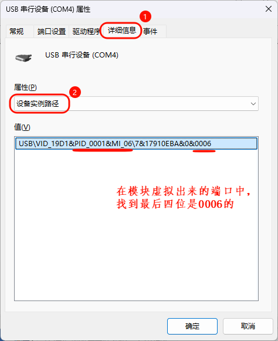
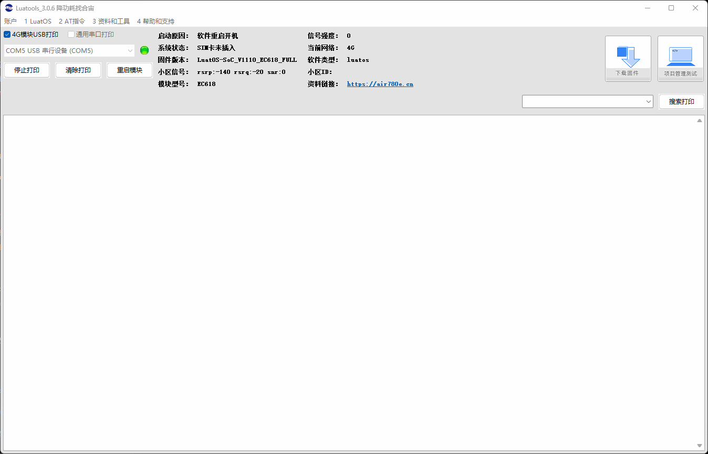

# USB虚拟串口

## 介绍

USB虚拟串口是一种将USB接口转换为串行通信接口的技术。它允许计算机通过USB接口与其他设备进行串行通信，如调制解调器、打印机、扫描仪等。USB虚拟串口通常由一个USB转串行适配器和一个驱动程序组成。

并且虚拟串口通常没有波特率要求，因为它们是软件模拟的串行通信接口，不依赖于物理硬件。然而，在实际应用中，虚拟串口仍然需要遵守一些基本的通信协议，比如数据位、停止位和校验位等。

USB虚拟串口的主要功能包括：

- 串行通信：USB虚拟串口可以模拟串行通信接口，实现数据的串行传输。它支持各种串行通信协议，如RS-232、RS-485等。

- 传输可靠：传统的串口连接线容易受到干扰，而USB虚拟串口采用的USB技术可以更好地抵抗干扰，提高了通信的可靠性。

- 串行控制：USB虚拟串口可以控制串行通信参数，如波特率、数据位、停止位、奇偶校验等。它还支持串行通信的流控制和错误处理。

- 使用方便：USB虚拟串口无需再使用传统的串口连接线，只需要一个标准的USB数据线即可连接计算机和外部设备，使得设备连接更加方便

USB虚拟串口广泛应用于各种领域，如工业自动化、物联网、智能家居等。它为各种设备提供了便捷的串行通信解决方案，提高了系统的灵活性和可靠性。

### 虚拟通讯串口-端口位置

首先通过带有DM、DP的USB数据线两端连接 模块 和 Windows10或者Windows11 系统的电脑。

然后将模块开机，就可以从电脑的设备管理器中看到端口处多出来3个USB端口。

找到"USB\VID_19D1&PID_0001&MI_06\7&17910EBA&0&0006"就是用于软件控制串口传输的usb虚拟串口。

## 一、初始化usb_uart

~~~lua
local uartid = uart.VUART_0 -- 使用USB虚拟串口，固定id

--初始化 参数都可以根据实施情况修改
uart.setup(
    uartid,--串口id
    115200,--虚拟串口的波特率选择多少都无所谓
    8,--数据位
    1--停止位
)
~~~

## 二、注册接收数据的回调函数

~~~lua
-- 收取数据会触发回调, 这里的"receive" 是固定值不要修改。
uart.on(uartid, "receive", function(id, len)
    local s = ""
    repeat
        s = uart.read(id, 128)
        if #s > 0 then -- #s 是取字符串的长度
            -- 关于收发hex值,请查阅 https://doc.openluat.com/article/583
            log.info("uart", "receive", id, #s, s)
            log.info("uart", "receive(hex)", id, #s, s:toHex())   -- 如果传输二进制/十六进制数据, 部分字符不可见, 不代表没收到，可以用以hex格式打印
        end
    until s == ""
end)
~~~

## 三、发送数据

### 发送普通字符串

~~~lua
uart.write(uartid, "\r\nRDY\r\n模块型号：" .. hmeta.model())
~~~

### 发送十六进制的数据串

~~~lua
uart.write(uartid, string.char(0x55,0xAA,0x4B,0x03,0x86))
~~~

### 通过zbuff的方式发送数据

~~~lua
local buff = zbuff.create(1024)
buff:copy(0, "aa:bb:cc:dd, zbuff!")
uart.tx(uartid, buff)
~~~

### 发送json格式的数据

~~~lua
local data =
{
    host = "abcdefg.com",
    port = "1883",
    clientID = "c88885",
    username = "user",
    password = "123456",
    ca_self = {ssl=false},
}

local jsondata = json.encode(data)
uart.write(uartid, jsondata)
~~~

## 四、完整例程

~~~lua
-- Luatools需要PROJECT和VERSION这两个信息
PROJECT = "uart"
VERSION = "1.0.0"

log.info("main", PROJECT, VERSION)

-- 引入必要的库文件(lua编写), 内部库不需要require
sys = require("sys")

if wdt then
    --添加硬狗防止程序卡死，在支持的设备上启用这个功能
    wdt.init(9000)--初始化watchdog设置为9s
    sys.timerLoopStart(wdt.feed, 3000)--3s喂一次狗
end

log.info("main", "uart demo run......")

local uartid = uart.VUART_0 -- 使用USB虚拟串口，固定id

--初始化
uart.setup(
    uartid,--串口id
    115200,--波特率
    8,--数据位
    1--停止位
)

-- 收取数据会触发回调, 这里的"receive" 是固定值
uart.on(uartid, "receive", function(id, len)
    local s = ""
    repeat
        s = uart.read(id, 128)
        if #s > 0 then -- #s 是取字符串的长度
            -- 关于收发hex值,请查阅 https://doc.openluat.com/article/583
            log.info("uart", "receive", id, #s, s)
            -- log.info("uart", "receive", id, #s, s:toHex()) --如果传输二进制/十六进制数据, 部分字符不可见, 不代表没收到
        end
    until s == ""
end)

sys.taskinit(function()
    local data =
    {
        host = "abcdefg.com",
        port = "1883",
        clientID = "c88885",
        username = "user",
        password = "123456",
        ca_self = {ssl=false},
    }
    local jsondata = json.encode(data)
    
    -- 循环每两秒向串口发一次数据
    while true do
        sys.wait(2000)
        uart.write(uartid, jsondata)
    end
end)

-- 用户代码已结束---------------------------------------------
sys.run()
-- sys.run()之后后面不要加任何语句!!!!!
~~~

 

**代码运行结果**：

