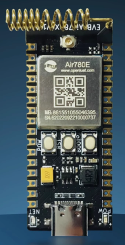

## 一、mobile 概述

### 简介

“4G mobile”指的是第四代移动通信技术，常用于描述通过 4G 网络进行的高速无线数据传输和通信。4G 网络最显著的特征是其高速数据传输能力。理论上，4G 可以提供下行速率高达 100Mbps（移动环境下）和上行速率达 50Mbps（静止或低速移动环境下）。

### 架构：

4G 网络采用了全 IP 网络架构，所有数据和语音通信都是通过 IP（Internet Protocol）传输的。相比之前的移动通信技术（如 2G 和 3G），4G 能够更有效地处理数据流量，尤其是用于互联网服务和多媒体应用。

### 采用技术：

4g 主要采用正交频分复用技术（OFDM）和多输入多输出技术（MIMO）。OFDM 将宽频带划分为多个窄频带，从而提高了频谱的利用效率，并减少了信号间的干扰。它使得 4G 能够在同样的频谱下传输更多的数据，并具有更强的抗干扰能力。多输入多输出（MIMO） 技术也广泛应用于 4G 网络中。MIMO 使用多个天线来同时发送和接收数据，增加了信号的容量和覆盖范围，显著提高了数据传输速率。

关于 4g mobile 技术更详细的使用说明，请参考：[https://zh.wikipedia.org/wiki/4G](https://zh.wikipedia.org/wiki/4G)

## 二、演示功能概述

本 demo 演示了查找和设置 mobile 频段，和获取相关参数。

## 三、准备硬件环境

### 3.1 开发板准备

1. 780E 核心板一个
2. 合宙 780E 核心板购买链接([https://item.taobao.com/item.htm?id=693774140934](https://item.taobao.com/item.htm?id=693774140934))
3. 此核心板的详细使用说明参考：[Air780E 产品手册](https://docs.openluat.com/air780e/product/) 中的《开发板Core_Air780E使用说明V1.0.5.pdf 》，核心板使用过程中遇到任何问题，可以直接参考这份使用说明 pdf 文档。



### 3.2 SIM 卡

请准备一张可正常上网的 SIM 卡，该卡可以是物联网卡或您的个人手机卡。

**特别提醒：**请确保 SIM 卡未欠费且网络功能正常，以便顺利进行后续操作。

### 3.3 数据通信线

typec 接口 USB 数据线即可。

### 3.4 PC 电脑

WINDOWS 系统。

## 四、准备软件环境

### 4.1 基本的下载调试工具

使用说明参考：[Luatools 下载和详细使用](https://docs.openluat.com/Luatools/) ；

## 五、mobile 的使用软硬件资料

### 5.1 常量消息

这里是发布的消息，可以使用 sys.waitUntil()或者 sys.subscribe()函数来获取消息是否发布。

| **常量**                                     | **类型**       | **解释**                                                                                                                                                                                                                                                                       |
| -------------------------------------------- | ------------- | ------------------------------------------------------------------------------------------------------------------------------------------------------------------------------------------------------------------------------------------------------------------------------- |
| mobile.UNREGISTER                            | number        | 未注册                                                                                                                                                                                                                                                                         |
| mobile.REGISTERED                            | number        | 已注册                                                                                                                                                                                                                                                                         |
| mobile.SEARCH                                | number        | 正在搜索中                                                                                                                                                                                                                                                                     |
| mobile.DENIED                                | number        | 注册被拒绝                                                                                                                                                                                                                                                                     |
| mobile.UNKNOW                                | number        | 未知                                                                                                                                                                                                                                                                           |
| mobile.REGISTERED_ROAMING                    | number        | 已注册,漫游                                                                                                                                                                                                                                                                    |
| mobile.SMS_ONLY_REGISTERED                   | number        | 已注册,仅 SMS                                                                                                                                                                                                                                                                  |
| mobile.SMS_ONLY_REGISTERED_ROAMING           | number        | 已注册,漫游,仅 SMS                                                                                                                                                                                                                                                             |
| mobile.EMERGENCY_REGISTERED                  | number        | 已注册,紧急服务                                                                                                                                                                                                                                                                |
| mobile.CSFB_NOT_PREFERRED_REGISTERED         | number        | 已注册,非主要服务                                                                                                                                                                                                                                                              |
| mobile.CSFB_NOT_PREFERRED_REGISTERED_ROAMING | number        | 已注册,非主要服务,漫游                                                                                                                                                                                                                                                         |
| mobile.CONF_RESELTOWEAKNCELL                 | number        | 小区重选信号差值门限,需要飞行模式设置                                                                                                                                                                                                                                          |
| mobile.CONF_STATICCONFIG                     | number        | 网络静态模式优化,需要飞行模式设置                                                                                                                                                                                                                                              |
| mobile.CONF_QUALITYFIRST                     | number        | 网络切换以信号质量优先,需要飞行模式设置,0 不开,1 开启,2 开启并加速切换,功耗会增加                                                                                                                                                                                              |
| mobile.CONF_USERDRXCYCLE                     | number        | LTE 跳 paging,需要飞行模式设置,谨慎使用,0 是不设置,1~7 增大或减小 DrxCycle 周期倍数,1:1/8 倍 2:1/4 倍 3:1/2 倍 4:2 倍 5:4 倍 6:8 倍 7:16 倍,8~12 配置固定的 DrxCycle 周期,仅当该周期大于网络分配的 DrxCycle 周期时该配置才会生效,8:320ms 9:640ms 10:1280ms 11:2560ms 12:5120ms |
| mobile.CONF_T3324MAXVALUE                    | number        | PSM 模式中的 T3324 时间,单位 S                                                                                                                                                                                                                                                 |
| mobile.CONF_PSM_MODE                         | number        | PSM 模式开关,0 关,1 开                                                                                                                                                                                                                                                         |
| mobile.CONF_CE_MODE                          | number        | attach 模式，0 为 EPS ONLY 2 为混合，遇到 IMSI detach 脱网问题，设置为 0，注意设置为 EPS ONLY 时会取消短信功能                                                                                                                                                                 |
| mobile.CONF_SIM_WC_MODE                      | number        | SIM 写入次数的配置和读取                                                                                                                                                                                                                                                       |
| mobile.CONF_FAKE_CELL_BARTIME                | number        | 伪基站禁止接入的时间，取值为 0 时取消，0xffff 永久                                                                                                                                                                                                                             |
| mobile.CONF_RESET_TO_FACTORY                 | number        | 删除已保存的协议栈参数，重启后会使用默认配置                                                                                                                                                                                                                                   |
| mobile.CONF_USB_ETHERNET                     | number        | 蜂窝网络模块的 usb 以太网卡控制，bit0 开关, 1开,0关，bit1 模式, 1NAT,0独立IP(在 usb 以太网卡开启前可以修改，开启过就不行)，bit2 协议 1ECM,0RNDIS，飞行模式里设置                                                                                                             |
| mobile.CONF_DISABLE_NCELL_MEAS               | number        | 关闭邻区测量 1 关，0 开，除了功耗测试外不建议使用                                                                                                                                                                                                                              |
| mobile.PIN_VERIFY                            | number        | 验证 PIN 码操作                                                                                                                                                                                                                                                                |
| mobile.PIN_CHANGE                            | number        | 更换 PIN 码操作                                                                                                                                                                                                                                                                |
| mobile.PIN_ENABLE                            | number        | 使能 PIN 码验证                                                                                                                                                                                                                                                                |
| mobile.PIN_DISABLE                           | number        | 关闭 PIN 码验证                                                                                                                                                                                                                                                                |
| mobile.PIN_UNBLOCK                           | number        | 解锁 PIN 码                                                                                                                                                                                                                                                                    |


### 5.2 源码和工具

- 780E模块使用固件：[SDK& Demo - 合宙文档中心](https://docs.openluat.com/air780e/luatos/firmware/)，本 demo 使用的固件版本是：LuatOS-SoC_V1112_EC618_FULL.soc
- 本教程使用的 demo：[https://gitee.com/openLuat/LuatOS-Air780E/tree/master/demo/mobile](https://gitee.com/openLuat/LuatOS-Air780E/tree/master/demo/mobile)
- 将固件和脚本烧录到模块中，使用说明参考：[Luatools 下载和详细使用](https://docs.openluat.com/Luatools/)
- 源码和固件已打包，如下所示：
[点我,下载完整压缩文件包](file/完整文件包.zip){:target="_blank"}
- [mobile-全部api地址](https://docs.openluat.com/air780e/luatos/api/core/mobile/)，如果只看本demo的api直接看下面的`5.3 demo使用api介绍`即可。

### 5.3 demo使用api介绍

#### mobile.status()

作用：获取网络状态。

**参数：**

无

**返回值：**

| **返回值类型** | **解释**               |
| -------------- | ---------------------- |
| int            | 当前网络状态           |

---

#### mobile.getBand(band, is_default)

作用：获取当前使用/支持的 band

**参数：**

| **参数**     | **传入值类型** | **解释**                                                              |
| ------------ | -------------- | --------------------------------------------------------------------- |
| band         | zbuff          | 输出 band                                                            |
| is_default   | boolean        | true 默认支持，false 当前支持的，默认是 false，当前是预留功能，不要写 true |

**返回值：**

| **返回值类型** | **解释**                   |
| -------------- | -------------------------- |
| boolean        | 成功返回 true，失败返回 false |

---

#### mobile.setBand(band, num)

作用：设置使用的 band

**参数：**

| **参数** | **传入值类型** | **解释**              |
| -------- | -------------- | --------------------- |
| band     | zbuff          | 输入使用的 band       |
| num      | int            | band 数量             |

**返回值：**

| **返回值类型** | **解释**                   |
| -------------- | -------------------------- |
| boolean        | 成功返回 true，失败返回 false |

---

#### mobile.flymode(index, enable)

作用：进出飞行模式

**参数：**

| **参数** | **传入值类型** | **解释**                                                       |
| -------- | -------------- | -------------------------------------------------------------- |
| index    | int            | 编号，默认 0。在支持双卡的模块上才会出现 0 或 1 的情况         |
| enable   | bool           | 是否设置为飞行模式，true 为设置，false 为退出，可选            |

**返回值：**

| **返回值类型** | **解释**               |
| -------------- | ---------------------- |
| boolean        | 原飞行模式的状态       |

---

#### mobile.vsimOnOff(enable)

作用：切换内置虚拟卡和外置实体卡

**参数：**

| **参数** | **传入值类型** | **解释**                  |
| -------- | -------------- | ------------------------- |
| enable   | bool           | true 开启，false 关闭     |

**返回值：**

| **返回值类型** | **解释**               |
| -------------- | ---------------------- |
| nil            | 无返回值               |

---

#### mobile.rtime(time, auto_reset_stack, data_first)

作用：设置 RRC 自动释放时间间隔

**参数：**

| **参数**           | **传入值类型** | **解释**                                                                                                                                                                                                                                  |
| ------------------ | -------------- | ------------------------------------------------------------------------------------------------------------------------------------------------------------------------------------------------------------------------------------------ |
| time              | int            | RRC 自动释放时间，等同于 Air724 的 AT+RTIME，单位秒，写 0 或者不写则是停用，不要超过 20 秒                                                                                                           |
| auto_reset_stack  | boolean        | 网络遇到严重故障时尝试自动恢复，与飞行模式/SIM 卡切换冲突，true 开启，false 关闭。本参数于 2023 年 9 月 14 日已废弃。                                               |
| data_first        | boolean        | 是否启用数据传输优化，true 启用，false 关闭，开启后在 ACK 或超时失败时才允许 RRC 提前释放。此功能于 2024 年 8 月 12 日启用。                          |

**返回值：**

| **返回值类型** | **解释**               |
| -------------- | ---------------------- |
| nil            | 无返回值               |

---

#### mobile.setAuto(check_sim_period, get_cell_period, search_cell_time, auto_reset_stack, network_check_period)

作用：设置一些辅助周期性或自动功能

**参数：**

| **参数**             | **传入值类型** | **解释**                                                                                                          |
| -------------------- | -------------- | ----------------------------------------------------------------------------------------------------------------- |
| check_sim_period     | int            | SIM 卡自动恢复时间，单位毫秒，建议 5000~10000。写 0 或不写则关闭功能                                             |
| get_cell_period      | int            | 周期性获取小区信息的时间间隔，单位毫秒。写 0 或不写则关闭功能                                                     |
| search_cell_time     | int            | 每次搜索小区时最大搜索时间，单位秒，不要超过 8 秒                                                                |
| auto_reset_stack     | boolean        | 网络故障时尝试自动恢复，和飞行模式/SIM 卡切换冲突，true 开启，false 关闭                                         |
| network_check_period | int            | 设置定时检测网络是否正常的间隔，单位毫秒，建议 60000 以上，留空则不做更改。                                       |

**返回值：**

| **返回值类型** | **解释**               |
| -------------- | ---------------------- |
| nil            | 无返回值               |

---

#### mobile.imei(index)

作用：获取 IMEI。

**参数：**

| **参数** | **传入值类型** | **解释**                                                       |
| -------- | -------------- | ---------------------------------------------------------------- |
| index    | int            | 编号，默认 0。支持双卡模块上才会出现 0 或 1 的情况               |

**返回值：**

| **返回值类型** | **解释**                         |
| -------------- | -------------------------------- |
| string         | 当前的 IMEI 值，失败返回 nil      |

---

#### mobile.imsi(index)

作用：获取 IMSI。

**参数：**

| **参数** | **传入值类型** | **解释**                                                       |
| -------- | -------------- | ---------------------------------------------------------------- |
| index    | int            | 编号，默认 0。支持双卡模块上才会出现 0 或 1 的情况               |

**返回值：**

| **返回值类型** | **解释**                         |
| -------------- | -------------------------------- |
| string         | 当前的 IMSI 值，失败返回 nil      |

---

#### mobile.iccid(id)

作用：获取或设置 ICCID。

**参数：**

| **参数** | **传入值类型** | **解释**                     |
| -------- | -------------- | ---------------------------- |
| id       | int            | SIM 卡的编号，例如 0，1，默认 0 |

**返回值：**

| **返回值类型** | **解释**                         |
| -------------- | -------------------------------- |
| string         | ICCID 值，失败返回 nil           |

---

#### mobile.csq()

作用：获取 CSQ。

**参数：**

无

**返回值：**

| **返回值类型** | **解释**                                                               |
| -------------- | ---------------------------------------------------------------------- |
| int            | 当前 CSQ 值，失败返回 0。范围 0 - 31，值越大越好                        |

---

#### mobile.rssi()

作用：获取 RSSI。

**参数：**

无

**返回值：**

| **返回值类型** | **解释**                                                                 |
| -------------- | ------------------------------------------------------------------------ |
| int            | 当前 RSSI 值，失败返回 0。范围 0 到 -114，值越小越好                      |

---

#### mobile.rsrp()

作用：获取 RSRP（参考信号接收功率）。

**参数：**

无

**返回值：**

| **返回值类型** | **解释**                                                                 |
| -------------- | ------------------------------------------------------------------------ |
| int            | 当前 RSRP 值，失败返回 0。取值范围 -44 ~ -140，值越大越好                  |

---

#### mobile.rsrq()

作用：获取 RSRQ（参考信号发送功率）。

**参数：**

无

**返回值：**

| **返回值类型** | **解释**                                                                 |
| -------------- | ------------------------------------------------------------------------ |
| int            | 当前 RSRQ 值，失败返回 0。取值范围 -3 ~ -19.5，值越大越好                 |

---

#### mobile.snr()

作用：获取 SNR（信噪比）。

**参数：**

无

**返回值：**

| **返回值类型** | **解释**                                                               |
| -------------- | ---------------------------------------------------------------------- |
| int            | 当前 SNR 值，失败返回 0。范围 0 - 30，值越大越好                        |

---

#### mobile.simid(id, prefer_sim0)

作用：获取当前 SIM 卡槽或切换卡槽。

**参数：**

| **参数**     | **传入值类型** | **解释**                                                                                                                   |
| ------------ | -------------- | -------------------------------------------------------------------------------------------------------------------------- |
| id           | int            | SIM 卡的编号，例如 0，1。支持双卡模块可填 2 自适应，但会占用特定 IO 口。如果不填，默认读取当前卡槽                          |
| prefer_sim0  | boolean        | 是否优先使用 SIM0，仅在 SIM 卡编号为 2 时有效。true 表示优先使用 SIM0，false 表示按平台默认设置，必须开机时配置才能有效      |

**返回值：**

| **返回值类型** | **解释**                                  |
| -------------- | ----------------------------------------- |
| int            | 当前 SIM 卡槽编号，失败返回 -1            |

---

#### mobile.apn(index, cid, new_apn_name, user_name, password, ip_type, protocol, delete_apn)

作用：获取或设置 APN。

**参数：**

| **参数**         | **传入值类型** | **解释**                                                                                                                                                    |
| ---------------- | -------------- | ----------------------------------------------------------------------------------------------------------------------------------------------------------- |
| index           | int            | 编号，默认 0。支持双卡的模块上才会出现 0 或 1 的情况                                                                                                        |
| cid             | int            | CID，默认 0。如果要使用非默认 APN 激活，必须大于 0                                                                                                         |
| new_apn_name    | string         | 新的 APN 名称，不填表示获取 APN，填入表示设置 APN，设置是否支持取决于底层实现                                                                             |
| user_name       | string         | 新的 APN 的用户名，如果 APN 不为空，必须填写。如果没有则留空 ""；如果 APN 为空，则可为 nil                                                              |
| password        | string         | 新的 APN 的密码，同上                                                                                                                                    |
| ip_type         | int            | 激活 APN 时的 IP 类型，1=IPv4，2=IPv6，3=IPv4v6，默认 1                                                                                                   |
| protocol        | int            | APN 鉴权协议类型，0 表示无，1= PAP，2=CHAP，3=自动选择，默认 3。一般无用户名密码时填 0，有时填 3。如果不行可尝试 1 或 2  |
| delete_apn      | boolean        | 是否删除 APN，仅当参数 new_apn_name 不为 string 时有效                                                                                                       |

**返回值：**

| **返回值类型** | **解释**                             |
| -------------- | ------------------------------------ |
| string         | 获取到的默认 APN 值，失败返回 nil    |

---

#### mobile.scell()

作用：获取当前服务小区的详细信息。

**参数：**

无

**返回值：**

| **返回值类型** | **解释**                             |
| -------------- | ------------------------------------ |
| table          | 服务小区的详细信息                   |

---

#### mobile.getCellInfo()

作用：获取基站信息。

**参数：**

无

**返回值：**

| **返回值类型** | **解释**                             |
| -------------- | ------------------------------------ |
| table          | 包含基站数据的数组                   |

---

#### mobile.config(item, value)

作用：网络特殊配置。

**参数：**

| **参数** | **传入值类型** | **解释**                                  |
| -------- | -------------- | ----------------------------------------- |
| item     | int            | 配置项目，参照 mobile.CONF_XXX            |
| value    | int            | 配置值，依据具体配置的 item 决定          |

**返回值：**

| **返回值类型** | **解释**                             |
| -------------- | ------------------------------------ |
| boolean        | 是否配置成功                         |

---

#### mobile.reqCellInfo(timeout)

作用：发起基站信息查询，包含临近小区信息。

**参数：**

| **参数**  | **传入值类型** | **解释**                                          |
| --------- | -------------- | ------------------------------------------------- |
| timeout   | int            | 超时时长，单位秒，默认 15，范围 5 - 60            |

**返回值：**

| **返回值类型** | **解释**                             |
| -------------- | ------------------------------------ |
| nil            | 无返回值                             |

---

#### mobile.number(id)

作用：获取手机卡号。

**参数：**

| **参数** | **传入值类型** | **解释**                     |
| -------- | -------------- | ---------------------------- |
| id       | int            | SIM 卡的编号，例如 0，1，默认 0 |

**返回值：**

| **返回值类型** | **解释**                             |
| -------------- | ------------------------------------ |
| string         | 手机卡号，失败返回 nil               |


## 六、代码示例介绍

### 6.1 查询 mobile 的 band 和 iccid 和 csq 等信息。

#### 6.1.1 查询、更改、和恢复 band 的设置

```lua
log.info("status", mobile.status())
    local band = zbuff.create(40)
    local band1 = zbuff.create(40)
    mobile.getBand(band)
    log.info("当前使用的band:")
    for i=0,band:used()-1 do
        log.info("band", band[i])
    end
    band1[0] = 38
    band1[1] = 39
    band1[2] = 40
    mobile.setBand(band1, 3)    --改成使用38,39,40
    band1:clear()
    mobile.getBand(band1)
    log.info("修改后使用的band:")
    for i=0,band1:used()-1 do
        log.info("band", band1[i])
    end
    mobile.setBand(band, band:used())    --改回原先使用的band，也可以下载的时候选择清除fs

    mobile.getBand(band1)
    log.info("修改回默认使用的band:")
    for i=0,band1:used()-1 do
        log.info("band", band1[i])
    end
```

#### 6.1.2 查询 mobile 相关数据

```lua
log.info("imei", mobile.imei())
        log.info("imsi", mobile.imsi())
        local sn = mobile.sn()
        if sn then
            log.info("sn",   sn:toHex())
        end
        log.info("status", mobile.status())


        log.info("iccid", mobile.iccid())
        log.info("csq", mobile.csq()) -- 4G模块的CSQ并不能完全代表强度
        log.info("rssi", mobile.rssi()) -- 需要综合rssi/rsrq/rsrp/snr一起判断
        log.info("rsrq", mobile.rsrq())
        log.info("rsrp", mobile.rsrp())
        log.info("snr", mobile.snr())
        log.info("simid", mobile.simid()) -- 这里是获取当前SIM卡槽
        log.info("apn", mobile.apn(0,1))
        log.info("ip", socket.localIP())
        log.info("lua", rtos.meminfo())
        -- sys内存
        log.info("sys", rtos.meminfo("sys"))
```

#### 6.1.3 订阅查询的信息：

```lua
-- 订阅式, 模块本身会周期性查询基站信息,但通常不包含临近小区
sys.subscribe("SCELL_INFO", function()
    log.info("cell", json.encode(mobile.scell()))
end)
-- 基站数据的查询

-- 订阅式, 模块本身会周期性查询基站信息,但通常不包含临近小区
sys.subscribe("CELL_INFO_UPDATE", function()
    log.info("cell", json.encode(mobile.getCellInfo()))
end)
```

#### 6.1.4 轮询搜索小区信息

```lua
-- 轮询式, 包含临近小区信息，这是手动搜索，和上面的自动搜索冲突，开启一个就行
sys.taskInit(function()
    sys.wait(5000)
    mobile.config(mobile.CONF_SIM_WC_MODE, 2)
    while 1 do
        mobile.reqCellInfo(10)
        sys.wait(11000)
        log.info("cell", json.encode(mobile.getCellInfo()))
        mobile.config(mobile.CONF_SIM_WC_MODE, 2)
    end
end)
```

#### 6.1.5 获取 SIM 卡状态

```lua
-- 获取sim卡的状态

sys.subscribe("SIM_IND", function(status, value)
    log.info("sim status", status)
    if status == 'GET_NUMBER' then
        log.info("number", mobile.number(0))
    end
    if status == "SIM_WC" then
        log.info("sim", "write counter", value)
    end
end)
```

## 七、功能验证

实现了设置频率和查找到的 mobile 相关参数的功能。


## 八、总结

本 demo 实现了查找和设置 mobile 频段，和获取 imei、imsi、iccid、csq、rssi、rsrq、rsrp、snr 等相关参数。

## 常见问题

### 1、获取模块 SN

出厂未必有写 SN，一般用途的唯一 id, 可以用 mobile.imei()代替，如需要真正的唯一 ID, 使用 mcu.unique_id()。

### 2、专网卡如何上网

使用函数 mobile.apn()时，专网卡设置的 demo，name，user，password 联系卡商获取。

---

#### mobile.csq()

作用：获取 CSQ。

**参数：**

无

**返回值：**

| **返回值类型** | **解释**                                                               |
| -------------- | ---------------------------------------------------------------------- |
| int            | 当前 CSQ 值，失败返回 0。范围 0 - 31，值越大越好                        |

---

#### mobile.rssi()

作用：获取 RSSI。

**参数：**

无

**返回值：**

| **返回值类型** | **解释**                                                                 |
| -------------- | ------------------------------------------------------------------------ |
| int            | 当前 RSSI 值，失败返回 0。范围 0 到 -114，值越小越好                      |

---

#### mobile.rsrp()

作用：获取 RSRP（参考信号接收功率）。

**参数：**

无

**返回值：**

| **返回值类型** | **解释**                                                                 |
| -------------- | ------------------------------------------------------------------------ |
| int            | 当前 RSRP 值，失败返回 0。取值范围 -44 ~ -140，值越大越好                  |

---

#### mobile.rsrq()

作用：获取 RSRQ（参考信号发送功率）。

**参数：**

无

**返回值：**

| **返回值类型** | **解释**                                                                 |
| -------------- | ------------------------------------------------------------------------ |
| int            | 当前 RSRQ 值，失败返回 0。取值范围 -3 ~ -19.5，值越大越好                 |

---

#### mobile.snr()

作用：获取 SNR（信噪比）。

**参数：**

无

**返回值：**

| **返回值类型** | **解释**                                                               |
| -------------- | ---------------------------------------------------------------------- |
| int            | 当前 SNR 值，失败返回 0。范围 0 - 30，值越大越好                        |

---

#### mobile.simid(id, prefer_sim0)

作用：获取当前 SIM 卡槽或切换卡槽。

**参数：**

| **参数**     | **传入值类型** | **解释**                                                                                                                   |
| ------------ | -------------- | -------------------------------------------------------------------------------------------------------------------------- |
| id           | int            | SIM 卡的编号，例如 0，1。支持双卡模块可填 2 自适应，但会占用特定 IO 口。如果不填，默认读取当前卡槽                          |
| prefer_sim0  | boolean        | 是否优先使用 SIM0，仅在 SIM 卡编号为 2 时有效。true 表示优先使用 SIM0，false 表示按平台默认设置，必须开机时配置才能有效      |

**返回值：**

| **返回值类型** | **解释**                                  |
| -------------- | ----------------------------------------- |
| int            | 当前 SIM 卡槽编号，失败返回 -1            |

---

#### mobile.apn(index, cid, new_apn_name, user_name, password, ip_type, protocol, delete_apn)

作用：获取或设置 APN。

**参数：**

| **参数**         | **传入值类型** | **解释**                                                                                                                                                    |
| ---------------- | -------------- | ----------------------------------------------------------------------------------------------------------------------------------------------------------- |
| index           | int            | 编号，默认 0。支持双卡的模块上才会出现 0 或 1 的情况                                                                                                        |
| cid             | int            | CID，默认 0。如果要使用非默认 APN 激活，必须大于 0                                                                                                         |
| new_apn_name    | string         | 新的 APN 名称，不填表示获取 APN，填入表示设置 APN，设置是否支持取决于底层实现                                                                             |
| user_name       | string         | 新的 APN 的用户名，如果 APN 不为空，必须填写。如果没有则留空 ""；如果 APN 为空，则可为 nil                                                              |
| password        | string         | 新的 APN 的密码，同上                                                                                                                                    |
| ip_type         | int            | 激活 APN 时的 IP 类型，1=IPv4，2=IPv6，3=IPv4v6，默认 1                                                                                                   |
| protocol        | int            | APN 鉴权协议类型，0 表示无，1= PAP，2=CHAP，3=自动选择，默认 3。一般无用户名密码时填 0，有时填 3。如果不行可尝试 1 或 2  |
| delete_apn      | boolean        | 是否删除 APN，仅当参数 new_apn_name 不为 string 时有效                                                                                                       |

**返回值：**

| **返回值类型** | **解释**                             |
| -------------- | ------------------------------------ |
| string         | 获取到的默认 APN 值，失败返回 nil    |

---

#### mobile.scell()

作用：获取当前服务小区的详细信息。

**参数：**

无

**返回值：**

| **返回值类型** | **解释**                             |
| -------------- | ------------------------------------ |
| table          | 服务小区的详细信息                   |

---

#### mobile.getCellInfo()

作用：获取基站信息。

**参数：**

无

**返回值：**

| **返回值类型** | **解释**                             |
| -------------- | ------------------------------------ |
| table          | 包含基站数据的数组                   |

---

#### mobile.config(item, value)

作用：网络特殊配置。

**参数：**

| **参数** | **传入值类型** | **解释**                                  |
| -------- | -------------- | ----------------------------------------- |
| item     | int            | 配置项目，参照 mobile.CONF_XXX            |
| value    | int            | 配置值，依据具体配置的 item 决定          |

**返回值：**

| **返回值类型** | **解释**                             |
| -------------- | ------------------------------------ |
| boolean        | 是否配置成功                         |

---

#### mobile.reqCellInfo(timeout)

作用：发起基站信息查询，包含临近小区信息。

**参数：**

| **参数**  | **传入值类型** | **解释**                                          |
| --------- | -------------- | ------------------------------------------------- |
| timeout   | int            | 超时时长，单位秒，默认 15，范围 5 - 60            |

**返回值：**

| **返回值类型** | **解释**                             |
| -------------- | ------------------------------------ |
| nil            | 无返回值                             |

---

#### mobile.number(id)

作用：获取手机卡号。

**参数：**

| **参数** | **传入值类型** | **解释**                     |
| -------- | -------------- | ---------------------------- |
| id       | int            | SIM 卡的编号，例如 0，1，默认 0 |

**返回值：**

| **返回值类型** | **解释**                             |
| -------------- | ------------------------------------ |
| string         | 手机卡号，失败返回 nil               |


## 给读者的话

> 本篇文章由`Linden`开发；
>
> 本篇文章描述的内容，如果有错误、细节缺失、细节不清晰或者其他任何问题，总之就是无法解决您遇到的问题；
>
> 请登录[合宙技术交流论坛](https://chat.openluat.com/)，点击[文档找错赢奖金-Air780E-LuatOS-软件指南-4G通信-通信信息(mobile)](https://chat.openluat.com/#/page/matter?125=1846801315452289025&126=%E6%96%87%E6%A1%A3%E6%89%BE%E9%94%99%E8%B5%A2%E5%A5%96%E9%87%91-Air780E-LuatOS-%E8%BD%AF%E4%BB%B6%E6%8C%87%E5%8D%97-4G%E9%80%9A%E4%BF%A1-%E9%80%9A%E4%BF%A1%E4%BF%A1%E6%81%AF(mobile)&askid=1846801315452289025)；
>
> 用截图标注+文字描述的方式跟帖回复，记录清楚您发现的问题；
>
> 我们会迅速核实并且修改文档；
>
> 同时也会为您累计找错积分，您还可能赢取月度找错奖金！
