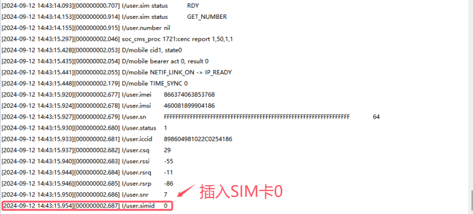

# 基本用法

本文通过demo演示来说明本章节内容的基本用法。

## 文档和工具

- mobile接口文档：[info](./info/index.md)
- 780E模块软件包：[LuatOS 发行版](https://gitee.com/openLuat/LuatOS/releases)
- 本示例所烧录的固件版本：**LuatOS-SoC_V1112_EC618_FULL.soc**
- 本示例所烧录的脚本：[demo/mobile/main.lua · 合宙Luat/LuatOS - 码云 - 开源中国 (gitee.com)](https://gitee.com/openLuat/LuatOS/blob/master/demo/mobile/main.lua)
- 如果不会烧录，可参考 [烧录教程](https://doc.openluat.com/wiki/21?wiki_page_id=6072)

## 示例

```
mobile.simid(2,true)--优先用SIM0

mobile.getBand(band) --获取当前band

band1[0] = 38
band1[1] = 39
band1[2] = 40
mobile.setBand(band1, 3)    --改成使用38,39,40

log.info("imei", mobile.imei()) -- 获取IMEI
log.info("imsi", mobile.imsi()) -- 获取IMSI
log.info("status", mobile.status()) -- 获取网络状态
        
log.info("iccid", mobile.iccid()) -- 获取iccid
log.info("csq", mobile.csq()) -- 4G模块的CSQ并不能完全代表强度
log.info("rssi", mobile.rssi()) -- 需要综合rssi/rsrq/rsrp/snr一起判断
log.info("rsrq", mobile.rsrq())
log.info("rsrp", mobile.rsrp())
log.info("snr", mobile.snr())
log.info("simid", mobile.simid()) -- 这里是获取当前SIM卡槽
log.info("apn", mobile.apn(0,1))  -- 获取AP
log.info("ip", socket.localIP())  -- 获取本地ip

mobile.reqCellInfo(10) -- 发起基站信息查询,含临近小区,超时时长10秒
```

## 对应log

插入SIM0完整log


SIM卡切换log

```
mobile.simid(2,true)--优先用SIM0
```

插入SIM0对应打印



插入SIM1对应打印


