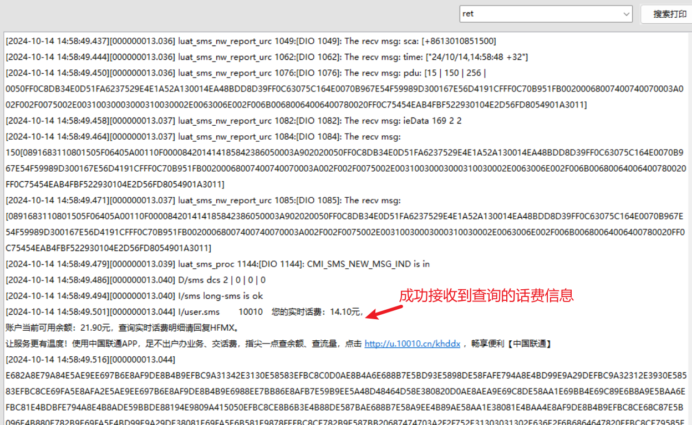

## 一、SMS 简介

SMS（短消息服务，Short Message Service）功能主要用于在蜂窝网络中传输短消息。

移动，联通卡不需开通 VOLTE 可以支持短信功能。

在 4G 网络中，短信可以在数据传输的同时进行，不会因数据业务占用网络资源而被延迟或阻塞。

在 780E 模块中，当收到新短信后，MAIN_RI 变为低电平，持续 120ms，再变为高电平。可根据这个引脚来判断是否有新短信。

## 二、演示功能概述

本 demo 演示了 sms 功能。

## 三、准备硬件环境

### 3.1 780E 开发板一套，包括天线、USB 数据线.

1. 780E 核心板一个。
2. 合宙 780E 核心板购买链接([https://item.taobao.com/item.htm?id=693774140934](https://item.taobao.com/item.htm?id=693774140934))。
3. 此核心板的详细使用说明参考：[Air780E 产品手册](https://docs.openluat.com/air780e/product/) 中的《开发板 Core_Air780E 使用说明 V1.0.5.pdf 》，核心板使用过程中遇到任何问题，可以直接参考这份使用说明 pdf 文档。


### 3.2 数据通信线

typec 接口 USB 数据线即可

### 3.3 开通短信功能的 SIM 卡

Air780E 不支持电信卡的短信功能!!

如果是联通卡或者移动卡, 均可收取短信, 但实名制的卡才能发送短信。

如果是专网卡，请参考专网卡配置指南：（暂时相关文章还没出，后续补充）

## 四、准备软件环境

### 4.1 基本的下载调试工具

使用说明参考：[Luatools 下载和详细使用](https://docs.openluat.com/Luatools/) ；

## 五、sms 功能软硬件资料

本文通过 demo 演示来说明本章节内容的基本用法。

### 5.1 源码和工具

- 780E 模块使用固件：[SDK& Demo - 合宙文档中心](https://docs.openluat.com/air780e/luatos/firmware/)，本 demo 使用的固件版本是：LuatOS-SoC_V1112_EC618_FULL.soc
- 本教程使用的 demo：[https://gitee.com/openLuat/LuatOS-Air780E/tree/master/demo/sms](https://gitee.com/openLuat/LuatOS-Air780E/tree/master/demo/sms)
- 将固件和脚本烧录到模块中，使用说明参考：[Luatools 下载和详细使用](https://docs.openluat.com/Luatools/)
- 源码和固件已打包，如下所示：
[点我,下载完整压缩文件包](file/完整文件包.zip){:target="_blank"}

### 5.3 本 demo 使用 api 简介

#### sms.send(phone, msg, auto_phone_fix)

作用：发送短信

**参数：**

| **传入值类型**<br/> | **解释**<br/>                                                                                 |
| ------------------- | --------------------------------------------------------------------------------------------- |
| string<br/>         | 电话号码,必填<br/>                                                                            |
| string<br/>         | 短信内容,必填<br/>                                                                            |
| bool<br/>           | 是否自动处理电话号号码的格式,默认是按短信内容和号码格式进行自动判断, 设置为 false 可禁用<br/> |

**返回值：**

| **返回值类型**<br/> | **解释**<br/>                            |
| ------------------- | ---------------------------------------- |
| bool/nil           | 成功返回 true,否则返回 false 或 nil |

#### sms.setNewSmsCb(func)

作用：设置新 SMS 的回调函数

**参数：**

| **传入值类型**<br/> | **解释**<br/>                            |
| ------------------- | ---------------------------------------- |
| function<br/>       | 回调函数, 3 个参数, num, txt, metas<br/> |

**返回值：**

| **返回值类型**<br/> | **解释**<br/>                    |
| ------------------- | -------------------------------- |
| nil<br/>            | 传入是函数就能成功,无返回值<br/> |

## 六、代码示例介绍

### 6.1 发送短信

#### 6.1.1 demo 介绍

只需要调用 sms.send()函数，填入对方手机号和消息内容即可。

通过设置回调函数。或者订阅发送完成的系统消息，来进行发送完成的处理。

本 demo 的效果是给服务商发短信消息，查询话费信息。

```lua
function sms_handler(num, txt)
    -- num 手机号码
    -- txt 文本内容
    log.info("sms", num, txt, txt:toHex())

    -- http演示1, 发json
    local body = json.encode({phone=num, txt=txt})
    local headers = {}
    headers["Content-Type"] = "application/json"
    log.info("json", body)
    http_post("http://www.luatos.com/api/sms/blackhole", headers, body)
    -- http演示2, 发表单的
    headers = {}
    headers["Content-Type"] = "application/x-www-form-urlencoded"
    local body = string.format("phone=%s&txt=%s", num:urlEncode(), txt:urlEncode())
    log.info("params", body)
    http_post("http://www.luatos.com/api/sms/blackhole", headers, body)
    -- http演示3, 不需要headers,直接发
    http_post("http://www.luatos.com/api/sms/blackhole", nil, num .. "," .. txt)
    -- 如需发送到钉钉, 参考 demo/dingding
    -- 如需发送到飞书, 参考 demo/feishu
end

--------------------------------------------------------------------
-- 接收短信, 支持多种方式, 选一种就可以了
-- 1. 设置回调函数
--sms.setNewSmsCb(sms_handler)
-- 2. 订阅系统消息
--sys.subscribe("SMS_INC", sms_handler)
-- 3. 在task里等着
sys.taskInit(function()
    while 1 do
        local ret, num, txt = sys.waitUntil("SMS_INC", 300000)
        if num then
            -- 方案1, 交给自定义函数处理
            sms_handler(num, txt)
            -- 方案2, 因为这里是task内, 可以直接调用http.request
            -- local body = json.encode({phone=num, txt=txt})
            -- local headers = {}
            -- headers["Content-Type"] = "application/json"
            -- log.info("json", body)
            -- local code, headers, body = http.request("POST", "http://www.luatos.com/api/sms/blackhole", headers, body).wait()
            -- log.info("resp", code)
        end
    end
end)

-------------------------------------------------------------------
-- 发送短信, 直接调用sms.send就行, 是不是task无所谓
sys.taskInit(function()
    sys.wait(10000)
    -- 中移动卡查短信
    -- sms.send("+8610086", "301")
    -- 联通卡查话费
    sms.send("10010", "101")
end)

-- 用户代码已结束---------------------------------------------
-- 结尾总是这一句
sys.run()
-- sys.run()之后后面不要加任何语句!!!!!
```

#### 6.1.2 将程序烧录到开发板

参考：将固件和脚本烧录到模块中：[Luatools 下载和使用教程 - 合宙模组资料中心](https://docs.openluat.com/Luatools/)

## 七、功能验证

成功发送短信。



## 八、总结

本示例介绍了如何发送短消息服务。


## 扩展


## 常见问题

### 1、物联网卡支持短信功能吗？

一般来说，物联网卡是不支持短信功能的，具体需要咨询物联网卡供应商。

### 2、支持移动、电信，联通卡的短信功能吗？

Air780E 不支持电信卡的短信功能!!

如果是联通卡或者移动卡, 均可收取短信, 但实名制的卡才能发送短信。

### 3、是否支持彩信功能

不支持


## 给读者的话

> 本篇文章由`Linden`开发；
>
> 本篇文章描述的内容，如果有错误、细节缺失、细节不清晰或者其他任何问题，总之就是无法解决您遇到的问题；
>
> 请登录[合宙技术交流论坛](https://chat.openluat.com/)，点击[文档找错赢奖金-Air780E-LuatOS-软件指南-4G通信-短消息(sms)](https://chat.openluat.com/#/page/matter?125=1846801689609371650&126=%E6%96%87%E6%A1%A3%E6%89%BE%E9%94%99%E8%B5%A2%E5%A5%96%E9%87%91-Air780E-LuatOS-%E8%BD%AF%E4%BB%B6%E6%8C%87%E5%8D%97-4G%E9%80%9A%E4%BF%A1-%E7%9F%AD%E6%B6%88%E6%81%AF(sms)&askid=1846801689609371650)；
>
> 用截图标注+文字描述的方式跟帖回复，记录清楚您发现的问题；
>
> 我们会迅速核实并且修改文档；
>
> 同时也会为您累计找错积分，您还可能赢取月度找错奖金！
