# LuatOS与阿里云物联网平台对接

## 一、阿里云物联网平台介绍

[阿里云物联网平台](https://account.aliyun.com/login/login.htm?oauth_callback=https%3A%2F%2Fiot.console.aliyun.com%2Flk%2Fvpc%2Finstance%2Fdetail_s&clearRedirectCookie=1&lang=zh)（Alibaba Cloud IoT Platform）是阿里巴巴集团旗下的一个物联网平台，该平台是一个集成了设备接入、设备管理、数据安全通信、消息订阅、消息转发和数据服务（存储、分析、过滤、解析、集成等）等能力的一体化平台。向下支持连接海量设备，采集设备数据上云；向上提供云端 API，服务端可通过云端 SDK 调用云端 API 将指令下发至设备端，实现远程控制。

通过此链接你可以更好的了解到阿里云物联网平台：[什么是物联网平台-阿里云帮助中心](https://help.aliyun.com/zh/iot/product-overview/what-is-iot-platform?spm=a2c4g.11186623.0.i5)

## 二、演示功能概述

本文将演示如何使用 Air780E 核心板和阿里云物联网平台实现物联网设备的连接与管理。通过以下步骤，我们将展示如何将 Air780E 核心板连接到阿里云物联网平台，实现设备数据的远程上传和云端下发消息的功能。

### 2.1 准备硬件环境

- Air780E 核心板：本文将以 Air780E 核心板为例进行演示。
- SIM 卡：在中国大陆环境下，使用移动、电信、联通的物联网卡或手机卡均可。
- PC 电脑：推荐使用 Windows 10 及以上版本。
- 数据通信线：USB 转 Type-C 数据线。

### 2.2 配置软件环境

- Luatools 下载调试工具：由合宙推出，支持固件获取、固件打包、trace 打印及单机烧录等功能。
- 阿里云物联网平台：阿里云物联网平台提供设备接入、设备管理、数据安全通信、消息订阅、消息转发和数据服务等能力。
- 源码及固件：下载 Air780E 核心板所需的底层 core 文件和脚本代码，并烧录到 Air780E 核心板中。

### 2.3 连接阿里云物联网平台

- 在阿里云物联网平台上创建产品，配置认证方式等。
- 在 Air780E 核心板上编写代码，实现与阿里云物联网平台的连接。

### 2.4 数据上传和接收

- 在 Air780E 核心板上编写代码，实现每隔一定时间向阿里云物联网平台上传数据。
- 在阿里云物联网平台上创建消息主题，用于接收 Air780E 核心板发送的数据。

### 2.5 云端下发消息

- 在阿里云物联网平台上创建消息主题，用于向 Air780E 核心板下发消息。
- 在 Air780E 核心板上编写代码，实现订阅云端下发的消息。

### 2.6 运行结果展示

- 通过 Luatools 工具查看 Air780E 核心板上的日志，验证数据的上传和接收。
- 在阿里云物联网平台上查看数据接收和下发消息的效果。

通过以上步骤，我们将展示如何使用 Air780E 核心板和阿里云物联网平台实现物联网设备的连接与管理。

## 三、演示硬件环境

### 3.1 开发板

本文以 **Air780E 核心板**为例，如下图所示：


淘宝购买链接：[Air780E 核心板淘宝购买链接](https://item.taobao.com/item.htm?id=693774140934&pisk=f1eiwOqL25l1_HYiV6D1ize3wN5d5FMjRrpxkx3VT2uIHCCskWm4kysffAEqor4KRRIskGT0ooqi_coq7DWE000qbVr2mmzKQjNtkV3mnoalvaBRelZshA7RyTFdpD4xQco2_VS2Tcnvc89h5lZshq-pu_FUfEDVVdOmgrkET0ir3mkq_MDEmmM2QjJaY2uI0UGAoNueWRjiw4YTC-_opNr-zluaXleFpfR_X2fhTJVn94W--KJ4KcqQreCDEs3zNVh-DyWpIxqEmyc8savgoor7gX2D7GUzmW4jBJS2_4PTWjestFRZqA0iaRlwjdkIgW2nBR7XNkEn7bDL96_tMA4gN4GNOwa0xVU4IX8G4iReapZyhDSYLIOj_DinyhbSB2IHjbEhxMA51foIXaIhxItMPKJlyMjHNEGZAcQR.&spm=a1z10.5-c-s.w4002-24045920841.33.639f1fd1YrS4b6&skuId=5098266470883)

详细使用说明参考：[Air780E 产品手册](https://docs.openluat.com/air780e/product/) 中的 << 开发板 Core_Air780E 使用说明 VX.X.X.pdf>>，写这篇文章时最新版本的使用说明为：**开发板 Core_Air780E 使用说明 V1.0.5.pdf** ；若在使用过程中遇到任何问题，可以直接参考这份使用说明 PDF 文档。

### 3.2 SIM 卡

在中国大陆环境下，使用移动，电信，联通的物联网卡或者手机卡都可以。

### 3.3 PC 电脑

PC 电脑推荐使用 Windows10 及以上版本。

### 3.4 数据通信线

1\. USB 转 Type-C 数据线

> 它的一端是 USB 接口，另一端是 Type-C 接口。

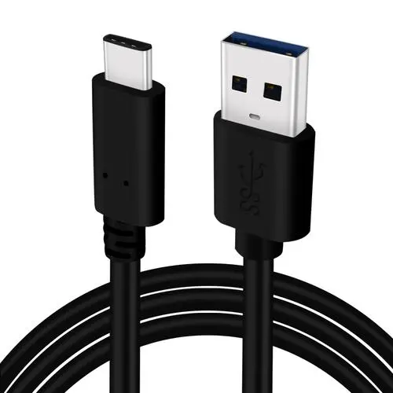

## 四、演示软件环境

### 4.1 Luatools 下载调试工具

Luatools 工具由合宙推出，支持最新固件获取、固件打包、trace 打印及单机烧录等功能。

工具使用说明参考：[Luatools 下载和详细使用](https://docs.openluat.com/Luatools/)

### 4.2 阿里云物联网平台

平台官网：[阿里云物联网平台 (](https://gitee.com/link?target=https%3A%2F%2Fiot.console.aliyun.com%2Flk%2Fvpc%2Finstance%2Fdetail_s)[aliyun.com](https://gitee.com/link?target=https%3A%2F%2Fiot.console.aliyun.com%2Flk%2Fvpc%2Finstance%2Fdetail_s)[)](https://gitee.com/link?target=https%3A%2F%2Fiot.console.aliyun.com%2Flk%2Fvpc%2Finstance%2Fdetail_s)

### 4.3 源码及固件

1\. 底层 core 下载地址：[LuatOS 固件版本下载地址](https://docs.openluat.com/air780e/luatos/firmware/)

> 本 demo 使用的固件是 core_V1112 压缩包 内的 LuatOS-SoC_V1112_EC618_FULL.soc

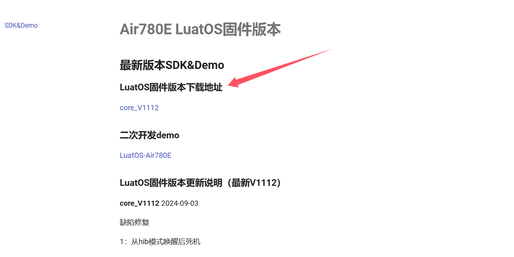

2\. demo 位置

> 本 demo 为诸多云平台的集合型 demo，适用于如阿里云、百度云、OneNet 等诸多云平台，大家只需修改对应云平台的参数即可。

[https://gitee.com/openLuat/LuatOS-Air780E/tree/master/demo/iotcloud/iotcloud%E6%80%BB](https://gitee.com/openLuat/LuatOS-Air780E/tree/master/demo/iotcloud/iotcloud%E6%80%BB)

3\. 源码及固件已打包压缩，如下所示

> 压缩包中 core 文件夹存放的是固件，code 文件夹存放的是脚本代码。
> 大家在使用脚本代码时一定要记得修改参数，至于修改什么参数，后面演示时会告诉大家。

[右键点我,另存为,下载完整压缩文件包](file/aliyun.zip)

## 五、软硬件资料

### 5.1 IOT_CLOUD 介绍

众所周知，市面上有很多云平台，阿里云、腾讯云、中移 onenet、华为云、百度云、华为云、Tlink 云等等......并且每家都有自己的协议，工程师要移植不同的 SDK 代码或基于各家的手册文档对接不同的协议，看着都头大！！！

所以 iotcloud 应运而生！iotcloud 是合宙专门为了合并 iot 平台而制作的库，意在使用统一且极简的代码接入各个云平台，轻松实现云功能。用户无需为那么多云平台的接入而头疼，只需要极简的通用 API 即可轻松上云！并且因为通用，所以云平台之间的迁移也十分方便。

#### 5.1.1 iotcloud 库介绍

iotcloud 库本质就是上层设计一套通用的 API，通过该库进行每个平台功能的对接。目前已经实现了各个平台的所有注册方式，其中自动注册会将相关验证信息保存 kv，随后使用此验证信息进行连接，通知针对每个平台添加了特有系统实现，比如设备上线通知，设备版本号上传，OTA 功能等，用户无需管理这些只需要注意相关下发消息做应用逻辑即可。

**注意：**阿里云物联网平台分为旧版公共实例、新版公共实例和企业版实例，企业版和新版我们可以看为一个使用，新旧公共实例要自行区别，大家可到物联网平台控制台的实例概览页签的公共实例卡片上查看是否有实例 ID，若没有则表示当前账号使用的是旧版公共实例，若有则是新版公共实例。

iotcloud 同时支持新版公共实例 / 旧版公共实例 / 企业实例，但新版公共实例和企业版实例需要多一个实例 ID 参数，下面会有说明，此处需要特别注意。

#### 5.1.2 API 接口介绍

本教程所使用 API 接口参考：[iotcloud API 接口介绍  - LuatOS 文档](https://wiki.luatos.com/api/libs/iotcloud.html?highlight=iotcloud)

### 5.2 Air780E 核心板烧录说明

#### 5.2.1 选择固件和脚本

1\. 打开 Luatools 工具

2\. 点击 **项目管理测试**

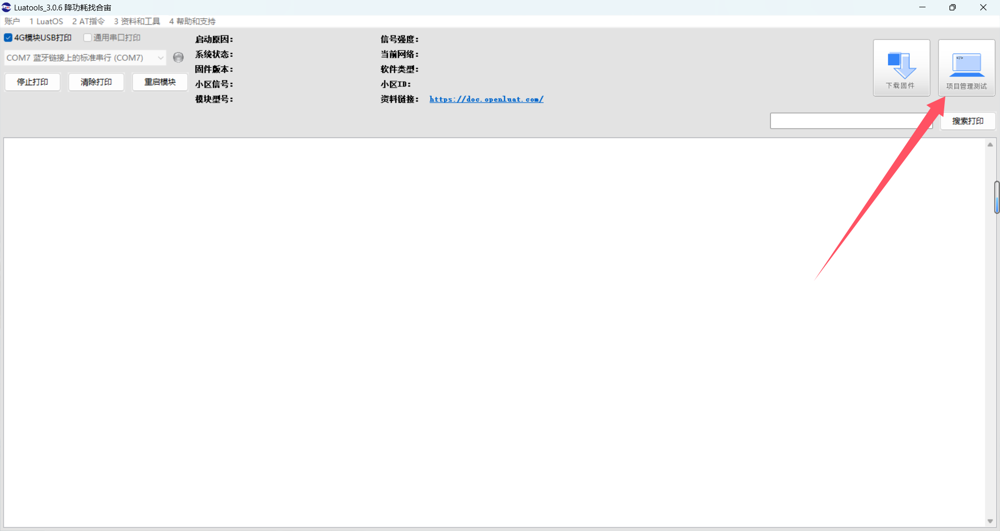

3\. 根据图示操作

> 注意，大家只需要跟着做到第四步即可，第五步跟着后面的操作再做。

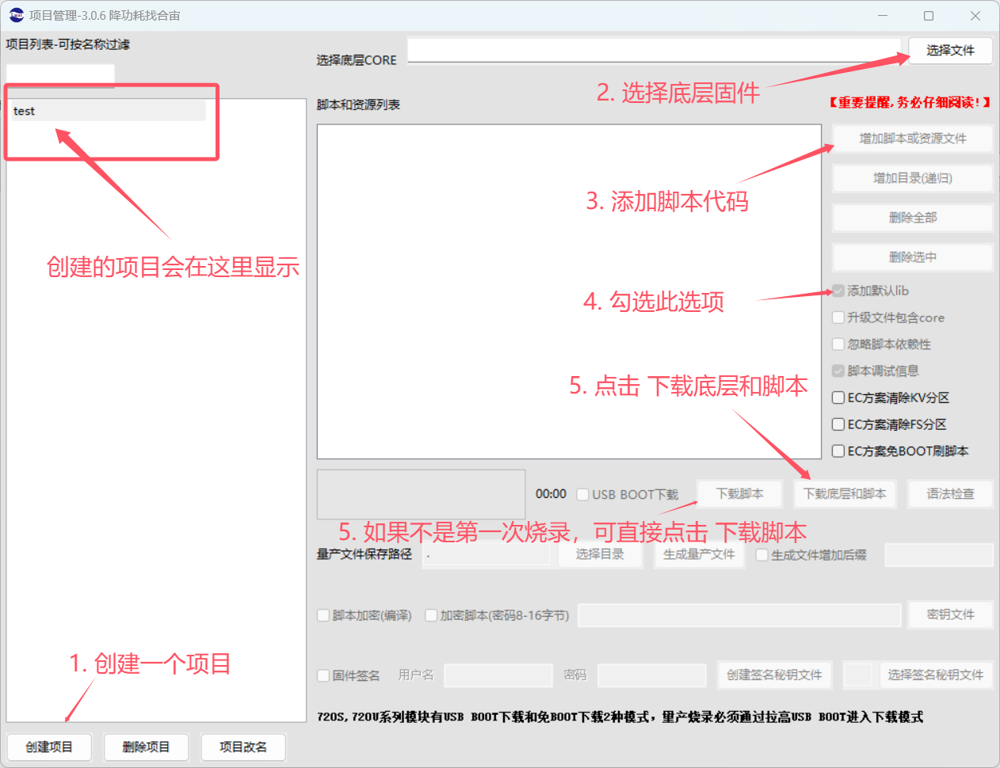

#### 5.2.2 烧录

1\. 将 Air780E 核心板通过 USB 数据线连接至电脑，如下图所示：

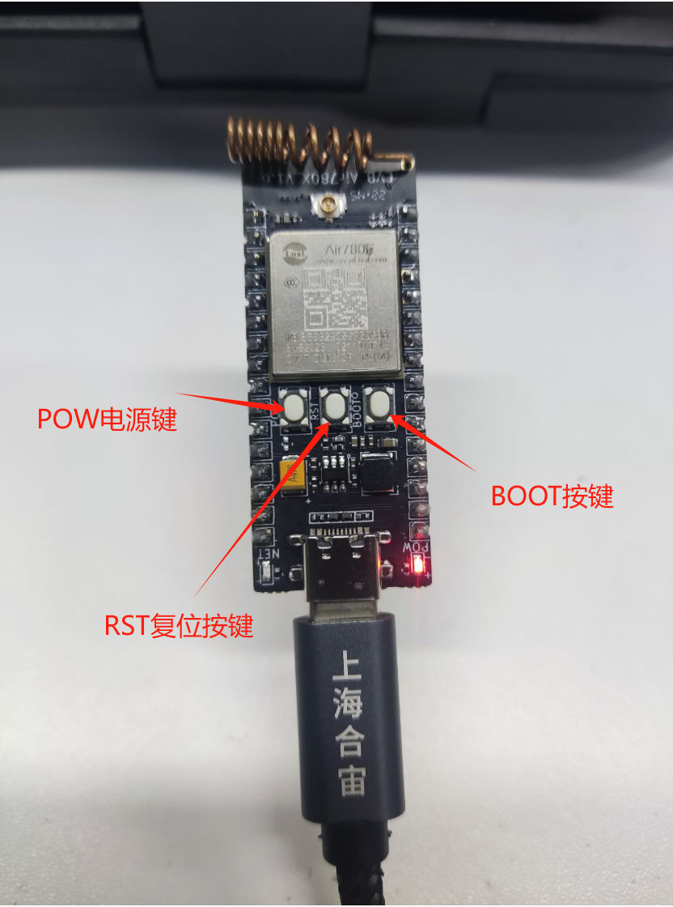

2\. 根据下方操作进行烧录

> 此时就需要大家先点击 Luatools 工具上的 下载底层与脚本/下载脚本，再执行下方操作了。

**开发板处于未开机状态：**此时先按住下载模式按键（BOOT 键）不放，再长按开机键（POW 键）开机，若不出意外开发板将会进入下载模式，Luatools 工具下载进度条会开始跑，这时便可以松开 BOOT 键和 POW 键，等到工具提示下载完成即可。

**开发板已经处于开机状态：**此时可以先按住 BOOT 键不放，再短按复位键（RST 键）后开发板会重启并进入下载模式。

#### 5.2.3 不同模式下的端口显示

1\. 正常开机模式


2\. 下载模式


## 六、功能验证

### 6.1 云平台准备

1\. 登录官网 [阿里云物联网平台 (](https://gitee.com/link?target=https%3A%2F%2Fiot.console.aliyun.com%2Flk%2Fvpc%2Finstance%2Fdetail_s)[aliyun.com](https://gitee.com/link?target=https%3A%2F%2Fiot.console.aliyun.com%2Flk%2Fvpc%2Finstance%2Fdetail_s)[)](https://gitee.com/link?target=https%3A%2F%2Fiot.console.aliyun.com%2Flk%2Fvpc%2Finstance%2Fdetail_s) 并注册账号

2\. 开通物联网平台服务

3\. 试用物联网平台公共实例服务

> 新旧公共实例平台需要进行区分，参考 [物联网平台新版公共实例、旧版公共实例和企业版实例类型、区别和开通使用_物联网平台(IoT)-阿里云帮助中心 (](https://gitee.com/link?target=https%3A%2F%2Fhelp.aliyun.com%2Fzh%2Fiot%2Fuser-guide%2Foverview-60%2392d6a1e87dpsh)[aliyun.com](https://gitee.com/link?target=https%3A%2F%2Fhelp.aliyun.com%2Fzh%2Fiot%2Fuser-guide%2Foverview-60%2392d6a1e87dpsh)[)](https://gitee.com/link?target=https%3A%2F%2Fhelp.aliyun.com%2Fzh%2Fiot%2Fuser-guide%2Foverview-60%2392d6a1e87dpsh)

新版公共实例的实例概览页签显示实例 ID 值：

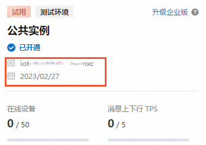

旧版公共实例的实力概览页不显示实例 ID 值


注意：如果使用的是新版公共实例，需要记住此时的实例 ID，后面会用到。

4\. 创建产品

物联网平台--> 设备管理--> 产品--> 创建产品

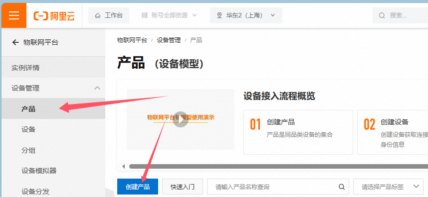

配置信息，注意认证方式要选择设备秘钥

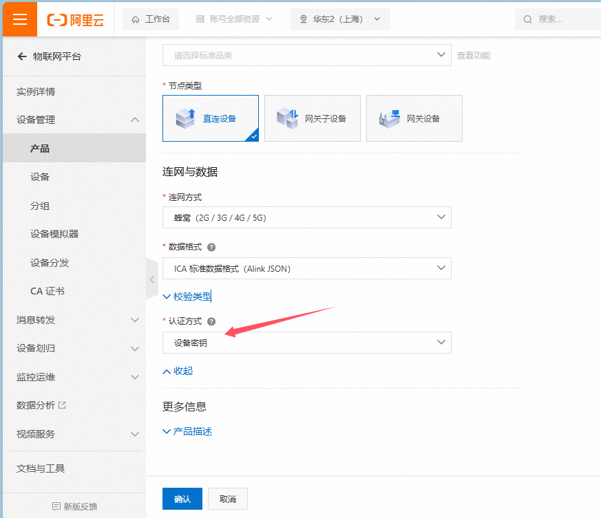

创建完成后，要记住此时的产品 ID（ProductKey），后面会用到

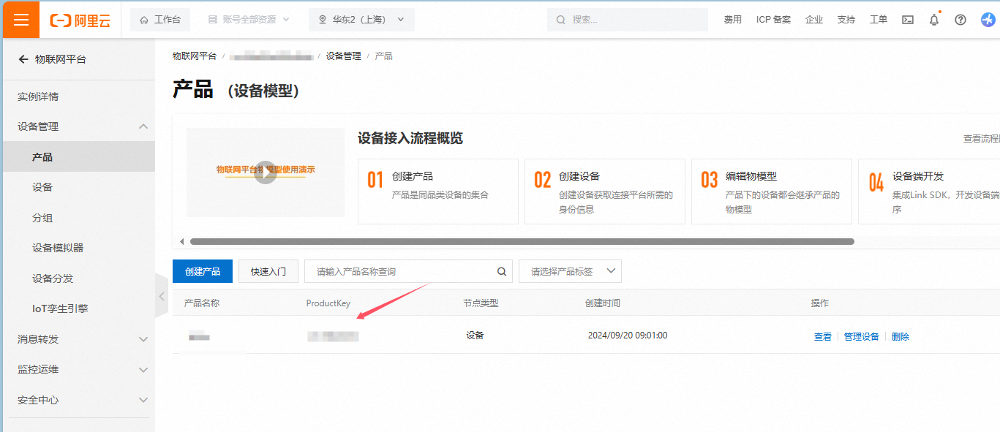

### 6.2 一型一密（免预注册，但需要是企业版实例平台）方式连接云平台

此方式极为简单，无需创建设备，他可以实现统一代码使用时动态进行设备注册，只需要三个参数，实例 ID，产品 ID（ProjectKey）和产品秘钥（ProductSecret），会自动用 IMEI 号作为设备名进行设备注册。

#### 6.2.1 获取需要的三个参数

实例 ID 和产品 ID（ProjectKey）在上面准备阶段的时候已经拿到了，接下来我们查看产品时就能看到产品秘钥（ProductSecret）了，并且要确保打开了动态注册，如下图所示。

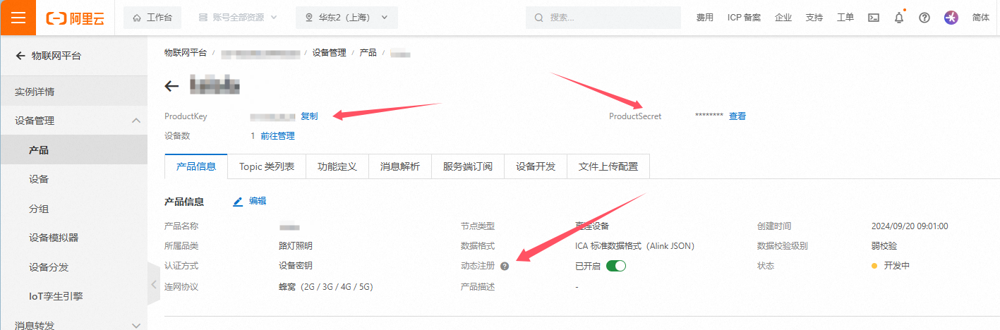

#### 6.2.2 代码使用说明

1\. 设备注册并进行连接云平台

> 记得修改参数

```lua
sys.taskInit(function()
    -- 等待联网
    local ret, device_id = sys.waitUntil("net_ready")

    --------    以下接入方式根据自己需要修改,相关参数修改为自己的    ---------

    -- 阿里云  
    -- 动态注册(免预注册)(一型一密)(仅企业版支持)
    iotcloudc = iotcloud.new(iotcloud.ALIYUN,{instance_id = "xxx",produt_id = "xxx",product_secret = "xxx"}) -- 企业版公共实例
    -- 动态注册(预注册)(一型一密)
    -- iotcloudc = iotcloud.new(iotcloud.ALIYUN,{produt_id = "xxx",device_name = "xxx",product_secret = "xxx"})                     -- 旧版公共实例
    -- iotcloudc = iotcloud.new(iotcloud.ALIYUN,{instance_id = "xxx",produt_id = "xxx",device_name = "xxx",product_secret = "xxx"}) -- 新版公共实例
    -- 密钥校验 (预注册)(一机一密)
    -- iotcloudc = iotcloud.new(iotcloud.ALIYUN,{produt_id = "xxx",device_name = "xxx",device_secret = "xxx"})                    -- 旧版公共实例
    -- iotcloudc = iotcloud.new(iotcloud.ALIYUN,{instance_id = "xxx",produt_id = "xxx",device_name = "xxx",device_secret = "xxx"})-- 新版公共实例

    if iotcloudc then
        iotcloudc:connect()
    end

end)
```

2\. 每隔 2 秒发布一次 qos 为 1 的消息到云平台

> 本文 `iotcloudc:publish()` 中的第一个参数订阅的是一个自定义 topic，在阿里云物联网平台上可以看到。用户可以根据需求自行修改第一个参数。

```lua
-- 每隔2秒发布一次qos为1的消息到云平台
sys.taskInit(function()
    while 1 do
        sys.wait(2000)
        if iotcloudc then
            iotcloudc:publish("/"..iotcloudc.product_id.."/"..iotcloudc.device_name.."/user/update", "hello world", 1) -- 上传数据
        end
    end
end)
```

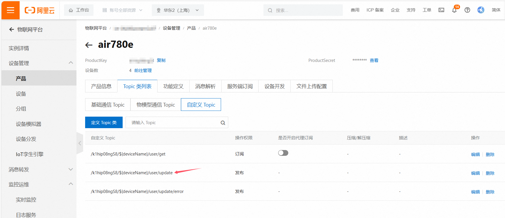

3\. 订阅主题，用于云平台下发消息

> 此行代码放置位置，只要在云平台连接成功之后即可，可参考后面的 4.接收数据
> 本文 `iotcloudc:subscribe()` 中的第一个参数订阅的仍然是一个自定义 topic
> 订阅成功之后，在阿里云物联网平台会有显示，看下图

```lua
iotcloudc:subscribe("/"..iotcloudc.product_id.."/"..iotcloudc.device_name.."/user/get") -- 订阅主题，用于下发消息
```


4\. 接收数据

> 接收统一使用了 `"iotcloud"` 消息进行通知，所以我们只需要订阅此系统消息即可

```lua
sys.subscribe("iotcloud", function(cloudc,event,data,payload)
    -- 注意，此处不是协程内，复杂操作发消息给协程内进行处理
    if event == iotcloud.CONNECT then -- 云平台联上了
        print("iotcloud","CONNECT", "云平台连接成功")
        iotcloudc:subscribe("/"..iotcloudc.product_id.."/"..iotcloudc.device_name.."/user/get") -- 订阅主题，用于下发消息
    elseif event == iotcloud.RECEIVE then
        print("iotcloud","topic", data, "payload", payload)
        -- 用户处理代码
    elseif event ==  iotcloud.OTA then
        if data then
            rtos.reboot()
        end
    elseif event == iotcloud.DISCONNECT then -- 云平台断开了
        -- 用户处理代码
    end
end)
```

5\. 完整代码

> 注意，记得修改参数！！！

```lua
-- LuaTools需要PROJECT和VERSION这两个信息
PROJECT = "aliyun_yxym_myzc"
VERSION = "1.0.0"

-- sys库是标配
_G.sys = require("sys")
--[[特别注意, 使用mqtt库需要下列语句]]
_G.sysplus = require("sysplus")

local iotcloud = require("iotcloud")

-- Air780E的AT固件默认会为开机键防抖, 导致部分用户刷机很麻烦
if rtos.bsp() == "EC618" and pm and pm.PWK_MODE then
    pm.power(pm.PWK_MODE, false)
end

-- 统一联网函数
sys.taskInit(function()
    local device_id = mcu.unique_id():toHex()
    -----------------------------
    -- 统一联网函数, 可自行删减
    ----------------------------
    if wlan and wlan.connect then
        -- wifi 联网, ESP32系列均支持
        local ssid = "luatos1234"
        local password = "12341234"
        log.info("wifi", ssid, password)
        -- TODO 改成自动配网
        -- LED = gpio.setup(12, 0, gpio.PULLUP)
        wlan.init()
        wlan.setMode(wlan.STATION) -- 默认也是这个模式,不调用也可以
        device_id = wlan.getMac()
        wlan.connect(ssid, password, 1)
    elseif mobile then
        -- Air780E/Air600E系列
        --mobile.simid(2) -- 自动切换SIM卡
        -- LED = gpio.setup(27, 0, gpio.PULLUP)
        device_id = mobile.imei()
    elseif w5500 then
        -- w5500 以太网, 当前仅Air105支持
        w5500.init(spi.HSPI_0, 24000000, pin.PC14, pin.PC01, pin.PC00)
        w5500.config() --默认是DHCP模式
        w5500.bind(socket.ETH0)
        -- LED = gpio.setup(62, 0, gpio.PULLUP)
    elseif socket or mqtt then
        -- 适配的socket库也OK
        -- 没有其他操作, 单纯给个注释说明
    else
        -- 其他不认识的bsp, 循环提示一下吧
        while 1 do
            sys.wait(1000)
            log.info("bsp", "本bsp可能未适配网络层, 请查证")
        end
    end
    -- 默认都等到联网成功
    sys.waitUntil("IP_READY")
    sys.publish("net_ready", device_id)
end)

sys.taskInit(function()
    -- 等待联网
    local ret, device_id = sys.waitUntil("net_ready")

    --------    以下接入方式根据自己需要修改,相关参数修改为自己的    ---------

    -- 阿里云  
    -- 动态注册(免预注册)(一型一密)(仅企业版支持)
    iotcloudc = iotcloud.new(iotcloud.ALIYUN,{instance_id = "xxx",produt_id = "xxx",product_secret = "xxx"}) -- 企业版公共实例
    -- 动态注册(预注册)(一型一密)
    -- iotcloudc = iotcloud.new(iotcloud.ALIYUN,{produt_id = "xxx",device_name = "xxx",product_secret = "xxx"})                     -- 旧版公共实例
    -- iotcloudc = iotcloud.new(iotcloud.ALIYUN,{instance_id = "xxx",produt_id = "xxx",device_name = "xxx",product_secret = "xxx"}) -- 新版公共实例
    -- 密钥校验 (预注册)(一机一密)
    -- iotcloudc = iotcloud.new(iotcloud.ALIYUN,{produt_id = "xxx",device_name = "xxx",device_secret = "xxx"})                    -- 旧版公共实例
    -- iotcloudc = iotcloud.new(iotcloud.ALIYUN,{instance_id = "xxx",produt_id = "xxx",device_name = "xxx",device_secret = "xxx"})-- 新版公共实例

    if iotcloudc then
        iotcloudc:connect()
    end

end)

sys.subscribe("iotcloud", function(cloudc,event,data,payload)
    -- 注意，此处不是协程内，复杂操作发消息给协程内进行处理
    if event == iotcloud.CONNECT then -- 云平台联上了
        print("iotcloud","CONNECT", "云平台连接成功")
        iotcloudc:subscribe("/"..iotcloudc.product_id.."/"..iotcloudc.device_name.."/user/get") -- 订阅主题，用于下发消息
    elseif event == iotcloud.RECEIVE then
        print("iotcloud","topic", data, "payload", payload)
        -- 用户处理代码
    elseif event ==  iotcloud.OTA then
        if data then
            rtos.reboot()
        end
    elseif event == iotcloud.DISCONNECT then -- 云平台断开了
        -- 用户处理代码
    end
end)

-- 每隔2秒发布一次qos为1的消息到云平台
sys.taskInit(function()
    while 1 do
        sys.wait(2000)
        if iotcloudc then
            iotcloudc:publish("/"..iotcloudc.product_id.."/"..iotcloudc.device_name.."/user/update", "hello world", 1) -- 上传数据
        end
    end
end)

-- 用户代码已结束---------------------------------------------
-- 结尾总是这一句
sys.run()
-- sys.run()之后后面不要加任何语句!!!!!
```

#### 5.1.3 运行结果展示

1\. 设备日志


2\. 云平台效果

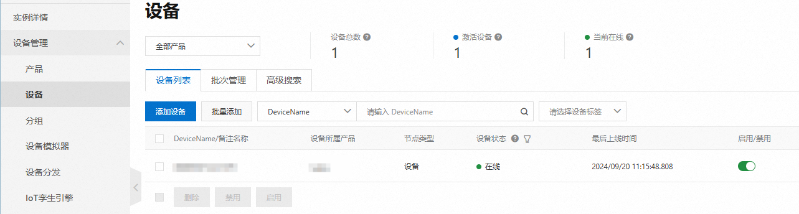

3\. 上行数据效果

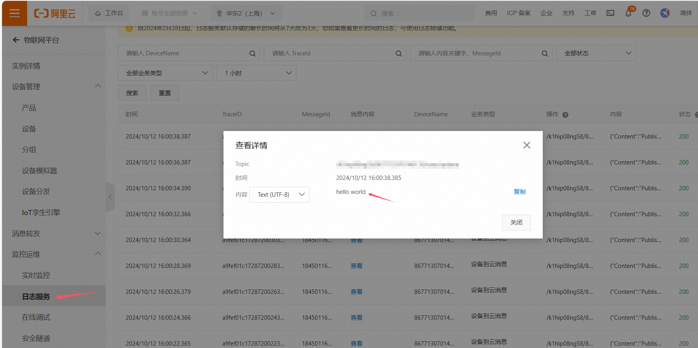

4\. 下发数据效果

> 通过 Luatools 工具查看日志即可

**发布消息：**

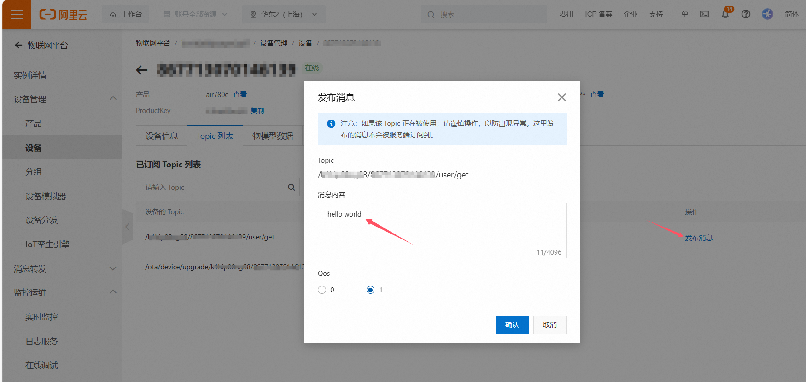

**接收消息：**


### 6.3 一型一密（预注册）方式连接云平台

此方式也极为简单，与一型一密（免预注册）的区别就是需要用户手动注册设备，建议用户注册设备时使用模组的 IMEI 号作为设备名进行注册。它同样也需要三个参数，实例 ID，产品 ID（ProjectKey）和产品秘钥（ProductSecret）。

#### 6.3.1 手动注册设备

建议用户注册设备时使用模组的 IMEI 号作为设备名进行注册。

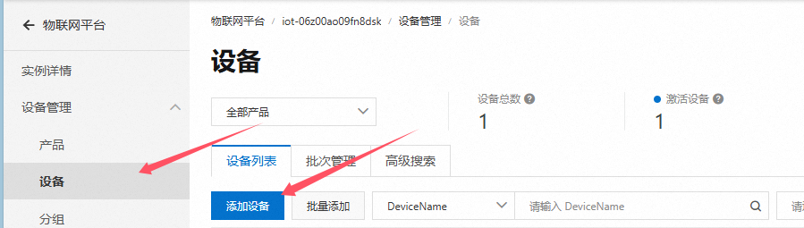

#### 6.3.2 获取需要的三个参数

实例 ID 和产品 ID（ProjectKey）在上面准备阶段的时候已经拿到了，接下来我们查看产品时就能看到产品秘钥（ProductSecret）了，此时动态注册可以不用开启，只是免预注册方式时需要开启。


#### 6.3.3 代码使用说明

1\. 设备注册并进行连接云平台

> 记得修改参数

```lua
sys.taskInit(function()
    -- 等待联网
    local ret, device_id = sys.waitUntil("net_ready")

    --------    以下接入方式根据自己需要修改,相关参数修改为自己的    ---------

    -- 阿里云  
    -- 动态注册(免预注册)(一型一密)(仅企业版支持)
    -- iotcloudc = iotcloud.new(iotcloud.ALIYUN,{instance_id = "xxx",produt_id = "xxx",product_secret = "xxx"}) -- 企业版公共实例
    -- 动态注册(预注册)(一型一密)
    -- iotcloudc = iotcloud.new(iotcloud.ALIYUN,{produt_id = "xxx",device_name = "xxx",product_secret = "xxx"})                     -- 旧版公共实例
    iotcloudc = iotcloud.new(iotcloud.ALIYUN,{instance_id = "xxx",produt_id = "xxx",device_name = "xxx",product_secret = "xxx"}) -- 新版公共实例
    -- 密钥校验 (预注册)(一机一密)
    -- iotcloudc = iotcloud.new(iotcloud.ALIYUN,{produt_id = "xxx",device_name = "xxx",device_secret = "xxx"})                    -- 旧版公共实例
    -- iotcloudc = iotcloud.new(iotcloud.ALIYUN,{instance_id = "xxx",produt_id = "xxx",device_name = "xxx",device_secret = "xxx"})-- 新版公共实例

    if iotcloudc then
        iotcloudc:connect()
    end

end)
```

2\. 每隔 2 秒发布一次 qos 为 1 的消息到云平台

> 本文 `iotcloudc:publish()` 中的第一个参数订阅的是一个自定义 topic，在阿里云物联网平台上可以看到。用户可以根据需求自行修改第一个参数。

```lua
-- 每隔2秒发布一次qos为1的消息到云平台
sys.taskInit(function()
    while 1 do
        sys.wait(2000)
        if iotcloudc then
            iotcloudc:publish("/"..iotcloudc.product_id.."/"..iotcloudc.device_name.."/user/update", "hello world", 1) -- 上传数据
        end
    end
end)
```


3\. 订阅主题，用于云平台下发消息

> 此行代码放置位置，只要在云平台连接成功之后即可，可参考后面的 4.接收数据
> 本文 `iotcloudc:subscribe()` 中的第一个参数订阅的仍然是一个自定义 topic
> 订阅成功之后，在阿里云物联网平台会有显示，看下图

```lua
iotcloudc:subscribe("/"..iotcloudc.product_id.."/"..iotcloudc.device_name.."/user/get") -- 订阅主题，用于下发消息
```

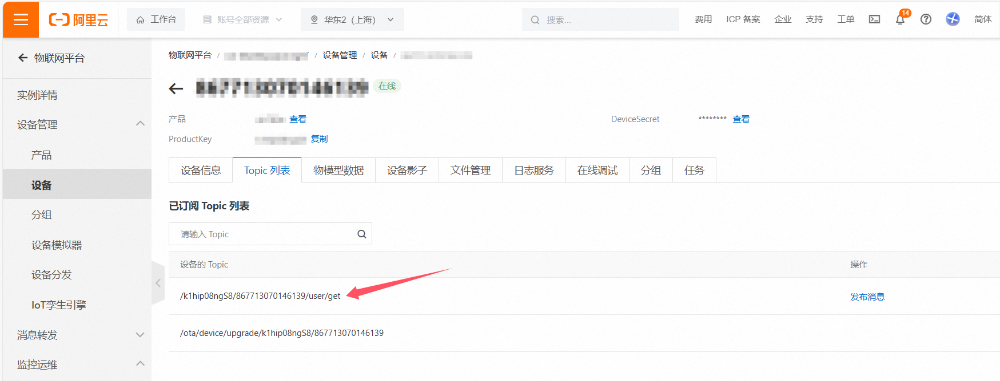

4\. 接收数据

> 接收统一使用了 `"iotcloud"` 消息进行通知，所以我们只需要订阅此系统消息即可

```lua
sys.subscribe("iotcloud", function(cloudc,event,data,payload)
    -- 注意，此处不是协程内，复杂操作发消息给协程内进行处理
    if event == iotcloud.CONNECT then -- 云平台联上了
        print("iotcloud","CONNECT", "云平台连接成功")
        iotcloudc:subscribe("/"..iotcloudc.product_id.."/"..iotcloudc.device_name.."/user/get") -- 订阅主题，用于下发消息
    elseif event == iotcloud.RECEIVE then
        print("iotcloud","topic", data, "payload", payload)
        -- 用户处理代码
    elseif event ==  iotcloud.OTA then
        if data then
            rtos.reboot()
        end
    elseif event == iotcloud.DISCONNECT then -- 云平台断开了
        -- 用户处理代码
    end
end)
```

5\. 完整代码

> 注意，记得修改参数！！！

```lua
-- LuaTools需要PROJECT和VERSION这两个信息
PROJECT = "aliyun_yxym_yzc"
VERSION = "1.0.0"

-- sys库是标配
_G.sys = require("sys")
--[[特别注意, 使用mqtt库需要下列语句]]
_G.sysplus = require("sysplus")

local iotcloud = require("iotcloud")

-- Air780E的AT固件默认会为开机键防抖, 导致部分用户刷机很麻烦
if rtos.bsp() == "EC618" and pm and pm.PWK_MODE then
    pm.power(pm.PWK_MODE, false)
end

-- 统一联网函数
sys.taskInit(function()
    local device_id = mcu.unique_id():toHex()
    -----------------------------
    -- 统一联网函数, 可自行删减
    ----------------------------
    if wlan and wlan.connect then
        -- wifi 联网, ESP32系列均支持
        local ssid = "luatos1234"
        local password = "12341234"
        log.info("wifi", ssid, password)
        -- TODO 改成自动配网
        -- LED = gpio.setup(12, 0, gpio.PULLUP)
        wlan.init()
        wlan.setMode(wlan.STATION) -- 默认也是这个模式,不调用也可以
        device_id = wlan.getMac()
        wlan.connect(ssid, password, 1)
    elseif mobile then
        -- Air780E/Air600E系列
        --mobile.simid(2) -- 自动切换SIM卡
        -- LED = gpio.setup(27, 0, gpio.PULLUP)
        device_id = mobile.imei()
    elseif w5500 then
        -- w5500 以太网, 当前仅Air105支持
        w5500.init(spi.HSPI_0, 24000000, pin.PC14, pin.PC01, pin.PC00)
        w5500.config() --默认是DHCP模式
        w5500.bind(socket.ETH0)
        -- LED = gpio.setup(62, 0, gpio.PULLUP)
    elseif socket or mqtt then
        -- 适配的socket库也OK
        -- 没有其他操作, 单纯给个注释说明
    else
        -- 其他不认识的bsp, 循环提示一下吧
        while 1 do
            sys.wait(1000)
            log.info("bsp", "本bsp可能未适配网络层, 请查证")
        end
    end
    -- 默认都等到联网成功
    sys.waitUntil("IP_READY")
    sys.publish("net_ready", device_id)
end)

sys.taskInit(function()
    -- 等待联网
    local ret, device_id = sys.waitUntil("net_ready")

    --------    以下接入方式根据自己需要修改,相关参数修改为自己的    ---------

    -- 阿里云  
    -- 动态注册(免预注册)(一型一密)(仅企业版支持)
    -- iotcloudc = iotcloud.new(iotcloud.ALIYUN,{instance_id = "xxx",produt_id = "xxx",product_secret = "xxx"}) -- 企业版公共实例
    -- 动态注册(预注册)(一型一密)
    -- iotcloudc = iotcloud.new(iotcloud.ALIYUN,{produt_id = "xxx",device_name = "xxx",product_secret = "xxx"})                     -- 旧版公共实例
    iotcloudc = iotcloud.new(iotcloud.ALIYUN,{instance_id = "xxx",produt_id = "xxx",device_name = "xxx",product_secret = "xxx"}) -- 新版公共实例
    -- 密钥校验 (预注册)(一机一密)
    -- iotcloudc = iotcloud.new(iotcloud.ALIYUN,{produt_id = "xxx",device_name = "xxx",device_secret = "xxx"})                    -- 旧版公共实例
    -- iotcloudc = iotcloud.new(iotcloud.ALIYUN,{instance_id = "xxx",produt_id = "xxx",device_name = "xxx",device_secret = "xxx"})-- 新版公共实例

    if iotcloudc then
        iotcloudc:connect()
    end

end)

sys.subscribe("iotcloud", function(cloudc,event,data,payload)
    -- 注意，此处不是协程内，复杂操作发消息给协程内进行处理
    if event == iotcloud.CONNECT then -- 云平台联上了
        print("iotcloud","CONNECT", "云平台连接成功")
        iotcloudc:subscribe("/"..iotcloudc.product_id.."/"..iotcloudc.device_name.."/user/get") -- 订阅主题，用于下发消息
    elseif event == iotcloud.RECEIVE then
        print("iotcloud","topic", data, "payload", payload)
        -- 用户处理代码
    elseif event ==  iotcloud.OTA then
        if data then
            rtos.reboot()
        end
    elseif event == iotcloud.DISCONNECT then -- 云平台断开了
        -- 用户处理代码
    end
end)

-- 每隔2秒发布一次qos为1的消息到云平台
sys.taskInit(function()
    while 1 do
        sys.wait(2000)
        if iotcloudc then
            iotcloudc:publish("/"..iotcloudc.product_id.."/"..iotcloudc.device_name.."/user/update", "hello world", 1) -- 上传数据
        end
    end
end)

-- 用户代码已结束---------------------------------------------
-- 结尾总是这一句
sys.run()
-- sys.run()之后后面不要加任何语句!!!!!
```

#### 6.3.4 运行结果展示

1\. 设备日志

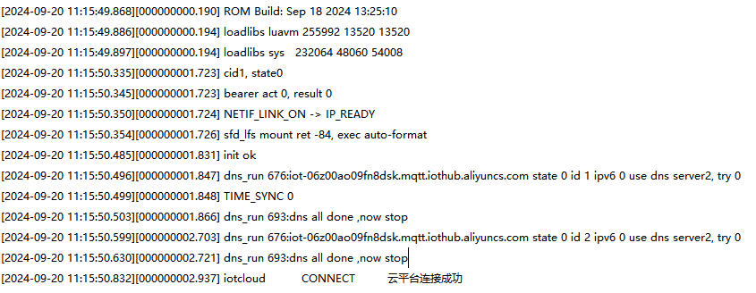

2\. 云平台效果


3\. 上行数据效果


4\. 下发数据效果

> 通过 Luatools 工具查看日志即可

**发布消息：**


**接收消息：**

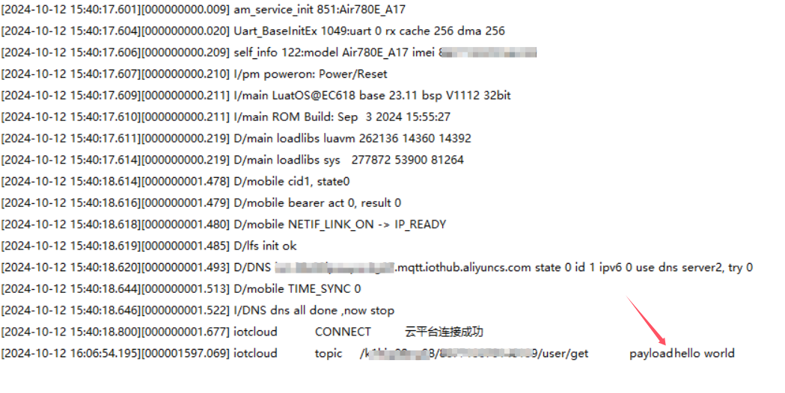

### 6.4 一机一密方式连接云平台

此方式与一型一密（预注册）一样需要用户手动注册设备，区别在于此时所需要的三个参数为产品 ID（ProjectKey）、产品名称和产品秘钥（ProductSecret）。

需要注意，如果是新版公共实例，则需要在原有的三个参数基础上再多个实例 ID，因此需要四个参数。

#### 6.4.1 手动注册设备

建议用户注册设备时使用模组的 IMEI 号作为设备名进行注册。


#### 6.4.2 获取需要的三/四个参数

旧版公共实例需要三个参数：产品 ID（ProjectKey）、产品名称和产品秘钥（ProductSecret）。

新版公共实例需要四个参数：产品 ID（ProjectKey）、产品名称、产品秘钥（ProductSecret）和实例 ID 。

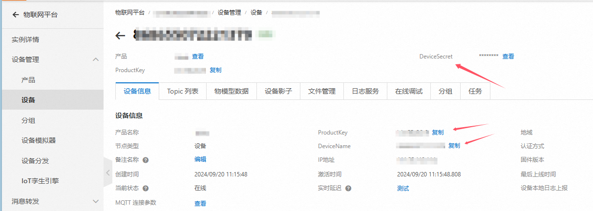

#### 6.4.3 代码使用说明

1\. 设备注册并进行连接云平台

> 记得修改参数

```lua
sys.taskInit(function()
    -- 等待联网
    local ret, device_id = sys.waitUntil("net_ready")

    --------    以下接入方式根据自己需要修改,相关参数修改为自己的    ---------

    -- 阿里云  
    -- 动态注册(免预注册)(一型一密)(仅企业版支持)
    -- iotcloudc = iotcloud.new(iotcloud.ALIYUN,{instance_id = "xxx",produt_id = "xxx",product_secret = "xxx"}) -- 企业版公共实例
    -- 动态注册(预注册)(一型一密)
    -- iotcloudc = iotcloud.new(iotcloud.ALIYUN,{produt_id = "xxx",device_name = "xxx",product_secret = "xxx"})                     -- 旧版公共实例
    -- iotcloudc = iotcloud.new(iotcloud.ALIYUN,{instance_id = "xxx",produt_id = "xxx",device_name = "xxx",product_secret = "xxx"}) -- 新版公共实例
    -- 密钥校验 (预注册)(一机一密)
    -- iotcloudc = iotcloud.new(iotcloud.ALIYUN,{produt_id = "xxx",device_name = "xxx",device_secret = "xxx"})                    -- 旧版公共实例
    iotcloudc = iotcloud.new(iotcloud.ALIYUN,{instance_id = "xxx",produt_id = "xxx",device_name = "xxx",device_secret = "xxx"})-- 新版公共实例

    if iotcloudc then
        iotcloudc:connect()
    end

end)
```

2\. 每隔 2 秒发布一次 qos 为 1 的消息到云平台

> 本文 `iotcloudc:publish()` 中的第一个参数订阅的是一个自定义 topic，在阿里云物联网平台上可以看到。用户可以根据需求自行修改第一个参数。

```lua
-- 每隔2秒发布一次qos为1的消息到云平台
sys.taskInit(function()
    while 1 do
        sys.wait(2000)
        if iotcloudc then
            iotcloudc:publish("/"..iotcloudc.product_id.."/"..iotcloudc.device_name.."/user/update", "hello world", 1) -- 上传数据
        end
    end
end)
```


3\. 订阅主题，用于云平台下发消息

> 此行代码放置位置，只要在云平台连接成功之后即可，可参考后面的 4.接收数据
> 本文 `iotcloudc:subscribe()` 中的第一个参数订阅的仍然是一个自定义 topic
> 订阅成功之后，在阿里云物联网平台会有显示，看下图

```lua
iotcloudc:subscribe("/"..iotcloudc.product_id.."/"..iotcloudc.device_name.."/user/get") -- 订阅主题，用于下发消息
```


4\. 接收数据

> 接收统一使用了 `"iotcloud"` 消息进行通知，所以我们只需要订阅此系统消息即可

```lua
sys.subscribe("iotcloud", function(cloudc,event,data,payload)
    -- 注意，此处不是协程内，复杂操作发消息给协程内进行处理
    if event == iotcloud.CONNECT then -- 云平台联上了
        print("iotcloud","CONNECT", "云平台连接成功")
        iotcloudc:subscribe("/"..iotcloudc.product_id.."/"..iotcloudc.device_name.."/user/get") -- 订阅主题，用于下发消息
    elseif event == iotcloud.RECEIVE then
        print("iotcloud","topic", data, "payload", payload)
        -- 用户处理代码
    elseif event ==  iotcloud.OTA then
        if data then
            rtos.reboot()
        end
    elseif event == iotcloud.DISCONNECT then -- 云平台断开了
        -- 用户处理代码
    end
end)
```

5\. 完整代码

> 注意，记得修改参数！！！

```lua
-- LuaTools需要PROJECT和VERSION这两个信息
PROJECT = "aliyun_yjym_yzc"
VERSION = "1.0.0"

-- sys库是标配
_G.sys = require("sys")
--[[特别注意, 使用mqtt库需要下列语句]]
_G.sysplus = require("sysplus")

local iotcloud = require("iotcloud")

-- Air780E的AT固件默认会为开机键防抖, 导致部分用户刷机很麻烦
if rtos.bsp() == "EC618" and pm and pm.PWK_MODE then
    pm.power(pm.PWK_MODE, false)
end

-- 统一联网函数
sys.taskInit(function()
    local device_id = mcu.unique_id():toHex()
    -----------------------------
    -- 统一联网函数, 可自行删减
    ----------------------------
    if wlan and wlan.connect then
        -- wifi 联网, ESP32系列均支持
        local ssid = "luatos1234"
        local password = "12341234"
        log.info("wifi", ssid, password)
        -- TODO 改成自动配网
        -- LED = gpio.setup(12, 0, gpio.PULLUP)
        wlan.init()
        wlan.setMode(wlan.STATION) -- 默认也是这个模式,不调用也可以
        device_id = wlan.getMac()
        wlan.connect(ssid, password, 1)
    elseif mobile then
        -- Air780E/Air600E系列
        --mobile.simid(2) -- 自动切换SIM卡
        -- LED = gpio.setup(27, 0, gpio.PULLUP)
        device_id = mobile.imei()
    elseif w5500 then
        -- w5500 以太网, 当前仅Air105支持
        w5500.init(spi.HSPI_0, 24000000, pin.PC14, pin.PC01, pin.PC00)
        w5500.config() --默认是DHCP模式
        w5500.bind(socket.ETH0)
        -- LED = gpio.setup(62, 0, gpio.PULLUP)
    elseif socket or mqtt then
        -- 适配的socket库也OK
        -- 没有其他操作, 单纯给个注释说明
    else
        -- 其他不认识的bsp, 循环提示一下吧
        while 1 do
            sys.wait(1000)
            log.info("bsp", "本bsp可能未适配网络层, 请查证")
        end
    end
    -- 默认都等到联网成功
    sys.waitUntil("IP_READY")
    sys.publish("net_ready", device_id)
end)

sys.taskInit(function()
    -- 等待联网
    local ret, device_id = sys.waitUntil("net_ready")

    --------    以下接入方式根据自己需要修改,相关参数修改为自己的    ---------

    -- 阿里云  
    -- 动态注册(免预注册)(一型一密)(仅企业版支持)
    -- iotcloudc = iotcloud.new(iotcloud.ALIYUN,{instance_id = "xxx",produt_id = "xxx",product_secret = "xxx"}) -- 企业版公共实例
    -- 动态注册(预注册)(一型一密)
    -- iotcloudc = iotcloud.new(iotcloud.ALIYUN,{produt_id = "xxx",device_name = "xxx",product_secret = "xxx"})                     -- 旧版公共实例
    -- iotcloudc = iotcloud.new(iotcloud.ALIYUN,{instance_id = "xxx",produt_id = "xxx",device_name = "xxx",product_secret = "xxx"}) -- 新版公共实例
    -- 密钥校验 (预注册)(一机一密)
    -- iotcloudc = iotcloud.new(iotcloud.ALIYUN,{produt_id = "xxx",device_name = "xxx",key = "xxx"})                    -- 旧版公共实例
    iotcloudc = iotcloud.new(iotcloud.ALIYUN,{instance_id = "xxx",produt_id = "xxx",device_name = "xxx",key = "xxx"})-- 新版公共实例

    if iotcloudc then
        iotcloudc:connect()
    end

end)

sys.subscribe("iotcloud", function(cloudc,event,data,payload)
    -- 注意，此处不是协程内，复杂操作发消息给协程内进行处理
    if event == iotcloud.CONNECT then -- 云平台联上了
        print("iotcloud","CONNECT", "云平台连接成功")
        iotcloudc:subscribe("/"..iotcloudc.product_id.."/"..iotcloudc.device_name.."/user/get") -- 订阅主题，用于下发消息
    elseif event == iotcloud.RECEIVE then
        print("iotcloud","topic", data, "payload", payload)
        -- 用户处理代码
    elseif event ==  iotcloud.OTA then
        if data then
            rtos.reboot()
        end
    elseif event == iotcloud.DISCONNECT then -- 云平台断开了
        -- 用户处理代码
    end
end)

-- 每隔2秒发布一次qos为1的消息到云平台
sys.taskInit(function()
    while 1 do
        sys.wait(2000)
        if iotcloudc then
            iotcloudc:publish("/"..iotcloudc.product_id.."/"..iotcloudc.device_name.."/user/update", "hello world", 1) -- 上传数据
        end
    end
end)

-- 用户代码已结束---------------------------------------------
-- 结尾总是这一句
sys.run()
-- sys.run()之后后面不要加任何语句!!!!!
```

#### 6.4.4 运行结果展示

1\. 设备日志


2\. 云平台效果


3\. 上行数据效果


4\. 下发数据效果

> 通过 Luatools 工具查看日志即可

**发布消息：**


**接收消息：**


### 6.5 阿里云 OTA 升级

#### 6.5.1 建立项目并连接阿里云

根据前面的操作说明，实现阿里云连接。

#### 6.5.2 制作差分升级文件包

##### 6.5.2.1 熟悉 Luatools 工具

在制作差分升级文件包之前，请先熟悉如何使用 Luatools 工具：[Luatools 下载和详细使用](https://docs.openluat.com/Luatools/)

##### 6.5.2.2 制作差分包

> 本次 demo 以一型一密（预注册）的 demo 为例。
> 同时需要注意，Luatools 工具只有版本 2.1.89 以上支持生成 bin 文件差分包，低版本仅支持生成 sota 文件

1\. 只升级脚本，差分包制作流程如下：

> 需要注意，升级前的脚本版本号 < 升级后的脚本版本号，而且我们此时模块中烧录的是升级前的脚本，不要搞错了。

固件及 demo 到前面的 源码及固件 章节下载，下载完成后根据下方图片进行操作，生成量产文件。

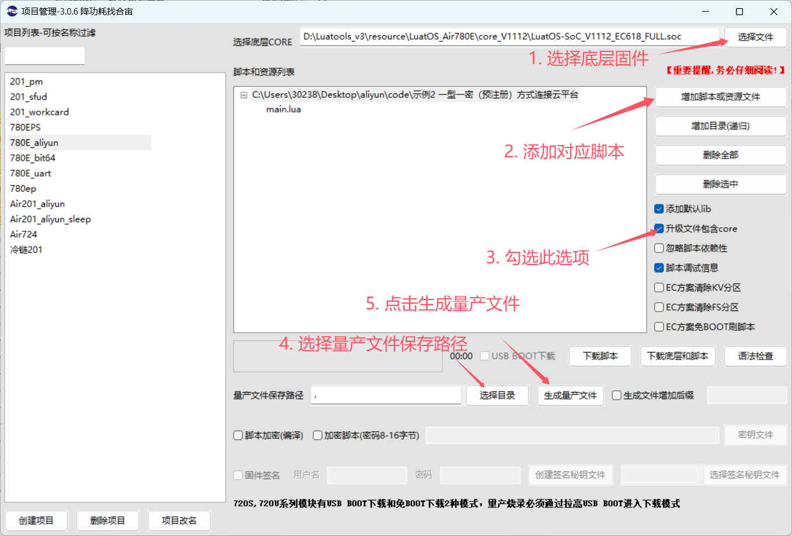

在选择的保存路径下会自动生成 **SOC 量产及远程升级文件\EC618** 文件夹，下图中箭头位置即为我们需要的差分包文件。

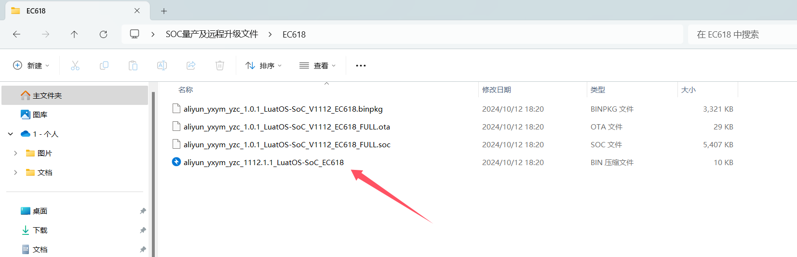

2\. 需要升级底层 CORE，差分包制作流程如下：

> 需要注意，升级前的固件版本号 <= 升级后的固件版本号

a. 生成新固件版本的量产固件

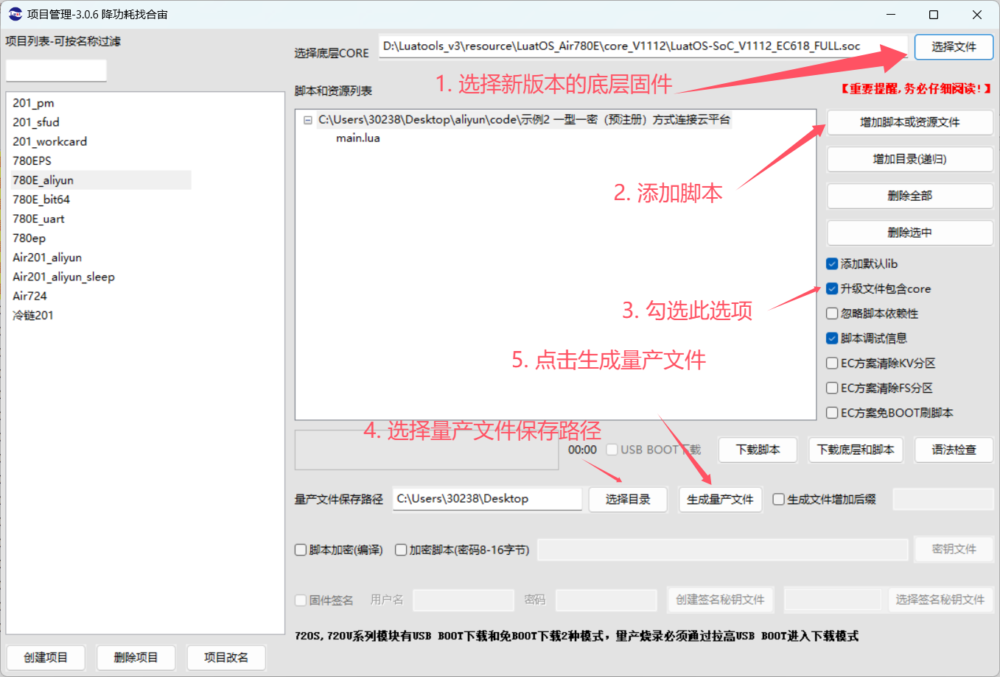

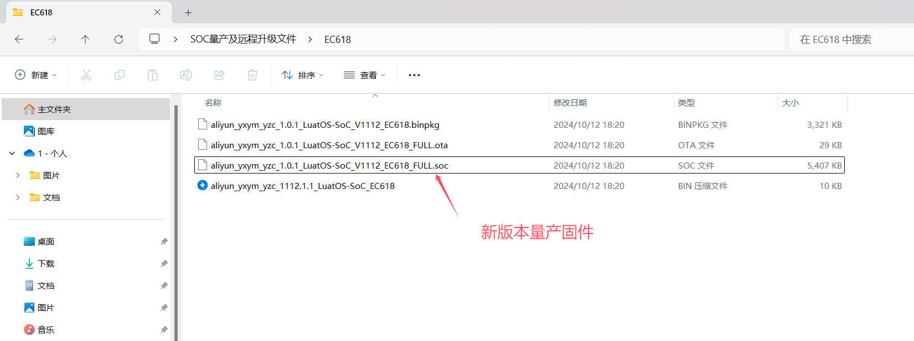

b. 根据新旧固件生成差分包

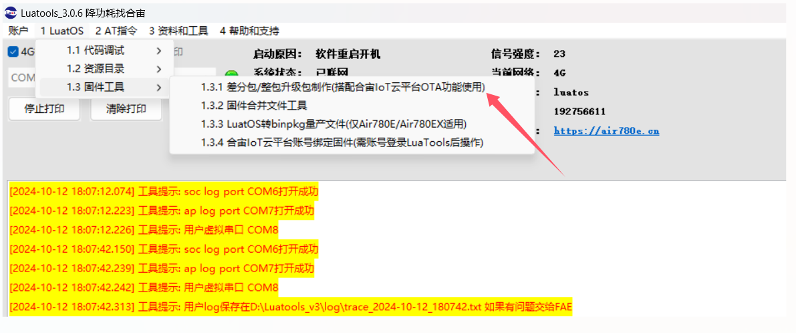

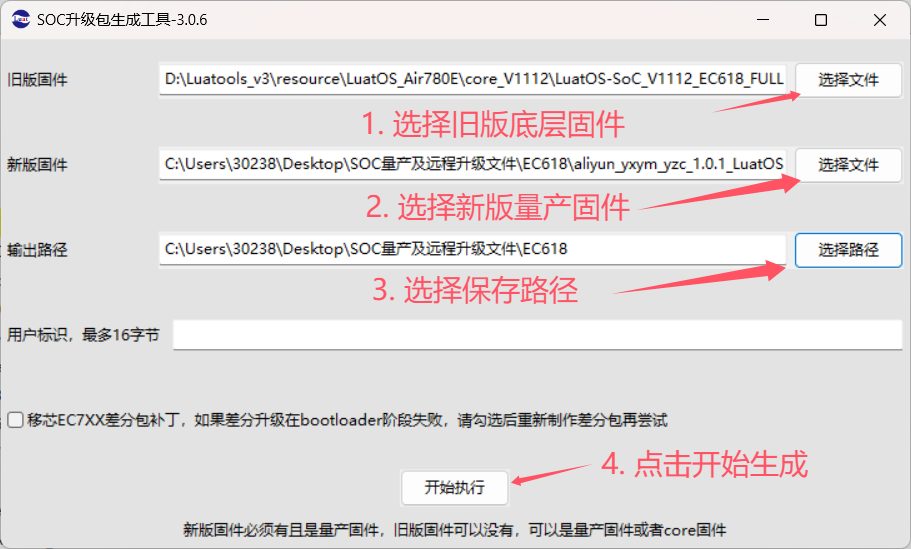

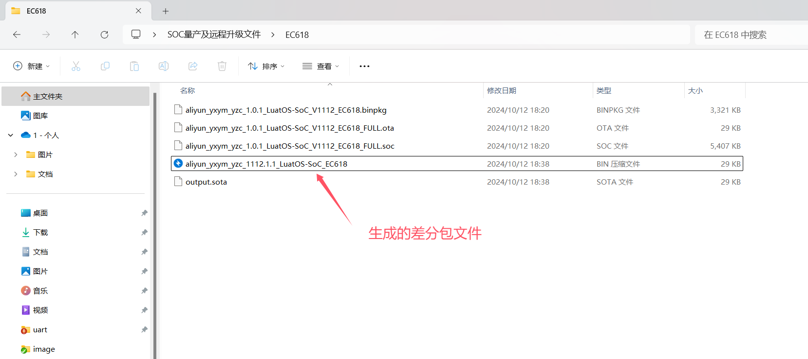

#### 6.5.3 阿里云平台上传差分包

> 注意，如果在上传差分包时出现错误，需要把差分包文件名缩短长度

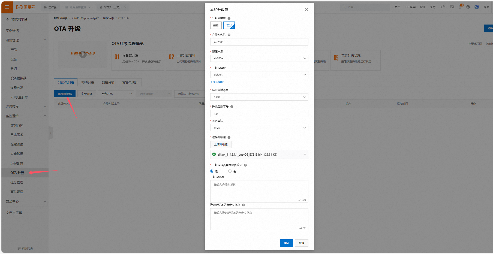

#### 6.5.4 升级包验证

> 点完确定之后，如果模块此时初始开机状态，会自动进行升级操作，期间会自动重启属于正常现象。

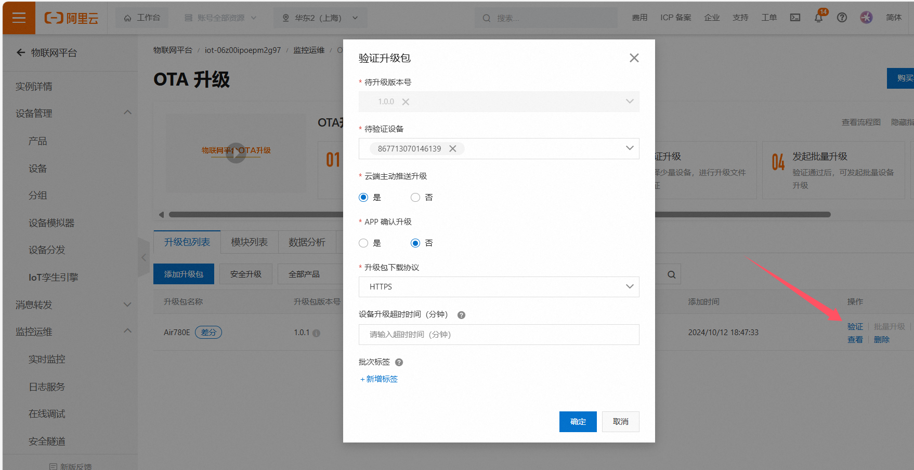

#### 6.5.5 升级完成

1\. 设备日志


2\. 云平台效果

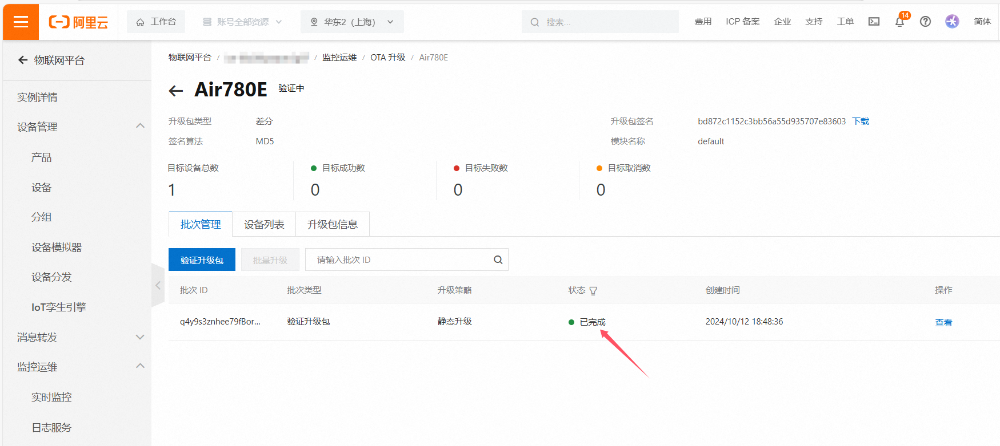

## 七、总结

本文详细介绍了如何使用 Air780E 核心板和阿里云物联网平台实现物联网设备的连接与管理。首先，我们准备了必要的硬件环境，包括 Air780E 核心板、SIM 卡、PC 电脑和数据通信线。接着，我们配置了软件环境，包括 Luatools 下载调试工具和阿里云物联网平台。

在连接阿里云物联网平台的过程中，我们创建了产品，配置了认证方式，并在 Air780E 核心板上编写了代码以实现与阿里云物联网平台的连接。我们展示了如何通过编写代码，使 Air780E 核心板每隔一定时间向阿里云物联网平台上传数据，并在平台上创建消息主题以接收 Air780E 核心板发送的数据。

我们还展示了如何创建消息主题以向 Air780E 核心板下发消息，并实现订阅云端下发的消息。通过 Luatools 工具和阿里云物联网平台，我们验证了数据的上传和接收，以及下发消息的效果。

通过本文的学习，大家可以掌握如何使用 Air780E 核心板和阿里云物联网平台实现物联网设备的连接与管理。

## 八、扩展

### 8.1 MQTT 通信协议 QoS 介绍

MQTT（Message Queuing Telemetry Transport）是一种轻量级的消息传输协议，它设计用于低带宽和不稳定的网络环境。MQTT 协议专注于设备连接的稳定性和网络的优化使用，特别适合于物联网（IoT）场景。

在 MQTT 中，消息的传输质量是通过 QoS（Quality of Service，服务质量）等级来定义的。QoS 定义了消息的传递可靠性，共有三个等级：

1\. **QoS 0（最多传递一次）**：

- 最少传递一次：消息可能会丢失，也可能多次传递。

- 适用于非关键数据，或者允许数据丢失的场景。

2\. **QoS 1（至少传递一次）**：

- 至少传递一次：确保消息至少从发布者传输到服务器，并且至少传递给每个订阅者一次。

- 如果传输过程中出现错误，客户端会重新发送消息。

- 适用于需要确认数据已传输但可以容忍一定程度数据丢失的场景。

3\. **QoS 2（确保传递一次）**：

- 确保传递一次：确保消息从发布者传输到服务器，并且至少传递给每个订阅者一次，而且在传输过程中不会被重复传递。

- 客户端会在消息确认之后才能接收到下一个消息。

- 适用于对数据可靠性要求极高的场景，如关键数据传输。


选择适当的 QoS 级别取决于应用场景对数据可靠性和网络资源利用的要求。在设计物联网应用时，通常需要根据设备的能力、网络条件以及应用的容忍度来选择合适的 QoS 设置。

## 九、常见问题

1\. 如何实现数据的上传和接收？

> 数据的上传和接收是通过订阅和发布消息实现的。在代码中，需要调用 `iotcloudc:publish()` 和 `iotcloudc:subscribe()` 方法，分别用于发布和订阅消息。

## 给读者的话

> 本篇文章由 `马梦阳` 开发；
>
> 本篇文章描述的内容，如果有错误、细节缺失、细节不清晰或者其他任何问题，总之就是无法解决您遇到的问题；
>
> 请登录[合宙技术交流论坛](https://chat.openluat.com/)，点击 此处放文档链接[文档找错赢奖金-Air780E-LuatOS-软件指南-网络应用-阿里云]([https://chat.openluat.com/#/page/matter?125=1848634031755886593&126=%E6%96%87%E6%A1%A3%E6%89%BE%E9%94%99%E8%B5%A2%E5%A5%96%E9%87%91-Air780E-LuatOS-%E8%BD%AF%E4%BB%B6%E6%8C%87%E5%8D%97-%E7%BD%91%E7%BB%9C%E5%BA%94%E7%94%A8-%E9%98%BF%E9%87%8C%E4%BA%91&askid=1848634031755886593](https://chat.openluat.com/#/page/matter?125=1848634031755886593&126=文档找错赢奖金-Air780E-LuatOS-软件指南-网络应用-阿里云&askid=1848634031755886593))
>
> 用截图标注 + 文字描述的方式跟帖回复，记录清楚您发现的问题；
>
> 我们会迅速核实并且修改文档；
>
> 同时也会为您累计找错积分，您还可能赢取月度找错奖金！
