## 一、百度云概述

百度智能云物联网核心套件（IoT Core）是面向物联网领域开发者的全托管云服务，通过主流的物联网协议（如 MQTT）通讯，可以在智能设备与云端之间建立安全的双向连接，快速实现物联网项目。

**官网地址：**[百度智能云物联网平台控制台](https://console.bce.baidu.com/iot2/core/)

**官方文档地址：**[物联网核心套件文档](https://cloud.baidu.com/doc/IoTCore/index.html)

> 注：新用户首次使用 IoT Core 时，需要完成实名认证并开通 IoT Core 服务。 IoT Core 属于后付费业务，未使用 IoT Core 前，不会进行任何计费。

## 二、演示功能概述

接下来为大家介绍 Air780E 如何接入百度云，并且在平台端通过模拟设备在线工具下发消息，控制模块端灯的亮灭。

## 三、准备硬件环境

### 3.1 开发板准备

使用 Air780E 核心板，如下图所示：


淘宝购买链接：[Air780E 核心板淘宝购买链接](https://item.taobao.com/item.htm?id=693774140934&pisk=f1eiwOqL25l1_HYiV6D1ize3wN5d5FMjRrpxkx3VT2uIHCCskWm4kysffAEqor4KRRIskGT0ooqi_coq7DWE000qbVr2mmzKQjNtkV3mnoalvaBRelZshA7RyTFdpD4xQco2_VS2Tcnvc89h5lZshq-pu_FUfEDVVdOmgrkET0ir3mkq_MDEmmM2QjJaY2uI0UGAoNueWRjiw4YTC-_opNr-zluaXleFpfR_X2fhTJVn94W--KJ4KcqQreCDEs3zNVh-DyWpIxqEmyc8savgoor7gX2D7GUzmW4jBJS2_4PTWjestFRZqA0iaRlwjdkIgW2nBR7XNkEn7bDL96_tMA4gN4GNOwa0xVU4IX8G4iReapZyhDSYLIOj_DinyhbSB2IHjbEhxMA51foIXaIhxItMPKJlyMjHNEGZAcQR.&spm=a1z10.5-c-s.w4002-24045920841.33.639f1fd1YrS4b6&skuId=5098266470883) ；

此核心板的详细使用说明参考：[Air780E 产品手册](https://docs.openluat.com/air780e/product/) 中的 << 开发板 Core_Air780E 使用说明 VX.X.X.pdf>>，写这篇文章时最新版本的使用说明为：<< 开发板 Core_Air780E 使用说明 V1.0.5.pdf>> ；核心板使用过程中遇到任何问题，可以直接参考这份使用说明 pdf 文档。

### 3.2 数据通信线

USB 转 typeC 数据线一根。

### 3.3 PC 电脑

WINDOWS 系统，其他暂无特别要求。

## 四、准备软件环境

### 4.1 下载调试工具

使用说明参考：[Luatools 下载和详细使用](https://docs.openluat.com/Luatools/)

### 4.2 源码及固件

1. 底层 core 下载地址：[LuatOS 固件版本下载地址](https://docs.openluat.com/air780e/luatos/firmware/)本 demo 使用的固件是 core_V1112 压缩包内的 LuatOS-SoC_V1112_EC618_FULL.soc

2. 本教程使用的 demo：[https://gitee.com/openLuat/LuatOS-Air780E/tree/master/demo/iotcloud](https://gitee.com/openLuat/LuatOS-Air780E/tree/master/demo/iotcloud)
3. 源码和固件已打包，如下所示：
   > 注：压缩包中 core 文件夹存放固件，code 文件夹存放 demo

[右键点我,另存为,下载完整压缩文件包](file/baiduyun.zip){:target="_blank"}

## 五、百度云软硬件资料

### 5.1 iotcloud 库介绍

众所周知，市面上有很多云平台，阿里云、腾讯云、中移 onenet、华为云、百度云、华为云、Tlink 云等等......并且每家都有自己的协议，工程师要移植不同的 sdk 代码或基于各家的手册文档对接不同的协议，看着都头大！！！

所以 iotcloud 应运而生！iotcloud 是合宙专门为了合并 iot 平台而制作的库，意在使用统一且极简的代码接入各个云平台，轻松实现云功能。用户无需为那么多云平台的接入而头疼，只需要极简的通用 API 即可轻松上云！并且因为通用，所以云平台之间的迁移也十分方便。

iotcloud 库本质就是上层设计一套通用的 API 库来进行每个平台功能的对接。目前已经实现了各个平台的所有注册方式，其中自动注册会将相关验证信息保存 kv，随后使用此验证信息进行连接，通知针对每个平台添加了特有系统实现，比如设备上线通知，设备版本号上传，ota 功能等，用户无需管理这些只需要注意相关下发消息做应用逻辑即可。

### 5.2 API 接口介绍

本教程使用 api 接口为:[iotcloud - iotcloud 云平台库 (已支持: 腾讯云 阿里云 onenet 华为云 涂鸦云 百度云 Tlink 云 其他也会支持,有用到的提 issue 会加速支持) - LuatOS 文档](https://wiki.luatos.com/api/libs/iotcloud.html?highlight=iotcloud)

### 5.3 Air780E 烧录说明

将 Air780E 通过通过 usb 数据线连接电脑，如下图所示：

> 注：
> 1、按住下载模式按键（boot 键）不放，同时再长按开机键开机，这时开发板会进入下载模式，Luatools 下载进度条会开始跑，这时可以松开 boot 按键。直到工具提示下载完成。
> 2、如果，未能成功进入下载模式，而是进入正常开机模式，这时可以按住 boot 键，再短按复位按键，让开发板重启，重新进入下载模式。

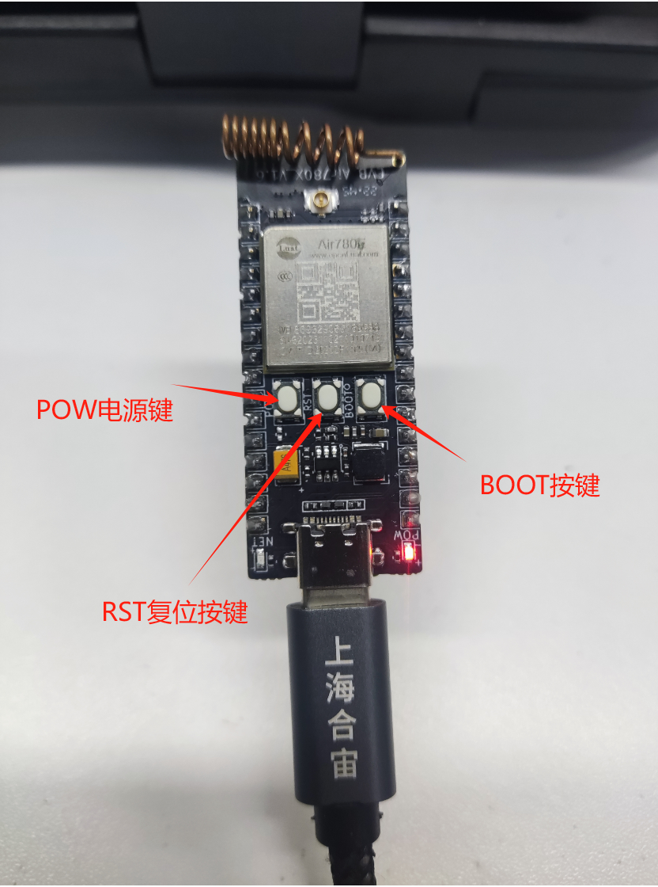

如何判断有没有进入下载模式:可以通过 PC 端的设备管理器中虚拟出来的 USB 端口数量来判断。

**正常开机模式：**

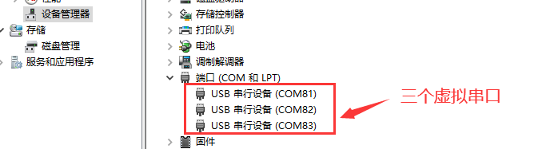

**下载模式：**


## 六、云平台配置与效果展示

### 6.1 云平台配置

#### 6.1.1 注册百度云账号并开通 IoTCore

在使用物联网核心套件服务前，您需要创建一个百度智能云账号，请按照下述步骤进行注册和登录。

1. 在百度智能云[登录页面](https://login.bce.baidu.com/?account=&redirect=http%3A%2F%2Fconsole.bce.baidu.com%2F)，选择百度账号，点击“立即注册”，进入百度账号注册界面
2. 如果未进行实名认证，请先进行[实名认证](https://cloud.baidu.com/doc/UserGuide/s/8jwvy3c96)
3. [开通 IoTCore](https://console.bce.baidu.com/iot2/core/landing)：开通服务并同意按需计费，可进入“实例列表”

#### 6.1.2 创建 IoT Core 实例

1、登录 [IoT Core 控制台页面](https://console.bce.baidu.com/iot2/core/coreList)

2、点击“创建 IoT Core 实例”

   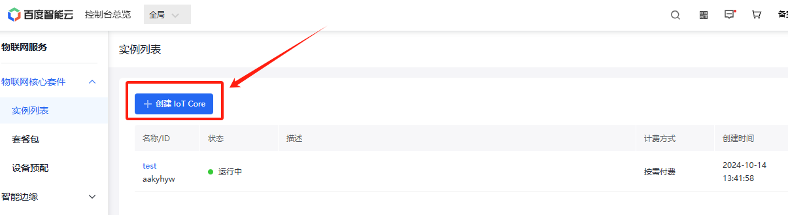

3、填写需要创建 IoT Core 的名称，付费方式选择按需付费，确认购买即可

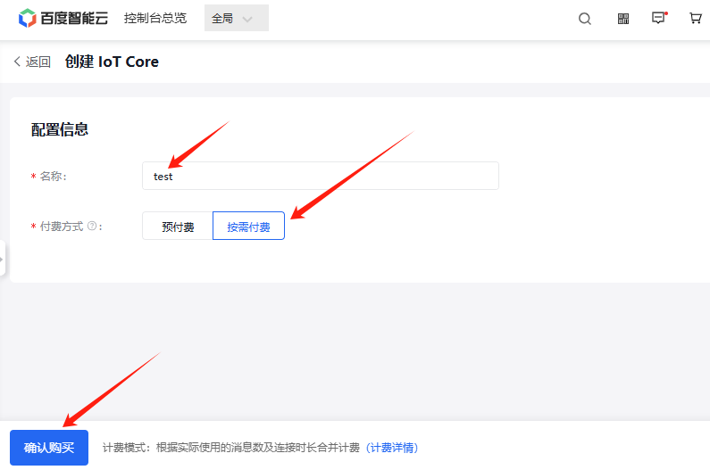

创建完成后，即可在列表页看到刚才创建的 IoT Core 实例。其中第一列展示了其名称及 ID

#### 6.1.3 创建设备模板

创建设备前需要先创建设备模板，默认的设备模板包含两个主题，也可自定义主题，

模板---> 添加模板---> 点击添加的模板名称--> 添加主题。

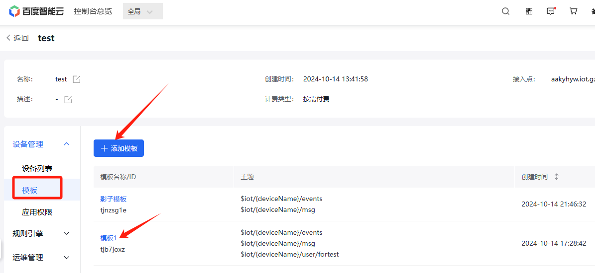

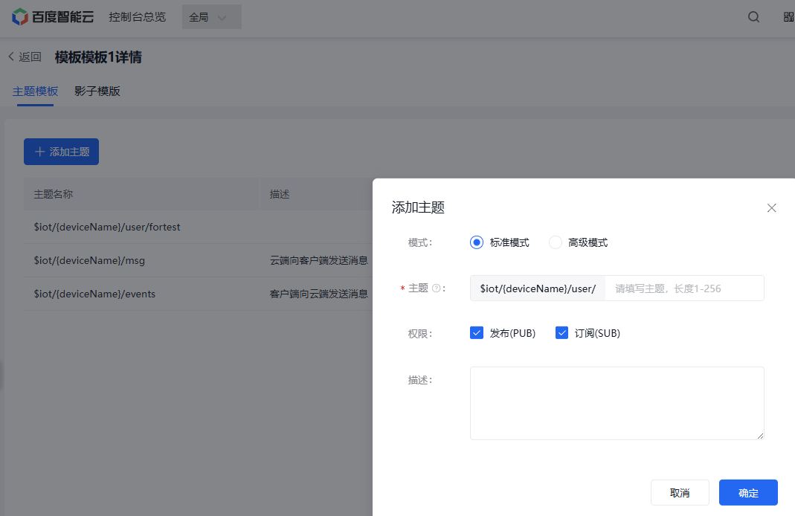

#### 6.1.4 创建设备

1、点击 IoT Core 实例名称

   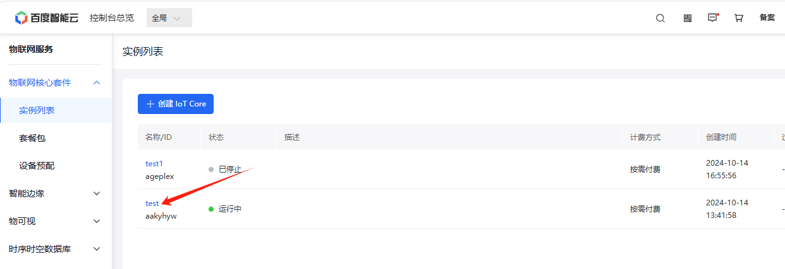

2、点击左侧导航栏中的”设备列表“，选择“新增设备”

   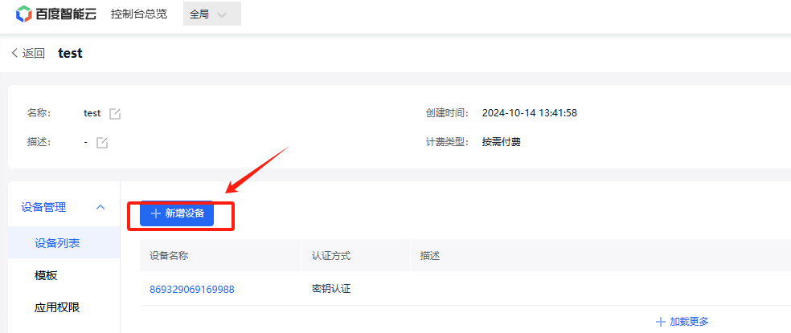

3、填写设备名称（此名称在当前 IoT Core 下唯一）、认证方式、描述（可选），并选择所需要使用的设备模板，点击提交即可完成设备创建

   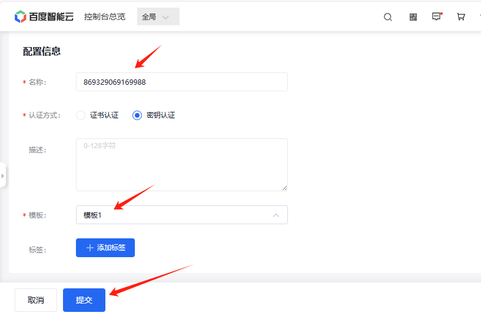

#### 6.1.5 记录连接信息

看到这里说明你已经根据前面的教程完成了设备的创建，接下来需要点击设备名称，记录下连接信息中的 **IoTCoreld，DeviceKey，DeviceSecret** 三个信息，以供后续设备连接云平台使用。

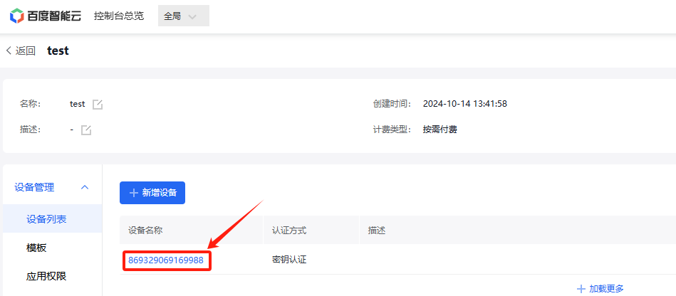

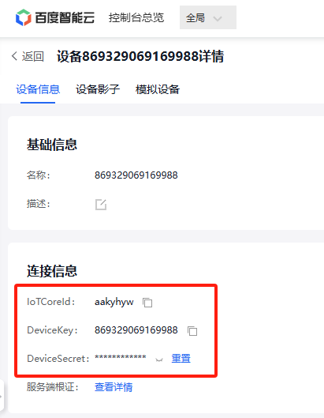

到此为止，创建产品设备工作已经完成，后续会根据不同注册方式来进行实例讲解。

### 6.2 设备注册

百度智能云平台支持两种注册方式，分别为密钥认证(手动注册)和证书认证，目前合宙 iotclcoud 库对于两个注册方式均支持，但是不推荐使用证书认证方式进行注册，因为证书存在过期的情况，需要定期升级维护。

#### 6.2.1 密钥认证(手动注册)

在 6.1.4 创建设备教程中的第 3 步选择密钥验证即可，如下图所示：


将 6.1.5 记录连接信息教程中记录的 IoTCoreld 填入 demo 中的 produt_id 中，DeviceKey 填入 device_name 中，DeviceSecret 填入 device_secret 中。

配置代码如下:

```lua
-- 百度云
iotcloudc = iotcloud.new(iotcloud.BAIDU,{produt_id = "aakyhyw",device_name = "869329069169988",device_secret = "XXX"})
```

第一个参数 iotcloud.BAIDU 表示我们使用的是百度云，

第二个参数{produt_id = "aakyhyw",device_name = "869329069169988",device_secret = "XXX"}  ，我们将上面得到的三个参数填写到 table 中即可，so easy~

#### 6.2.2 证书认证

在 6.1.4 创建设备教程中的第 3 步选择证书认证即可，如下图所示：

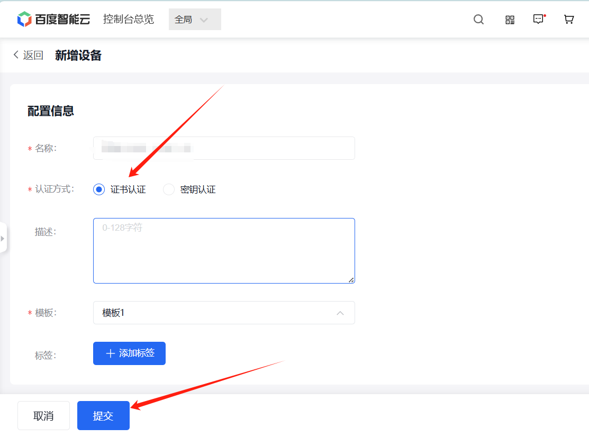

创建好设备后，点击设备名称，查看设备连接信息如下：

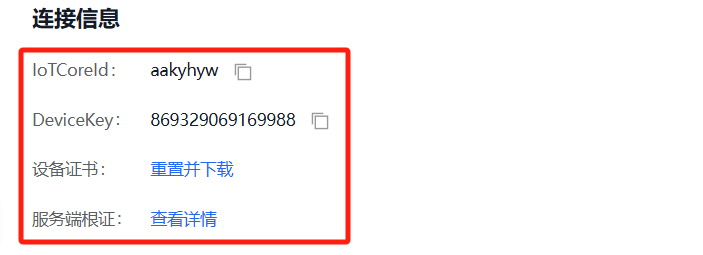

记录下参数，证书部分参考官方文档进行处理 [使用证书鉴权建立 MQTT 连接 - 物联网核心套件 IoTCore | 百度智能云文档 (](https://cloud.baidu.com/doc/IoTCore/s/Fkdqzh6r8)[baidu.com](https://cloud.baidu.com/doc/IoTCore/s/Fkdqzh6r8)[)](https://cloud.baidu.com/doc/IoTCore/s/Fkdqzh6r8)

把设备证书部分保存到新建的 client_cert.txt 中，把设备私钥部分保存到新建的 client_private_key.txt 文件中，并[下载根证文件](https://doc.bce.baidu.com/bce-documentation/IOT/GlobalSign.cer.zip)，然后将 3 个证书文件作为脚本文件一起烧录到模块内，就可以用/luadb/路径直接读取烧录的文件，如下所示：

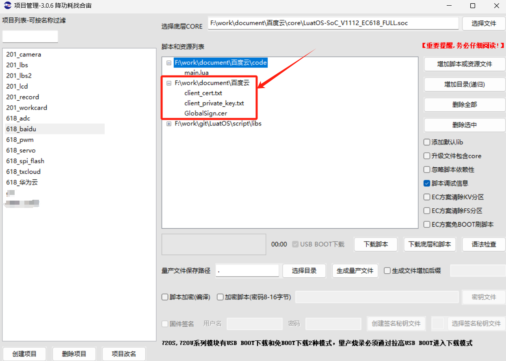

配置代码如下:

```lua
-- 证书认证(自动注册)
iotcloudc = iotcloud.new(iotcloud.BAIDU,{produt_id = "aakyhyw",device_name = "869329069169988"},{tls={server_cert=io.readFile("/luadb/GlobalSign.cer"),client_cert=io.readFile("/luadb/client_cert"),client_key=io.readFile("/luadb/client_private_key")}})
```

第一个参数 iotcloud.BAIDU 表示我们使用的是百度云，第二个和第三个参数我们将上面得到数据写入即可！

### 6.3 效果展示

本例采用密钥认证(手动注册)的方式进行注册并连接云平台。

1、设备日志

   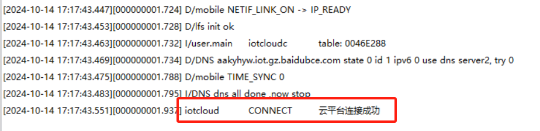

   可以看到我们的设备打印了连接成功，证明手动注册 + 连接流程已经完成。

2、云平台效果
   点击运维管理的用量统计，可显示当前在线连接数量。

   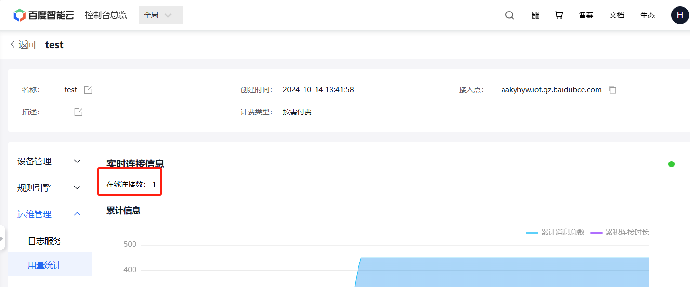

   设备已经自动注册并且在线，至此，云平台已经连接成功。

## 七、代码示例说明及功能验证

本例我们通过密钥认证(手动注册)方式连接百度云平台，实现在平台端通过模拟设备在线工具下发消息，控制 Air780E 的 NET_STATUS 网络灯亮和灭。

> 注意：百度云的物解析型实例已于 2019 年公告不再提供服务，故不能方便的通过云平台管理连接的物联网设备，包括设备的注册、状态监控和数据查看等。因此本例通过百度云平台的模拟设备工具，通过 topic 控制实际设备。

### 7.1 硬件连接

演示使用的是 Air780E 核心板的网络灯，也可以自己外接 led 灯进行控制，根据下图可知控制 NET_STATUS 网络灯的是 gpio27。

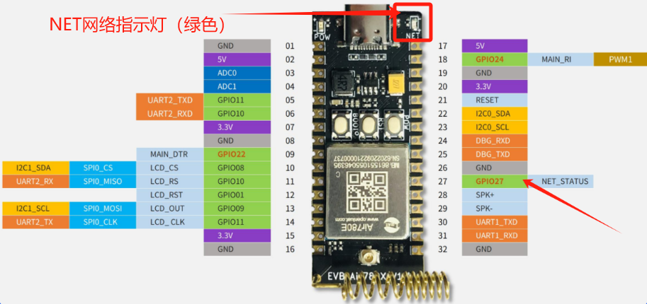

### 7.2 代码使用说明

1、设备注册并连接云平台
   > 记得修改 produt_id ,device_name 和 device_secret 三个参数为自己平台上的。

   ```lua
    sys.taskInit(function()
    -- 等待联网
    local ret, device_id = sys.waitUntil("net_ready")

    -- 百度云
    iotcloudc = iotcloud.new(iotcloud.BAIDU,{produt_id = "aakyhyw",device_name = "869329069169988",device_secret = "XXX"})
    log.info("main", "iotcloudc", iotcloudc)
        if iotcloudc then
            iotcloudc:connect()
        end
    end)
   ```

2、模块端订阅主题，用于百度云平台模拟设备在线工具通过该主题向模块端下发消息

   > 此行代码放置位置，只要在云平台连接成功之后即可，
   > 本文 `iotcloudc:subscribe()` 中的第一个参数订阅的仍然是一个自定义topic。

```lua
iotcloudc:subscribe("$iot/869329069169988/user/fortest") -- 可以自由订阅主题等
```

云平台自定义的 topic 如下所示：详见 4.2.3 创建设备模板中的添加主题教程，本例定义的 topic 兼发布和订阅权限。

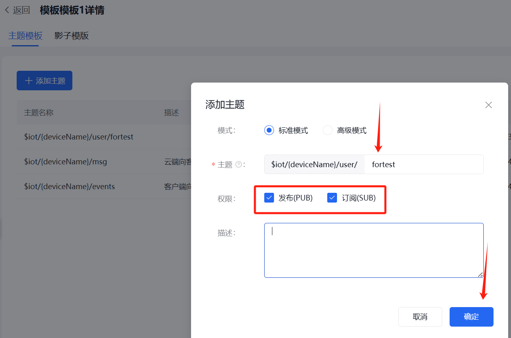

3、模块端接收数据并解析

   > 接收统一使用了 `"iotcloud"` 消息进行通知，所以我们只需要订阅此系统消息即可，收到的消息 open 表示开灯，close 表示关灯

代码如下所示：

```lua
-- 初始化gpio27
LED = gpio.setup(27, 0, gpio.PULLUP)
sys.subscribe("iotcloud", function(cloudc,event,data,payload)
    -- 注意，此处不是协程内，复杂操作发消息给协程内进行处理
    if event == iotcloud.CONNECT then -- 云平台联上了
        print("iotcloud","CONNECT", "云平台连接成功")
        iotcloudc:subscribe("$iot/869329069169988/user/fortest") -- 可以自由订阅主题等

    elseif event == iotcloud.RECEIVE then
        print("iotcloud","topic", data, "payload", payload)
        if payload == 1 then
            LED(1)
        elseif payload == 0 then
            LED(0)
        end
        -- 用户处理代码
    elseif event ==  iotcloud.OTA then
        if data then
            rtos.reboot()
        end
    elseif event == iotcloud.DISCONNECT then -- 云平台断开了
        -- 用户处理代码
        print("iotcloud","DISCONNECT", "云平台连接断开")
    end
end)
```

此时将代码烧录进开发板，即可在百度云平台的在线模拟设备工具控制开发板网络灯的亮灭，如何配置百度云平台下发指令，请看下面介绍：

IoT Core 实例名称"test"---> 设备列表---> 点击设备名称

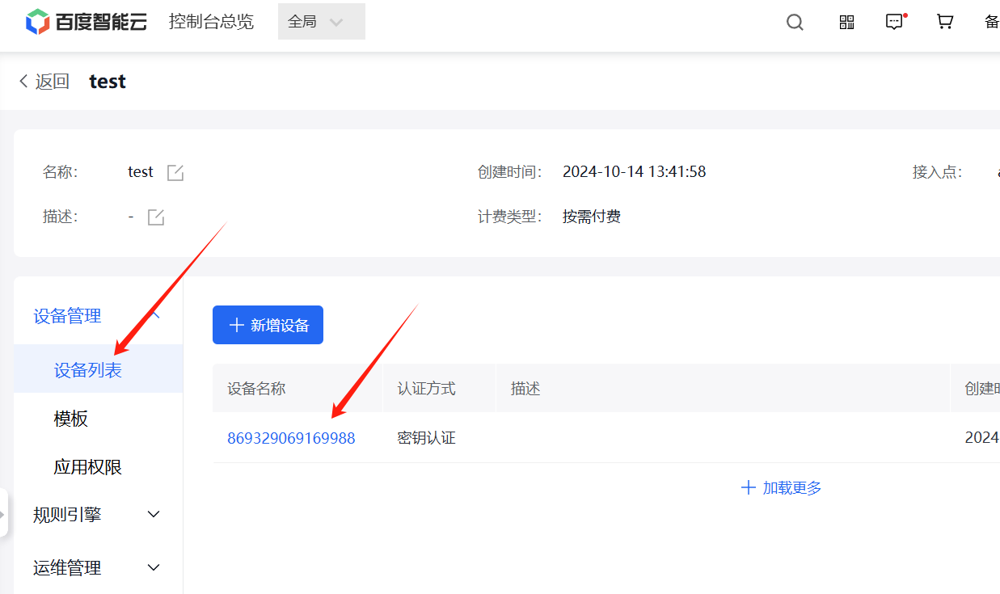

点击模拟设备，再点击开始模拟,填入自定义的 topic，输入 open 开灯或者 close 关灯。

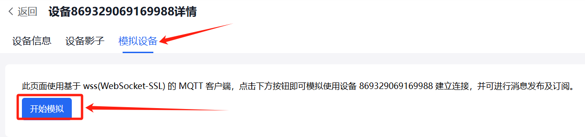

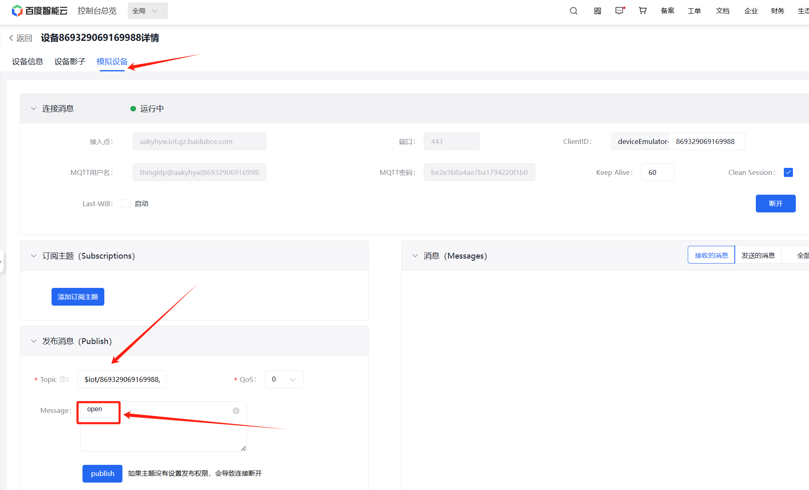

### 7.3 运行结果展示

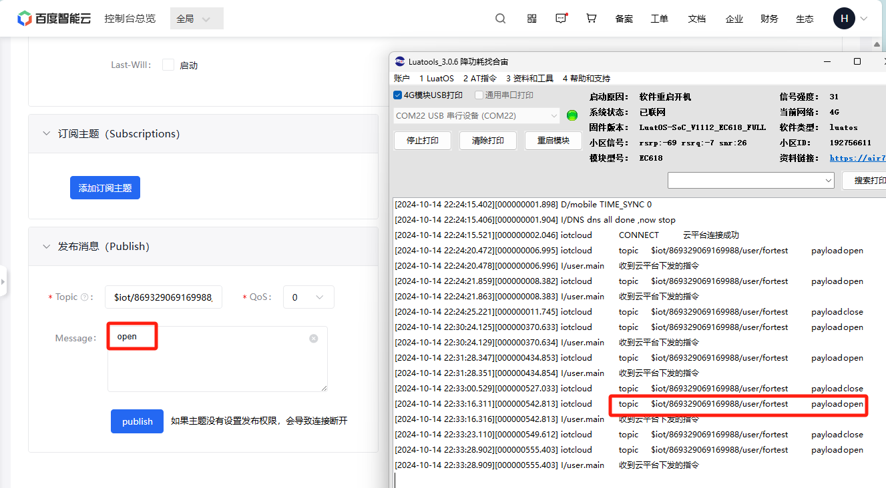

<video controls src="file/baiduyun_iot.mp4"></video>

## 八、总结

本教程简单演示了设备上云，以及设备和云平台在线模拟设备工具的简单通信，看到这里相信你已经完成了设备和百度云平台之间的连接，接下来你可以在此基础上，使用百度云的规则引擎，与 TSDB、物可视等产品进行无缝衔接，在云端轻松构建基于设备的物联网应用！

## 扩展

## 常见问题

1、百度云接入失败，怎么排查？

   > 先检查设备配置，确保设备的 ID,名称,密钥等配置信息正确无误；同时也要检查下网络连接，确保 SIM 卡是正常入网状态，若还是不行，请再仔细看下教程，看是否有哪个步骤有疏漏。

2、百度云旧版和新版区别

   > 百度云旧版的天工物接入 IoT Hub，支持物解析型实例；目前新版为物联网核心套件 IoT Core，不再支持物解析型实例，核心套件的具体使用方法请查阅百度云官网的文档使用介绍。[https://cloud.baidu.com/doc/IoTCore/s/ek7o8ydue](https://cloud.baidu.com/doc/IoTCore/s/ek7o8ydue)


## 给读者的话

> 本篇文章由`王世豪`开发；
>
> 本篇文章描述的内容，如果有错误、细节缺失、细节不清晰或者其他任何问题，总之就是无法解决您遇到的问题；
>
> 请登录[合宙技术交流论坛](https://chat.openluat.com/)，点击[文档找错赢奖金-Air780E-LuatOS-软件指南-网络应用-百度云](https://chat.openluat.com/#/page/matter?125=1849703650633580546&126=%E6%96%87%E6%A1%A3%E6%89%BE%E9%94%99%E8%B5%A2%E5%A5%96%E9%87%91-Air780E-LuatOS-%E8%BD%AF%E4%BB%B6%E6%8C%87%E5%8D%97-%E7%BD%91%E7%BB%9C%E5%BA%94%E7%94%A8-%E7%99%BE%E5%BA%A6%E4%BA%91&askid=1849703650633580546)
> 用截图标注+文字描述的方式跟帖回复，记录清楚您发现的问题；
>
> 我们会迅速核实并且修改文档；
>
> 同时也会为您累计找错积分，您还可能赢取月度找错奖金！
