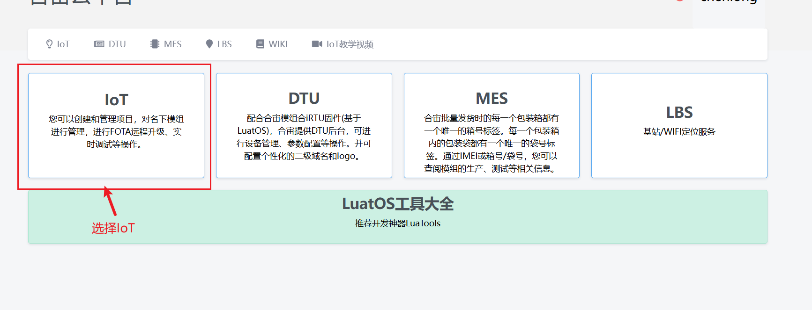
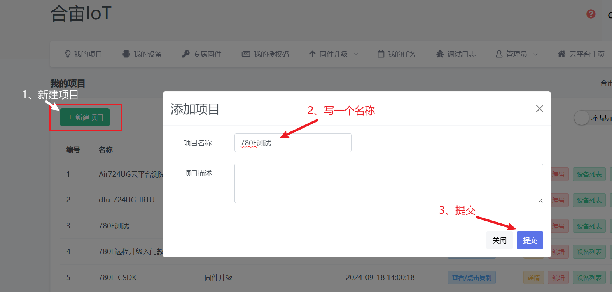
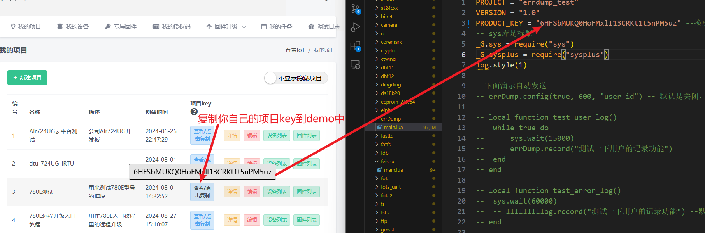
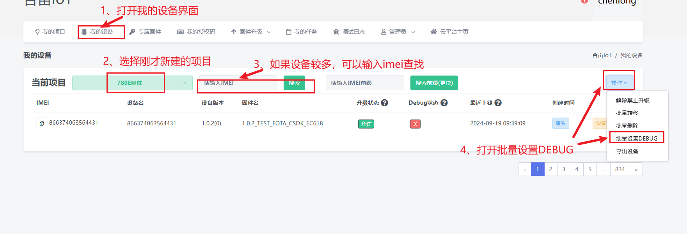
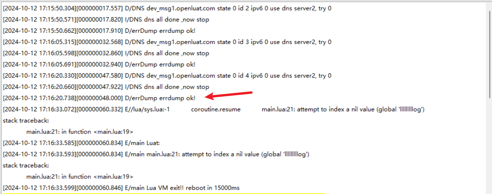
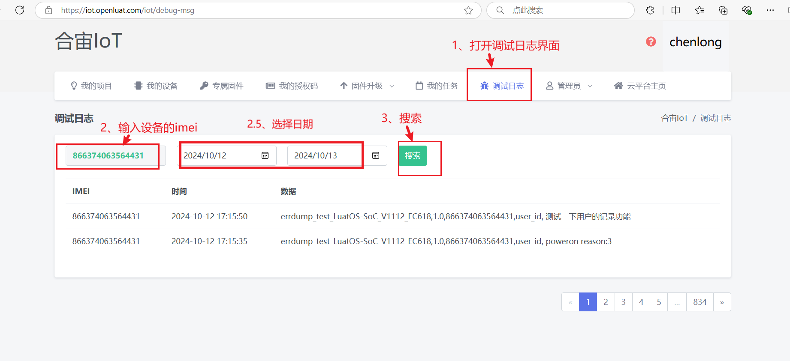

# 003：Air780E-LuatOS-软件 demo-网络应用-errDump

> [!TIP]
> ！！！不要删除这个高亮块中的内容！！！

每次版本迭代时，重新复制之前最近的一份文章内容，放到本文档最上面，然后修改；

必读文章：
[docs.openluat.com 文档开发过程（新人必看）](https://e3zt58hesn.feishu.cn/wiki/BJWIwMWI0ijF2zkiamUcI0s7nwd)
[docs 文章基本要求（大家仔细阅读，严格遵守）](https://e3zt58hesn.feishu.cn/docx/UplIdAaKso4k09xZSG4cMBGfn6e)

写本篇文章时，文章内容可以参考的一些合宙内部的资料（有些资料不是 Air780E 的，仅供参考）：

- 基于 LuatOS 代码仓库中的 onenet 有关的 demo 来写；
- 如果 demo 实现的功能不足以支撑编写本文章，例如功能不完整或者有错误，及时提出来，编写文档的同时完善 demo；
- [Air780E 简介](https://docs.openluat.com/air780e/)
- [Air780E 产品手册](https://docs.openluat.com/air780e/product/)
- [https://docs.openluat.com/blog/pages/20240912_any_luatos_iotcloud_onenet/](https://docs.openluat.com/blog/pages/20240912_any_luatos_iotcloud_onenet/)
- Air724UG（仅供参考）：[https://doc.openluat.com/wiki/21?wiki_page_id=1978](https://doc.openluat.com/wiki/21?wiki_page_id=1978)
- Air724UG（仅供参考）：[https://doc.openluat.com/wiki/92?wiki_page_id=5948](https://doc.openluat.com/wiki/92?wiki_page_id=5948)

写本篇文章时，文章目录结构可以参考一下文章：

- [Air780E LuatOS 快速入门示例 HelloWorld](https://docs.openluat.com/air780e/luatos/quick_start/hello/)
- [合宙 DTU 整机产品线文档中心](https://e3zt58hesn.feishu.cn/wiki/CFgkw6I66idUVnkAeaQcGpL4nfe?chunked=false)
- [Air780E AT 快速入门示例 TCP 通信](https://docs.openluat.com/air780e/at/quick_start/tcp/tcp/)

# 2024-10-14 第一版

## 一、errDump 功能概述

LuatOS-Air 错误日志上报功能模块名叫：errDump，errDump 对“量产投放市场的设备，远程调试初步定位问题”至关重要， 强烈建议客户一定要使用此功能

errDump 就是将模块运行过程中产生的错误信息或者应用日志通过 TCP/UDP 上报到互联网上的指定服务器，技术人员可以在服务器上查阅日志，协助远程了解设备运行情况，或者故障诊断。

迫于服务器压力，只有手动打开 debug 开关，才有日志上报（当使用合宙调试服务器时，开机前先检查一下 log 开关，每 2 小时查询一次 log 开关，如果开关未开启，则不允许上传调试日志），打开方式见《三、实例介绍》

## 二、演示功能概述

本示例将演示上报错误日志的功能。

## 三、准备硬件环境

### 3.1 780E 开发板一套

淘宝购买链接：[Air780E 核心板淘宝购买链接](https://item.taobao.com/item.htm?id=693774140934&pisk=f1eiwOqL25l1_HYiV6D1ize3wN5d5FMjRrpxkx3VT2uIHCCskWm4kysffAEqor4KRRIskGT0ooqi_coq7DWE000qbVr2mmzKQjNtkV3mnoalvaBRelZshA7RyTFdpD4xQco2_VS2Tcnvc89h5lZshq-pu_FUfEDVVdOmgrkET0ir3mkq_MDEmmM2QjJaY2uI0UGAoNueWRjiw4YTC-_opNr-zluaXleFpfR_X2fhTJVn94W--KJ4KcqQreCDEs3zNVh-DyWpIxqEmyc8savgoor7gX2D7GUzmW4jBJS2_4PTWjestFRZqA0iaRlwjdkIgW2nBR7XNkEn7bDL96_tMA4gN4GNOwa0xVU4IX8G4iReapZyhDSYLIOj_DinyhbSB2IHjbEhxMA51foIXaIhxItMPKJlyMjHNEGZAcQR.&spm=a1z10.5-c-s.w4002-24045920841.33.639f1fd1YrS4b6&skuId=5098266470883) ；

此核心板的详细使用说明参考：[Air780E 产品手册](https://docs.openluat.com/air780e/product/) 中的 << 开发板 Core_Air780E 使用说明 V1.0.5.pdf>>。


### 3.2 SIM 卡

请准备一张可正常上网的 SIM 卡，该卡可以是物联网卡或您的个人手机卡。

**特别提醒：**请确保 SIM 卡未欠费且网络功能正常，以便顺利进行后续操作。

### 3.3 数据通信线

typec 接口 USB 数据线即可。

### 3.4 PC 电脑

WINDOWS 系统。

## 四、准备软件环境

### 2.1 基本的下载调试工具

使用说明参考：[Luatools 下载和详细使用](https://docs.openluat.com/Luatools/) ；

## 五、errDump 软硬件资料

本文通过 demo 演示来说明本章节内容的基本用法。

### 5.1 源码和工具

- 780E 模块使用固件：[SDK& Demo - 合宙文档中心](https://docs.openluat.com/air780e/luatos/firmware/)，本 demo 使用的固件版本是：LuatOS-SoC_V1112_EC618_FULL.soc
- 本教程使用的 demo：[https://gitee.com/openLuat/LuatOS-Air780E/tree/master/demo/errDump](https://gitee.com/openLuat/LuatOS-Air780E/tree/master/demo/errDump)
- 将固件和脚本烧录到模块中，使用说明参考：[Luatools 下载和详细使用](https://docs.openluat.com/Luatools/)
- 合宙云平台：[https://iot.openluat.com](https://iot.openluat.com)
- 源码和固件已打包，如下所示：

### 5.2 本 demo 使用 api 介绍

#### errDump.config(enable, period, user_flag, custom_id, host, port)

作用：配置关键日志上传 IOT 平台，这里的日志包括引起 luavm 异常退出的日志和用户通过 record 写入的日志，类似于 air 的 errDump.

**参数**

| **传入值类型**<br/> | **解释**<br/>                                                                                                                                                                                     |
| ------------------- | ------------------------------------------------------------------------------------------------------------------------------------------------------------------------------------------------- |
| boolean<br/>        | 是否启用记录功能，false 的话将不会记录任何日志<br/>                                                                                                                                               |
| int<br/>            | 定时上传周期，单位秒，默认 600 秒，这个是自动上传时候后的重试时间时间，在开机后或者有 record 操作后会很快尝试上传到合宙 IOT 平台一次，如果为 0，则不会上传，由用户 dump 后自己上传自己的平台<br/> |
| string<br/>         | 用户的特殊标识，可以为空<br/>                                                                                                                                                                     |
| string<br/>         | 设备识别号, 4G 设备默认是 imei,其他设备默认是 mcu.unique_id<br/>                                                                                                                                  |
| string<br/>         | 服务器域名,默认 dev_msg1.openluat.com<br/>                                                                                                                                                        |
| int<br/>            | 服务器端口,默认<br/>                                                                                                                                                                              |

**返回值**

| **返回值类型**<br/> | **解释**<br/> |
| ------------------- | ------------- |
| nil<br/>            | 无返回值<br/> |

#### errDump.dump(zbuff, type, isDelete)

作用：手动读取异常日志，主要用于用户将日志发送给自己的服务器而不是 IOT 平台，如果在 errDump.config 配置了周期上传，则不能使用本函数

**参数**

| **传入值类型**<br/> | **解释**<br/>                                                |
| ------------------- | ------------------------------------------------------------ |
| zbuff<br/>          | 日志信息缓存，如果为 nil 就不会读出，一般当<br/>             |
| int<br/>            | 日志类型，目前只有 errDump.TYPE_SYS 和 errDump.TYPE_USR<br/> |
| boolean<br/>        | 是否删除日志<br/>                                            |

**返回值**

| **返回值类型**<br/> | **解释**<br/>                                                                                        |
| ------------------- | ---------------------------------------------------------------------------------------------------- |
| boolean<br/>        | true 表示本次读取前并没有写入数据，false 反之，在删除日志前，最好再读一下确保没有新的数据写入了<br/> |

#### errDump.record(string)

作用：写入用户的异常日志，注意最大只有 4KB，超过部分新的覆盖旧的，开启自动上传后会上传到合宙 IOT 平台

**参数**

| **传入值类型**<br/> | **解释**<br/> |
| ------------------- | ------------- |
| string<br/>         | 日志<br/>     |

**返回值**

| **返回值类型**<br/> | **解释**<br/> |
| ------------------- | ------------- |
| nil<br/>            | 无返回值<br/> |

## 六、代码示例介绍

### 6.1  上传错误日志到合宙云平台

#### 6.1.1  云平台配置

合宙云平台：[https://iot.openluat.com](https://iot.openluat.com)

##### 6.1.1.1  打开 IoT 平台



##### 6.1.1.2  新建一个项目



##### 6.1.1.3  将你自己建的项目 key 复制到 demo 中



##### 6.1.1.4 打开设备 DEBUG 开关




#### 6.1.2 demo 介绍

这里测试用的是合宙云平台上报。

demo 程序中打开自动上报合宙云平台部分，注释掉手动获取信息部分。

使用合宙云平台查看上报错误信息的话，代码更改如下：

```lua
PROJECT = "errdump_test"
VERSION = "1.0"
PRODUCT_KEY = "s1uUnY6KA06ifIjcutm5oNbG3MZf5aUv" --换成自己的
-- sys库是标配
_G.sys = require("sys")
_G.sysplus = require("sysplus")
log.style(1)

--下面演示自动发送
errDump.config(true, 600, "user_id")    -- 默认是关闭，用这个可以额外添加用户标识，比如用户自定义的ID之类

local function test_user_log()
    while true do
        sys.wait(15000)
        errDump.record("测试一下用户的记录功能")
    end
end

local function test_error_log()
    sys.wait(60000)
    lllllllllog.record("测试一下用户的记录功能") --默认写错代码死机
end

-- -- 下面演示手动获取信息
-- errDump.config(true, 0)
-- local function test_user_log()
--  local buff = zbuff.create(4096)
--  local new_flag = errDump.dump(buff, errDump.TYPE_SYS)       -- 开机手动读取一次异常日志
--  if buff:used() > 0 then
--      log.info(buff:toStr(0, buff:used()))    -- 打印出异常日志
--  end
--  new_flag = errDump.dump(buff, errDump.TYPE_SYS)
--  if not new_flag then
--      log.info("没有新数据了，删除系统错误日志")
--      errDump.dump(nil, errDump.TYPE_SYS, true)
--  end
--  while true do
--      sys.wait(15000)
--      errDump.record("测试一下用户的记录功能")
--      local new_flag = errDump.dump(buff, errDump.TYPE_USR)
--      if new_flag then
--          log.info("errBuff", buff:toStr(0, buff:used()))
--      end
--      new_flag = errDump.dump(buff, errDump.TYPE_USR)
--      if not new_flag then
--          log.info("没有新数据了，删除用户错误日志")
--          errDump.dump(nil, errDump.TYPE_USR, true)
--      end

--  end
-- end

-- local function test_error_log()
--  sys.wait(60000)
--  lllllllllog.record("测试一下用户的记录功能") --默认写错代码死机
-- end

sys.taskInit(test_user_log)
sys.taskInit(test_error_log)
sys.run()
```

## 七、功能验证

### 7.1 Luatools 日志打印



### 7.2 云平台查看错误上报



## 八、总结

本示例介绍了将错误日志上报到合宙云平台的功能。

## 扩展

## 常见问题


## 给读者的话

> 本篇文章由`孙晨龙`开发；
>
> 本篇文章描述的内容，如果有错误、细节缺失、细节不清晰或者其他任何问题，总之就是无法解决您遇到的问题；
>
> 请登录[合宙技术交流论坛](https://chat.openluat.com/)，点击[文档找错赢奖金-Air780E-LuatOS-软件指南-网络应用-errDump](https://chat.openluat.com/#/page/matter?125=1846802109790552065&126=%E6%96%87%E6%A1%A3%E6%89%BE%E9%94%99%E8%B5%A2%E5%A5%96%E9%87%91-Air780E-LuatOS-%E8%BD%AF%E4%BB%B6%E6%8C%87%E5%8D%97-%E7%BD%91%E7%BB%9C%E5%BA%94%E7%94%A8-errDump&askid=1846802109790552065)；
>
> 用截图标注+文字描述的方式跟帖回复，记录清楚您发现的问题；
>
> 我们会迅速核实并且修改文档；
>
> 同时也会为您累计找错积分，您还可能赢取月度找错奖金！

