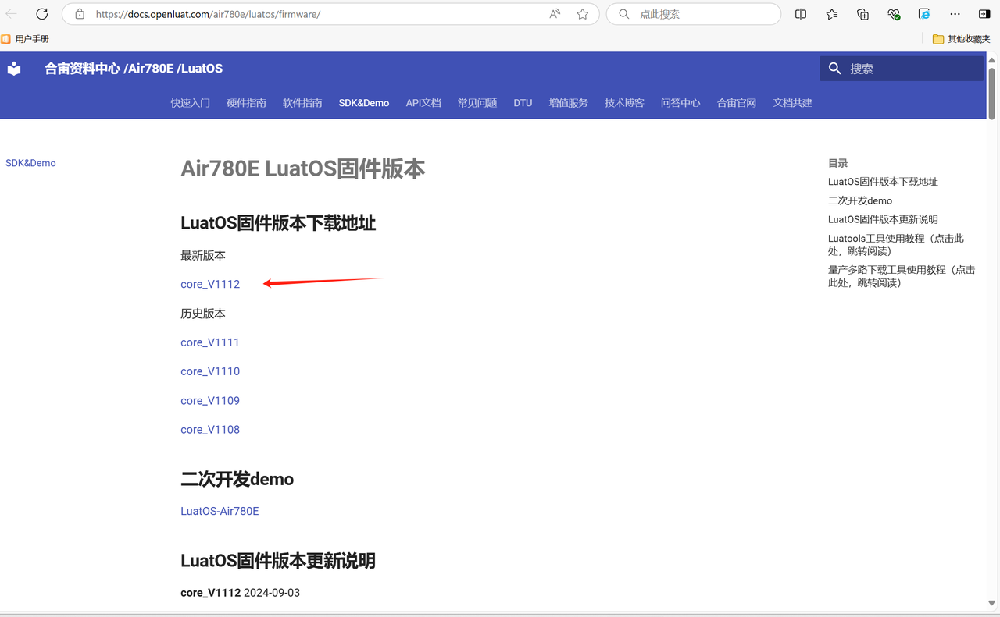

## 一、华为云概述

华为云物联网平台设备接入云服务（IoTDA）提供海量设备的接入和管理能力，将物理设备联接到云，支撑设备数据采集上云和云端下发命令给设备进行远程控制，配合华为云其他产品，帮助您快速构筑物联网解决方案。

**官网地址：**[设备接入-控制台 (](https://console.huaweicloud.com/iotdm/?region=cn-north-4#/dm-portal/instance)[huaweicloud.com](https://console.huaweicloud.com/iotdm/?region=cn-north-4#/dm-portal/instance)[)](https://console.huaweicloud.com/iotdm/?region=cn-north-4#/dm-portal/instance)

> 注意：**华为的账号分为华为账号   华为云账号，IAM 账号，注意区别**

## 二、演示功能概述

接下来为大家介绍 Air780E 如何接入华为云，并且会介绍如何进行华为云的上下行交互处理。

1. 模块端每隔 2 秒发布一次 qos 为 1 的消息到平台端
2. 平台端下发消息，控制模块端灯的亮灭

## 三、准备硬件环境

### 3.1 开发板准备

使用 Air780E 核心板，如下图所示：


淘宝购买链接：[Air780E 核心板淘宝购买链接](https://item.taobao.com/item.htm?id=693774140934&pisk=f1eiwOqL25l1_HYiV6D1ize3wN5d5FMjRrpxkx3VT2uIHCCskWm4kysffAEqor4KRRIskGT0ooqi_coq7DWE000qbVr2mmzKQjNtkV3mnoalvaBRelZshA7RyTFdpD4xQco2_VS2Tcnvc89h5lZshq-pu_FUfEDVVdOmgrkET0ir3mkq_MDEmmM2QjJaY2uI0UGAoNueWRjiw4YTC-_opNr-zluaXleFpfR_X2fhTJVn94W--KJ4KcqQreCDEs3zNVh-DyWpIxqEmyc8savgoor7gX2D7GUzmW4jBJS2_4PTWjestFRZqA0iaRlwjdkIgW2nBR7XNkEn7bDL96_tMA4gN4GNOwa0xVU4IX8G4iReapZyhDSYLIOj_DinyhbSB2IHjbEhxMA51foIXaIhxItMPKJlyMjHNEGZAcQR.&spm=a1z10.5-c-s.w4002-24045920841.33.639f1fd1YrS4b6&skuId=5098266470883) ；

此核心板的详细使用说明参考：[Air780E 产品手册](https://docs.openluat.com/air780e/product/) 中的 << 开发板 Core_Air780E 使用说明 VX.X.X.pdf>>，写这篇文章时最新版本的使用说明为：<< 开发板 Core_Air780E 使用说明 V1.0.5.pdf>> ；核心板使用过程中遇到任何问题，可以直接参考这份使用说明 pdf 文档。

### 3.2 数据通信线

USB 转 typeC 数据线一根。

### 3.3 PC 电脑

WINDOWS 系统，其他暂无特别要求。

## 四、准备软件环境

### 4.1 下载调试工具

使用说明参考：[Luatools 下载和详细使用](https://docs.openluat.com/Luatools/)

### 4.2 源码及固件

1. 底层 core 下载地址：[LuatOS 固件版本下载地址](https://docs.openluat.com/air780e/luatos/firmware/)本 demo 使用的固件是 core_V1112 压缩包内的 LuatOS-SoC_V1112_EC618_FULL.soc
2. 本教程使用的 demo：[https://gitee.com/openLuat/LuatOS-Air780E/tree/master/demo/iotcloud](https://gitee.com/openLuat/LuatOS-Air780E/tree/master/demo/iotcloud)
3. 源码和固件已打包，如下所示：
   > 注：压缩包中 core 文件夹存放固件，code 文件夹存放 demo。

[右键点我,另存为,下载完整压缩文件包](file/华为云.zip){:target="_blank"}

## 五、华为云软硬件资料

### 5.1 iotcloud 库介绍

众所周知，市面上有很多云平台，阿里云、腾讯云、中移 onenet、华为云、百度云、Tlink 云等等......并且每家都有自己的协议，工程师要移植不同的 sdk 代码或基于各家的手册文档对接不同的协议，看着都头大！！！

所以 iotcloud 应运而生！iotcloud 是合宙专门为了合并 iot 平台而制作的库，意在使用统一且极简的代码接入各个云平台，轻松实现云功能。用户无需为那么多云平台的接入而头疼，只需要极简的通用 API 即可轻松上云！并且因为通用，所以云平台之间的迁移也十分方便。

iotcloud 库本质就是上层设计一套通用的 API 库来进行每个平台功能的对接。目前已经实现了各个平台的所有注册方式，其中自动注册会将相关验证信息保存 kv，随后使用此验证信息进行连接，通知针对每个平台添加了特有系统实现，比如设备上线通知，设备版本号上传，ota 功能等，用户无需管理这些只需要注意相关下发消息做应用逻辑即可。

### 5.2 API 接口介绍

本教程使用 api 接口为:[iotcloud - iotcloud 云平台库 (已支持: 腾讯云 阿里云 onenet 华为云 涂鸦云 百度云 Tlink 云 其他也会支持,有用到的提 issue 会加速支持) - LuatOS 文档](https://wiki.luatos.com/api/libs/iotcloud.html?highlight=iotcloud)

### 5.3 Air780E 烧录说明

将 Air780E 通过通过 usb 数据线连接电脑，如下图所示：

> 注：
> 1、按住下载模式按键（boot 键）不放，同时再长按开机键开机，这时开发板会进入下载模式，Luatools 下载进度条会开始跑，这时可以松开 boot 按键。直到工具提示下载完成。
> 2、如果，未能成功进入下载模式，而是进入正常开机模式，这时可以按住 boot 键，再短按复位按键，让开发板重启，重新进入下载模式。


如何判断有没有进入下载模式:可以通过 PC 端的设备管理器中虚拟出来的 USB 端口数量来判断。

**正常开机模式：**


**下载模式：**


## 六、云平台配置与效果展示

### 6.1 云平台配置

#### 6.1.1 登录并开通 IoTDA 实例

登录官网[设备接入-控制台 (](https://console.huaweicloud.com/iotdm/?region=cn-north-4#/dm-portal/instance)[huaweicloud.com](https://console.huaweicloud.com/iotdm/?region=cn-north-4#/dm-portal/instance)[)](https://console.huaweicloud.com/iotdm/?region=cn-north-4#/dm-portal/instance)注册**华为云账号**开通物联网平台，填写实例名称，标签、实例描述可根据需要选填，完成之后点击立即创建。

> 注:华为云首页若找不到该入口，在搜索框输入 "设备接入 IoTDA”  关键字进入。


开通实例后点击详情，如下图所示：


接入地址中**.iotda **前的数据为** endpoint，**即下图中红框处，此信息需要记录下来，供后续使用，如果忘了记录也没有关系，后续可以再重新点开实例详情查看。


#### 6.1.2 创建产品

产品---> 创建产品---> 填写信息---> 确定

> 注意：下图中创建产品的各类信息为本教程需要，可根据实际情况自行选择。


创建产品后的**产品 ID** 要记录下来，后面会用到


到此为止，创建产品工作已经完成，同时需要注意将 **endpoint** 和**产品 ID** 记录下来，后续会根据不同注册方式来进行实例讲解。

### 6.2 设备注册

华为云动态注册即自动注册相当于管理员用操作 api 强制注册，华为云本身并没有直接的自动注册 api，故不建议此方式，本文也不再介绍该注册方式，仅介绍密钥校验(手动注册)方式。

#### 6.2.1 密钥校验(手动注册)

1. 创建设备并获取参数

    此注册方式采用一机一密，需要手动创建设备预注册

    点击所有设备---> 注册设备---> 填写信息(设备标识码可以填开发板的 IMEI 号)---> 设备认证类型选择密钥

    

    设备创建成功后将密钥复制并记录下来，后面会用到

    

    接下来我们再来看下代码具体怎么用：

    ```lua
    -- 密钥校验(手动注册)
    iotcloudc = iotcloud.new(iotcloud.HUAWEI,{produt_id = "670be456fc8d5a4ea71c4ff1",endpoint = "5341624af8.st1",device_name = "869329069169988",device_secret = "xxx"})
    ```

    第一个参数表示我们使用的是华为云，

    第二个参数我们将上面得到的产品 ID 填入 produt_id 、endpoint 填入 endpoint 、设备名(即设备标识符码)填入 device_name，设备密钥填入 device_secret ，非常简单~

### 6.3 效果展示

本例采用密钥校验(手动注册)的方式进行注册并连接云平台。

1. 设备日志
       

    可以看到我们的设备打印了连接成功，证明手动注册 + 连接流程已经完成。

2. 云平台效果

    

    设备已经自动注册并且在线，

    至此，云平台已经连接成功，剩下的就是要根据自己的产品需求，自己的物模型上报/下发数据就可以了。

## 七、代码示例说明及功能验证

本例我们通过密钥校验(手动注册)方式连接华为云平台，实现模块端的上发消息和平台端的下发消息，控制 Air780E 的 NET_STATUS 网络灯亮和灭。

### 7.1 硬件连接

演示使用的是 Air780E 核心板的网络灯，也可以自己外接 led 灯进行控制，根据下图可知控制 NET_STATUS 网络灯的是 gpio27。


### 7.2 代码使用说明

1. 设备注册并连接云平台

    ```lua
    sys.taskInit(function()
        -- 等待联网
        local ret, device_id = sys.waitUntil("net_ready")
        -- -- 华为云
        -- 手动注册 (预注册) ，需要密钥校验
        iotcloudc = iotcloud.new(iotcloud.HUAWEI,{produt_id = "670be456fc8d5a4ea71c4ff1",endpoint = "5341624af8.st1",device_name = "869329069169988",device_secret = "bce7ee37da51ac52c040"})

        log.info("main", "iotcloudc", iotcloudc)
        if iotcloudc then
            iotcloudc:connect()
        end
    end)
    ```

2. 模块端每隔 2 秒发布一次 qos 为 1 的消息到平台端
   > 本文 `iotcloudc:publish()` 中的第一个参数订阅的是一个自定义 topic,该自定义 topic 在产品详情内的 Topic 管理中进行自定义。
   >

    

    代码使用如下：

    ```lua
    -- 每隔2秒发布一次qos为1的消息到云平台
    sys.taskInit(function()
        while 1 do
            sys.wait(2000)
            if iotcloudc then
                iotcloudc:publish("$oc/devices/869329069169988/user/up", "hello world!", 1)
            end
        end
    end)
    ```

    此时云平台在监控运维---> 消息跟踪---> 选择设备，即可看到设备上报的消息，如下图所示：

    

3. 模块端订阅主题，用于平台端通过该主题向模块端下发消息
   > 此行代码放置位置，只要在云平台连接成功之后即可
   >本文 `iotcloudc:subscribe()` 中的第一个参数订阅的仍然是一个自定义 topic

    ```lua
    iotcloudc:subscribe("/huawei/down/869329069169988") -- 可以自由订阅主题等
    ```

4. 模块端接收数据并解析

    > 接收统一使用了 `"iotcloud"` 消息进行通知，所以我们只需要订阅此系统消息即可，收到消息后通过json.decode(payload)解析
    >字符串,再通过`.content.switch`获取到其中的`switch`值，这个值表示要开关LED的状态，下面代码逻辑中，输入1表示开灯，输入
    >0表示关灯。

    代码如下所示：

    ```lua
    sys.subscribe("iotcloud", function(cloudc,event,data,payload)
        -- 注意，此处不是协程内，复杂操作发消息给协程内进行处理
        if event == iotcloud.CONNECT then -- 云平台联上了
            print("iotcloud","CONNECT", "云平台连接成功")
            iotcloudc:subscribe("/huawei/down/869329069169988") -- 可以自由订阅主题等
        elseif event == iotcloud.RECEIVE then
            print("iotcloud","topic", data, "payload", payload)
            local test_value = json.decode(payload).content.switch
            print("test value:", test_value)

            if test_value == 1 then
                LED(1)
            elseif test_value == 0 then
                LED(0)
            end
            -- 用户处理代码
        elseif event ==  iotcloud.OTA then
            if data then
                rtos.reboot()
            end
        elseif event == iotcloud.DISCONNECT then -- 云平台断开了
            -- 用户处理代码
            print("iotcloud","DISCONNECT", "云平台连接断开")
        end
    end)
    ```

    此时将代码烧录进开发板，即可在华为云平台控制开发板网络灯的亮灭，如何配置华为云平台下发指令，请看下面介绍：

    进入设备，点击调试，再点击前往新版（本示例使用华为云新版本在线调试工具）。

    

    

    在线调试工具选择自定义 topic，消息内容采用 json 格式，方便代码解析

    

### 7.3 运行结果展示

消息内容选择{"switch":1}发送，即可控制开灯；{"switch":0}即可控制关灯，如视频中绿灯所示。
<video controls src="file/huawei_iot.mp4"></video>

## 八、总结

本教程介绍了华为云的两种注册接入方法，并通过一个示例进行合宙 Air780E 开发板和华为云平台之间通信的演示，复杂的接口已封装在底层，而我们只需要根据上面的 API 接口即可实现两者的通信，继而开发出我们自己想要的产品，更多玩法还在等待你的探索！

## 扩展

## 常见问题

1. 华为云接入失败，怎么排查？
   > 先检查设备配置，确保设备的 ID,名称,密钥等配置信息正确无误；同时也要检查下网络连接，确保 SIM 卡是正常入网状态，若还是不行，请再仔细看下教程，看是否有哪个步骤有疏漏。


## 给读者的话

> 本篇文章由`王世豪`开发；
>
> 本篇文章描述的内容，如果有错误、细节缺失、细节不清晰或者其他任何问题，总之就是无法解决您遇到的问题；
>
> 请登录[合宙技术交流论坛](https://chat.openluat.com/)，点击[文档找错赢奖金-Air780E-LuatOS-软件指南-网络应用-华为云](https://chat.openluat.com/#/page/matter?125=1848634582514139138&126=%E6%96%87%E6%A1%A3%E6%89%BE%E9%94%99%E8%B5%A2%E5%A5%96%E9%87%91-Air780E-LuatOS-%E8%BD%AF%E4%BB%B6%E6%8C%87%E5%8D%97-%E7%BD%91%E7%BB%9C%E5%BA%94%E7%94%A8-%E5%8D%8E%E4%B8%BA%E4%BA%91&askid=1848634582514139138)
> 用截图标注+文字描述的方式跟帖回复，记录清楚您发现的问题；
>
> 我们会迅速核实并且修改文档；
>
> 同时也会为您累计找错积分，您还可能赢取月度找错奖金！
