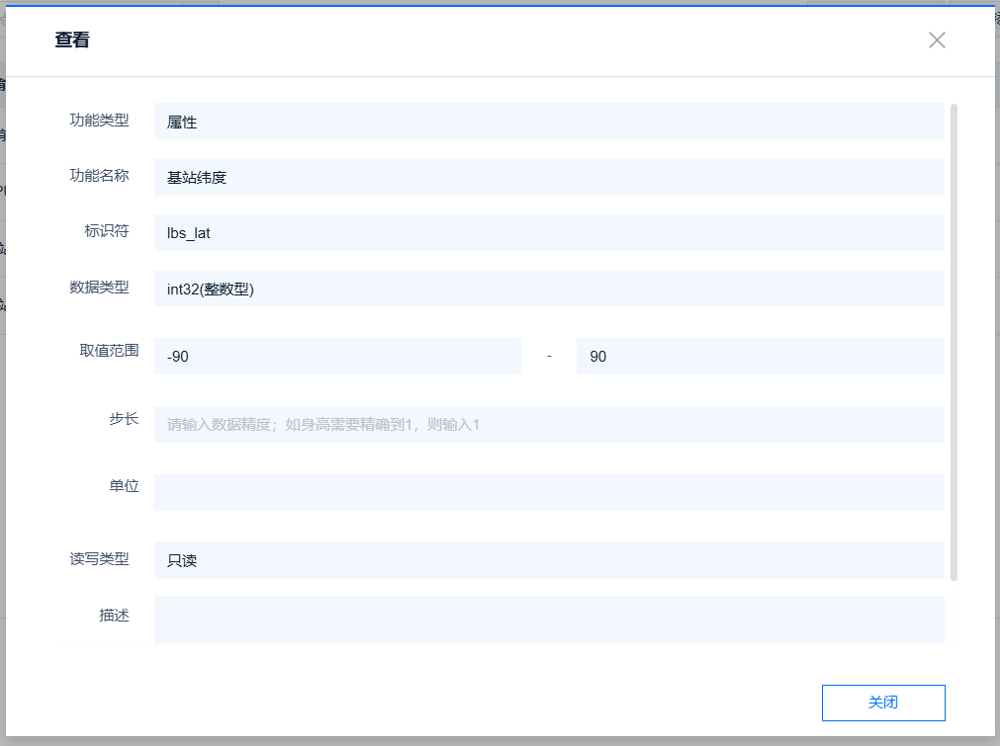

## 一、OneNET 简介

OneNET 是中国移动提供的物联网开放平台，支持设备接入、数据管理、应用开发、增值服务等能力，为城市、行业、生活等场景提供智能化解决方案。接下来

## 二、演示功能概述

本文为大家介绍 780E 如何接入 OneNET，并且会介绍如何进行一次完整的 OneNET 的上下行交互处理。

## 三、准备硬件环境

“古人云：‘工欲善其事，必先利其器。’在深入介绍本功能示例之前，我们首先需要确保以下硬件环境的准备工作已经完成。”

### 3.1  Air780E 开发板

本次使用的开发板为 Air780E 核心板，如下图所示：


点击链接购买：[Air780E 核心板淘宝购买链接](https://item.taobao.com/item.htm?id=693774140934&pisk=f1eiwOqL25l1_HYiV6D1ize3wN5d5FMjRrpxkx3VT2uIHCCskWm4kysffAEqor4KRRIskGT0ooqi_coq7DWE000qbVr2mmzKQjNtkV3mnoalvaBRelZshA7RyTFdpD4xQco2_VS2Tcnvc89h5lZshq-pu_FUfEDVVdOmgrkET0ir3mkq_MDEmmM2QjJaY2uI0UGAoNueWRjiw4YTC-_opNr-zluaXleFpfR_X2fhTJVn94W--KJ4KcqQreCDEs3zNVh-DyWpIxqEmyc8savgoor7gX2D7GUzmW4jBJS2_4PTWjestFRZqA0iaRlwjdkIgW2nBR7XNkEn7bDL96_tMA4gN4GNOwa0xVU4IX8G4iReapZyhDSYLIOj_DinyhbSB2IHjbEhxMA51foIXaIhxItMPKJlyMjHNEGZAcQR.&spm=a1z10.5-c-s.w4002-24045920841.33.639f1fd1YrS4b6&skuId=5098266470883) ；

此核心板的详细使用说明参考：[Air780E 产品手册](https://docs.openluat.com/air780e/product/) 中的 << 开发板 Core_Air780E 使用说明 VX.X.X.pdf>>，写这篇文章时最新版本的使用说明为：[开发板 Core_Air780E 使用说明 V1.0.5.pdf](https://cdn.openluat-luatcommunity.openluat.com/attachment/20240419155721583_%E5%BC%80%E5%8F%91%E6%9D%BFCore_Air780E%E4%BD%BF%E7%94%A8%E8%AF%B4%E6%98%8EV1.0.5.pdf) ；核心板使用过程中遇到任何问题，可以直接参考这份使用说明 pdf 文档。

### 3.2 SIM 卡

请准备一张可正常上网的 SIM 卡，该卡可以是物联网卡或您的个人手机卡。

**特别提醒：**请确保 SIM 卡未欠费且网络功能正常，以便顺利进行后续操作。

### 3.3 PC 电脑

请准备一台配备 USB 接口且能够正常上网的电脑。

### 3.4 数据通信线

请准备一根用于连接 Air780E 开发板和 PC 电脑的数据线，该数据线将实现业务逻辑的控制与交互。您有两种选择：

- USB 数据线（其一端为 Type-C 接口，用于连接 Air780E 开发板）。通常，这种数据线的外观如下示意图所示：


普通的手机 USB 数据线一般都可以直接使用；

- 数据线是 USB 转 TTL 串口线。通常，这种数据线的外观如下示意图所示：


在本教程中，我们将采用以下数据线配置进行测试和数据查看：

- 第一种：USB 数据线：此数据线不仅用于为测试板供电，还用于查看数据日志。其一端为 Type-C 接口，连接 Air780E 开发板；另一端为标准 USB 接口，连接 PC 电脑。
- 第二种：USB 转 TTL 串口线：此数据线主要用于 Websocket-UART 透传数据的查看。其一端为 USB 接口，连接 PC 电脑；另一端为 TTL 串口接口，连接 Air780E 开发板，以便进行串口通信和数据传输。

### 3.5 组装硬件环境

#### 3.5.1 请按照 SIM 卡槽上的指示方向正确插入 SIM 卡，务必确保插入方向正确，避免插反导致损坏！

通常，插入 SIM 卡的步骤如下：

- 将 SIM 卡的金属接触面朝下，对准卡槽的开口。
- 用力平稳地将 SIM 卡推入卡槽，直至听到“咔嚓”一声，表示 SIM 卡已正确安装到位。


#### 3.5.2 USB 数据线，连接电脑和 Air780E 开发板，如下图所示：


## 四、准备软件环境

“凡事预则立，不预则废。”在详细阐述本功能示例之前，我们需先精心筹备好以下软件环境。

### 4.1 Luatools 工具

要想烧录 AT 固件到 4G 模组中，需要用到合宙的强大的调试工具：Luatools；

下载地址：[Luatools v3 下载调试工具](https://luatos.com/luatools/download/last)。

Luatools 工具集具备以下几大核心功能：

- 一键获取最新固件：自动连接合宙服务器，轻松下载最新的合宙模组固件。
- 固件与脚本烧录：便捷地将固件及脚本文件烧录至目标模组中。
- 串口日志管理：实时查看模组通过串口输出的日志信息，并支持保存功能。
- 串口调试助手：提供简洁的串口调试界面，满足基本的串口通信测试需求。

Luatools 下载之后， 无需安装， 解压到你的硬盘，点击 Luatools_v3.exe 运行，出现如下界面，就代表 Luatools 安装成功了：


### 4.2 烧录代码

首先要说明一点： 脚本代码， 要和固件的 LuatOS-SoC_V1112_EC618_FULL.soc 文件一起烧录。

**整体压缩文件：内含有 文件一：Core 固件 和 文件夹 oneNET 脚本，如图所示。**


#### 4.2.1 **压缩文件：完整文件包**

#### 4.2.2 压缩包内部文件

**文件一：Core 固件(底层文件)**

**文件二：oneNET 脚本**

```lua
-- LuaTools需要PROJECT和VERSION这两个信息
PROJECT = "oneNET_demo"
VERSION = "1.0.0"

-- sys库是标配
_G.sys = require("sys")
--[[特别注意, 使用mqtt库需要下列语句]]
_G.sysplus = require("sysplus")
lbsLoc2 = require("lbsLoc2")
local iotcloud = require("iotcloud")
mobile.simid(2, true)
-- Air780E的AT固件默认会为开机键防抖, 导致部分用户刷机很麻烦
if rtos.bsp() == "EC618" and pm and pm.PWK_MODE then
    pm.power(pm.PWK_MODE, false)
end

local produt_id = "4qM5N1Sa4T"
local userid = "226691"
local userkey = "pk1M3FKXBvvmjF8If/xDfSFFmr96NZCEg00sxlLBMjjh9vOD5hpIs42rmAYnMh5b3m9B1+0rmYdqzUyoQVrxow=="
local device_name = mobile.imei()
local send_data_time = 5 * 60 * 1000 -- 定时发送数据的时间，单位ms

-- 统一联网函数
sys.taskInit(function()
    local device_id = mcu.unique_id():toHex()

    -- 默认都等到联网成功
    sys.waitUntil("IP_READY")
    sys.publish("net_ready", device_id)
end)

sys.taskInit(function()
    -- 等待联网
    local ret, device_id = sys.waitUntil("net_ready")

    --------    以下接入方式根据自己需要修改,相关参数修改为自己的    ---------

    -- ONENET云
    -- 动态注册
    iotcloudc = iotcloud.new(iotcloud.ONENET, {
        device_name = device_name,
        produt_id = produt_id,
        userid = userid,
        userkey = userkey
    })
    -- 一型一密
    -- iotcloudc = iotcloud.new(iotcloud.ONENET,{produt_id = "xxx",product_secret = "xxx"})
    -- 一机一密
    -- iotcloudc = iotcloud.new(iotcloud.ONENET,{produt_id = "xxx",device_name = "xxx",device_secret = "xxx"})

    if iotcloudc then
        iotcloudc:connect()
    end

end)

-- 发布和订阅的主题

local oneNET_sub = "$sys/" .. produt_id .. "/" .. device_name .. "/thing/property/post/reply"

local oneNET_pub = "$sys/" .. produt_id .. "/" .. device_name .. "/thing/property/post"

local function oneNET_send_data()
    log.info("oneNET 链接成功,准备开始发送数据")
    while 1 do
        -- 没有mobile库就没有基站定位
        mobile.reqCellInfo(15)
        -- 由于基站定位需要等待扫描周围基站，推荐扫描时间为15S
        sys.waitUntil("CELL_INFO_UPDATE", 15000)
        local lat, lng, t = lbsLoc2.request(5000)
        log.info("lbsLoc2", lat, lng, (json.encode(t or {})))
        -- 如果没扫描到基站则给lat和lng赋值为0
        if lat and lng then
            log.info("扫描到了，有位置信息")
        else
            lat = "0"
            lng = "0"
        end
        -- 读取CPU温度, 单位为0.001摄氏度, 是内部温度, 非环境温度
        adc.open(adc.CH_CPU)
        local cpu_temp = adc.get(adc.CH_CPU)
        adc.close(adc.CH_CPU)
        local gpio_pin = 6 -- GPIO编号
        local gpio_state = gpio.get(gpio_pin)
        local send_data = {
            id = "123",
            verson = VERSION,
            params = {
                gpio_state = {
                    value = gpio_state
                },
                cpu_temp = {
                    value = cpu_temp / 1000
                },
                lbs_lat = {
                    value = tonumber(lat)
                },
                lbs_lng = {
                    value = tonumber(lng)
                    -- value = lng
                }
            }
        }
        local send_data = json.encode(send_data)
        log.info("发送的数据为", send_data)
        -- 正式发布数据
        iotcloudc:publish(oneNET_pub, send_data)
        -- 循环发送数据的定时时间
        sys.wait(send_data_time)
    end

end

local con = 0
--oneNET断开后的处理函数，
local function oneNET_DISCONNECT()
    log.info("云平台断开了,隔一分钟重连一次,如果10次都没有连上则重启设备")
    while con < 10 do
        sys.wait(60*1000)
        log.info("oneNET reconnection",con)
        iotcloudc:connect()
    end
    pm.reboot()
end
sys.subscribe("iotcloud", function(cloudc, event, data, payload)
    -- 注意，此处不是协程内，复杂操作发消息给协程内进行处理
    if event == iotcloud.CONNECT then -- 云平台联上了
        log.info("iotcloud", "CONNECT", "oneNET平台连接成功")
        iotcloudc:subscribe({
            [oneNET_sub] = 1
        }) -- 订阅服务器下发数据的主题
        -- 链接成功，启动一个task专门用来定时发消息
        sys.taskInit(oneNET_send_data)

    elseif event == iotcloud.RECEIVE then
        log.info("收到服务器下发的数据")
        log.info("iotcloud", "topic", data, "payload", payload)

        -- 用户处理代码
        if payload then
            payload = json.decode(payload)
            if payload["code"] == 200 then
                log.info("服务器收到了刚刚上传的数据", payload["msg"])
            else
                log.info("服务器接收数据有误", "错误码为", payload["code"], "错误信息为",
                    payload["msg"])
            end
        end

    elseif event == iotcloud.SEND then
        log.info("发送数据成功")

    elseif event == iotcloud.DISCONNECT then -- 云平台断开了
       sys.taskInit(oneNET_DISCONNECT)
    end
end)

-- 用户代码已结束---------------------------------------------
-- 结尾总是这一句
sys.run()
-- sys.run()之后后面不要加任何语句!!!!!
```

#### 4.2.3 **找到烧录的固件文件**

底层core下载地址：[LuatOS底层core](https://docs.openluat.com/air780e/luatos/firmware/)  注：本demo使用如图所示固件


#### 4.2.4 **正确连接电脑和 4G 模组电路板**

使用带有数据通信功能的数据线，不要使用仅有充电功能的数据线；

#### 4.2.5 **识别 4G 模组的 boot 引脚**

在下载之前，要用模组的 boot 引脚触发下载， 也就是说，要把 4G 模组的 boot 引脚拉到 1.8v，或者直接把 boot 引脚和 VDD_EXT 引脚相连。我们要在按下 BOOT 按键时让模块开机，就可以进入下载模式了。

具体到 Air780E 开发板，

- 当我们模块没开机时，按着 BOOT 键然后长按 PWR 开机。
- 当我们模块开机时，按着 BOOT 键然后点按重启键即可。


#### 4.2.6 **识别电脑的正确端口**

判断是否进入 BOOT 模式：模块上电，此时在电脑的设备管理器中，查看串口设备， 会出现一个端口表示进入了 boot 下载模式，如下图所示：


当设备管理器出现了 3 个连续数字的 com 端口，并且每个数字都大于 4，这时候， 硬件连接上就绪状态，恭喜你，可以进行烧录了！

#### 4.2.7 **新建项目**

首先，确保你的 Luatools 的版本大于或者等于 3.0.6 版本.

在 Luatools 的左上角上有版本显示的，如图所示：


Luatools 版本没问题的话， 就点击 Luatools 右上角的“项目管理测试”按钮，如下图所示：


这时会弹出项目管理和烧录管理的对话框，如下图：


#### 4.2.8 **开始烧录**

选择 780E 板子对应的底层 core 和刚改的 main.lua 脚本文件。下载到板子中。


点击下载后，我们需要进入 boot 模式才能正常下载。


## 五、oneNET 软硬件资料

oneNET 为云平台，所以不需要什么太多的硬件，只需要一个 780E 开发板，一根 USB 数据传输线以及一张 sim 卡即可，主要是软件。接下来介绍 oneNET 所需要的软件库以及接口文档

### 5.1 iotcloud 库介绍

众所周知，市面上有很多云平台，阿里云、腾讯云、中移 onenet、华为云、百度云、华为云、Tlink 云等等......并且每家都有自己的协议，工程师要移植不同的 sdk 代码或基于各家的手册文档对接不同的协议，看着都头大！！！

所以 iotcloud 应运而生！iotcloud 是合宙专门为了合并 iot 平台而制作的库，意在使用统一且极简的代码接入各个云平台，轻松实现云功能。用户无需为那么多云平台的接入而头疼，只需要极简的通用 API 即可轻松上云！并且因为通用，所以云平台之间的迁移也十分方便。

iotcloud 库本质就是上层设计一套通用的 API 库来进行每个平台功能的对接。目前已经实现了各个平台的所有注册方式，其中自动注册会将相关验证信息保存 kv，随后使用此验证信息进行连接，通知针对每个平台添加了特有系统实现，比如设备上线通知，设备版本号上传，ota 功能等，用户无需管理这些只需要注意相关下发消息做应用逻辑即可。

### 5.2 API 接口介绍

本教程使用 api 接口为:[iotcloud - iotcloud 云平台库](https://wiki.luatos.com/api/libs/iotcloud.html?highlight=iotcloud)

### 六、云平台配置与效果展示

#### 6.1 登录与创建产品

注意：ONENET 物联网平台经过很多次更新，老版 ONENET(多协议接入)-> 新版 ONENET->ONENET Studio->OneNET 物联网开放平台，本次示例为最新的 OneNET 物联网开放平台最为演示平台

需要登录官网[平台概览 - OneNET 物联网平台 (](https://gitee.com/link?target=https%3A%2F%2Fopen.iot.10086.cn%2Fconsole%2Fsummary)[10086.cn](https://gitee.com/link?target=https%3A%2F%2Fopen.iot.10086.cn%2Fconsole%2Fsummary)[)](https://gitee.com/link?target=https%3A%2F%2Fopen.iot.10086.cn%2Fconsole%2Fsummary)注册 OneNET 账号并创建一个产品，后面我们会在此项目中进行演示

如果你没找到 OneNET 的物联网平台在哪，可以点击 OneNET 官网右上角的开发者中心，


在完成一系列安全认证(绑定身份证并进行人脸验证)以后，将鼠标移动到左上角的"全部产品服务"即可看到物联网开放平台在哪，点击进入即可


在物联网管理平台，按下图三步，选择适合自己的产品定义


如果你的产品不在已经定义好的产品列表里，那么可以下拉选择框选择其他行业


选择智能化方式为"设备接入"


点击设备接入以后，创建产品，带* 的为必选项，接入协议必须选择"MQTT",数据协议可以选择"OneJson"也可以选择"自定义/透传"，区别只是上传和下发数据的时候的格式，如果你选择了 OneJson，则上传数据和接受平台下发数据必须要按照 OneNET 定义的 josn 格式来上传/解析。


**创建完成后我们一定要记住产品 ID**，后面会用到


#### 6.2 添加设备

产品创建好以后就该添加设备进对应的产品了。在产品列表中找到"设备管理"，单击进去，设备名称选择所用模块的 IMEI，可以在模块屏蔽盖上扫码查看·


#### 6.3 设备注册

ONENET 支持两种注册方式:**动态注册和手动注册**，其中手动注册设备支持一型一密和一机一密方式进行连接登录

如果你一个项目中的设备总数不固定，随时可能会新添加设备或者不想每一台都需要想办法将不同的鉴权码传给模块，推荐使用动态注册

##### 6.3.1 动态注册

此方式极为简单，无需创建设备，他可以实现统一代码使用时动态进行设备注册，只需要三个参数，产品 ID，用户 ID，用户 Accesskey

产品 ID 在上面创建产品的时候已经拿到了，接下来我们点击右上角头像下的[访问权限](https://gitee.com/link?target=https%3A%2F%2Fopen.iot.10086.cn%2Faccount%2Faccess)就可以看到 用户 ID 和用户 Accesskey 了


接下来我们再来看下代码具体怎么用

```
-- 动态注册--
iotcloudc = iotcloud.new(iotcloud.ONENET,{produt_id = "xxx",userid = "xxx",userkey = "xxx"})
```

第一个参数表示我们使用的是 ONENET，第二个参数我们将上面得到的产品 ID，用户 ID，用户 Accesskey，非常的简单！

注：如果你用动态注册的话，千万不要使用"添加设备"的功能，如果已经添加过了设备，后续又用对应设备去做动态注册，动态注册会失败，直接影响后面的和服务器进行交互，已经添加过的设备可以直接走云平台上删除。

删除方式

##### 6.3.2 手动注册(一型一密)

一型一密使用产品密钥作为校验凭据，我们点击产品开发


可以获取到产品 ID 和产品密钥，之后我们创建设备，点击设备管理-> 创建设备(推荐设备名称使用 IMEI 创建)


接下来我们看下代码具体怎么用

```
_-- 一型一密-- iotcloudc = iotcloud.new(iotcloud.ONENET,{produt_id = "xxx",device_name = "xxx",product_secret = "xxx"})_
```

第一个参数表示我们使用的是 ONENET，第二个参数我们将上面得到的三个参数填写到 table 中即可

##### 6.3.3 手动注册(一机一密)

一机一密使用设备密钥作为校验凭据

和上面一型一密的创建设备流程一样，创建之后我们再来看看设备信息


记住设备 ID 和设备密钥

接下来我们再来看下代码具体怎么用

```lua
--一机一密
iotcloudc = iotcloud.new(iotcloud.ONENET,{produt_id = "xxx",device_name = "xxx",device_secret = "xxx"})
```

第一个参数表示我们使用的是 ONENET，第二个参数我们将上面得到的产品 ID、设备 ID 和设备密钥，同样很简单~

#### 6.4 效果演示

##### 代码演示

好了，接下来我们看下完整代码和效果，这里以动态注册为例，此处 demo 是上面 demo 源码，删除了其他云平台以及无关代码以后的

```lua
-- LuaTools需要PROJECT和VERSION这两个信息_
PROJECT = "iotclouddemo"
VERSION = "1.0.0"
-- sys库是标配
_G.sys = require("sys")
--[[特别注意, 使用mqtt库需要下列语句]]_
_G.sysplus = require("sysplus")

local iotcloud = require("iotcloud")
sys.taskInit(function()-- 等待联网_
    sys.waitUntil("IP_READY")
--------    以下接入方式根据自己需要修改,相关参数修改为自己的    ----------- ONENET云
-- 动态注册
    iotcloudc = iotcloud.new(iotcloud.ONENET,{produt_id = "xxx",userid = "xxx",userkey = "xxx"})
    -- 一型一密-- iotcloudc = iotcloud.new(iotcloud.ONENET,{produt_id = "xxx",device_name = "xxx",product_secret = "xxx"})_
    -- 一机一密-- iotcloudc = iotcloud.new(iotcloud.ONENET,{produt_id = "xxx",device_name = "xxx",device_secret = "xxx"})_
    if iotcloudc then
        iotcloudc:connect()
    end
end)
sys.subscribe("iotcloud", function(cloudc,event,data,payload)
if event == iotcloud.CONNECT then 
-- 云平台联上了_
print("iotcloud","CONNECT", "云平台连接成功")
_-- iotcloud:subscribe("test") -- 定阅主题
elseif event == iotcloud.RECEIVE then
print("iotcloud","topic", data, "payload", payload)-- 用户处理代码_
elseif event ==  iotcloud.OTA then
    if data then
        rtos.reboot()
    end
elseif event == iotcloud.DISCONNECT then-- 云平台断开了_
            -- 用户处理代码
end)

-- 用户代码已结束----------------------------------------------- 结尾总是这一句
sys.run()
-- sys.run()之后后面不要加任何语句!!!!!
```

烧录过程

##### 设备日志：


可以看到我们的设备打印了连接成功，证明自动注册 + 连接流程已经完成

#### 6.5 云平台效果：


设备已经自动注册并且在线，接下来演示数据的上传和下发解析

#### 6.6 数据上传和下发

所有的产品想要在 oneNET 中显示对应的数据，都需要有对应的物模型，物模型有两种，一种是 oneNET 已经定义好的，一种是用户自定义的，如果在最初创建产品的时候，我们选择的"产品类别"，是 oneNET 里面已经有的产品类别，那么物模型已经有现成的，用户只需要按照 oneNET 规定的数据格式去上传数据即可,例如这个智能路灯


##### 6.6.1 物模型的设置

由于产品当初创建的时候，在"产品类别"里，我们没有选择任何已有类别，所以需要自己去添加自己想要的数据当作物模型

这里假设我们演示的类别为 4G 远程继电器(**GPIO6 为继电器控制开关**)，"当前 GPIO 状态"(高电平/低电平)、"当前 CPU 温度"、"当前经纬度(基站定位所得)"这三个数据为我们想时刻了解的数据，那么就可以定义如下物模型

`{"gpio_state":1, "cpu_temp":"50","lbs_lat":"","lbs_lng":""}`

##### 6.6.2 创建物模型

点击左边的"产品开发"，再点击右边对应产品的"产品开发"


在刷新出的界面中点击"设置物模型"


选择"添加自定义功能点"，在弹出的界面中按每一个需要的数据依次填入对应的值


上图演示的是当前 GPIO 状态(`gpio_state`)，后面的 CPU 温度 `cpu_temp` 、基站定位经纬度 `lbs_lat/lbs_lng`

也是一样的设置方法




设置完后点击"保存" "确定"即可完成物模型的设置

如果你发现自己物模型设置错了，比如上图基站定位经纬度应该是浮点数，不应该是整数，则可以重新点击"设置物模型"--"编辑"重新编辑对应的物模型


##### 6.6.3 查看物模型

选择"查看/导出物模型"--"精简物模型"


##### 6.6.4 topic 设置

上述物模型设置完毕以后，我们需要知道模块上传/下发的主题，往对应的主题发送物模型格式的数据，才能在 oneNET 中看到对应的数据，根据 oneNET 的文档可知，如果需要给 oneNET 的物模型中上传我们需要的数据，则发布的主题为：$sys/{pid}/{device-name}/thing/property/post，云平台响应该发布的主题(即我们订阅的主题为):$sys/{pid}/{device-name}/thing/property/post/reply

想订阅和发布其他主题可以看 [oneNET 通讯主题](https://open.iot.10086.cn/doc/v5/fuse/detail/920)


看清楚操作权限，记录下这些主题，然后在代码里订阅对应的主题

##### 6.6.5 代码示例

接下来演示定时 5 分钟发送一次上文定义的数据给 oneNET

```lua
-- LuaTools需要PROJECT和VERSION这两个信息
PROJECT = "iotclouddemo"
VERSION = "1.0.0"

-- sys库是标配
_G.sys = require("sys")
--[[特别注意, 使用mqtt库需要下列语句]]
_G.sysplus = require("sysplus")
lbsLoc2 = require("lbsLoc2")
local iotcloud = require("iotcloud")
-- LuaTools需要PROJECT和VERSION这两个信息
PROJECT = "iotclouddemo"
VERSION = "1.0.0"

-- sys库是标配
_G.sys = require("sys")
--[[特别注意, 使用mqtt库需要下列语句]]
_G.sysplus = require("sysplus")
lbsLoc2 = require("lbsLoc2")
local iotcloud = require("iotcloud")

--自动切换sim卡1和sim卡2，如果只有卡一，可以注释掉这句话，会影响开机驻网的时间
mobile.simid(2, true)

-- Air780E的AT固件默认会为开机键防抖, 导致部分用户刷机很麻烦
if rtos.bsp() == "EC618" and pm and pm.PWK_MODE then
    pm.power(pm.PWK_MODE, false)
end

--这里填用户自己的，如果不填会导致设备注册不上oneNET
local produt_id = ""
local userid = ""
local userkey = ""
local device_name = mobile.imei()

local send_data_time = 5 * 60 * 1000 -- 定时发送数据的时间，单位ms

-- 统一联网函数
sys.taskInit(function()
    local device_id = mcu.unique_id():toHex()

    -- 默认都等到联网成功
    sys.waitUntil("IP_READY")
    sys.publish("net_ready", device_id)
end)

sys.taskInit(function()
    -- 等待联网
    local ret, device_id = sys.waitUntil("net_ready")

    --------    以下接入方式根据自己需要修改,相关参数修改为自己的    ---------

    -- ONENET云
    -- 动态注册
    iotcloudc = iotcloud.new(iotcloud.ONENET, {
        device_name = device_name,
        produt_id = produt_id,
        userid = userid,
        userkey = userkey
    })
    -- 一型一密
    -- iotcloudc = iotcloud.new(iotcloud.ONENET,{produt_id = "xxx",product_secret = "xxx"})
    -- 一机一密
    -- iotcloudc = iotcloud.new(iotcloud.ONENET,{produt_id = "xxx",device_name = "xxx",device_secret = "xxx"})

    if iotcloudc then
        iotcloudc:connect()
    end

end)

-- 发布和订阅的主题

local oneNET_sub = "$sys/" .. produt_id .. "/" .. device_name .. "/thing/property/post/reply"

local oneNET_pub = "$sys/" .. produt_id .. "/" .. device_name .. "/thing/property/post"

local function oneNET_send_data()
    log.info("oneNET 链接成功,准备开始发送数据")
    while 1 do
        -- 没有mobile库就没有基站定位
        mobile.reqCellInfo(15)
        -- 由于基站定位需要等待扫描周围基站，推荐扫描时间为15S
        sys.waitUntil("CELL_INFO_UPDATE", 15000)
        local lat, lng, t = lbsLoc2.request(5000)
        log.info("lbsLoc2", lat, lng, (json.encode(t or {})))
        -- 如果没扫描到基站则给lat和lng赋值为0
        if lat and lng then
            log.info("扫描到了，有位置信息")
        else
            lat = "0"
            lng = "0"
        end
        -- 读取CPU温度, 单位为0.001摄氏度, 是内部温度, 非环境温度
        adc.open(adc.CH_CPU)
        local cpu_temp = adc.get(adc.CH_CPU)
        adc.close(adc.CH_CPU)
        local gpio_pin = 6 -- GPIO编号
        local gpio_state = gpio.get(gpio_pin)
        local send_data = {
            id = "123",
            verson = VERSION,
            params = {
                gpio_state = {
                    value = gpio_state
                },
                cpu_temp = {
                    value = cpu_temp / 1000
                },
                lbs_lat = {
                    value = tonumber(lat)
                },
                lbs_lng = {
                    value = tonumber(lng)
                    -- value = lng
                }
            }
        }
        local send_data = json.encode(send_data)
        log.info("发送的数据为", send_data)
        -- 正式发布数据
        iotcloudc:publish(oneNET_pub, send_data)
        -- 循环发送数据的定时时间
        sys.wait(send_data_time)
    end

end

local con = 0
--oneNET断开后的处理函数，
local function oneNET_DISCONNECT()
    log.info("云平台断开了,隔一分钟重连一次,如果10次都没有连上则重启设备")
    while con < 10 do
        sys.wait(60*1000)
        log.info("oneNET reconnection",con)
        iotcloudc:connect()
    end
    pm.reboot()
end
sys.subscribe("iotcloud", function(cloudc, event, data, payload)
    -- 注意，此处不是协程内，复杂操作发消息给协程内进行处理
    if event == iotcloud.CONNECT then -- 云平台联上了
        log.info("iotcloud", "CONNECT", "oneNET平台连接成功")
        iotcloudc:subscribe({
            [oneNET_sub] = 1
        }) -- 订阅服务器下发数据的主题
        -- 链接成功，启动一个task专门用来定时发消息
        sys.taskInit(oneNET_send_data)

    elseif event == iotcloud.RECEIVE then
        log.info("收到服务器下发的数据")
        log.info("iotcloud", "topic", data, "payload", payload)

        -- 用户处理代码
        if payload then
            payload = json.decode(payload)
            if payload["code"] == 200 then
                log.info("服务器收到了刚刚上传的数据", payload["msg"])
            else
                log.info("服务器接收数据有误", "错误码为", payload["code"], "错误信息为",
                    payload["msg"])
            end
        end

    elseif event == iotcloud.SEND then
        log.info("发送数据成功")

    elseif event == iotcloud.DISCONNECT then -- 云平台断开了
       sys.taskInit(oneNET_DISCONNECT)
    end
end)

-- 用户代码已结束---------------------------------------------
-- 结尾总是这一句
sys.run()
-- sys.run()之后后面不要加任何语句!!!!!
```

##### 6.6.6 云平台效果展示


## 七、常见问题：

- 如果已经烧录过一次自动注册的代码，第二次烧录的时候勾选了"EC 方案清除 KV 分区"和"EC 方案清除 FS 分区"，则无法链接云平台，如图所示


这是因为 iotcolud 会在 FS 区保存用户的多个 key，如果你下载的时候清除掉了，则会根据 oneNET 规定的算法重新生成一组 key，但是在 oneNET 上，还是保持的原来的 key，没有更新，所以当前模块的状态就变成了链接不上云平台，只有在 oneNET 里删除了原来的设备才能重新注册上去，删除设备的方法如下图所示


- 如果发送数据成功，但是服务器回复的 code 不是 200(验证成功)怎么办，如下图所示


可以根据错误信息打印查看原因，如上图，错误信息为 lbs_lng 这个数据发送错误，类型不对，应该是双精度浮点型。可以检查代码下代码，看看 lbs_lng 是否转化为了双精度浮点型数据，如果没有，可以使用 tonumber()函数，强制转化为 numer 类型

## 给读者的话

> 本篇文章由 `黄何` 开发；
>
> 本篇文章描述的内容，如果有错误、细节缺失、细节不清晰或者其他任何问题，总之就是无法解决您遇到的问题；
>
> 请先登录[合宙技术交流论坛](https://chat.openluat.com/)，然后点击右边链接[文档找错赢奖金-Air780E-LuatOS-软件指南-网络应用-oneNET](https://chat.openluat.com/#/page/matter?125=1847175749262508034&126=%E6%96%87%E6%A1%A3%E6%89%BE%E9%94%99%E8%B5%A2%E5%A5%96%E9%87%91-Air780E-LuatOS-%E8%BD%AF%E4%BB%B6%E6%8C%87%E5%8D%97-%E7%BD%91%E7%BB%9C%E5%BA%94%E7%94%A8-ONENET&askid=1847175749262508034)
>
> 用截图标注 + 文字描述的方式跟帖回复，记录清楚您发现的问题；
>
> 我们会迅速核实并且修改文档；
>
> 同时也会为您累计找错积分，您还可能赢取月度找错奖金！
