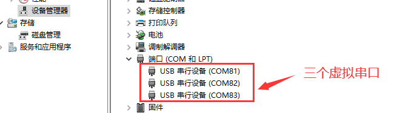
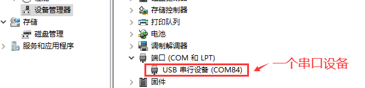

## 一、腾讯云概述

腾讯云物联网开发平台（IoT Explorer）是面向智慧生活与产业互联应用的物联网 PaaS 平台，为基于物联网的各行业设备制造商、方案商及应用开发商提供一站式设备智能化服务。平台提供海量设备连接与管理能力及基于腾讯的小程序应用开发能力，并打通腾讯云基础产品及 AI 能力，聚合腾讯生态内容能力。从而提升传统行业设备智能化的效率，降低用户的开发运维成本。

**官网地址：**[物联网开发平台 - 控制台 (](https://console.cloud.tencent.com/iotexplorer)[tencent.com](https://console.cloud.tencent.com/iotexplorer)

> 注意：
> 1、腾讯云物联网开发平台从 **2024 年 06 月 20** 日起，新注册物联网开发平台的用户需购买公共实例激活码才可使用公共实例，在此时间之前注册的用户并已开通公共实例的用户则不受影响。
> 2、腾讯新出了个 v2 版本开发平台，至笔者编写此文章为止，V2 较 V1 版本去掉了证书校验，去掉了自动注册中自动创建设备功能，并且已经和腾讯云确认此改动，是的，自动注册的自动创建设备改没了，自动注册要手动一个一个创建设备

## 二、演示功能概述

接下来为大家介绍 Air780E 如何接入腾讯云，并且会介绍如何进行腾讯云的上下行交互处理。

1. 模块端每隔 2 秒发布一次 qos 为 1 的消息到平台端
2. 平台端下发消息，控制模块端灯的亮灭

## 三、准备硬件环境

### 3.1 开发板准备

使用 Air780E 核心板，如下图所示：


淘宝购买链接：[Air780E 核心板淘宝购买链接](https://item.taobao.com/item.htm?id=693774140934&pisk=f1eiwOqL25l1_HYiV6D1ize3wN5d5FMjRrpxkx3VT2uIHCCskWm4kysffAEqor4KRRIskGT0ooqi_coq7DWE000qbVr2mmzKQjNtkV3mnoalvaBRelZshA7RyTFdpD4xQco2_VS2Tcnvc89h5lZshq-pu_FUfEDVVdOmgrkET0ir3mkq_MDEmmM2QjJaY2uI0UGAoNueWRjiw4YTC-_opNr-zluaXleFpfR_X2fhTJVn94W--KJ4KcqQreCDEs3zNVh-DyWpIxqEmyc8savgoor7gX2D7GUzmW4jBJS2_4PTWjestFRZqA0iaRlwjdkIgW2nBR7XNkEn7bDL96_tMA4gN4GNOwa0xVU4IX8G4iReapZyhDSYLIOj_DinyhbSB2IHjbEhxMA51foIXaIhxItMPKJlyMjHNEGZAcQR.&spm=a1z10.5-c-s.w4002-24045920841.33.639f1fd1YrS4b6&skuId=5098266470883) ；

此核心板的详细使用说明参考：[Air780E 产品手册](https://docs.openluat.com/air780e/product/) 中的 << 开发板 Core_Air780E 使用说明 VX.X.X.pdf>>，写这篇文章时最新版本的使用说明为：<< 开发板 Core_Air780E 使用说明 V1.0.5.pdf>> ；核心板使用过程中遇到任何问题，可以直接参考这份使用说明 pdf 文档。

### 3.2 数据通信线

USB 转 typeC 数据线一根

### 3.3 PC 电脑

WINDOWS 系统，其他暂无特别要求

## 四、准备软件环境

### 4.1 下载调试工具

使用说明参考：[Luatools 下载和详细使用](https://docs.openluat.com/Luatools/)

### 4.2 源码及固件

1. 底层 core 下载地址：[LuatOS 固件版本下载地址](https://docs.openluat.com/air780e/luatos/firmware/)本 demo 使用的固件是 core_V1112 压缩包内的 LuatOS-SoC_V1112_EC618_FULL.soc
2. 本教程使用的 demo:[https://gitee.com/openLuat/LuatOS-Air780E/tree/master/demo/iotcloud](https://gitee.com/openLuat/LuatOS-Air780E/tree/master/demo/iotcloud)
3. 源码和固件已打包，如下所示：
   > 注：压缩包中 core 文件夹存放固件，code 文件夹存放 demo

[右键点我,另存为,下载完整压缩文件包](file/腾讯云.zip){:target="_blank"}

## 五、腾讯云软硬件资料

### 5.1 iotcloud 库介绍

众所周知，市面上有很多云平台，阿里云、腾讯云、中移 onenet、华为云、百度云、华为云、Tlink 云等等......并且每家都有自己的协议，工程师要移植不同的 sdk 代码或基于各家的手册文档对接不同的协议，看着都头大！！！

所以 iotcloud 应运而生！iotcloud 是合宙专门为了合并 iot 平台而制作的库，意在使用统一且极简的代码接入各个云平台，轻松实现云功能。用户无需为那么多云平台的接入而头疼，只需要极简的通用 API 即可轻松上云！并且因为通用，所以云平台之间的迁移也十分方便。

iotcloud 库本质就是上层设计一套通用的 API 库来进行每个平台功能的对接。目前已经实现了各个平台的所有注册方式，其中自动注册会将相关验证信息保存 kv，随后使用此验证信息进行连接，通知针对每个平台添加了特有系统实现，比如设备上线通知，设备版本号上传，ota 功能等，用户无需管理这些只需要注意相关下发消息做应用逻辑即可。

### 5.2 API 接口介绍

本教程使用 api 接口为:[iotcloud - iotcloud 云平台库 (已支持: 腾讯云 阿里云 onenet 华为云 涂鸦云 百度云 Tlink 云 其他也会支持,有用到的提 issue 会加速支持) - LuatOS 文档](https://wiki.luatos.com/api/libs/iotcloud.html?highlight=iotcloud)

### 5.3 Air780E 烧录说明

将 Air780E 通过通过 usb 数据线连接电脑，如下图所示：

> 注：
> 1、按住下载模式按键（boot 键）不放，同时再长按开机键开机，这时开发板会进入下载模式，Luatools 下载进度条会开始跑，这时可以松开 boot 按键。直到工具提示下载完成。
> 2、如果，未能成功进入下载模式，而是进入正常开机模式，这时可以按住 boot 键，再短按复位按键，让开发板重启，重新进入下载模式。


如何判断有没有进入下载模式:可以通过 PC 端的设备管理器中虚拟出来的 USB 断开数量来判断，

**正常开机模式：**



**下载模式：**



## 六、云平台配置与效果展示

### 6.1 云平台配置

【注意】本教程采用 v2 版本开发平台，V2 较 V1 版本去掉了证书校验，去掉了动态注册中自动创建设备功能

#### 6.1.1 登录并新建公共实例

登录官网[物联网开发平台 - 控制台 (](https://console.cloud.tencent.com/iotexplorer)[tencent.com](https://console.cloud.tencent.com/iotexplorer)[)](https://console.cloud.tencent.com/iotexplorer)注册腾讯云账号，开通物联网平台服务后，新建公共实例进行试用。（腾讯云物联网开发平台从 **2024 年 06 月 20** 日起注册的用户，需要购买公共实例激活码才可以使用公共实例，此为腾讯云平台限制。）


#### 6.1.2 创建产品并添加设备

1. 物联网平台--公共示例--产品开发--新建产品，产品品类根据自己需要选择，产品信息通信方式选择 2G/3G/4G
   
2. 创建完成后，自动跳转新建设备界面，点击设备调试，再点击新建设备，设备名称我们可以直接填写模组的 imei 号
   

   这样我们就创建好了设备，我们点进去看下设备信息！

   

   可以看到我们需要的数据已经被贴心的加了一键复制，我们要记录下 设备名称、产品 ID、设备密钥 这三个数据，使用这三个数据我们就可以上云了！

   到此为止，创建产品设备工作已经完成，后续会根据不同注册方式来进行实例讲解。

### 6.2 设备注册

腾讯云 v2 开发平台支持两种注册方式，分别为密钥校验(手动注册)和动态注册

#### 6.2.1 密钥校验(手动注册)

将上面记录的设备名称填入 demo 中的 device_name 中，产品 ID 填入 produt_id 中，设备密钥填入 device_secret 中
配置代码如下:

```lua
-- 密钥校验
iotcloudc = iotcloud.new(iotcloud.TENCENT,{produt_id = "xxx",device_name = "xxx",device_secret = "xxx"})
```

第一个参数 iotcloud.TENCENT 表示我们使用的是腾讯云，
第二个参数{produt_id = "xxx",device_name = "xxx",device_secret = "xxx"}  ，我们将上面得到的三个参数填写到 table 中即可，so easy~

#### 6.2.2 动态注册

开启动态注册后设备无需一一烧录设备证书/密钥，同一产品下的所有设备可烧录相同的产品密钥(Productld 和 ProductSevret)，云端授权通过后下发设备证书/密钥，您可以根据业务需要选择是否开启。
**注意：** 动态注册需要在产品开发界面打开动态注册按钮， 随后会生成动态注册上方的产品密钥，我们复制产品 ID 和产品密钥即可


将上面记录的产品 ID 填入 produt_id 中，产品密钥填入 product_secret 中
配置代码如下:

```lua
-- 动态注册
iotcloudc = iotcloud.new(iotcloud.TENCENT,{produt_id = "xxx" ,product_secret = "xxx"})
```

第一个参数 iotcloud.TENCENT 表示我们使用的是腾讯云，
第二个参数{produt_id = "xxx" ,product_secret = "xxx"} ，我们将上面得到的两个参数填写到 table 中即可，so easy~

### 6.3 效果展示

本例采用密钥校验(手动注册)的方式进行注册并连接云平台

1. 设备日志

   

   通过上图Luatools工具打印的日志，可以看到我们的设备打印了云平台连接成功，证明手动注册 + 连接流程已经完成


2. 云平台效果

   设备成功连接到云平台后，我们可以看到设备已经自动注册并且在线，如下图所示：

   

   至此，云平台已经连接成功，剩下的就是要根据自己的产品需求，自己的物模型上报/下发数据就可以了

## 七、代码示例说明及功能验证

本例我们通过密钥校验(手动注册)方式连接腾讯云平台，实现模块端的上发消息和平台端的下发消息，控制 Air780E 的 NET_STATUS 网络灯亮和灭。

### 7.1 硬件连接

演示使用的是 Air780E 核心板的网络灯，也可以自己外接 led 灯进行控制，根据下图可知控制 NET_STATUS 网络灯的是 gpio27。


### 7.2 代码使用说明

1. 设备注册并连接云平台
   > 记得修改 produt_id ,device_name 和 device_secret 三个参数为自己平台上的

    ```lua
    sys.taskInit(function()
        -- 等待联网
        local ret, device_id = sys.waitUntil("net_ready")

        -- -- 腾讯云
        -- -- 动态注册
        -- iotcloudc = iotcloud.new(iotcloud.TENCENT,{produt_id = "ZAJCHA24SH" ,product_secret = "vGGwnSkyM4eD5ddbNrQoGJox"})
        -- -- 密钥校验
        iotcloudc = iotcloud.new(iotcloud.TENCENT,{produt_id = "ZAJCHA24SH",device_name = "869329069169988",device_secret = "xNWcxDX0qzSM74oFteehvw=="})

        if iotcloudc then
            iotcloudc:connect()
        end
    end)

    ```

2. 模块端每隔2秒发布一次qos为1的消息到平台端
   > 本文 `iotcloudc:publish()` 中的第一个参数订阅的是一个自定义topic（**此topic在腾讯云平台获取，下面会介绍**），在腾讯云物联网平台上可以看到。用户可以根据需求自行修改第一个参数。
   ```lua
    -- 每隔2秒发布一次qos为1的消息到云平台
    sys.taskInit(function()
        while 1 do
            sys.wait(2000)
            if iotcloudc then
                iotcloudc:publish("$thing/up/property/ZAJCHA24SH/869329069169988", "11111", 1) -- 上传数据
            end
        end
    end)
    ```
    打开腾讯云产品设备界面，点击设备云端日志，选择内容日志，日志类型选择属性，此时右边会生成两个 topic

    > 一个是上行 topic \$thing/**up**/property/ZAJCHA24SH/869329069169988，即模块端向云平台发布消息；
    > 一个是下行 topic \$thing/**down**/property/ZAJCHA24SH/869329069169988，即云平台向模块端下发消息；

    

3. 模块端订阅主题，用于平台端通过该主题向模块端下发消息
   > 此行代码放置位置，只要在云平台连接成功之后即可
   >本文 `iotcloudc:subscribe()` 中的第一个参数订阅的仍然是一个自定义 topic

    ```lua
    iotcloudc:subscribe("$thing/down/property/ZAJCHA24SH/869329069169988") -- 可以自由定阅主题等
    ```

4. 模块端接收数据并解析
   > 接收统一使用了 `"iotcloud"` 消息进行通知，所以我们只需要订阅此系统消息即可，收到消息后通过 json.decode(payload)解析字符串,再通过 `.params.switch` 获取到其中的 `switch` 值，这个值表示要开关 LED 的状态，1 既是开灯，0 既是关灯。
   >

    代码如下所示：
    ```lua
    -- 初始化gpio27
    LED = gpio.setup(27, 0, gpio.PULLUP)
    sys.subscribe("iotcloud", function(cloudc,event,data,payload)
        -- 注意，此处不是协程内，复杂操作发消息给协程内进行处理
        if event == iotcloud.CONNECT then -- 云平台联上了
            print("iotcloud","CONNECT", "云平台连接成功")
            iotcloudc:subscribe("$thing/down/property/ZAJCHA24SH/869329069169988") -- 可以自由定阅主题等
        elseif event == iotcloud.RECEIVE then
            print("iotcloud","topic", data, "payload", payload)
            local test_value = json.decode(payload).params.switch
            print("test value:", test_value)

            -- 获取到的switch是1，表示开灯；是0则表示关灯
            if test_value == 1 then
                LED(1)
            elseif test_value == 0 then
                LED(0)
            end
            -- 用户处理代码
        elseif event ==  iotcloud.OTA then
            if data then
                rtos.reboot()
            end
        elseif event == iotcloud.DISCONNECT then -- 云平台断开了
            -- 用户处理代码
            print("iotcloud","DISCONNECT", "云平台连接断开")
        end
    end)
    ```

    此时将代码烧录进开发板，即可在腾讯云平台控制开发板网络灯的亮灭，如何配置腾讯云平台下发指令，请看下面介绍：

    > 进入产品开发界面，选择物模型定义，点击自定义功能，然后新增自定义功能即可

    

    

    > 保存之后点击设备调试，即可看到自定义的功能

    

    点击 LED(switch)按钮即可控制灯的亮灭

### 7.3 运行结果展示

点击 LED(switch)并发送便可以控制 Air780E 核心板的网络灯，即下面视频中的绿灯

<video controls src="file/tencent.mp4"></video>

## 八、总结

本教程介绍了腾讯云的两种注册接入方法，并通过一个示例进行合宙 Air780E 开发板和腾讯云平台之间通信的演示，复杂的接口已封装在底层，而我们只需要根据上面的 API 接口即可实现两者的通信，继而开发出我们自己想要的产品，更多玩法还在等待你的探索！

## 扩展

## 常见问题

1. 腾讯云接入失败，怎么排查？
   > 先检查设备配置，确保设备的 ID,名称,密钥等配置信息正确无误；同时也要检查下网络连接，确保 SIM 卡是正常入网状态，若还是不行，请再仔细看下教程，看是否有哪个步骤有疏漏。


## 给读者的话

> 本篇文章由`王世豪`开发；
>
> 本篇文章描述的内容，如果有错误、细节缺失、细节不清晰或者其他任何问题，总之就是无法解决您遇到的问题；
>
> 请登录[合宙技术交流论坛](https://chat.openluat.com/)，点击[文档找错赢奖金-Air780E-LuatOS-软件指南-网络应用-腾讯云](https://chat.openluat.com/#/page/matter?125=1848634336954417154&126=%E6%96%87%E6%A1%A3%E6%89%BE%E9%94%99%E8%B5%A2%E5%A5%96%E9%87%91-Air780E-LuatOS-%E8%BD%AF%E4%BB%B6%E6%8C%87%E5%8D%97-%E7%BD%91%E7%BB%9C%E5%BA%94%E7%94%A8-%E8%85%BE%E8%AE%AF%E4%BA%91&askid=1848634336954417154)
>
> 用截图标注+文字描述的方式跟帖回复，记录清楚您发现的问题；
>
> 我们会迅速核实并且修改文档；
>
> 同时也会为您累计找错积分，您还可能赢取月度找错奖金！
