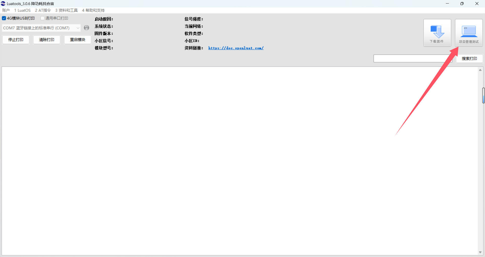

## 一、涂鸦云物联网平台介绍

[涂鸦开发者平台](https://platform.tuya.com/) 致力于打造互联互通的物联网开发标准，连接品牌、OEM 厂商、开发者、零售商和各行业的智能化需求。基于全球化部署的公有云，涂鸦开发者平台实现了智慧场景和智能设备的互联互通，承载着每日数以亿计的设备请求交互。平台服务涵盖硬件开发工具、App 开发工具、物联网云服务和智慧行业开发，为开发者提供从技术到营销渠道的全面赋能。


该平台不仅提供了客户实现各环节所需的线上自助工具，还在标准流程、协同分工、线上交易、技术支持等各方面都提供了完善的服务产品。

通过此链接你可以更好的了解到涂鸦开发者平台：[涂鸦开发者平台-涂鸦开发者平台-涂鸦开发者](https://developer.tuya.com/cn/docs/iot/introduction-of-tuya?id=K914joffendwh)

## 二、演示功能概述

本文将演示如何使用 Air780E 核心板和涂鸦云物联网平台实现物联网设备的连接与管理。通过以下步骤，我们将展示如何将 Air780E 核心板连接到涂鸦云物联网平台，实现设备数据的远程上传和云端下发消息的功能。

1\. **准备硬件环境：**

- Air780E 核心板：本文将以 Air780E 核心板为例进行演示。
- SIM 卡：在中国大陆环境下，使用移动、电信、联通的物联网卡或手机卡均可。
- PC 电脑：推荐使用 Windows 10 及以上版本。
- 数据通信线：USB 转 Type-C 数据线。

2\. **配置软件环境：**

- Luatools 下载调试工具：由合宙推出，支持固件获取、固件打包、trace 打印及单机烧录等功能。
- 涂鸦云物联网平台：涂鸦云物联网平台提供设备连接、设备管理、数据处理、消息交互、自动化规则、安全与认证等能力。
- 源码及固件：下载 Air780E 核心板所需的底层 core 文件和脚本代码，并烧录到 Air780E 核心板中。

3\. **连接涂鸦云物联网平台：**

- 在涂鸦云物联网平台上创建产品，配置认证方式等。
- 在 Air780E 核心板上编写代码，实现与涂鸦云物联网平台的连接。

4\. **数据上传和接收：**

- 在 Air780E 核心板上编写代码，实现每隔一定时间向涂鸦云物联网平台上传数据。
- 在涂鸦云物联网平台上创建消息主题，用于接收 Air780E 核心板发送的数据。

5\. **云端下发消息：**

- 在涂鸦云物联网平台上创建消息主题，用于向 Air780E 核心板下发消息。
- 在 Air780E 核心板上编写代码，实现订阅云端下发的消息。

6\. **运行结果展示：**

- 通过 Luatools 工具查看 Air780E 核心板上的日志，验证数据的上传和接收。
- 在涂鸦云物联网平台上查看数据接收和下发消息的效果。

通过以上步骤，我们将展示如何使用 Air780E 核心板和涂鸦云物联网平台实现物联网设备的连接与管理。

## 三、演示硬件环境

### 3.1 开发板

本文以 **Air780E 核心板 **为例，如下图所示：


淘宝购买链接：[Air780E 核心板淘宝购买链接](https://item.taobao.com/item.htm?id=693774140934&pisk=f1eiwOqL25l1_HYiV6D1ize3wN5d5FMjRrpxkx3VT2uIHCCskWm4kysffAEqor4KRRIskGT0ooqi_coq7DWE000qbVr2mmzKQjNtkV3mnoalvaBRelZshA7RyTFdpD4xQco2_VS2Tcnvc89h5lZshq-pu_FUfEDVVdOmgrkET0ir3mkq_MDEmmM2QjJaY2uI0UGAoNueWRjiw4YTC-_opNr-zluaXleFpfR_X2fhTJVn94W--KJ4KcqQreCDEs3zNVh-DyWpIxqEmyc8savgoor7gX2D7GUzmW4jBJS2_4PTWjestFRZqA0iaRlwjdkIgW2nBR7XNkEn7bDL96_tMA4gN4GNOwa0xVU4IX8G4iReapZyhDSYLIOj_DinyhbSB2IHjbEhxMA51foIXaIhxItMPKJlyMjHNEGZAcQR.&spm=a1z10.5-c-s.w4002-24045920841.33.639f1fd1YrS4b6&skuId=5098266470883)

详细使用说明参考：[Air780E 产品手册](https://docs.openluat.com/air780e/product/) 中的 << 开发板 Core_Air780E 使用说明 VX.X.X.pdf>>，写这篇文章时最新版本的使用说明为：**开发板 Core_Air780E 使用说明 V1.0.5.pdf** ；若在使用过程中遇到任何问题，可以直接参考这份使用说明 PDF 文档。

### 3.2 SIM 卡

在中国大陆环境下，使用移动，电信，联通的物联网卡或者手机卡都可以。

### 3.3 PC 电脑

PC 电脑推荐使用 Windows10 及以上版本。

### 3.4 数据通信线

1\. USB 转 Type-C 数据线

> 它的一端是 USB 接口，另一端是 Type-C 接口。


## 四、演示软件环境

### 4.1 Luatools 下载调试工具

Luatools 工具由合宙推出，支持最新固件获取、固件打包、trace 打印及单机烧录等功能。

工具使用说明参考：[Luatools 下载和详细使用](https://docs.openluat.com/Luatools/)

### 4.2 涂鸦云物联网平台

平台官网：[涂鸦开发者平台](https://platform.tuya.com/)

### 4.3 源码及固件

1\. 底层 core 下载地址：[LuatOS 固件版本下载地址](https://docs.openluat.com/air780e/luatos/firmware/)

> 本 demo 使用的固件是 core_V1112 压缩包 内的 LuatOS-SoC_V1112_EC618_FULL.soc


2\. demo 位置

> 本 demo 为诸多云平台的集合型 demo，适用于如阿里云、百度云、OneNet 等诸多云平台，大家只需修改对应云平台的参数即可。

demo位置：[https://gitee.com/openLuat/LuatOS-Air780E/tree/master/demo/iotcloud/iotcloud%E6%80%BB](https://gitee.com/openLuat/LuatOS-Air780E/tree/master/demo/iotcloud/iotcloud%E6%80%BB)

3\. 源码及固件已打包压缩，如下所示

> 压缩包中 core 文件夹存放的是固件，code 文件夹存放的是脚本代码。
> 大家在使用脚本代码时一定要记得修改参数，至于修改什么参数，后面演示时会告诉大家。

[右键点我,另存为,下载完整压缩文件包](file/tuya.zip)

## 五、软硬件资料

### 5.1 IOT_CLOUD 介绍

众所周知，市面上有很多云平台，阿里云、腾讯云、中移 onenet、华为云、百度云、华为云、Tlink 云等等......并且每家都有自己的协议，工程师要移植不同的 SDK 代码或基于各家的手册文档对接不同的协议，看着都头大！！！

所以 iotcloud 应运而生！iotcloud 是合宙专门为了合并 iot 平台而制作的库，意在使用统一且极简的代码接入各个云平台，轻松实现云功能。用户无需为那么多云平台的接入而头疼，只需要极简的通用 API 即可轻松上云！并且因为通用，所以云平台之间的迁移也十分方便。

#### 5.1.1 iotcloud 库介绍

iotcloud 库本质就是上层设计一套通用的 API，通过该库进行每个平台功能的对接。目前已经实现了各个平台的所有注册方式，其中自动注册会将相关验证信息保存 kv，随后使用此验证信息进行连接，通知针对每个平台添加了特有系统实现，比如设备上线通知，设备版本号上传，OTA 功能等，用户无需管理这些只需要注意相关下发消息做应用逻辑即可。

**注意：**涂鸦云支持一机一密，一型一密，X.509 证书三种认证方式，但涂鸦云只对外开放一机一密认证方式，另两种方式请自行联系涂鸦云。

#### 5.1.2 API 接口介绍

本教程所使用 API 接口参考：[iotcloud API 接口介绍  - LuatOS 文档](https://wiki.luatos.com/api/libs/iotcloud.html?highlight=iotcloud)

### 5.2 Air780E 核心板烧录说明

#### 5.2.1 选择固件和脚本

1\. 打开 Luatools 工具

2\. 点击 **项目管理测试**



3\. 根据图示操作

> 注意，大家只需要跟着做到第四步即可，第五步跟着后面的操作再做。


#### 5.2.2 烧录

1\. 将 Air780E 核心板通过 USB 数据线连接至电脑，如下图所示：


2\. 根据下方操作进行烧录

> 此时就需要大家先点击 Luatools 工具上的 下载底层与脚本/下载脚本，再执行下方操作了。

**开发板处于未开机状态：**此时先按住下载模式按键（BOOT 键）不放，再长按开机键（POW 键）开机，若不出意外开发板将会进入下载模式，Luatools 工具下载进度条会开始跑，这时便可以松开 BOOT 键和 POW 键，等到工具提示下载完成即可。

**开发板已经处于开机状态：**此时可以先按住 BOOT 键不放，再短按复位键（RST 键）后开发板会重启并进入下载模式。

#### 5.2.3 不同模式下的端口显示

1\. 正常开机模式


2\. 下载模式


## 六、功能验证

### 6.1 云平台准备

#### 6.1.1 创建产品

1\. 进入 [账号注册页面](https://auth.tuya.com/register?from=https%3A%2F%2Fdeveloper.tuya.com%2Fcn)，根据页面提示，注册一个开发者账号。


2\. 登录 [涂鸦云平台](https://platform.tuya.com/)

3\. 单击 [创建产品](https://platform.tuya.com/pmg/solution)


4\. 选择品类，例如在 **标准类目 --> 其他** 下选择产品品类，如 **自定义品类 **，单击图标即可。

> 注意：选择的产品类别非常重要，将影响到后续产品功能及 App 界面的推荐。


5\. 选择智能化方式，此时我们需要选择 **生态设备接入** 方式。


6\. 单击 **生态设备接入** 后，默认会选择自定义方案。


7\. 在 **完善产品信息** 区域，填写 **产品名称** 和 **产品型号**，选择 **通讯协议** 和 **功耗类型**，然后单击 **创建产品**。


#### 6.1.2 设置产品功能

**功能** 是指产品具有的功能抽象，是一个产品最重要的属性。功能通过不同数据类型进行表示（Data point，简称 DP）。例如，最简单的设备 **开关**，具备的功能为 **开启**、**关闭**。您可以将开关抽象为一个布尔型 DP，`0` 表示关闭，`1` 表示开启。更多详情，请参考 [产品功能](https://developer.tuya.com/cn/docs/iot/define-product-features?id=K97vug7wgxpoq)。

1\. 前往智能产品的开发页面，进入 **功能定义** 步骤。


2\. 根据页面提示，选择标准功能。

添加之前的效果：


添加标准功能：

> 本文选择的这个功能 发布/订阅 都可以实现。


添加之后的效果：


3\. 如果您希望开发的产品功能不在标准功能范围内，您可以在 **自定义功能** 处单击 **添加功能**，或者开启所需的 **高级功能**，添加更多功能。

> 本示例所选择的产品不包括 **高级功能**


#### 6.1.3 注册设备

设备注册是获取 [涂鸦开发者平台](https://platform.tuya.com/) 设备凭证的必要操作。注册前，您需要先购买设备接入授权码。购买完成后，您可以自定义填写对应的注册信息（注册 ID、备注）用于获得设备凭证（`ProductId`、`DeviceId` 和 `DeviceSecret`）。

目前，涂鸦云支持 **单个注册 **、**批量注册 **和 **批量上传** 功能。我们本次使用 **单个注册** 方式。

1\. 界面操作

> 目前 TuyaLink 接入的产品只支持在中国区应用。


2\. 注册设备

> 注册前，需要查看该产品下剩余授权码数量是否充足，每个产品可以免费领取两个授权码，领取位置请看上个图，如果不足可前往授权码管理分配或购买。


3\. 注册完成后，可点击下图中箭头位置，查看设备详情。


### 6.2 一机一密注册方式

一机一密认证是预先为每个设备烧录其唯一的设备证书（即 `ProductID`、`DeviceID` 和 `DeviceSecret`）。当设备与云平台建立连接时，云平台对其携带的设备证书信息进行加密计算，最后使用 `username/password` 的方式认证。

#### 6.2.1 获取参数

> 你只需要准备好自己的 `DeviceID` 和 `DeviceSecret` 即可，其余参数在代码中已经写好。


#### 6.2.2 代码使用说明

1\. 设备注册并连接云平台

> 记得修改参数

```lua
sys.taskInit(function()
    -- 等待联网
    local ret, device_id = sys.waitUntil("net_ready")

    --------    以下接入方式根据自己需要修改,相关参数修改为自己的    ---------

    -- -- 涂鸦云 
    iotcloudc = iotcloud.new(iotcloud.TUYA,{device_name = "xxx",device_secret = "xxx"})

    if iotcloudc then
        iotcloudc:connect()
    else
        log.error("iotcloud", "创建失败, 请检查参数")
    end
    
end)
```

2\. 发送数据

> 关于数据格式问题，请先了解 [数据解析-涂鸦开发者平台-涂鸦开发者](https://developer.tuya.com/cn/docs/iot/Data-Parsing?id=Kb4qgsj9g1duj)
> 关于主题（Topic）问题，请先了解 [MQTT 主题概览-涂鸦开发者平台-涂鸦开发者](https://developer.tuya.com/cn/docs/iot/MQTT_Topic?id=Kbt4ezpeko2rz)

```lua
-- ${deviceId} 修改为自己的 ， device_status 修改为自己的功能标识符 ， 
iotcloudc : publish("tylink/${deviceId}/thing/property/report" , '{"data":{"device_status":"999"}}' , 1)  -- 上报信息
```

3\. 订阅主题，用于云平台下发消息

> 此行代码放置位置，只要在云平台连接成功之后即可，可参考 4.接收数据

```lua
-- ${deviceId} 修改为自己的
iotcloudc : subscribe("tylink/${deviceId}/thing/property/set") -- 订阅信息
```

4\. 接收数据

> 接收统一使用了 `"iotcloud"` 消息进行通知，所以我们只需要订阅此系统消息即可

```lua
sys.subscribe("iotcloud", function(cloudc,event,data,payload)
    -- 注意，此处不是协程内，复杂操作发消息给协程内进行处理
    if event == iotcloud.CONNECT then -- 云平台联上了
        print("iotcloud","CONNECT", "云平台连接成功")
        iotcloudc : subscribe("tylink/${deviceId}/thing/property/set") -- 订阅信息
        iotcloudc : publish("tylink/${deviceId}/thing/property/report" , '{"data":{"imei_imsi":"999"}}' , 1) -- 上报信息
    elseif event == iotcloud.RECEIVE then
        print("iotcloud","topic", data, "payload", payload)
        -- 用户处理代码
    elseif event ==  iotcloud.OTA then
        if data then
            rtos.reboot()
        end
    elseif event == iotcloud.DISCONNECT then -- 云平台断开了
        -- 用户处理代码
    end
end)
```

5\. 完整代码

> 记得修改参数！！！

```lua
-- LuaTools需要PROJECT和VERSION这两个信息
PROJECT = "iotclouddemo"
VERSION = "1.0.0"

-- sys库是标配
_G.sys = require("sys")
--[[特别注意, 使用mqtt库需要下列语句]]
_G.sysplus = require("sysplus")

local iotcloud = require("iotcloud")

-- Air780E的AT固件默认会为开机键防抖, 导致部分用户刷机很麻烦
if rtos.bsp() == "EC618" and pm and pm.PWK_MODE then
    pm.power(pm.PWK_MODE, false)
end

-- 统一联网函数
sys.taskInit(function()
    local device_id = mcu.unique_id():toHex()
    -----------------------------
    -- 统一联网函数, 可自行删减
    ----------------------------
    if wlan and wlan.connect then
        -- wifi 联网, ESP32系列均支持
        local ssid = "luatos1234"
        local password = "12341234"
        log.info("wifi", ssid, password)
        -- TODO 改成自动配网
        -- LED = gpio.setup(12, 0, gpio.PULLUP)
        wlan.init()
        wlan.setMode(wlan.STATION) -- 默认也是这个模式,不调用也可以
        device_id = wlan.getMac()
        wlan.connect(ssid, password, 1)
    elseif mobile then
        -- Air780E/Air600E系列
        --mobile.simid(2) -- 自动切换SIM卡
        -- LED = gpio.setup(27, 0, gpio.PULLUP)
        device_id = mobile.imei()
    elseif w5500 then
        -- w5500 以太网, 当前仅Air105支持
        w5500.init(spi.HSPI_0, 24000000, pin.PC14, pin.PC01, pin.PC00)
        w5500.config() --默认是DHCP模式
        w5500.bind(socket.ETH0)
        -- LED = gpio.setup(62, 0, gpio.PULLUP)
    elseif socket or mqtt then
        -- 适配的socket库也OK
        -- 没有其他操作, 单纯给个注释说明
    else
        -- 其他不认识的bsp, 循环提示一下吧
        while 1 do
            sys.wait(1000)
            log.info("bsp", "本bsp可能未适配网络层, 请查证")
        end
    end
    -- 默认都等到联网成功
    sys.waitUntil("IP_READY")
    sys.publish("net_ready", device_id)
end)

sys.taskInit(function()
    -- 等待联网
    local ret, device_id = sys.waitUntil("net_ready")

    --------    以下接入方式根据自己需要修改,相关参数修改为自己的    ---------

    -- -- 涂鸦云 
    iotcloudc = iotcloud.new(iotcloud.TUYA,{device_name = "xxx",device_secret = "xxx"})

    if iotcloudc then
        iotcloudc:connect()
    else
        log.error("iotcloud", "创建失败, 请检查参数")
    end
    
end)

sys.subscribe("iotcloud", function(cloudc,event,data,payload)
    -- 注意，此处不是协程内，复杂操作发消息给协程内进行处理
    if event == iotcloud.CONNECT then -- 云平台联上了
        print("iotcloud","CONNECT", "云平台连接成功")
        iotcloudc : subscribe("tylink/${deviceId}/thing/property/set") -- 订阅信息
        iotcloudc : publish("tylink/${deviceId}/thing/property/report" , '{"data":{"device_status":"999"}}' , 1) -- 上报信息
    elseif event == iotcloud.RECEIVE then
        print("iotcloud","topic", data, "payload", payload)
        -- 用户处理代码
    elseif event ==  iotcloud.OTA then
        if data then
            rtos.reboot()
        end
    elseif event == iotcloud.DISCONNECT then -- 云平台断开了
        -- 用户处理代码
    end
end)

-- 用户代码已结束---------------------------------------------
-- 结尾总是这一句
sys.run()
-- sys.run()之后后面不要加任何语句!!!!!
```

#### 6.2.3 运行结果展示

1\. 设备日志


2\. 云平台效果


3\. 上行数据效果

> 设备日志位置：左侧栏 产品 --> 设备 --> 设备日志


4\. 下发数据效果

> 下发数据操作位置：产品界面 --> 在线调试
> 设备日志位置：左侧栏 产品 --> 设备 --> 设备日志
> 通过 Luatools 工具 查看日志消息

发布消息：


接收消息：


## 七、总结

本文详细介绍了如何使用 Air780E 核心板和涂鸦云物联网平台实现物联网设备的连接与管理。首先，我们准备了必要的硬件环境，包括 Air780E 核心板、SIM 卡、PC 电脑和数据通信线。接着，我们配置了软件环境，包括 Luatools 下载调试工具和涂鸦云物联网平台。

在连接涂鸦云物联网平台的过程中，我们创建了产品，配置了认证方式，并在 Air780E 核心板上编写了代码以实现与涂鸦云物联网平台的连接。我们展示了如何通过编写代码，使 Air780E 核心板向涂鸦云物联网平台上传数据，并在平台上创建消息主题以接收 Air780E 核心板发送的数据。

我们还展示了如何创建消息主题以向 Air780E 核心板下发消息，并实现订阅云端下发的消息。通过 Luatools 工具和涂鸦云物联网平台，我们验证了数据的上传和接收，以及下发消息的效果。

通过本文的学习，大家可以掌握如何使用 Air780E 核心板和涂鸦云物联网平台实现物联网设备的连接与管理。

## 八、扩展

### 8.1 MQTT 通信协议 QoS 介绍

MQTT（Message Queuing Telemetry Transport）是一种轻量级的消息传输协议，它设计用于低带宽和不稳定的网络环境。MQTT 协议专注于设备连接的稳定性和网络的优化使用，特别适合于物联网（IoT）场景。

在 MQTT 中，消息的传输质量是通过 QoS（Quality of Service，服务质量）等级来定义的。QoS 定义了消息的传递可靠性，共有三个等级：

1\. **QoS 0（最多传递一次）**：

- 最少传递一次：消息可能会丢失，也可能多次传递。
- 适用于非关键数据，或者允许数据丢失的场景。

2\. **QoS 1（至少传递一次）**：

- 至少传递一次：确保消息至少从发布者传输到服务器，并且至少传递给每个订阅者一次。
- 如果传输过程中出现错误，客户端会重新发送消息。
- 适用于需要确认数据已传输但可以容忍一定程度数据丢失的场景。

3\. **QoS 2（确保传递一次）**：

- 确保传递一次：确保消息从发布者传输到服务器，并且至少传递给每个订阅者一次，而且在传输过程中不会被重复传递。
- 客户端会在消息确认之后才能接收到下一个消息。
- 适用于对数据可靠性要求极高的场景，如关键数据传输。

选择适当的 QoS 级别取决于应用场景对数据可靠性和网络资源利用的要求。在设计物联网应用时，通常需要根据设备的能力、网络条件以及应用的容忍度来选择合适的 QoS 设置。

## 九、常见问题

1\. 如何实现数据的上传和接收？

> 数据的上传和接收是通过订阅和发布消息实现的。在代码中，需要调用 `iotcloudc:publish()` 和 `iotcloudc:subscribe()` 方法，分别用于发布和订阅消息。

## 给读者的话

> 本篇文章由 `马梦阳` 开发；
>
> 本篇文章描述的内容，如果有错误、细节缺失、细节不清晰或者其他任何问题，总之就是无法解决您遇到的问题；
>
> 请登录[合宙技术交流论坛](https://chat.openluat.com/)，点击 [文档找错赢奖金-Air780E-LuatOS-软件指南-基础服务-内部硬件看门狗(wdt)](https://chat.openluat.com/#/page/matter?125=1848631977532588033&126=文档找错赢奖金-Air780E-LuatOS-软件指南-基础服务-内部硬件看门狗(wdt)&askid=1848631977532588033)
>
> 用截图标注 + 文字描述的方式跟帖回复，记录清楚您发现的问题；
>
> 我们会迅速核实并且修改文档；
>
> 同时也会为您累计找错积分，您还可能赢取月度找错奖金！
