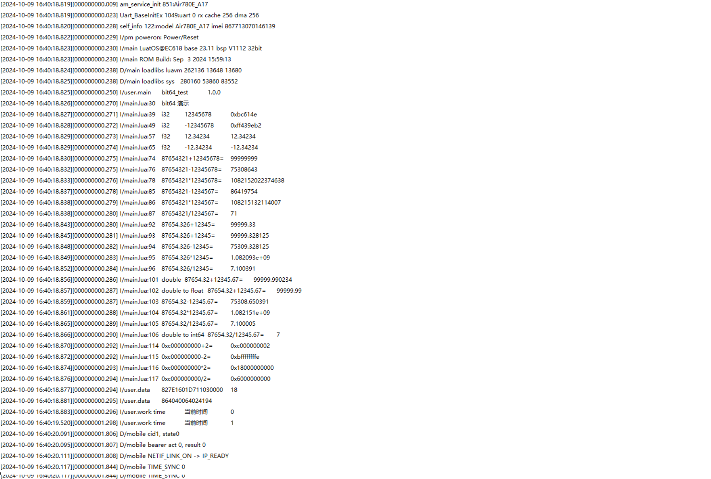

# 基本用法

本文通过演示demo进行演示位运算的基本用法

## 文档和工具

- bit64库接口说明：[bit64](https://wiki.luatos.com/api/bit64.html)
- 780E模块软件包：[LuatOS 发行版](https://gitee.com/openLuat/LuatOS/releases)
- 本示例所烧录的固件版本：**LuatOS-SoC_V1112_EC618_FULL.soc**
- 本示例所烧录的脚本：见教程代码
- 如果不会烧录，可参考 [烧录教程](https://doc.openluat.com/wiki/21?wiki_page_id=6072)

## 示例代码

```lua

-- LuaTools需要PROJECT和VERSION这两个信息
PROJECT = "bit64_test"
VERSION = "1.0.0"

log.info("main", PROJECT, VERSION)

-- 引入必要的库文件(lua编写), 内部库不需要require
sys = require("sys")

-- Air780E的AT固件默认会为开机键防抖, 导致部分用户刷机很麻烦
if rtos.bsp() == "EC618" and pm and pm.PWK_MODE then
    pm.power(pm.PWK_MODE, false)
end


if wdt then
    --添加硬狗防止程序卡死，在支持的设备上启用这个功能
    wdt.init(9000)--初始化watchdog设置为9s
    sys.timerLoopStart(wdt.feed, 3000)--3s喂一次狗
end


local data,b64,b32,a,b

if bit64 then -- 判断bit64库是否准备就绪
	-- 设置日志风格，0-2共三种风格，默认为0
	log.style(1)
	-- 此时日志输出信息为：I/main.lua:28	bit64 演示
	log.info("bit64 演示")
	
	-- 设置data的值为12345678，类型为32位整型
	data = 12345678
	-- bit64.to64(data) 将32位整型数据转换为64位整型数据
	b64 = bit64.to64(data)
	-- bit64.to32(b64) 将64位整型数据转换为32位整型数据
	b32 = bit64.to32(b64)
	-- mcu.x32(b32) 将十进制数转换为十六进制字符串后输出
	log.info("i32", b32, mcu.x32(b32))
	
	-- 设置data的值为-12345678，类型为32位整型
	data = -12345678
	-- bit64.to64(data) 将32位整型数据转换为64位整型数据
	b64 = bit64.to64(data)
	-- bit64.to32(b64) 将64位整型数据转换为32位整型数据
	b32 = bit64.to32(b64)
	-- mcu.x32(b32) 将十进制数转换为十六进制字符串后输出
	-- 需要注意负数转换为十六进制时，是以补码形式输出的，详细信息请自行查阅相关资料
	log.info("i32", b32, mcu.x32(b32))
	
	-- 设置data的值为12.34234，类型为32位浮点型
	data = 12.34234
	-- bit64.to64(data) 将32位浮点型数据转换为64位浮点型数据
	b64 = bit64.to64(data)
	-- bit64.to32(b64) 将64位浮点型数据转换为32位浮点型数据
	b32 = bit64.to32(b64)
	log.info("f32", data, b32)
	
	-- 设置data的值为-12.34234，类型为32位浮点型
	data = -12.34234
	-- bit64.to64(data) 将32位浮点型数据转换为64位浮点型数据
	b64 = bit64.to64(data)
	-- bit64.to32(b64) 将64位浮点型数据转换为32位浮点型数据
	b32 = bit64.to32(b64)
	log.info("f32", data, b32)

	-- 将32为整形数据转换为64位整型数据
	a = bit64.to64(87654321)
	-- 将32为整形数据转换为64位整型数据
	b = bit64.to64(12345678)
	-- 输出两个64位整型数据的和、差、积、商
	-- bit64.show(a) 64位数据格式化打印成字符串，用于显示值
	-- bit64.plus(a,b) 进行数据加运算，a和b中有一个为浮点，则按照浮点运算
	log.info("87654321+12345678=", bit64.show(bit64.plus(a,b)))
	-- bit64.minus(a,b) 进行数据减运算，a和b中有一个为浮点，则按照浮点运算
	log.info("87654321-12345678=", bit64.show(bit64.minus(a,b)))
	-- bit64.multi(a,b) 进行数据乘运算，a和b中有一个为浮点，则按照浮点运算
	log.info("87654321*12345678=", bit64.show(bit64.multi(a,b)))
	-- bit64.pide(a,b) 进行数据除运算，a和b中有一个为浮点，则按照浮点运算
	log.info("87654321/12345678=", bit64.show(bit64.pide(a,b)))

	a = bit64.to64(87654321)
	b = 1234567
	log.info("87654321+1234567=", bit64.show(bit64.plus(a,b)))
	log.info("87654321-1234567=", bit64.show(bit64.minus(a,b)))
	log.info("87654321*1234567=", bit64.show(bit64.multi(a,b)))
	log.info("87654321/1234567=", bit64.show(bit64.pide(a,b)))


	a = bit64.to64(87654.326)
	b = bit64.to64(12345)
	log.info("87654.326+12345=", 87654.326 + 12345)
	log.info("87654.326+12345=", bit64.show(bit64.plus(a,b)))
	log.info("87654.326-12345=", bit64.show(bit64.minus(a,b)))
	log.info("87654.326*12345=", bit64.show(bit64.multi(a,b)))
	log.info("87654.326/12345=", bit64.show(bit64.pide(a,b)))

	a = bit64.to64(87654.32)
	b = bit64.to64(12345.67)
	log.info("float", "87654.32+12345.67=", 87654.32 + 12345.67)
	log.info("double","87654.32+12345.67=", bit64.show(bit64.plus(a,b)))
	log.info("double to float","87654.32+12345.67=", bit64.to32(bit64.plus(a,b)))
	log.info("87654.32-12345.67=", bit64.show(bit64.minus(a,b)))
	log.info("87654.32*12345.67=", bit64.show(bit64.multi(a,b)))
	log.info("87654.32/12345.67=", bit64.show(bit64.pide(a,b)))
	log.info("double to int64", "87654.32/12345.67=", bit64.show(bit64.pide(a,b,nil,true)))

	a = bit64.to64(0xc0000000)
	b = 2
	-- 64位数据左移8位，true表示左移，false表示右移
	a = bit64.shift(a,8,true)
	-- bit64.show(a, 16) 64位数据格式化打印成字符串，16表示16进制输出，默认为10
	log.info("0xc0000000 << 8 =", bit64.show(a, 16))
	log.info("0xc000000000+2=", bit64.show(bit64.plus(a,b), 16))
	log.info("0xc000000000-2=", bit64.show(bit64.minus(a,b), 16))
	log.info("0xc000000000*2=", bit64.show(bit64.multi(a,b), 16))
	log.info("0xc000000000/2=", bit64.show(bit64.pide(a,b), 16))
	log.style(0)

	if bit64.strtoll then
		-- 将字符串转为LongLong数据，第二个参数表示进制，默认为10，可选16或8
		local data = bit64.strtoll("864040064024194", 10)
		log.info("data", data:toHex())
		log.info("data", bit64.show(data))
	end
end

local function sys_run_time()
	local tick64, per = mcu.tick64(true)
	local per_cnt = per * 1000000
	while true do
		tick64, per = mcu.tick64(true)
		log.info("work time","当前时间", bit64.to32(bit64.pide(tick64,per_cnt)))
		sys.wait(1000)
	end
end

if mcu.tick64 then
	sys.taskInit(sys_run_time)
end

-- 用户代码已结束---------------------------------------------
-- 结尾总是这一句
sys.run()
-- sys.run()之后后面不要加任何语句!!!!!
```

## 对应log信息


