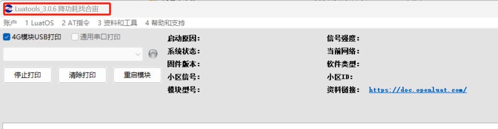
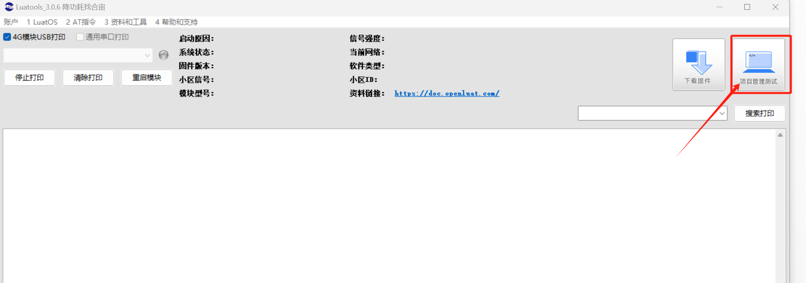
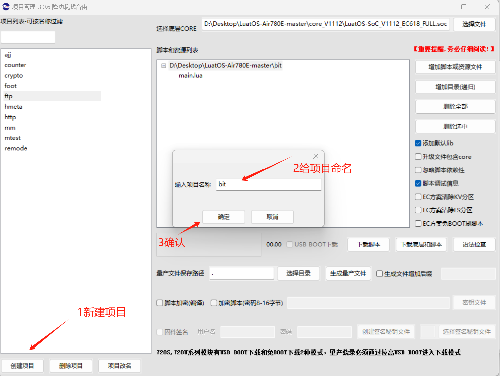
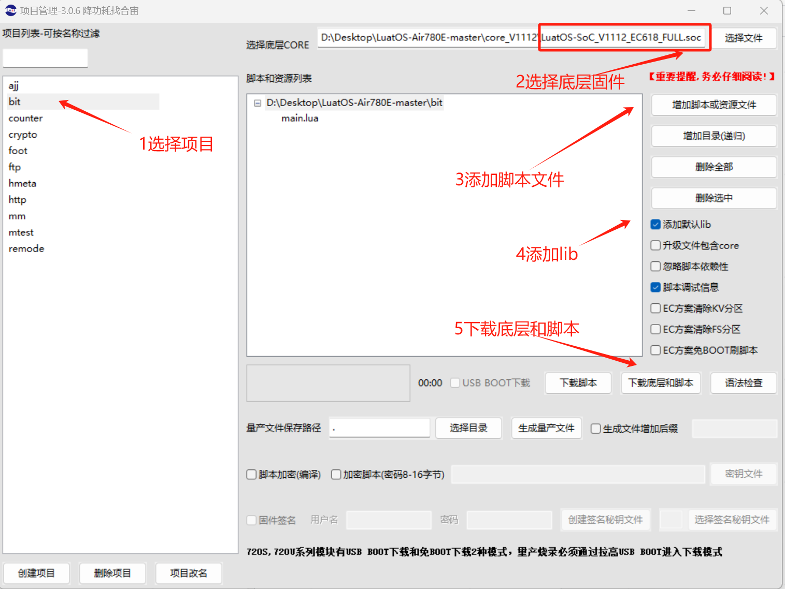
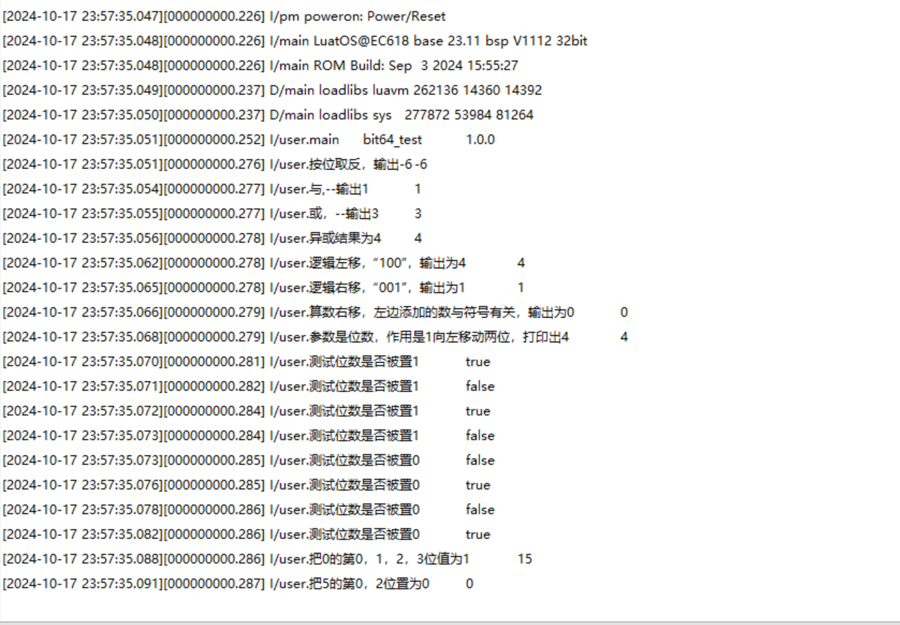

## 一、位运算概述

位运算是一种在计算机系统中对二进制数位进行操作的运算。由于计算机内部数据的存储和处理都是以二进制形式进行的，位运算能够直接对整数的二进制位进行高效操作。位运算包括与（&）、或（|）、异或（^）、非（~）、左移（<<）和右移（>>）等基本操作。

## 二、演示功能概述

本文通过了解位操作的 API 函数,并用代码演示功能来熟悉 Air780E-LuatOS-软件 demo-基础服务-位运算(bit)。

## 三、硬件环境

### 3.1 Air780E 核心板

使用 Air780E 核心板，如下图所示：


淘宝购买链接：[Air780E 核心板淘宝购买链接](https://item.taobao.com/item.htm?id=693774140934&pisk=f1eiwOqL25l1_HYiV6D1ize3wN5d5FMjRrpxkx3VT2uIHCCskWm4kysffAEqor4KRRIskGT0ooqi_coq7DWE000qbVr2mmzKQjNtkV3mnoalvaBRelZshA7RyTFdpD4xQco2_VS2Tcnvc89h5lZshq-pu_FUfEDVVdOmgrkET0ir3mkq_MDEmmM2QjJaY2uI0UGAoNueWRjiw4YTC-_opNr-zluaXleFpfR_X2fhTJVn94W--KJ4KcqQreCDEs3zNVh-DyWpIxqEmyc8savgoor7gX2D7GUzmW4jBJS2_4PTWjestFRZqA0iaRlwjdkIgW2nBR7XNkEn7bDL96_tMA4gN4GNOwa0xVU4IX8G4iReapZyhDSYLIOj_DinyhbSB2IHjbEhxMA51foIXaIhxItMPKJlyMjHNEGZAcQR.&spm=a1z10.5-c-s.w4002-24045920841.33.639f1fd1YrS4b6&skuId=5098266470883) ；

此核心板的详细使用说明参考：[Air780E 产品手册](https://docs.openluat.com/air780e/product/) 中的 << 开发板 Core_Air780E 使用说明 VX.X.X.pdf>>，写这篇文章时最新版本的使用说明为：开发板 Core_Air780E 使用说明 V1.0.5.pdf ；核心板使用过程中遇到任何问题，可以直接参考这份使用说明 pdf 文档。

### 3.2 SIM 卡

中国大陆环境下，可以上网的 sim 卡,一般来说，使用移动，电信，联通的物联网卡或者手机卡都行；

### 3.3 PC 电脑

WINDOWS 系统，其他暂无特别要求；

### 3.4 数据通信线

USB 数据线，暂无特别要求；

## 四、软件环境

### 4.1 Luatools 工具

要想烧录 LuatOS 固件到 4G 模组中，需要用到合宙的强大的调试工具：Luatools；

详细使用说明参考：[Luatools 工具使用说明](https://docs.openluat.com/Luatools/) 。

Luatools 工具集具备以下几大核心功能：

- 一键获取最新固件：自动连接合宙服务器，轻松下载最新的合宙模组固件。
- 固件与脚本烧录：便捷地将固件及脚本文件烧录至目标模组中。
- 串口日志管理：实时查看模组通过串口输出的日志信息，并支持保存功能。
- 串口调试助手：提供简洁的串口调试界面，满足基本的串口通信测试需求。

Luatools 下载之后， 无需安装， 解压到你的硬盘，点击 Luatools_v3.exe 运行，出现如下界面，就代表 Luatools 安装成功了.

### 4.2 准备需要烧录的代码

首先要说明一点： 脚本代码， 要和固件的 soc 文件一起烧录。

#### 4.2.1 **烧录的底层固件文件**

底层 core 下载地址：[LuatOS 固件版本下载地址](https://docs.openluat.com/air780e/luatos/firmware/)


Air780E 的底层固件在 Luatools 解压后目录的 **LuatOS-SoC_V1112_EC618_FULL.soc**


#### 4.2.2 **烧录的脚本代码**

首先要下载 Air780 的 LuatOS 示例代码到一个合适的项目目录,示例代码网站: [https://gitee.com/openLuat/LuatOS-Air780E](https://gitee.com/openLuat/LuatOS-Air780E)

下载流程参考下图:


## 五、API 说明

位操作支持库

## 5.1 bit.bnot( value )

取反，等价于 C 语言中的~

**参数**

| **参数**<br/> | **类型**<br/> | **释义**<br/>     | **取值**<br/>                |
| ------------- | ------------- | ----------------- | ---------------------------- |
| value<br/>    | number<br/>   | 需要取反的值<br/> | 0x0000 0000~0xFFFF FFFF<br/> |

**返回值**

| **返回值**<br/> | **类型**<br/> | **释义**<br/>     | **取值**<br/>                |
| --------------- | ------------- | ----------------- | ---------------------------- |
| result<br/>     | number<br/>   | 取反之后的值<br/> | 0x0000 0000~0xFFFF FFFF<br/> |

**例子**

_--支持 32 位比特数按位取反_

print(bit.bnot(5))_--按位取反，输出-6_

---

## 5.2 bit.band( val1, val2, … valn )

与运算，等价于 Ｃ 语言中的 val1 & val2 & … & valn

**参数**

| **参数**<br/> | **类型**<br/> | **释义**<br/>    | **取值**<br/> |
| ------------- | ------------- | ---------------- | ------------- |
| val1<br/>     | number<br/>   | 第一个参数<br/>  | <br/>         |
| val2<br/>     | number<br/>   | 第二个参数<br/>  | <br/>         |
| valn<br/>     | number<br/>   | 第 n 个参数<br/> | <br/>         |

**返回值**

| **返回值**<br/> | **类型**<br/> | **释义**<br/>         | **取值**<br/> |
| --------------- | ------------- | --------------------- | ------------- |
| result<br/>     | number<br/>   | 与运算之后的结果<br/> | <br/>         |

**例子**

print(bit.band(1,1))_--与,--输出 1_

---

## 5.3 bit.bor( val1, val2, … valn )

或运算，等价于 C 里面的 val1 | val2 | … | valn

**参数**

| **参数**<br/> | **类型**<br/> | **释义**<br/>    | **取值**<br/> |
| ------------- | ------------- | ---------------- | ------------- |
| val1<br/>     | number<br/>   | 第一个参数<br/>  | <br/>         |
| val2<br/>     | number<br/>   | 第二个参数<br/>  | <br/>         |
| valn<br/>     | number<br/>   | 第 n 个参数<br/> | <br/>         |

**返回值**

| **返回值**<br/> | **类型**<br/> | **释义**<br/>         | **取值**<br/> |
| --------------- | ------------- | --------------------- | ------------- |
| result<br/>     | number<br/>   | 或运算之后的结果<br/> | <br/>         |

**例子**

print(bit.bor(1,2))_--或，--输出 3_

---

## 5.4 bit.bxor( val1, val2, … valn )

异或运算，等价于 C 语言中的 val1 ^ val2 ^ … ^ valn

**参数**

| **参数**<br/> | **类型**<br/> | **释义**<br/>    | **取值**<br/> |
| ------------- | ------------- | ---------------- | ------------- |
| val1<br/>     | number<br/>   | 第一个参数<br/>  | <br/>         |
| val2<br/>     | number<br/>   | 第二个参数<br/>  | <br/>         |
| valn<br/>     | number<br/>   | 第 n 个参数<br/> | <br/>         |

**返回值**

| **返回值**<br/> | **类型**<br/> | **释义**<br/>                         | **取值**<br/> |
| --------------- | ------------- | ------------------------------------- | ------------- |
| result<br/>     | number<br/>   | 异或运算之后的结果, 此处为位异或<br/> | <br/>         |

**例子**

print(bit.bxor(2,3,5))_--异或结果为 4_

---

## 5.5 bit.lshift( value, shift )

逻辑左移，等价于 C 语言中的 value << shift

**参数**

| **参数**<br/> | **类型**<br/> | **释义**<br/>   | **取值**<br/> |
| ------------- | ------------- | --------------- | ------------- |
| value<br/>    | number<br/>   | 移位的值<br/>   | <br/>         |
| shift<br/>    | number<br/>   | 移位的位置<br/> | <br/>         |

**返回值**

| **返回值**<br/> | **类型**<br/> | **释义**<br/>           | **取值**<br/> |
| --------------- | ------------- | ----------------------- | ------------- |
| result<br/>     | number<br/>   | 逻辑左移之后的结果<br/> | <br/>         |

**例子**

print(bit.lshift(1,2))_--逻辑左移，“100”，输出为 4_

---

## 5.6 bit.rshift( value, shift )

逻辑右移，等价于 C 语言中的 value >> shift

**参数**

| **参数**<br/> | **类型**<br/> | **释义**<br/>   | **取值**<br/> |
| ------------- | ------------- | --------------- | ------------- |
| value<br/>    | number<br/>   | 移位的值<br/>   | <br/>         |
| shift<br/>    | number<br/>   | 移位的位置<br/> | <br/>         |

**返回值**

| **返回值**<br/> | **类型**<br/> | **释义**<br/>           | **取值**<br/> |
| --------------- | ------------- | ----------------------- | ------------- |
| result<br/>     | number<br/>   | 逻辑右移之后的结果<br/> | <br/>         |

**例子**

print(bit.rshift(4,2))_--逻辑右移，“001”，输出为 1_

---

## 5.7 bit.arshift( value, shift )

算数右移

**参数**

| **参数**<br/> | **类型**<br/> | **释义**<br/>   | **取值**<br/> |
| ------------- | ------------- | --------------- | ------------- |
| value<br/>    | number<br/>   | 移位的值<br/>   | <br/>         |
| shift<br/>    | number<br/>   | 移位的位置<br/> | <br/>         |

**返回值**

| **返回值**<br/> | **类型**<br/> | **释义**<br/>           | **取值**<br/> |
| --------------- | ------------- | ----------------------- | ------------- |
| result<br/>     | number<br/>   | 逻辑右移之后的结果<br/> | <br/>         |

**例子**

print(bit.arshift(2,2))_--算数右移，左边添加的数与符号有关，输出为 0_

---

## 5.8 bit.bit( position )

左移运算，等价于 C 语言中的 1 << position

**参数**

| **参数**<br/> | **类型**<br/> | **释义**<br/>   | **取值**<br/> |
| ------------- | ------------- | --------------- | ------------- |
| position<br/> | number<br/>   | 移位的位置<br/> | <br/>         |

**返回值**

| **返回值**<br/> | **类型**<br/> | **释义**<br/>       | **取值**<br/> |
| --------------- | ------------- | ------------------- | ------------- |
| result<br/>     | number<br/>   | 需要移位的位置<br/> | <br/>         |

**例子**

print(bit.bit(2))_--参数是位数，作用是 1 向左移动两位，打印出 4_

---

## 5.9 bit.isset(value, position)

测试位数是否被置 1

**参数**

| **参数**<br/> | **类型**<br/> | **释义**<br/>     | **取值**<br/> |
| ------------- | ------------- | ----------------- | ------------- |
| value<br/>    | number<br/>   | 被测试的值<br/>   | <br/>         |
| position<br/> | number<br/>   | 被测试的位置<br/> | <br/>         |

**返回值**

| **返回值**<br/> | **类型**<br/> | **释义**<br/>                    | **取值**<br/> |
| --------------- | ------------- | -------------------------------- | ------------- |
| result<br/>     | bool<br/>     | true:该位被置 1，false:其他<br/> | 0/其它<br/>   |

**例子**

_-- 例子 1  _

print(bit.isset(5,0))_--第一个参数是是测试数字，第二个是测试位置。从右向左数 0 到 7。是 1 返回 true，否则返回 false，该返回 true_

_-- 例子 2_

print(bit.isset(5,1))_--打印 false_

_-- 例子 3_

print(bit.isset(5,2))_--打印 true_

_-- 例子 4_

print(bit.isset(5,3))_--返回返回 false_

---

## 5.10 bit.isclear(value, position)

测试位数是否被置 0

**参数**

| **参数**<br/> | **类型**<br/> | **释义**<br/>     | **取值**<br/> |
| ------------- | ------------- | ----------------- | ------------- |
| value<br/>    | number<br/>   | 被测试的值<br/>   | <br/>         |
| position<br/> | number<br/>   | 被测试的位置<br/> | <br/>         |

**返回值**

| **返回值**<br/> | **类型**<br/> | **释义**<br/>                    | **取值**<br/> |
| --------------- | ------------- | -------------------------------- | ------------- |
| result<br/>     | bool<br/>     | true:该位被置 0，false:其他<br/> | 0/其它<br/>   |

**例子**

print(bit.isclear(5,0))_--与上面的相反_print(bit.isclear(5,1))
print(bit.isclear(5,2))
print(bit.isclear(5,3))

---

## 5.11 bit.set(value, pos1, pos2, …posn)

置 1

**参数**

| **参数**<br/> | **类型**<br/> | **释义**<br/>           | **取值**<br/> |
| ------------- | ------------- | ----------------------- | ------------- |
| value<br/>    | number<br/>   | 基数(需要改变的值)<br/> | <br/>         |
| pos1<br/>     | number<br/>   | 第一位置<br/>           | <br/>         |
| pos2<br/>     | number<br/>   | 第二位置<br/>           | <br/>         |
| posn<br/>     | number<br/>   | 第 n 位置<br/>          | <br/>         |

**返回值**

| **返回值**<br/> | **类型**<br/> | **释义**<br/>      | **取值**<br/> |
| --------------- | ------------- | ------------------ | ------------- |
| result<br/>     | bool<br/>     | 置 1 之后的值<br/> | <br/>         |

**例子**

_-- 把 0 的第 0，1，2，3 位值为 1_

print(bit.set(0,0,1,2,3))_--在相应的位数置 1，打印 15_

---

## 5.12 number=bit.clear(value, pos1, pos2, …posn)

置 0

**参数**

| **参数**<br/> | **类型**<br/> | **释义**<br/>             | **取值**<br/> |
| ------------- | ------------- | ------------------------- | ------------- |
| value<br/>    | number<br/>   | 基数（需要改变的值）<br/> | <br/>         |
| pos1<br/>     | number<br/>   | 第一位置<br/>             | <br/>         |
| pos2<br/>     | number<br/>   | 第二位置<br/>             | <br/>         |
| posn<br/>     | number<br/>   | 第 n 位置<br/>            | <br/>         |

**返回值**

| **返回值**<br/> | **类型**<br/> | **释义**<br/>      | **取值**<br/> |
| --------------- | ------------- | ------------------ | ------------- |
| result<br/>     | bool<br/>     | 置 0 之后的值<br/> | <br/>         |

**例子**

_-- 把 5 的第 0，2 位置为 0_

print(bit.clear(5,0,2)) _--在相应的位置置 0，打印 0_

## 六、功能验证

### 6.1 示例代码

下面根据 demo 演示位操作的功能，可以新建一个 main.lua 文件,然后把以下代码全部复制到 main.lua,然后烧录运行.

示例代码如下:

```lua
-- LuaTools需要PROJECT和VERSION这两个信息
PROJECT = "bit64_test"
VERSION = "1.0.0"

log.info("main", PROJECT, VERSION)

-- 引入必要的库文件(lua编写), 内部库不需要require
sys = require("sys")

-- Air780E的AT固件默认会为开机键防抖, 导致部分用户刷机很麻烦
if rtos.bsp() == "EC618" and pm and pm.PWK_MODE then
    pm.power(pm.PWK_MODE, false)
end


if wdt then
    --添加硬狗防止程序卡死，在支持的设备上启用这个功能
    wdt.init(9000)--初始化watchdog设置为9s
    sys.timerLoopStart(wdt.feed, 3000)--3s喂一次狗
end

local function log_bit()
        log.info("按位取反，输出-6",bit.bnot(5))
        log.info("与,--输出1",bit.band(1,1))
        log.info("或，--输出3",bit.bor(1,2))
        log.info("异或结果为4",bit.bxor(2,3,5))
        log.info("逻辑左移，“100”，输出为4",bit.lshift(1,2))

        log.info("逻辑右移，“001”，输出为1",bit.rshift(4,2))
        log.info("算数右移，左边添加的数与符号有关，输出为0",bit.arshift(2,2))
        log.info("参数是位数，作用是1向左移动两位，打印出4",bit.bit(2))
        log.info("测试位数是否被置1",bit.isset(5,0))--第一个参数是是测试数字，第二个是测试位置。从右向左数0到7。是1返回true，否则返回false，该返回true
        log.info("测试位数是否被置1",bit.isset(5,1))--打印false
        log.info("测试位数是否被置1",bit.isset(5,2))--打印true
        log.info("测试位数是否被置1",bit.isset(5,3))--返回返回false
        log.info("测试位数是否被置0",bit.isclear(5,0))----与上面的相反
        log.info("测试位数是否被置0",bit.isclear(5,1))
        log.info("测试位数是否被置0",bit.isclear(5,2))
        log.info("测试位数是否被置0",bit.isclear(5,3))
        log.info("把0的第0，1，2，3位值为1",bit.set(0,0,1,2,3))--在相应的位数置1，打印15
        log.info("把5的第0，2位置为0",bit.clear(5,0,2))--在相应的位置置0，打印0
end


sys.taskInit(log_bit)


-- 用户代码已结束---------------------------------------------
-- 结尾总是这一句
sys.run()
-- sys.run()之后后面不要加任何语句!!!!!
```

### 6.2 烧录步骤

#### 6.2.1 **正确连接电脑和 4G 模组电路板**

使用带有数据通信功能的数据线，不要使用仅有充电功能的数据线；

#### 6.2.2 **识别 4G 模组的 boot 引脚**

在下载之前，要用模组的 boot 引脚触发下载， 也就是说，要把 4G 模组的 boot 引脚拉到 1.8v，或者直接把 boot 引脚和 VDD_EXT 引脚相连。我们要在按下 BOOT 按键时让模块开机，就可以进入下载模式了。

具体到 Air780E 开发板:

1、当我们模块没开机时，按着 BOOT 键然后长按 PWR 开机。

2、当我们模块开机时，按着 BOOT 键然后点按重启键即可。


#### 6.2.3 **识别电脑的正确端口**

判断是否进入 BOOT 模式：模块上电，此时在电脑的设备管理器中，查看串口设备， 会出现一个端口表示进入了 boot 下载模式，如下图所示：


当设备管理器出现了 3 个连续数字的 com 端口，这时候， 硬件连接上就绪状态，恭喜你，可以进行烧录了！

#### 6.2.4 用 Luatools 工具烧录

- 新建项目

首先，确保你的 Luatools 的版本，大于等于 3.0.6 版本的。

在 Luatools 的左上角上有版本显示的，如图所示：



Luatools 版本没问题的话， 就点击 LuaTOols 右上角的“项目管理测试”按钮，如下图所示：



这时会弹出项目管理和烧录管理的对话框，可以新建一个项目,如下图：



- 开始烧录

选择 780E 板子对应的底层 core 和刚改的 main.lua 脚本文件。下载到板子中。



点击下载后，我们需要进入 boot 模式才能正常下载。

如果没进入 boot 模式会出现下图情况:


当我们模块没开机时，按着 BOOT 键然后长按 PWR 开机,进入下载。

当我们模块开机时，按着 BOOT 键然后点按重启键即可。可以进入下载,如图:


### 6.2 对应 log 信息



## 给读者的话

> 本篇文章由公帅开发；
>
> 本篇文章描述的内容，如果有错误、细节缺失、细节不清晰或者其他任何问题，总之就是无法解决您遇到的问题；
>
> 请登录[合宙技术交流论坛](https://chat.openluat.com/)，点击[文档找错赢奖金-Air780E-LuatOS-软件指南-基础服务-位运算(bit)](https://chat.openluat.com/#/page/matter?125=1848630759284408321&126=%E6%96%87%E6%A1%A3%E6%89%BE%E9%94%99%E8%B5%A2%E5%A5%96%E9%87%91-Air780E-LuatOS-%E8%BD%AF%E4%BB%B6%E6%8C%87%E5%8D%97-%E5%9F%BA%E7%A1%80%E6%9C%8D%E5%8A%A1-%E4%BD%8D%E8%BF%90%E7%AE%97(bit)&askid=1848630759284408321)；
>
> 用截图标注+文字描述的方式跟帖回复，记录清楚您发现的问题；
>
> 我们会迅速核实并且修改文档；
>
> 同时也会为您累计找错积分，您还可能赢取月度找错奖金！
