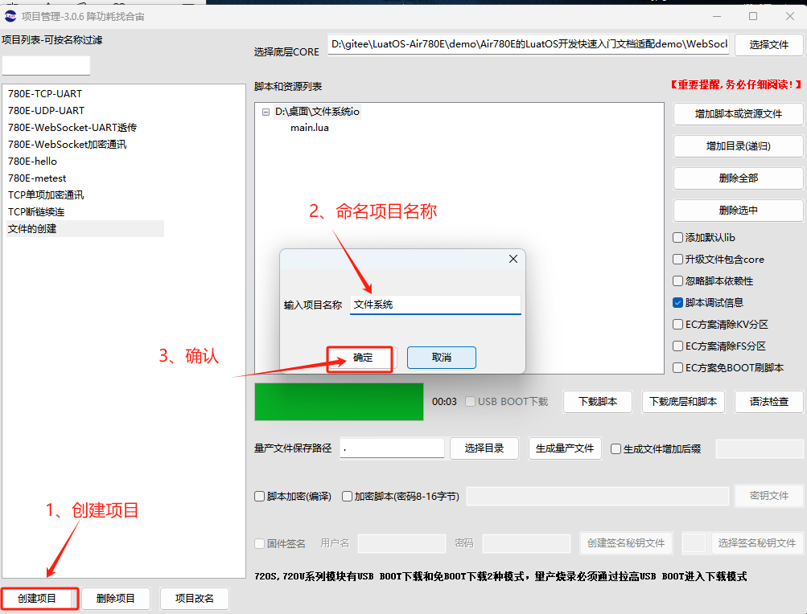
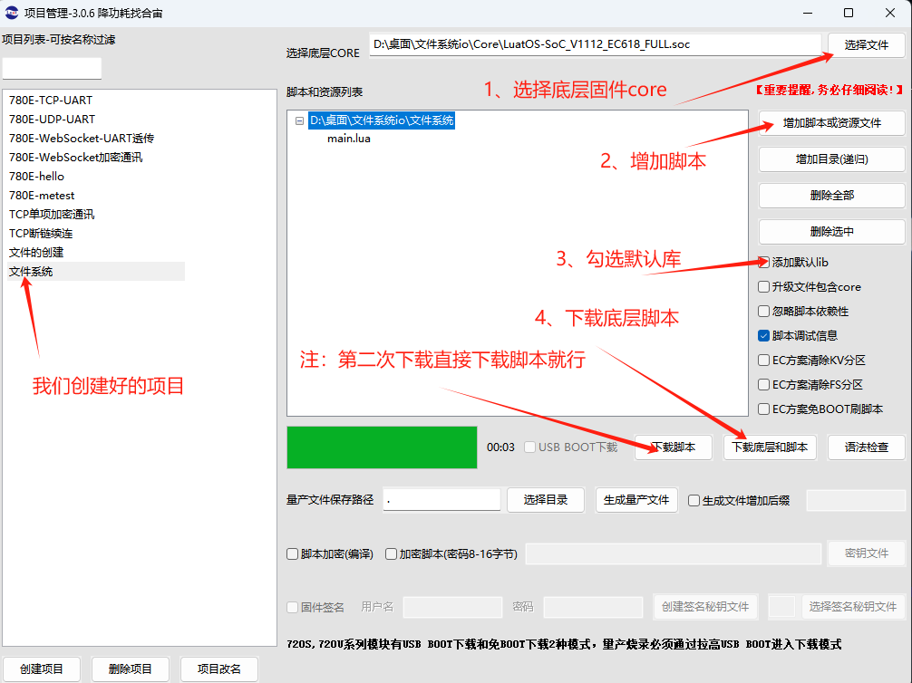
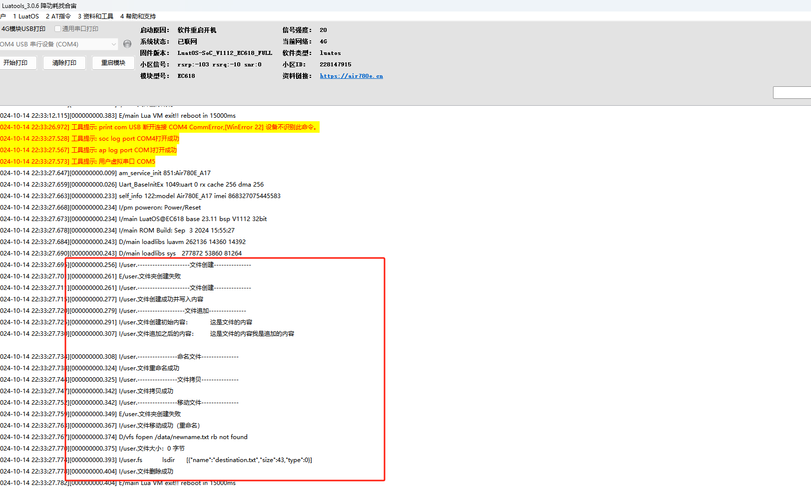

# 005：Air780E-LuatOS-软件 demo-基础服务-文件系统(io)

## **一、文件系统（io）的概述**

AIR780E 模组的文件系统为用户代码运行过程中动态创建的文件提供了存储空间。这个空间被称为文件系统分区，总空间为 288KB，其中系统配置占用约 44KB，因此用户可用空间约为 244KB。用户可以在这个空间内创建、读取、写入和删除文件，以支持模组在各种应用场景中的需求。

## 二、准备硬件环境

“古人云：‘工欲善其事，必先利其器。’在深入介绍本功能示例之前，我们首先需要确保以下硬件环境的准备工作已经完成。”

### 2.1 Air780E 开发板

准备一块开发板，有两种开发板可以使用，二选一即可；

第一种开发板是 Air780E 核心板，如下图所示：


点击链接购买：[Air780E 核心板淘宝购买链接](https://item.taobao.com/item.htm?id=693774140934&pisk=f1eiwOqL25l1_HYiV6D1ize3wN5d5FMjRrpxkx3VT2uIHCCskWm4kysffAEqor4KRRIskGT0ooqi_coq7DWE000qbVr2mmzKQjNtkV3mnoalvaBRelZshA7RyTFdpD4xQco2_VS2Tcnvc89h5lZshq-pu_FUfEDVVdOmgrkET0ir3mkq_MDEmmM2QjJaY2uI0UGAoNueWRjiw4YTC-_opNr-zluaXleFpfR_X2fhTJVn94W--KJ4KcqQreCDEs3zNVh-DyWpIxqEmyc8savgoor7gX2D7GUzmW4jBJS2_4PTWjestFRZqA0iaRlwjdkIgW2nBR7XNkEn7bDL96_tMA4gN4GNOwa0xVU4IX8G4iReapZyhDSYLIOj_DinyhbSB2IHjbEhxMA51foIXaIhxItMPKJlyMjHNEGZAcQR.&spm=a1z10.5-c-s.w4002-24045920841.33.639f1fd1YrS4b6&skuId=5098266470883) ；

此核心板的详细使用说明参考：[Air780E 产品手册](https://docs.openluat.com/air780e/product/) 中的 << 开发板 Core_Air780E 使用说明 VX.X.X.pdf>>，写这篇文章时最新版本的使用说明为：[开发板 Core_Air780E 使用说明 V1.0.5.pdf](https://cdn.openluat-luatcommunity.openluat.com/attachment/20240419155721583_%E5%BC%80%E5%8F%91%E6%9D%BFCore_Air780E%E4%BD%BF%E7%94%A8%E8%AF%B4%E6%98%8EV1.0.5.pdf) ；核心板使用过程中遇到任何问题，可以直接参考这份使用说明 pdf 文档。

### 2.2 SIM 卡

请准备一张可正常上网的 SIM 卡，该卡可以是物联网卡或您的个人手机卡。

**特别提醒：**请确保 SIM 卡未欠费且网络功能正常，以便顺利进行后续操作。

### 2.3 PC 电脑

请准备一台配备 USB 接口且能够正常上网的电脑。

### 2.4 数据通信线

请准备一根用于连接 Air780E 开发板和 PC 电脑的数据线，该数据线将实现业务逻辑的控制与交互。您有两种选择：

- USB 数据线（其一端为 Type-C 接口，用于连接 Air780E 开发板）。通常，这种数据线的外观如下示意图所示：


普通的手机 USB 数据线一般都可以直接使用；

### 2.5 组装硬件环境

#### 2.5.1 请按照 SIM 卡槽上的指示方向正确插入 SIM 卡，务必确保插入方向正确，避免插反导致损坏！

通常，插入 SIM 卡的步骤如下：

- 将 SIM 卡的金属接触面朝下，对准卡槽的开口。
- 用力平稳地将 SIM 卡推入卡槽，直至听到“咔嚓”一声，表示 SIM 卡已正确安装到位。


#### 2.5.2 USB 数据线，连接电脑和 Air780E 开发板，如下图所示：


## 三、准备软件环境

“凡事预则立，不预则废。”在详细阐述本功能示例之前，我们需先精心筹备好以下软件环境。

### 3.1 Luatools 工具

要想烧录 AT 固件到 4G 模组中，需要用到合宙的强大的调试工具：Luatools；

下载地址：[Luatools v3 下载调试工具](https://luatos.com/luatools/download/last)。

Luatools 工具集具备以下几大核心功能：

- 一键获取最新固件：自动连接合宙服务器，轻松下载最新的合宙模组固件。
- 固件与脚本烧录：便捷地将固件及脚本文件烧录至目标模组中。
- 串口日志管理：实时查看模组通过串口输出的日志信息，并支持保存功能。
- 串口调试助手：提供简洁的串口调试界面，满足基本的串口通信测试需求。

Luatools 下载之后， 无需安装， 解压到你的硬盘，点击 Luatools_v3.exe 运行，出现如下界面，就代表 Luatools 安装成功了：


### 3.2 烧录代码

首先要说明一点： 脚本代码， 要和固件的 LuatOS-SoC_V1112_EC618_FULL.soc 文件一起烧录。

**整体压缩文件：内含有 文件一：Core 固件 和 文件二：文件系统脚本文件 如下图所示。**


#### 3.2.1 **压缩文件：完整文件包**
[右键点我,另存为,下载完整压缩文件包](file/文件系统io.zip){:target="_blank"}
#### 3.2.2 压缩包内部文件

**文件一：Core 固件**

**文件二：文件系统脚本文件**

#### 3.2.3 **找到烧录的固件文件**

官网下载,底层 core 下载地址：[LuatOS 底层 core](https://docs.openluat.com/air780e/luatos/firmware/)     **注：**本 demo 使用如图所示固件


#### 3.2.4 **正确连接电脑和 4G 模组电路板**

使用带有数据通信功能的数据线，不要使用仅有充电功能的数据线；

#### 3.2.5 **识别 4G 模组的 boot 引脚**

在下载之前，要用模组的 boot 引脚触发下载， 也就是说，要把 4G 模组的 boot 引脚拉到 1.8v，或者直接把 boot 引脚和 VDD_EXT 引脚相连。我们要在按下 BOOT 按键时让模块开机，就可以进入下载模式了。

具体到 Air780E 开发板，

1、当我们模块没开机时，按着 BOOT 键然后长按 PWR 开机。

2、当我们模块开机时，按着 BOOT 键然后点按重启键即可。


#### 3.2.6 **识别电脑的正确端口**

判断是否进入 BOOT 模式：模块上电，此时在电脑的设备管理器中，查看串口设备， 会出现一个端口表示进入了 boot 下载模式，如下图所示：


当设备管理器出现了 3 个连续数字的 com 端口，并且每个数字都大于 4，这时候， 硬件连接上就绪状态，恭喜你，可以进行烧录了！

#### 3.2.7 **新建项目**

首先，确保你的 Luatools 的版本大于或者等于 3.0.6 版本.

在 Luatools 的左上角上有版本显示的，如图所示：


Luatools 版本没问题的话， 就点击 Luatools 右上角的“项目管理测试”按钮，如下图所示：


这时会弹出项目管理和烧录管理的对话框，如下图：



#### 3.2.8 **开始烧录**

选择 780E 板子对应的底层 core 和刚改的 main.lua 脚本文件。下载到板子中。




点击下载后，我们需要进入 boot 模式才能正常下载。


## 四、文件系统（io）基本用法

### 4.1 本教程实现的功能定义：

- 此次 demo 验证文件创建、文件追加、文件删除、文件重命名、文件拷贝、文件移动、文件大小、文件枚举的函数接口的介绍和使用。

### 4.2 文章内容引用

- 780E 开发板软硬件资料 ： [Air780E 产品手册 ](https://docs.openluat.com/air780e/product/)
- 以上接口函数不做详细介绍，可通过此链接查看具体介绍：[io - io 操作(扩展)](https://wiki.luatos.com/api/os.html#os-remove-path)

### 4.3 文件创建

文件创建是指新建一个空文件或向一个不存在的文件路径写入内容，从而生成该文件。

**使用例子：**

```lua
-- 方法1：使用io.open创建空文件（如果文件已存在，则覆盖）  
local fd = io.open("/newfile.txt", "w")  
if fd then
  -- 文件已成功创建（或覆盖），此时文件为空    
  fd:close()   
log.info("文件创建成功（空文件）")  
else  
   log.error("文件创建失败")  
end  
-- 方法2：通过写入内容创建文件  
local content = "这是文件的内容"  
local fd = io.open("/newfile_with_content.txt", "w")  
if fd then    
fd:write(content)   
fd:close()    
log.info("文件创建成功并写入内容")  
else    
log.error("文件创建失败")  
end
```

**注：**

- 使用 `io.open` 函数并传入文件路径和模式（如 `"w"` 表示写模式）来创建文件。如果文件已存在，写模式会覆盖原有内容。
- 创建文件后，务必使用 `:close` 方法关闭文件，以确保数据正确写入并释放资源。
- 可以通过写入内容来同时创建文件并填充数据。
- 常见问题：
- 文件创建失败：可能由于路径不存在、权限不足或磁盘空间不足等原因。
- 文件内容未写入：可能是因为文件未正确关闭或写入过程中发生错误。

### 4.4 文件追加

文件追加是指在文件的末尾添加内容，而不覆盖原有内容。如果文件不存在，追加模式会自动创建文件。

**使用例子：**

```lua
log.info("-------------------文件追加---------------")  
-- 打开文件以追加模式  
local fd = io.open("/data/newfile_with_content.txt", "rb")  
if fd then    -- 写入内容
 local data_old = fd:read("*a")
 log.info("文件创建初始内容：",data_old) 
 -- 关闭文件
 fd:close()
 local fd1 = io.open("/data/newfile_with_content.txt", "a") fd1:write("我是追加的内容\n")
 -- 关闭文件 fd1:close()
 local fd2 = io.open("/data/newfile_with_content.txt", "rb")
 local data_new = fd2:read("*a")
 log.info("文件追加之后的内容：",data_new) 
-- 关闭文件
 fd2:close() 
end
```

**注：**使用 `io.open` 函数以 `"a"` 模式打开文件，然后使用 `:write` 方法写入内容，最后使用 `:close` 方法关闭文件。

### 4.5 文件删除

文件删除是指从文件系统中移除指定的文件。无法删除只读文件或不存在的文件。

**使用例子：**

```lua
-- 删除文件  
local success, err = os.remove("/destination/source.txt")  
if success then   
log.info("文件删除成功")  
else 
    log.error("文件删除失败：" .. err)  
end
```

**注 ：**使用 `os.remove` 函数并传入文件路径来删除文件。函数返回两个值：成功时为 `true`，失败时为 `nil` 和错误原因字符串。

### 4.6 文件重命名

文件重命名是指将文件从一个名称更改为另一个名称，无法重命名只读文件或跨文件系统重命名文件，可以确保新文件路径所在的目录存在，以避免重命名失败。

**使用例子：**

```lua
("----------------命名文件---------------")  
-- 重命名文件  
local success, err = os.rename("/data/newfile_with_content.txt", "/data/newname.txt")  
if success then    
log.info("文件重命名成功")  
else
 log.error("文件重命名失败：" .. err)  
end
```

**注：**使用 `os.rename` 函数并传入旧文件路径和新文件路径来重命名文件。函数返回两个值：成功时为 `true`，失败时为 `nil` 和错误原因字符串。

### 4.7 文件拷贝

**文件拷贝是指将文件的内容从一个位置复制到另一个位置。**

**使用例子**（注意：LuatOS 标准 API 未直接提供文件拷贝函数，但可以通过读取源文件并写入目标文件来实现）：

```lua
log.info("----------------文件拷贝---------------")  
---文件拷贝
-- 读取源文件内容  
local fd_src = io.open("/data/newname.txt", "rb")  
if fd_src then   
 local content = fd_src:read("*a")    
fd_src:close()    
-- 写入目标文件  
 local fd_dest = io.open("/data/destination.txt", "wb")  
  if fd_dest then      
   fd_dest:write(content)     
    fd_dest:close()     
      log.info  ("文件拷贝成功") 
    else     
      log.error("无法打开目标文件") 
  end  
else 
 log.error("无法打开源文件")  
end
```

**注：**通过读取源文件内容并将其写入目标文件来实现文件拷贝。

### 4.8 文件移动

文件移动是指将文件从一个位置移动到另一个位置，这通常通过重命名文件（如果目标位置在同一文件系统中）或先拷贝再删除源文件来实现。

**使用例子**（注意：LuatOS 标准 API 未直接提供文件移动函数，但可以通过重命名或拷贝 + 删除来实现）：

```lua
log.info("----------------移动文件---------------")  
local ret, errio = io.mkdir("/destination/")
if ret then     
      log.info  ("文件夹创建成功")  
 else      
 log.error("文件夹创建失败")  
end
-- 移动文件：重命名（适用于同一文件系统）  
local success, err = os.rename("/data/newname.txt", "/destination/source.txt")  
if success then 
      log.info  ("文件移动成功（重命名）")  
else
   log.error("文件移动失败（重命名）：" .. err)  
end
```

**注：**根据目标位置与源文件位置的关系，选择重命名或拷贝 + 删除的方法来实现文件移动。

### 4.9 文件大小

获取文件的大小（以字节为单位）。

**使用例子：**

```lua
-- 获取文件大小  
local size = io.fileSize("/data/newname.txt")  
if size then
 log.info("文件大小：" .. size .. " 字节")  
else
 log.error("无法获取文件大小")  
end
```

**注：**使用 `io.fileSize` 函数并传入文件路径来获取文件大小。函数返回一个整数表示文件大小（以字节为单位），如果失败则返回 `nil`。。

### 4.10 文件枚举

**列出指定目录下的所有文件**。

**使用例子：**

```lua
local ret, data = io.lsdir("/data/",10,0)  
if ret then
   log.info("fs", "lsdir", json.encode(data))
 else
   log.info("fs", "lsdir", "fail", ret, data)
 end
```

**注：**使用 `io.lsdir` 函数并传入目录路径来列出该目录下的所有文件。函数返回两个值：成功时为 `true` 和一个包含文件名的数组，失败时为 `nil` 和错误信息。

## 五、文件系统整体演示

### 5.1 **成果演示与深度解析：视频 + 图文全面展示**

#### 5.1.1 **成果运行精彩呈现**



#### 5.1.2 **演示视频生动展示**
<video controls src="file/文件系统演练.mp4"></video>
#### 5.1.3 **完整实例深度剖析**

```lua
-- main.lua文件
-- LuaTools需要PROJECT和VERSION这两个信息
PROJECT = "uart_tcp"
VERSION = "1.0.0"

log.info("---------------------文件创建---------------")  
local ret, errio = io.mkdir("/data/")
if ret then       log.info("文件夹创建成功")   else       log.error("文件夹创建失败")  
end
--[[
-- 方法1：使用io.open创建空文件（如果文件已存在，则覆盖）  
local fd = io.open("/newfile.txt", "w")  
if fd then
  -- 文件已成功创建（或覆盖），此时文件为空  fd:close()    log.info("文件创建成功（空文件）")  
else   log.error("文件创建失败")  
end  
]]
-- 方法2：通过写入内容创建文件  

log.info("---------------------文件创建---------------")  

local content = "这是文件的内容"  
local fd = io.open("/data/newfile_with_content.txt", "w")  
if fd then    
fd:write(content)   
fd:close()    log.info("文件创建成功并写入内容")  
else    log.error("文件创建失败")  
end

log.info("-------------------文件追加---------------")  
-- 打开文件以追加模式  
local fd = io.open("/data/newfile_with_content.txt", "rb")  
if fd then    -- 写入内容 local data_old = fd:read("*a") log.info("文件创建初始内容：",data_old) -- 关闭文件 fd:close()
 local fd1 = io.open("/data/newfile_with_content.txt", "a") fd1:write("我是追加的内容\n") -- 关闭文件 fd1:close()
 local fd2 = io.open("/data/newfile_with_content.txt", "rb")
 local data_new = fd2:read("*a") log.info("文件追加之后的内容：",data_new) -- 关闭文件 fd2:close() 
End

log.info("----------------命名文件---------------")  
-- 重命名文件  
local success, err = os.rename("/data/newfile_with_content.txt", "/data/newname.txt")  
if success then    
log.info("文件重命名成功")  
else log.error("文件重命名失败：" .. err)  
end
log.info("----------------文件拷贝---------------")  
---文件拷贝
-- 读取源文件内容  
local fd_src = io.open("/data/newname.txt", "rb")  
if fd_src then    local content = fd_src:read("*a")    fd_src:close()    -- 写入目标文件   local fd_dest = io.open("/data/destination.txt", "wb")    if fd_dest then       fd_dest:write(content)       fd_dest:close()       log.info("文件拷贝成功")   else       log.error("无法打开目标文件")   end  
else  log.error("无法打开源文件")  
end
log.info("----------------移动文件---------------")  
local ret, errio = io.mkdir("/destination/")
if ret then       log.info("文件夹创建成功")   else       log.error("文件夹创建失败")  
end

-- 移动文件：重命名（适用于同一文件系统）  
local success, err = os.rename("/data/newname.txt", "/destination/source.txt")  
if success then   log.info("文件移动成功（重命名）")  
else log.error("文件移动失败（重命名）：" .. err)  
end  

-- 获取文件大小  
local size = io.fileSize("/data/newname.txt")  
if size then log.info("文件大小：" .. size .. " 字节")  
else log.error("无法获取文件大小")  
end

-- 列出目录下的文件  

local ret, data = io.lsdir("/data/",10,0)  
if ret then
   log.info("fs", "lsdir", json.encode(data))
 else
   log.info("fs", "lsdir", "fail", ret, data)
 end

-- 删除文件  
local success, err = os.remove("/destination/source.txt")  
if success then   log.info("文件删除成功")  
else   log.error("文件删除失败：" .. err)  
end
```

## 六、总结

- 在 Lua 编程语言中，文件系统操作主要通过 io 库来实现。io 库提供了一系列函数，用于文件的打开、读取、写入、关闭以及目录的遍历等操作。
- 首先，io 库提供了两种文件处理接口风格：隐式文件句柄和显式文件句柄。隐式文件句柄通过 io 表提供的函数进行操作，而显式文件句柄则通过 io.open 函数返回的文件句柄对象的方法进行操作。
- 在文件打开方面，io.open 函数是关键，它接受文件名和模式作为参数，并返回一个文件句柄对象。文件模式包括只读（"r"）、只写（"w"）、追加（"a"）等，还可以加上"b"来表示二进制模式。如果文件打开失败，io.open 函数会返回 nil 和错误信息。
- 文件读取操作主要通过文件句柄对象的 read 方法来实现。read 方法可以接受不同的参数来读取文件的不同部分，如读取下一行、读取整个文件等。
- 文件写入操作则通过文件句柄对象的 write 方法来实现。write 方法将字符串或数字写入文件。如果文件以只读模式打开，则无法进行写入操作。
- 完成文件操作后，应使用文件句柄对象的 close 方法关闭文件，以释放系统资源。
- 此外，io 库还提供了一些其他有用的函数，如 io.input 和 io.output，它们可以设置默认的输入输出文件，使得后续的输入输出操作都针对这些默认文件。io.lines 函数则返回一个迭代器，用于从文件中逐行读取内容。
- 需要注意的是，虽然 io 库提供了强大的文件系统操作功能，但在进行文件操作时仍需谨慎，以避免文件损坏或数据丢失等风险。同时，对于跨文件系统的文件移动等操作，可能需要结合其他函数或方法来实现。

## 七、常见问题：

### 7.1 文件操作失败时如何定位问题？

- 检查文件路径是否正确。
- 确认文件是否存在且可访问。
- 检查磁盘空间是否充足。
- 查看错误日志以获取更多信息。

### 7.2 如何提高文件操作的效率？

- 对于大文件操作，可以考虑使用流式处理或分块处理来减少内存占用。
- 使用合适的文件打开模式（如只读、只写等）以减少不必要的操作。

## 八、扩展

- 文件加密与解密：可以结合加密库对文件进行加密存储和解密读取，以提高数据的安全性。
- 文件备份与恢复：可以定期将文件备份到外部存储设备或云存储中，并在需要时恢复文件。
- 文件系统监控：可以监控文件系统的变化（如文件创建、删除、修改等），以便及时响应和处理。

## 给读者的话

> 本篇文章由`永仔`开发；
>
> 本篇文章描述的内容，如果有错误、细节缺失、细节不清晰或者其他任何问题，总之就是无法解决您遇到的问题；
>
> 请登录[合宙技术交流论坛](https://chat.openluat.com/)，点击[文档找错赢奖金-Air780E-LuatOS-软件指南-基础服务-文件系统](https://chat.openluat.com/#/page/matter?125=1846741027742941185&126=%E6%96%87%E6%A1%A3%E6%89%BE%E9%94%99%E8%B5%A2%E5%A5%96%E9%87%91-Air780E-LuatOS-%E8%BD%AF%E4%BB%B6%E6%8C%87%E5%8D%97-%E5%9F%BA%E7%A1%80%E6%9C%8D%E5%8A%A1-%E6%96%87%E4%BB%B6%E7%B3%BB%E7%BB%9F&askid=1846741027742941185)；
>
> 用截图标注+文字描述的方式跟帖回复，记录清楚您发现的问题；
>
> 我们会迅速核实并且修改文档；
>
> 同时也会为您累计找错积分，您还可能赢取月度找错奖金！