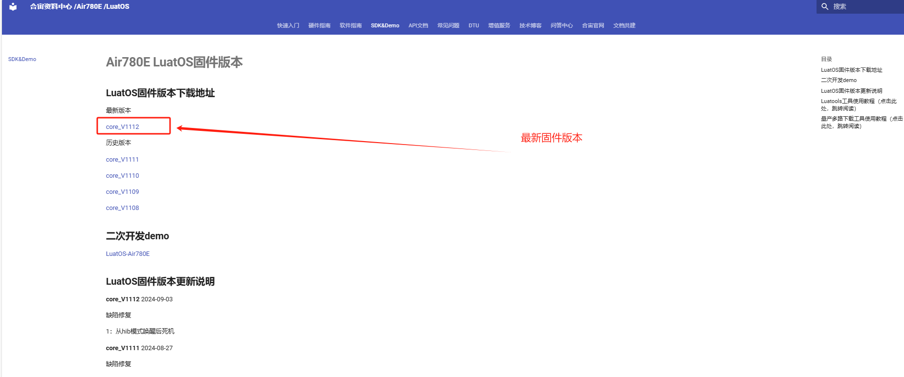

## **一、配置信息存储-键值对存储(fskv)概述**

fskv 是 LuatOS 系统中的一个库，用于提供键值对（Key-Value）数据库功能。它允许开发者以键值对的形式存储和检索数据，这些数据会被持久化在 Flash 存储器上，确保在设备断电后数据不会丢失。fskv 库旨在替代旧的 fdb 库，并兼容 fdb 的函数，同时使用 fdb 的 Flash 空间。

- **持久化存储：**数据存储在 Flash 上，确保设备断电后数据不会丢失。
- **兼容性强：**兼容 fdb 库，方便开发者迁移和升级。 点击链接购买：[点击我进入 fdb库](https://wiki.luatos.com/api/fdb.html) ；
- **功能丰富：**提供了初始化、设置、获取、删除、清空等丰富的 API 接口。
- **性能稳定：**读写速度恒定，不受脏数据影响。
- **空间利用率：**虽然相比 fdb 库空间利用率较低，但提供了更大的 value 长度（最大 4096 字节）和灵活的 key 长度（最大 63 字节）

## 二、准备硬件环境

“古人云：‘工欲善其事，必先利其器。’在深入介绍本功能示例之前，我们首先需要确保以下硬件环境的准备工作已经完成。”

### 2.1  Air780E 开发板

本 demo 使用的是 Air780E 核心板，如下图所示：


点击链接购买：[Air780E 核心板淘宝购买链接](https://item.taobao.com/item.htm?id=693774140934&pisk=f1eiwOqL25l1_HYiV6D1ize3wN5d5FMjRrpxkx3VT2uIHCCskWm4kysffAEqor4KRRIskGT0ooqi_coq7DWE000qbVr2mmzKQjNtkV3mnoalvaBRelZshA7RyTFdpD4xQco2_VS2Tcnvc89h5lZshq-pu_FUfEDVVdOmgrkET0ir3mkq_MDEmmM2QjJaY2uI0UGAoNueWRjiw4YTC-_opNr-zluaXleFpfR_X2fhTJVn94W--KJ4KcqQreCDEs3zNVh-DyWpIxqEmyc8savgoor7gX2D7GUzmW4jBJS2_4PTWjestFRZqA0iaRlwjdkIgW2nBR7XNkEn7bDL96_tMA4gN4GNOwa0xVU4IX8G4iReapZyhDSYLIOj_DinyhbSB2IHjbEhxMA51foIXaIhxItMPKJlyMjHNEGZAcQR.&spm=a1z10.5-c-s.w4002-24045920841.33.639f1fd1YrS4b6&skuId=5098266470883) ；

此核心板的详细使用说明参考：[Air780E 产品手册](https://docs.openluat.com/air780e/product/) 中的 << 开发板 Core_Air780E 使用说明 VX.X.X.pdf>>，写这篇文章时最新版本的使用说明为：[开发板 Core_Air780E 使用说明 V1.0.5.pdf](https://cdn.openluat-luatcommunity.openluat.com/attachment/20240419155721583_%E5%BC%80%E5%8F%91%E6%9D%BFCore_Air780E%E4%BD%BF%E7%94%A8%E8%AF%B4%E6%98%8EV1.0.5.pdf) ；核心板使用过程中遇到任何问题，可以直接参考这份使用说明 pdf 文档。

### 2.2 SIM 卡

请准备一张可正常上网的 SIM 卡，该卡可以是物联网卡或您的个人手机卡。

**特别提醒：**请确保 SIM 卡未欠费且网络功能正常，以便顺利进行后续操作。

### 2.3 PC 电脑

请准备一台配备 USB 接口且能够正常上网的电脑。

### 2.4 数据通信线

请准备一根用于连接 Air780E 开发板和 PC 电脑的数据线，该数据线将实现业务逻辑的控制与交互。

- USB 数据线（其一端为 Type-C 接口，用于连接 Air780E 开发板）。通常，这种数据线的外观如下示意图所示：


普通的手机 USB 数据线一般都可以直接使用；
### 2.5 组装硬件环境

#### 2.5.1 请按照 SIM 卡槽上的指示方向正确插入 SIM 卡，务必确保插入方向正确，避免插反导致损坏！

通常，插入 SIM 卡的步骤如下：

- 将 SIM 卡的金属接触面朝下，对准卡槽的开口。
- 用力平稳地将 SIM 卡推入卡槽，直至听到“咔嚓”一声，表示 SIM 卡已正确安装到位。


#### 2.5.2 USB 数据线，连接电脑和 Air780E 开发板，如下图所示：


## 三、准备软件环境

“凡事预则立，不预则废。”在详细阐述本功能示例之前，我们需先精心筹备好以下软件环境。

### 3.1 Luatools 工具

要想烧录 AT 固件到 4G 模组中，需要用到合宙的强大的调试工具：Luatools；

下载地址：[Luatools v3 下载调试工具](https://luatos.com/luatools/download/last)。

Luatools 工具集具备以下几大核心功能：

- 一键获取最新固件：自动连接合宙服务器，轻松下载最新的合宙模组固件。
- 固件与脚本烧录：便捷地将固件及脚本文件烧录至目标模组中。
- 串口日志管理：实时查看模组通过串口输出的日志信息，并支持保存功能。
- 串口调试助手：提供简洁的串口调试界面，满足基本的串口通信测试需求。

Luatools 下载之后， 无需安装， 解压到你的硬盘，点击 Luatools_v3.exe 运行，出现如下界面，就代表 Luatools 安装成功了：


### 3.2 烧录代码

首先要说明一点： 脚本代码， 要和固件的 LuatOS-SoC_V1112_EC618_FULL.soc 文件一起烧录。

**整体压缩文件：内含有 文件一：Core 固件 和 文件二：fskv 脚本文件，如图所示。**


#### 3.2.1 **压缩文件：完整文件包**
[右键点我,另存为,下载完整压缩文件包](file/fskv.zip){:target="_blank"}
#### 3.2.2 **找到烧录的固件文件**

官网下载,底层 core 下载地址：[LuatOS 底层 core](https://docs.openluat.com/air780e/luatos/firmware/)     **注：**本 demo 使用如图所示固件



#### 3.2.3 **正确连接电脑和 4G 模组电路板**

使用带有数据通信功能的数据线，不要使用仅有充电功能的数据线；

#### 3.2.4 **识别 4G 模组的 boot 引脚**

在下载之前，要用模组的 boot 引脚触发下载， 也就是说，要把 4G 模组的 boot 引脚拉到 1.8v，或者直接把 boot 引脚和 VDD_EXT 引脚相连。我们要在按下 BOOT 按键时让模块开机，就可以进入下载模式了。

具体到 Air780E 开发板，

- 当我们模块没开机时，按着 BOOT 键然后长按 POW 开机。
- 当我们模块开机时，按着 BOOT 键然后点按重启键即可。


#### 3.2.5 **识别电脑的正确端口**

判断是否进入BOOT模式：
- 模块上电，此时在电脑的设备管理器中，查看串口设备，如下图：

- 进入boot下载模式，如下图所示：

-  这时候， 硬件连接上就绪状态，恭喜你，可以进行烧录了！

#### 3.2.6 **新建项目**

首先，确保你的 Luatools 的版本大于或者等于 3.0.6 版本.

在 Luatools 的左上角上有版本显示的，如图所示：


Luatools 版本没问题的话， 就点击 Luatools 右上角的“项目管理测试”按钮，如下图所示：


这时会弹出项目管理和烧录管理的对话框，如下图：


#### 3.2.7 **开始烧录**

选择 780E 板子对应的底层 core 和刚改的 main.lua 脚本文件。下载到板子中。


点击下载后，我们需要进入 boot 模式才能正常下载。


## 四、配置信息存储-键值对存储(fskv)基本用法

### 4.1 本教程实现的功能定义：

- fskv 库在 Air780E-LuatOS 系统中提供了一种高效、灵活且持久的键值对存储解决方案。此次 demo 帮助开发者可以快速的熟悉运用 API 接口进行数据存储和管理。

### 4.2 文章内容引用

- 780E 开发板软硬件资料 ： [Air780E 产品手册 ](https://docs.openluat.com/air780e/product/)
- 以上接口函数不做详细介绍，可通过此链接查看具体介绍：[fskv - kv 数据库](https://wiki.luatos.com/api/fskv.html)

### 4.3 API 接口详解

#### 4.3.1 fskv.init()

解说：

此函数用于初始化 fskv 数据库。在调用其他 fskv 函数之前，通常需要先调用此函数进行初始化。初始化成功后，会返回一个布尔值 true，表示数据库已成功初始化；如果初始化失败，则返回 false。

举例：

```lua
if fskv.init() then  
    log.info("fskv", "数据库初始化成功")  
else  
    log.info("fskv", "数据库初始化失败")  
end
-- 关于清空fdb库
-- 下载工具是没有提供直接清除fdb数据的途径的, 但有办法解决
-- 写一个main.lua, 执行 fskv.kvdb_init 后 执行 fskv.clear() 即可全清fdb数据.
```

总结：

fskv.init()是 fskv 库的基础函数，用于确保数据库在使用前处于可用状态。

#### 4.3.2 fskv.set(key, value)

解说：

此函数用于设置一对键值对数据。其中，key 为字符串类型，表示键的名称；value 可以为字符串、数值、table、布尔值等类型，表示与键相关联的值。设置成功后，会返回一个布尔值 true；如果设置失败，则返回 false。

举例：

```lua
-- 设置数据, 字符串,数值,table,布尔值,均可
-- 但不可以是nil, function, userdata, task
log.info("fskv", fskv.set("wendal", "goodgoodstudy"))
log.info("fskv", fskv.set("upgrade", true))
log.info("fskv", fskv.set("timer", 1))
log.info("fskv", fskv.set("bigd", {name="wendal",age=123}))
```

总结：

fskv.set()允许开发者以键值对的形式存储数据，支持多种数据类型，非常灵活。

#### 4.3.3 fskv.sett(key, skey, value)

解说：

此函数用于在 table 内设置键值对数据。其中，key 为字符串类型，表示 table 的名称；skey 也为字符串类型，表示 table 内嵌套的键的名称；value 为与 skey 相关联的值，支持多种数据类型。设置成功后，会返回一个布尔值 true（在某些版本中可能返回 nil 表示成功，具体需参考文档）；如果设置失败，则返回 false 或 nil（取决于具体实现）。

举例：

```lua
-- 本API在2023.7.26新增,注意与set函数区别
-- 设置数据, 字符串,数值,table,布尔值,均可
-- 但不可以是function, userdata, task
log.info("fskv", fskv.sett("mytable", "wendal", "goodgoodstudy"))
log.info("fskv", fskv.sett("mytable", "upgrade", true))
log.info("fskv", fskv.sett("mytable", "timer", 1))
log.info("fskv", fskv.sett("mytable", "bigd", {name="wendal",age=123}))

-- 下列语句将打印出4个元素的table
log.info("fskv", fskv.get("mytable"), json.encode(fskv.get("mytable")))
-- 注意: 如果key不存在, 或者原本的值不是table类型,将会完全覆盖
-- 例如下列写法,最终获取到的是table,而非第一行的字符串
log.info("fskv", fskv.set("mykv", "123"))
log.info("fskv", fskv.sett("mykv", "age", "123")) -- 保存的将是 {age:"123"}


-- 如果设置的数据填nil, 代表删除对应的key
log.info("fskv", fskv.sett("mykv", "name", "wendal"))
log.info("fskv", fskv.sett("mykv", "name")) -- 相当于删除
--
```

总结：

fskv.sett()提供了在 table 内嵌套设置键值对的功能，使得数据结构更加复杂和灵活。

#### 4.3.4 fskv.get(key, skey)

解说：

此函数用于根据键获取对应的数据。如果提供了 skey，则获取 table 内嵌套的键值对。成功获取到数据后，会返回该数据；如果数据不存在或获取失败，则返回 nil。

举例：

```lua
if fskv.init() then
    log.info("fskv", fskv.get("wendal"))
end

-- 若需要"默认值", 对应非bool布尔值, 可以这样写
local v = fskv.get("wendal") or "123"
```

总结：

fskv.get()允许开发者根据键名获取存储的数据，支持直接获取和嵌套获取两种方式。

#### 4.3.5 fskv.del(key)

解说：

此函数用于根据键删除数据。成功删除后，会返回一个布尔值 true；如果删除失败（如键不存在），则返回 false。

举例：

```lua
log.info("fskv", fskv.del("wendal"))-- 删除键值对
```

总结：

fskv.del()提供了删除指定键值对的功能，有助于管理存储空间和避免数据冗余。

#### 4.3.6 fskv.clear()

解说：

此函数用于清空整个 kv 数据库。成功清空后，会返回一个布尔值 true；如果清空失败（如数据库无法访问），则返回 false。

举例：

```lua
fskv.clear() -- 清空整个数据库
```

总结：

fskv.clear()是一个强大的函数，用于在需要时重置或清空整个数据库。

#### 4.3.7 fskv.iter()

解说：

此函数用于返回 kv 数据库的迭代器指针。成功获取迭代器后，可以使用该迭代器遍历所有键值对。返回值为迭代器指针；如果获取失败，则返回 nil。

举例：

```lua
-- 清空
local iter = fskv.iter()
if iter then
    while 1 do
        local k = fskv.next(iter)
        if not k then
            break
        end
        log.info("fskv", k, "value", fskv.kv_get(k))
    end
end
```

总结：

fskv.iter()和 fskv.next()一起使用，可以方便地遍历整个数据库中的所有键值对。

#### 4.3.8 fskv.next(iter)

解说（基于 fskv.iter()的上下文）：

此函数用于获取迭代器的下一个键。成功获取后，会返回字符串类型的键名；如果迭代器已遍历完所有键值对或获取失败，则返回 nil。

举例:

```python
-- 清空
local iter = fskv.iter()
if iter then
    while 1 do
        local k = fskv.next(iter)
        if not k then
            break
        end
        log.info("fskv", k, "value", fskv.get(k))
    end
end
```

总结：

fskv.next()是遍历数据库时使用的辅助函数，与 fskv.iter()配合使用可以方便地获取每个键值对的键名。

#### 4.3.9 fskv.status()

解说：

此函数用于获取 kv 数据库的状态信息。返回值为三个整数的元组：已使用的空间（单位字节）、总可用空间（单位字节）以及总 kv 键值对数量。这些信息有助于开发者了解数据库的当前状态和使用情况。

举例：

```lua
local used, total,kv_count = fskv.status()
log.info("fskv", "kv", used,total,kv_count)
```

总结：

fskv.status()提供了数据库状态信息的查询功能，有助于开发者进行数据库管理和优化。

## 五、配置信息存储-键值对存储(fskv)整体演示

### 5.1 **成果演示与深度解析：视频 + 图文全面展示**


#### 5.1.1 **成果运行精彩呈现**
<video controls src='file/fskv.mp4'></video>

#### 5.1.2 **完整实例深度剖析**

```lua
-- LuaTools需要PROJECT和VERSION这两个信息
PROJECT = "fskvdemo"
VERSION = "1.0.0"

-- sys库是标配
_G.sys = require("sys")

sys.taskInit(function()
    sys.wait(1000) -- 免得日志刷没了, 生产环境不需要

    -- 检查一下当前固件是否支持fskv
    if not fskv then
        while true do
            log.info("fskv", "this demo need fskv")
            sys.wait(1000)
        end
    end

    -- 初始化kv数据库
    fskv.init()
    log.info("fskv", "init complete")
    -- 先放入一堆值
    local bootime = fskv.get("boottime")
    if bootime == nil or type(bootime) ~= "number" then
        bootime = 0
    else
        bootime = bootime + 1
    end
    fskv.set("boottime", bootime)

    fskv.set("my_bool", true)
    fskv.set("my_int", 123)
    fskv.set("my_number", 1.23)
    fskv.set("my_str", "luatos")
    fskv.set("my_table", {name="wendal",age=18})
    
    fskv.set("my_str_int", "123")
    fskv.set("1", "123") -- 单字节key
    --fskv.set("my_nil", nil) -- 会提示失败,不支持空值

    log.info("fskv", "boottime",      type(fskv.get("boottime")),    fskv.get("boottime"))
    log.info("fskv", "my_bool",      type(fskv.get("my_bool")),    fskv.get("my_bool"))
    log.info("fskv", "my_int",       type(fskv.get("my_int")),     fskv.get("my_int"))
    log.info("fskv", "my_number",    type(fskv.get("my_number")),  fskv.get("my_number"))
    log.info("fskv", "my_str",       type(fskv.get("my_str")),     fskv.get("my_str"))
    log.info("fskv", "my_table",     type(fskv.get("my_table")),   json.encode(fskv.get("my_table")))
    log.info("fskv", "my_str_int",     type(fskv.get("my_str_int")),   fskv.get("my_str_int"))
    log.info("fskv", "1 byte key",     type(fskv.get("1")),   json.encode(fskv.get("1")))

    -- 删除测试
    fskv.del("my_bool")
    local t = fskv.get("my_bool")
    log.info("fskv", "my_bool",      type(t),    t)

    -- 查询kv数据库状态
    -- local used, total,kv_count = fskv.stat()
    -- log.info("fdb", "kv", used,total,kv_count)

    -- fskv.clr()
    -- local used, total,kv_count = fskv.stat()
    -- log.info("fdb", "kv", used,total,kv_count)
    

    -- 压力测试
    -- local start = mcu.ticks()
    -- local count = 1000
    -- for i=1,count do
    --     -- sys.wait(10)
    --     -- count = count - 1
    --     -- fskv.set("BENT1", "--" .. os.date() .. "--")
    --     -- fskv.set("BENT2", "--" .. os.date() .. "--")
    --     -- fskv.set("BENT3", "--" .. os.date() .. "--")
    --     -- fskv.set("BENT4", "--" .. os.date() .. "--")
    --     fskv.get("my_bool")
    -- end
    -- log.info("fskv", mcu.ticks() - start)

    if fskv.sett then
        -- 设置数据, 字符串,数值,table,布尔值,均可
        -- 但不可以是nil, function, userdata, task
        log.info("fskv", fskv.sett("mytable", "wendal", "goodgoodstudy"))
        log.info("fskv", fskv.sett("mytable", "upgrade", true))
        log.info("fskv", fskv.sett("mytable", "timer", 1))
        log.info("fskv", fskv.sett("mytable", "bigd", {name="wendal",age=123}))
        
        -- 下列语句将打印出4个元素的table
        log.info("fskv", fskv.get("mytable"), json.encode(fskv.get("mytable")))
        -- 注意: 如果key不存在, 或者原本的值不是table类型,将会完全覆盖
        -- 例如下列写法,最终获取到的是table,而非第一行的字符串
        log.info("fskv", fskv.set("mykv", "123"))
        log.info("fskv", fskv.sett("mykv", "age", "123")) -- 保存的将是 {age:"123"}

        -- 删除测试
        log.info("fskv", fskv.set("mytable", {age=18, name="wendal"}))
        log.info("fskv", fskv.sett("mytable", "name", nil))
        log.info("fskv", fskv.get("mytable"), json.encode(fskv.get("mytable")))
    end
end)

-- 用户代码已结束---------------------------------------------
-- 结尾总是这一句
sys.run()
-- sys.run()之后后面不要加任何语句!!!!!
```

## 六、总结

Air780E-LuatOS 中的 fskv 库提供了一套完整的键值对（Key-Value）存储接口，允许开发者以灵活且持久的方式存储和检索数据。这些接口函数包括初始化数据库（`fskv.init()`）、设置键值对（`fskv.set()` 和 `fskv.sett()`）、获取键值对（`fskv.get()`）、删除键值对（`fskv.del()`）、清空数据库（`fskv.clear()`）、遍历数据库（`fskv.iter()` 和 `fskv.next()`）以及查询数据库状态（`fskv.status()`）。

这些函数共同构成了一个功能强大的键值对存储系统，支持多种数据类型，包括字符串、数值、布尔值和 table 等。通过使用这些函数，开发者可以方便地管理存储在 Flash 存储器上的数据，实现数据的持久化和高效访问。

## 七、常见问题

- 数据写入失败：可能是由于 Flash 存储器写入次数超限、存储空间不足或数据库初始化失败等原因导致的。开发者应检查相关错误码或日志信息，以确定具体原因并采取相应的解决措施。
- 数据读取失败：可能是由于键不存在、数据库损坏或读取过程中发生异常等原因导致的。开发者应确保在读取数据前，数据库已正确初始化，并且键名正确无误。
- 性能问题：虽然 fskv 库提供了高效的键值对存储功能，但在处理大量数据时，仍可能出现性能瓶颈。开发者应根据实际应用场景，合理设计数据结构，并优化数据访问策略，以提高系统的整体性能。
- 数据一致性：在多线程或并发环境下，可能会出现数据一致性问题。开发者应确保在访问数据库时，采取适当的同步机制或锁策略，以保证数据的一致性和完整性。

## 八、扩展

- 复合键与多级索引：在 fskv 库的基础上，可以引入复合键（由多个字段组成的键）和多级索引，以支持更复杂的数据查询和检索操作。这有助于提升数据访问的灵活性和效率。
- 有序集合与排序：通过扩展 fskv 库，可以实现对键值对进行排序的功能，从而支持有序集合的存储和检索。这有助于在需要按特定顺序处理数据时提高性能。
- 数据压缩与去重：为了节省存储空间和提高数据访问速度，可以引入数据压缩算法和去重机制。这些技术可以在数据写入时自动应用，并在读取时自动解压和恢复原始数据。


## 给读者的话

> 本篇文章由`永仔`开发；
>
> 本篇文章描述的内容，如果有错误、细节缺失、细节不清晰或者其他任何问题，总之就是无法解决您遇到的问题；
>
> 请登录[合宙技术交流论坛](https://chat.openluat.com/)，点击[文档找错赢奖金-Air780E-LuatOS-软件指南-基础服务-键值对存储(fskv)](https://chat.openluat.com/#/page/matter?125=1848632299902599170&126=%E6%96%87%E6%A1%A3%E6%89%BE%E9%94%99%E8%B5%A2%E5%A5%96%E9%87%91-Air780E-LuatOS-%E8%BD%AF%E4%BB%B6%E6%8C%87%E5%8D%97-%E5%9F%BA%E7%A1%80%E6%9C%8D%E5%8A%A1-%E9%94%AE%E5%80%BC%E5%AF%B9%E5%AD%98%E5%82%A8(fskv)&askid=1848632299902599170)；
>
> 用截图标注+文字描述的方式跟帖回复，记录清楚您发现的问题；
>
> 我们会迅速核实并且修改文档；
>
> 同时也会为您累计找错积分，您还可能赢取月度找错奖金！

本demo使用的是 Air780E 核心板，如下图所示：