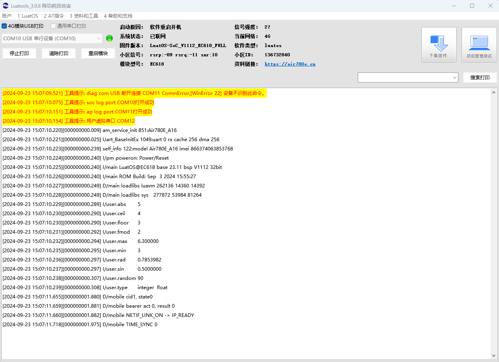

# 基本用法

本文演示math库的基本用法，lua解析器用的是5.3版本，使用方法参考Lua 5.3 参考手册。

## 文档和工具
- math接口描述：[math]([Lua 5.3 参考手册 - LuatOS 文档](https://wiki.luatos.com/luaGuide/luaReference.html#id57))
- 780E模块软件包：[LuatOS 发行版](https://gitee.com/openLuat/LuatOS/releases)
- 本示例所烧录的固件版本：**LuatOS-SoC_V1112_EC618_FULL.soc**
- 本示例所烧录的脚本：见教程代码
- 如果不会烧录，可参考 [烧录教程](https://doc.openluat.com/wiki/21?wiki_page_id=6072)


## 示例
``` lua
sys.taskInit(function()
	-- math.abs (x) 返回 x 的绝对值。(integer/float)	
	log.info("abs",math.abs (-5))
    -- math.ceil (x) 返回不小于 x 的最小整数值   
	log.info("ceil",math.ceil (3.7))
    -- math.floor (x) 返回不大于 x 的最大整数值
	log.info("floor",math.floor (3.7))
    -- math.fmod (x, y) 返回 x 除以 y，将商向零圆整后的余数。(integer/float)    
	log.info("fmod",math.fmod (8, 3))
    -- math.max (x, ···) 返回参数中最大的值， 大小由 Lua 操作 < 决定。(integer/float）    
	log.info("max",math.max (6, 5.2, 3, 6.1, 6.3))
    -- math.min (x, ···) 返回参数中最小的值， 大小由 Lua 操作 < 决定。 (integer/float)
	log.info("min",math.min (6, 5.2, 3, 6.1, 6.3))
    -- math.rad (x) 将角 x 从角度转换为弧度
    log.info("rad",math.rad(45))
    -- math.sin (x) 返回 x 的正弦值（假定参数是弧度    
	log.info("sin",math.sin(math.rad(30)))
    --math.random ([m [, n]])当不带参数调用时， 返回一个 [0,1) 区间内一致分布的浮点伪随机数。 当以两个		整数 m 与 n 调用时， math.random 返回一个 [m, n] 区间 内一致分布的整数伪随机数。 （值 n-m 不能       是负数，且必须在 Lua 整数的表示范围内。） 调用 math.random(n) 等价于 math.random(1,n)。
	log.info("random",math.random(60, 100))	
    --math.type (x) 如果 x 是整数，返回 “integer”， 如果它是浮点数，返回 “float”， 如果 x 不是数字，	   返回 nil
	log.info("type",math.type(8),math.type(6.8))
end)
```

## 对应log
