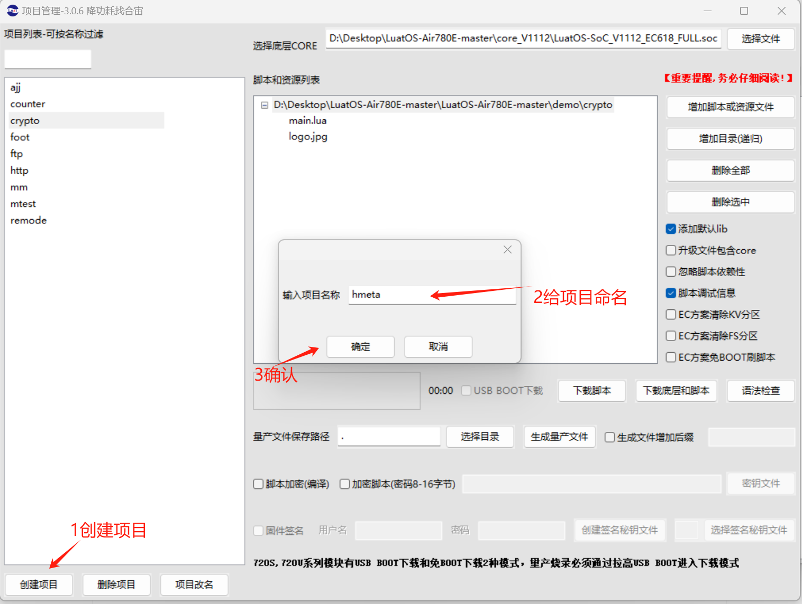

## 一、模块信息概述

模块信息是合宙每一个模块携带的信息,就像人的身份证一样,这些信息确定了模块的唯一性;

包含设备唯一 id,硬件型号,模组的硬件版本号,固件版本号等;

模块远程升级需要上传模块信息，解决和分析某些问题的时候可能也会需要确认模块信息.

## 二、演示功能概述

使用 Air780E 核心板烧录底层固件(**LuatOS-SoC_V1112_EC618_FULL.soc**)和 [hmeta 例程](https://gitee.com/openLuat/LuatOS-Air780E/tree/master/demo/hmeta)脚本学习有关模块信息的 api 函数.

## 三、硬件准备

### 3.1 Air780E 核心板

使用 Air780E 核心板，如下图所示：


淘宝购买链接：[Air780E 核心板淘宝购买链接](https://item.taobao.com/item.htm?id=693774140934&pisk=f1eiwOqL25l1_HYiV6D1ize3wN5d5FMjRrpxkx3VT2uIHCCskWm4kysffAEqor4KRRIskGT0ooqi_coq7DWE000qbVr2mmzKQjNtkV3mnoalvaBRelZshA7RyTFdpD4xQco2_VS2Tcnvc89h5lZshq-pu_FUfEDVVdOmgrkET0ir3mkq_MDEmmM2QjJaY2uI0UGAoNueWRjiw4YTC-_opNr-zluaXleFpfR_X2fhTJVn94W--KJ4KcqQreCDEs3zNVh-DyWpIxqEmyc8savgoor7gX2D7GUzmW4jBJS2_4PTWjestFRZqA0iaRlwjdkIgW2nBR7XNkEn7bDL96_tMA4gN4GNOwa0xVU4IX8G4iReapZyhDSYLIOj_DinyhbSB2IHjbEhxMA51foIXaIhxItMPKJlyMjHNEGZAcQR.&spm=a1z10.5-c-s.w4002-24045920841.33.639f1fd1YrS4b6&skuId=5098266470883) ；

此核心板的详细使用说明参考：[Air780E 产品手册](https://docs.openluat.com/air780e/product/) 中的 << 开发板 Core_Air780E 使用说明 VX.X.X.pdf>>，写这篇文章时最新版本的使用说明为：开发板 Core_Air780E 使用说明 V1.0.5.pdf ；核心板使用过程中遇到任何问题，可以直接参考这份使用说明 pdf 文档.

### 3.2 SIM 卡

中国大陆环境下，可以上网的 sim 卡,一般来说，使用移动，电信，联通的物联网卡或者手机卡都行.

### 3.3 PC 电脑

WINDOWS 系统.

### 3.4 数据通信线

USB 数据线.

## 四、软件环境

### 4.1 Luatools 工具

要想烧录 LuatOS 固件到 4G 模组中，需要用到合宙的强大的调试工具：Luatools；

详细使用说明参考：[Luatools 工具使用说明](https://docs.openluat.com/Luatools/) .

Luatools 工具集具备以下几大核心功能：

- 一键获取最新固件：自动连接合宙服务器，轻松下载最新的合宙模组固件.
- 固件与脚本烧录：便捷地将固件及脚本文件烧录至目标模组中.
- 串口日志管理：实时查看模组通过串口输出的日志信息，并支持保存功能.
- 串口调试助手：提供简洁的串口调试界面，满足基本的串口通信测试需求.

Luatools 下载之后， 无需安装， 解压到你的硬盘，点击 Luatools_v3.exe 即可运行.

### 4.2 准备需要烧录的代码

首先要说明一点： 脚本代码， 要和固件的 soc 文件一起烧录.

#### 4.2.1 **烧录的底层固件文件**

底层 core 下载地址：[LuatOS 固件版本下载地址](https://docs.openluat.com/air780e/luatos/firmware/)


Air780E 的底层固件在 Luatools 解压后目录的 **LuatOS-SoC_V1112_EC618_FULL.soc**


#### 4.2.2 **烧录的脚本代码**

首先要下载 Air780 的 LuatOS 示例代码到一个合适的项目目录,示例代码网站: [https://gitee.com/openLuat/LuatOS-Air780E](https://gitee.com/openLuat/LuatOS-Air780E)

下载流程参考下图:


下载的文件解压,找到 LuatOS-Air780E-master\demo\hmeta\main.lua,如图:


## 五、API 说明

### 5.1 **mcu.unique_id()**

获取设备唯一 id.

**参数**

无

**返回值**

| **返回值类型**<br/> | **解释**<br/>    |
| ------------------- | ---------------- |
| string<br/>         | 设备唯一 id<br/> |

**例子**
```lua
--注意,可能包含不可见字符,如需查看建议 toHex()后打印

sys.taskInit(function()
local unique_id = mcu.unique_id()
log.info("unique_id", unique_id:toHex())
-- 实例输出：unique_id   4A5139383707942E55FF    20
end)
```
---

### 5.2 **mobile.imei(index)**

获取设备 IMEI

**参数**

| **传入值类型**<br/> | **解释**<br/>                                       |
| ------------------- | ---------------------------------------------------- |
| int   <br/>         | 编号,默认0. 在支持双卡的模块上才会出现0或1的情况<br/> |

**返回值**

| **返回值类型**<br/> | **解释**<br/>  |
| ------------------- | -------------- |
| string<br/>         | 设备 IMEI<br/> |

**例子**
```lua
--4G 模组只支持双卡单待/单卡，只有一个 IMEI，可以通过 mobile.imei()直接获取
sys.taskInit(function()
-- 获取 IMEI
log.info("imei", mobile.imei())
-- 实例输出：imei 866374063853768
end)
```
---

### 5.3 **hmeta.model()**

获取硬件型号

**参数**

无

**返回值**

| **返回值类型**<br/> | **解释**<br/>                              |
| ------------------- | ------------------------------------------ |
| string<br/>         | 若能识别到,返回硬件型号, 否则会是 nil<br/> |

**例子**
```lua
sys.taskInit(function()
log.info("hmeta-model", hmeta.model())
-- 实例输出：hmeta-model Air780E
end)
```
---

### 5.4 **rtos.bsp()**

获取硬件 bsp 型号

**参数**

无

**返回值**

| **返回值类型**<br/> | **解释**<br/>      |
| ------------------- | ------------------ |
| string<br/>         | 硬件 bsp 型号<br/> |

**例子**
```lua
sys.taskInit(function()
log.info("rtos.bsp", rtos.bsp())
-- 实例输出：rtos-bsp    EC618
end)
```
---

### 5.5 **hmeta.hwver()**

获取模组的硬件版本号

**参数**

无

**返回值**

| **返回值类型**<br/> | **解释**<br/>                                      |
| ------------------- | -------------------------------------------------- |
| string<br/>         | 若能识别到,返回模组的硬件版本号, 否则会是 nil<br/> |

**例子**
```lua
sys.taskInit(function()
log.info("hmeta", hmeta.hwver and hmeta.hwver())
-- 实例输出：hmeta   A16
end)
```
---

### 5.6 **rtos.version()**

获取固件版本号

**参数**

无

**返回值**

| **返回值类型**<br/> | **解释**<br/>   |
| ------------------- | --------------- |
| string<br/>         | 固件版本号<br/> |

**例子**
```lua
sys.taskInit(function()
log.info("luatos_version ", rtos.version())
-- 实例输出：luatos_version  V1112
end)
```
## 六、功能验证

### 6.1 烧录固件

#### 6.1.1 **正确连接电脑和 4G 模组电路板**

使用带有数据通信功能的数据线，不要使用仅有充电功能的数据线.

#### 6.1.2 **识别 4G 模组的 boot 引脚**

在下载之前，要用模组的 boot 引脚触发下载， 也就是说，要把 4G 模组的 boot 引脚拉到 1.8v，或者直接把 boot 引脚和 VDD_EXT 引脚相连.我们要在按下 BOOT 按键时让模块开机，就可以进入下载模式了.

具体到 Air780E 开发板:

1、当我们模块没开机时，按着 BOOT 键然后长按 POW 开机.

2、当我们模块开机时，按着 BOOT 键然后点按重启键即可.


#### 6.1.3 **识别电脑的正确端口**

判断是否进入 BOOT 模式：模块上电，此时在电脑的设备管理器中，查看串口设备， 会出现一个端口表示进入了 boot 下载模式，如下图所示：


#### 6.1.4 用 Luatools 工具烧录

- 新建项目

首先，确保你的 Luatools 的版本，大于等于 3.0.6 版本的.

在 Luatools 的左上角上有版本显示的，如图所示：


Luatools 版本没问题的话， 就点击 Luatools 右上角的“项目管理测试”按钮，如下图所示：


这时会弹出项目管理和烧录管理的对话框，可以新建一个项目,如下图：



- 开始烧录

选择 780E 板子对应的底层 core 和刚改的 main.lua 脚本文件.下载到板子中.


点击下载后，我们需要进入 boot 模式才能正常下载.

如果没进入 boot 模式会出现下图情况:


进入 boot 模式下载,如图:


### 6.2 例程

本库有专属 demo，[点此链接查看 hmeta 的 demo 例子](https://gitee.com/openLuat/LuatOS-Air780E/tree/master/demo/hmeta)

```lua
-- LuaTools需要PROJECT和VERSION这两个信息
PROJECT = "hmetademo"
VERSION = "1.0.0"

-- sys库是标配
_G.sys = require("sys")


-- Air780E的AT固件默认会为开机键防抖, 导致部分用户刷机很麻烦
if rtos.bsp() == "EC618" and pm and pm.PWK_MODE then
    pm.power(pm.PWK_MODE, false)
end


sys.taskInit(function()
    while hmeta do
        -- hmeta识别底层模组类型的
        -- 不同的模组可以使用相同的bsp,但根据封装的不同,根据内部数据仍可识别出具体模块
        log.info("hmeta", hmeta.model(), hmeta.hwver and hmeta.hwver())
        log.info("bsp",   rtos.bsp())

        local unique_id = mcu.unique_id()
        log.info("unique_id", unique_id:toHex())
    -- 实例输出：unique_id  3539333139071F1E4330    20

    log.info("luatos_version ", rtos.version())
    -- 实例输出：luatos_version  V1112
        sys.wait(3000)
    end
    log.info("这个bsp不支持hmeta库哦")
end)

-- 用户代码已结束---------------------------------------------
-- 结尾总是这一句
sys.run()
-- sys.run()之后后面不要加任何语句!!!!!
```

### 6.3 对应 log

```
[2024-10-15 15:58:13.598][000000000.009] am_service_init 851:Air780E_A17
[2024-10-15 15:58:13.600][000000000.028] Uart_BaseInitEx 1049:uart 0 rx cache 256 dma 256
[2024-10-15 15:58:13.603][000000000.268] self_info 122:model Air780E_A17 imei 868327075469021
[2024-10-15 15:58:13.604][000000000.269] I/pm poweron: Power/Reset
[2024-10-15 15:58:13.605][000000000.269] I/main LuatOS@EC618 base 23.11 bsp V1112 32bit
[2024-10-15 15:58:13.605][000000000.270] I/main ROM Build: Sep  3 2024 15:55:27
[2024-10-15 15:58:13.606][000000000.277] D/main loadlibs luavm 262136 14360 14392
[2024-10-15 15:58:13.607][000000000.277] D/main loadlibs sys   277872 53984 81264
[2024-10-15 15:58:13.607][000000000.315] I/user.hmeta        Air780E        A17
[2024-10-15 15:58:13.608][000000000.315] I/user.bsp        EC618
[2024-10-15 15:58:13.608][000000000.316] I/user.unique_id        3539333139071F1E4330        20
[2024-10-15 15:58:13.609][000000000.316] I/user.luatos_version         V1112
[2024-10-15 15:58:15.304][000000002.142] soc_cms_proc 1518:NAS Event 6 Reject 7 CellID 3c
```

## 七、总结

通过本章学习，你可以学习到模块唯一 ID，模块硬件型号，固件版本，硬件版本的获取方法.

## 八、常见问题

### 8.1 模块唯一 ID 文档

mobile.sn()获取 SN，出厂未必有写 SN;
一般用途的唯一 id, 可以用 mobile.imei()代替;
如需要真正的唯一 ID, 使用 mcu.unique_id()

### 8.2 **通过 IMEI 查询模块生产记录**

[合宙云平台 (](https://iot.openluat.com/mes/mes-device-info)[openluat.com](https://iot.openluat.com/mes/mes-device-info)[)](https://iot.openluat.com/mes/mes-device-info)

## 给读者的话

> 本篇文章由公帅开发；
>
> 本篇文章描述的内容，如果有错误、细节缺失、细节不清晰或者其他任何问题，总之就是无法解决您遇到的问题；
>
> 请登录[合宙技术交流论坛](https://chat.openluat.com/)，点击[文档找错赢奖金-Air780E-LuatOS-软件指南-基础服务-模块信息(hmeta)](https://chat.openluat.com/#/page/matter?125=1848631647319228417&126=%E6%96%87%E6%A1%A3%E6%89%BE%E9%94%99%E8%B5%A2%E5%A5%96%E9%87%91-Air780E-LuatOS-%E8%BD%AF%E4%BB%B6%E6%8C%87%E5%8D%97-%E5%9F%BA%E7%A1%80%E6%9C%8D%E5%8A%A1-%E6%A8%A1%E5%9D%97%E4%BF%A1%E6%81%AF(hmeta)&askid=1848631647319228417)；
>
> 用截图标注+文字描述的方式跟帖回复，记录清楚您发现的问题；
>
> 我们会迅速核实并且修改文档；
>
> 同时也会为您累计找错积分，您还可能赢取月度找错奖金！
