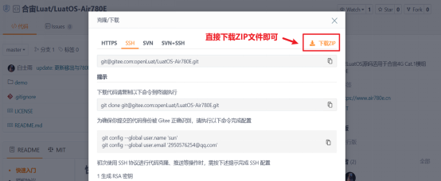
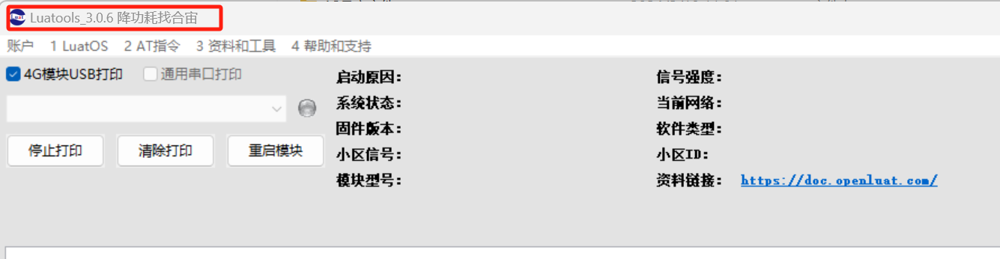
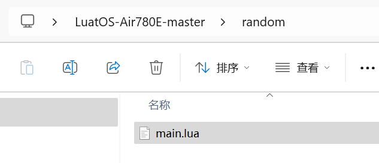

## 一、随机数概述

想要讨论随机数，首先应该明确一下随机数的定义.毕竟这个东西比较虚，并不像算法那样明确.在各大网上也没有给出很好的定义.

那...就不死抠定义了.

随机数一般来说符合下面这几个性质.

1. 它产生时后面那个数与前面的毫无关系
2. 给定样本的一部分和随机算法，无法推出样本的剩余部分
3. 其随机样本不可重现

另外还要说一下统计学伪随机数概念，**划重点:**

**统计学伪随机性.统计学伪随机性指的是在给定的随机比特流样本中，1 的数量大致等于 0 的数量，同理，“10”“01”“00”“11”四者数量大致相等.类似的标准被称为统计学随机性.满足这类要求的数字在人类 “一眼看上去” 是随机的.（摘自百度词条）**

实际上这也是在计算机中对伪随机数优劣的概念.

## 二、演示功能概述

本文章通过 Air780 的核心板烧录底层固件(**LuatOS-SoC_V1112_EC618_FULL.soc**)和修改 LuatOS 示例代码([点此链接查看 crypto 的 demo 例子](https://gitee.com/openLuat/LuatOS-Air780E/tree/master/demo/crypto)),来演示有关随机数的各种 API 的功能.

## 三、硬件准备

### 3.1 Air780E 核心板

使用 Air780E 核心板，如下图所示：


淘宝购买链接：[Air780E 核心板淘宝购买链接](https://item.taobao.com/item.htm?id=693774140934&pisk=f1eiwOqL25l1_HYiV6D1ize3wN5d5FMjRrpxkx3VT2uIHCCskWm4kysffAEqor4KRRIskGT0ooqi_coq7DWE000qbVr2mmzKQjNtkV3mnoalvaBRelZshA7RyTFdpD4xQco2_VS2Tcnvc89h5lZshq-pu_FUfEDVVdOmgrkET0ir3mkq_MDEmmM2QjJaY2uI0UGAoNueWRjiw4YTC-_opNr-zluaXleFpfR_X2fhTJVn94W--KJ4KcqQreCDEs3zNVh-DyWpIxqEmyc8savgoor7gX2D7GUzmW4jBJS2_4PTWjestFRZqA0iaRlwjdkIgW2nBR7XNkEn7bDL96_tMA4gN4GNOwa0xVU4IX8G4iReapZyhDSYLIOj_DinyhbSB2IHjbEhxMA51foIXaIhxItMPKJlyMjHNEGZAcQR.&spm=a1z10.5-c-s.w4002-24045920841.33.639f1fd1YrS4b6&skuId=5098266470883) ；

此核心板的详细使用说明参考：[Air780E 产品手册](https://docs.openluat.com/air780e/product/) 中的 << 开发板 Core_Air780E 使用说明 VX.X.X.pdf>>，写这篇文章时最新版本的使用说明为：开发板 Core_Air780E 使用说明 V1.0.5.pdf ；核心板使用过程中遇到任何问题，可以直接参考这份使用说明 pdf 文档.

### 3.2 SIM 卡

中国大陆环境下，可以上网的 sim 卡,一般来说，使用移动，电信，联通的物联网卡或者手机卡都行.

### 3.3 PC 电脑

WINDOWS 系统.

### 3.4 数据通信线

USB 数据线.

## 四、软件环境

### 4.1 Luatools 工具

要想烧录 LuatOS 固件到 4G 模组中，需要用到合宙的强大的调试工具：Luatools

详细使用说明参考：[Luatools 工具使用说明](https://docs.openluat.com/Luatools/) .

Luatools 工具集具备以下几大核心功能：

- 一键获取最新固件：自动连接合宙服务器，轻松下载最新的合宙模组固件.
- 固件与脚本烧录：便捷地将固件及脚本文件烧录至目标模组中.
- 串口日志管理：实时查看模组通过串口输出的日志信息，并支持保存功能.
- 串口调试助手：提供简洁的串口调试界面，满足基本的串口通信测试需求.

Luatools 下载之后， 无需安装， 解压到你的硬盘，点击 Luatools_v3.exe 即可运行.

### 4.2 准备需要烧录的代码

首先要说明一点： 脚本代码， 要和固件的 soc 文件一起烧录.

#### 4.2.1 **烧录的底层固件文件**

底层 core 下载地址：[LuatOS 固件版本下载地址](https://docs.openluat.com/air780e/luatos/firmware/)


Air780E 的底层固件在 Luatools 解压后目录的 **LuatOS-SoC_V1112_EC618_FULL.soc**


#### 4.2.2 **烧录的脚本代码**

首先要下载 Air780 的 LuatOS 示例代码到一个合适的项目目录,示例代码网站: [https://gitee.com/openLuat/LuatOS-Air780E](https://gitee.com/openLuat/LuatOS-Air780E)

下载流程参考下图:




下载的文件解压,找到 LuatOS-Air780E-master\demo\crypto\main.lua,如图:


- 正确连接电脑和 4G 模组电路板

使用带有数据通信功能的数据线，不要使用仅有充电功能的数据线；

- 识别 4G 模组的 boot 引脚

在下载之前，要用模组的 boot 引脚触发下载， 也就是说，要把 4G 模组的 boot 引脚拉到 1.8v，或者直接把 boot 引脚和 VDD_EXT 引脚相连.我们要在按下 BOOT 按键时让模块开机，就可以进入下载模式了.

具体到 Air780E 开发板:

1、当我们模块没开机时，按着 BOOT 键然后长按 POW 开机.

2、当我们模块开机时，按着 BOOT 键然后点按重启键即可.


- 识别电脑的正确端口

判断是否进入 BOOT 模式：模块上电，此时在电脑的设备管理器中，查看串口设备， 会出现一个端口表示进入了 boot 下载模式，如下图所示：


- 新建项目

首先，确保你的 Luatools 的版本，大于等于 3.0.6 版本的.

在 Luatools 的左上角上有版本显示的，如图所示：



Luatools 版本没问题的话， 就点击 LuaTools 右上角的“项目管理测试”按钮，如下图所示：


这时会弹出项目管理和烧录管理的对话框，可以新建一个项目,如下图：


- 开始烧录

选择 780E 板子对应的底层 core 和刚改的 main.lua 脚本文件.下载到板子中.


点击下载后，我们需要进入 boot 模式才能正常下载.

如果没进入 boot 模式会出现下图情况:


进入 boot 模式下载,如图:


## 五、API 说明

### 5.1 crypto.trng(len)

生成真随机数

**参数**

| **传入值类型**<br/> | **解释**<br/> |
| ------------------- | ------------- |
| int<br/>            | 数据长度<br/> |

**返回值**

| **返回值类型**<br/> | **解释**<br/>         |
| ------------------- | --------------------- |
| string<br/>         | 指定随机数字符串<br/> |

**例子**
```lua
-- 生成 32 位随机数 ir

local r = crypto.trng(4)

local _, ir = pack.unpack(r, "I")
```
---

### 5.2 math.random([n [,m]])

生成伪随机数

**参数**

| **传入值类型**<br/> | **解释**<br/>       |
| ------------------- | ------------------- |
| int<br/>            | 生成随机数范围<br/> |
| int<br/>            | 生成随机数范围<br/> |

**返回值**

| **返回值类型**<br/> | **解释**<br/> |
| ------------------- | ------------- |
| local<br/>          | 随机数字<br/> |

**例子**
```lua
--无参调用，产生[0, 1)之间的浮点随机数.

local num = math.random()

--一个参数 n，产生[1, n]之间的整数

local num = math.random(n)

--两个参数，产生[n, m]之间的整数.

local num = math.random(n,m)
```
---

### 5.3 math.randomseed(n)

用法：设置一个整数 n 作为随机序列的种子.

**参数**

| **传入值类型**<br/> | **解释**<br/> |
| ------------------- | ------------- |
| int<br/>            | 种子数据<br/> |

**返回值**

无

**例子**
```lua
--得到了正常的随机数

math.randomseed(os.time())

for i=0, 10 do

  local n = math.random(10)

end

--一系列相同的数,这种在一个 for 循环内设置随机数的写法 seed 几乎是一样导致.

for i=0, 10 do

  math.randomseed(os.time())

  local n = math.random(10)

end
```
## 六、功能演示

### 6.1 修改示例

首先找到 LuatOS-Air780E-master\demo\crypto\main.lua 脚本文件,复制一份 main.lua 文件到任意目录,我复制到 D:\Desktop\LuatOS-Air780E-master\random 这个目录




然后修改代码:

```lua
-- LuaTools需要PROJECT和VERSION这两个信息
PROJECT = "cryptodemo"
VERSION = "1.0.0"

log.info("main", PROJECT, VERSION)

-- sys库是标配
_G.sys = require("sys")

-- Air780E的AT固件默认会为开机键防抖, 导致部分用户刷机很麻烦
if rtos.bsp() == "EC618" and pm and pm.PWK_MODE then
    pm.power(pm.PWK_MODE, false)
end


if wdt then
    --添加硬狗防止程序卡死，在支持的设备上启用这个功能
    wdt.init(9000)--初始化watchdog设置为9s
    sys.timerLoopStart(wdt.feed, 3000)--3s喂一次狗
end

sys.taskInit(function()

    sys.wait(1000)
    -- ---------------------------------------
    log.info("随机数测试")
    math.randomseed(os.time())
    for i=1, 10 do
         sys.wait(100)
         log.info("crypto", "真随机数",string.unpack("I",crypto.trng(4)))
         log.info("crypto", "伪随机数",math.random()) -- 输出的是浮点数,不推荐
         log.info("crypto", "伪随机数",math.random(100)) --输出1-100之间随机数
         log.info("crypto", "伪随机数",math.random(1, 65525)) -- 不推荐
    end
    log.info("crypto", "ALL Done")
    sys.wait(100000)
end)

-- 用户代码已结束---------------------------------------------
-- 结尾总是这一句
sys.run()
-- sys.run()之后后面不要加任何语句!!!!!
```

### 6.1 烧录固件

#### 6.1.1 **正确连接电脑和 4G 模组电路板**

使用带有数据通信功能的数据线，不要使用仅有充电功能的数据线.

#### 6.1.2 **识别 4G 模组的 boot 引脚**

在下载之前，要用模组的 boot 引脚触发下载， 也就是说，要把 4G 模组的 boot 引脚拉到 1.8v，或者直接把 boot 引脚和 VDD_EXT 引脚相连.我们要在按下 BOOT 按键时让模块开机，就可以进入下载模式了.

具体到 Air780E 开发板:

1、当我们模块没开机时，按着 BOOT 键然后长按 PWR 开机.

2、当我们模块开机时，按着 BOOT 键然后点按重启键即可.


#### 6.1.3 **识别电脑的正确端口**

判断是否进入 BOOT 模式：模块上电，此时在电脑的设备管理器中，查看串口设备， 会出现一个端口表示进入了 boot 下载模式，如下图所示：


当设备管理器出现了 3 个连续数字的 com 端口，这时候， 硬件连接上就绪状态，恭喜你，可以进行烧录了！

#### 6.1.4 用 Luatools 工具烧录

- 新建项目

首先，确保你的 Luatools 的版本，大于等于 3.0.6 版本的.

在 Luatools 的左上角上有版本显示的，如图所示：


Luatools 版本没问题的话， 就点击 LuaTOols 右上角的“项目管理测试”按钮，如下图所示：


这时会弹出项目管理和烧录管理的对话框，可以新建一个项目,如下图：


- 开始烧录

选择 780E 板子对应的底层 core 和刚改的 main.lua 脚本文件.下载到板子中.


点击下载后，我们需要进入 boot 模式才能正常下载.

如果没进入 boot 模式会出现下图情况:


当我们模块没开机时，按着 BOOT 键然后长按 PWR 开机,进入下载.

当我们模块开机时，按着 BOOT 键然后点按重启键即可.可以进入下载,如图:


### 6.3 对应 Log

```
[2024-10-18 15:30:52.567] 工具提示: soc log port COM5打开成功
[2024-10-18 15:30:52.595] 工具提示: ap log port COM6打开成功
[2024-10-18 15:30:52.598] 工具提示: 用户虚拟串口 COM9
[2024-10-18 15:30:52.677] 工具提示: 用户log保存在D:\Desktop\LuaTools\log\trace_2024-10-18_153052.txt 如果有问题交给FAE
[2024-10-18 15:30:52.676][000000000.009] am_service_init 851:Air780E_A17
[2024-10-18 15:30:52.686][000000000.023] Uart_BaseInitEx 1049:uart 0 rx cache 256 dma 256
[2024-10-18 15:30:52.687][000000000.225] self_info 122:model Air780E_A17 imei 868327075469021
[2024-10-18 15:30:52.688][000000000.227] I/pm poweron: Power/Reset
[2024-10-18 15:30:52.689][000000000.227] I/main LuatOS@EC618 base 23.11 bsp V1112 32bit
[2024-10-18 15:30:52.690][000000000.227] I/main ROM Build: Sep  3 2024 15:55:27
[2024-10-18 15:30:52.691][000000000.235] D/main loadlibs luavm 262136 14360 14392
[2024-10-18 15:30:52.692][000000000.235] D/main loadlibs sys   277872 53984 81264
[2024-10-18 15:30:52.694][000000000.246] I/user.main        cryptodemo        1.0.0
[2024-10-18 15:30:53.486][000000001.276] I/user.随机数测试
[2024-10-18 15:30:53.596][000000001.386] I/user.crypto        真随机数        -2126957010        5
[2024-10-18 15:30:53.607][000000001.388] I/user.crypto        伪随机数        0.4636298
[2024-10-18 15:30:53.611][000000001.389] I/user.crypto        伪随机数        50
[2024-10-18 15:30:53.613][000000001.390] I/user.crypto        伪随机数        46998
[2024-10-18 15:30:53.690][000000001.491] I/user.crypto        真随机数        -309051301        5
[2024-10-18 15:30:53.693][000000001.492] I/user.crypto        伪随机数        0.6394390
[2024-10-18 15:30:53.706][000000001.501] I/user.crypto        伪随机数        10
[2024-10-18 15:30:53.714][000000001.502] I/user.crypto        伪随机数        38883
[2024-10-18 15:30:53.802][000000001.604] I/user.crypto        真随机数        -1863938574        5
[2024-10-18 15:30:53.805][000000001.605] I/user.crypto        伪随机数        0.9536643
[2024-10-18 15:30:53.807][000000001.607] I/user.crypto        伪随机数        25
[2024-10-18 15:30:53.811][000000001.608] I/user.crypto        伪随机数        16512
[2024-10-18 15:30:53.928][000000001.717] I/user.crypto        真随机数        1261760763        5
[2024-10-18 15:30:53.934][000000001.719] I/user.crypto        伪随机数        0.6245894
[2024-10-18 15:30:53.937][000000001.720] I/user.crypto        伪随机数        54
[2024-10-18 15:30:53.940][000000001.721] I/user.crypto        伪随机数        21478
[2024-10-18 15:30:54.023][000000001.822] I/user.crypto        真随机数        936401639        5
[2024-10-18 15:30:54.027][000000001.824] I/user.crypto        伪随机数        0.9050973
[2024-10-18 15:30:54.036][000000001.833] I/user.crypto        伪随机数        1
[2024-10-18 15:30:54.039][000000001.834] I/user.crypto        伪随机数        44043
[2024-10-18 15:30:54.148][000000001.936] I/user.crypto        真随机数        1715074597        5
[2024-10-18 15:30:54.156][000000001.937] I/user.crypto        伪随机数        0.5631961
[2024-10-18 15:30:54.159][000000001.938] I/user.crypto        伪随机数        10
[2024-10-18 15:30:54.161][000000001.939] I/user.crypto        伪随机数        13488
[2024-10-18 15:30:54.258][000000002.049] I/user.crypto        真随机数        -1914839329        5
[2024-10-18 15:30:54.269][000000002.050] I/user.crypto        伪随机数        0.7684302
[2024-10-18 15:30:54.272][000000002.051] I/user.crypto        伪随机数        77
[2024-10-18 15:30:54.274][000000002.052] I/user.crypto        伪随机数        30056
[2024-10-18 15:30:54.366][000000002.154] I/user.crypto        真随机数        -974370001        5
[2024-10-18 15:30:54.371][000000002.155] I/user.crypto        伪随机数        0.2707427
[2024-10-18 15:30:54.375][000000002.165] I/user.crypto        伪随机数        11
[2024-10-18 15:30:54.380][000000002.166] I/user.crypto        伪随机数        46138
[2024-10-18 15:30:54.475][000000002.267] I/user.crypto        真随机数        -1427124973        5
[2024-10-18 15:30:54.489][000000002.268] I/user.crypto        伪随机数        0.3834128
[2024-10-18 15:30:54.492][000000002.270] I/user.crypto        伪随机数        88
[2024-10-18 15:30:54.495][000000002.271] I/user.crypto        伪随机数        12880
[2024-10-18 15:30:54.584][000000002.381] I/user.crypto        真随机数        427995234        5
[2024-10-18 15:30:54.596][000000002.382] I/user.crypto        伪随机数        0.3756179
[2024-10-18 15:30:54.601][000000002.383] I/user.crypto        伪随机数        23
[2024-10-18 15:30:54.604][000000002.384] I/user.crypto        伪随机数        20818
[2024-10-18 15:30:54.607][000000002.385] I/user.crypto        ALL Done
```

## 七、总结

通过本章内容的学习，你可以学习到有关随机数的函数，例如：crypto.trng(len)、math.random([n [,m]])、math.randomseed(n) 等函数.

## 八、扩展

### 8.1 **注意事项**

需要注意的是，Lua 中的随机数算法可能存在一些问题.例如，math.random(1, 3276700)返回的值最后两位必为 0，这是由于 Lua 本身的随机函数算法决定的.因此，在使用 Lua 生成随机数时，应当注意这些潜在的限制，并尽可能通过设置合适的随机种子来避免生成可预测的随机数序列.

通过以上方法，可以在 Lua 中有效地生成随机数，并确保每次运行程序时都能得到不同的随机数序列，从而满足各种需要随机性的应用场景.

### 8.2 **设置随机数种子**

为了确保每次运行程序时都能生成不同的随机数序列，需要使用math.randomseed来设置一个随机种子.通常，使用系统时间os.time()作为种子是一个简单而有效的方法：
```lua
math.randomseed(os.time())
```
然而，如果程序在很短的时间内多次运行，可能会发现生成的随机数序列几乎不变.这是因为os.time()返回的是秒级的时间戳，不够精确.为了解决这个问题，可以将时间戳转换为字符串，然后反转并截取高位数字作为种子：
```lua
math.randomseed(tonumber(tostring(os.time()):reverse():sub(1, 7)))
```
这种方法通过提高种子数值的变化量，使得即使在短时间内多次运行程序，也能产生更好的伪随机序列.

## 给读者的话

> 本篇文章由公帅开发；
>
> 本篇文章描述的内容，如果有错误、细节缺失、细节不清晰或者其他任何问题，总之就是无法解决您遇到的问题；
>
> 请登录[合宙技术交流论坛](https://chat.openluat.com/)，点击[文档找错赢奖金-Air780E-LuatOS-软件指南-基础服务-随机数(random)](https://chat.openluat.com/#/page/matter?125=1848631065388908545&126=%E6%96%87%E6%A1%A3%E6%89%BE%E9%94%99%E8%B5%A2%E5%A5%96%E9%87%91-Air780E-LuatOS-%E8%BD%AF%E4%BB%B6%E6%8C%87%E5%8D%97-%E5%9F%BA%E7%A1%80%E6%9C%8D%E5%8A%A1-%E9%9A%8F%E6%9C%BA%E6%95%B0(random)&askid=1848631065388908545)；
>
> 用截图标注+文字描述的方式跟帖回复，记录清楚您发现的问题；
>
> 我们会迅速核实并且修改文档；
>
> 同时也会为您累计找错积分，您还可能赢取月度找错奖金！

