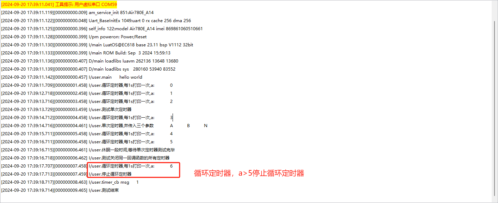
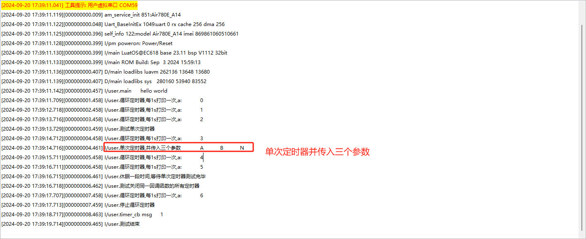
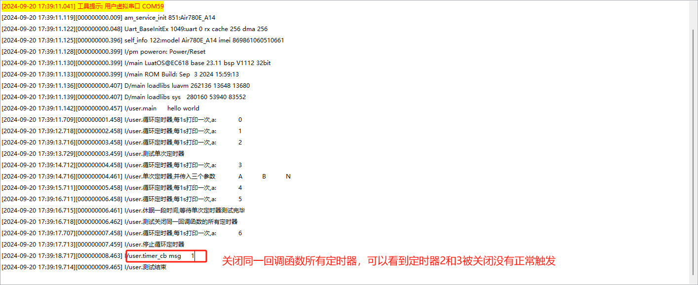

# 基本用法

本文演示定时器和延时函数的基本用法

## 文档和工具
- timer接口描述：[timer](https://wiki.luatos.com/api/sys.html#sys-wait-timeout)
- 780E模块软件包：[LuatOS 发行版](https://gitee.com/openLuat/LuatOS/releases)
- 本示例所烧录的固件版本：**LuatOS-SoC_V1112_EC618_FULL.soc**
- 本示例所烧录的脚本：见教程代码
- 如果不会烧录，可参考 [烧录教程](https://doc.openluat.com/wiki/21?wiki_page_id=6072)


## 示例
``` lua
-- Luatools需要PROJECT和VERSION这两个信息
PROJECT = "timer"
VERSION = "1.0.0"

-- sys库是标配
_G.sys = require("sys")
--[[特别注意, 使用http库需要下列语句]]
_G.sysplus = require("sysplus")

log.info("main", "hello world")

local a = 0
local loop_timer
loop_timer = sys.timerLoopStart(function()
    log.info("循环定时器,每1s打印一次,a:", a)
    if a > 5 then --a>5时停止循环定时器
        sys.timerStop(loop_timer)
        log.info("停止循环定时器")
    end
    a = a + 1
end, 1000)

function timer_cb(tag)
    log.info("timer_cb msg", tag)
end

sys.taskInit(function()
    sys.wait(3000)
    log.info("测试单次定时器")
    local timer_1 = sys.timerStart(function(a, b, c)
        log.info("单次定时器,并传入三个参数", a, b, c) -- 1000毫秒后才会执行
    end, 1000, "A", "B", "N")
    sys.wait(3000)
    log.info("休眠一段时间,等待单次定时器测试完毕")
    log.info("测试关闭同一回调函数的所有定时器")
    sys.timerStart(timer_cb, 2000, "1") --同一回调函数定时器1
    sys.timerStart(timer_cb, 4000, "2") --同一回调函数定时器2
    sys.timerStart(timer_cb, 6000, "3") --同一回调函数定时器3
    sys.wait(3000)                    --正常现象应该是同一回调函数定时器1正常触发，定时器2和定时器3被关闭
    sys.timerStopAll(timer_cb)
    log.info("测试结束")
end)
-- 用户代码已结束---------------------------------------------
-- 结尾总是这一句
sys.run()
-- sys.run()之后后面不要加任何语句!!!!!
```

## 对应log
循环定时器log



单次定时器log



关闭同一回调函数的所有定时器log

