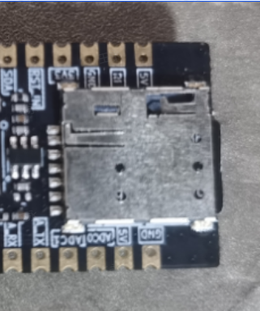
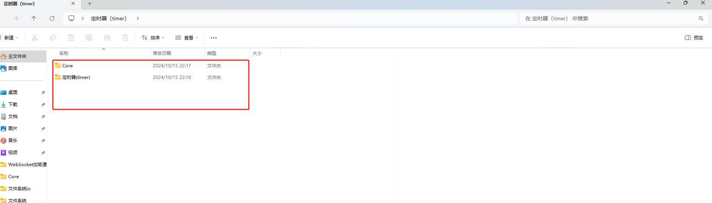
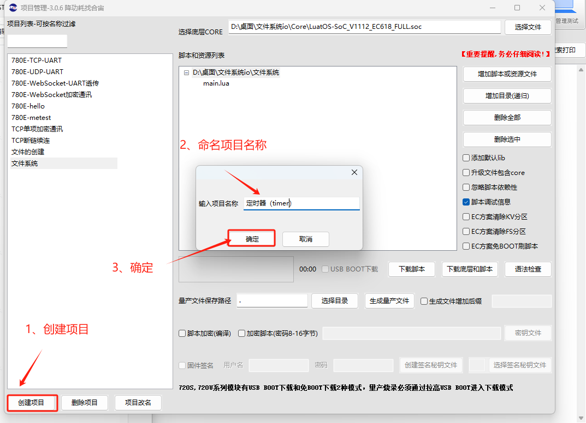
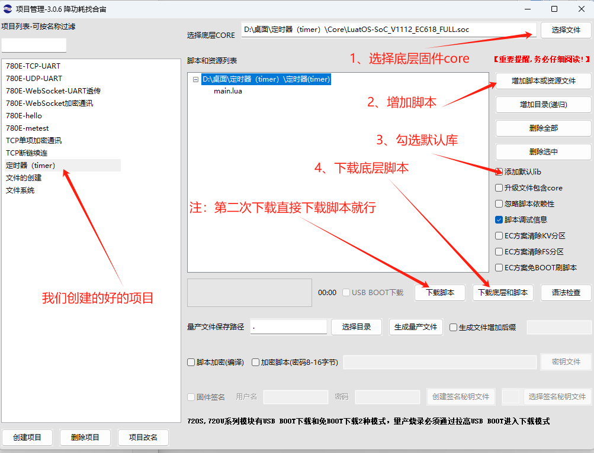
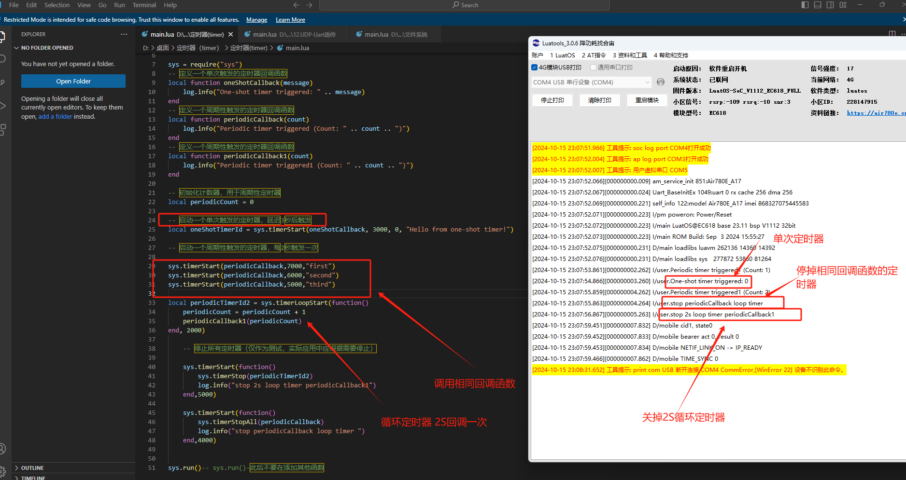

## 一、定时器(timer)**的概述**

- 在 Air780E 模组搭载的 LuatOS 系统中，定时器（timer）是一项基础且关键的服务。它允许开发者在特定的时间点或周期性地执行代码段，为物联网设备的运行提供了精确的时间控制。定时器在多种应用场景中都发挥着重要作用，如定时发送数据、周期性检查传感器状态等。

## 二、准备硬件环境

“古人云：‘工欲善其事，必先利其器。’在深入介绍本功能示例之前，我们首先需要确保以下硬件环境的准备工作已经完成。”

### 2.1 Air780E 开发板

本demo使用的是 Air780E 核心板，如下图所示：


点击链接购买：[Air780E 核心板淘宝购买链接](https://item.taobao.com/item.htm?id=693774140934&pisk=f1eiwOqL25l1_HYiV6D1ize3wN5d5FMjRrpxkx3VT2uIHCCskWm4kysffAEqor4KRRIskGT0ooqi_coq7DWE000qbVr2mmzKQjNtkV3mnoalvaBRelZshA7RyTFdpD4xQco2_VS2Tcnvc89h5lZshq-pu_FUfEDVVdOmgrkET0ir3mkq_MDEmmM2QjJaY2uI0UGAoNueWRjiw4YTC-_opNr-zluaXleFpfR_X2fhTJVn94W--KJ4KcqQreCDEs3zNVh-DyWpIxqEmyc8savgoor7gX2D7GUzmW4jBJS2_4PTWjestFRZqA0iaRlwjdkIgW2nBR7XNkEn7bDL96_tMA4gN4GNOwa0xVU4IX8G4iReapZyhDSYLIOj_DinyhbSB2IHjbEhxMA51foIXaIhxItMPKJlyMjHNEGZAcQR.&spm=a1z10.5-c-s.w4002-24045920841.33.639f1fd1YrS4b6&skuId=5098266470883) ；

此核心板的详细使用说明参考：[Air780E 产品手册](https://docs.openluat.com/air780e/product/) 中的 << 开发板 Core_Air780E 使用说明 VX.X.X.pdf>>，写这篇文章时最新版本的使用说明为：[开发板 Core_Air780E 使用说明 V1.0.5.pdf](https://cdn.openluat-luatcommunity.openluat.com/attachment/20240419155721583_%E5%BC%80%E5%8F%91%E6%9D%BFCore_Air780E%E4%BD%BF%E7%94%A8%E8%AF%B4%E6%98%8EV1.0.5.pdf) ；核心板使用过程中遇到任何问题，可以直接参考这份使用说明 pdf 文档。

### 2.2 SIM 卡

请准备一张可正常上网的 SIM 卡，该卡可以是物联网卡或您的个人手机卡。

**特别提醒：**请确保 SIM 卡未欠费且网络功能正常，以便顺利进行后续操作。

### 2.3 PC 电脑

请准备一台配备 USB 接口且能够正常上网的电脑。

### 2.4 数据通信线

请准备一根用于连接 Air780E 开发板和 PC 电脑的数据线，该数据线将实现业务逻辑的控制与交互。您有两种选择：

- USB 数据线（其一端为 Type-C 接口，用于连接 Air780E 开发板）。通常，这种数据线的外观如下示意图所示：


普通的手机 USB 数据线一般都可以直接使用；

### 2.5 组装硬件环境

#### 2.5.1 请按照 SIM 卡槽上的指示方向正确插入 SIM 卡，务必确保插入方向正确，避免插反导致损坏！

通常，插入 SIM 卡的步骤如下：

- 将 SIM 卡的金属接触面朝下，对准卡槽的开口。
- 用力平稳地将 SIM 卡推入卡槽，直至听到“咔嚓”一声，表示 SIM 卡已正确安装到位。




#### 2.5.2 USB 数据线，连接电脑和 Air780E 开发板，如下图所示：


## 三、准备软件环境

“凡事预则立，不预则废。”在详细阐述本功能示例之前，我们需先精心筹备好以下软件环境。

### 3.1 Luatools 工具

要想烧录 AT 固件到 4G 模组中，需要用到合宙的强大的调试工具：Luatools；

下载地址：[Luatools v3 下载调试工具](https://luatos.com/luatools/download/last)。

Luatools 工具集具备以下几大核心功能：

- 一键获取最新固件：自动连接合宙服务器，轻松下载最新的合宙模组固件。
- 固件与脚本烧录：便捷地将固件及脚本文件烧录至目标模组中。
- 串口日志管理：实时查看模组通过串口输出的日志信息，并支持保存功能。
- 串口调试助手：提供简洁的串口调试界面，满足基本的串口通信测试需求。

Luatools 下载之后， 无需安装， 解压到你的硬盘，点击 Luatools_v3.exe 运行，出现如下界面，就代表 Luatools 安装成功了：


### 3.2 烧录代码

首先要说明一点： 脚本代码， 要和固件的 LuatOS-SoC_V1112_EC618_FULL.soc 文件一起烧录。

**整体压缩文件：内含有 文件一：Core 固件 和 文件二：定时器(timer)脚本文件 如下图所示。**



#### 3.2.1 **压缩文件：完整文件包**
[右键点我,另存为,下载完整压缩文件包](file/定时器_timer.zip){:target="_blank"}
#### 3.2.2 压缩包内部文件

**文件一：Core 固件**

**文件二：定时器(timer)脚本文件**

#### 3.2.3 **找到烧录的固件文件**

官网下载,底层 core 下载地址：[LuatOS 底层 core](https://docs.openluat.com/air780e/luatos/firmware/)     **注：**本 demo 使用如图所示固件


#### 3.2.4 **正确连接电脑和 4G 模组电路板**

使用带有数据通信功能的数据线，不要使用仅有充电功能的数据线；

#### 3.2.5 **识别 4G 模组的 boot 引脚**

在下载之前，要用模组的 boot 引脚触发下载， 也就是说，要把 4G 模组的 boot 引脚拉到 1.8v，或者直接把 boot 引脚和 VDD_EXT 引脚相连。我们要在按下 BOOT 按键时让模块开机，就可以进入下载模式了。

具体到 Air780E 开发板，

1、当我们模块没开机时，按着 BOOT 键然后长按 PWR 开机。

2、当我们模块开机时，按着 BOOT 键然后点按重启键即可。


#### 3.2.6 **识别电脑的正确端口**

判断是否进入 BOOT 模式：模块上电，此时在电脑的设备管理器中，查看串口设备， 会出现一个端口表示进入了 boot 下载模式，如下图所示：


当设备管理器出现了 3 个连续数字的 com 端口，并且每个数字都大于 4，这时候， 硬件连接上就绪状态，恭喜你，可以进行烧录了！

#### 3.2.7 **新建项目**

首先，确保你的 Luatools 的版本大于或者等于 3.0.6 版本.

在 Luatools 的左上角上有版本显示的，如图所示：


Luatools 版本没问题的话， 就点击 Luatools 右上角的“项目管理测试”按钮，如下图所示：


这时会弹出项目管理和烧录管理的对话框，如下图：



#### 3.2.8 **开始烧录**

选择 780E 板子对应的底层 core 和刚改的 main.lua 脚本文件。下载到板子中。




点击下载后，我们需要进入 boot 模式才能正常下载。


## 四、定时器(timer)基本用法

### 4.1 本教程实现的功能定义：

- 此次 demo 验证单次触发定时器和周期性触发定时器的基本功能。
- 尝试展示了如何通过定时器回调函数执行特定任务。
- 验证定时 `sys.timerStopAll` 和 `sys.timerStop` 的用法。

### 4.2 文章内容引用

- 780E 开发板软硬件资料 ： [Air780E 产品手册 ](https://docs.openluat.com/air780e/product/)
- 以上接口函数不做详细介绍，可通过此链接查看具体介绍：[sys 库](https://wiki.luatos.com/api/sys.html#sys-timerstopall-fnc)

### 4.3 `sys.timerStart`

**功能：**启动一个定时器，该定时器在指定的延迟时间后执行回调函数，或者如果指定了重复次数，则周期性地执行回调函数。

**函数原型：**local timerId = sys.timerStart(func, timeout, repeat, arg1, arg2, ..., argN)

**参数：**

- `func`：定时器触发时要执行的回调函数。
- `timeout`：定时器启动后的延迟时间（以毫秒为单位），即定时器触发前需要等待的时间。
- `repeat`（可选）：指定定时器是否重复触发。如果为 0，则定时器只触发一次；如果为正整数，则定时器会重复触发指定的次数；如果为负整数（如-1），则定时器可能表示无限重复（具体取决于 LuatOS 的实现，但通常-1 用于无限循环）。
- `arg1, arg2, ..., argN`（可选）：传递给回调函数的参数，可以是多个。

**例子：**

```lua
-- 定义一个回调函数，该函数会打印传递给它的参数  
local function printMessage(message, count)    
print(message .. " (Count: " .. count .. ")")  
end  
-- 启动一个定时器，延迟2000毫秒后触发，不重复，并传递两个参数给回调函数  
local timerId1 = sys.timerStart(printMessage, 2000, 0, "Hello, World!", 1)  
  
-- 启动另一个定时器，每3000毫秒触发一次，重复3次，并传递两个参数给回调函数  
local timerId2 = sys.timerStart(printMessage, 3000, 3, "Timer Triggered", 2)  
-- 为了保持程序运行并观察定时器的触发（注意：在实际应用中，应避免使用简单的无限循环）  
while true do    -- 这里可以添加其他逻辑，但在这个例子中，我们仅仅保持循环运行以观察定时器的触发   
 sys.wait(1000) -- 等待1秒（注意：这里的等待不会影响定时器的触发）  
   -- 注意：在实际应用中，应该使用更合适的机制来管理程序的运行和定时器的触发，而不是简单的无限循环和等待  
   -- 可以在这里添加代码来停止定时器，例如：   
 -- if some_condition then   
 --     sys.timerStop(timerId1)   
 --     sys.timerStop(timerId2)    
--     break    
-- end  
end  
-- 注意：上面的例子包含了一个无限循环，所以这里没有展示停止定时器的代码。  
-- 在实际应用中，您应该在适当的时机调用sys.timerStop(timerId)来停止定时器。
```

### 4.4 `sys.timerStop`

**功能：**停止一个已启动的定时器。

**函数原型：**sys.timerStop(timerId)

**参数：**`timerId`：要停止的定时器的唯一标识符。

**例子：**

```lua
-- 停止之前启动的定时器timerId1  
sys.timerStop(timerId1)
```

### 4.5 `sys.timerLoopStart`

**功能：**启动一个周期性定时器，该定时器会按照指定的时间间隔反复执行回调函数。。

**函数原型：**local timerId = sys.timerLoopStart(func, timeout, arg1, arg2, ..., argN)

**参数：**

- `func`：定时器触发时要执行的回调函数。
- `timeout`：定时器的时间间隔（以毫秒为单位），即每次触发之间的等待时间。
- `arg1, arg2, ..., argN`：传递给回调函数的参数（可选），可以是多个。

**返回值：**返回定时器的唯一标识符 `timerId`，该标识符可用于后续停止定时器。

**例子：**

```lua
-- 定义一个回调函数，该函数会打印传递给它的参数  
local function printArgs(arg1, arg2)   
  print("Argument 1:", arg1)    
print("Argument 2:", arg2)  
end  
-- 启动一个每3000毫秒触发一次的周期性定时器，并传递两个参数给回调函数  
local timerId = sys.timerLoopStart(printArgs, 3000, "Hello", 123)  
  
-- 为了保持程序运行并观察定时器的触发，可以添加一个无限循环（注意：在实际应用中，应避免使用简单的无限循环，而是应使用更高效的任务调度机制）  
while true do    -- 这里可以添加其他逻辑，但在这个例子中，我们仅仅保持循环运行以观察定时器的触发    
sys.wait(1000)
 -- 等待1秒（注意：这里的等待不会影响定时器的触发）    -- 注意：在实际应用中，应该使用更合适的机制来管理程序的运行和定时器的触发，而不是简单的无限循环和等待  
end  
  
-- 注意：在实际代码中，应该在不再需要定时器时调用sys.timerStop来停止它，以避免资源泄露。但由于上面的例子包含了一个无限循环，所以这里没有展示停止定时器的代码。在实际应用中，您应该在适当的时机调用sys.timerStop(timerId)来停止定时器。
```

### 4.6 `sys.timerStopAll`

**功能：**停止所有由指定回调函数启动的定时器，或者如果没有提供回调函数参数，则停止所有定时器。

**函数原型：**sys.timerStopAll([fnc])

**参数：**`fnc`（可选）：一个回调函数。如果提供了这个参数，那么只有由这个回调函数启动的定时器会被停止。如果没有提供这个参数，那么所有的定时器都会被停止。

**返回值：**无。

**例子：**

```lua
-- 定义一个回调函数，用于定时器触发时执行  
local function myCallback()   
  print("Timer triggered")  
end  
-- 启动两个定时器，它们都由myCallback回调函数启动  
sys.timerLoopStart(myCallback, 2000) -- 每2秒触发一次  
sys.timerLoopStart(myCallback, 3000) -- 每3秒触发一次  

-- 等待一段时间以观察定时器的触发（在实际应用中，应避免使用简单的等待循环）  
sys.wait(5000) -- 等待5秒  
  
-- 停止所有由myCallback回调函数启动的定时器  
sys.timerStopAll(myCallback)  
  
-- 如果想要停止所有定时器（无论它们是由哪个回调函数启动的），可以调用不带参数的sys.timerStopAll  
-- sys.timerStopAll()
```

## 五、定时器(timer)整体演示

### 5.1 **成果演示与深度解析：视频 + 图文全面展示**

#### 5.1.1 **成果运行精彩呈现**



#### 5.1.2 **演示视频生动展示**
<video controls src="file/定时器_timer.mp4"></video>
#### 5.1.3 **完整实例深度剖析**

```lua
-- main.lua文件
-- LuaTools需要PROJECT和VERSION这两个信息
PROJECT = "timer_demo"
VERSION = "1.0.0"
sys = require("sys")
-- 定义一个单次触发的定时器回调函数  
local function oneShotCallback(message)    
  log.info("One-shot timer triggered: " .. message)  
end  
-- 定义一个周期性触发的定时器回调函数  
local function periodicCallback(count)    
  log.info("Periodic timer triggered (Count: " .. count .. ")")  
end  
-- 定义一个周期性触发的定时器回调函数  
local function periodicCallback1(count)    
  log.info("Periodic timer triggered1 (Count: " .. count .. ")")  
end  
-- 初始化计数器，用于周期性定时器  
local periodicCount = 0  
-- 启动一个单次触发的定时器，延迟3秒后触发  
local oneShotTimerId = sys.timerStart(oneShotCallback, 3000, 0, "Hello from one-shot timer!")  
  
-- 启动一个周期性触发的定时器，每2秒触发一次  
sys.timerStart(periodicCallback,7000,"first")
sys.timerStart(periodicCallback,6000,"second")
sys.timerStart(periodicCallback,5000,"third")

local periodicTimerId2 = sys.timerLoopStart(function()    periodicCount = periodicCount + 1    periodicCallback1(periodicCount)  
end, 2000)  
    -- 停止所有定时器（仅作为测试，实际应用中应根据需要停止）  
    sys.timerStart(function()
        sys.timerStop(periodicTimerId2)
        log.info("stop 2s loop timer periodicCallback1")
    end,5000)
    sys.timerStart(function()
        sys.timerStopAll(periodicCallback)        
        log.info("stop periodicCallback loop timer ")
    end,4000)
sys.run()-- sys.run()-此后不要在添加其他函数
```

## 六、总结

## 七、常见问题：

### 7.1 回调函数执行异常：

- 如果定时器的回调函数中存在异常处理不当的情况，可能会导致程序崩溃或产生不可预知的行为。
- 需要在回调函数中做好异常处理，确保程序的健壮性。

### 7.2 定时器冲突：

- 在多个定时器同时存在的情况下，可能会存在定时器冲突的问题，即多个定时器同时触发或相互干扰。
- 需要合理设计定时器的触发时间和周期，避免冲突的发生。

### 7.3 资源占用问题：

- 定时器的创建、启动和停止等操作可能会占用一定的系统资源，如内存、CPU 等。
- 在资源受限的嵌入式系统中，需要合理管理定时器的使用，避免资源过度占用。

### 7.4 定时器 ID 管理：

- 在使用定时器接口函数时，通常会返回一个定时器 ID 用于后续操作。如果定时器 ID 管理不当，可能会导致无法正确停止或删除定时器。
- 需要建立良好的定时器 ID 管理机制，确保定时器的正确操作。

### 7.5 定时器重复启动问题：

- 在某些情况下，可能会不小心重复启动同一个定时器，导致多个相同的定时器同时存在。
- 这可能会导致资源浪费或任务重复执行。需要确保定时器的唯一性和正确性。

## 八、扩展

### 8.1 定时器的嵌套与递归

- 嵌套定时器：在某些情况下，一个定时器的回调函数可能会启动另一个定时器。这种嵌套定时器的使用需要特别小心，以避免无限递归或资源耗尽。
- 递归定时器：递归定时器是指一个定时器在其回调函数中重新启动自己。这种用法需要特别注意避免无限循环和堆栈溢出。

### 8.2 定时器的动态调整

- 周期调整：在某些应用中，可能需要动态调整定时器的周期。这通常涉及停止当前定时器并重新启动一个新周期的定时器。
- 任务优先级调整：对于某些实时性要求较高的任务，可能需要动态调整定时器的优先级，以确保任务能够及时执行。

## 给读者的话

> 本篇文章由`永仔`开发；
>
> 本篇文章描述的内容，如果有错误、细节缺失、细节不清晰或者其他任何问题，总之就是无法解决您遇到的问题；
>
> 请登录[合宙技术交流论坛](https://chat.openluat.com/)，点击[文档找错赢奖金-Air780E-LuatOS-软件指南-基础服务-定时器](https://chat.openluat.com/#/page/matter?125=1846741691894202369&126=%E6%96%87%E6%A1%A3%E6%89%BE%E9%94%99%E8%B5%A2%E5%A5%96%E9%87%91-Air780E-LuatOS-%E8%BD%AF%E4%BB%B6%E6%8C%87%E5%8D%97-%E5%9F%BA%E7%A1%80%E6%9C%8D%E5%8A%A1-%E5%AE%9A%E6%97%B6%E5%99%A8&askid=1846741691894202369)；
>
> 用截图标注+文字描述的方式跟帖回复，记录清楚您发现的问题；
>
> 我们会迅速核实并且修改文档；
>
> 同时也会为您累计找错积分，您还可能赢取月度找错奖金！