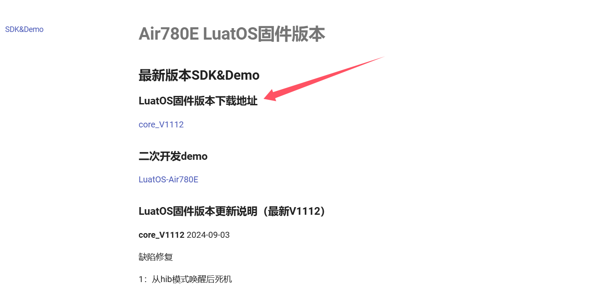

## 一、看门狗电路介绍

看门狗（Watch Dog Timer，WDT）是一种监控电路，主要应用于嵌入式系统，目的是为了提高系统的可靠性和稳定性。在看门狗电路的帮助下，当系统出现异常，如程序跑飞或死循环时，能够自动复位并重新启动系统。

### 1.1 看门狗的工作原理

看门狗电路通常包括一个定时器、一个喂狗信号和一个复位（Reset）输出。在正常的系统运行过程中，主控制器（MCU）会定期向喂狗信号发送一个脉冲，以“喂”看门狗，防止其计时到达预设值。如果 MCU 由于某种原因未能在规定时间内喂狗，看门狗定时器将会计满并输出一个复位信号，将 MCU 复位。

### 1.2 看门狗的应用架构

在实际应用中，看门狗芯片通常连接到 MCU 的一个 GPIO 端口。MCU 在其正常运行期间会定期向该端口写入一个高电平或低电平信号，以此告诉看门狗它仍然正常工作。如果 MCU 未能按时发出信号，看门狗将触发复位操作。

### 1.3 看门狗芯片的功能和硬件

某些看门狗芯片如 TPV6823 具有多个引脚，包括供电引脚（VCC）、喂狗信号引脚（WDI）、复位输出引脚（RESETn）和手动复位输入引脚（MRn）。这些引脚提供了多种复位方式和时间设置，以适应不同的应用需求。

### 1.4 看门狗的定时时间

看门狗的定时时间通常需要保持在一个相对较长的周期，例如 200 毫秒左右。这样的设置是为了确保在正常运行中，即使 MCU 由于干扰而未能及时喂狗，看门狗也不会立即复位系统，从而给 MCU 足够的时间来响应和处理问题。

### 1.5 看门狗的类型

看门狗可以分为独立看门狗和窗口看门狗。独立看门狗的时间精度要求较低，而窗口看门狗则用于时间精度要求较高的场合。

### 1.5 软硬件看门狗的区别

硬件看门狗利用独立的定时器电路来实现监控功能，具有较高的可靠性。软件看门狗则使用处理器内部的定时器或其他机制来实现，虽然在一定程度上可以简化硬件设计，但在可靠性方面通常不如硬件看门狗。

总结而言，看门狗是一种重要的系统保护机制，通过定期“喂狗”来确保系统的正常运行。当系统出现异常时，看门狗能够及时复位系统，防止死循环和程序跑飞等情况的发生，从而提高系统的可靠性和稳定性。在实际应用中，开发者需要根据具体需求选择合适的看门狗解决方案，并设置适当的时间参数，以实现最佳的保护效果。

## 二、演示功能概述

本文演示主要通过 Air780E 核心板和 LuatOS 系统，介绍如何使用看门狗定时器（WDT）库来防止嵌入式设备死机。看门狗电路是一种监控电路，主要应用于嵌入式系统，目的是为了提高系统的可靠性和稳定性。在看门狗电路的帮助下，当系统出现异常时，如程序跑飞或死循环，能够自动复位并重新启动系统。

演示分为两个部分：正常运行情况和故障场景模拟。

在正常运行情况下，示例代码会初始化看门狗库，并设置超时时间和喂狗周期。然后，创建一个任务，该任务会定期喂狗，以防止看门狗定时器超时。如果看门狗定时器超时，系统将自动重启。

在故障场景模拟部分，我们添加了一个新的任务 fault_task，该任务进入一个死循环，不进行喂狗操作。这样，当看门狗定时器超时后，系统将自动重启，模拟了设备在故障场景下的自动恢复能力。

通过这个演示，我们可以看到看门狗定时器在嵌入式系统中的重要作用，它能够有效防止系统死机，提高系统的稳定性和可靠性。

## 三、演示硬件环境

### 3.1 开发板

本文以 **Air780E 核心板 **为例，如下图所示：


淘宝购买链接：[Air780E 核心板淘宝购买链接](https://item.taobao.com/item.htm?id=693774140934&pisk=f1eiwOqL25l1_HYiV6D1ize3wN5d5FMjRrpxkx3VT2uIHCCskWm4kysffAEqor4KRRIskGT0ooqi_coq7DWE000qbVr2mmzKQjNtkV3mnoalvaBRelZshA7RyTFdpD4xQco2_VS2Tcnvc89h5lZshq-pu_FUfEDVVdOmgrkET0ir3mkq_MDEmmM2QjJaY2uI0UGAoNueWRjiw4YTC-_opNr-zluaXleFpfR_X2fhTJVn94W--KJ4KcqQreCDEs3zNVh-DyWpIxqEmyc8savgoor7gX2D7GUzmW4jBJS2_4PTWjestFRZqA0iaRlwjdkIgW2nBR7XNkEn7bDL96_tMA4gN4GNOwa0xVU4IX8G4iReapZyhDSYLIOj_DinyhbSB2IHjbEhxMA51foIXaIhxItMPKJlyMjHNEGZAcQR.&spm=a1z10.5-c-s.w4002-24045920841.33.639f1fd1YrS4b6&skuId=5098266470883)

详细使用说明参考：[Air780E 产品手册](https://docs.openluat.com/air780e/product/) 中的 << 开发板 Core_Air780E 使用说明 VX.X.X.pdf>>，写这篇文章时最新版本的使用说明为：**开发板 Core_Air780E 使用说明 V1.0.5.pdf** ；若在使用过程中遇到任何问题，可以直接参考这份使用说明 PDF 文档。

### 3.2 SIM 卡

在中国大陆环境下，使用移动，电信，联通的物联网卡或者手机卡都可以。

### 3.3 PC 电脑

PC 电脑推荐使用 Windows10 及以上版本。

### 3.4 数据通信线

1\. USB 转 Type-C 数据线

> 它的一端是 USB 接口，另一端是 Type-C 接口。


## 四、演示软件环境

### 4.1 Luatools 下载调试工具

Luatools 工具由合宙推出，支持最新固件获取、固件打包、trace 打印及单机烧录等功能。

工具使用说明参考：[Luatools 下载和详细使用](https://docs.openluat.com/Luatools/)

### 4.2 源码及固件

1\. 底层 core 下载地址：[LuatOS 固件版本下载地址](https://docs.openluat.com/air780e/luatos/firmware/)

> 本 demo 使用的固件是 core_V1112 压缩包 内的 LuatOS-SoC_V1112_EC618_FULL.soc



2\. demo 位置

> 本 demo 主要用于演示如何在 LuatOS 系统中使用看门狗定时器（wdt）库来防止设备死机。

demo位置：[https://gitee.com/openLuat/LuatOS-Air780E/tree/master/demo/wdt](https://gitee.com/openLuat/LuatOS-Air780E/tree/master/demo/wdt)

3\. 源码及固件已打包压缩，如下所示

> 压缩包中 core 文件夹存放的是固件，code 文件夹存放的是脚本代码。

[右键点我,另存为,下载完整压缩文件包](file/WDT.zip)

## 五、软硬件资料

### 5.1 watchdog 操作库介绍

#### 5.1.1 watchdog 库介绍

该库提供了一系列用于管理和操作看门狗定时器的 API 函数，使得开发者可以方便地在 LuatOS 系统中管理看门狗定时器，从而提高设备的稳定性。

#### 5.1.2 API 接口介绍

本教程所使用 API 接口参考：[wdt - watchdog 操作库 - LuatOS 文档](https://wiki.luatos.com/api/wdt.html?highlight=watchdog)

### 5.2 Air780E 核心板烧录说明

#### 5.2.1 选择固件和脚本

1\. 打开 Luatools 工具

2\. 点击 **项目管理测试**


3\. 根据图示操作

> 注意，大家只需要跟着做到第四步即可，第五步跟着后面的操作再做。


#### 5.2.2 烧录

1\. 将 Air780E 核心板通过 USB 数据线连接至电脑，如下图所示：


2\. 根据下方操作进行烧录

> 此时就需要大家先点击 Luatools 工具上的 下载底层与脚本/下载脚本，再执行下方操作了。

**开发板处于未开机状态：**此时先按住下载模式按键（BOOT 键）不放，再长按开机键（POW 键）开机，若不出意外开发板将会进入下载模式，Luatools 工具下载进度条会开始跑，这时便可以松开 BOOT 键和 POW 键，等到工具提示下载完成即可。

**开发板已经处于开机状态：**此时可以先按住 BOOT 键不放，再短按复位键（RST 键）后开发板会重启并进入下载模式。

#### 5.2.3 不同模式下的端口显示

1\. 正常开机模式


2\. 下载模式


## 六、功能验证

### 6.1 程序正常运行

#### 6.1.1 示例代码介绍

1\. **项目信息**：在开头定义了项目名称（PROJECT）和版本（VERSION），并通过日志输出这些信息。

2\. **引入系统库**：通过 `require("sys")` 引入了 sys 库，这是 LuatOS 中常用的系统库。

3\. **任务初始化**：使用 `sys.taskInit` 函数创建一个新的任务。在任务中检查 wdt 库是否可用，如果不可用，则进入一个无限循环，每秒钟输出一次提示信息。

4\. **wdt 配置**：

- 初始化 wdt 库，设置超时时间为 9 秒。
- 设置一个定时器每 3 秒喂一次看门狗，确保设备在正常运行的情况下不会重启。
- 说明了若发生软件崩溃或硬件故障，最多 18 秒后将自动重启设备。

5\. **运行系统**：最后通过 `sys.run()` 启动系统，后面不应添加任何其他语句。

#### 6.1.2 完整代码展示

```lua
-- LuaTools需要PROJECT和VERSION这两个信息
PROJECT = "wdtdemo"
VERSION = "1.0.0"

log.info("main", PROJECT, VERSION)

-- sys库是标配
_G.sys = require("sys")

sys.taskInit(function()
    -- 这个demo要求有wdt库
    -- wdt库的使用,基本上每个demo的头部都有演示
    -- 模组/芯片的内部硬狗, 能解决绝大多数情况下的死机问题
    -- 但如果有要求非常高的场景, 依然建议外挂硬件,然后通过gpio/i2c定时喂狗
    if wdt == nil then
        while 1 do
            sys.wait(1000)
            log.info("wdt", "this demo need wdt lib")
        end
    end
    -- 注意, 大部分芯片/模块是 2 倍超时时间后才会重启
    -- 以下是常规配置, 9秒超时, 3秒喂一次狗
    -- 若软件崩溃,死循环,硬件死机,那么 最多 18 秒后,自动复位
    -- 注意: 软件bug导致业务失败, 并不能通过wdt解决
    wdt.init(9000)
    sys.timerLoopStart(wdt.feed, 3000)
end)

-- 用户代码已结束---------------------------------------------
-- 结尾总是这一句
sys.run()
-- sys.run()之后后面不要加任何语句!!!!!
```

#### 6.1.3 运行结果展示

> 通过 Luatools 工具查看日志


### 6.2 添加死循环模拟故障场景

#### 6.2.1 示例代码介绍

我们在原有示例代码中创建了一个新的任务，命名为 `fault_task`，它将进入一个死循环。由于这个新任务不会喂看门狗，设备将在超时后自动重启。这样，我们就可以有效地模拟看门狗的超时情况。

```lua
-- 创建一个新的任务来模拟故障场景
sys.taskInit(function()
    log.info("fault_task", "Entering infinite loop to simulate fault.")
    while true do
        -- 模拟故障场景，真的进入死循环
    end
end)
```

#### 6.2.2 完整代码展示

```lua
-- LuaTools需要PROJECT和VERSION这两个信息
PROJECT = "wdtdemo"
VERSION = "1.0.0"

log.info("main", PROJECT, VERSION)

-- sys库是标配
_G.sys = require("sys")

sys.taskInit(function()
    -- 这个demo要求有wdt库
    -- wdt库的使用,基本上每个demo的头部都有演示
    -- 模组/芯片的内部硬狗, 能解决绝大多数情况下的死机问题
    -- 但如果有要求非常高的场景, 依然建议外挂硬件,然后通过gpio/i2c定时喂狗
    if wdt == nil then
        while 1 do
            sys.wait(1000)
            log.info("wdt", "this demo need wdt lib")
        end
    end
    -- 注意, 大部分芯片/模块是 2 倍超时时间后才会重启
    -- 以下是常规配置, 9秒超时, 3秒喂一次狗
    -- 若软件崩溃,死循环,硬件死机,那么 最多 18 秒后,自动复位
    -- 注意: 软件bug导致业务失败, 并不能通过wdt解决
    wdt.init(9000)
    sys.timerLoopStart(wdt.feed, 3000)
end)

-- 创建一个新的任务来模拟故障场景
sys.taskInit(function()
    log.info("fault_task", "Entering infinite loop to simulate fault.")
    while true do
        -- 模拟故障场景，真的进入死循环
    end
end)

-- 用户代码已结束---------------------------------------------
-- 结尾总是这一句
sys.run()
-- sys.run()之后后面不要加任何语句!!!!!
```

#### 6.2.3 运行结果展示


## 七、总结

本次演示通过 Air780E 核心板和 LuatOS 系统，详细介绍了如何使用看门狗定时器（WDT）库来防止嵌入式设备死机。看门狗电路作为一种重要的系统保护机制，能够在系统异常时自动复位并重新启动系统，从而提高系统的可靠性和稳定性。

在演示中，我们首先介绍了看门狗的工作原理、应用架构、定时时间设置以及软硬件看门狗的区别。接着，我们通过实际操作，展示了如何在一个简单的 LuatOS 项目中集成看门狗定时器，并设置了适当的参数来确保系统在正常运行和故障场景下都能自动恢复。

通过本次演示，我们深入理解了看门狗定时器在嵌入式系统中的工作原理和应用价值，以及在实际项目中如何有效地利用看门狗库来提高系统的稳定性和可靠性。这对于嵌入式系统开发者来说，是一个具有重要意义的技能。

## 八、扩展

### 8.1 看门狗定时器的应用场景

看门狗定时器广泛应用于各种嵌入式系统和物联网设备中，特别是在需要高可靠性的应用场景中。一些典型的应用场景包括：

1\. 工业控制系统：在工业生产过程中，控制系统需要高度稳定和可靠，看门狗定时器可以确保系统在受到干扰或异常情况时能够迅速恢复。

2\. 车载电子系统：车载电子系统面临着复杂的电磁环境和振动，看门狗定时器可以帮助系统在上电复位后保持稳定运行，防止因软件或硬件故障导致的系统死机。

3\. 医疗设备：医疗设备对稳定性和可靠性有很高的要求，看门狗定时器可以确保设备在长时间运行过程中不会因为故障而停止工作，从而保障患者的安全和设备的连续性。

4\. 通信设备：在通信系统中，看门狗定时器可以用于监控和保护网络设备，确保数据传输的稳定性和可靠性。

### 8.2 看门狗定时器的设计考虑因素

在设计和实现看门狗定时器时，需要考虑以下几个关键因素：

1\. 超时时间：超时时间是指看门狗定时器从开始计时到触发复位信号的时间间隔。这个时间需要根据具体应用的需求来设定，通常需要平衡系统的稳定性和响应速度。

2\. 喂狗周期：喂狗周期是指主控制器向看门狗芯片发送脉冲的时间间隔。喂狗周期应该设置得足够短，以防止看门狗定时器在正常运行中误触发复位。

3\. 看门狗复位输出：看门狗定时器通常具有一个复位输出引脚，用于向主控制器提供复位信号。在设计时，需要确保复位输出引脚的电平和主控制器的复位输入引脚兼容。

4\. 功耗：在设计看门狗定时器时，需要考虑其功耗，特别是在低功耗应用中。选择低功耗的看门狗芯片和合理的电源设计对于系统的整体功耗至关重要。

5\. 兼容性和可扩展性：在设计看门狗定时器时，需要考虑其与其他系统的兼容性和可扩展性。确保看门狗定时器能够与其他硬件和软件组件无缝集成，并在未来需要时能够轻松扩展或升级。

通过综合考虑这些因素，开发者可以设计和实现一个稳定、可靠且高效的看门狗定时器解决方案，以确保嵌入式系统的正常运行和数据传输的稳定性。

## 九、常见问题

### 9.1 看门狗定时器是如何工作的？

> 看门狗定时器通过主控制器定期向其发送脉冲信号来保持计时。如果主控制器在规定时间内未能发送脉冲，看门狗定时器将触发复位信号，将主控制器复位。

### 9.2 如何配置看门狗定时器的超时时间和喂狗周期？

> 在LuatOS等嵌入式操作系统中，看门狗定时器的超时时间和喂狗周期通常通过API函数进行配置。可以根据具体应用的需求来设置合适的时间间隔。
>
> 若使用本文中所提到的watchdog操作库，可按照以下步骤进行配置：
>
> 1\. **初始化看门狗**： 使用 `wdt.init(timeout)` 函数来初始化看门狗定时器，`timeout` 参数是超时时长，单位为毫秒。例如，如果你希望看门狗的超时时间为9000毫秒，可以这样调用：
>
> ```Lua
> wdt.init(9000)
> ```
>
> 2\. **设置看门狗超时时间（可选）**： 如果设备支持，可以调用 `wdt.setTimeout(timeout)` 来重新设置看门狗的超时时长，单位同样为毫秒。例如：
>
> ```Lua
> wdt.setTimeout(10000)  -- 设置超时时间为10000毫秒
> ```
>
> 3\. **定期喂狗**： 使用 `wdt.feed()` 函数来喂狗，以重置超时计时。建议使用定时器定期调用这个函数。例如，使用系统定时器每3000毫秒喂一次狗，可以这样设置：
>
> ```Lua
> sys.timerLoopStart(wdt.feed, 3000)
> ```
>
> 通过以上步骤，你可以成功配置看门狗定时器的超时时间和喂狗周期，确保设备不会因为未喂狗而重启。

## 给读者的话

> 本篇文章由`马梦阳`开发；
>
> 
>
> 本篇文章描述的内容，如果有错误、细节缺失、细节不清晰或者其他任何问题，总之就是无法解决您遇到的问题；
>
> 
>
> 请登录[合宙技术交流论坛](https://chat.openluat.com/)，点击 [文档找错赢奖金-Air780E-LuatOS-软件指南-基础服务-内部硬件看门狗(wdt)](https://chat.openluat.com/#/page/matter?125=1848631977532588033&126=文档找错赢奖金-Air780E-LuatOS-软件指南-基础服务-内部硬件看门狗(wdt)&askid=1848631977532588033)
>
> 
>
> 用截图标注+文字描述的方式跟帖回复，记录清楚您发现的问题；
>
> 
>
> 我们会迅速核实并且修改文档；
>
> 
>
> 同时也会为您累计找错积分，您还可能赢取月度找错奖金！
