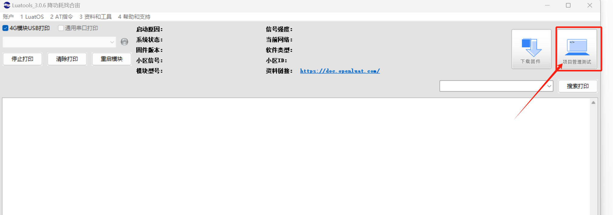

## 一、FTP 概述

FTP（File Transfer Protocol，文件传输协议） 是 TCP/IP 协议组中的协议之一。FTP 协议包括两个组成部分，其一为 FTP 服务器，其二为 FTP 客户端。其中 FTP 服务器用来存储文件，用户可以使用 FTP 客户端通过 FTP 协议访问位于 FTP 服务器上的资源。在开发网站的时候，通常利用 FTP 协议把网页或程序传到 Web 服务器上。此外，由于 FTP 传输效率非常高，在网络上传输大的文件时，一般也采用该协议。

默认情况下 FTP 协议使用 TCP 端口中的 20 和 21 这两个端口，其中 20 用于传输数据，21 用于传输控制信息。但是，是否使用 20 作为传输数据的端口与 FTP 使用的传输模式有关，如果采用主动模式，那么数据传输端口就是 20；如果采用被动模式，则具体最终使用哪个端口要服务器端和客户端协商决定。

关于 FTP 更详细的理论知识说明，请参考:[https://blog.csdn.net/HinsCoder/article/details/130911658](https://blog.csdn.net/HinsCoder/article/details/130911658)

## 二、演示功能概述

本文教你合宙 4G 模组使用 LuatOS 开发 4G 通信中 ftp 网络协网络协议的应用.

本教程实现的功能定义是：

使用 Air780E 核心板下载 Air780 的 LuatOS 示例代码中 ftp 的例程进行验证,例程流程为:

1. 登录 FTP 服务器
2. 用 ftp.command 操作 ftp 服务器目录
3. ftp.pull 下载文件
4. ftp.push 上传文件
5. FTP 客户端关闭

## 三、硬件环境

### 3.1 Air780E 核心板

使用 Air780E 核心板，如下图所示：


淘宝购买链接：[Air780E 核心板淘宝购买链接](https://item.taobao.com/item.htm?id=693774140934&pisk=f1eiwOqL25l1_HYiV6D1ize3wN5d5FMjRrpxkx3VT2uIHCCskWm4kysffAEqor4KRRIskGT0ooqi_coq7DWE000qbVr2mmzKQjNtkV3mnoalvaBRelZshA7RyTFdpD4xQco2_VS2Tcnvc89h5lZshq-pu_FUfEDVVdOmgrkET0ir3mkq_MDEmmM2QjJaY2uI0UGAoNueWRjiw4YTC-_opNr-zluaXleFpfR_X2fhTJVn94W--KJ4KcqQreCDEs3zNVh-DyWpIxqEmyc8savgoor7gX2D7GUzmW4jBJS2_4PTWjestFRZqA0iaRlwjdkIgW2nBR7XNkEn7bDL96_tMA4gN4GNOwa0xVU4IX8G4iReapZyhDSYLIOj_DinyhbSB2IHjbEhxMA51foIXaIhxItMPKJlyMjHNEGZAcQR.&spm=a1z10.5-c-s.w4002-24045920841.33.639f1fd1YrS4b6&skuId=5098266470883) ；

此核心板的详细使用说明参考：[Air780E 产品手册](https://docs.openluat.com/air780e/product/) 中的 << 开发板 Core_Air780E 使用说明 VX.X.X.pdf>>，写这篇文章时最新版本的使用说明为：开发板 Core_Air780E 使用说明 V1.0.5.pdf ；核心板使用过程中遇到任何问题，可以直接参考这份使用说明 pdf 文档。

### 3.2 SIM 卡

中国大陆环境下，可以上网的 sim 卡,一般来说，使用移动，电信，联通的物联网卡或者手机卡都行；

### 3.3 PC 电脑

WINDOWS 系统，其他暂无特别要求；

### 3.4 数据通信线

USB 数据线，暂无特别要求；

## 四、软件环境

### 4.1 Luatools 工具

要想烧录 LuatOS固件到 4G 模组中，需要用到合宙的强大的调试工具：Luatools；

详细使用说明参考：[Luatools 工具使用说明](https://docs.openluat.com/Luatools/) 。

Luatools 工具集具备以下几大核心功能：

- 一键获取最新固件：自动连接合宙服务器，轻松下载最新的合宙模组固件。
- 固件与脚本烧录：便捷地将固件及脚本文件烧录至目标模组中。
- 串口日志管理：实时查看模组通过串口输出的日志信息，并支持保存功能。
- 串口调试助手：提供简洁的串口调试界面，满足基本的串口通信测试需求。

Luatools 下载之后， 无需安装， 解压到你的硬盘，点击 Luatools_v3.exe 运行，出现如下界面，就代表 Luatools 安装成功了.

### 4.2 准备需要烧录的代码

首先要说明一点： 脚本代码， 要和固件的 soc 文件一起烧录。

#### 4.2.1 **烧录的底层固件文件**

底层 core 下载地址：[LuatOS 固件版本下载地址](https://docs.openluat.com/air780e/luatos/firmware/)


Air780E 的底层固件在 Luatools 解压后目录的 **LuatOS-SoC_V1112_EC618_FULL.soc**


#### 4.2.2 **烧录的脚本代码**

首先要下载 Air780 的 LuatOS 示例代码到一个合适的项目目录,示例代码网站: [https://gitee.com/openLuat/LuatOS-Air780E](https://gitee.com/openLuat/LuatOS-Air780E)

下载流程参考下图:


下载的文件解压,找到 LuatOS-Air780E-master\demo\ftp\main.lua,如图:


### 4.3 烧录步骤

#### 4.3.1 **正确连接电脑和 4G 模组电路板**

使用带有数据通信功能的数据线，不要使用仅有充电功能的数据线；

#### 4.3.2 **识别 4G 模组的 boot 引脚**

在下载之前，要用模组的 boot 引脚触发下载， 也就是说，要把 4G 模组的 boot 引脚拉到 1.8v，或者直接把 boot 引脚和 VDD_EXT 引脚相连。我们要在按下 BOOT 按键时让模块开机，就可以进入下载模式了。

具体到 Air780E 开发板:

1、当我们模块没开机时，按着 BOOT 键然后长按 PWR 开机。

2、当我们模块开机时，按着 BOOT 键然后点按重启键即可。


#### 4.3.3 **识别电脑的正确端口**

判断是否进入 BOOT 模式：模块上电，此时在电脑的设备管理器中，查看串口设备， 会出现一个端口表示进入了 boot 下载模式，如下图所示：


当设备管理器出现了 3 个连续数字的 com 端口，这时候， 硬件连接上就绪状态，恭喜你，可以进行烧录了！

#### 4.3.4 用 Luatools 工具烧录

- 新建项目

首先，确保你的 Luatools 的版本，大于等于 3.0.6 版本的。

在 Luatools 的左上角上有版本显示的，如图所示：


Luatools 版本没问题的话， 就点击 LuaTOols 右上角的“项目管理测试”按钮，如下图所示：



这时会弹出项目管理和烧录管理的对话框，可以新建一个项目,如下图：


- 开始烧录

选择 780E 板子对应的底层 core 和刚改的 main.lua 脚本文件。下载到板子中。


点击下载后，我们需要进入 boot 模式才能正常下载。


如果没进入 boot 模式会出现下图情况:


当我们模块没开机时，按着 BOOT 键然后长按 PWR 开机,进入下载。

当我们模块开机时，按着 BOOT 键然后点按重启键即可。可以进入下载,如图:


## 五、API 说明

### 5.1 ftp.login(adapter,ip_addr,port,username,password)

FTP 客户端

**参数**

| **传入值类型**<br/> | **解释**<br/>                                                                                                                                                                                                                      |
| ------------------- | ---------------------------------------------------------------------------------------------------------------------------------------------------------------------------------------------------------------------------------- |
| int<br/>            | 适配器序号, 只能是 socket.ETH0, socket.STA, socket.AP,如果不填,会选择平台自带的方式,然后是最后一个注册的适配器<br/>                                                                                                                |
| string<br/>         | ip_addr 地址<br/>                                                                                                                                                                                                                  |
| string<br/>         | port 端口,默认 21<br/>                                                                                                                                                                                                             |
| string<br/>         | username 用户名<br/>                                                                                                                                                                                                               |
| string<br/>         | password 密码<br/>                                                                                                                                                                                                                 |
| bool/table<br/>     | 是否为 ssl 加密连接,默认不加密,true 为无证书最简单的加密，table 为有证书的加密<br/>server_cert 服务器 ca 证书数据<br/>client_cert 客户端 ca 证书数据<br/>client_key 客户端私钥加密数据<br/>client_password 客户端私钥口令数据<br/> |

**返回值**

| **返回值类型**<br/> | **解释**<br/>                      |
| ------------------- | ---------------------------------- |
| bool/string<br/>    | 成功返回 true 失败返回 string<br/> |

**例子**

ftp_login = ftp.login(nil,"xxx")

---

### 5.2 ftp.command(cmd)

FTP 命令

**参数**

| **传入值类型**<br/> | **解释**<br/>                                                        |
| ------------------- | -------------------------------------------------------------------- |
| string<br/>         | cmd 命令 目前支持:NOOP SYST TYPE PWD MKD CWD CDUP RMD DELE LIST<br/> |

**返回值**

| **返回值类型**<br/> | **解释**<br/>                      |
| ------------------- | ---------------------------------- |
| string<br/>         | 成功返回 true 失败返回 string<br/> |

**例子**

// 空操作，防止连接断掉

print(ftp.command("NOOP").wait())

// 报告远程系统的操作系统类型

print(ftp.command("SYST").wait())

// 指定文件类型

print(ftp.command("TYPE I").wait())

// 显示当前工作目录名

print(ftp.command("PWD").wait())

// 创建目录

print(ftp.command("MKD QWER").wait())

// 改变当前工作目录

print(ftp.command("CWD /QWER").wait())

// 返回上一层目录

print(ftp.command("CDUP").wait())

// 删除目录

print(ftp.command("RMD QWER").wait())

// 获取当前工作目录下的文件名列表

print(ftp.command("LIST").wait())

// 删除文件

print(ftp.command("DELE /1/12222.txt").wait())

---

### 5.3 ftp.pull(local_name,remote_name)

FTP 文件下载

**参数**

| **传入值类型**<br/> | **解释**<br/>               |
| ------------------- | --------------------------- |
| string<br/>         | local_name 本地文件<br/>    |
| string<br/>         | remote_name 服务器文件<br/> |

**返回值**

| **返回值类型**<br/> | **解释**<br/>                      |
| ------------------- | ---------------------------------- |
| bool/string<br/>    | 成功返回 true 失败返回 string<br/> |

**例子**

ftp.pull("/1222.txt","/1222.txt").wait()

---

### 5.4 ftp.push(local_name,remote_name)

FTP 文件上传

**参数**

| **传入值类型**<br/> | **解释**<br/>               |
| ------------------- | --------------------------- |
| string<br/>         | local_name 本地文件<br/>    |
| string<br/>         | remote_name 服务器文件<br/> |

**返回值**

| **返回值类型**<br/> | **解释**<br/>                      |
| ------------------- | ---------------------------------- |
| bool/string<br/>    | 成功返回 true 失败返回 string<br/> |

**例子**

ftp.push("/1222.txt","/1222.txt").wait()

---

### 5.5 ftp.close()

FTP 客户端关闭

**参数**

无

**返回值**

| **返回值类型**<br/> | **解释**<br/>                      |
| ------------------- | ---------------------------------- |
| bool/string<br/>    | 成功返回 true 失败返回 string<br/> |

**例子**

ftp.close().wait()

---

### 5.6 ftp.debug(onoff)

配置是否打开 debug 信息

**参数**

| **传入值类型**<br/> | **解释**<br/>            |
| ------------------- | ------------------------ |
| boolean<br/>        | 是否打开 debug 开关<br/> |

**返回值**

| **返回值类型**<br/> | **解释**<br/> |
| ------------------- | ------------- |
| nil<br/>            | 无返回值<br/> |

**例子**

无

## 六、实现流程

- 打开 FTP 服务器。记录地址，端口号，用户名，密码等必要信息。
- 改 DEMO，将登录中的地址，端口号，用户名，密码等必要信息修改为自己服务器的。
- 登录 ftp 服务器(ftp 服务器用 vsftpd)
- 等待登录成功
- 执行自己的命令

### 6.1 例程

示例代码如下( [点此链接查看 ftp 的 demo 例子](https://gitee.com/openLuat/LuatOS-Air780E/tree/master/demo/ftp))

```lua
-- LuaTools需要PROJECT和VERSION这两个信息
PROJECT = "ftpdemo"
VERSION = "1.0.0"

--[[
本demo需要ftp库, 大部分能联网的设备都具有这个库
ftp也是内置库, 无需require
]]

-- sys库是标配
_G.sys = require("sys")
--[[特别注意, 使用ftp库需要下列语句]]
_G.sysplus = require("sysplus")

sys.taskInit(function()
    -----------------------------
    -- 统一联网函数, 可自行删减
    ----------------------------
    if wlan and wlan.connect then
        -- wifi 联网, ESP32系列均支持
        local ssid = "luatos1234"
        local password = "12341234"
        log.info("wifi", ssid, password)
        -- TODO 改成esptouch配网
        -- LED = gpio.setup(12, 0, gpio.PULLUP)
        wlan.init()
        wlan.setMode(wlan.STATION)
        wlan.connect(ssid, password, 1)
        local result, data = sys.waitUntil("IP_READY", 30000)
        log.info("wlan", "IP_READY", result, data)
        device_id = wlan.getMac()
        -- TODO 获取mac地址作为device_id
    elseif mobile then
        -- Air780E/Air600E系列
        --mobile.simid(2)
        -- LED = gpio.setup(27, 0, gpio.PULLUP)
        device_id = mobile.imei()
        sys.waitUntil("IP_READY", 30000)
    end

    -- -- 打印一下支持的加密套件, 通常来说, 固件已包含常见的99%的加密套件
    -- if crypto.cipher_suites then
    --     log.info("cipher", "suites", json.encode(crypto.cipher_suites()))
    -- end
    while true do
        sys.wait(1000)
        log.info("ftp 启动")
        --
        print(ftp.login(nil,"121.43.224.154",21,"ftp_user","3QujbiMG").wait())
        --   空操作，防止连接断掉
        print(ftp.command("NOOP").wait())
        -- 报告远程系统的操作系统类型
        print(ftp.command("SYST").wait())

        print(ftp.command("TYPE I").wait())
       -- print("ftp ",ftp.pwd(30))
        print(ftp.command("PWD").wait())
        print(ftp.command("MKD QWER").wait())
        print(ftp.command("CWD /QWER").wait())

        print(ftp.command("CDUP").wait())
        print(ftp.command("RMD QWER").wait())

        print(ftp.command("LIST").wait())
        -- io.writeFile("/1222.txt", "23noianfdiasfhnpqw39fhawe;fuibnnpw3fheaios;fna;osfhisao;fadsfl")
        -- print(ftp.push("/1222.txt","/12222.txt").wait())

        print(ftp.pull("/122224.txt","/122224.txt").wait())

        local f = io.open("/122224.txt", "r")
        if f then
            local data = f:read("*a")
            f:close()
            log.info("fs", "writed data", data)
        else
            log.info("fs", "open file for read failed")
        end

        print(ftp.command("DELE /12222.txt").wait())
        print(ftp.push("/122224.txt","/12222.txt").wait())
        print(ftp.close().wait())
        log.info("meminfo", rtos.meminfo("sys"))
        sys.wait(15000)
    end


end)
-- 用户代码已结束---------------------------------------------
-- 结尾总是这一句
sys.run()
-- sys.run()之后后面不要加任何语句!!!!!
```

### 6.2 例程 log

```
[2024-10-12 20:12:07.345][000000000.009] am_service_init 851:Air780E_A17
[2024-10-12 20:12:07.346][000000000.025] Uart_BaseInitEx 1049:uart 0 rx cache 256 dma 256
[2024-10-12 20:12:07.348][000000000.235] self_info 122:model Air780E_A17 imei 868327075469021
[2024-10-12 20:12:07.349][000000000.236] I/pm poweron: Power/Reset
[2024-10-12 20:12:07.350][000000000.237] I/main LuatOS@EC618 base 23.11 bsp V1112 32bit
[2024-10-12 20:12:07.351][000000000.237] I/main ROM Build: Sep  3 2024 15:55:27
[2024-10-12 20:12:07.352][000000000.244] D/main loadlibs luavm 262136 14360 14392
[2024-10-12 20:12:07.353][000000000.244] D/main loadlibs sys   277872 53984 81264
[2024-10-12 20:12:12.856][000000005.906] D/mobile cid1, state0
[2024-10-12 20:12:12.858][000000005.908] D/mobile bearer act 0, result 0
[2024-10-12 20:12:12.859][000000005.951] D/mobile TIME_SYNC 0
[2024-10-12 20:12:12.862][000000005.956] D/mobile NETIF_LINK_ON -> IP_READY
[2024-10-12 20:12:13.859][000000006.959] I/user.ftp 启动
[2024-10-12 20:12:14.951][000000008.057] true
[2024-10-12 20:12:15.029][000000008.136] 200 NOOP ok.

[2024-10-12 20:12:15.090][000000008.196] 215 UNIX Type: L8

[2024-10-12 20:12:15.183][000000008.282] 200 Switching to Binary mode.

[2024-10-12 20:12:15.246][000000008.356] 257 "/"

[2024-10-12 20:12:15.339][000000008.442] 257 "/QWER" created

[2024-10-12 20:12:15.418][000000008.517] 250 Directory successfully changed.

[2024-10-12 20:12:15.495][000000008.596] 250 Directory successfully changed.

[2024-10-12 20:12:15.572][000000008.682] 250 Remove directory operation successful.

[2024-10-12 20:12:15.975][000000009.078] -rw-------    1 ftp      ftp          2918 Jul 22 07:18 1.amr
-rw-------    1 ftp      ftp            62 Jul 22 04:09 1.txt
-rw-------    1 ftp      ftp            13 Aug 12 03:13 111222.txt
-rw-------    1 ftp      ftp             7 Aug 09 09:12 1222.txt
-rw-------    1 ftp      ftp            62 Jul 23 02:34 12221.txt
-rw-------    1 ftp      ftp            62 Jul 22 06:07 122210.txt
-rw-------    1 ftp      ftp            62 Jul 22 06:08 122211.txt
-rw-------    1 ftp      ftp            62 Jul 22 06:09 122212.txt
-rw-------    1 ftp      ftp            62 Jul 22 06:10 122213.txt
-rw-------    1 ftp      ftp            62 Jul 22 06:10 122214.txt
-rw-------    1 ftp      ftp            62 Jul 22 04:27 122215.txt
-rw-------    1 ftp      ftp            62 Jul 22 04:27 122216.txt
-rw-------    1 ftp      ftp            62 Jul 22 04:28 122217.txt
-rw-------    1 ftp      ftp            62 Jul 22 04:29 122218.txt
-rw-------    1 ftp      ftp            62 Jul 22 04:30 122219.txt
-rw-------    1 ftp      ftp            62 Oct 12 11:17 12222.txt
-rw-------    1 ftp      ftp            62 Jul 22 04:30 122220.txt
-rw-------    1 ftp      ftp            62 Jul 22 04:31 122221.txt
-rw-------    1 ftp      ftp            62 Jul 22 04:32 122222.txt
-rw-------    1 ftp      ftp            62 Jul 22 04:33 122223.txt
-rw-------    1 ftp      ftp            62 Jul 22 04:34 122224.txt
-rw-------    1 ftp      ftp            62 Jul 22 04:34 122225.txt
-rw-------    1 ftp      ftp            62 Jul 22 04:35 122226.txt
-rw-------    1 ftp      ftp            62 Jul 22 04:36 122227.txt
-rw-------    1 ftp      ftp            62 Jul 22 04:37 122228.txt
-rw-------    1 ftp      ftp            62 Jul 22 04:38 122229.txt
-rw-------    1 ftp      ftp            62 Jul 22 06:02 12223.txt
-rw-------    1 ftp      ftp            62 Jul 22 04:38 122230.txt
-rw-------    1 ftp      ftp            62 Jul 22 04:39 122231.txt
-rw-------    1 ftp      ftp            62 Jul 22 04:40 122232.txt
-rw-------    1 ftp      ftp            62 Jul 22 04:41 122233.txt
-rw-------    1 ftp      ftp            62 Jul 22 04:41 122234.txt
-rw-------    1 ftp      ftp            62 Jul 22 04:42 122235.txt
-rw-------    1 ftp      ftp            62 Jul 22 04:43 122236.txt
-rw-------    1 ftp      ftp            62 Jul 22 04:44 122237.txt
-rw-------    1 ftp      ftp            62 Jul 22 04:45 122238.txt
-rw-------    1 ftp      ftp            62 Jul 22 04:45 122239.txt
-rw-------    1 ftp      ftp            62 Jul 22 06:03 12224.txt
-rw-------    1 ftp      ftp            62 Jul 22 04:46 122240.txt
-rw-------    1 ftp      ftp            62 Jul 22 04:47 122241.txt
-rw-------    1 ftp      ftp            62 Jul 22 04:48 122242.txt
-rw-------    1 ftp      ftp            62 Jul 22 04:49 122243.txt
-rw-------    1 ftp      ftp            62 Jul 22 04:49 122244.txt
-rw-------    1 ftp      ftp            62 Jul 22 04:50 122245.txt
-rw-------    1 ftp      ftp            62 Jul 22 04:51 122246.txt
-rw-------    1 ftp      ftp            62 Jul 22 04:52 122247.txt
-rw-------    1 ftp      ftp            62 Jul 22 04:52 122248.txt
-rw-------    1 ftp      ftp            62 Jul 22 04:53 122249.txt
-rw-------    1 ftp      ftp            62 Jul 22 06:03 12225.txt
-rw-------    1 ftp      ftp            62 Jul 22 04:54 122250.txt
-rw-------    1 ftp      ftp            62 Jul 22 04:55 122251.txt
-rw-------    1 ftp      ftp            62 Jul 22 04:56 122252.txt
-rw-------    1 ftp      ftp            62 Jul 22 04:56 122253.txt
-rw-------    1 ftp      ftp            62 Jul 22 04:57 122254.txt
-rw-------    1 ftp      ftp            62 Jul 22 04:58 122255.txt
-rw-------    1 ftp      ftp            62 Jul 22 04:59 122256.txt
-rw-------    1 ftp      ftp            62 Jul 22 05:00 122257.txt
-rw-------    1 ftp      ftp            62 Jul 22 05:00 122258.txt
-rw-------    1 ftp      ftp            62 Jul 22 05:01 122259.txt
-rw-------    1 ftp      ftp            62 Jul 22 06:04 12226.txt
-rw-------    1 ftp      ftp            62 Jul 22 05:02 122260.txt
-rw-------    1 ftp      ftp            62 Jul 22 05:03 122261.txt
-rw-------    1 ftp      ftp            62 Jul 22 05:03 122262.txt
-rw-------    1 ftp      ftp            62 Jul 22 05:04 122263.txt
-rw-------    1 ftp      ftp            62 Jul 22 05:05 122264.txt
-rw-------    1 ftp      ftp            62 Jul 22 05:06 122265.txt
-rw-------    1 ftp      ftp            62 Jul 22 05:07 122266.txt
-rw-------    1 ftp      ftp            62 Jul 22 05:07 122267.txt
-rw-------    1 ftp      ftp            62 Jul 22 05:08 122268.txt
-rw-------    1 ftp      ftp            62 Jul 22 05:09 122269.txt
-rw-------    1 ftp      ftp            62 Jul 22 06:05 12227.txt
-rw-------    1 ftp      ftp            62 Jul 22 06:06 12228.txt
-rw-------    1 ftp      ftp            62 Jul 22 06:07 12229.txt
-rw-------    1 ftp      ftp            62 Jul 22 04:07 2.txt
-rw-------    1 ftp      ftp            62 Jul 22 04:08 3.txt
drwx------    2 ftp      ftp          4096 Sep 21 12:43 MT_T
drwx------    2 ftp      ftp          4096 Aug 14 07:24 OWER
-rw-------    1 ftp      ftp            12 Aug 09 09:20 TEST8861.txt
-rw-------    1 ftp      ftp             0 Aug 12 06:46 TEST_80.txt
drwx------    3 ftp      ftp          4096 Aug 08 02:11 Test
-rw-------    1 ftp      ftp          1038 Jul 23 12:39 ftp_record.amr
drwx------    4 ftp      ftp          4096 Jul 29 09:39 home
-rw-------    1 ftp      ftp         59285 Aug 14 07:29 test.jpg
-rw-------    1 ftp      ftp          3617 Aug 14 06:51 yunshanfu.jpg

[2024-10-12 20:12:16.454][000000009.560] true
[2024-10-12 20:12:16.469][000000009.569] I/user.fs        writed data        23noianfdiasfhnpqw39fhawe;fuibnnpw3fheaios;fna;osfhisao;fadsfl
[2024-10-12 20:12:16.533][000000009.642] 250 Delete operation successful.

[2024-10-12 20:12:17.327][000000010.437] true
[2024-10-12 20:12:17.420][000000010.523] 221 Goodbye.

[2024-10-12 20:12:17.426][000000010.524] I/user.meminfo        277872        65260        114032
```

## 七、总结

本文档主要介绍 4G 通信中 FTP 通信的应用。结合例程讲解了 FTP 基本原理，介绍了 FTP 主要 API,旨在最简单的上手 Air780 的 LuatOS 的 FTP 开发。

## 八、常见问题

### 8.1 关于不支持主动模式：

模块 ftp 默认是被动模式，不支持主动模式，无法设置主动模式，公网下要想模块正常连接服务器，服务器肯定不能设置为主动模式，否则哪家模块都不能用。

### 8.2 ftp 服务器用 vsftpd

ftp 的服务器用 vsftpd。

## 给读者的话

> 本篇文章由公帅开发；
>
> 本篇文章描述的内容，如果有错误、细节缺失、细节不清晰或者其他任何问题，总之就是无法解决您遇到的问题；
>
> 请登录[合宙技术交流论坛](https://chat.openluat.com/)，点击[文档找错赢奖金-Air780E-LuatOS-软件指南-网络驱动-FTP通信](https://chat.openluat.com/#/page/matter?125=1846740522316726274&126=%E6%96%87%E6%A1%A3%E6%89%BE%E9%94%99%E8%B5%A2%E5%A5%96%E9%87%91-Air780E-LuatOS-%E8%BD%AF%E4%BB%B6%E6%8C%87%E5%8D%97-%E7%BD%91%E7%BB%9C%E9%A9%B1%E5%8A%A8-FTP%E9%80%9A%E4%BF%A1&askid=1846740522316726274)；
>
> 用截图标注+文字描述的方式跟帖回复，记录清楚您发现的问题；
>
> 我们会迅速核实并且修改文档；
>
> 同时也会为您累计找错积分，您还可能赢取月度找错奖金！
