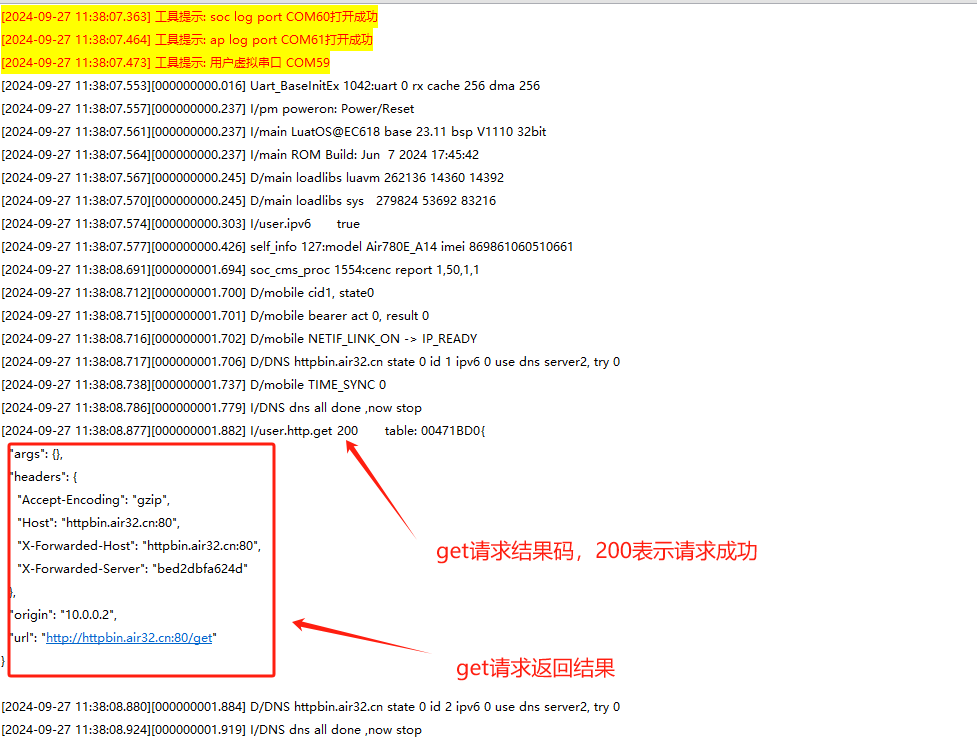

# 基本用法

本文通过demo演示来说明本章节内容的基本用法。

## 文档和工具

- mobile接口文档:[http](https://wiki.luatos.com/api/http.html)
- 780E模块软件包:[LuatOS 发行版](https://gitee.com/openLuat/LuatOS/releases)
- 本示例所烧录的固件版本:**LuatOS-SoC_V1112_EC618_FULL.soc**
- 本示例所烧录的脚本:[demo/http/main.lua · 合宙Luat/LuatOS - 码云 - 开源中国 (gitee.com)](https://gitee.com/openLuat/LuatOS/blob/master/demo/http/main.lua)
- 如果不会烧录,可参考 [烧录教程](https://doc.openluat.com/wiki/21?wiki_page_id=6072)

## HTTP协议

1. 简介

            HTTP是Hyper Text Transfer Protocol（超文本传输协议）的缩写。HTTP是一个应用层协议,由请求和响应构成,是一个标准的客户端服务器模型。HTTP是一个无状态的协议。HTTP协议通常承载于TCP协议之上,有时也承载于TLS或SSL协议层之上,这个时候,就成了我们常说的HTTPS,所以HTTPS相关的指令只需要参考SSL部分配置连接,其他和http都是一样的。

    HTTP 协议的*主要应用场景*有:基于浏览器的网页获取与表单提交、文件上传与下载、移动应用、物联网设备的数据上报等。

2. HTTP请求和响应报文

    **请求报文**

    

    method:请求方法,GET和POST是最常见的HTTP方法。

    URL:为请求对应的URL地址,它和报文头的 Host 属性组成完整的请求 URL。

    Version:协议名称及版本号。

    Header lines:HTTP 的报文头,报文头包含若干个属性,格式为“属性名:属性值”,服务端据此获取客户端的信息。

    Entity body:是报文体，它将一个页面表单中的组件值通过 param1=value1&m2=value2 的键值对形式编码成一个格式化串，它承载多个请求参数的数据。

    *请求报文示例如下：*

    

    **响应报文**

    

    version:报文协议及版本。

    status code:状态码及状态描述。

    phrase:原因短语。

    Header lines:响应报文头。

    Entity body:响应报文体，即我们真正要的内容。

    *响应报文示例如下：*

    

        注意:sp表示空格，cr lf表示回车换行，报文头和报文体之间要有一行空格

3. HTTP请求方法

    HTTP客户端发出请求，告知服务端需要执行不同类型的请求命令，这些命令被称为HTTP方法。

    | 方法 | 描述 |
    |:------:|:--------:|
    | GET  | 获取资源    |
    | POST  | 传输实体数据    |
    | HEAD  | 获取头部报文    |
    | PUT  | 传输文件    |
    | DELETE  | 删除指定资源   |

3. HTTP状态码

    HTTP 状态码由三个十进制数字组成，第一个十进制数字定义了状态 码的类型。响应分为五类：

    1.信息响应(100–199)，

    2.成功响应(200–299)，

    3.重定向，需要进一步操作(300–399)，

    4.客户端错误(400–499)

    5.服务器错误(500–599)：

    具体如下：

    |分类 |描述 |
    |:-----:|:--------:|
    | 1xx  | 信息响应中，服务器收到请求，需要请求者继续执行操作    |
    | 2xx  | 信息响应成功，操作被成功接收并处理    |
    | 3xx  | 信息需要被重新定向，需要进一步的操作以完成请求    |
    | 4xx  | 客户端错误，请求包含语法错误或无法完成请求    |
    | 5xx  | 服务器错误，服务器在处理请求的过程中发生了错误   |


## api介绍
 http客户端：

**http.request(method,url,headers,body,opts,ca_file,client_ca, client_key, client_password)**

创建HTTP客户端

```lua
-- 使用http库,需要引入sysplus库, 且需要在task内使用
require "sys"
require "sysplus"

sys.taskInit(function()
    sys.wait(1000)
    local code,headers,body = http.request("GET","http://www.example.com/abc").wait()
    log.info("http",code,body)
end)
--[[
返回码code报错信息列表:
-1 HTTP_ERROR_STATE 错误的状态, 一般是底层异常,请报issue
-2 HTTP_ERROR_HEADER 错误的响应头部, 通常是服务器问题
-3 HTTP_ERROR_BODY 错误的响应体,通常是服务器问题
-4 HTTP_ERROR_CONNECT 连接服务器失败, 未联网,地址错误,域名错误
-5 HTTP_ERROR_CLOSE 提前断开了连接, 网络或服务器问题
-6 HTTP_ERROR_RX 接收数据报错, 网络问题
-7 HTTP_ERROR_DOWNLOAD 下载文件过程报错, 网络问题或下载路径问题
-8 HTTP_ERROR_TIMEOUT 超时, 包括连接超时,读取数据超时
-9 HTTP_ERROR_FOTA fota功能报错,通常是更新包不合法
]]
```

## 示例
```lua

-- sys库是标配
_G.sys = require("sys")
--[[特别注意, 使用http库需要下列语句]]
_G.sysplus = require("sysplus")
sys.taskInit(function()
    -----------------------------
    -- 统一联网函数, 可自行删减
    ----------------------------
    if mobile then
        -- Air780E/Air600E系列
        --mobile.simid(2)
        -- LED = gpio.setup(27, 0, gpio.PULLUP)
        device_id = mobile.imei()
        log.info("ipv6", mobile.ipv6(true))
        sys.waitUntil("IP_READY", 30000)
    elseif http then
        sys.waitUntil("IP_READY")
    else
        while 1 do
            sys.wait(1000)
            log.info("http", "当前固件未包含http库")
        end
    end
    sys.publish("net_ready")
end)
function test_http()
    -- GET请求
    local code, headers, body = http.request("GET", "http://httpbin.air32.cn/get").wait()
    log.info("http.get", code, headers, body)
    -- POST请求
    local code, headers, body = http.request("POST", "http://httpbin.air32.cn/post", {}, "abc=123").wait()
    log.info("http.post", code, headers, body)
end

sys.taskInit(function()
    sys.wait(100)
    -- 打印一下支持的加密套件, 通常来说, 固件已包含常见的99%的加密套件
    -- if crypto.cipher_suites then
    --     log.info("cipher", "suites", json.encode(crypto.cipher_suites()))
    -- end

    -------- HTTP 演示代码 --------------
    sys.waitUntil("net_ready") -- 等联网
    while 1 do
        test_http()
        sys.wait(1000)
        -- 打印一下内存状态
        log.info("sys", rtos.meminfo("sys"))
        log.info("lua", rtos.meminfo("lua"))
        sys.wait(600000)
    end
end)
```

## 对应log

例子中get请求结果



例子中post请求结果

