## 一、HTTP 概述

### 1.1 简介

HTTP 是 Hyper Text Transfer Protocol（超文本传输协议）的缩写。HTTP 是一个应用层协议,由请求和响应构成,是一个标准的客户端服务器模型。HTTP 是一个无状态的协议。HTTP 协议通常承载于 TCP 协议之上,有时也承载于 TLS 或 SSL 协议层之上,这个时候,就成了我们常说的 HTTPS,所以 HTTPS 相关的指令只需要参考 SSL 部分配置连接,其他和 http 都是一样的。

HTTP 协议的_主要应用场景_有:基于浏览器的网页获取与表单提交、文件上传与下载、移动应用、物联网设备的数据上报等。

### 1.2 **请求报文**

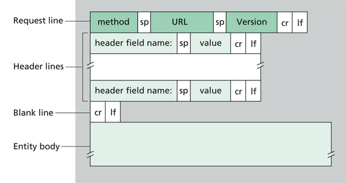

1. method:请求方法,GET 和 POST 是最常见的 HTTP 方法。
2. URL:为请求对应的 URL 地址,它和报文头的 Host 属性组成完整的请求 URL。
3. Version:协议名称及版本号。
4. Header lines:HTTP 的报文头,报文头包含若干个属性,格式为“属性名:属性值”,服务端据此获取客户端的信息。
5. Entity body:是报文体，它将一个页面表单中的组件值通过 param1=value1&m2=value2 的键值对形式编码成一个格式化串，它承载多个请求参数的数据。
6. _请求报文示例如下：_

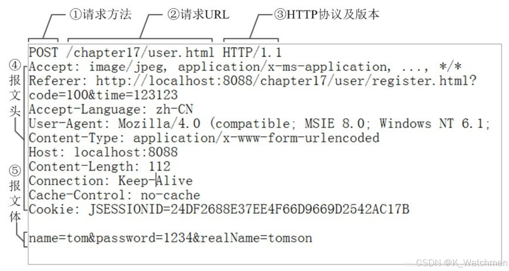

### 1.3 **响应报文**


1. version:报文协议及版本。
2. status code:状态码及状态描述。
3. phrase:原因短语。
4. Header lines:响应报文头。
5. Entity body:响应报文体，即我们真正要的内容。
6. _响应报文示例如下：_

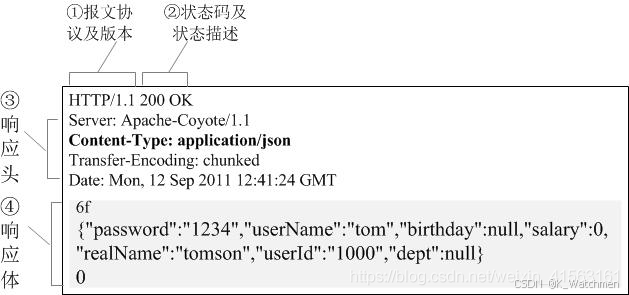

注意:sp 表示空格，cr lf 表示回车换行，报文头和报文体之间要有一行空格

### 1.4 HTTP 请求方法

HTTP 客户端发出请求，告知服务端需要执行不同类型的请求命令，这些命令被称为 HTTP 方法。

1. GET:获取资源方法
2. POST:传输实体数据方法
3. HEAD:获取头部报文方法
4. PUT:传输文件方法
5. DELETE:删除指定资源方法

### 1.5 HTTP 状态码

HTTP 状态码由三个十进制数字组成，第一个十进制数字定义了状态 码的类型。响应分为五类：

1. 信息响应(100–199)，信息响应中，服务器收到请求，需要请求者继续执行操作
2. 成功响应(200–299)，信息响应成功，操作被成功接收并处理
3. 重定向，需要进一步操作(300–399)，信息需要被重新定向，需要进一步的操作以完成请求
4. 客户端错误(400–499),客户端错误，请求包含语法错误或无法完成请求
5. 服务器错误(500–599),服务器错误，服务器在处理请求的过程中发生了错误

## 二、演示功能概述

本文教你合宙 4G 模组使用 LuatOS 开发 4G 通信中 http 网络协议的应用，实现模组和服务器之间数据的传输！

本教程实现的功能定义是：

使用 Air780E 核心板下载 Air780 的 LuatOS 示例代码中 http 的例程进行验证,包含 get 请求,post 请求,文件上传,文件下载等功能.

## 三、硬件环境

### 3.1 Air780E 核心板

使用 Air780E 核心板，如下图所示：


淘宝购买链接：[Air780E 核心板淘宝购买链接](https://item.taobao.com/item.htm?id=693774140934&pisk=f1eiwOqL25l1_HYiV6D1ize3wN5d5FMjRrpxkx3VT2uIHCCskWm4kysffAEqor4KRRIskGT0ooqi_coq7DWE000qbVr2mmzKQjNtkV3mnoalvaBRelZshA7RyTFdpD4xQco2_VS2Tcnvc89h5lZshq-pu_FUfEDVVdOmgrkET0ir3mkq_MDEmmM2QjJaY2uI0UGAoNueWRjiw4YTC-_opNr-zluaXleFpfR_X2fhTJVn94W--KJ4KcqQreCDEs3zNVh-DyWpIxqEmyc8savgoor7gX2D7GUzmW4jBJS2_4PTWjestFRZqA0iaRlwjdkIgW2nBR7XNkEn7bDL96_tMA4gN4GNOwa0xVU4IX8G4iReapZyhDSYLIOj_DinyhbSB2IHjbEhxMA51foIXaIhxItMPKJlyMjHNEGZAcQR.&spm=a1z10.5-c-s.w4002-24045920841.33.639f1fd1YrS4b6&skuId=5098266470883) ；

此核心板的详细使用说明参考：[Air780E 产品手册](https://docs.openluat.com/air780e/product/) 中的 << 开发板 Core_Air780E 使用说明 VX.X.X.pdf>>，写这篇文章时最新版本的使用说明为：开发板 Core_Air780E 使用说明 V1.0.5.pdf ；核心板使用过程中遇到任何问题，可以直接参考这份使用说明 pdf 文档。

### 3.2 SIM 卡

中国大陆环境下，可以上网的 sim 卡,一般来说，使用移动，电信，联通的物联网卡或者手机卡都行；

### 3.3 PC 电脑

WINDOWS 系统，其他暂无特别要求；

### 3.4 数据通信线

USB 数据线，暂无特别要求；

## 四、软件环境

### 4.1 Luatools 工具

要想烧录 AT 固件到 4G 模组中，需要用到合宙的强大的调试工具：Luatools；

详细使用说明参考：[Luatools 工具使用说明](https://docs.openluat.com/Luatools/) 。

Luatools 工具集具备以下几大核心功能：

- 一键获取最新固件：自动连接合宙服务器，轻松下载最新的合宙模组固件。
- 固件与脚本烧录：便捷地将固件及脚本文件烧录至目标模组中。
- 串口日志管理：实时查看模组通过串口输出的日志信息，并支持保存功能。
- 串口调试助手：提供简洁的串口调试界面，满足基本的串口通信测试需求。

Luatools 下载之后， 无需安装， 解压到你的硬盘，点击 Luatools_v3.exe 运行，出现如下界面，就代表 Luatools 安装成功了.

### 4.2 准备需要烧录的代码

首先要说明一点： 脚本代码， 要和固件的 bin 文件一起烧录。

#### 4.2.1 **烧录的底层固件文件**

底层 core 下载地址：[LuatOS 固件版本下载地址](https://docs.openluat.com/air780e/luatos/firmware/)

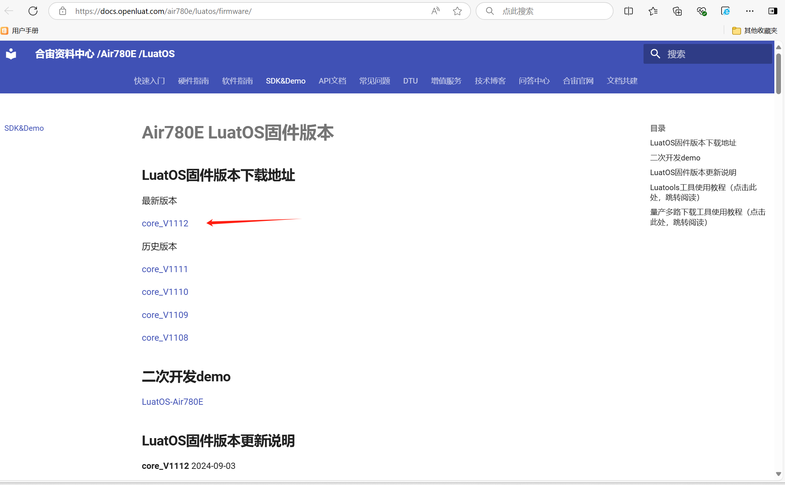

Air780E 的底层固件在 Luatools 解压后目录的 **LuatOS-SoC_V1112_EC618_FULL.soc**

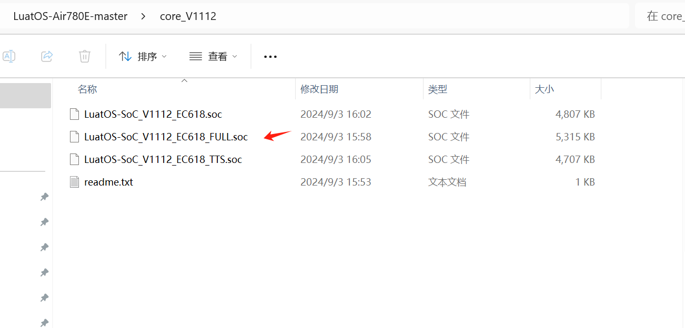

#### 4.2.2 **烧录的脚本代码**

首先要下载 Air780 的 LuatOS 示例代码到一个合适的项目目录,示例代码网站: <u>[https://gitee.com/openLuat/LuatOS-Air780E](https://gitee.com/openLuat/LuatOS-Air780E)</u>

下载流程参考下图:

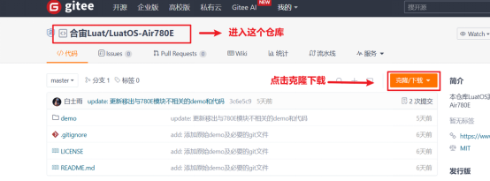


下载的文件解压,找到 LuatOS-Air780E-master\demo\http\main.lua,如图:

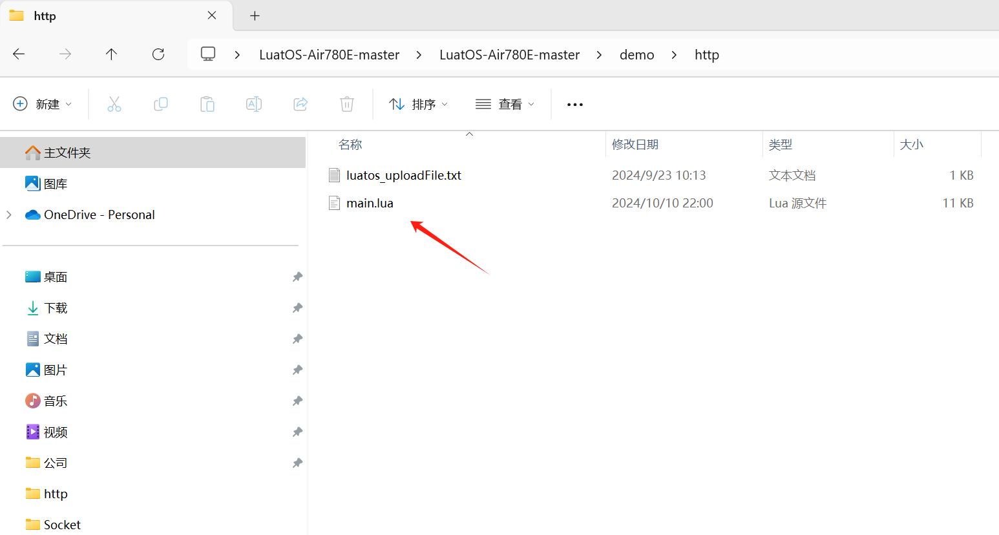

### 4.3 烧录步骤

#### 4.3.1 **正确连接电脑和 4G 模组电路板**

使用带有数据通信功能的数据线，不要使用仅有充电功能的数据线；

#### 4.3.2 **识别 4G 模组的 boot 引脚**

在下载之前，要用模组的 boot 引脚触发下载， 也就是说，要把 4G 模组的 boot 引脚拉到 1.8v，或者直接把 boot 引脚和 VDD_EXT 引脚相连。我们要在按下 BOOT 按键时让模块开机，就可以进入下载模式了。

具体到 Air780E 开发板:

1、当我们模块没开机时，按着 BOOT 键然后长按 PWR 开机。

2、当我们模块开机时，按着 BOOT 键然后点按重启键即可。


#### 4.3.3 **识别电脑的正确端口**

判断是否进入 BOOT 模式：模块上电，此时在电脑的设备管理器中，查看串口设备， 会出现一个端口表示进入了 boot 下载模式，如下图所示：


当设备管理器出现了 3 个连续数字的 com 端口，并且每个数字都大于 4，这时候， 硬件连接上就绪状态，恭喜你，可以进行烧录了！

#### 4.3.4 用 LuatOS 工具烧录

- **新建项目**

首先，确保你的 Luatools 的版本，上大于 3.0.6 版本的。

在 Luatools 的左上角上有版本显示的，如图所示：

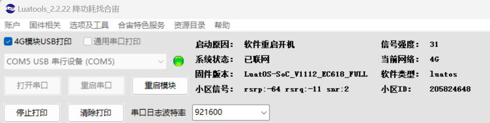

Luatools 版本没问题的话， 就点击 LuaTOols 右上角的“项目管理测试”按钮，如下图所示：

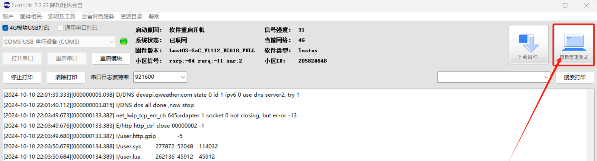

这时会弹出项目管理和烧录管理的对话框，如下图：

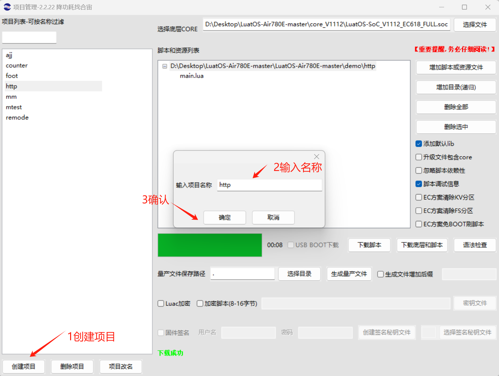

- **开始烧录**

选择 780E 板子对应的底层 core 和刚改的 main.lua 脚本文件。下载到板子中。

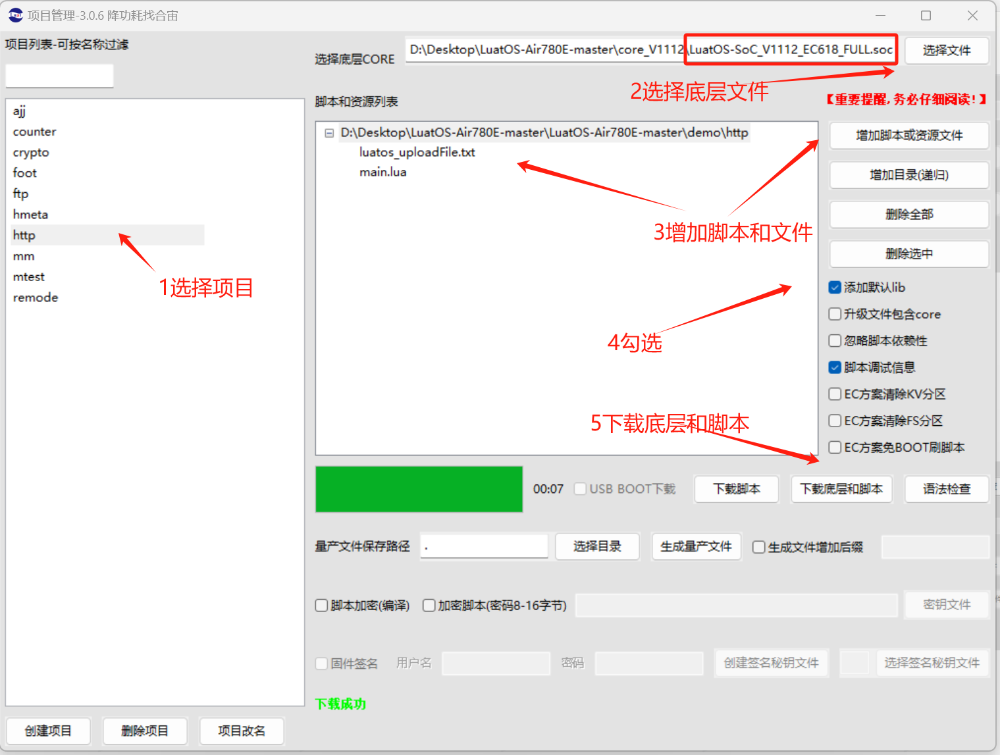

点击下载后，我们需要进入 boot 模式才能正常下载。


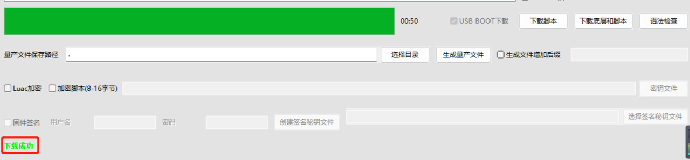

## 五、API 说明

http 客户端：

**http.request(method,url,headers,body,opts,ca_file,client_ca, client_key, client_password)**

**参数**

| **传入值类型**<br/> | **解释**<br/>                                                                                                                                                                                                                                                                                                |
| ------------------- | ------------------------------------------------------------------------------------------------------------------------------------------------------------------------------------------------------------------------------------------------------------------------------------------------------------ |
| string<br/>         | 请求方法, 支持 GET/POST 等合法的 HTTP 方法<br/>                                                                                                                                                                                                                                                              |
| string<br/>         | url 地址, 支持 http 和 https, 支持域名, 支持自定义端口<br/>                                                                                                                                                                                                                                                  |
| tabal<br/>          | 请求头 可选 例如 {[“Content-Type”] = “application/x-www-form-urlencoded”}<br/>                                                                                                                                                                                                                           |
| string/zbuff<br/>   | body 可选<br/>                                                                                                                                                                                                                                                                                               |
| table<br/>          | 额外配置 可选 包含 timeout:超时时间单位 ms 可选,默认 10 分钟,写 0 即永久等待 dst:下载路径,可选 adapter:选择使用网卡,可选 debug:是否打开 debug 信息,可选,ipv6:是否为 ipv6 默认不是,可选 callback:下载回调函数,参数 content_len:总长度 body_len:以下载长度 userdata 用户传参,可选 userdata:回调自定义传参<br/> |
| string<br/>         | 服务器 ca 证书数据, 可选, 一般不需要<br/>                                                                                                                                                                                                                                                                    |
| string<br/>         | 客户端 ca 证书数据, 可选, 一般不需要, 双向 https 认证才需要<br/>                                                                                                                                                                                                                                             |
| string<br/>         | 客户端私钥加密数据, 可选, 一般不需要, 双向 https 认证才需要<br/>                                                                                                                                                                                                                                             |
| string<br/>         | 客户端私钥口令数据, 可选, 一般不需要, 双向 https 认证才需要<br/>                                                                                                                                                                                                                                             |

**返回值**

| **返回值类型**<br/> | **解释**<br/>                                                                              |
| ------------------- | ------------------------------------------------------------------------------------------ |
| int<br/>            | code , 服务器反馈的值 >=100, 最常见的是 200.如果是底层错误,例如连接失败, 返回值小于 0<br/> |
| tabal<br/>          | headers 当 code>100 时, 代表服务器返回的头部数据<br/>                                      |
| string/int<br/>     | body 服务器响应的内容字符串,如果是下载模式, 则返回文件大小<br/>                            |

创建 HTTP 客户端

```lua
-- 使用http库,需要引入sysplus库, 且需要在task内使用
require "sys"
require "sysplus"
sys.taskInit(function()
    sys.wait(1000)
    local code,headers,body = http.request("GET","http://www.example.com/abc").wait()
    log.info("http",code,body)
end)
--[[
返回码code报错信息列表:
-1 HTTP_ERROR_STATE 错误的状态, 一般是底层异常,请报issue
-2 HTTP_ERROR_HEADER 错误的响应头部, 通常是服务器问题
-3 HTTP_ERROR_BODY 错误的响应体,通常是服务器问题
-4 HTTP_ERROR_CONNECT 连接服务器失败, 未联网,地址错误,域名错误
-5 HTTP_ERROR_CLOSE 提前断开了连接, 网络或服务器问题
-6 HTTP_ERROR_RX 接收数据报错, 网络问题
-7 HTTP_ERROR_DOWNLOAD 下载文件过程报错, 网络问题或下载路径问题
-8 HTTP_ERROR_TIMEOUT 超时, 包括连接超时,读取数据超时
-9 HTTP_ERROR_FOTA fota功能报错,通常是更新包不合法
]]
```

## 六、功能验证

### 6.1 GET 请求

HTTP GET 请求是一种用于从指定资源 URI（统一资源标识符）请求数据的 HTTP 方法。它通常用于请求服务器发送资源（如 HTML 页面、图片等）给客户端，且请求信息包含在 URL 中。

下面根据 demo 演示 HTTP 的 GET 请求用法，示例代码如下 ([具体 demo 可以点此链接跳转](https://gitee.com/openLuat/LuatOS-Air780E/blob/master/demo/http/main.lua))

示例如下:

```lua
function demo_http_get()
    -- 最普通的Http GET请求
    local code, headers, body = http.request("GET", "https://www.air32.cn/").wait()
    log.info("http.get", code, headers, body)
    sys.wait(100)
    local code, headers, body = http.request("GET", "https://www.luatos.com/").wait()
    log.info("http.get", code, headers, body)
    -- 按需打印
    -- code 响应值, 若大于等于 100 为服务器响应, 小于的均为错误代码
    -- headers是个table, 一般作为调试数据存在
    -- body是字符串. 注意lua的字符串是带长度的byte[]/char*, 是可以包含不可见字符的
    -- log.info("http", code, json.encode(headers or {}), #body > 512 and #body or body)
end
sys.taskInit(function()
    sys.wait(100)
    -- 打印一下支持的加密套件, 通常来说, 固件已包含常见的99%的加密套件
    -- if crypto.cipher_suites then
    --     log.info("cipher", "suites", json.encode(crypto.cipher_suites()))
    -- end
    -------- HTTP 演示代码 --------------
    sys.waitUntil("net_ready") -- 等联网
    while 1 do
        -- 演示GET请求
        demo_http_get()
        sys.wait(1000)
        -- 打印一下内存状态
        log.info("sys", rtos.meminfo("sys"))
        log.info("lua", rtos.meminfo("lua"))
        sys.wait(600000)
    end
end)
```

对应 log:


### 6.2 POST 请求

HTTP POST 请求是一种 HTTP 方法，用于向指定的资源提交数据。与 GET 请求不同，POST 请求的数据包含在请求体中，可以提交大量数据且数据不会显示在 URL 中，常用于提交表单数据或上传文件等操作。

下面根据 demo 演示 HTTP 的 POST 请求方法提交一个表单，示例代码如下 ([具体 demo 可以点此链接跳转](https://gitee.com/openLuat/LuatOS-Air780E/blob/master/demo/http/main.lua))

示例:

```lua
function demo_http_post_form()
    -- POST request 演示
    local req_headers = {}
    req_headers["Content-Type"] = "application/x-www-form-urlencoded"
    local params = {
        ABC = "123",
        DEF = 345
    }
    local body = ""
    for k, v in pairs(params) do
        body = body .. tostring(k) .. "=" .. tostring(v):urlEncode() .. "&"
    end
    local code, headers, body = http.request("POST","http://httpbin.air32.cn/post",
            req_headers,
            body -- POST请求所需要的body, string, zbuff, file均可
    ).wait()
    log.info("http.post.form", code, headers, body)
end
sys.taskInit(function()
    sys.wait(100)
    -- 打印一下支持的加密套件, 通常来说, 固件已包含常见的99%的加密套件
    -- if crypto.cipher_suites then
    --     log.info("cipher", "suites", json.encode(crypto.cipher_suites()))
    -- end
    -------- HTTP 演示代码 --------------
    sys.waitUntil("net_ready") -- 等联网
    while 1 do
        -- post表单提交
        demo_http_post_form()
        sys.wait(1000)
        -- 打印一下内存状态
        log.info("sys", rtos.meminfo("sys"))
        log.info("lua", rtos.meminfo("lua"))
        sys.wait(600000)
    end
end)
```

对应 log:

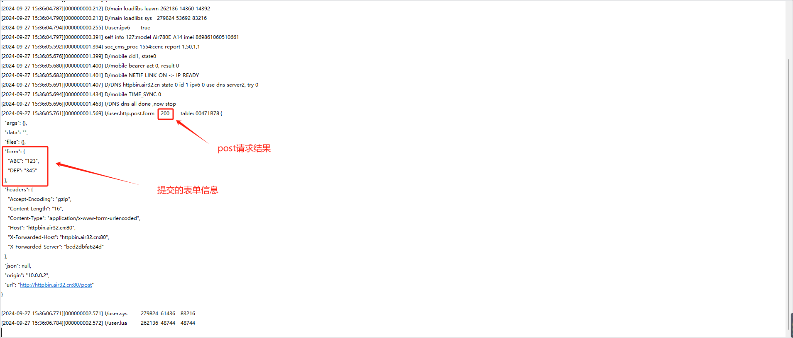

### 6.3 文件上传

HTTP POST 请求在文件上传场景中发挥着关键作用。用户通过 POST 请求可以将文件数据包含在请求体中发送给服务器，而不是像 GET 请求那样通过 URL 传递。这种方式允许上传大量数据，包括各种类型的文件，如图片、视频、文档等。服务器接收到请求后，会解析请求体中的文件数据，并存储到服务器上相应的位置。文件上传是 HTTP 应用中常见的功能。

下面根据 demo 演示 HTTP 文件上传的功能，示例代码如下 ([具体 demo 可以点此链接跳转](https://gitee.com/openLuat/LuatOS-Air780E/blob/master/demo/http/main.lua))

示例:

```lua
---- MultipartForm上传文件
-- url string 请求URL地址
-- req_headers table 请求头
-- params table 需要传输的数据参数
function postMultipartFormData(url, params)
    local boundary = "----WebKitFormBoundary"..os.time()
    local req_headers = {
        ["Content-Type"] = "multipart/form-data; boundary="..boundary,
    }
    local body = {}
    -- 解析拼接 body
    for k,v in pairs(params) do
        if k=="texts" then
            local bodyText = ""
            for kk,vv in pairs(v) do
                print(kk,vv)
                bodyText = bodyText.."--"..boundary.."\r\nContent-Disposition: form-data; name=\""..kk.."\"\r\n\r\n"..vv.."\r\n"
            end
            table.insert(body, bodyText)
        elseif k=="files" then
            local contentType =
            {
                txt = "text/plain",             -- 文本
                jpg = "image/jpeg",             -- JPG 格式图片
                jpeg = "image/jpeg",            -- JPEG 格式图片
                png = "image/png",              -- PNG 格式图片
                gif = "image/gif",              -- GIF 格式图片
                html = "image/html",            -- HTML
                json = "application/json"       -- JSON
            }
            for kk,vv in pairs(v) do
                if type(vv) == "table" then
                    for i=1, #vv do
                        print(kk,vv[i])
                        table.insert(body, "--"..boundary.."\r\nContent-Disposition: form-data; name=\""..kk.."\"; filename=\""..vv[i]:match("[^%/]+%w
$").."\"\r\nContent-Type: "..contentType[vv[i]:match("%.(%w+)$
")].."\r\n\r\n")
                        table.insert(body, io.readFile(vv[i]))
                        table.insert(body, "\r\n")
                    end
                else
                    print(kk,vv)
                    table.insert(body, "--"..boundary.."\r\nContent-Disposition: form-data; name=\""..kk.."\"; filename=\""..vv:match("[^%/]+%w
$").."\"\r\nContent-Type: "..contentType[vv:match("%.(%w+)$
")].."\r\n\r\n")
                    table.insert(body, io.readFile(vv))
                    table.insert(body, "\r\n")
                end
            end
        end
    end
    table.insert(body, "--"..boundary.."--\r\n")
    body = table.concat(body)
    log.info("headers: ", "\r\n" .. json.encode(req_headers), type(body))
    log.info("body: " .. body:len() .. "\r\n" .. body)
    local code, headers, body = http.request("POST",url,
            req_headers,
            body
    ).wait()
    log.info("http.post", code, headers, body)
end
function demo_http_post_file()
    -- -- POST multipart/form-data模式 上传文件---手动拼接
    local boundary = "----WebKitFormBoundary" .. os.time()
    local req_headers = {
        ["Content-Type"] = "multipart/form-data; boundary=" .. boundary,
    }
    local body = "--" .. boundary .. "\r\n" ..
        "Content-Disposition: form-data; name=\"uploadFile\"; filename=\"luatos_uploadFile_TEST01.txt\"" ..
        "\r\nContent-Type: text/plain\r\n\r\n" ..
        "1111http_测试一二三四654zacc\r\n" ..
        "--" .. boundary
    log.info("headers: ", "\r\n" .. json.encode(req_headers))
    log.info("body: ", "\r\n" .. body)
    local code, headers, body = http.request("POST", "http://airtest.openluat.com:2900/uploadFileToStatic",
        req_headers,
        body         -- POST请求所需要的body, string, zbuff, file均可
    ).wait()
    log.info("http.post", code, headers, body)
    -- 也可用postMultipartFormData(url, params) 上传文件
    postMultipartFormData(
        "http://airtest.openluat.com:2900/uploadFileToStatic",
        {
            -- texts =
            -- {
            --     ["imei"] = "862991234567890",
            --     ["time"] = "20180802180345"
            -- },
            files =
            {
                ["uploadFile"] = "/luadb/luatos_uploadFile.txt",
            }
        }
    )
end
sys.taskInit(function()
    sys.wait(100)
    -- 打印一下支持的加密套件, 通常来说, 固件已包含常见的99%的加密套件
    -- if crypto.cipher_suites then
    --     log.info("cipher", "suites", json.encode(crypto.cipher_suites()))
    -- end
    -------- HTTP 演示代码 --------------
    sys.waitUntil("net_ready") -- 等联网
    while 1 do
        demo_http_post_file()
        sys.wait(1000)
        -- 打印一下内存状态
        log.info("sys", rtos.meminfo("sys"))
        log.info("lua", rtos.meminfo("lua"))
        sys.wait(600000)
    end
end)
```

对应 log:


### 6.4 文件下载

下面根据 demo 演示 HTTP 文件下载的功能，示例代码如下 ([具体 demo 可以点此链接跳转](https://gitee.com/openLuat/LuatOS-Air780E/blob/master/demo/http/main.lua))

示例:

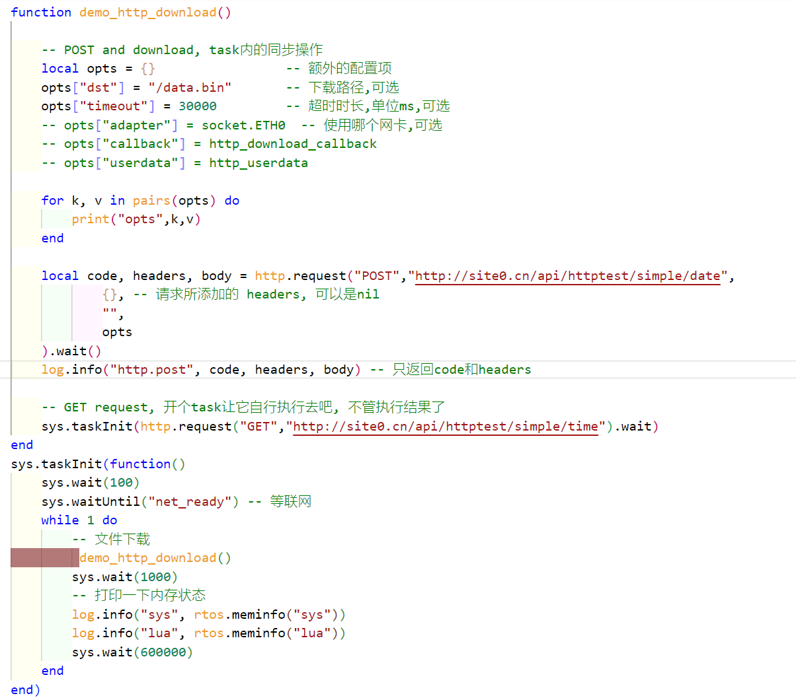

对应 log:

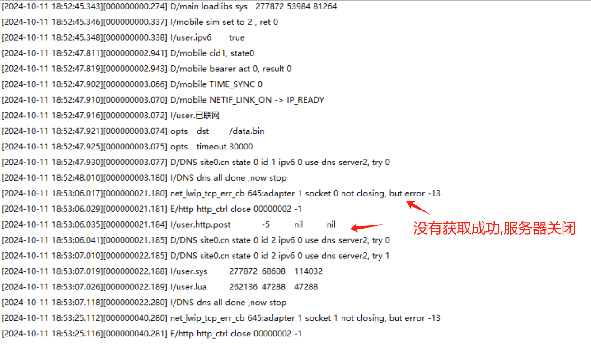

### 6.5 处理 JSON 数据

处理 json 数据主要有两个函数,json.encode(t)和 json.decode(str),参考示例代码:[https://gitee.com/openLuat/LuatOS-Air780E/tree/master/demo/json](https://gitee.com/openLuat/LuatOS-Air780E/tree/master/demo/json)

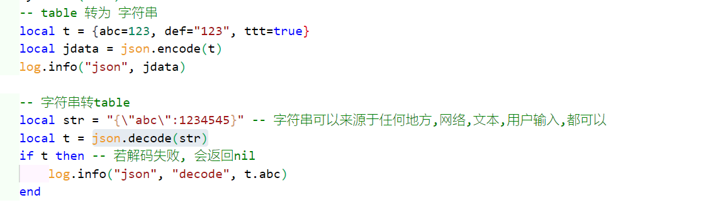

### 6.6 压缩和解压

这个例程用 和风天气 的 api 做演示,请求到的数据配合 miniz 库进行解压，示例代码如下 ([具体 demo 可以点此链接跳转](https://gitee.com/openLuat/LuatOS-Air780E/blob/master/demo/http/main.lua))

示例:

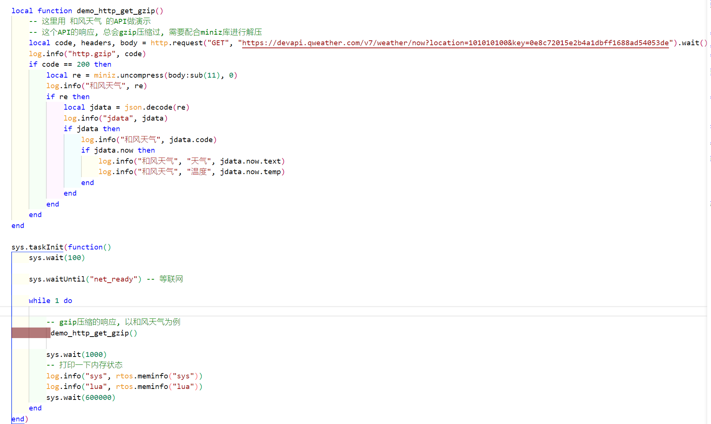

对应 log:

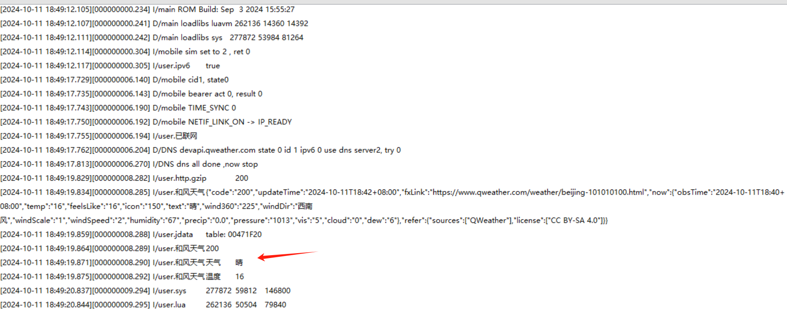

也可以参考例程:[https://gitee.com/openLuat/LuatOS-Air780E/tree/master/demo/miniz](https://gitee.com/openLuat/LuatOS-Air780E/tree/master/demo/miniz)

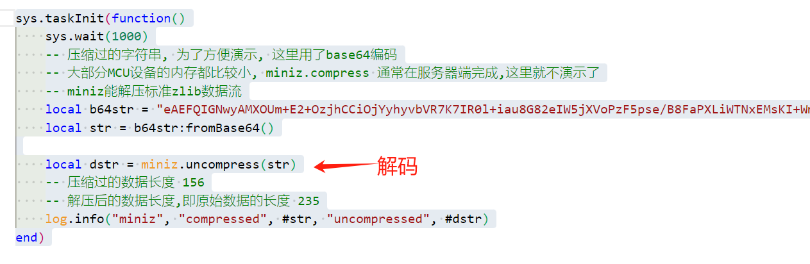

## 七、总结

本文档主要介绍 4G 通信中 http 网络协议的应用。讲解了 HTTP 基本原理，GET 和 POST 请求，以及文件上传下载、HTTPS 加密、JSON 数据处理和数据压缩等高级功能，直接烧录例程即可测试,旨在实现高效、安全的数据传输。

## 八、常见问题

### 8.1 HTTP 支持多连接吗

目前 HTTP 仅支持单连接，不支持多连接

### 8.2 重试多次 PDP ，HTTP 应用一直连接失败

如果重试多次 PDP 激活，PDP 一直激活失败，或者 HTTP 一直请求应答失败，则尝试使用如下手段恢复：

1、使用 RESET 引脚复位模块

2、极端情况下，直接给模块断电，再上电，POWER KEY 引脚拉低开机

### 8.3 为什么我只发了 10 字节消息，100 次却消耗了那么多流量？

因为还有 HTTP 自带的请求头。[如何统计流量](https://doc.openluat.com/article/2111#1213_693)

### 8.4 为什么频繁请求会失败?

支持的 http 连接总数有限数量为 tcp 连接数量 8 个，建议一个 http 连接返回请求结果之后，再去请求下一个连接；不要使用循环定时器方式不断的发起新的 http 请求。

### 8.5 专网卡访问白名单

用定向 Ip 的物联网卡，需要把域名或 IP 加入白名单才能使用。如果不加入白名单会出现无法访问服务器的情况.

## 给读者的话

> 本篇文章由公帅开发；
>
> 本篇文章描述的内容，如果有错误、细节缺失、细节不清晰或者其他任何问题，总之就是无法解决您遇到的问题；
>
> 请登录[合宙技术交流论坛](https://chat.openluat.com/)，点击[文档找错赢奖金-Air780E-LuatOS-软件指南-网络驱动-HTTP通信](https://chat.openluat.com/#/page/matter?125=1846735729720426498&126=%E6%96%87%E6%A1%A3%E6%89%BE%E9%94%99%E8%B5%A2%E5%A5%96%E9%87%91-Air780E-LuatOS-%E8%BD%AF%E4%BB%B6%E6%8C%87%E5%8D%97-%E7%BD%91%E7%BB%9C%E9%A9%B1%E5%8A%A8-HTTP%E9%80%9A%E4%BF%A1&askid=1846735729720426498)；
>
> 用截图标注+文字描述的方式跟帖回复，记录清楚您发现的问题；
>
> 我们会迅速核实并且修改文档；
>
> 同时也会为您累计找错积分，您还可能赢取月度找错奖金！
