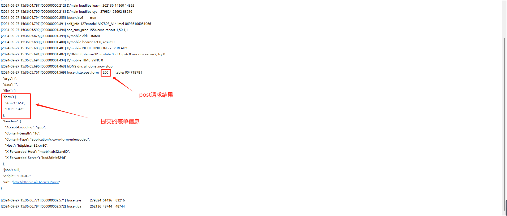

# POST请求

    HTTP POST请求是一种HTTP方法，用于向指定的资源提交数据。与GET请求不同，POST请求的数据包含在请求体中，可以提交大量数据且数据不会显示在URL中，常用于提交表单数据或上传文件等操作。

下面根据demo演示HTTP的POST请求方法提交一个表单，示例代码如下 ([具体demo可以点此链接跳转](https://gitee.com/openLuat/LuatOS/blob/master/demo/http/main.lua))

## 示例

``` lua

function demo_http_post_form()
    -- POST request 演示
    local req_headers = {}
    req_headers["Content-Type"] = "application/x-www-form-urlencoded"
    local params = {
        ABC = "123",
        DEF = 345
    }
    local body = ""
    for k, v in pairs(params) do
        body = body .. tostring(k) .. "=" .. tostring(v):urlEncode() .. "&"
    end
    local code, headers, body = http.request("POST","http://httpbin.air32.cn/post",
            req_headers,
            body -- POST请求所需要的body, string, zbuff, file均可
    ).wait()
    log.info("http.post.form", code, headers, body)
end


sys.taskInit(function()
    sys.wait(100)
    -- 打印一下支持的加密套件, 通常来说, 固件已包含常见的99%的加密套件
    -- if crypto.cipher_suites then
    --     log.info("cipher", "suites", json.encode(crypto.cipher_suites()))
    -- end

    -------- HTTP 演示代码 --------------
    sys.waitUntil("net_ready") -- 等联网
    while 1 do

        -- post表单提交
        demo_http_post_form()
        sys.wait(1000)
        -- 打印一下内存状态
        log.info("sys", rtos.meminfo("sys"))
        log.info("lua", rtos.meminfo("lua"))
        sys.wait(600000)
    end
end)

```

## 对应log


