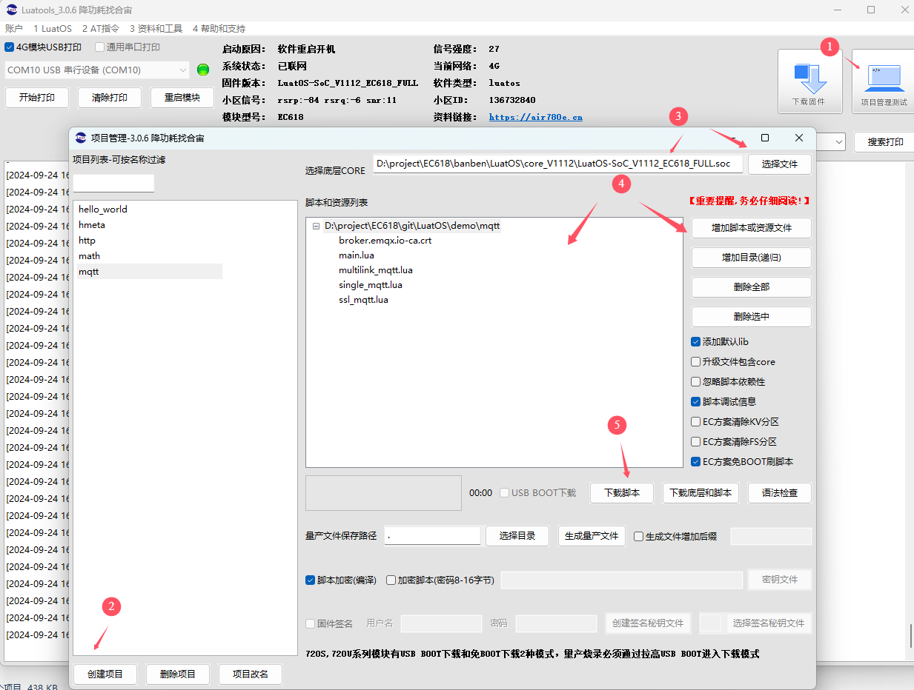
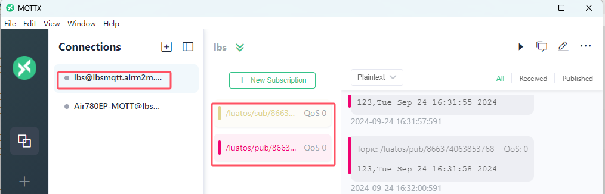
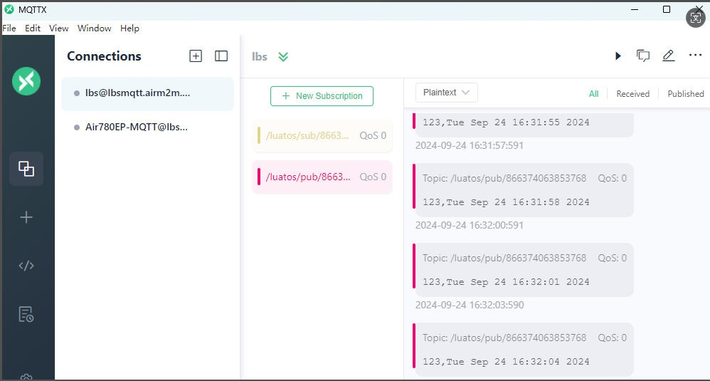
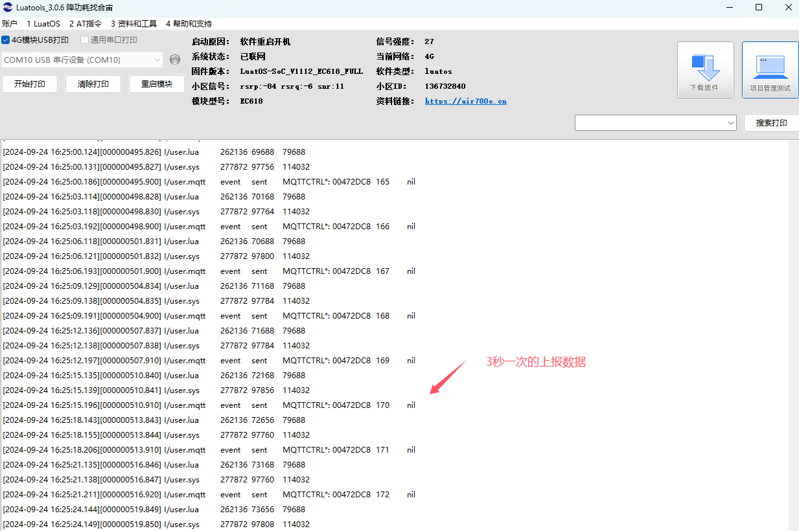
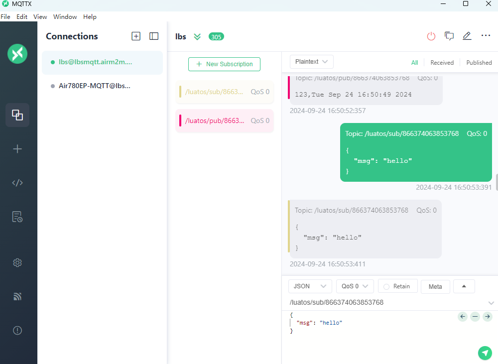
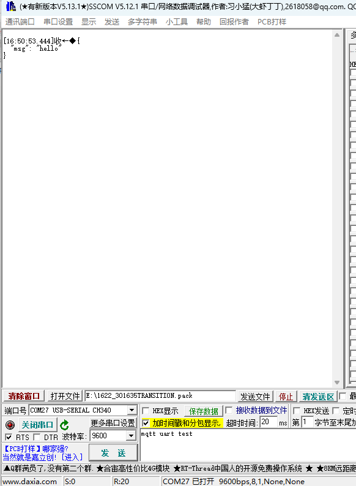
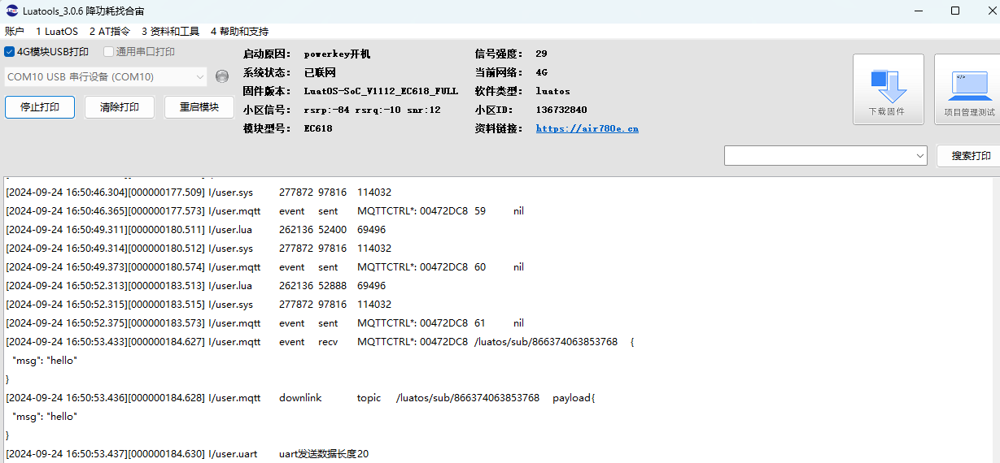
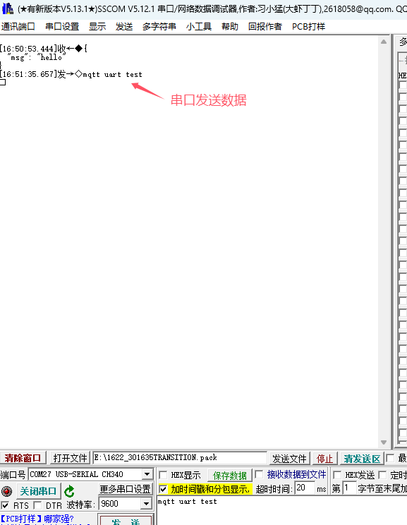
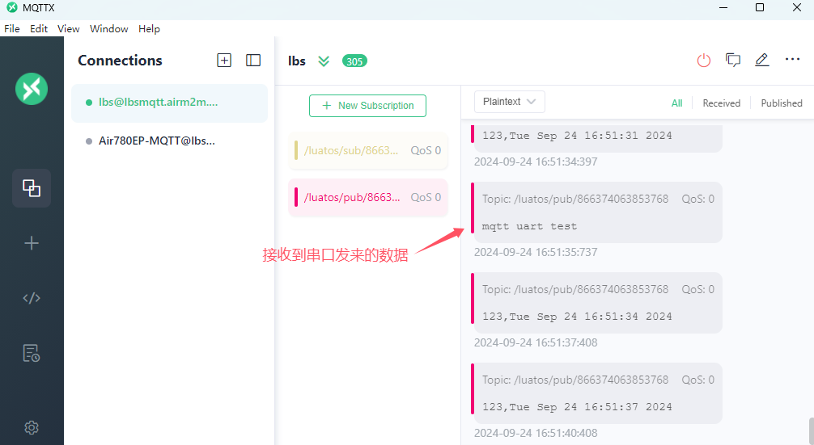
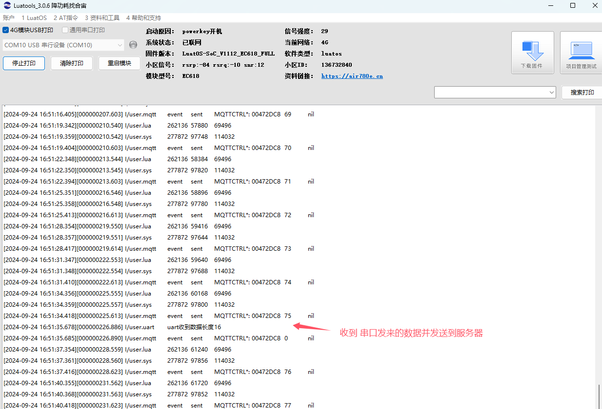

# 基本用法

本文介绍如何用Air780E开发板，进行mqtt数据订阅，发布，接收的功能演示。

## 概述

优势：长连接，低带宽，高可靠。

实用场景：需要服务器下发消息给设备，需要及时收到。例如，远程开关，充电桩等

**几个重要名词**

**1.** **username**用户名，**password**密码，**clientid**用户标识，mqtt可以通过前两个参数保证连接的安全，通过clientid确保设备唯一性。

**2.** **qos**消息质量，分为0，1，2三个等级，分别表示只发一次，至少收到一次和只收到一次，通过qos可以根据数据的重要性灵活选择发送方式以节省带宽和保证数据可靠。例如不重要的数据采集可使用qos0只发一次不关心服务器是否收到，重要的消息通过qos1确保能收到，付款信息危险设备开关等场景使用qos2保证数据到达的同时且不重复。

**3.** **host**主机，**port**端口，mqtt需要连接的服务器参数。host可以说ip或者域名。

**4.** **topic**主题，根据主题区别消息类型和来源，主要用来分类数据。同时mqtt是发布订阅模型，topic是发布和订阅者通信的重要通道。

**5.** **payload**消息内容，发布和订阅的具体数据。

**6.** **retain**保留消息，保留消息是一条将保留标志（retained flag）置为true的普通MQTT消息。broker会针对主题依照QoS级别保留最后一条保留消息，当订阅者订阅主题时会立即收到保留消息。broker仅为每个主题保留一条保留消息。

## 文档和工具

- mqtt接口描述：[mqtt - mqtt客户端 - LuatOS 文档](https://wiki.luatos.com/api/mqtt.html)
- 780E模块软件包：[LuatOS 发行版 - Gitee.com](https://gitee.com/openLuat/LuatOS/releases)
- 本示例所烧录的固件版本：**LuatOS-SoC_V1112_EC618_FULL.soc**
- 本示例所烧录的脚本：[demo/mqtt · 合宙Luat/LuatOS - 码云 - 开源中国 (gitee.com)](https://gitee.com/openLuat/LuatOS/tree/master/demo/mqtt)
- 如果不会烧录，可参考 [烧录教程](https://doc.openluat.com/wiki/21?wiki_page_id=6072)
- Air780EP(V)开发板一套，包括天线SIM卡，USB线。PC电脑，MQTT.fx工具

## 示例

main.lua

主要定义项目名称和版本信息，以及require对应的模块，这里将以MQTT单链接进行演示说明，详细说明见下面说明：

``` lua
-- LuaTools需要PROJECT和VERSION这两个信息
PROJECT = "mqttdemo"
VERSION = "1.0.0"

-- sys库是标配
_G.sys = require("sys")
--[[特别注意, 使用mqtt库需要下列语句]]
_G.sysplus = require("sysplus")

require "single_mqtt"       -- MQTT单链接

-- 用户代码已结束---------------------------------------------
-- 结尾总是这一句
sys.run()
-- sys.run()之后后面不要加任何语句!!!!!
```

single_mqtt.lua

MQTT单链接，主要功能MQTT创建和连接，数据收发，以及与uart结合, 简单的mqtt-uart透传实现。

首先需要等待模块联网成功，才去做MQTT的创建和连接，以下是等待联网成功处理task部分代码，完整代码看对应的DEMO。

``` lua
-- 统一联网函数,等待联网成功，联网成功后会发送"net_ready"消息
sys.taskInit(function()
    ...
    -- 默认都等到联网成功
    sys.waitUntil("IP_READY")
    sys.publish("net_ready", device_id)
end)
        
```

以下是MQTT创建，连接以及数据接收和发送的task部分代码，完整代码看对应的DEMO。

``` lua
sys.taskInit(function()
    -- 等待联网
    local ret, device_id = sys.waitUntil("net_ready")
    ...
    pub_topic = "/luatos/pub/" .. device_id   -- 定义发布主题
    sub_topic = "/luatos/sub/" .. device_id   -- 定义订阅主题
        
    -------------------------------------
    -------- MQTT 演示代码 --------------
    -------------------------------------

    mqttc = mqtt.create(nil, mqtt_host, mqtt_port, mqtt_isssl)

    mqttc:auth(client_id,user_name,password) -- client_id必填,其余选填
    -- mqttc:keepalive(240) -- 默认值240s
    mqttc:autoreconn(true, 3000) -- 自动重连机制

    mqttc:on(function(mqtt_client, event, data, payload)

        if event == "conack" then
            -- 联上了
            sys.publish("mqtt_conack")
            mqtt_client:subscribe(sub_topic) --单主题订阅
        elseif event == "recv" then --接收数据处理  
            sys.publish("mqtt_payload", data, payload)
        elseif event == "sent" then
        end
    end)

    -- mqttc自动处理重连, 除非自行关闭
    mqttc:connect()
	sys.waitUntil("mqtt_conack")
    while true do
        -- 演示等待其他task发送过来的上报信息
        local ret, topic, data, qos = sys.waitUntil("mqtt_pub", 300000)
        if ret then
            -- 提供关闭本while循环的途径, 不需要可以注释掉
            if topic == "close" then break end
            mqttc:publish(topic, data, qos)
        end
    end
    mqttc:close()
    mqttc = nil
end)      
```

定时上报数据task，每3秒发送一次数据。

``` lua
sys.taskInit(function()
    sys.wait(3000)
	local data = "123,"
	local qos = 1 -- QOS0不带puback, QOS1是带puback的
    while true do
        sys.wait(3000)
        if mqttc and mqttc:ready() then
            local pkgid = mqttc:publish(pub_topic, data .. os.date(), qos)
        end
    end
end)        
```

以下是演示与uart结合, 简单的mqtt-uart透传实现

``` lua
local uart_id = 1
uart.setup(uart_id, 9600)
uart.on(uart_id, "receive", function(id, len)
    local data = ""
    while 1 do
        local tmp = uart.read(uart_id)
        if not tmp or #tmp == 0 then
            break
        end
        data = data .. tmp
    end
    log.info("uart", "uart收到数据长度", #data)
    sys.publish("mqtt_pub", pub_topic, data)
end)
sys.subscribe("mqtt_payload", function(topic, payload)
    log.info("uart", "uart发送数据长度", #payload)
    uart.write(1, payload)
end)       
```

## 演示和log

下载对应DEMO到Air780E开发板，软件包含固件版本和lua脚本，如果固件版本不变，可以选免BOOT的方式下载脚本，如下所示：



用MQTTX工具，连接同样的服务器，订阅对应的主题来进行演示。



3秒定时上报，MQTTX对应显示如下所示：



3秒定时上报，模块log如下所示：



MATTX发送数据，MATTX显示如下所示：



MATTX发送数据，串口接收数据，如下所示：



MATTX发送数据，模块对应log，如下所示：



UART发送数据，串口显示，如下所示：



UART发送数据，MATTX接收数据显示，如下所示：



UART发送数据，模块对应log，如下所示：


