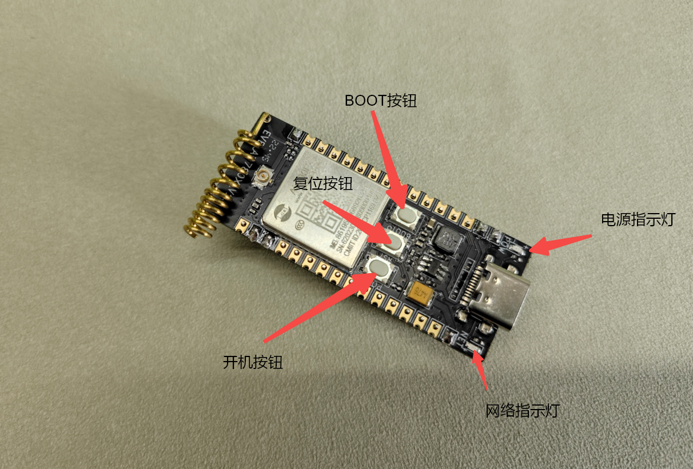

## 一、MQTT 介绍

MQTT 是一种低开销、低带宽占用的即时通讯协议，可以用极少的代码和带宽为远程设备提供实时可靠的消息服务。它适用于硬件性能低下的设备以及网络状况不佳的环境，因此在物联网（IoT）小型设备和移动应用等方面有广泛应用。

MQTT 采用发布/订阅通信模型，客户端可以发布消息到主题（Topic），也可以订阅主题来接收消息。这种模式解耦了消息的发送者和接收者。

MQTT 的消息传递质量分为三种：最多一次（QoS 0）不保证交付，至少一次（QoS 1）确保至少到达但可能重复，只有一次（QoS 2）确保仅到达一次。

## 二、演示功能概述

本 demo 通过使用 AIR780E 开发板，带你快速体验通过 MQTT 协议进行数据接收与发送。

## 三、准备硬件环境

### 3.1 AIR780E 开发板


[购买链接（注意：需要配套采购 4G 物联网卡！）](https://item.taobao.com/item.htm?id=693774140934&pisk=fhpqwk6HuxH4KGubOZWNYNN42s6AH93Cod_1jhxGcZbD5i6Nja-nDZGtMFRySUCfoqhAjR8HyGZXmsVlrMI4nSXGiaAykHfX7hnAjNYM7NOjNvtvDOBiROkIdnLlWvxH7sbDqzxRA-4062417OBiRVP7IsHFBedNnUSNZ0S1fRjMS1xlraINjRYGo_4lXGBGSbuCaJDS6s0HvaA15B4hHrX5zR2Uvi50onP_QRkNmsbhZw2MVLSVgwxDhJaPbgvWU617f46kvQTc49k4JiRkYtjwBDVN71JAUa8EKRIJiEJl_Lits3JNo6JcaVwwYt-lsL53YJ7Wai6knBrgI3WVSesAgruP-KKkpTfSKD-keEtvUhZiIgTCrnpcQvmd3tbcUgWaWg2F7dd4S55c2g7I40lKbcr6leOTt5FOZ9IPRmsbs54dORN2LJVT6_bd4wibK&skuId=5098266470883&spm=a1z10.5-c-s.w4002-24045920841.33.75b21fd1Su4B3X)

### 3.2 TYPE-C 线快充线


[购买链接（注意：必须是快充线！）](https://item.taobao.com/item.htm?id=693774140934&pisk=fhpqwk6HuxH4KGubOZWNYNN42s6AH93Cod_1jhxGcZbD5i6Nja-nDZGtMFRySUCfoqhAjR8HyGZXmsVlrMI4nSXGiaAykHfX7hnAjNYM7NOjNvtvDOBiROkIdnLlWvxH7sbDqzxRA-4062417OBiRVP7IsHFBedNnUSNZ0S1fRjMS1xlraINjRYGo_4lXGBGSbuCaJDS6s0HvaA15B4hHrX5zR2Uvi50onP_QRkNmsbhZw2MVLSVgwxDhJaPbgvWU617f46kvQTc49k4JiRkYtjwBDVN71JAUa8EKRIJiEJl_Lits3JNo6JcaVwwYt-lsL53YJ7Wai6knBrgI3WVSesAgruP-KKkpTfSKD-keEtvUhZiIgTCrnpcQvmd3tbcUgWaWg2F7dd4S55c2g7I40lKbcr6leOTt5FOZ9IPRmsbs54dORN2LJVT6_bd4wibK&skuId=5098266470883&spm=a1z10.5-c-s.w4002-24045920841.33.75b21fd1Su4B3X)

## 四、准备软件环境

注：以下软件下载链接，请复制后，粘贴到浏览器 URL 地址栏进行下载；

### 4.1 MQTT.fx

[MQTT 客户端软件下载](http://airtest.openluat.com:2900/download/mqttfx-1.7.1-windows-x64.zip)

### 4.2 Luatools

[Luatools 日志打印与程序烧录软件下载](https://doc.openluat.com/wiki/52?wiki_page_id=5071)

### 4.3 core 固件和源码脚本

注：core 固件，是基础环境，该固件由合宙官方提供，用户不可修改；源码脚本，为应用程序，可由客户自行修改；

[core 固件和源码脚本下载链接](http://airtest.openluat.com:2900/download/002%EF%BC%9AAir780E-LuatOS-%E8%BD%AF%E4%BB%B6demo-%E7%BD%91%E7%BB%9C%E9%A9%B1%E5%8A%A8-MQTT%E9%80%9A%E4%BF%A1.zip)

## 五、软硬件资料

1、AIR780E 开发板原理图，打开 [Air780E 产品手册](https://docs.openluat.com/air780e/product/) ，访问页面中的 《[EVB_Air780X_V1.6.zip](https://cdn.openluat-luatcommunity.openluat.com/attachment/20240513100446379_EVB_Air780X_V1.6.zip)》

2、[API 使用介绍说明](https://wiki.luatos.com/api/mqtt.html)

3、AIR780E 开发板使用说明，打开 [Air780E 产品手册](https://docs.openluat.com/air780e/product/) ，访问页面中的 《Core_Air780E 使用说明 V1.0.5.pdf》

### 5.1 开发板按钮与指示灯图示与说明




### 5.2 硬件安装与连接

#### 5.2.1 SIM 卡安装


#### 5.2.2 实物连接图


注：开发板与电脑通过 TYPE-C 线连接，用于通信与供电，所以必须使用“支持快充”的 TYPE-C 线才可以；

## 六、代码示例介绍

### 6.1 DEMO 软件流程图


### 6.2 配置

#### 6.2.1 MQTT 的 4 个重要配置

- local mqtt_host = "lbsmqtt.airm2m.com"（MQTT 服务器地址，这里使用合宙提供公用测试服务器）
- local mqtt_port = 1884（MQTT 端口）
- local user_name = "user"（MQTT 服务器登录用户名）
- local password = "password"（MQTT 服务器登录密码）

#### 6.2.2 MQTT 的 2 个重要主题

- local pub_topic = "/luatos/pub/123"-- .. (mcu.unique_id():toHex())（设备发布主题，以下方源码 55 行，可自行修改）
- local sub_topic = "/luatos/sub/123"-- .. (mcu.unique_id():toHex())（设备订阅主题，以下方源码 56 行，可自行修改）

### 6.2 完整程序清单

注：完整复制后保存为 main.lua，可直接使用

```lua
-- LuaTools需要PROJECT和VERSION这两个信息
PROJECT = "mqttdemo"
VERSION = "1.0.0"

--[[
本demo需要mqtt库, 大部分能联网的设备都具有这个库
mqtt也是内置库, 无需require
]]

-- sys库是标配
_G.sys = require("sys")
--[[特别注意, 使用mqtt库需要下列语句]]
_G.sysplus = require("sysplus")
local netLed = require("netLed")


-- Air780E的AT固件默认会为开机键防抖, 导致部分用户刷机很麻烦
if rtos.bsp() == "EC618" and pm and pm.PWK_MODE then
    pm.power(pm.PWK_MODE, false)
end


--根据自己的服务器修改以下参数
local mqtt_host = "lbsmqtt.airm2m.com"
local mqtt_port = 1884
local mqtt_isssl = false
local client_id = "mqttx_b55c41b7"
local user_name = "user"
local password = "password"

local pub_topic = "/luatos/pub/123"-- .. (mcu.unique_id():toHex())
local sub_topic = "/luatos/sub/123"-- .. (mcu.unique_id():toHex())


local mqttc = nil
local netLed = require("netLed")
--GPIO18配置为输出，默认输出低电平，可通过setGpio18Fnc(0或者1)设置输出电平
local LEDA= gpio.setup(27, 0, gpio.PULLUP)

-- 统一联网函数
sys.taskInit(function()
    local device_id = mcu.unique_id():toHex()
    device_id = mobile.imei()
    -- 默认都等到联网成功
    sys.waitUntil("IP_READY")
    sys.publish("net_ready", device_id)
end)

sys.taskInit(function()
    -- 等待联网
    local ret, device_id = sys.waitUntil("net_ready") --device_id为设备的IMEI号
    
    client_id = device_id
    pub_topic = device_id .. "/up"  -- 设备发布的主题，开发者可自行修改
    sub_topic = device_id .. "/down" -- 设备订阅的主题，开发者可自行修改

    -- 打印一下上报(pub)和下发(sub)的topic名称
    -- 上报: 设备 ---> 服务器
    -- 下发: 设备 <--- 服务器
    -- 可使用mqtt.x等客户端进行调试
    log.info("mqtt", "pub", pub_topic)
    log.info("mqtt", "sub", sub_topic)

    -- 打印一下支持的加密套件, 通常来说, 固件已包含常见的99%的加密套件
    -- if crypto.cipher_suites then
    --     log.info("cipher", "suites", json.encode(crypto.cipher_suites()))
    -- end
    if mqtt == nil then
        while 1 do
            sys.wait(1000)
            log.info("bsp", "本bsp未适配mqtt库, 请查证")
        end
    end
        --配置上网指示灯
        gpio.setup(11, 1, gpio.PULLUP)  --配置为输出，带上拉

    -------------------------------------
    -------- MQTT 演示代码 --------------
    -------------------------------------

    mqttc = mqtt.create(nil, mqtt_host, mqtt_port, mqtt_isssl, ca_file)

    mqttc:auth(client_id,user_name,password) -- client_id必填,其余选填
    -- mqttc:keepalive(240) -- 默认值240s
    mqttc:autoreconn(true, 3000) -- 自动重连机制

    mqttc:on(function(mqtt_client, event, data, payload)
        -- 用户自定义代码
        log.info("mqtt", "event", event, mqtt_client, data, payload)
        if event == "conack" then
            -- 联上了
                        gpio.set(11, 0) --输出低电平
            sys.publish("mqtt_conack")
            mqtt_client:subscribe(sub_topic)--单主题订阅
            -- mqtt_client:subscribe({[topic1]=1,[topic2]=1,[topic3]=1})--多主题订阅
        elseif event == "recv" then
            log.info("mqtt", "downlink", "topic", data, "payload:", payload)
                        log.info("mqtt", "uplink", "topic", pub_topic, "payload:", payload)
                        sys.publish("mqtt_pub", pub_topic, payload)  --将收到的数据，通过发布主题目，进行发送
        elseif event == "sent" then
            log.info("mqtt", "sent", "pkgid", data)
        elseif event == "disconnect" then
                
                        gpio.set(11, 1) --输出高电平
            -- 非自动重连时,按需重启mqttc
            -- mqtt_client:connect()
                        
        end
    end)

    -- mqttc自动处理重连, 除非自行关闭
    mqttc:connect()
        sys.waitUntil("mqtt_conack")
    while true do
        -- 演示等待其他task发送过来的上报信息
        local ret, topic, data, qos = sys.waitUntil("mqtt_pub", 300000)
        if ret then
            -- 提供关闭本while循环的途径, 不需要可以注释掉
            if topic == "close" then break end
            mqttc:publish(topic, data, qos)
        end
                
        -- 如果没有其他task上报, 可以写个空等待
        --sys.wait(6000)
    end
    mqttc:close()
    mqttc = nil
end)


-- 用户代码已结束---------------------------------------------
-- 结尾总是这一句
sys.run()
-- sys.run()之后后面不要加任何语句!!!!!
```

## 七、功能验证

### 7.1 开机

按图 1 所示通过 TYPE-C 线将开发板与电脑连接无误后，开发板电源指示红灯常亮，网络指示灯灭，如下图：


此时按下开机键，约 2 秒后释放，等待几秒网络指示绿灯常亮，即开机成功，如下图：


此时电脑设备管理器中会发现下图所示几个设备，即代表开机成功！


### 7.2 打开 Luatool 软件工具并进入项目管理测试页面


图 4

### 7.3 按序号步骤创建项目


### 7.4 按如下步骤进行程序烧录


### 7.5 观察下载过程后确认烧录结果


### 7.6 查看调试日志，获取设备发布与订阅主题


### 7.7 打开 MQTT 客户端 MQTT.fx 应用程序并配置

#### 7.7.1 MQTT 客户端基本配置

ProfileName：合宙（可修改为你想要的名称）

BrokerAddress：[http://lbsmqtt.airm2m.com](http://lbsmqtt.airm2m.com) （合宙提供的免费测试服务器，也可修改为自己的服务器）

BrokerPort：1883 （端口号）

UserName：user

Password：password

#### 7.7.2 两个重要主题

设备发布主题：861959068926349/up （设备向服务器发送数据使用）

设备订阅主题：861959068926349/down （接收服务器数据主题）


### 7.8 订阅设备主题


### 7.9 MQTT 客户端给开发板发送数据


### 7.10 查 MQTT 客户端订阅的设备数据


## 总结

至此，我们已使用 AIR780E 开发板完成了 MQTT 通信的基本功能。
## 给读者的话

> 本篇文章由`肇朔`开发；
>
> 本篇文章描述的内容，如果有错误、细节缺失、细节不清晰或者其他任何问题，总之就是无法解决您遇到的问题；
>
> 请登录[合宙技术交流论坛](https://chat.openluat.com/)，点击[文档找错赢奖金-Air780E-LuatOS-软件指南-网络驱动-MQTT通信](https://chat.openluat.com/#/page/matter?125=1846736934202900482&126=%E6%96%87%E6%A1%A3%E6%89%BE%E9%94%99%E8%B5%A2%E5%A5%96%E9%87%91-Air780E-LuatOS-%E8%BD%AF%E4%BB%B6%E6%8C%87%E5%8D%97-%E7%BD%91%E7%BB%9C%E9%A9%B1%E5%8A%A8-MQTT%E9%80%9A%E4%BF%A1&askid=1846736934202900482)
> 
> 用截图标注+文字描述的方式跟帖回复，记录清楚您发现的问题；
>
> 我们会迅速核实并且修改文档；
>
> 同时也会为您累计找错积分，您还可能赢取月度找错奖金！