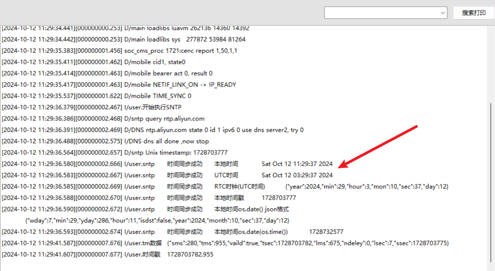

# 002：Air780E-LuatOS-软件 demo-网络驱动-NTP 通信

> [!TIP]
> ！！！不要删除这个高亮块中的内容！！！

每次版本迭代时，重新复制之前最近的一份文章内容，放到本文档最上面，然后修改；

必读文章：
[docs.openluat.com 文档开发过程（新人必看）](https://e3zt58hesn.feishu.cn/wiki/BJWIwMWI0ijF2zkiamUcI0s7nwd)
[docs 文章基本要求（大家仔细阅读，严格遵守）](https://e3zt58hesn.feishu.cn/docx/UplIdAaKso4k09xZSG4cMBGfn6e)

写本篇文章时，文章内容可以参考的一些合宙内部的资料（有些资料可能不是 Air780E 的，仅供参考）：

- 基于 LuatOS 代码仓库中的 NTP 有关的 demo 来写；
- 如果 demo 实现的功能不足以支撑编写本文章，例如功能不完整或者有错误，及时提出来，编写文档的同时完善 demo；
- [Air780E 简介](https://docs.openluat.com/air780e/)
- [Air780E 产品手册](https://docs.openluat.com/air780e/product/)
- [https://doc.openluat.com/wiki/21?wiki_page_id=2184](https://doc.openluat.com/wiki/21?wiki_page_id=2184)
- [https://doc.openluat.com/wiki/21?wiki_page_id=1958](https://doc.openluat.com/wiki/21?wiki_page_id=1958)
- [https://oldask.openluat.com/article/912](https://oldask.openluat.com/article/912)

写本篇文章时，文章目录结构可以参考一下文章：

- [Air780E LuatOS 快速入门示例 HelloWorld](https://docs.openluat.com/air780e/luatos/quick_start/hello/)
- [合宙 DTU 整机产品线文档中心](https://e3zt58hesn.feishu.cn/wiki/CFgkw6I66idUVnkAeaQcGpL4nfe?chunked=false)
- [Air780E AT 快速入门示例 TCP 通信](https://docs.openluat.com/air780e/at/quick_start/tcp/tcp/)

# 2024-10-12 第一版

## 一、NTP 通信概述

很多场景中，由于业务需要，模块需要保持正确的系统时钟，才能正常工作。但是模块上电后的初试时间戳是 946713600（即 2000/01/01,16:00:00），所以同步时钟成为了开发者要解决的重要问题。对于 Cat.1 模块, 移动/电信卡, 通常会下发基站时间,  那么 sntp 就不是必要的, 而联通卡通常不会下发, 就需要 sntp 了

NTP（Network Time Protocol，网络时间协议）是用于同步系统时间的协议。它通过网络连接多个设备，确保这些设备的系统时钟保持一致。

本例程展示了如何使用 SNTP 授时服务来同步时间。

NTP 和简化版的 SNTP（Simple Network Time Protocol）主要区别在于精确度和复杂性。SNTP 通常用于不需要高精度同步的设备，如嵌入式系统。而 NTP 则用于要求较高时间精度的场景。

## 二、演示功能概述

本 demo 将连接 NTP 服务器进行时间同步。

## 三、准备硬件环境

### 3.1 780E 开发板一套，包括天线、USB 数据线.

淘宝购买链接：[Air780E 核心板淘宝购买链接](https://item.taobao.com/item.htm?id=693774140934&pisk=f1eiwOqL25l1_HYiV6D1ize3wN5d5FMjRrpxkx3VT2uIHCCskWm4kysffAEqor4KRRIskGT0ooqi_coq7DWE000qbVr2mmzKQjNtkV3mnoalvaBRelZshA7RyTFdpD4xQco2_VS2Tcnvc89h5lZshq-pu_FUfEDVVdOmgrkET0ir3mkq_MDEmmM2QjJaY2uI0UGAoNueWRjiw4YTC-_opNr-zluaXleFpfR_X2fhTJVn94W--KJ4KcqQreCDEs3zNVh-DyWpIxqEmyc8savgoor7gX2D7GUzmW4jBJS2_4PTWjestFRZqA0iaRlwjdkIgW2nBR7XNkEn7bDL96_tMA4gN4GNOwa0xVU4IX8G4iReapZyhDSYLIOj_DinyhbSB2IHjbEhxMA51foIXaIhxItMPKJlyMjHNEGZAcQR.&spm=a1z10.5-c-s.w4002-24045920841.33.639f1fd1YrS4b6&skuId=5098266470883) ；

此核心板的详细使用说明参考：[Air780E 产品手册](https://docs.openluat.com/air780e/product/) 中的 << 开发板 Core_Air780E 使用说明 V1.0.5.pdf>>，X.X.X 指版本号；核心板使用过程中遇到任何问题，可以直接参考这份使用说明 pdf 文档。


### 3.2 SIM 卡

请准备一张可正常上网的 SIM 卡，该卡可以是物联网卡或您的个人手机卡。

**特别提****醒：**请确保 SIM 卡未欠费且网络功能正常，以便顺利进行后续操作。

### 3.3 数据通信线

typec 接口 USB 数据线即可。

### 3.4 PC 电脑

WINDOWS 系统。

## 四、准备软件环境

### 4.1 基本的下载调试工具

使用说明参考：[Luatools 下载和详细使用](https://docs.openluat.com/Luatools/) ；

## 五、获取 NTP 授时软硬件资料

### 5.1 文档和工具：

- 780E 模块使用固件：[SDK& Demo - 合宙文档中心](https://docs.openluat.com/air780e/luatos/firmware/)，本 demo 使用的固件版本是：LuatOS-SoC_V1112_EC618_FULL.soc
- 本教程使用的 demo：[https://gitee.com/openLuat/LuatOS-Air780E/tree/master/demo/sntp](https://gitee.com/openLuat/LuatOS-Air780E/tree/master/demo/sntp)
- 将固件和脚本烧录到模块中：[Luatools 下载和使用教程 - 合宙模组资料中心](https://docs.openluat.com/Luatools/)
- 源码和固件已打包，如下所示：

### 5.2 demo 使用 api 介绍

#### socket.sntp(sntp_server)

作用：sntp 时间同步

| **传入值类型**<br/> | **解释**<br/>                                                                                                                                                                                                                                                                                                        |
| ------------------- | -------------------------------------------------------------------------------------------------------------------------------------------------------------------------------------------------------------------------------------------------------------------------------------------------------------------- |
| string/table<br/>   | sntp 服务器地址 选填<br/>                                                                                                                                                                                                                                                                                            |
| int<br/>            | 适配器序号， 只能是 socket.ETH0（外置以太网），socket.LWIP_ETH（内置以太网），socket.LWIP_STA（内置 WIFI 的 STA），socket.LWIP_AP（内置 WIFI 的 AP），socket.LWIP_GP（内置蜂窝网络的 GPRS），socket.USB（外置 USB 网卡），如果不填，优先选择 soc 平台自带能上外网的适配器，若仍然没有，选择最后一个注册的适配器<br/> |

**返回值**

无

#### os.time(mytime)

作用：时间戳函数

**参数**

| **传入值类型**<br/> | **解释**<br/>         |
| ------------------- | --------------------- |
| table<br/>          | 日期时间的 table<br/> |
| return<br/>         | 时间戳<br/>           |

**返回值**

无

#### os.date(fmt, time)

作用：日期函数

**参数**

| **传入值类型**<br/> | **解释**<br/>                |
| ------------------- | ---------------------------- |
| string<br/>         | 格式化字符串,可以是 nil<br/> |
| table<br/>          | 日期时间的 table<br/>        |

**返回值**

| **返回值类型**<br/> | **解释**<br/>                   |
| ------------------- | ------------------------------- |
| table/string<br/>   | 根据 fmt 的不同,返回值不同<br/> |

#### json.encode(obj,t)

作用：将对象序列化为 json 字符串

**参数**

| **传入值类型**<br/> | **解释**<br/>                                                                              |
| ------------------- | ------------------------------------------------------------------------------------------ |
| obj<br/>            | 需要序列化的对象<br/>                                                                      |
| string<br/>         | 浮点数精度和模式,这项不存在的时候,为默认值”7f”,数字只支持”0~14”,模式只支持”f/g”<br/> |

**返回值**

| **返回值类型**<br/> | **解释**<br/>                                 |
| ------------------- | --------------------------------------------- |
| string<br/>         | 序列化后的 json 字符串, 失败的话返回 nil<br/> |
| string<br/>         | 序列化失败的报错信息<br/>                     |

#### json.decode(str)

作用：将字符串反序列化为对象

**参数**

| **传入值类型**<br/> | **解释**<br/>                   |
| ------------------- | ------------------------------- |
| string<br/>         | 需要反序列化的 json 字符串<br/> |

**返回值**

| **返回值类型**<br/> | **解释**<br/>                                         |
| ------------------- | ----------------------------------------------------- |
| obj<br/>            | 反序列化后的对象(通常是 table), 失败的话返回 nil<br/> |
| result<br/>         | 成功返回 1,否则返回 0<br/>                            |
| err<br/>            | 反序列化失败的报错信息<br/>                           |

## 六、代码示例介绍

### 6.1 使用 ntp 服务器同步时间

#### 6.1.1 demo 介绍

```lua
-- 开始时间同步
        socket.sntp()
        -- 自定义ntp地址
        -- socket.sntp("ntp.aliyun.com")
        -- socket.sntp({"baidu.com", "abc.com", "ntp.air32.cn"})
        -- 通常只需要几百毫秒就能成功，超时时间2s
        local ret = sys.waitUntil("NTP_UPDATE", 5000)
        if ret then
            -- 以下是获取/打印时间的演示,注意时区问题
            log.info("sntp", "时间同步成功", "本地时间", os.date())
            log.info("sntp", "时间同步成功", "UTC时间", os.date("!%c"))
            log.info("sntp", "时间同步成功", "RTC时钟(UTC时间)", json.encode(rtc.get()))
            -- os.time(rtc.get()) 需要 2023.07.21 之后的版本, 因为月份的命名差异mon/month
            -- log.info("sntp", "时间同步成功", "utc时间戳", os.time(rtc.get()))
            log.info("sntp", "时间同步成功", "本地时间戳", os.time())
            local t = os.date("*t")
            log.info("sntp", "时间同步成功", "本地时间os.date() json格式", json.encode(t))
            log.info("sntp", "时间同步成功", "本地时间os.date(os.time())", os.time(t))
            -- log.info("sntp", "时间同步成功", "本地时间", os.time())
            -- 正常使用, 一小时一次, 已经足够了, 甚至1天一次也可以
            -- sys.wait(3600000) 
            -- 这里为了演示, 用5秒一次
            sys.wait(5000)
        else
            log.info("sntp", "时间同步失败")
            sys.wait(60000) -- 1分钟后重试
        end

        -- 时间戳, 精确到毫秒. 2023.11.15 新增
        -- 注意, 至少成功完成2次sntp,该时间戳才比较准确
        -- 如果仅完成了一次sntp, 时间戳比标准时间会慢一个网络延时的时长(10~500ms)不等
        if socket.ntptm then
            local tm = socket.ntptm()
            log.info("tm数据", json.encode(tm))
            log.info("时间戳", string.format("%u.%03d", tm.tsec, tm.tms))
            sys.wait(5000)
        end
    end
end)

sys.subscribe("NTP_ERROR", function()
    log.info("socket", "sntp error")
    -- socket.sntp()
end)
```

#### 6.1.2 将程序下载到开发板

参考：将固件和脚本烧录到模块中：[Luatools 下载和使用教程 - 合宙模组资料中心](https://docs.openluat.com/Luatools/)

## 七、功能验证



## 八、总结

本 demo 介绍了如何使用 ntp 服务器同步时间。

## 扩展

## 常见问题

### 1、ntp 同步时间后，这个 clock 精度高吗，需要多久同步一次

并不能保证任何时间任何地点都能百分百同步到正确的时间。 所以，如果用户项目中的业务逻辑严格依赖于时间同步功能 则不要使用本功能模块，建议使用自己的应用服务器来同步时间。

### 2、多长时间 ntp 同步一次

正常使用, 一小时一次, 已经足够了, 甚至 1 天一次也可以。

### 3、这个函数 socket.sntp()后每次在程序中调用 os.time 也是实时时间了吗？

是的，只要时间同步成功了，就是实时时间了。


## 给读者的话

> 本篇文章由`孙晨龙`开发；
>
> 本篇文章描述的内容，如果有错误、细节缺失、细节不清晰或者其他任何问题，总之就是无法解决您遇到的问题；
>
> 请登录[合宙技术交流论坛](https://chat.openluat.com/)，点击[文档找错赢奖金-Air780E-LuatOS-软件指南-网络驱动-NTP通信](https://chat.openluat.com/#/page/matter?125=1846800823045193730&126=%E6%96%87%E6%A1%A3%E6%89%BE%E9%94%99%E8%B5%A2%E5%A5%96%E9%87%91-Air780E-LuatOS-%E8%BD%AF%E4%BB%B6%E6%8C%87%E5%8D%97-%E7%BD%91%E7%BB%9C%E9%A9%B1%E5%8A%A8-NTP%E9%80%9A%E4%BF%A1&askid=1846800823045193730)；
>
> 用截图标注+文字描述的方式跟帖回复，记录清楚您发现的问题；
>
> 我们会迅速核实并且修改文档；
>
> 同时也会为您累计找错积分，您还可能赢取月度找错奖金！
