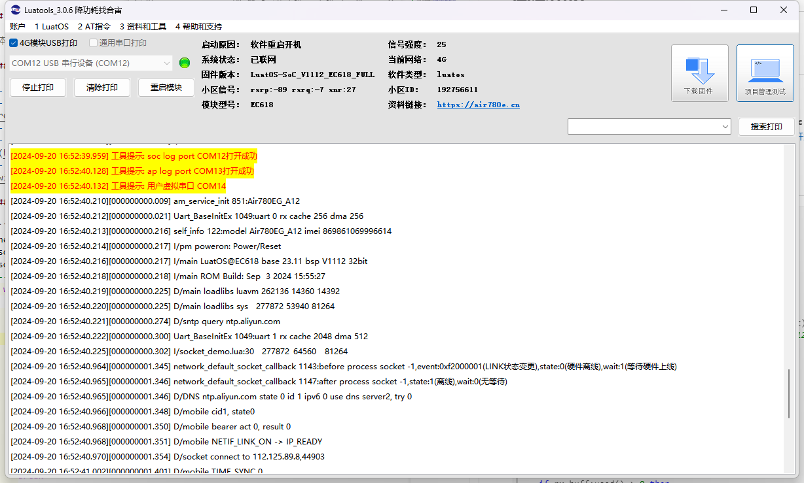

# 基本用法

本文通过demo演示来说明本章节内容的基本用法。

## 文档和工具

- socket接口文档：[socket-API说明](https://wiki.luatos.com/api/socket.html)
- 780E模块软件包：[LuatOS 发行版 - Gitee.com](https://gitee.com/openLuat/LuatOS/releases)
- 本示例所烧录的固件版本：**LuatOS-SoC_V1112_EC618_FULL.soc**
- 本示例所烧录的脚本：[demo/socket · 合宙Luat/LuatOS - 码云 - 开源中国 (gitee.com)](https://gitee.com/openLuat/LuatOS/tree/master/demo/socket/EC618)
- 如果不会烧录，可参考 [烧录教程](https://doc.openluat.com/wiki/21?wiki_page_id=6024)

## 基本API

**仅演示所用API，详情请看API说明-[socket-API说明](https://wiki.luatos.com/api/socket.html)**

- socket.create(adapter, cb)  -- 申请一个socket_ctrl
- socket.config(ctrl, local_port, is_udp, is_tls, keep_idle, keep_interval, keep_cnt, server_cert, client_cert, client_key, client_password) -- 配置network一些信息
- socket.connect(ctrl, ip, remote_port, need_ipv6_dns) -- 连接服务器
- socket.close(ctrl) -- 强制关闭socket

## 示例

``` lua
-- 本示例演示链接socket基础流程，详细代码请看完整demo
local netc = socket.create(nil, netCB)
socket.debug(netc, true)
socket.config(netc, nil, nil, nil, 300, 5, 6)   --开启TCP保活，防止长时间无数据交互被运营商断线
    while true do
        local succ, result = socket.connect(netc, server_ip, server_port)
        if result then
            log.info("服务器连上了")
        end
        if not succ then
            log.info("未知错误，5秒后重连")
        else
            local result, msg = sys.waitUntil("socket_disconnect")
        end
        log.info("服务器断开了，5秒后重连")
        socket.close(netc)
        log.info(rtos.meminfo("sys"))
        sys.wait(5000)
    end
```

## 对应log

成功链接socket打印




服务器链接成功打印


服务器断开对应打印


