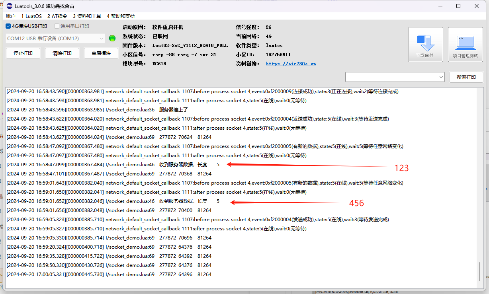

# TCP-UART透传

本文通过demo演示来说明TCP-UART透传的基本用法。

## 文档和工具

- socket接口文档：[socket-API说明](https://wiki.luatos.com/api/socket.html)
- 780E模块软件包：[LuatOS 发行版 - Gitee.com](https://gitee.com/openLuat/LuatOS/releases)
- 本示例所烧录的固件版本：**LuatOS-SoC_V1112_EC618_FULL.soc**
- 本示例所烧录的脚本：[demo/socket · 合宙Luat/LuatOS - 码云 - 开源中国 (gitee.com)](https://gitee.com/openLuat/LuatOS/tree/master/demo/socket/EC618)
- 如果不会烧录，可参考 [烧录教程](https://doc.openluat.com/wiki/21?wiki_page_id=6024)

## 示例

``` lua
-- 本示例演示链接socket基础流程，详细代码请看完整demo
d1Online = false
local tx_buff = zbuff.create(1024)
local rx_buff = zbuff.create(1024)
local netc
local result, param, is_err
result = uart.setup(uart_id,115200,8,1)
uart.on(uart_id, "receive", function(id, len)
    uart.rx(id, com_buff)
    if d1Online then -- 如果已经在线了，则发送socket.EVENT消息来打断任务里的阻塞等待状态，让任务循环继续
    sys_send(d1Name, socket.EVENT, 0)
    end
end)
netc = socket.create(nil, d1Name)
socket.debug(netc, true)
socket.config(netc, nil, nil, nil)
-- socket.config(netc, nil, true)
 while true do

  log.info(rtos.meminfo("sys"))
  result = libnet.waitLink(d1Name, 0, netc)
  result = libnet.connect(d1Name, 15000, netc, ip, port)
  -- result = libnet.connect(d1Name, 5000, netc, "112.125.89.8",34607)
  d1Online = result
  if result then
   log.info("服务器连上了")
   libnet.tx(d1Name, 0, netc, "helloworld")
  end
  while result do
   succ, param, _, _ = socket.rx(netc, rx_buff)
   if not succ then
    log.info("服务器断开了", succ, param, ip, port)
    break
   end
   if rx_buff:used() > 0 then
    log.info("收到服务器数据，长度", rx_buff:used())
    uart.tx(uart_id, rx_buff)
    rx_buff:del()
   end
   tx_buff:copy(nil, com_buff)
   com_buff:del()
   if tx_buff:used() > 0 then
    result, param = libnet.tx(d1Name, 15000, netc, tx_buff)
   end
   if not result then
   log.info("发送失败了", result, param)
    break
   end
   tx_buff:del()
   if com_buff:len() > 4096 then
    com_buff:resize(4096)
   end
   if tx_buff:len() > 1024 then
    tx_buff:resize(1024)
   end
   if rx_buff:len() > 1024 then
    rx_buff:resize(1024)
   end
   log.info(rtos.meminfo("sys"))
   -- 阻塞等待新的消息到来，比如服务器下发，串口接收到数据
   result, param = libnet.wait(d1Name, 15000, netc)
   if not result then
    log.info("服务器断开了", result, param)
    break
   end
  end
  d1Online = false
  libnet.close(d1Name, 5000, netc)
  log.info(rtos.meminfo("sys"))
  sys.wait(1000)
 end
```

## 对应log

成功链接socket完整log


服务器链接成功log


发送数据对应打印




服务器断开对应打印


