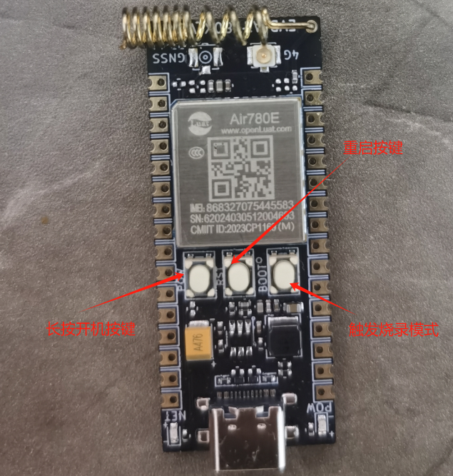
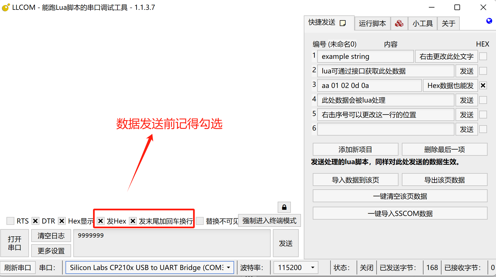

## **一、TCP 概述**

TCP（Transmission Control Protocol，传输控制协议）是一种面向连接的、可靠的、基于字节流的传输层通信协议。它主要用于在不可靠的网络环境中提供稳定的数据传输服务，确保数据能够按照顺序、无错误地到达接收端。TCP 通过三次握手建立连接，使用滑动窗口进行流量控制，以及通过校验和、确认应答、超时重传等机制来保证数据的可靠性。它是互联网协议套件（TCP/IP 协议族）的核心组成部分，广泛应用于各种网络应用中。

### 工作原理：

### 1.1 连接建立：TCP 协议使用三次握手协议来建立连接。

- 客户端发送一个 SYN（同步序列编号）报文给服务端，并携带一个随机生成的初始序列号。
- 服务端收到 SYN 报文后，发送一个 SYN+ACK（同步序列编号 + 确认应答）报文给客户端，表示确认收到了客户端的 SYN 报文，并携带自己的初始序列号。
- 客户端收到服务端的 SYN+ACK 报文后，发送一个 ACK（确认应答）报文给服务端，表示确认收到了服务端的 SYN+ACK 报文。至此，TCP 连接建立完成。

### 1.2 数据传输：

在连接建立后，双方就可以开始传输数据了。TCP 协议会将应用层发送的数据分割成适当长度的报文段（通常受该计算机连接的网络的数据链路层的最大传输单元 MTU 的限制），并为每个报文段分配一个序号。接收端在收到报文段后，会按照序号进行排序，并发送确认应答（ACK）给发送端。如果发送端在合理的往返时延（RTT）内未收到确认应答，则会重传对应的报文段。

### 1.3 连接释放：TCP 协议使用四次挥手协议来终止连接。

- 客户端发送一个 FIN（结束）报文给服务端，表示自己想要关闭连接。
- 服务端收到 FIN 报文后，发送一个 ACK 报文给客户端，表示确认收到了客户端的 FIN 报文。此时，客户端到服务端的连接关闭，但服务端到客户端的连接仍然打开。
- 服务端在发送完所有剩余数据后，也发送一个 FIN 报文给客户端，表示自己也想要关闭连接。
- 客户端收到服务端的 FIN 报文后，发送一个 ACK 报文给服务端，表示确认收到了服务端的 FIN 报文。至此，TCP 连接完全关闭。

## 二、准备硬件环境

“古人云：‘工欲善其事，必先利其器。’在深入介绍本功能示例之前，我们首先需要确保以下硬件环境的准备工作已经完成。”

### 2.1 Air780E 开发板

本demo使用的是 Air780E 核心板，如下图所示：


点击链接购买：[Air780E 核心板淘宝购买链接](https://item.taobao.com/item.htm?id=693774140934&pisk=f1eiwOqL25l1_HYiV6D1ize3wN5d5FMjRrpxkx3VT2uIHCCskWm4kysffAEqor4KRRIskGT0ooqi_coq7DWE000qbVr2mmzKQjNtkV3mnoalvaBRelZshA7RyTFdpD4xQco2_VS2Tcnvc89h5lZshq-pu_FUfEDVVdOmgrkET0ir3mkq_MDEmmM2QjJaY2uI0UGAoNueWRjiw4YTC-_opNr-zluaXleFpfR_X2fhTJVn94W--KJ4KcqQreCDEs3zNVh-DyWpIxqEmyc8savgoor7gX2D7GUzmW4jBJS2_4PTWjestFRZqA0iaRlwjdkIgW2nBR7XNkEn7bDL96_tMA4gN4GNOwa0xVU4IX8G4iReapZyhDSYLIOj_DinyhbSB2IHjbEhxMA51foIXaIhxItMPKJlyMjHNEGZAcQR.&spm=a1z10.5-c-s.w4002-24045920841.33.639f1fd1YrS4b6&skuId=5098266470883) ；

此核心板的详细使用说明参考：[Air780E 产品手册](https://docs.openluat.com/air780e/product/) 中的 << 开发板 Core_Air780E 使用说明 VX.X.X.pdf>>，写这篇文章时最新版本的使用说明为：[开发板 Core_Air780E 使用说明 V1.0.5.pdf](https://cdn.openluat-luatcommunity.openluat.com/attachment/20240419155721583_%E5%BC%80%E5%8F%91%E6%9D%BFCore_Air780E%E4%BD%BF%E7%94%A8%E8%AF%B4%E6%98%8EV1.0.5.pdf) ；核心板使用过程中遇到任何问题，可以直接参考这份使用说明 pdf 文档。

### 2.2 SIM 卡

请准备一张可正常上网的 SIM 卡，该卡可以是物联网卡或您的个人手机卡。

**特别提醒：**请确保 SIM 卡未欠费且网络功能正常，以便顺利进行后续操作。

### 2.3 PC 电脑

请准备一台配备 USB 接口且能够正常上网的电脑。

### 2.4 数据通信线

请准备一根用于连接 Air780E 开发板和 PC 电脑的数据线，该数据线将实现业务逻辑的控制与交互。您有两种选择：

- USB 数据线（其一端为 Type-C 接口，用于连接 Air780E 开发板）。通常，这种数据线的外观如下示意图所示：


普通的手机 USB 数据线一般都可以直接使用；

- 数据线是 USB 转 TTL 串口线。通常，这种数据线的外观如下示意图所示：


在本教程中，我们将采用以下数据线配置进行测试和数据查看：

- 第一种：USB 数据线：此数据线不仅用于为测试板供电，还用于查看数据日志。其一端为 Type-C 接口，连接 Air780E 开发板；另一端为标准 USB 接口，连接 PC 电脑。
- 第二种：USB 转 TTL 串口线：此数据线主要用于 TCP-UART 数据的查看。其一端为 USB 接口，连接 PC 电脑；另一端为 TTL 串口接口，连接 Air780E 开发板，以便进行串口通信和数据传输。

### 2.5 组装硬件环境

#### 2.5.1 请按照 SIM 卡槽上的指示方向正确插入 SIM 卡，务必确保插入方向正确，避免插反导致损坏！

通常，插入 SIM 卡的步骤如下：

- 将 SIM 卡的金属接触面朝下，对准卡槽的开口。
- 用力平稳地将 SIM 卡推入卡槽，直至听到“咔嚓”一声，表示 SIM 卡已正确安装到位。


#### 2.5.2 USB 数据线，连接电脑和 Air780E 开发板，如下图所示：


## 三、准备软件环境

“凡事预则立，不预则废。”在详细阐述本功能示例之前，我们需先精心筹备好以下软件环境。

### 3.1 Luatools 工具

要想烧录 AT 固件到 4G 模组中，需要用到合宙的强大的调试工具：Luatools；

下载地址：[Luatools v3 下载调试工具](https://luatos.com/luatools/download/last)。

Luatools 工具集具备以下几大核心功能：

- 一键获取最新固件：自动连接合宙服务器，轻松下载最新的合宙模组固件。
- 固件与脚本烧录：便捷地将固件及脚本文件烧录至目标模组中。
- 串口日志管理：实时查看模组通过串口输出的日志信息，并支持保存功能。
- 串口调试助手：提供简洁的串口调试界面，满足基本的串口通信测试需求。

Luatools 下载之后， 无需安装， 解压到你的硬盘，点击 Luatools_v3.exe 运行，出现如下界面，就代表 Luatools 安装成功了：


### 3.2 烧录代码

首先要说明一点： 脚本代码， 要和固件的 LuatOS-SoC_V1112_EC618_FULL.soc 文件一起烧录。

**整体压缩文件：内含有 文件一：Core 固件 和 文件一：TCP-UART 脚本文件 文件二：TCP 单向认证脚本文件**

**文件三：TCP 断链续连 ，如下图所示。**


#### 3.2.1 **压缩文件：完整文件包**

[右键点我,另存为,下载完整压缩文件包](file/Test_Code_TCP.zip){:target="_blank"}

#### 3.2.2 压缩包内部文件

**文件一：Core 固件**

**文件二：TCP-UART 脚本文件**

**文件三：TCP 单向认证 脚本文件**

**文件四：TCP 断链续连 脚本文件**

#### 3.2.3 **找到烧录的固件文件**

官网下载,底层 core 下载地址：[LuatOS 底层 core](https://docs.openluat.com/air780e/luatos/firmware/)     **注：**本 demo 使用如图所示固件


#### 3.2.4 **正确连接电脑和 4G 模组电路板**

使用带有数据通信功能的数据线，不要使用仅有充电功能的数据线；

#### 3.2.5 **识别 4G 模组的 boot 引脚**

在下载之前，要用模组的 boot 引脚触发下载， 也就是说，要把 4G 模组的 boot 引脚拉到 1.8v，或者直接把 boot 引脚和 VDD_EXT 引脚相连。我们要在按下 BOOT 按键时让模块开机，就可以进入下载模式了。

具体到 Air780E 开发板，

1、当我们模块没开机时，按着 BOOT 键然后长按 PWR 开机。

2、当我们模块开机时，按着 BOOT 键然后点按重启键即可。



#### 3.2.6 **识别电脑的正确端口**

判断是否进入 BOOT 模式：模块上电，此时在电脑的设备管理器中，查看串口设备， 会出现一个端口表示进入了 boot 下载模式，如下图所示：


当设备管理器出现了 3 个连续数字的 com 端口，并且每个数字都大于 4，这时候， 硬件连接上就绪状态，恭喜你，可以进行烧录了！

#### 3.2.7 **新建项目**

首先，确保你的 Luatools 的版本大于或者等于 3.0.6 版本.

在 Luatools 的左上角上有版本显示的，如图所示：


Luatools 版本没问题的话， 就点击 Luatools 右上角的“项目管理测试”按钮，如下图所示：


这时会弹出项目管理和烧录管理的对话框，如下图：


#### 3.2.8 **开始烧录**

选择 780E 板子对应的底层 core 和刚改的 main.lua 脚本文件。下载到板子中。


点击下载后，我们需要进入 boot 模式才能正常下载。


### 3.3 合宙 TCP/UDP web 测试工具

为了方便测试，合宙提供了免费的不可商用的 TCP/UDP web 测试工具：[合宙 TCP/UDP web 工具 (](https://netlab.luatos.com/)[luatos.com](https://netlab.luatos.com/)[)](https://netlab.luatos.com/)

详细使用说明参考：[合宙 TCP/UDP web 测试工具使用说明](https://docs.openluat.com/TCPUDP_Test/) 。


### 3.4 PC 端串口工具

LLCOM 的下载链接：[LLCOM](https://llcom.papapoi.com/index.html) ，详细使用说明可以直接参考下载网站。

- **串口接线方式：Air780 提供三个 Uart.**

**MAIN_UART：**通用串口，可用于 AT 命令和数据传输 最大波特率 921600bps，默认波特率自适应 9600-115200bps 支持硬件流控（RTS/CTS）

**AUX_UART：**通用串口

**DBG_UART：**用于输出调试信息


**注意：**

- 以上 PinOut 图示, 对应的 V1.8 的开发板，版本号在板子丝印上可查阅。
- V1.4 的开发板, 由于 LCD 脚有差异, 图示的 LCD_RS/LCD_CLK 实际位于开发板 管脚编号 06/05 的 UART2/AUX_UART 脚, 不在编号 11/14 脚。
- V1.8 的开发板 17 脚改为 VBAT.

#### 3.4.1 LLC**OM 工具设置：初始配置**


#### 3.4.2 **数据发送前的配置**



## 四、TCP-UART 透传实现的概述

本小节教你怎么使用 luatos 脚本语言，就可以让合宙 4G 模组连接上一个 TCP 服务器，并且模组和服务器之间实现数据的双向传输！

### 4.1 本教程实现的功能定义：

- 通过网页端启动一个 TCP 服务器；
- 4G 模组插卡开机后，连接上 TCP 服务器；
- 4G 模组向 TCP  服务器发送** ****"TCP  CONNECT"**，服务器可以收到数据并且在网页端显示；
- TCP 服务器网页端向 4G 模组发送 `data from TCP  server`，4G 模组可以收到数据并且通过串口输出显示；

### 4.2 文章内容引用

- 780E 开发板软硬件资料 ： [Air780E 产品手册 ](https://docs.openluat.com/air780e/product/)
- 以上接口函数不做详细介绍，可通过此链接查看具体介绍：[socket - 网络接口 - LuatOS 文档](https://wiki.luatos.com/api/socket.html)

### 4.3 核心脚本代码详解

#### 4.3.1 **串口初始化**

**本文示例**：串口使用 MAIN_UART(uart1)

```lua
--初始化  
local uartid = 1 -- 根据实际设备选取不同的uartid
uart.setup(
    uartid,--串口id
    115200,--波特率
    8,--数据位
    1--停止位
)
```

#### 4.3.2 **数据接收回调：搭建响应桥梁**

这里使用 uart.rx 接口，和以 zbuff 的方式存储从 uart1 外部串口收到的数据 -- 收取数据会触发回调, 这里的"receive" 是固定值不要修改。。

```lua
uart.on(uartid, "receive", function(id, len)
     while true do
-- 接收串口收到的数据，并赋值到uart_rx_buff
        local len = uart.rx(id, uart_rx_buff)  
               if len <= 0 then    -- 接收到的字节长度为0 则退出
                    break
              end
-- 如果已经在线了，则发送socket.EVENT消息来打断任务里的阻塞等待状态，让任务循环继续
               if connect_state then
 sys_send(taskName, socket.EVENT, 0)
               end
        end
  end)
```

#### 4.3.3 **TCP 网络配置：铺就数据通道**

```lua
----------------------------------------------网络配置-------------------------------------------------
local libnet = require "libnet"  -- libnet库，支持tcp、udp协议所用的同步阻塞接口
local ip = "112.125.89.8"         -- 连接TCP服务器的ip地址
local port = 46244               -- 连接TCP服务器的端口
local netCB = nil                  -- socket服务的回调函数
local connect_state = false         -- 连接状态 true:已连接   false:未连接
local protocol = false             -- 通讯协议 true:UDP协议  false:TCP协议
local ssl = false                    -- 加密传输 true:加密     false:不加密
local tx_buff = zbuff.create(1024)  -- 发送至TCP服务器的数据
=======================================================
sys.waitUntil("IP_READY")                -- 等待联网成功
 netCB = socket.create(nil, taskName)     -- 创建socket对象
 socket.debug(netCB, true)                -- 打开调试日志
 socket.config(netCB, nil, protocol, ssl)      -- 此配置为TCP连接，无SSL加密
```

#### 4.3.4 **TCP 至串口透传：数据无缝流转**

```lua
succ, param, _, _ = socket.rx(netCB, rx_buff)   -- 接收数据
  if not succ then
     log.info("服务器断开了", succ, param, ip, port)
     break
 end
  if rx_buff:used() > 0 then
    log.info("收到服务器数据，长度", rx_buff:used())
    uart.tx(uartid, rx_buff)    -- 从服务器收到的数据转发 从串口输出
    rx_buff:del()
  end
```

#### 4.3.5 **串口至 TCP 反透传：信息双向传递**

```lua
tx_buff:copy(nil, uart_rx_buff)         -- 将串口数据赋值给TCP待发送数据的buff中
uart_rx_buff:del()                      -- 清除串口buff的数据长度
 if tx_buff:used() > 0 then
 log.info("发送到服务器数据，长度", tx_buff:used())
local result = libnet.tx(taskName, 0, netCB, tx_buff)   -- 发送数据
 if not result then
 log.info("发送失败了", result, param)
 break
end
 end
tx_buff:del()
```

### 4.4 **成果演示与深度解析：视频 + 图文全面展示**

#### 4.4.1 **成果运行精彩呈现**


#### 4.4.2 **演示视频生动展示**

<video controls src="file/TCP-UART.mp4"></video>

#### 4.4.3 **完整实例深度剖析**

```lua
-- LuaTools需要PROJECT和VERSION这两个信息
PROJECT = "uart_tcp"
VERSION = "1.0.0"

log.info("main", PROJECT, VERSION)

-- 引入必要的库文件(lua编写), 内部库不需要require
sys = require("sys")

_G.sysplus = require("sysplus")
local taskName = "TCP_TASK"             -- sysplus库用到的任务名称，也作为任务id

if wdt then
    --添加硬狗防止程序卡死，在支持的设备上启用这个功能
    wdt.init(9000)--初始化watchdog设置为9s
    sys.timerLoopStart(wdt.feed, 3000)--3s喂一次狗
end
local uartid = 1 -- 根据实际设备选取不同的uartid
local uart_rx_buff = zbuff.create(1024)     -- 串口接收到的数据
local libnet = require "libnet"         -- libnet库，支持tcp、udp协议所用的同步阻塞接口
local ip = "112.125.89.8"               -- 连接tcp服务器的ip地址
local port = 46244                 -- 连接tcp服务器的端口
local netCB = nil                       -- socket服务的回调函数
local connect_state = false             -- 连接状态 true:已连接   false:未连接
local protocol = false                  -- 通讯协议 true:UDP协议  false:TCP协议
local ssl = false                       -- 加密传输 true:加密     false:不加密
local tx_buff = zbuff.create(1024)      -- 发送至tcp服务器的数据
local rx_buff = zbuff.create(1024)      -- 从tcp服务器接收到的数据

--初始化
uart.setup(
    uartid,--串口id
    115200,--波特率
    8,--数据位
    1--停止位
)
function TCP_TASK()
    -- 打印一下连接的目标ip和端口号
    log.info("connect ip: ", ip, "port:", port)

    sys.waitUntil("IP_READY")                -- 等待联网成功
    netCB = socket.create(nil, taskName)     -- 创建socket对象
    socket.debug(netCB, true)                -- 打开调试日志
    socket.config(netCB, nil, protocol, ssl)      -- 此配置为TCP连接，无SSL加密

    -- 串口和TCP服务器的交互逻辑
    while true do
        -- 连接服务器，返回是否连接成功
        result = libnet.connect(taskName, 15000, netCB, ip, port)

        -- 收取数据会触发回调, 这里的"receive" 是固定值不要修改。
        uart.on(uartid, "receive", function(id, len)
            while true do
                local len = uart.rx(id, uart_rx_buff)   -- 接收串口收到的数据，并赋值到uart_rx_buff
                if len <= 0 then    -- 接收到的字节长度为0 则退出
                    break
                end
                -- 如果已经在线了，则发送socket.EVENT消息来打断任务里的阻塞等待状态，让任务循环继续
                if connect_state then
                    sys_send(taskName, socket.EVENT, 0)
                end
            end
        end)

        -- 如果连接成功，则改变连接状态参数，并且随便发一条数据到服务器，看服务器能不能收到
        if result then
            connect_state = true
            libnet.tx(taskName, 0, netCB, "TCP  CONNECT")
        end

        -- 连接上服务器后，等待处理接收服务器下行至模块的数据 和 发送串口的数据到服务器
        while result do
            succ, param, _, _ = socket.rx(netCB, rx_buff)   -- 接收数据
            if not succ then
                log.info("服务器断开了", succ, param, ip, port)
                break
            end

            if rx_buff:used() > 0 then
                log.info("收到服务器数据，长度", rx_buff:used())

                uart.tx(uartid, rx_buff)    -- 从服务器收到的数据转发 从串口输出
                rx_buff:del()
            end

            tx_buff:copy(nil, uart_rx_buff)         -- 将串口数据赋值给tcp待发送数据的buff中
            uart_rx_buff:del()                      -- 清除串口buff的数据长度
            if tx_buff:used() > 0 then
                log.info("发送到服务器数据，长度", tx_buff:used())
                local result = libnet.tx(taskName, 0, netCB, tx_buff)   -- 发送数据
                if not result then
                    log.info("发送失败了", result, param)
                    break
                end
            end
            tx_buff:del()

            -- 如果zbuff对象长度超出，需要重新分配下空间
            if uart_rx_buff:len() > 1024 then
                uart_rx_buff:resize(1024)
            end
            if tx_buff:len() > 1024 then
                tx_buff:resize(1024)
            end
            if rx_buff:len() > 1024 then
                rx_buff:resize(1024)
            end
            log.info(rtos.meminfo("sys"))   -- 打印系统内存

            -- 阻塞等待新的消息到来，比如服务器下发，串口接收到数据
            result, param = libnet.wait(taskName, 15000, netCB)
            if not result then
                log.info("服务器断开了", result, param)
                break
            end
        end

        -- 服务器断开后的行动，由于while true的影响，所以会再次重新执行进行 重新连接。
        connect_state = false
        libnet.close(d1Name, 5000, netCB)
        tx_buff:clear(0)
        rx_buff:clear(0)
        sys.wait(1000)
    end

end

-- libnet库依赖于sysplus，所以只能通过sysplus.taskInitEx创建的任务函数中运行
sysplus.taskInitEx(TCP_TASK, taskName, netCB)

-- 用户代码已结束---------------------------------------------
-- 结尾总是这一句
sys.run()
-- sys.run()之后后面不要加任何语句!!!!!
```

## 五、TCP 单向认证

TCP（Transmission Control Protocol，传输控制协议）本身是一种面向连接的、可靠的、基于字节流的传输层通信协议，它并不直接涉及认证过程。然而，在 TCP 连接的基础上，可以实现各种安全机制，其中包括认证。在网络通信中，“单向认证”指的是只对通信某一方的身份合法性进行认证。

**本小节教你怎么使用 luatos 脚本语言，就可以让合宙 4G 模组和 TCP 服务器进行单向认证**

### 5.1 本教程实现的功能定义：

- 通过网页端启动一个 TCP 服务器；
- 4G 模组插卡开机后，连接上 TCP 服务器；
- 4G 模组向 TCP  服务器发送** ****"TCP  CONNECT"**，服务器可以收到数据并且在网页端显示；
- TCP 服务器网页端向 4G 模组发送 `data from TCP  server`，4G 模组可以收到数据并且通过串口输出显示；

### 5.2 文章内容引用

- 780E 开发板软硬件资料 ： [Air780E 产品手册 ](https://docs.openluat.com/air780e/product/)
- 以上接口函数不做详细介绍，可通过此链接查看具体介绍：[socket - 网络接口 - LuatOS 文档](https://wiki.luatos.com/api/socket.html)

### 5.3 核心脚本代码详解

#### 5.3.1 **串口初始化**

**本文示例**：串口使用 MAIN_UART(uart1)

```lua
--初始化  
local uartid = 1 -- 根据实际设备选取不同的uartid
uart.setup(
    uartid,--串口id
    115200,--波特率
    8,--数据位
    1--停止位
)
```

#### 5.3.2 **数据接收回调：搭建响应桥梁**

这里使用 uart.rx 接口，和以 zbuff 的方式存储从 uart1 外部串口收到的数据 -- 收取数据会触发回调, 这里的"receive" 是固定值不要修改。

```lua
uart.on(uartid, "receive", function(id, len)
     while true do
-- 接收串口收到的数据，并赋值到uart_rx_buff
        local len = uart.rx(id, uart_rx_buff)  
               if len <= 0 then    -- 接收到的字节长度为0 则退出
                    break
              end
-- 如果已经在线了，则发送socket.EVENT消息来打断任务里的阻塞等待状态，让任务循环继续
               if connect_state then
 sys_send(taskName, socket.EVENT, 0)
               end
        end
  end)
```

#### 5.3.3 **TCP 网络配置：铺就数据通道--------注：SSL 填写 true**

```lua
----------------------------------------------网络配置-------------------------------------------------
local libnet = require "libnet"  -- libnet库，支持tcp、udp协议所用的同步阻塞接口
local ip = "112.125.89.8"         -- 连接TCP服务器的ip地址
local port = 46244               -- 连接TCP服务器的端口
local netCB = nil                  -- socket服务的回调函数
local connect_state = false         -- 连接状态 true:已连接   false:未连接
local protocol = false             -- 通讯协议 true:UDP协议  false:TCP协议
local ssl = true**   **             -- 加密传输 true:加密     false:不加密
local tx_buff = zbuff.create(1024)  -- 发送至TCP服务器的数据
=======================================================
sys.waitUntil("IP_READY")                -- 等待联网成功
 netCB = socket.create(nil, taskName)     -- 创建socket对象
 socket.debug(netCB, true)                -- 打开调试日志
 socket.config(netCB, nil, protocol, ssl)      -- 此配置为TCP连接，无SSL加密
```

#### 5.3.4 **TCP 至串口透传：数据无缝流转**

```lua
succ, param, _, _ = socket.rx(netCB, rx_buff)   -- 接收数据
  if not succ then
     log.info("服务器断开了", succ, param, ip, port)
     break
 end
  if rx_buff:used() > 0 then
    log.info("收到服务器数据，长度", rx_buff:used())
    uart.tx(uartid, rx_buff)    -- 从服务器收到的数据转发 从串口输出
    rx_buff:del()
  end
```

#### 5.3.5 **串口至 TCP 反透传：信息双向传递**

```lua
tx_buff:copy(nil, uart_rx_buff)         -- 将串口数据赋值给TCP待发送数据的buff中
uart_rx_buff:del()                      -- 清除串口buff的数据长度
 if tx_buff:used() > 0 then
 log.info("发送到服务器数据，长度", tx_buff:used())
local result = libnet.tx(taskName, 0, netCB, tx_buff)   -- 发送数据
 if not result then
 log.info("发送失败了", result, param)
 break
end
 end
tx_buff:del()
```

### 5.4 **成果演示与深度解析：视频 + 图文全面展示**

#### 5.4.1 **成果运行精彩呈现**


#### 5.4.2 **串口数据展示**


#### 5.4.3 **演示视频生动展示**
<video controls src="file/TCP单向认证.mp4"></video>
#### 5.4.4 **完整实例深度剖析**

```lua
-- main.lua文件

-- LuaTools需要PROJECT和VERSION这两个信息
PROJECT = "uart_tcp"
VERSION = "1.0.0"

log.info("main", PROJECT, VERSION)

-- 引入必要的库文件(lua编写), 内部库不需要require
sys = require("sys")

_G.sysplus = require("sysplus")
local taskName = "TCP_TASK"             -- sysplus库用到的任务名称，也作为任务id

if wdt then
    --添加硬狗防止程序卡死，在支持的设备上启用这个功能
    wdt.init(9000)--初始化watchdog设置为9s
    sys.timerLoopStart(wdt.feed, 3000)--3s喂一次狗
end

local uartid = 1 -- 根据实际设备选取不同的uartid
local uart_rx_buff = zbuff.create(1024)     -- 串口接收到的数据

local libnet = require "libnet"         -- libnet库，支持tcp、udp协议所用的同步阻塞接口
local ip = "112.125.89.8"               -- 连接tcp服务器的ip地址
local port = 46428            -- 连接tcp服务器的端口
local netCB = nil                       -- socket服务的回调函数
local connect_state = false             -- 连接状态 true:已连接   false:未连接
local protocol = false                  -- 通讯协议 true:UDP协议  false:TCP协议
local ssl = true                     -- 加密传输 true:加密     false:不加密
local tx_buff = zbuff.create(1024)      -- 发送至tcp服务器的数据
local rx_buff = zbuff.create(1024)      -- 从tcp服务器接收到的数据

--初始化
uart.setup(
    uartid,--串口id
    115200,--波特率
    8,--数据位
    1--停止位
)

function TCP_TASK()
    -- 打印一下连接的目标ip和端口号
    log.info("connect ip: ", ip, "port:", port)

    sys.waitUntil("IP_READY")                -- 等待联网成功
    netCB = socket.create(nil, taskName)     -- 创建socket对象
    socket.debug(netCB, true)                -- 打开调试日志
    socket.config(netCB, nil, protocol, ssl)      -- 此配置为TCP连接，无SSL加密

    -- 串口和TCP服务器的交互逻辑
    while true do
        -- 连接服务器，返回是否连接成功
        result = libnet.connect(taskName, 15000, netCB, ip, port)

        -- 收取数据会触发回调, 这里的"receive" 是固定值不要修改。
        uart.on(uartid, "receive", function(id, len)
            while true do
                local len = uart.rx(id, uart_rx_buff)   -- 接收串口收到的数据，并赋值到uart_rx_buff
                if len <= 0 then    -- 接收到的字节长度为0 则退出
                    break
                end
                -- 如果已经在线了，则发送socket.EVENT消息来打断任务里的阻塞等待状态，让任务循环继续
                if connect_state then
                    sys_send(taskName, socket.EVENT, 0)
                end
            end
        end)

        -- 如果连接成功，则改变连接状态参数，并且随便发一条数据到服务器，看服务器能不能收到
        if result then
            connect_state = true
            libnet.tx(taskName, 0, netCB, "TCP  CONNECT")
        end

        -- 连接上服务器后，等待处理接收服务器下行至模块的数据 和 发送串口的数据到服务器
        while result do
            succ, param, _, _ = socket.rx(netCB, rx_buff)   -- 接收数据
            if not succ then
                log.info("服务器断开了", succ, param, ip, port)
                break
            end

            if rx_buff:used() > 0 then
                log.info("收到服务器数据，长度", rx_buff:used())

                uart.tx(uartid, rx_buff)    -- 从服务器收到的数据转发 从串口输出
                rx_buff:del()
            end

            tx_buff:copy(nil, uart_rx_buff)         -- 将串口数据赋值给tcp待发送数据的buff中
            uart_rx_buff:del()                      -- 清除串口buff的数据长度
            if tx_buff:used() > 0 then
                log.info("发送到服务器数据，长度", tx_buff:used())
                local result = libnet.tx(taskName, 0, netCB, tx_buff)   -- 发送数据
                if not result then
                    log.info("发送失败了", result, param)
                    break
                end
            end
            tx_buff:del()

            -- 如果zbuff对象长度超出，需要重新分配下空间
            if uart_rx_buff:len() > 1024 then
                uart_rx_buff:resize(1024)
            end
            if tx_buff:len() > 1024 then
                tx_buff:resize(1024)
            end
            if rx_buff:len() > 1024 then
                rx_buff:resize(1024)
            end
            log.info(rtos.meminfo("sys"))   -- 打印系统内存

            -- 阻塞等待新的消息到来，比如服务器下发，串口接收到数据
            result, param = libnet.wait(taskName, 15000, netCB)
            if not result then
                log.info("服务器断开了", result, param)
                break
            end
        end

        -- 服务器断开后的行动，由于while true的影响，所以会再次重新执行进行 重新连接。
        connect_state = false
        libnet.close(d1Name, 5000, netCB)
        tx_buff:clear(0)
        rx_buff:clear(0)
        sys.wait(1000)
    end

end

-- libnet库依赖于sysplus，所以只能通过sysplus.taskInitEx创建的任务函数中运行
sysplus.taskInitEx(TCP_TASK, taskName, netCB)

-- 用户代码已结束---------------------------------------------
-- 结尾总是这一句
sys.run()
-- sys.run()之后后面不要加任何语句!!!!!
```

## 六、TCP 双向认证

（待更新）

## 七、TCP 断链续连

TCP（传输控制协议）确保数据在网络中可靠传输。当 TCP 连接因网络问题、设备故障等原因断开时，需要重新建立连接以继续数据传输。

### 7.1 本教程实现的功能定义：

断链：TCP 连接断开，可能由于网络不稳定、设备故障等。

续连：重新建立 TCP 连接。通常通过“三次握手”过程：

- 客户端请求连接。
- 服务器响应并同意连接。
- 客户端确认连接建立。

### 7.2 文章内容引用

- 780E 开发板软硬件资料 ： [Air780E 产品手册 ](https://docs.openluat.com/air780e/product/)
- 以上接口函数不做详细介绍，可通过此链接查看具体介绍：[socket - 网络接口 - LuatOS 文档](https://wiki.luatos.com/api/socket.html)

### 7.3 核心脚本代码详解

#### 7.3.1 **串口初始化**

**本文示例**：串口使用 MAIN_UART(uart1)

```lua
--初始化  
local uartid = 1 -- 根据实际设备选取不同的uartid
uart.setup(
    uartid,--串口id
    115200,--波特率
    8,--数据位
    1--停止位
)
```

#### 7.3.2 **数据接收回调：搭建响应桥梁**

这里使用 uart.rx 接口，和以 zbuff 的方式存储从 uart1 外部串口收到的数据 -- 收取数据会触发回调, 这里的"receive" 是固定值不要修改。

```lua
uart.on(uartid, "receive", function(id, len)
     while true do
-- 接收串口收到的数据，并赋值到uart_rx_buff
        local len = uart.rx(id, uart_rx_buff)  
               if len <= 0 then    -- 接收到的字节长度为0 则退出
                    break
              end
-- 如果已经在线了，则发送socket.EVENT消息来打断任务里的阻塞等待状态，让任务循环继续
               if connect_state then
 sys_send(taskName, socket.EVENT, 0)
               end
        end
  end)
```

#### 7.3.3 **TCP 网络配置：铺就数据通道--------注：需要认证 SSL 填写：true，不需要 填写： false。**

```lua
----------------------------------------------网络配置-------------------------------------------------
local libnet = require "libnet"  -- libnet库，支持tcp、udp协议所用的同步阻塞接口
local ip = "112.125.89.8"         -- 连接TCP服务器的ip地址
local port = 46244               -- 连接TCP服务器的端口
local netCB = nil                  -- socket服务的回调函数
local connect_state = false         -- 连接状态 true:已连接   false:未连接
local protocol = false             -- 通讯协议 true:UDP协议  false:TCP协议
local ssl = true** **                -- 加密传输 true:加密     false:不加密
local tx_buff = zbuff.create(1024)  -- 发送至TCP服务器的数据
=======================================================
sys.waitUntil("IP_READY")                -- 等待联网成功
 netCB = socket.create(nil, taskName)     -- 创建socket对象
 socket.debug(netCB, true)                -- 打开调试日志
 socket.config(netCB, nil, protocol, ssl)      -- 此配置为TCP连接，无SSL加密
```

#### 7.3.4 **TCP 至串口透传：数据无缝流转**

```lua
succ, param, _, _ = socket.rx(netCB, rx_buff)   -- 接收数据
  if not succ then
     log.info("服务器断开了", succ, param, ip, port)
     break
 end
  if rx_buff:used() > 0 then
    log.info("收到服务器数据，长度", rx_buff:used())
    uart.tx(uartid, rx_buff)    -- 从服务器收到的数据转发 从串口输出
    rx_buff:del()
  end
```

#### 7.3.5 **串口至 TCP 反透传：信息双向传递**

```lua
tx_buff:copy(nil, uart_rx_buff)         -- 将串口数据赋值给TCP待发送数据的buff中
uart_rx_buff:del()                      -- 清除串口buff的数据长度
 if tx_buff:used() > 0 then
 log.info("发送到服务器数据，长度", tx_buff:used())
local result = libnet.tx(taskName, 0, netCB, tx_buff)   -- 发送数据
 if not result then
 log.info("发送失败了", result, param)
 break
end
 end
tx_buff:del()
```

#### 7.3.6 断链续连

```lua
while true do
        -- 连接服务器，返回是否连接成功
        result = libnet.connect(taskName, 15000, netCB, ip, port)
        -- 收取数据会触发回调, 这里的"receive" 是固定值不要修改。
        uart.on(uartid, "receive", function(id, len)
            while true do
                local len = uart.rx(id, uart_rx_buff)   -- 接收串口收到的数据，并赋值到uart_rx_buff
                if len <= 0 then    -- 接收到的字节长度为0 则退出
                    break
                end
                -- 如果已经在线了，则发送socket.EVENT消息来打断任务里的阻塞等待状态，让任务循环继续
                if connect_state then
                    sys_send(taskName, socket.EVENT, 0)
                end
            end
        end)
        -- 如果连接成功，则改变连接状态参数，并且随便发一条数据到服务器，看服务器能不能收到
        if result then
            connect_state = true
            libnet.tx(taskName, 0, netCB, "TCP  CONNECT")
        end
        -- 连接上服务器后，等待处理接收服务器下行至模块的数据 和 发送串口的数据到服务器
        while result do
            succ, param, _, _ = socket.rx(netCB, rx_buff)   -- 接收数据
            if not succ then
                log.info("服务器断开了", succ, param, ip, port)
                break
            end
            if rx_buff:used() > 0 then
                log.info("收到服务器数据，长度", rx_buff:used())

                uart.tx(uartid, rx_buff)    -- 从服务器收到的数据转发 从串口输出
                rx_buff:del()
            end

            tx_buff:copy(nil, uart_rx_buff)         -- 将串口数据赋值给tcp待发送数据的buff中
            uart_rx_buff:del()                      -- 清除串口buff的数据长度
            if tx_buff:used() > 0 then
                log.info("发送到服务器数据，长度", tx_buff:used())
                local result = libnet.tx(taskName, 0, netCB, tx_buff)   -- 发送数据
                if not result then
                    log.info("发送失败了", result, param)
                    break
                end
            end
            tx_buff:del()
            -- 如果zbuff对象长度超出，需要重新分配下空间
            if uart_rx_buff:len() > 1024 then
                uart_rx_buff:resize(1024)
            end
            if tx_buff:len() > 1024 then
                tx_buff:resize(1024)
            end
            if rx_buff:len() > 1024 then
                rx_buff:resize(1024)
            end
            log.info(rtos.meminfo("sys"))   -- 打印系统内存
            -- 阻塞等待新的消息到来，比如服务器下发，串口接收到数据
            result, param = libnet.wait(taskName, 15000, netCB)
            if not result then
                log.info("服务器断开了", result, param)
                break
            end
        end
  -- 服务器断开后的行动，由于while true的影响，所以会再次重新执行进行 重新连接。
```

### 7.4 **成果演示与深度解析：视频 + 图文全**

#### 7.4.1 **成果运行精彩呈现**


#### 7.4.2 **演示视频生动展示**
<video controls src="file/TCP断链续连.mp4"></video>
#### 7.4.3 **完整实例深度剖析**

```lua
-- main.lua文件

-- LuaTools需要PROJECT和VERSION这两个信息
PROJECT = "uart_tcp"
VERSION = "1.0.0"

log.info("main", PROJECT, VERSION)

-- 引入必要的库文件(lua编写), 内部库不需要require
sys = require("sys")

_G.sysplus = require("sysplus")
local taskName = "TCP_TASK"             -- sysplus库用到的任务名称，也作为任务id

if wdt then
    --添加硬狗防止程序卡死，在支持的设备上启用这个功能
    wdt.init(9000)--初始化watchdog设置为9s
    sys.timerLoopStart(wdt.feed, 3000)--3s喂一次狗
end

local uartid = 1 -- 根据实际设备选取不同的uartid
local uart_rx_buff = zbuff.create(1024)     -- 串口接收到的数据

local libnet = require "libnet"         -- libnet库，支持tcp、udp协议所用的同步阻塞接口
local ip = "112.125.89.8"               -- 连接tcp服务器的ip地址
local port = 47494                -- 连接tcp服务器的端口
local netCB = nil                       -- socket服务的回调函数
local connect_state = false             -- 连接状态 true:已连接   false:未连接
local protocol = false                  -- 通讯协议 true:UDP协议  false:TCP协议
local ssl = false                       -- 加密传输 true:加密     false:不加密
local tx_buff = zbuff.create(1024)      -- 发送至tcp服务器的数据
local rx_buff = zbuff.create(1024)      -- 从tcp服务器接收到的数据

--初始化
uart.setup(
    uartid,--串口id
    115200,--波特率
    8,--数据位
    1--停止位
)

function TCP_TASK()
    -- 打印一下连接的目标ip和端口号
    log.info("connect ip: ", ip, "port:", port)

    sys.waitUntil("IP_READY")                -- 等待联网成功
    netCB = socket.create(nil, taskName)     -- 创建socket对象
    socket.debug(netCB, true)                -- 打开调试日志
    socket.config(netCB, nil, protocol, ssl)      -- 此配置为TCP连接，无SSL加密

    -- 串口和TCP服务器的交互逻辑
    while true do
        -- 连接服务器，返回是否连接成功
        result = libnet.connect(taskName, 15000, netCB, ip, port)

        -- 收取数据会触发回调, 这里的"receive" 是固定值不要修改。
        uart.on(uartid, "receive", function(id, len)
            while true do
                local len = uart.rx(id, uart_rx_buff)   -- 接收串口收到的数据，并赋值到uart_rx_buff
                if len <= 0 then    -- 接收到的字节长度为0 则退出
                    break
                end
                -- 如果已经在线了，则发送socket.EVENT消息来打断任务里的阻塞等待状态，让任务循环继续
                if connect_state then
                    sys_send(taskName, socket.EVENT, 0)
                end
            end
        end)

        -- 如果连接成功，则改变连接状态参数，并且随便发一条数据到服务器，看服务器能不能收到
        if result then
            connect_state = true
            libnet.tx(taskName, 0, netCB, "TCP  CONNECT")
        end

        -- 连接上服务器后，等待处理接收服务器下行至模块的数据 和 发送串口的数据到服务器
        while result do
            succ, param, _, _ = socket.rx(netCB, rx_buff)   -- 接收数据
            if not succ then
                log.info("服务器断开了", succ, param, ip, port)
                break
            end

            if rx_buff:used() > 0 then
                log.info("收到服务器数据，长度", rx_buff:used())

                uart.tx(uartid, rx_buff)    -- 从服务器收到的数据转发 从串口输出
                rx_buff:del()
            end

            tx_buff:copy(nil, uart_rx_buff)         -- 将串口数据赋值给tcp待发送数据的buff中
            uart_rx_buff:del()                      -- 清除串口buff的数据长度
            if tx_buff:used() > 0 then
                log.info("发送到服务器数据，长度", tx_buff:used())
                local result = libnet.tx(taskName, 0, netCB, tx_buff)   -- 发送数据
                if not result then
                    log.info("发送失败了", result, param)
                    break
                end
            end
            tx_buff:del()

            -- 如果zbuff对象长度超出，需要重新分配下空间
            if uart_rx_buff:len() > 1024 then
                uart_rx_buff:resize(1024)
            end
            if tx_buff:len() > 1024 then
                tx_buff:resize(1024)
            end
            if rx_buff:len() > 1024 then
                rx_buff:resize(1024)
            end
            log.info(rtos.meminfo("sys"))   -- 打印系统内存

            -- 阻塞等待新的消息到来，比如服务器下发，串口接收到数据
            result, param = libnet.wait(taskName, 15000, netCB)
            if not result then
                log.info("服务器断开了", result, param)
                break
            end
        end

        -- 服务器断开后的行动，由于while true的影响，所以会再次重新执行进行 重新连接。
        connect_state = false
        libnet.close(d1Name, 5000, netCB)
        tx_buff:clear(0)
        rx_buff:clear(0)
        sys.wait(1000)
    end

end

-- libnet库依赖于sysplus，所以只能通过sysplus.taskInitEx创建的任务函数中运行
sysplus.taskInitEx(TCP_TASK, taskName, netCB)

-- 用户代码已结束---------------------------------------------
-- 结尾总是这一句
sys.run()
-- sys.run()之后后面不要加任何语句!!!!!
```

## 八、TCP 低功耗唤醒

（待更新）

## 九、总结

TCP（传输控制协议）和 UDP（用户数据报协议）是 OSI 模型中运输层的两种协议。TCP 是面向连接的可靠传输协议，通过复杂的拥塞控制和重传机制确保数据无差错、不丢失、不重复且有序地到达；而 UDP 则是无连接的不可靠传输协议，它尽最大努力交付数据，不保证数据的可靠性，但具有较好的实时性和较高的工作效率，适用于对高速传输和实时性要求较高的通信场景。

## 十、常见问题

** sys.waitUntil**("IP_READY")     -- 等待联网成功

好多新入手的可能看到此函数 不理解 在整个脚本里面没有发布此事件 sys.publish（"IP_READY"）   为什么 后面还联网成功了？

此处解释一下 模组上电以后固件内部联网成功以后会自动发布 sys.publish（"IP_READY")。

## 十一、扩展

### 11.1 TCP 单向认证

- 定义：单向认证是指在通信过程中，只有一方（通常是服务器）对另一方（通常是客户端）进行身份验证。
- 应用：在 TCP 连接中，单向认证常用于客户端向服务器发起请求时，服务器验证客户端的身份。
- 特点：实现简单，但安全性相对较低，因为只验证了一方的身份。

### 11.2 TCP 双向认证

- 定义：双向认证是指通信双方都需要对对方进行身份验证，只有双方都通过对方的认证请求时，通信才会被允许。
- 应用：在需要高安全性的场景中，如金融服务、医疗信息传输等，TCP 双向认证被广泛应用。
- 特点：安全性高，但实现复杂，且可能带来一定的性能开销。

### 11.3 获取或设置 APN

注：专属可需要添加白名单才能使用

1. 在 LuatOS 脚本中，使用 `mobile.setApn("<APN>")` 函数来设置 APN。
2. 调用 `mobile.connect()` 函数来激活网络连接。
3. 使用 `mobile.getIp()` 函数来查询设备的 IP 地址，确认连接状态

```lua
mobile.apn(index, cid, new_apn_name, user_name, password, ip_type, protocol)
获取或设置APN，设置APN必须在入网前就设置好，比如在SIM卡识别完成前就设置好
**参数**
传入值类型                                解释

int                  编号,默认0. 在支持双卡的模块上才会出现0或1的情况

int                  cid, 默认0，如果要用非默认APN来激活，必须>0

string            新的APN,不填就是获取APN, 填了就是设置APN, 是否支持设置取决于底层实现

string            新的APN的username,如果APN不是空,那必须填写,如果没有留个空字符串””。如果APN是空的，那可以nil

string             新的APN的password,如果APN不是空,那必须填写,如果没有留个空字符串””。如果APN是空的，那可以nil

int                  激活APN时的IP TYPE,1=IPV4 2=IPV6 3=IPV4V6,默认是1

int                  激活APN时,如果需要username和password,就要写鉴权协议类型,1~3,默认3,代表1和2都尝试一下。不需要鉴权的写0

boolean            是否删除APN,true是,其他都否,只有参数3新的APN不是string的时候才有效果
**返回值**
返回值类型                解释

string                获取到的默认APN值,失败返回nil
例子：
mobile.apn(0,1,"cmiot","","",nil,0) -- 移动公网卡设置APN为cmiot,一般不用设置mobile.apn(0,1,"name","user","password",nil,3) -- 专网卡设置的demo，name，user，password联系卡商获取
```

## 给读者的话

> 本篇文章由`永仔`开发；
>
> 本篇文章描述的内容，如果有错误、细节缺失、细节不清晰或者其他任何问题，总之就是无法解决您遇到的问题；
>
> 请登录[合宙技术交流论坛](https://chat.openluat.com/)，点击[文档找错赢奖金-Air780E-LuatOS-TCP通信](https://chat.openluat.com/#/page/matter?125=1846214486504112129&126=%E6%96%87%E6%A1%A3%E6%89%BE%E9%94%99%E8%B5%A2%E5%A5%96%E9%87%91-Air780E-LuatOS-%E8%BD%AF%E4%BB%B6demo-%E7%BD%91%E7%BB%9C%E9%A9%B1%E5%8A%A8-TCP%E9%80%9A%E4%BF%A1&askid=1846214486504112129)；
>
> 用截图标注+文字描述的方式跟帖回复，记录清楚您发现的问题；
>
> 我们会迅速核实并且修改文档；
>
> 同时也会为您累计找错积分，您还可能赢取月度找错奖金！
