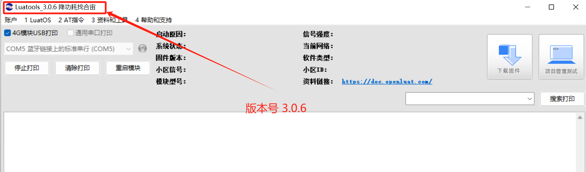

# 003：Air780E-LuatOS-软件 demo-网络驱动-UDP 通信

## **一、UDP 概述**

UDP（用户数据报协议，User Datagram Protocol）是一种无连接的、不可靠的传输层协议，主要用于实现网络中的快速通讯。以下是 UDP 通讯的主要特点：

### 1.1 无连接通讯：

UDP 在发送数据之前不需要建立连接，这大大减少了通讯的延迟。发送方只需将数据包封装成 UDP 报文，并附上目的地址和端口号，即可直接发送。

### 1.2 不可靠传输：

UDP 不保证数据包的顺序性、完整性和可靠性。数据包在传输过程中可能会丢失、重复或乱序到达。因此，UDP 通讯需要应用层自行处理这些问题，如实现错误检测、数据重传等机制。

### 1.3 面向报文：

UDP 以报文为单位进行数据传输，每个报文都是独立的。这种面向报文的特性使得 UDP 能够保持数据的完整性，并且便于进行错误检测和处理。

### 1.4 高效性：

UDP 的头部结构非常简单，只包含必要的字段，如源端口、目的端口、数据长度和校验和。这种简洁的头部设计使得 UDP 在处理数据包时更加高效，减少了网络延迟。

### 1.5 实时性：

UDP 通讯具有较快的传输速度，适用于对实时性要求较高的应用场景，如视频通话、在线游戏等。在这些场景中，即使数据包偶尔丢失或延迟，也不会对整体功能产生严重影响。

## 

## 二、准备硬件环境

“古人云：‘工欲善其事，必先利其器。’在深入介绍本功能示例之前，我们首先需要确保以下硬件环境的准备工作已经完成。”

### 2.1  Air780E 开发板

准备一块开发板，有两种开发板可以使用，二选一即可；

第一种开发板是 Air780E 核心板，如下图所示：


点击链接购买：[Air780E 核心板淘宝购买链接](https://item.taobao.com/item.htm?id=693774140934&pisk=f1eiwOqL25l1_HYiV6D1ize3wN5d5FMjRrpxkx3VT2uIHCCskWm4kysffAEqor4KRRIskGT0ooqi_coq7DWE000qbVr2mmzKQjNtkV3mnoalvaBRelZshA7RyTFdpD4xQco2_VS2Tcnvc89h5lZshq-pu_FUfEDVVdOmgrkET0ir3mkq_MDEmmM2QjJaY2uI0UGAoNueWRjiw4YTC-_opNr-zluaXleFpfR_X2fhTJVn94W--KJ4KcqQreCDEs3zNVh-DyWpIxqEmyc8savgoor7gX2D7GUzmW4jBJS2_4PTWjestFRZqA0iaRlwjdkIgW2nBR7XNkEn7bDL96_tMA4gN4GNOwa0xVU4IX8G4iReapZyhDSYLIOj_DinyhbSB2IHjbEhxMA51foIXaIhxItMPKJlyMjHNEGZAcQR.&spm=a1z10.5-c-s.w4002-24045920841.33.639f1fd1YrS4b6&skuId=5098266470883) ；

此核心板的详细使用说明参考：[Air780E 产品手册](https://docs.openluat.com/air780e/product/) 中的 << 开发板 Core_Air780E 使用说明 VX.X.X.pdf>>，写这篇文章时最新版本的使用说明为：[开发板 Core_Air780E 使用说明 V1.0.5.pdf](https://cdn.openluat-luatcommunity.openluat.com/attachment/20240419155721583_%E5%BC%80%E5%8F%91%E6%9D%BFCore_Air780E%E4%BD%BF%E7%94%A8%E8%AF%B4%E6%98%8EV1.0.5.pdf) ；核心板使用过程中遇到任何问题，可以直接参考这份使用说明 pdf 文档。

### 2.2 SIM 卡

请准备一张可正常上网的 SIM 卡，该卡可以是物联网卡或您的个人手机卡。

**特别提醒：**请确保 SIM 卡未欠费且网络功能正常，以便顺利进行后续操作。

### 2.3 PC 电脑

请准备一台配备 USB 接口且能够正常上网的电脑。

### 2.4 数据通信线

请准备一根用于连接 Air780E 开发板和 PC 电脑的数据线，该数据线将实现业务逻辑的控制与交互。您有两种选择：

- USB 数据线（其一端为 Type-C 接口，用于连接 Air780E 开发板）。通常，这种数据线的外观如下示意图所示：


普通的手机 USB 数据线一般都可以直接使用；

- 数据线是 USB 转 TTL 串口线。通常，这种数据线的外观如下示意图所示：


在本教程中，我们将采用以下数据线配置进行测试和数据查看：

- 第一种：USB 数据线：此数据线不仅用于为测试板供电，还用于查看数据日志。其一端为 Type-C 接口，连接 Air780E 开发板；另一端为标准 USB 接口，连接 PC 电脑。
- 第二种：USB 转 TTL 串口线：此数据线主要用于 UDP-UART 数据的查看。其一端为 USB 接口，连接 PC 电脑；另一端为 TTL 串口接口，连接 Air780E 开发板，以便进行串口通信和数据传输。

### 2.5 组装硬件环境

#### 2.5.1 请按照 SIM 卡槽上的指示方向正确插入 SIM 卡，务必确保插入方向正确，避免插反导致损坏！

通常，插入 SIM 卡的步骤如下：

- 将 SIM 卡的金属接触面朝下，对准卡槽的开口。
- 用力平稳地将 SIM 卡推入卡槽，直至听到“咔嚓”一声，表示 SIM 卡已正确安装到位。


#### 2.5.2 USB 数据线，连接电脑和 Air780E 开发板，如下图所示：


## 三、准备软件环境

“凡事预则立，不预则废。”在详细阐述本功能示例之前，我们需先精心筹备好以下软件环境。

### 3.1 Luatools 工具

要想烧录 AT 固件到 4G 模组中，需要用到合宙的强大的调试工具：Luatools；

下载地址：[Luatools v3 下载调试工具](https://luatos.com/luatools/download/last)。

Luatools 工具集具备以下几大核心功能：

- 一键获取最新固件：自动连接合宙服务器，轻松下载最新的合宙模组固件。
- 固件与脚本烧录：便捷地将固件及脚本文件烧录至目标模组中。
- 串口日志管理：实时查看模组通过串口输出的日志信息，并支持保存功能。
- 串口调试助手：提供简洁的串口调试界面，满足基本的串口通信测试需求。

Luatools 下载之后， 无需安装， 解压到你的硬盘，点击 Luatools_v3.exe 运行，出现如下界面，就代表 Luatools 安装成功了：


### 3.2 烧录代码

首先要说明一点： 脚本代码， 要和固件的 LuatOS-SoC_V1112_EC618_FULL.soc 文件一起烧录。

**整体压缩文件：内含有 文件一：Core 固件 和 文件二：UDP-UART 脚本文件，如图所示。**


#### 3.2.1 **压缩文件：完整文件包**
[右键点我,另存为,下载完整压缩文件包](file/Test_Code_UDP.zip){:target="_blank"}

#### 3.2.2 压缩包内部文件

**文件一：Core 固件**

**文件二：UDP-UART 脚本文件**

#### 3.2.3 **找到烧录的固件文件**

官网下载,底层 core 下载地址：[LuatOS 底层 core](https://docs.openluat.com/air780e/luatos/firmware/)     **注：**本 demo 使用如图所示固件


#### 3.2.4 **正确连接电脑和 4G 模组电路板**

使用带有数据通信功能的数据线，不要使用仅有充电功能的数据线；

#### 3.2.5 **识别 4G 模组的 boot 引脚**

在下载之前，要用模组的 boot 引脚触发下载， 也就是说，要把 4G 模组的 boot 引脚拉到 1.8v，或者直接把 boot 引脚和 VDD_EXT 引脚相连。我们要在按下 BOOT 按键时让模块开机，就可以进入下载模式了。

具体到 Air780E 开发板，

- 当我们模块没开机时，按着 BOOT 键然后长按 PWR 开机。
- 当我们模块开机时，按着 BOOT 键然后点按重启键即可。


#### 3.2.6 **识别电脑的正确端口**

判断是否进入 BOOT 模式：模块上电，此时在电脑的设备管理器中，查看串口设备， 会出现一个端口表示进入了 boot 下载模式，如下图所示：


当设备管理器出现了 3 个连续数字的 com 端口，并且每个数字都大于 4，这时候， 硬件连接上就绪状态，恭喜你，可以进行烧录了！

#### 3.2.7 **新建项目**

首先，确保你的 Luatools 的版本大于或者等于 3.0.6 版本.

在 Luatools 的左上角上有版本显示的，如图所示：



Luatools 版本没问题的话， 就点击 Luatools 右上角的“项目管理测试”按钮，如下图所示：


这时会弹出项目管理和烧录管理的对话框，如下图：


#### 3.2.8 **开始烧录**

选择 780E 板子对应的底层 core 和刚改的 main.lua 脚本文件。下载到板子中。


点击下载后，我们需要进入 boot 模式才能正常下载。


### 3.3 合宙 TCP/UDP web 测试工具

为了方便测试，合宙提供了免费的不可商用的 TCP/UDP web 测试工具：[合宙 TCP/UDP web 工具 (](https://netlab.luatos.com/)[luatos.com](https://netlab.luatos.com/)[)](https://netlab.luatos.com/)

详细使用说明参考：[合宙 TCP/UDP web 测试工具使用说明](https://docs.openluat.com/TCPUDP_Test/) 。


### 3.4 PC 端串口工具

LLCOM 的下载链接：[LLCOM](https://llcom.papapoi.com/index.html) ，详细使用说明可以直接参考下载网站。

- **串口接线方式：Air780 提供三个 Uart.**

**MAIN_UART：**通用串口，可用于 AT 命令和数据传输 最大波特率 921600bps，默认波特率自适应 9600-115200bps 支持硬件流控（RTS/CTS）

**AUX_UART：**通用串口

**DBG_UART：**用于输出调试信息


**注意：**

- 以上 PinOut 图示, 对应的 V1.8 的开发板，版本号在板子丝印上可查阅。
- V1.4 的开发板, 由于 LCD 脚有差异, 图示的 LCD_RS/LCD_CLK 实际位于开发板 管脚编号 06/05 的 UART2/AUX_UART 脚, 不在编号 11/14 脚。
- V1.8 的开发板 17 脚改为 VBAT.

#### 3.4.1 **LLCOM 工具设置：初始配置**


#### 3.4.2 **数据发送前的配置**


## 四、UDP-UART 透传功能实现的概述

本文教你怎么使用 luatos 脚本语言，就可以让合宙 4G 模组连接上一个 UDP 服务器，并且模组和服务器之间实现数据的双向传输！

### 4.1 本教程实现的功能定义是：

- 通过网页端启动一个 UDP 服务器；
- 4G 模组插卡开机后，连接上 UDP 服务器；
- 4G 模组向 UDP 服务器发送** ****"UDP CONNECT"**，服务器可以收到数据并且在网页端显示；
- UDP 服务器网页端向 4G 模组发送 `data from UDP server`，4G 模组可以收到数据并且通过串口输出显示；

### 4.2 文章内容引用

- 780E 开发板软硬件资料 ： [Air780E 产品手册 ](https://docs.openluat.com/air780e/product/)
- 以上接口函数不做详细介绍，可通过此链接查看具体介绍：[socket - 网络接口 - LuatOS 文档](https://wiki.luatos.com/api/socket.html)

### 4.3 核心脚本代码详解

#### 4.3.1 **串口初始化**

**本文示例**：串口使用 MAIN_UART(uart1)

```lua
--初始化  
local uartid = 1 -- 根据实际设备选取不同的uartid
uart.setup(
    uartid,--串口id
    115200,--波特率
    8,--数据位
    1--停止位
)
```

#### 4.3.2 **数据接收回调：搭建响应桥梁**

这里使用 uart.rx 接口，和以 zbuff 的方式存储从 uart1 外部串口收到的数据 -- 收取数据会触发回调, 这里的"receive" 是固定值不要修改。

```lua
uart.on(uartid, "receive", function(id, len)
     while true do
-- 接收串口收到的数据，并赋值到uart_rx_buff
        local len = uart.rx(id, uart_rx_buff)  
               if len <= 0 then    -- 接收到的字节长度为0 则退出
                    break
              end
-- 如果已经在线了，则发送socket.EVENT消息来打断任务里的阻塞等待状态，让任务循环继续
               if connect_state then
 sys_send(taskName, socket.EVENT, 0)
               end
        end
  end)
```

#### 4.3.3 **UDP 网络配置：铺就数据通道**

```lua
----------------------------------------------网络配置-------------------------------------------------
local libnet = require "libnet"  -- libnet库，支持tcp、udp协议所用的同步阻塞接口
local ip = "112.125.89.8"         -- 连接UDP服务器的ip地址
local port = 46139                -- 连接UDP服务器的端口
local netCB = nil                  -- socket服务的回调函数
local connect_state = false         -- 连接状态 true:已连接   false:未连接
local protocol = true               -- 通讯协议 true:UDP协议  false:TCP协议
local ssl = false                    -- 加密传输 true:加密     false:不加密
local tx_buff = zbuff.create(1024)  -- 发送至UDP服务器的数据
=======================================================
sys.waitUntil("IP_READY")                -- 等待联网成功
 netCB = socket.create(nil, taskName)     -- 创建socket对象
 socket.debug(netCB, true)                -- 打开调试日志
 socket.config(netCB, nil, protocol, ssl)      -- 此配置为UDP连接，无SSL加密
```

#### 4.3.4 **UDP 至串口透传：数据无缝流转**

```lua
succ, param, _, _ = socket.rx(netCB, rx_buff)   -- 接收数据
  if not succ then
     log.info("服务器断开了", succ, param, ip, port)
     break
 end
  if rx_buff:used() > 0 then
    log.info("收到服务器数据，长度", rx_buff:used())
    uart.tx(uartid, rx_buff)    -- 从服务器收到的数据转发 从串口输出
    rx_buff:del()
  end
```

#### 4.3.5 **串口至 UDP 反透传：信息双向传递**

```lua
tx_buff:copy(nil, uart_rx_buff)         -- 将串口数据赋值给UDP待发送数据的buff中
uart_rx_buff:del()                      -- 清除串口buff的数据长度
 if tx_buff:used() > 0 then
 log.info("发送到服务器数据，长度", tx_buff:used())
local result = libnet.tx(taskName, 0, netCB, tx_buff)   -- 发送数据
 if not result then
 log.info("发送失败了", result, param)
 break
end
 end
tx_buff:del()
```

### 4.4 **成果演示与深度解析：视频 + 图文全面展示**

#### 4.4.1 **成果运行精彩呈现**


---

#### 4.4.2 **演示视频生动展示**
<video controls src="file/UDP-UART.mp4"></video>
#### 4.4.3 **完整实例深度剖析**

```lua
-- LuaTools需要PROJECT和VERSION这两个信息
PROJECT = "scdemo"
VERSION = "1.0.0"
log.info("main", PROJECT, VERSION)
-- 一定要添加sys.lua !!!!
sys = require("sys")
_G.sysplus = require("sysplus")
local taskName = "UDP_TASK"             -- sysplus库用到的任务名称，也作为任务id
if wdt then
    --添加硬狗防止程序卡死，在支持的设备上启用这个功能
    wdt.init(9000)--初始化watchdog设置为9s
    sys.timerLoopStart(wdt.feed, 3000)--3s喂一次狗
end
local uart_rx_buff = zbuff.create(1024)     -- 串口接收到的数据
----------------------------网络配置---------------------------
local libnet = require "libnet"         -- libnet库，支持tcp、udp协议所用的同步阻塞接口
local ip = "112.125.89.8"               -- 连接UDP服务器的ip地址
local port = 46139                      -- 连接UDP服务器的端口
local netCB = nil                       -- socket服务的回调函数
local connect_state = false             -- 连接状态 true:已连接   false:未连接
local protocol = true                  -- 通讯协议 true:UDP协议  false:TCP协议
local ssl = false                       -- 加密传输 true:加密     false:不加密
local tx_buff = zbuff.create(1024)     -- 发送至UDP服务器的数据
local rx_buff = zbuff.create(1024)     -- 从UDP服务器接收到的数据
==============================================================
--Uart初始化  
local uartid = 1 -- 根据实际设备选取不同的uartid
uart.setup(
    uartid,--串口id
    115200,--波特率
    8,--数据位
    1--停止位
)
function UDP_TASK()
    -- 打印一下连接的目标ip和端口号
    log.info("connect ip: ", ip, "port:", port)
    sys.waitUntil("IP_READY")                -- 等待联网成功
    netCB = socket.create(nil, taskName)     -- 创建socket对象
    socket.debug(netCB, true)                -- 打开调试日志
    socket.config(netCB, nil, protocol, ssl)      -- 此配置为UDP连接，无SSL加密
    -- 串口和UDP服务器的交互逻辑
    while true do
        -- 连接服务器，返回是否连接成功
        local result = libnet.connect(taskName, 15000, netCB, ip, port)
        -----查询网络状态
        local status = mobile.status()    
        log.info("status", status) 
        
        -- 收取数据会触发回调, 这里的"receive" 是固定值不要修改。
        log.info("connect ip: 等待连接 ",result)
        uart.on(uartid, "receive", function(id, len)
            while true do
                local len = uart.rx(id, uart_rx_buff)   -- 接收串口收到的数据，并赋值到uart_rx_buff
                if len <= 0 then    -- 接收到的字节长度为0 则退出
                    break
                end
                -- 如果已经在线了，则发送socket.EVENT消息来打断任务里的阻塞等待状态，让任务循环继续
                if connect_state then
                    sys_send(taskName, socket.EVENT, 0)
                end
            end
        end)
        -- 如果连接成功，则改变连接状态参数，并且随便发一条数据到服务器，看服务器能不能收到
        if result then
            log.info("connect ip: 连接成功")
            connect_state = true
           libnet.tx(taskName, 0, netCB, "UDP CONNECT")
        end
        -- 连接上服务器后，等待处理接收服务器下行至模块的数据 和 发送串口的数据到服务器
        while result do
            succ, param, _, _ = socket.rx(netCB, rx_buff)   -- 接收数据
            if not succ then
                log.info("服务器断开了", succ, param, ip, port)
                break
            end
            if rx_buff:used() > 0 then
                log.info("收到服务器数据，长度", rx_buff:used())
               uart.tx(uartid, rx_buff)    -- 从服务器收到的数据转发 从串口输出
                rx_buff:del()
            end
            tx_buff:copy(nil, uart_rx_buff)         -- 将串口数据赋值给UDP待发送数据的buff中
            uart_rx_buff:del()                      -- 清除串口buff的数据长度
            if tx_buff:used() > 0 then
                log.info("发送到服务器数据，长度", tx_buff:used())
                local result = libnet.tx(taskName, 0, netCB, tx_buff)   -- 发送数据
                if not result then
                    log.info("发送失败了", result, param)
                    break
                end
            end
            tx_buff:del()
            -- 如果zbuff对象长度超出，需要重新分配下空间
            if uart_rx_buff:len() > 1024 then
                uart_rx_buff:resize(1024)
            end
            if tx_buff:len() > 1024 then
                tx_buff:resize(1024)
            end
            if rx_buff:len() > 1024 then
                rx_buff:resize(1024)
            end
            log.info(rtos.meminfo("sys"))   -- 打印系统内存
            -- 阻塞等待新的消息到来，比如服务器下发，串口接收到数据
            result, param = libnet.wait(taskName, 15000, netCB)
            if not result then
                log.info("服务器断开了", result, param)
                break
            end
        end
        -- 服务器断开后的行动，由于while true的影响，所以会再次重新执行进行 重新连接。
        connect_state = false
        libnet.close(d1Name, 5000, netCB)
        tx_buff:clear(0)
        rx_buff:clear(0)
        sys.wait(1000)
    end
end
-- libnet库依赖于sysplus，所以只能通过sysplus.taskInitEx创建的任务函数中运行
sysplus.taskInitEx(UDP_TASK, taskName, netCB)
-- 用户代码已结束---------------------------------------------
-- 结尾总是这一句
sys.run()
-- sys.run()之后后面不要加任何语句!!!!!
```

## 五、总结

### UDP-UAR 汇总:

- UDP（用户数据报协议）是一种无连接的传输层协议，它提供不可靠的服务，不保证数据包的顺序、完整性或正确性，但具有较低的时延和开销。UDP 常用于需要快速传输且对丢包不太敏感的应用，如实时音视频、在线游戏等。
- UART（通用异步收发传输器）是一种串行通信协议，用于在计算机和其他设备之间传输数据。UART 通信是异步的，意味着每个数据包的发送和接收是独立的，不需要时钟信号来同步。UART 通信通常用于低速设备之间的连接，如微控制器、传感器等。
- 将 UDP 与 UART 结合起来，通常是在嵌入式系统或物联网（IoT）应用中，需要将设备上的数据通过网络传输到远程服务器或其他设备时。在这种情况下，UART 可能用于设备内部的串行通信，而 UDP 则用于设备之间的网络通信。例如，一个基于微控制器的设备可能通过 UART 接口收集传感器数据，然后通过 UDP 协议将这些数据发送到远程服务器进行分析或存储。
- 需要注意的是，UDP 和 UART 是不同层次的协议，UDP 位于传输层，而 UART 位于物理层和数据链路层（在某些上下文中，可能被视为一种简单的通信接口）。它们各自在其层次上发挥作用，但可以在某些应用场景中结合使用以实现设备到网络的通信。

## 六、常见问题

### UDP 是否支持 单向/双向认证

UDP 本身不直接支持单向或双向认证。UDP 是一种无连接的协议，主要用于实时应用，如 IP 电话和视频会议，它不保证数据的可靠交付。虽然 UDP 本身不提供认证功能，但可以在应用层或通过网络设备实现用户认证。这种认证可以在连接建立的起始阶段进行，并且可以通过多种方式实现，包括单向认证（如客户端向服务器提供认证信息）和双向认证（双方相互验证身份）。具体实现方式取决于应用场景和需求。

## 七、扩展

### TCP 和 UDP

TCP（Transmission Control Protocol，传输控制协议）和 UDP（User Datagram Protocol，用户数据报协议）都是网络层之上的传输层协议，它们在网络通讯中扮演着重要的角色，但有着显著的区别。以下是 TCP 和 UDP 的简化对比：

### 7.1 连接性：

- TCP：面向连接。在数据传输之前，需要先建立连接（三次握手），确保数据传输的可靠性。
- UDP：无连接。数据传输前不需要建立连接，直接发送数据包。

### 7.2 可靠性：

- TCP：提供可靠的传输服务。通过确认应答、超时重传、错误校验等机制，确保数据按顺序、无错误地传输。
- UDP：不保证数据的可靠性。数据包可能会丢失、重复或乱序到达。

### 7.3 速度：

- TCP：由于需要建立连接和进行各种可靠性检查，TCP 的传输速度相对较慢。
- UDP：没有连接建立和可靠性检查的开销，UDP 的传输速度通常更快。

### 7.4 应用场景：

- TCP：适用于需要可靠传输的应用场景，如网页浏览、文件传输等。
- UDP：适用于对实时性要求较高、但对数据可靠性要求不高的应用场景，如视频流、音频流、在线游戏等。

### 7.5 流量控制：

- TCP：具有流量控制和拥塞控制机制，能够根据网络状况调整数据传输速率。
- UDP：没有流量控制和拥塞控制机制，数据发送速率完全取决于应用程序。

### 7.6 头部开销：

- TCP：头部开销较大，包含源端口、目的端口、序列号、确认号、窗口大小等多个字段。
- UDP：头部开销较小，仅包含源端口、目的端口、长度和校验和等字段。


## 给读者的话

> 本篇文章由`永仔`开发；
>
> 本篇文章描述的内容，如果有错误、细节缺失、细节不清晰或者其他任何问题，总之就是无法解决您遇到的问题；
>
> 请登录[合宙技术交流论坛](https://chat.openluat.com/)，点击[文档找错赢奖金-Air780E-LuatOS-UDP通信](https://chat.openluat.com/#/page/matter?125=1846216018716917761&126=%E6%96%87%E6%A1%A3%E6%89%BE%E9%94%99%E8%B5%A2%E5%A5%96%E9%87%91-Air780E-LuatOS-%E8%BD%AF%E4%BB%B6demo-%E7%BD%91%E7%BB%9C%E9%A9%B1%E5%8A%A8-UDP%E9%80%9A%E4%BF%A1&askid=1846216018716917761)；
>
> 用截图标注+文字描述的方式跟帖回复，记录清楚您发现的问题；
>
> 我们会迅速核实并且修改文档；
>
> 同时也会为您累计找错积分，您还可能赢取月度找错奖金！