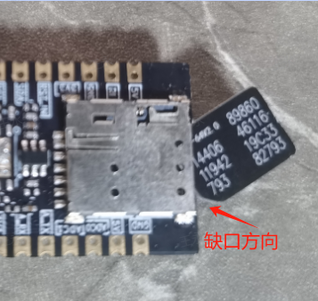

## **一、WebSocket 概述**

WebSocket 是 HTML5 下一种新的协议（本质上是一个基于 TCP 的协议），它实现了浏览器与服务器之间的全双工通信，能够节省服务器资源和带宽，达到实时通讯的目的。WebSocket 协议通过握手机制，允许客户端和服务器之间建立一个类似 TCP 的连接，从而方便它们之间的通信。

- **在线聊天应用：**允许用户实时发送和接收消息，而无需页面刷新或轮询服务器。
- **实时协作应用**：支持多用户实时编辑文档或共享白板等场景。
- **实时游戏：**允许多个玩家之间进行实时的游戏交互。
- **实时数据展示：**用于显示实时数据，如股票市场变化、天气预报更新等。
- **实时通知和提醒**：用于向用户发送实时的通知消息，如新邮件提醒、社交媒体通知等。
- **在线会议和视频通话**：支持实时的音视频通信。

## 二、准备硬件环境

“古人云：‘工欲善其事，必先利其器。’在深入介绍本功能示例之前，我们首先需要确保以下硬件环境的准备工作已经完成。”

### 2.1  Air780E 开发板

本demo使用的是 Air780E 核心板，如下图所示：


点击链接购买：[Air780E 核心板淘宝购买链接](https://item.taobao.com/item.htm?id=693774140934&pisk=f1eiwOqL25l1_HYiV6D1ize3wN5d5FMjRrpxkx3VT2uIHCCskWm4kysffAEqor4KRRIskGT0ooqi_coq7DWE000qbVr2mmzKQjNtkV3mnoalvaBRelZshA7RyTFdpD4xQco2_VS2Tcnvc89h5lZshq-pu_FUfEDVVdOmgrkET0ir3mkq_MDEmmM2QjJaY2uI0UGAoNueWRjiw4YTC-_opNr-zluaXleFpfR_X2fhTJVn94W--KJ4KcqQreCDEs3zNVh-DyWpIxqEmyc8savgoor7gX2D7GUzmW4jBJS2_4PTWjestFRZqA0iaRlwjdkIgW2nBR7XNkEn7bDL96_tMA4gN4GNOwa0xVU4IX8G4iReapZyhDSYLIOj_DinyhbSB2IHjbEhxMA51foIXaIhxItMPKJlyMjHNEGZAcQR.&spm=a1z10.5-c-s.w4002-24045920841.33.639f1fd1YrS4b6&skuId=5098266470883) ；

此核心板的详细使用说明参考：[Air780E 产品手册](https://docs.openluat.com/air780e/product/) 中的 << 开发板 Core_Air780E 使用说明 VX.X.X.pdf>>，写这篇文章时最新版本的使用说明为：[开发板 Core_Air780E 使用说明 V1.0.5.pdf](https://cdn.openluat-luatcommunity.openluat.com/attachment/20240419155721583_%E5%BC%80%E5%8F%91%E6%9D%BFCore_Air780E%E4%BD%BF%E7%94%A8%E8%AF%B4%E6%98%8EV1.0.5.pdf) ；核心板使用过程中遇到任何问题，可以直接参考这份使用说明 pdf 文档。

### 2.2 SIM 卡

请准备一张可正常上网的 SIM 卡，该卡可以是物联网卡或您的个人手机卡。

**特别提醒：**请确保 SIM 卡未欠费且网络功能正常，以便顺利进行后续操作。

### 2.3 PC 电脑

请准备一台配备 USB 接口且能够正常上网的电脑。

### 2.4 数据通信线

请准备一根用于连接 Air780E 开发板和 PC 电脑的数据线，该数据线将实现业务逻辑的控制与交互。您有两种选择：

- USB 数据线（其一端为 Type-C 接口，用于连接 Air780E 开发板）。通常，这种数据线的外观如下示意图所示：


普通的手机 USB 数据线一般都可以直接使用；

- 数据线是 USB 转 TTL 串口线。通常，这种数据线的外观如下示意图所示：


在本教程中，我们将采用以下数据线配置进行测试和数据查看：

- 第一种：USB 数据线：此数据线不仅用于为测试板供电，还用于查看数据日志。其一端为 Type-C 接口，连接 Air780E 开发板；另一端为标准 USB 接口，连接 PC 电脑。
- 第二种：USB 转 TTL 串口线：此数据线主要用于 Websocket-UART 透传数据的查看。其一端为 USB 接口，连接 PC 电脑；另一端为 TTL 串口接口，连接 Air780E 开发板，以便进行串口通信和数据传输。

### 2.5 组装硬件环境

#### 2.5.1 请按照 SIM 卡槽上的指示方向正确插入 SIM 卡，务必确保插入方向正确，避免插反导致损坏！

通常，插入 SIM 卡的步骤如下：

- 将 SIM 卡的金属接触面朝下，对准卡槽的开口。
- 用力平稳地将 SIM 卡推入卡槽，直至听到“咔嚓”一声，表示 SIM 卡已正确安装到位。




#### 2.5.2 USB 数据线，连接电脑和 Air780E 开发板，如下图所示：


## 三、准备软件环境

“凡事预则立，不预则废。”在详细阐述本功能示例之前，我们需先精心筹备好以下软件环境。

### 3.1 Luatools 工具

要想烧录 AT 固件到 4G 模组中，需要用到合宙的强大的调试工具：Luatools；

下载地址：[Luatools v3 下载调试工具](https://luatos.com/luatools/download/last)。

Luatools 工具集具备以下几大核心功能：

- 一键获取最新固件：自动连接合宙服务器，轻松下载最新的合宙模组固件。
- 固件与脚本烧录：便捷地将固件及脚本文件烧录至目标模组中。
- 串口日志管理：实时查看模组通过串口输出的日志信息，并支持保存功能。
- 串口调试助手：提供简洁的串口调试界面，满足基本的串口通信测试需求。

Luatools 下载之后， 无需安装， 解压到你的硬盘，点击 Luatools_v3.exe 运行，出现如下界面，就代表 Luatools 安装成功了：


### 3.2 烧录代码

首先要说明一点： 脚本代码， 要和固件的 LuatOS-SoC_V1112_EC618_FULL.soc 文件一起烧录。

**整体压缩文件：内含有 文件一：Core 固件 和 文件二：WebSocket 加密通讯脚本文件，文件三：WebSocket-UART 透传脚本文件，如图所示。**


#### 3.2.1 **压缩文件：完整文件包**
[右键点我,另存为,下载完整压缩文件包](file/WebSocket.zip){:target="_blank"}
#### 3.2.2 压缩包内部文件

**文件一：Core 固件**

**文件二：WebSocket 加密通讯脚本文件**

**文件三：WebSocket-UART 透传脚本文件**

#### 3.2.3 **找到烧录的固件文件**

官网下载,底层 core 下载地址：[LuatOS 底层 core](https://docs.openluat.com/air780e/luatos/firmware/)     **注：**本 demo 使用如图所示固件


#### 3.2.4 **正确连接电脑和 4G 模组电路板**

使用带有数据通信功能的数据线，不要使用仅有充电功能的数据线；

#### 3.2.5 **识别 4G 模组的 boot 引脚**

在下载之前，要用模组的 boot 引脚触发下载， 也就是说，要把 4G 模组的 boot 引脚拉到 1.8v，或者直接把 boot 引脚和 VDD_EXT 引脚相连。我们要在按下 BOOT 按键时让模块开机，就可以进入下载模式了。

具体到 Air780E 开发板，

- 当我们模块没开机时，按着 BOOT 键然后长按 PWR 开机。
- 当我们模块开机时，按着 BOOT 键然后点按重启键即可。


#### 3.2.6 **识别电脑的正确端口**

判断是否进入 BOOT 模式：模块上电，此时在电脑的设备管理器中，查看串口设备， 会出现一个端口表示进入了 boot 下载模式，如下图所示：


当设备管理器出现了 3 个连续数字的 com 端口，并且每个数字都大于 4，这时候， 硬件连接上就绪状态，恭喜你，可以进行烧录了！

#### 3.2.7 **新建项目**

首先，确保你的 Luatools 的版本大于或者等于 3.0.6 版本.

在 Luatools 的左上角上有版本显示的，如图所示：


Luatools 版本没问题的话， 就点击 Luatools 右上角的“项目管理测试”按钮，如下图所示：


这时会弹出项目管理和烧录管理的对话框，如下图：


#### 3.2.8 **开始烧录**

选择 780E 板子对应的底层 core 和刚改的 main.lua 脚本文件。下载到板子中。


点击下载后，我们需要进入 boot 模式才能正常下载。


### 3.3 PC 端串口工具

LLCOM 的下载链接：[LLCOM](https://llcom.papapoi.com/index.html) ，详细使用说明可以直接参考下载网站。

- **串口接线方式：Air780 提供三个 Uart.**

**MAIN_UART：**通用串口，可用于 AT 命令和数据传输 最大波特率 921600bps，默认波特率自适应 9600-115200bps 支持硬件流控（RTS/CTS）

**AUX_UART：**通用串口

**DBG_UART：**用于输出调试信息


**注意：**

- 以上 PinOut 图示, 对应的 V1.8 的开发板，版本号在板子丝印上可查阅。
- V1.4 的开发板, 由于 LCD 脚有差异, 图示的 LCD_RS/LCD_CLK 实际位于开发板 管脚编号 06/05 的 UART2/AUX_UART 脚, 不在编号 11/14 脚。
- V1.8 的开发板 17 脚改为 VBAT.

#### 3.3.1LLC**OM 工具设置：初始配置**


#### 3.3.2 **数据发送前的配置**


## 四、WebSocket 加密通讯的概述

本小节教你怎么使用 luatos 脚本语言，就可以让合宙 4G 模组连接上一个 WebSocket 服务器，并且模组和服务器之间实现数据的交互！

### 4.1 本教程实现的功能定义：

- 4G 模组插卡开机后，连接上 WebSocket 服务器；
- 这是个测试服务, 当 4G 模组发送的是 json,且 action=echo,就会回显所发送的内容
- 发送内容是   wsc:send((json.encode({action="echo", msg=os.date()})))

### 4.2 文章内容引用

- 780E 开发板软硬件资料 ： [Air780E 产品手册 ](https://docs.openluat.com/air780e/product/)
- websocket 函数接口不做详细介绍，可通过此链接查看具体介绍：[websocket](https://wiki.luatos.com/api/websocket.html#)[ - 网络接口 - LuatOS 文档](https://wiki.luatos.com/api/websocket.html#)

### 4.3 核心脚本代码详解

#### 4.3.1 websocket 客户端创建

```lua
-- ws 普通链接不加密
    wsc = websocket.create(nil, "ws://echo.airtun.air32.cn/ws/echo")
   --加密链接 wss 表示加密，
    wsc = websocket.create(nil, "wss://echo.airtun.air32.cn/ws/echo")
```

#### 4.3.2 设置额外的 headers

```lua
-- table形式
wsc:headers({Auth="Basic ABCDEFGG"})
-- 字符串形式
wsc:headers("Auth: Basic ABCDERG\r\n")
```

#### 4.3.3 设置自动重连机制

```lua
wsc:autoreconn(true, 3000) -- 自动重连机制
```

#### 4.3.4 注册 websocket 回调

```lua
wsc:on(function(wsc, event, data, fin, optcode)
        --[[
            event的值有:
            conack 连接服务器成功,已经收到websocket协议头部信息,通信已建立
            recv   收到服务器下发的信息, data, payload 不为nil
            sent   send函数发送的消息,服务器在TCP协议层已确认收到
            disconnect 服务器连接已断开
            其中 sent/disconnect 事件在 2023.04.01 新增
        ]]
        -- data 当事件为recv是有接收到的数据
        -- fin 是否为最后一个数据包, 0代表还有数据, 1代表是最后一个数据包
        -- optcode, 0 - 中间数据包, 1 - 文本数据包, 2 - 二进制数据包
        -- 因为lua并不区分文本和二进制数据, 所以optcode通常可以无视
        -- 若数据不多, 小于1400字节, 那么fid通常也是1, 同样可以忽略
        log.info("wsc", event, data, fin, optcode)
        -- 显示二进制数据
        -- log.info("wsc", event, data and data:toHex() or "", fin, optcode)
        if event == "conack" then -- 连接websocket服务后, 会有这个事件
            log.info("WebSocket connect succeed!")
            sys.publish("wsc_conack")----连接成功发布"wsc_conack"
        end
    end)
```

#### 4.3.5 连接服务器

```lua
wsc:connect()
    -- 等待conack是可选的
    sys.waitUntil("wsc_conack")------等待连接成功 并订阅到 "wsc_conack"
```

#### 4.3.6 发布消息

```lua
-- 定期发业务ping也是可选的, 但为了保存连接, 也为了继续持有wsc对象, 这里周期性发数据
    while true do
        wsc:send((json.encode({action="echo", msg=os.date()})))
     sys.wait(15000)
        -- 发送二进制帧, 2023.06.21 之后编译的固件支持
        -- wsc:send(string.char(0xA5, 0x5A, 0xAA, 0xF2), 1, 1)
    end
```

#### 4.3.6 websocket 客户端关闭(关闭后资源释放无法再使用)

```lua
wsc:close()
```

### 4.4 **成果演示与深度解析：视频 + 图文全面展示**

#### 4.4.1 **成果运行精彩呈现**


#### 4.4.2 **演示视频生动展示**
<video controls src="file/WebSocket加密通讯.mp4"></video>
#### 4.4.3 **完整实例深度剖析**

```lua
PROJECT = "airtun"
VERSION = "1.0.0"

-- sys库是标配
_G.sys = require("sys")
-- _G.sysplus = require("sysplus")


-- Air780E的AT固件默认会为开机键防抖, 导致部分用户刷机很麻烦
if rtos.bsp() == "EC618" and pm and pm.PWK_MODE then
    pm.power(pm.PWK_MODE, false)
end

-- 报错信息自动上报到平台,默认是iot.openluat.com
-- 支持自定义, 详细配置请查阅API手册
-- 开启后会上报开机原因, 这需要消耗流量,请留意
if errDump then
    errDump.config(true, 600)
end

local wsc = nil

sys.taskInit(function()

    sys.waitUntil("IP_READY")                -- 等待联网成功

    -- 这是个测试服务, 当发送的是json,且action=echo,就会回显所发送的内容
    -- 加密TCP链接 wss 表示加密
    wsc = websocket.create(nil, "wss://echo.airtun.air32.cn/ws/echo")
    -- 这是另外一个测试服务, 能响应websocket的二进制帧
    -- wsc = websocket.create(nil, "ws://echo.airtun.air32.cn/ws/echo2")
    -- 以上两个测试服务是Java写的, 源码在 https://gitee.com/openLuat/luatos-airtun/tree/master/server/src/main/java/com/luatos/airtun/ws

    if wsc.headers then
        wsc:headers({Auth="Basic ABCDEGG"})
    end
    wsc:autoreconn(true, 3000) -- 自动重连机制
    wsc:on(function(wsc, event, data, fin, optcode)
        --[[
            event的值有:
            conack 连接服务器成功,已经收到websocket协议头部信息,通信已建立
            recv   收到服务器下发的信息, data, payload 不为nil
            sent   send函数发送的消息,服务器在TCP协议层已确认收到
            disconnect 服务器连接已断开

            其中 sent/disconnect 事件在 2023.04.01 新增
        ]]
        -- data 当事件为recv是有接收到的数据
        -- fin 是否为最后一个数据包, 0代表还有数据, 1代表是最后一个数据包
        -- optcode, 0 - 中间数据包, 1 - 文本数据包, 2 - 二进制数据包
        -- 因为lua并不区分文本和二进制数据, 所以optcode通常可以无视
        -- 若数据不多, 小于1400字节, 那么fid通常也是1, 同样可以忽略
        log.info("wsc", event, data, fin, optcode)
        -- 显示二进制数据
        -- log.info("wsc", event, data and data:toHex() or "", fin, optcode)
        if event == "conack" then -- 连接websocket服务后, 会有这个事件
            log.info("WebSocket connect succeed!")
            sys.publish("wsc_conack")
        end
    end)
    wsc:connect()
    -- 等待conack是可选的
    sys.waitUntil("wsc_conack")
    --local stat = wsc:ready()
    -- 定期发业务ping也是可选的, 但为了保存连接, 也为了继续持有wsc对象, 这里周期性发数据
    while true do
        wsc:send((json.encode({action="echo", msg=os.date()})))
        sys.wait(15000)
        -- 发送二进制帧, 2023.06.21 之后编译的固件支持
        -- wsc:send(string.char(0xA5, 0x5A, 0xAA, 0xF2), 1, 1)
    end
    wsc:close()
    wsc = nil
end)


-- 用户代码已结束---------------------------------------------
-- 结尾总是这一句
sys.run()
-- sys.run()之后后面不要加任何语句!!!!!
```

### 五、WebSocket-UART 透传的概述

在某些应用场景下，可能需要将 WebSocket 接收到的数据通过 UART 串口发送到其他设备，或者将 UART 串口接收到的数据通过 WebSocket 发送到服务器。这通常需要通过一个中间层或网关设备来实现数据的转换和传输。

### 5.1 本教程实现的功能定义：

- 4G 模组插卡开机后，连接上 WebSocket 服务器；
- 本小节教你怎么使用 luatos 脚本语言，就可以让合宙 4G 模组通过 Uart1 透传数据发送到 WebSocket 服务器，并且模组和服务器之间实现数据的交互！

### 5.2 文章内容引用

- 780E 开发板软硬件资料 ： [Air780E 产品手册 ](https://docs.openluat.com/air780e/product/)
- websocket 函数接口不做详细介绍，可通过此链接查看具体介绍：[websocket](https://wiki.luatos.com/api/websocket.html#)[ - 网络接口 - LuatOS 文档](https://wiki.luatos.com/api/websocket.html#)

### 5.3 核心脚本代码详解

#### 5.3.1 websocket 客户端创建

```lua
-- ws 普通链接不加密
    wsc = websocket.create(nil, "ws://echo.airtun.air32.cn/ws/echo")
   --加密链接 wss 表示加密，
    wsc = websocket.create(nil, "wss://echo.airtun.air32.cn/ws/echo")
```

#### 5.3.2 设置额外的 headers

```lua
-- table形式
wsc:headers({Auth="Basic ABCDEFGG"})
-- 字符串形式
wsc:headers("Auth: Basic ABCDERG\r\n")
```

#### 5.3.3 设置自动重连机制

```lua
wsc:autoreconn(true, 3000) -- 自动重连机制
```

#### 5.3.4 注册 websocket 回调

```lua
wsc:on(function(wsc, event, data, fin, optcode)
        --[[
            event的值有:
            conack 连接服务器成功,已经收到websocket协议头部信息,通信已建立
            recv   收到服务器下发的信息, data, payload 不为nil
            sent   send函数发送的消息,服务器在TCP协议层已确认收到
            disconnect 服务器连接已断开
            其中 sent/disconnect 事件在 2023.04.01 新增
        ]]
        -- data 当事件为recv是有接收到的数据
        -- fin 是否为最后一个数据包, 0代表还有数据, 1代表是最后一个数据包
        -- optcode, 0 - 中间数据包, 1 - 文本数据包, 2 - 二进制数据包
        -- 因为lua并不区分文本和二进制数据, 所以optcode通常可以无视
        -- 若数据不多, 小于1400字节, 那么fid通常也是1, 同样可以忽略
        log.info("wsc", event, data, fin, optcode)
        -- 显示二进制数据
        -- log.info("wsc", event, data and data:toHex() or "", fin, optcode)
        if event == "conack" then -- 连接websocket服务后, 会有这个事件
            log.info("WebSocket connect succeed!")
            sys.publish("wsc_conack")----连接成功发布"wsc_conack"
        end
    end)
```

#### 5.3.5 连接服务器

```lua
wsc:connect()
    -- 等待conack是可选的
    sys.waitUntil("wsc_conack")------等待连接成功 并订阅到 "wsc_conack"
```

#### 5.3.6 **串口初始化**

**本文示例**：串口使用 MAIN_UART(uart1)

```lua
--初始化  
local uartid = 1 -- 根据实际设备选取不同的uartid
uart.setup(
    uartid,--串口id
    115200,--波特率
    8,--数据位
    1--停止位
)
```

#### 5.3.7 接收 UART 消息

```lua
uart.on(uartid, "receive", function(id, len)
            while true do
                local len = uart.rx(id, uart_rx_buff)   -- 接收串口收到的数据，并赋值到uart_rx_buff
                if len <= 0 then    -- 接收到的字节长度为0 则退出
                    break
                else
                    uart_rx_buff:seek(0)
                    uart_rx_buff_data = uart_rx_buff:read(len)
                    Sbuf = len
                    log.info("UART接收的数据包",uart_rx_buff_data)
                    break
                end
            end
        end)
```

#### 5.3.8 发布消息

```lua
if Sbuf > 0 then
    log.info("发送到服务器数据，长度",Sbuf)
    log.info("UART发送到服务器的数据包 ",uart_rx_buff_data)
    log.info("UART发送到服务器的数据包类型 ",type(uart_rx_buff_data))
    if uart_rx_buff_data == '"echo"' then               -- 连接收到串口发送的"echo" ，会进行数据发送
         log.info("UART透传成功 进行数据发送")
         wsc:send(json.encode({action="echo", msg=os.date()})) ---发送数据
    end  
end
```

#### 5.3.9 websocket 客户端关闭(关闭后资源释放无法再使用)

```lua
wsc:close()
```

### 5.4 **成果演示与深度解析：视频 + 图文全面展示**

#### 5.4.1 **成果运行精彩呈现**


#### 5.4.2 **演示视频生动展示**
<video controls src="file/WebSocket-UART透传.mp4"></video>
#### 5.4.3 **完整实例深度剖析**

```lua
PROJECT = "airtun"
VERSION = "1.0.0"

-- sys库是标配
_G.sys = require("sys")
-- _G.sysplus = require("sysplus")
-- Air780E的AT固件默认会为开机键防抖, 导致部分用户刷机很麻烦
if rtos.bsp() == "EC618" and pm and pm.PWK_MODE then
    pm.power(pm.PWK_MODE, false)
end
if wdt then
    --添加硬狗防止程序卡死，在支持的设备上启用这个功能
    wdt.init(9000)--初始化watchdog设置为9s
    sys.timerLoopStart(wdt.feed, 3000)--3s喂一次狗
end
-- 报错信息自动上报到平台,默认是iot.openluat.com
-- 支持自定义, 详细配置请查阅API手册
-- 开启后会上报开机原因, 这需要消耗流量,请留意
if errDump then
    errDump.config(true, 600)
end
local tx_buff = zbuff.create(1024)      -- 发送至WebSocket服务器的数据
local uart_rx_buff = zbuff.create(1024)     -- 串口接收到的数据
local uartid = 1 -- 根据实际设备选取不同的uartid
Sbuf = 0

--初始化
uart.setup(
    uartid,--串口id
    115200,--波特率
    8,--数据位
    1--停止位
)
local wsc = nil
sys.taskInit(function()
    sys.waitUntil("IP_READY")                -- 等待联网成功
    -- 这是个测试服务, 当发送的是json,且action=echo,就会回显所发送的内容
    -- 加密TCP链接 wss 表示加密
    wsc = websocket.create(nil, "wss://echo.airtun.air32.cn/ws/echo")
    -- 这是另外一个测试服务, 能响应websocket的二进制帧
    -- wsc = websocket.create(nil, "ws://echo.airtun.air32.cn/ws/echo2")
    -- 以上两个测试服务是Java写的, 源码在 https://gitee.com/openLuat/luatos-airtun/tree/master/server/src/main/java/com/luatos/airtun/ws
    if wsc.headers then
        wsc:headers({Auth="Basic ABCDEGG"})
    end
    wsc:autoreconn(true, 3000) -- 自动重连机制
    wsc:on(function(wsc, event, data, fin, optcode)
        --[[
            event的值有:
            conack 连接服务器成功,已经收到websocket协议头部信息,通信已建立
            recv   收到服务器下发的信息, data, payload 不为nil
            sent   send函数发送的消息,服务器在TCP协议层已确认收到
            disconnect 服务器连接已断开

            其中 sent/disconnect 事件在 2023.04.01 新增
        ]]
        -- data 当事件为recv是有接收到的数据
        -- fin 是否为最后一个数据包, 0代表还有数据, 1代表是最后一个数据包
        -- optcode, 0 - 中间数据包, 1 - 文本数据包, 2 - 二进制数据包
        -- 因为lua并不区分文本和二进制数据, 所以optcode通常可以无视
        -- 若数据不多, 小于1400字节, 那么fid通常也是1, 同样可以忽略
        log.info("wsc", event, data, fin, optcode)
        -- 显示二进制数据
        -- log.info("wsc", event, data and data:toHex() or "", fin, optcode)
        if event == "conack" then -- 连接websocket服务后, 会有这个事件
            log.info("WebSocket connect succeed!")
            sys.publish("wsc_conack")
        end
    end)
    wsc:connect()
    sys.waitUntil("wsc_conack")
    while true do
        uart.on(uartid, "receive", function(id, len)
            while true do
                local len = uart.rx(id, uart_rx_buff)   -- 接收串口收到的数据，并赋值到uart_rx_buff
                if len <= 0 then    -- 接收到的字节长度为0 则退出
                    break
                else
                    uart_rx_buff:seek(0)
                    uart_rx_buff_data = uart_rx_buff:read(len)
                    Sbuf = len
                    log.info("UART接收的数据包",uart_rx_buff_data)
                    break
                end
            end
        end)

        if Sbuf > 0 then
            log.info("发送到服务器数据，长度",Sbuf)
            log.info("UART发送到服务器的数据包 ",uart_rx_buff_data)
            log.info("UART发送到服务器的数据包类型 ",type(uart_rx_buff_data))
            if uart_rx_buff_data == '"echo"' then               -- 连接收到串口发送的"echo" ，会进行数据发送
                log.info("UART透传成功 进行数据发送")
                wsc:send(json.encode({action="echo", msg=os.date()})) ---发送数据
            end
        end
        Sbuf = 0
        uart_rx_buff:del()                      -- 清除串口buff的数据长度
        sys.wait(1000)
    end
    wsc:close()
    wsc = nil

end)
-- 用户代码已结束---------------------------------------------
-- 结尾总是这一句
sys.run()
-- sys.run()之后后面不要加任何语句!!!!!
```

## 六、总结

- WebSocket 加密确保了数据在传输过程中的安全性，防止被窃取或篡改；而 WebSocket 透传则指数据在不改变内容的情况下，通过 WebSocket 协议进行传输，通常涉及中间层或网关设备的数据格式转换与传递
- Air780E 作为一款 4G 模组，支持 WebSocket 协议，并可通过 Luatools 等工具进行调试和固件管理。在 Air780E 上实现 WebSocket 加密通讯，通常需要使用 SSL/TLS 等加密协议来确保数据传输的安全性。

## 七、常见问题

- websocket 服务器的连接地址,格式为 ws(或 wss)://xxx 开头
- websocket 需要在任务中启动,带自动重连,支持心跳协议
- websocket 心跳包，建议 180 秒
- 注意 串口发送过去的数据是 字符格式，这里进行对比时注意 echo的类型  if uart_rx_buff_data == '"echo"'

## 八、扩展

在 WebSocket 中，WS 和 WSS 代表两种不同的连接类型，它们分别具有以下特点：

### 8.1 WS（WebSocket）

- 含义：表示非安全的 WebSocket 连接，即没有加密的 WebSocket 通信。
- 端口：默认情况下，WebSocket 的 WS 协议使用 80 端口。
- 使用场景：适用于不需要数据加密的场景，或者在安全性要求不高的环境中使用。然而，对于敏感数据或需要保护通信内容的情况，WS 可能不是最佳选择。

### 8.2 WSS（WebSocket Secure）

- 含义：表示安全的 WebSocket 连接，即在 TLS（传输层安全协议）之上的 WebSocket 通信。WSS 相当于 HTTPS 在 WebSocket 中的应用，提供了数据加密和完整性验证等安全功能。
- 端口：默认情况下，WSS 协议使用 443 端口，这是大多数网站用于 HTTPS 通信的标准端口。
- 使用场景：适用于需要保护通信内容、防止数据窃取或篡改的场景。WSS 是处理敏感数据或进行安全通信时的推荐选择。

## 给读者的话

> 本篇文章由`永仔`开发；
>
> 本篇文章描述的内容，如果有错误、细节缺失、细节不清晰或者其他任何问题，总之就是无法解决您遇到的问题；
>
> 请登录[合宙技术交流论坛](https://chat.openluat.com/)，点击[文档找错赢奖金-Air780E-LuatOS-软件指南-网络驱动-WebSocket通信](https://chat.openluat.com/#/page/matter?125=1846740155415789570&126=%E6%96%87%E6%A1%A3%E6%89%BE%E9%94%99%E8%B5%A2%E5%A5%96%E9%87%91-Air780E-LuatOS-%E8%BD%AF%E4%BB%B6%E6%8C%87%E5%8D%97-%E7%BD%91%E7%BB%9C%E9%A9%B1%E5%8A%A8-WebSocket%E9%80%9A%E4%BF%A1&askid=1846740155415789570)；
>
> 用截图标注+文字描述的方式跟帖回复，记录清楚您发现的问题；
>
> 我们会迅速核实并且修改文档；
>
> 同时也会为您累计找错积分，您还可能赢取月度找错奖金！