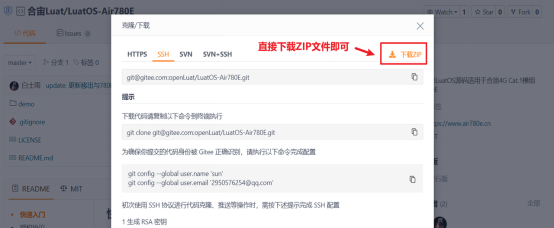
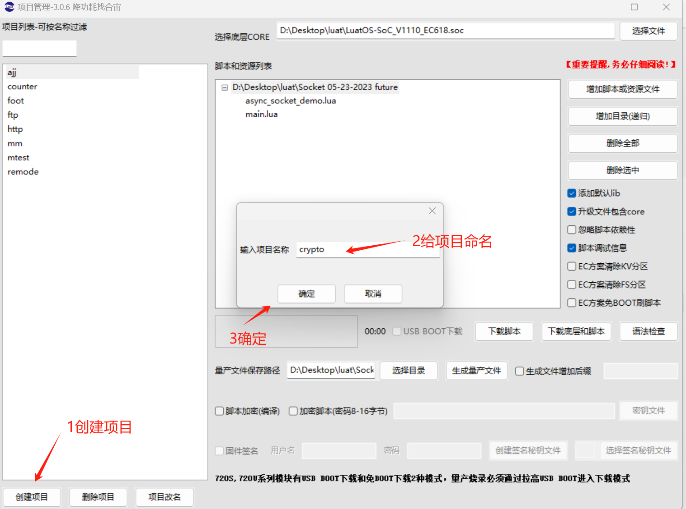
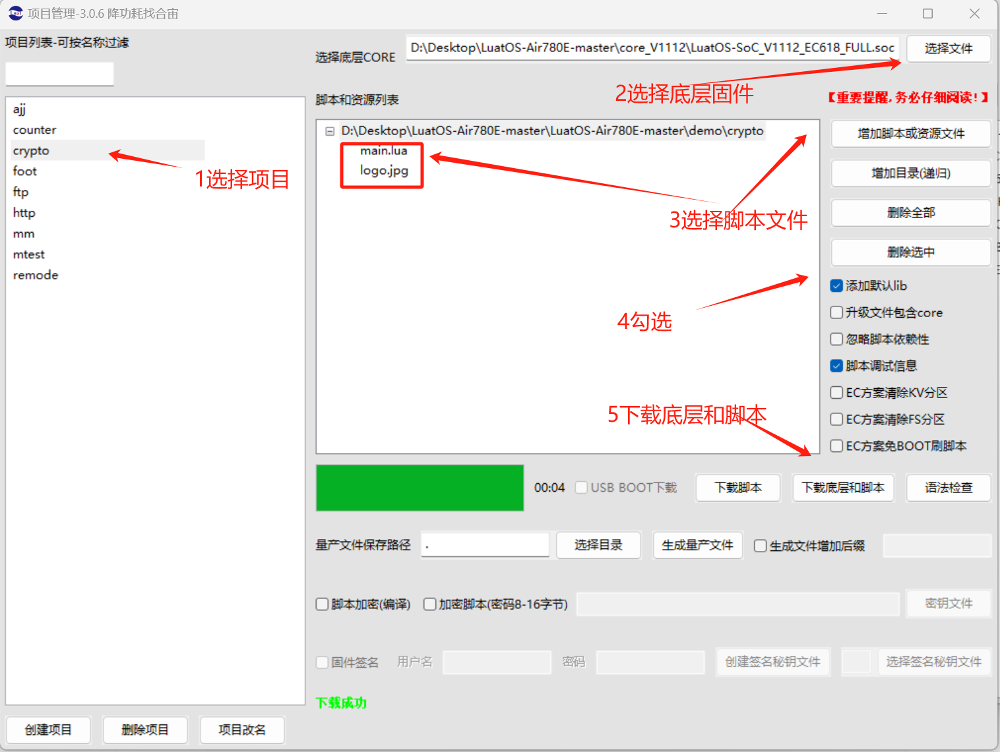
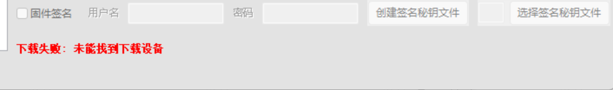
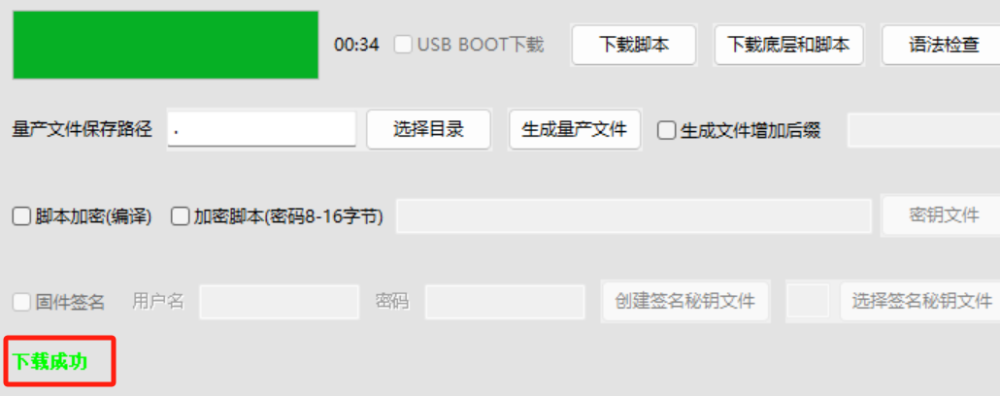

## 一、加解密概述

加解密算法是保证数据安全的基础技术，无论是在数据传输、存储，还是用户身份验证中，都起着至关重要的作用.随着互联网的发展和信息安全威胁的增加，了解并掌握常用的加解密算法已经成为开发者和安全从业者的必修课.

常见的 15 种加密解密算法分别是：散列哈希[MD5、SHA1、CRC32]，对称[DES，3DES（TDEA、Triple DES），AES、，Blowfish，RC4、RC5，IDEA]，Base64、Rabbit、Escape.

【三种分类】

1、对称加密：对称加密是指加密和解密使用同一个密钥的加密方法.由于加密和解密过程中的密钥相同，因此需要在通信双方之间安全地共享密钥.对称加密的速度较快，适合用于大量数据的加密

2、非对称加密:非对称加密算法采用一对密钥：公钥和私钥.公钥用于加密，私钥用于解密.由于加密和解密使用不同的密钥，非对称加密算法解决了密钥分发的问题，是当前加密系统中安全性最高的加密技术之一.

3、Hash 算法，这是一种不可逆的算法，它常用于验证数据的完整性

## 二、演示功能概述

本文章通过 Air780 的核心板烧录 LuatOS 示例代码([点此链接查看 crypto 的 demo 例子](https://gitee.com/openLuat/LuatOS-Air780E/tree/master/demo/crypto)),来演示有关加解密的各种 API 的功能.

API 的具体用法,读者可以参考本文中的"五、API 说明".

## 三、硬件准备

### 3.1 Air780E 核心板

使用 Air780E 核心板，如下图所示：


淘宝购买链接：[Air780E 核心板淘宝购买链接](https://item.taobao.com/item.htm?id=693774140934&pisk=f1eiwOqL25l1_HYiV6D1ize3wN5d5FMjRrpxkx3VT2uIHCCskWm4kysffAEqor4KRRIskGT0ooqi_coq7DWE000qbVr2mmzKQjNtkV3mnoalvaBRelZshA7RyTFdpD4xQco2_VS2Tcnvc89h5lZshq-pu_FUfEDVVdOmgrkET0ir3mkq_MDEmmM2QjJaY2uI0UGAoNueWRjiw4YTC-_opNr-zluaXleFpfR_X2fhTJVn94W--KJ4KcqQreCDEs3zNVh-DyWpIxqEmyc8savgoor7gX2D7GUzmW4jBJS2_4PTWjestFRZqA0iaRlwjdkIgW2nBR7XNkEn7bDL96_tMA4gN4GNOwa0xVU4IX8G4iReapZyhDSYLIOj_DinyhbSB2IHjbEhxMA51foIXaIhxItMPKJlyMjHNEGZAcQR.&spm=a1z10.5-c-s.w4002-24045920841.33.639f1fd1YrS4b6&skuId=5098266470883) ；

此核心板的详细使用说明参考：[Air780E 产品手册](https://docs.openluat.com/air780e/product/) 中的 << 开发板 Core_Air780E 使用说明 VX.X.X.pdf>>，写这篇文章时最新版本的使用说明为：开发板 Core_Air780E 使用说明 V1.0.5.pdf ；核心板使用过程中遇到任何问题，可以直接参考这份使用说明 pdf 文档.

### 3.2 SIM 卡

中国大陆环境下，可以上网的 sim 卡,一般来说，使用移动，电信，联通的物联网卡或者手机卡都行.

### 3.3 PC 电脑

WINDOWS 系统.

### 3.4 数据通信线

USB 数据线.

## 四、软件环境

### 4.1 Luatools 工具

要想烧录 LuatOS 到 4G 模组中，需要用到合宙的强大的调试工具：Luatools

详细使用说明参考：[Luatools 工具使用说明](https://docs.openluat.com/Luatools/) .

Luatools 工具集具备以下几大核心功能：

- 一键获取最新固件：自动连接合宙服务器，轻松下载最新的合宙模组固件.
- 固件与脚本烧录：便捷地将固件及脚本文件烧录至目标模组中.
- 串口日志管理：实时查看模组通过串口输出的日志信息，并支持保存功能.
- 串口调试助手：提供简洁的串口调试界面，满足基本的串口通信测试需求.

Luatools 下载之后， 无需安装， 解压到你的硬盘，点击 Luatools_v3.exe 即可运行.

### 4.2 准备需要烧录的代码

首先要说明一点： 脚本代码， 要和固件的 soc 文件一起烧录.

#### 4.2.1 **烧录的底层固件文件**

底层 core 下载地址：[LuatOS 固件版本下载地址](https://docs.openluat.com/air780e/luatos/firmware/)


Air780E 的底层固件在 Luatools 解压后目录的 **LuatOS-SoC_V1112_EC618_FULL.soc**


#### 4.2.2 **烧录的脚本代码**

首先要下载 Air780 的 LuatOS 示例代码到一个合适的项目目录,示例代码网站: [https://gitee.com/openLuat/LuatOS-Air780E](https://gitee.com/openLuat/LuatOS-Air780E)

下载流程参考下图:




下载的文件解压,找到 LuatOS-Air780E-master\demo\crypto\main.lua,如图:


## 五、API 说明

### 5.1 crypto.md5(str)

计算 md5 值

**参数**

| **传入值类型**<br/> | **解释**<br/>         |
| ------------------- | --------------------- |
| string<br/>         | 需要计算的字符串<br/> |

**返回值**

| **返回值类型**<br/> | **解释**<br/>                       |
| ------------------- | ----------------------------------- |
| string<br/>         | 计算得出的 md5 值的 hex 字符串<br/> |

**例子**

-- 计算字符串"abc"的 md5

log.info("md5", crypto.md5("abc"))

---

### 5.2 crypto.hmac_md5(str, key)

计算 hmac_md5 值

**参数**

| **传入值类型**<br/> | **解释**<br/>         |
| ------------------- | --------------------- |
| string<br/>         | 需要计算的字符串<br/> |
| string<br/>         | 密钥<br/>             |

**返回值**

| **返回值类型**<br/> | **解释**<br/>                            |
| ------------------- | ---------------------------------------- |
| string<br/>         | 计算得出的 hmac_md5 值的 hex 字符串<br/> |

**例子**

-- 计算字符串"abc"的 hmac_md5

log.info("hmac_md5", crypto.hmac_md5("abc", "1234567890"))

---

### 5.3 crypto.sha1(str)

计算 sha1 值

**参数**

| **传入值类型**<br/> | **解释**<br/>         |
| ------------------- | --------------------- |
| string<br/>         | 需要计算的字符串<br/> |

**返回值**

| **返回值类型**<br/> | **解释**<br/>                        |
| ------------------- | ------------------------------------ |
| string<br/>         | 计算得出的 sha1 值的 hex 字符串<br/> |

**例子**

-- 计算字符串"abc"的 sha1

log.info("sha1", crypto.sha1("abc"))

---

### 5.4 crypto.hmac_sha1(str, key)

计算 hmac_sha1 值

**参数**

| **传入值类型**<br/> | **解释**<br/>         |
| ------------------- | --------------------- |
| string<br/>         | 需要计算的字符串<br/> |
| string<br/>         | 密钥<br/>             |

**返回值**

| **返回值类型**<br/> | **解释**<br/>                             |
| ------------------- | ----------------------------------------- |
| string<br/>         | 计算得出的 hmac_sha1 值的 hex 字符串<br/> |

**例子**

-- 计算字符串"abc"的 hmac_sha1

log.info("hmac_sha1", crypto.hmac_sha1("abc", "1234567890"))

---

### 5.5 crypto.sha256(str)

计算 sha256 值

**参数**

| **传入值类型**<br/> | **解释**<br/>         |
| ------------------- | --------------------- |
| string<br/>         | 需要计算的字符串<br/> |

**返回值**

| **返回值类型**<br/> | **解释**<br/>                          |
| ------------------- | -------------------------------------- |
| string<br/>         | 计算得出的 sha256 值的 hex 字符串<br/> |

**例子**

-- 计算字符串"abc"的 sha256

log.info("sha256", crypto.sha256("abc"))

---

### 5.6 crypto.hmac_sha256(str, key)

计算 hmac_sha256 值

**参数**

| **传入值类型**<br/> | **解释**<br/>         |
| ------------------- | --------------------- |
| string<br/>         | 需要计算的字符串<br/> |
| string<br/>         | 密钥<br/>             |

**返回值**

| **返回值类型**<br/> | **解释**<br/>                               |
| ------------------- | ------------------------------------------- |
| string<br/>         | 计算得出的 hmac_sha256 值的 hex 字符串<br/> |

**例子**

-- 计算字符串"abc"的 hmac_sha256

log.info("hmac_sha256", crypto.hmac_sha256("abc", "1234567890"))

---

### 5.7 crypto.sha512(str)

计算 sha512 值

**参数**

| **传入值类型**<br/> | **解释**<br/>         |
| ------------------- | --------------------- |
| string<br/>         | 需要计算的字符串<br/> |

**返回值**

| **返回值类型**<br/> | **解释**<br/>                          |
| ------------------- | -------------------------------------- |
| string<br/>         | 计算得出的 sha512 值的 hex 字符串<br/> |

**例子**

-- 计算字符串"abc"的 sha512

log.info("sha512", crypto.sha512("abc"))

---

### 5.8 crypto.hmac_sha512(str, key)

计算 hmac_sha512 值

**参数**

| **传入值类型**<br/> | **解释**<br/>         |
| ------------------- | --------------------- |
| string<br/>         | 需要计算的字符串<br/> |
| string<br/>         | 密钥<br/>             |

**返回值**

| **返回值类型**<br/> | **解释**<br/>                               |
| ------------------- | ------------------------------------------- |
| string<br/>         | 计算得出的 hmac_sha512 值的 hex 字符串<br/> |

**例子**

-- 计算字符串"abc"的 hmac_sha512

log.info("hmac_sha512", crypto.hmac_sha512("abc", "1234567890"))

---

### 5.9 crypto.base64_encode(data)

将数据进行 base64 编码

**参数**

| **传入值类型**<br/> | **解释**<br/>     |
| ------------------- | ----------------- |
| string<br/>         | 待编码的数据<br/> |

**返回值**

| **返回值类型**<br/> | **解释**<br/>     |
| ------------------- | ----------------- |
| string<br/>         | 编码后的数据<br/> |

**例子**

-- 本函数与 string.toBase64 是同一个

local data = "123"

local bdata = crypto.base64_encode(data)

log.info("base64", "encode", data, bdata)

data = crypto.base64_decode(data)

log.info("base64", "decode", data, bdata)

---

### 5.10 crypto.base64_decode(data)

将数据进行 base64 解码

**参数**

| **传入值类型**<br/> | **解释**<br/>     |
| ------------------- | ----------------- |
| string<br/>         | 待解码的数据<br/> |

**返回值**

| **返回值类型**<br/> | **解释**<br/>     |
| ------------------- | ----------------- |
| string<br/>         | 解码后的数据<br/> |

**例子**

-- 本函数与 string.fromBase64 是同一个

local data = "123"

local bdata = crypto.base64_encode(data)

log.info("base64", "encode", data, bdata)

data = crypto.base64_decode(data)

log.info("base64", "decode", data, bdata)

---

### 5.11 crypto.cipher_list()

获取当前固件支持的 cipher 列表

**参数**

无

**返回值**

| **返回值类型**<br/> | **解释**<br/>                            |
| ------------------- | ---------------------------------------- |
| table<br/>          | 本固件支持的 cipher 列表,字符串数组<br/> |

**例子**

-- 本 API 于 2022.07.27 添加

local ciphers = crypto.cipher_list()

if ciphers then

log.info("crypto", "ciphers list", json.encode(ciphers))

end

---

### 5.12 crypto.cipher_suites()

获取当前固件支持的 cipher suites 列表

**参数**

无

**返回值**

| **返回值类型**<br/> | **解释**<br/>                                   |
| ------------------- | ----------------------------------------------- |
| table<br/>          | 本固件支持的 cipher suites 列表,字符串数组<br/> |

**例子**

-- 本 API 于 2022.11.16 添加

local suites = crypto.cipher_suites()

if suites then

log.info("crypto", "ciphers suites", json.encode(suites))

end

---

### 5.13 crypto.cipher_encrypt(type, padding, str, key, iv)

对称加密

**参数**

| **传入值类型**<br/> | **解释**<br/>                                                            |
| ------------------- | ------------------------------------------------------------------------ |
| string<br/>         | 算法名称, 例如 AES-128-ECB/AES-128-CBC, 可查阅 crypto.cipher_list()<br/> |
| string<br/>         | 对齐方式, 支持 PKCS7/ZERO/ONE_AND_ZEROS/ZEROS_AND_LEN/NONE<br/>          |
| string<br/>         | 需要加密的数据<br/>                                                      |
| string<br/>         | 密钥,需要对应算法的密钥长度<br/>                                         |
| string<br/>         | IV 值, 非 ECB 算法需要<br/>                                              |

**返回值**

| **返回值类型**<br/> | **解释**<br/>       |
| ------------------- | ------------------- |
| string<br/>         | 加密后的字符串<br/> |

**例子**

-- 计算 AES

local data = crypto.cipher_encrypt("AES-128-ECB", "PKCS7", "1234567890123456", "1234567890123456")

local data2 = crypto.cipher_encrypt("AES-128-CBC", "PKCS7", "1234567890123456", "1234567890123456", "1234567890666666")

---

### 5.14 crypto.cipher_decrypt(type, padding, str, key, iv)

对称解密

**参数**

| **传入值类型**<br/> | **解释**<br/>                                                            |
| ------------------- | ------------------------------------------------------------------------ |
| string<br/>         | 算法名称, 例如 AES-128-ECB/AES-128-CBC, 可查阅 crypto.cipher_list()<br/> |
| string<br/>         | 对齐方式, 支持 PKCS7/ZERO/ONE_AND_ZEROS/ZEROS_AND_LEN/NONE<br/>          |
| string<br/>         | 需要解密的数据<br/>                                                      |
| string<br/>         | 密钥,需要对应算法的密钥长度<br/>                                         |
| string<br/>         | IV 值, 非 ECB 算法需要<br/>                                              |

**返回值**

| **返回值类型**<br/> | **解释**<br/>       |
| ------------------- | ------------------- |
| string<br/>         | 解密后的字符串<br/> |

**例子**

-- 用 AES 加密,然后用 AES 解密

local data = crypto.cipher_encrypt("AES-128-ECB", "PKCS7", "1234567890123456", "1234567890123456")

local data2 = crypto.cipher_decrypt("AES-128-ECB", "PKCS7", data, "1234567890123456")

-- data 的 hex 为 757CCD0CDC5C90EADBEEECF638DD0000

-- data2 的值为 1234567890123456

---

### 5.15 crypto.crc16(method, data, poly, initial, finally, inReversem outReverse)

计算 CRC16

**参数**

| **传入值类型**<br/> | **解释**<br/>                                                                                                                 |
| ------------------- | ----------------------------------------------------------------------------------------------------------------------------- |
| string<br/>         | CRC16 模式（”IBM”,”MAXIM”,”USB”,”MODBUS”,”CCITT”,”CCITT-FALSE”,”X25”,”XMODEM”,”DNP”,”USER-DEFINED”）<br/> |
| string<br/>         | 字符串<br/>                                                                                                                   |
| int<br/>            | poly 值<br/>                                                                                                                  |
| int<br/>            | initial 值<br/>                                                                                                               |
| int<br/>            | finally 值<br/>                                                                                                               |
| int<br/>            | 输入反转,1 反转,默认 0 不反转<br/>                                                                                            |
| int<br/>            | 输入反转,1 反转,默认 0 不反转<br/>                                                                                            |

**返回值**

| **返回值类型**<br/> | **解释**<br/>        |
| ------------------- | -------------------- |
| int<br/>            | 对应的 CRC16 值<br/> |

**例子**

-- 计算 CRC16

local crc = crypto.crc16("")

---

### 5.16 crypto.crc16_modbus(data, start)

直接计算 modbus 的 crc16 值

**参数**

| **传入值类型**<br/> | **解释**<br/>             |
| ------------------- | ------------------------- |
| string<br/>         | 数据<br/>                 |
| int<br/>            | 初始化值,默认 0xFFFF<br/> |

**返回值**

| **返回值类型**<br/> | **解释**<br/>        |
| ------------------- | -------------------- |
| int<br/>            | 对应的 CRC16 值<br/> |

**例子**

-- 计算 CRC16 modbus

local crc = crypto.crc16_modbus(data)

-- 2023.11.06 新增初始值设置

crc = crypto.crc16_modbus(data, 0xFFFF)

---

### 5.17 crypto.crc32(data)

计算 crc32 值

**参数**

| **传入值类型**<br/> | **解释**<br/> |
| ------------------- | ------------- |
| string<br/>         | 数据<br/>     |

**返回值**

| **返回值类型**<br/> | **解释**<br/>        |
| ------------------- | -------------------- |
| int<br/>            | 对应的 CRC32 值<br/> |

**例子**

-- 计算 CRC32

local crc = crypto.crc32(data)

---

### 5.18 crypto.crc8(data, poly, start, revert)

计算 crc8 值

**参数**

| **传入值类型**<br/> | **解释**<br/>                                             |
| ------------------- | --------------------------------------------------------- |
| string<br/>         | 数据<br/>                                                 |
| int<br/>            | crc 多项式，可选，如果不写，将忽略除了数据外所有参数<br/> |
| int<br/>            | crc 初始值，可选，默认 0<br/>                             |
| boolean<br/>        | 是否需要逆序处理，默认否<br/>                             |

**返回值**

| **返回值类型**<br/> | **解释**<br/>       |
| ------------------- | ------------------- |
| int<br/>            | 对应的 CRC8 值<br/> |

**例子**

-- 计算 CRC8

local crc = crypto.crc8(data)

local crc = crypto.crc8(data, 0x31, 0xff, false)

---

### 5.19 crypto.crc7(data, poly, start)

计算 crc7 值

**参数**

| **传入值类型**<br/> | **解释**<br/>                    |
| ------------------- | -------------------------------- |
| string<br/>         | 数据<br/>                        |
| int<br/>            | crc 多项式，可选，默认 0xE5<br/> |
| int<br/>            | crc 初始值，可选，默认 0x00<br/> |

**返回值**

| **返回值类型**<br/> | **解释**<br/>       |
| ------------------- | ------------------- |
| int<br/>            | 对应的 CRC7 值<br/> |

**例子**

-- 计算 CRC7, 本 API 于 2023.10.07 新增

local crc = crypto.crc7(data)

local crc = crypto.crc7(data, 0x31, 0xff)

---

### 5.20 crypto.checksum(data, mode)

计算 checksum 校验和

**参数**

| **传入值类型**<br/> | **解释**<br/>                                    |
| ------------------- | ------------------------------------------------ |
| string<br/>         | 待计算的数据,必选<br/>                           |
| int<br/>            | 模式,累加模式, 0 - 异或, 1 - 累加, 默认为 0<br/> |

**返回值**

| **返回值类型**<br/> | **解释**<br/>           |
| ------------------- | ----------------------- |
| int<br/>            | checksum 值,校验和<br/> |

**例子**

-- 本函数在 2022.12.28 添加

-- 单纯计算 checksum 值

local ck = crypto.checksum("OK")

log.info("checksum", "ok", string.format("%02X", ck))-- 第二个参数 mode 在 2023.5.23 日添加

---

### 5.21 crypto.trng(len)

生成真随机数

**参数**

| **传入值类型**<br/> | **解释**<br/> |
| ------------------- | ------------- |
| int<br/>            | 数据长度<br/> |

**返回值**

| **返回值类型**<br/> | **解释**<br/>         |
| ------------------- | --------------------- |
| string<br/>         | 指定随机数字符串<br/> |

**例子**

-- 生成 32 位随机数 ir

local r = crypto.trng(4)

local _, ir = pack.unpack(r, "I")

---

### 5.22 crypto.totp(secret,time)

计算 TOTP 动态密码的结果

**参数**

| **传入值类型**<br/> | **解释**<br/>                                   |
| ------------------- | ----------------------------------------------- |
| string<br/>         | 网站提供的密钥（就是 BASE32 编码后的结果）<br/> |
| int<br/>            | 可选，时间戳，默认当前时间<br/>                 |

**返回值**

| **返回值类型**<br/> | **解释**<br/>                              |
| ------------------- | ------------------------------------------ |
| int<br/>            | 计算得出的六位数结果 计算失败返回 nil<br/> |

**例子**

--使用当前系统时间计算

local otp = crypto.totp("asdfassdfasdfass")

---

### 5.23 crypto.md_file(tp, path, hmac)

计算文件的 hash 值(md5/sha1/sha256 及 hmac 形式)

**参数**

| **传入值类型**<br/> | **解释**<br/>                                              |
| ------------------- | ---------------------------------------------------------- |
| string<br/>         | hash 类型, 大小字母, 例如 “MD5” “SHA1” “SHA256”<br/> |
| string<br/>         | 文件路径, 例如 /luadb/logo.jpg<br/>                        |
| string<br/>         | hmac 值,可选<br/>                                          |

**返回值**

| **返回值类型**<br/> | **解释**<br/>                          |
| ------------------- | -------------------------------------- |
| string<br/>         | HEX 过的 hash 值,若失败会无返回值<br/> |

**例子**

-- 无 hmac 的 hash 值

log.info("md5", crypto.md_file("MD5", "/luadb/logo.jpg"))

log.info("sha1", crypto.md_file("SHA1", "/luadb/logo.jpg"))

log.info("sha256", crypto.md_file("SHA256", "/luadb/logo.jpg"))

-- 带 hmac 的 hash 值

log.info("hmac_md5", crypto.md_file("MD5", "/luadb/logo.jpg", "123456"))

log.info("hmac_sha1", crypto.md_file("SHA1", "/luadb/logo.jpg", "123456"))

log.info("hmac_sha256", crypto.md_file("SHA256", "/luadb/logo.jpg", "123456"))

---

### 5.24 crypto.md(tp, data, hmac)

计算数据的 hash 值(md5/sha1/sha256 及 hmac 形式)

**参数**

| **传入值类型**<br/> | **解释**<br/>                                              |
| ------------------- | ---------------------------------------------------------- |
| string<br/>         | hash 类型, 大小字母, 例如 “MD5” “SHA1” “SHA256”<br/> |
| string<br/>         | 待处理的数据<br/>                                          |
| string<br/>         | hmac 值,可选<br/>                                          |

**返回值**

| **返回值类型**<br/> | **解释**<br/>                          |
| ------------------- | -------------------------------------- |
| string<br/>         | HEX 过的 hash 值,若失败会无返回值<br/> |

**例子**

-- 无 hmac 的 hash 值

log.info("md5", crypto.md("MD5", "1234567890"))

log.info("sha1", crypto.md("SHA1", "1234567890"))

log.info("sha256", crypto.md("SHA256", "1234567890"))

-- 带 hmac 的 hash 值

log.info("hmac_md5", crypto.md("MD5", "1234567890", "123456"))

log.info("hmac_sha1", crypto.md("SHA1", "1234567890", "123456"))

log.info("hmac_sha256", crypto.md("SHA256", "1234567890", "123456"))

---

### 5.25 crypto.hash_init(tp)

创建流式 hash 用的 stream

**参数**

| **传入值类型**<br/> | **解释**<br/>                                              |
| ------------------- | ---------------------------------------------------------- |
| string<br/>         | hash 类型, 大写字母, 例如 “MD5” “SHA1” “SHA256”<br/> |
| string<br/>         | hmac 值，可选<br/>                                         |

**返回值**

| **返回值类型**<br/> | **解释**<br/>                          |
| ------------------- | -------------------------------------- |
| userdata<br/>       | 成功返回一个数据结构,否则返回 nil<br/> |

**例子**

-- 无 hmac 的 hash stream

local md5_stream = crypto.hash_init("MD5")

local sha1_stream = crypto.hash_init("SHA1")

local sha256_stream = crypto.hash_init("SHA256")

-- 带 hmac 的 hash stream

local md5_stream = crypto.hash_init("MD5", "123456")

local sha1_stream = crypto.hash_init("SHA1", "123456")

local sha256_stream = crypto.hash_init("SHA256", "123456")

---

### 5.26 crypto.hash_update(stream, data)

流式 hash 更新数据

**参数**

| **传入值类型**<br/> | **解释**<br/>                              |
| ------------------- | ------------------------------------------ |
| userdata<br/>       | crypto.hash_init()创建的 stream, 必选<br/> |
| string<br/>         | 待计算的数据,必选<br/>                     |
| return<br/>         | 无<br/>                                    |

**返回值**

无

**例子**

crypto.hash_update(stream, "OK")

---

### 5.27 crypto.hash_finish(stream)

获取流式 hash 校验值并释放创建的 stream

**参数**

| **传入值类型**<br/> | **解释**<br/>                             |
| ------------------- | ----------------------------------------- |
| userdata<br/>       | crypto.hash_init()创建的 stream,必选<br/> |

**返回值**

| **返回值类型**<br/> | **解释**<br/>                                                |
| ------------------- | ------------------------------------------------------------ |
| string<br/>         | 成功返回计算得出的流式 hash 值的 hex 字符串，失败无返回<br/> |

**例子**

local hashResult = crypto.hash_finish(stream)

---

## 六、功能验证

### 6.1 烧录固件

#### 6.1.1 **正确连接电脑和 4G 模组电路板**

使用带有数据通信功能的数据线，不要使用仅有充电功能的数据线.

#### 6.1.2 **识别 4G 模组的 boot 引脚**

在下载之前，要用模组的 boot 引脚触发下载， 也就是说，要把 4G 模组的 boot 引脚拉到 1.8v，或者直接把 boot 引脚和 VDD_EXT 引脚相连.我们要在按下 BOOT 按键时让模块开机，就可以进入下载模式了.

具体到 Air780E 开发板:

1、当我们模块没开机时，按着 BOOT 键然后长按 POW 开机.

2、当我们模块开机时，按着 BOOT 键然后点按重启键即可.


#### 6.1.3 **识别电脑的正确端口**

判断是否进入 BOOT 模式：模块上电，此时在电脑的设备管理器中，查看串口设备， 会出现一个端口表示进入了 boot 下载模式，如下图所示：


当设备管理器出现了 3 个连续数字的 com 端口，这时候， 硬件连接上就绪状态，恭喜你，可以进行烧录了！

#### 6.1.4 用 Luatools 工具烧录

- 新建项目

首先，确保你的 Luatools 的版本，大于等于 3.0.6 版本的.

在 Luatools 的左上角上有版本显示的，如图所示：


Luatools 版本没问题的话， 就点击 Luatools 右上角的“项目管理测试”按钮，如下图所示：


这时会弹出项目管理和烧录管理的对话框，可以新建一个项目,如下图：



- 开始烧录

选择 780E 板子对应的底层 core 和刚改的 main.lua 脚本文件.下载到板子中.



点击下载后，我们需要进入 boot 模式才能正常下载.

如果没进入 boot 模式会出现下图情况:



进入 boot 模式下载,如图:




### 6.2 例程

本库有专属 demo，[点此链接查看 crypto 的 demo 例子](https://gitee.com/openLuat/LuatOS-Air780E/tree/master/demo/crypto)

```lua
-- LuaTools需要PROJECT和VERSION这两个信息
PROJECT = "cryptodemo"
VERSION = "1.0.0"

log.info("main", PROJECT, VERSION)

-- sys库是标配
_G.sys = require("sys")

-- Air780E的AT固件默认会为开机键防抖, 导致部分用户刷机很麻烦
if rtos.bsp() == "EC618" and pm and pm.PWK_MODE then
    pm.power(pm.PWK_MODE, false)
end


if wdt then
    --添加硬狗防止程序卡死，在支持的设备上启用这个功能
    wdt.init(9000)--初始化watchdog设置为9s
    sys.timerLoopStart(wdt.feed, 3000)--3s喂一次狗
end

sys.taskInit(function()

    sys.wait(1000)

    -- MD5,输出结果已经hex编码
    log.info("md5", crypto.md5("abc"))
    log.info("hmac_md5", crypto.hmac_md5("abc", "1234567890"))

    -- SHA1,输出结果已经hex编码
    log.info("sha1", crypto.sha1("abc"))
    log.info("hmac_sha1", crypto.hmac_sha1("abc", "1234567890"))

    -- SHA256,输出结果已经hex编码
    log.info("sha256", crypto.sha256("abc"))
    log.info("hmac_sha256", crypto.hmac_sha256("abc", "1234567890"))

    -- SHA512,输出结果已经hex编码
    log.info("sha512", crypto.sha512("abc"))
    log.info("hmac_sha512", crypto.hmac_sha512("abc", "1234567890"))

        local data_encrypt = crypto.cipher_encrypt("AES-128-ECB", "ZERO", "023001", "HZBIT@WLW/YSBKEY")
        log.info("AES", "aes-128-ecb", data_encrypt:toHex())
        local data_decrypt = crypto.cipher_decrypt("AES-128-ECB", "ZERO", data_encrypt, "HZBIT@WLW/YSBKEY")
        log.info("AES", "aes-128-ecb", data_decrypt)

    -- AES加密, 未经Hex编码. AES-128-ECB 算法,待加密字符串如果超过32字节会报错,待查. by wendal 20200812
    local data_encrypt = crypto.cipher_encrypt("AES-128-ECB", "PKCS7", "12345678901234 > 123456", "1234567890123456")
    local data2_encrypt = crypto.cipher_encrypt("AES-128-CBC", "PKCS7", "12345678901234 > 123456", "1234567890123456", "1234567890666666")
    log.info("AES", "aes-128-ecb", data_encrypt:toHex())
    log.info("AES", "aes-128-cbc", data2_encrypt:toHex())

    -- AES解密, 未经Hex编码
    local data_decrypt = crypto.cipher_decrypt("AES-128-ECB", "PKCS7", data_encrypt, "1234567890123456")
    local data2_decrypt = crypto.cipher_decrypt("AES-128-CBC", "PKCS7", data2_encrypt, "1234567890123456", "1234567890666666")
    log.info("AES", "aes-128-ecb", data_decrypt)
    log.info("AES", "aes-128-cbc", data2_decrypt)
    log.info("mem", rtos.meminfo("sys"))

    -- DES-ECB 加解密
    local data1 = crypto.cipher_encrypt("DES-ECB", "PKCS7", "abcdefg", "12345678")
    if data1 then -- DES-ECB 在某些平台不支持的
        log.info("des", data1:toHex())
        local data2 = crypto.cipher_decrypt("DES-ECB", "PKCS7", data1, "12345678")
        log.info("des", data2)
    else
        log.info("des", "当前固件不支持DES/3DES")
    end

    -- 3DES-ECB 加解密
    local data1 = crypto.cipher_encrypt("DES-EDE3-ECB", "PKCS7", "abcdefg!!--ZZSS", "123456781234567812345678")
    if data1 then -- DES-ECB 在某些平台不支持的
        log.info("3des", data1:toHex())
        local data2 = crypto.cipher_decrypt("DES-EDE3-ECB", "PKCS7", data1, "123456781234567812345678")
        log.info("3des", data2)
    else
        log.info("3des", "当前固件不支持DES/3DES")
    end


    -- 打印所有支持的cipher
    if crypto.cipher_list then
        log.info("cipher", "list", json.encode(crypto.cipher_list()))
    else
        log.info("cipher", "当前固件不支持crypto.cipher_list")
    end
    -- 打印所有支持的cipher suites
    if crypto.cipher_suites then
        log.info("cipher", "suites", json.encode(crypto.cipher_suites()))
    else
        log.info("cipher", "当前固件不支持crypto.cipher_suites")
    end

    -- ---------------------------------------
    log.info("随机数测试")
    for i=1, 10 do
        sys.wait(100)
        log.info("crypto", "真随机数",string.unpack("I",crypto.trng(4)))
         log.info("crypto", "伪随机数",math.random()) -- 输出的是浮点数,不推荐
         log.info("crypto", "伪随机数",math.random(1, 65525)) -- 不推荐
    end

    -- totp的密钥
    log.info("totp的密钥")
    local secret = "VK54ZXPO74ISEM2E"
    --写死时间戳用来测试
    local ts = 1646796576
    --生成十分钟的动态码验证下
    for i=1,600,30 do
        local r = crypto.totp(secret,ts+i)
        local time = os.date("*t",ts+i + 8*3600)--东八区
        log.info("totp", string.format("%06d" ,r),time.hour,time.min,time.sec)
    end

    -- 文件测试
    log.info("文件hash值测试")
    if crypto.md_file then
        log.info("md5", crypto.md_file("MD5", "/luadb/logo.jpg"))
        log.info("sha1", crypto.md_file("SHA1", "/luadb/logo.jpg"))
        log.info("sha256", crypto.md_file("SHA256", "/luadb/logo.jpg"))

        log.info("hmac_md5", crypto.md_file("MD5", "/luadb/logo.jpg", "123456"))
        log.info("hmac_sha1", crypto.md_file("SHA1", "/luadb/logo.jpg", "123456"))
        log.info("hmac_sha256", crypto.md_file("SHA256", "/luadb/logo.jpg", "123456"))
    else
        log.info("文件hash值测试", "当前固件不支持crypto.md_file")
    end

    -- if crypto.checksum then
    --     log.info("checksum", "OK", string.char(crypto.checksum("OK")):toHex())
    --     log.info("checksum", "357E", string.char(crypto.checksum("357E", 1)):toHex())
    -- else
    --     log.info("checksum", "当前固件不支持crypto.checksum")
    -- end

    -- 流式hash测试
    log.info("流式hash测试")
    if crypto.hash_init then
        -- MD5
        local md5_obj = crypto.hash_init("MD5")
        crypto.hash_update(md5_obj, "1234567890")
        crypto.hash_update(md5_obj, "1234567890")
        crypto.hash_update(md5_obj, "1234567890")
        crypto.hash_update(md5_obj, "1234567890")
        local md5_result = crypto.hash_finish(md5_obj)
        log.info("md5_stream", md5_result)
        log.info("md5", crypto.md5("1234567890123456789012345678901234567890"))

        -- HMAC_MD5
        local hmac_md5_obj = crypto.hash_init("MD5", "1234567890")
        crypto.hash_update(hmac_md5_obj, "1234567890")
        crypto.hash_update(hmac_md5_obj, "1234567890")
        crypto.hash_update(hmac_md5_obj, "1234567890")
        crypto.hash_update(hmac_md5_obj, "1234567890")
        local hmac_md5_result = crypto.hash_finish(hmac_md5_obj)
        log.info("hmac_md5_stream", hmac_md5_result)
        log.info("hmac_md5", crypto.hmac_md5("1234567890123456789012345678901234567890", "1234567890"))

        -- SHA1
        local sha1_obj = crypto.hash_init("SHA1")
        crypto.hash_update(sha1_obj, "1234567890")
        crypto.hash_update(sha1_obj, "1234567890")
        crypto.hash_update(sha1_obj, "1234567890")
        crypto.hash_update(sha1_obj, "1234567890")
        local sha1_result = crypto.hash_finish(sha1_obj)
        log.info("sha1_stream", sha1_result)
        log.info("sha1", crypto.sha1("1234567890123456789012345678901234567890"))

        -- HMAC_SHA1
        local hmac_sha1_obj = crypto.hash_init("SHA1", "1234567890")
        crypto.hash_update(hmac_sha1_obj, "1234567890")
        crypto.hash_update(hmac_sha1_obj, "1234567890")
        crypto.hash_update(hmac_sha1_obj, "1234567890")
        crypto.hash_update(hmac_sha1_obj, "1234567890")
        local hmac_sha1_result = crypto.hash_finish(hmac_sha1_obj)
        log.info("hmac_sha1_stream", hmac_sha1_result)
        log.info("hmac_sha1", crypto.hmac_sha1("1234567890123456789012345678901234567890", "1234567890"))

        -- SHA256
        local sha256_obj = crypto.hash_init("SHA256")
        crypto.hash_update(sha256_obj, "1234567890")
        crypto.hash_update(sha256_obj, "1234567890")
        crypto.hash_update(sha256_obj, "1234567890")
        crypto.hash_update(sha256_obj, "1234567890")
        local sha256_result = crypto.hash_finish(sha256_obj)
        log.info("sha256_stream", sha256_result)
        log.info("sha256", crypto.sha256("1234567890123456789012345678901234567890"))

        -- HMAC_SHA256
        local hmac_sha256_obj = crypto.hash_init("SHA256", "1234567890")
        crypto.hash_update(hmac_sha256_obj, "1234567890")
        crypto.hash_update(hmac_sha256_obj, "1234567890")
        crypto.hash_update(hmac_sha256_obj, "1234567890")
        crypto.hash_update(hmac_sha256_obj, "1234567890")
        local hmac_sha256_result = crypto.hash_finish(hmac_sha256_obj)
        log.info("hmac_sha256_stream", hmac_sha256_result)
        log.info("hmac_sha256", crypto.hmac_sha256("1234567890123456789012345678901234567890", "1234567890"))

        -- SHA512
        local sha512_obj = crypto.hash_init("SHA512")
        if sha512_obj then
            crypto.hash_update(sha512_obj, "1234567890")
            crypto.hash_update(sha512_obj, "1234567890")
            crypto.hash_update(sha512_obj, "1234567890")
            crypto.hash_update(sha512_obj, "1234567890")
            local sha512_result = crypto.hash_finish(sha512_obj)
            log.info("sha512_stream", sha512_result)
            log.info("sha512", crypto.sha512("1234567890123456789012345678901234567890"))
        end

        -- HMAC_SHA512
        local hmac_sha512_obj = crypto.hash_init("SHA512", "1234567890")
        if hmac_sha512_obj then
            crypto.hash_update(hmac_sha512_obj, "1234567890")
            crypto.hash_update(hmac_sha512_obj, "1234567890")
            crypto.hash_update(hmac_sha512_obj, "1234567890")
            crypto.hash_update(hmac_sha512_obj, "1234567890")
            local hmac_sha512_result = crypto.hash_finish(hmac_sha512_obj)
            log.info("hmac_sha512_stream", hmac_sha512_result)
            log.info("hmac_sha512", crypto.hmac_sha512("1234567890123456789012345678901234567890", "1234567890"))
        end
    else
        log.info("crypto", "当前固件不支持crypto.hash_init")
    end

   log.info("crc7测试")
    if crypto.crc7 then
        local result = crypto.crc7(string.char(0xAA), 0xE5, 0x00)
        log.info("crc7测试", result, string.format("%02X", result))
    else
        log.info("crypto", "当前固件不支持crypto.crc7")
    end

    log.info("crypto", "ALL Done")
    sys.wait(100000)
end)

-- 用户代码已结束---------------------------------------------
-- 结尾总是这一句
sys.run()
-- sys.run()之后后面不要加任何语句!!!!!
```

### 6.3 对应 log

```
[2024-10-18 10:28:47.292] 工具提示: soc log port COM5打开成功
[2024-10-18 10:28:47.330] 工具提示: ap log port COM6打开成功
[2024-10-18 10:28:47.332] 工具提示: 用户虚拟串口 COM9
[2024-10-18 10:28:47.418] 工具提示: 用户log保存在D:\Desktop\LuaTools\log\trace_2024-10-18_102847.txt 如果有问题交给FAE
[2024-10-18 10:28:47.418][000000000.009] am_service_init 851:Air780E_A17
[2024-10-18 10:28:47.426][000000000.023] Uart_BaseInitEx 1049:uart 0 rx cache 256 dma 256
[2024-10-18 10:28:47.427][000000000.225] self_info 122:model Air780E_A17 imei 868327075469021
[2024-10-18 10:28:47.428][000000000.226] I/pm poweron: Power/Reset
[2024-10-18 10:28:47.429][000000000.226] I/main LuatOS@EC618 base 23.11 bsp V1112 32bit
[2024-10-18 10:28:47.430][000000000.226] I/main ROM Build: Sep  3 2024 15:55:27
[2024-10-18 10:28:47.431][000000000.234] D/main loadlibs luavm 262136 14360 14392
[2024-10-18 10:28:47.431][000000000.235] D/main loadlibs sys   277872 54024 81264
[2024-10-18 10:28:47.432][000000000.255] I/user.main        cryptodemo        1.0.0
[2024-10-18 10:28:48.224][000000001.281] I/user.md5        900150983CD24FB0D6963F7D28E17F72
[2024-10-18 10:28:48.226][000000001.283] I/user.hmac_md5        416478FC0ACE1C4AB37F85F4F86A16B1
[2024-10-18 10:28:48.228][000000001.284] I/user.sha1        A9993E364706816ABA3E25717850C26C9CD0D89D
[2024-10-18 10:28:48.229][000000001.285] I/user.hmac_sha1        DAE54822C0DAF6C115C97B0AD62C7BCBE9D5E6FC
[2024-10-18 10:28:48.230][000000001.287] I/user.sha256        BA7816BF8F01CFEA414140DE5DAE2223B00361A396177A9CB410FF61F20015AD
[2024-10-18 10:28:48.231][000000001.288] I/user.hmac_sha256        86055184805B4A466A7BE398FF4A7159F9055EA7EEF339FC94DCEC6F165898BA
[2024-10-18 10:28:48.232][000000001.289] I/user.sha512        DDAF35A193617ABACC417349AE20413112E6FA4E89A97EA20A9EEEE64B55D39A2192992A274FC1A836BA3C23A3FEEBBD454D4423643CE80E2A9AC94FA54CA49F
[2024-10-18 10:28:48.233][000000001.292] I/user.hmac_sha512        0F92B9AC88949E0BF7C9F1E6F9901BAB8EDFDC9E561DFDE428BC4339961A0569AD01B44343AA56E439949655D15C4D28492D459E75015489920243F3C9986F2A
[2024-10-18 10:28:48.236][000000001.293] D/crypto zero padding
[2024-10-18 10:28:48.237][000000001.294] I/user.AES        aes-128-ecb        013EEA6EBACCBD7AD990FAEF75FB99C4        32
[2024-10-18 10:28:48.238][000000001.295] I/user.AES        aes-128-ecb        023001
[2024-10-18 10:28:48.240][000000001.297] I/user.AES        aes-128-ecb        A37DE67837A1A3006E47A7BC25AA0ECC030B4E058E1972FE5B257FD8C3436142        64
[2024-10-18 10:28:48.242][000000001.298] I/user.AES        aes-128-cbc        26D98EA512AE92BC487536B83F2BE99B467649A9700338F4B4FF75AA2654DD2C        64
[2024-10-18 10:28:48.243][000000001.300] I/user.AES        aes-128-ecb        12345678901234 > 123456
[2024-10-18 10:28:48.245][000000001.300] I/user.AES        aes-128-cbc        12345678901234 > 123456
[2024-10-18 10:28:48.246][000000001.301] I/user.mem        277872        52116        81264
[2024-10-18 10:28:48.247][000000001.303] I/user.des        486CB8B81CACCDB7        16
[2024-10-18 10:28:48.249][000000001.304] I/user.des        abcdefg
[2024-10-18 10:28:48.250][000000001.306] I/user.3des        14619F067B425995D0CD975B85491D98        32
[2024-10-18 10:28:48.251][000000001.308] I/user.3des        abcdefg!!--ZZSS
[2024-10-18 10:28:48.254][000000001.311] I/user.cipher        list        ["AES-128-ECB","AES-192-ECB","AES-256-ECB","AES-128-CBC","AES-192-CBC","AES-256-CBC","AES-128-CTR","AES-192-CTR","AES-256-CTR","AES-128-GCM","AES-192-GCM","AES-256-GCM","AES-128-CCM","AES-192-CCM","AES-256-CCM","DES-ECB","DES-EDE-ECB","DES-EDE3-ECB","DES-CBC","DES-EDE-CBC","DES-EDE3-CBC"]
[2024-10-18 10:28:48.271][000000001.322] I/user.cipher        suites
[2024-10-18 10:28:48.276][000000001.322] ["TLS-ECDHE-ECDSA-WITH-AES-256-GCM-SHA384","TLS-ECDHE-RSA-WITH-AES-256-GCM-SHA384","TLS-ECDHE-ECDSA-WITH-AES-256-CCM","TLS-ECDHE-ECDSA-WITH-AES-256-CBC-SHA384","TLS-ECDHE-RSA-WITH-AES-256-CBC-SHA384","TLS-ECDHE-ECDSA-WITH-AES-256-CBC-SHA","TLS-ECDHE-RSA-WITH-AES-256-CBC-SHA","TLS-ECDHE-ECDSA-WITH-AES-256-CCM-8","TLS-ECDHE-ECDSA-WITH-AES-128-GCM-SHA256","TLS-ECDHE-RSA-WITH-AES-128-GCM-SHA256","TLS-ECDHE-ECDSA-WITH-AES-128-CCM","TLS-ECDHE-ECDSA-WITH-AES-128-CBC-SHA256","TLS-ECDHE-RSA-WITH-AES-128-CBC-SHA256","TLS-ECDHE-ECDSA-WITH-AES-128-CBC-SHA","TLS-ECDHE-RSA-WITH-AES-128-CBC-SHA","TLS-ECDHE-ECDSA-WITH-AES-128-CCM-8","TLS-RSA-WITH-AES-256-GCM-SHA384","TLS-RSA-WITH-AES-256-CCM","TLS-RSA-WITH-AES-256-CBC-SHA256","TLS-RSA-WITH-AES-256-CBC-SHA","TLS-RSA-WITH-AES-256-CCM-8","TLS-RSA-WITH-AES-128-GCM-SHA256","TLS-RSA-WITH-AES-128-CCM","TLS-RSA-WITH-AES-128-CBC-SHA256","TLS-RSA-WITH-AES-128-CBC-SHA","TLS-RSA-WITH-AES-128-CCM-8","TLS-RSA-PSK-WITH-AES-256-GCM-SHA384","TLS-RSA-PSK-WITH-AES-256-CBC-SHA384","TLS-RSA-PSK-WITH-AES-256-CBC-SHA","TLS-RSA-PSK-WITH-AES-128-GCM-SHA256","TLS-RSA-PSK-WITH-AES-128-CBC-SHA256","TLS-RSA-PSK-WITH-AES-128-CBC-SHA","TLS-PSK-WITH-AES-256-GCM-SHA384","TLS-PSK-WITH-AES-256-CCM","TLS-PSK-WITH-AES-256-CBC-SHA384","TLS-PSK-WITH-AES-256-CBC-SHA","TLS-PSK-WITH-AES-256-CCM-8","TLS-PSK-WITH-AES-128-GCM-SHA256","TLS-PSK-WITH-AES-128-CCM","TLS-PSK-WITH-AES-128-CBC-SHA256","TLS-PSK-WITH-AES-128-CBC-SHA","TLS-PSK-WITH-AES-128-CCM-8"]
[2024-10-18 10:28:48.286][000000001.324] I/user.随机数测试
[2024-10-18 10:28:48.379][000000001.433] I/user.crypto        真随机数        261494196        5
[2024-10-18 10:28:48.384][000000001.434] I/user.crypto        伪随机数        0.6484701
[2024-10-18 10:28:48.388][000000001.435] I/user.crypto        伪随机数        19789
[2024-10-18 10:28:48.490][000000001.537] I/user.crypto        真随机数        486511786        5
[2024-10-18 10:28:48.493][000000001.538] I/user.crypto        伪随机数        0.2389479
[2024-10-18 10:28:48.495][000000001.539] I/user.crypto        伪随机数        5261
[2024-10-18 10:28:48.598][000000001.650] I/user.crypto        真随机数        1880424108        5
[2024-10-18 10:28:48.602][000000001.651] I/user.crypto        伪随机数        0.4170769
[2024-10-18 10:28:48.604][000000001.652] I/user.crypto        伪随机数        18390
[2024-10-18 10:28:48.691][000000001.753] I/user.crypto        真随机数        263035101        5
[2024-10-18 10:28:48.694][000000001.754] I/user.crypto        伪随机数        0.3004813
[2024-10-18 10:28:48.697][000000001.755] I/user.crypto        伪随机数        37550
[2024-10-18 10:28:48.817][000000001.865] I/user.crypto        真随机数        1468703251        5
[2024-10-18 10:28:48.822][000000001.866] I/user.crypto        伪随机数        0.3768688
[2024-10-18 10:28:48.824][000000001.867] I/user.crypto        伪随机数        15383
[2024-10-18 10:28:48.910][000000001.969] I/user.crypto        真随机数        -1162628970        5
[2024-10-18 10:28:48.914][000000001.971] I/user.crypto        伪随机数        0.1866591
[2024-10-18 10:28:48.915][000000001.972] I/user.crypto        伪随机数        21033
[2024-10-18 10:28:49.033][000000002.081] I/user.crypto        真随机数        -963368157        5
[2024-10-18 10:28:49.035][000000002.082] I/user.crypto        伪随机数        0.5439283
[2024-10-18 10:28:49.038][000000002.084] I/user.crypto        伪随机数        36118
[2024-10-18 10:28:49.128][000000002.185] I/user.crypto        真随机数        1180427239        5
[2024-10-18 10:28:49.130][000000002.186] I/user.crypto        伪随机数        0.9506377
[2024-10-18 10:28:49.132][000000002.187] I/user.crypto        伪随机数        44024
[2024-10-18 10:28:49.237][000000002.297] I/user.crypto        真随机数        1100990233        5
[2024-10-18 10:28:49.239][000000002.298] I/user.crypto        伪随机数        0.6049858
[2024-10-18 10:28:49.241][000000002.299] I/user.crypto        伪随机数        61459
[2024-10-18 10:28:49.347][000000002.401] I/user.crypto        真随机数        -1319279350        5
[2024-10-18 10:28:49.349][000000002.402] I/user.crypto        伪随机数        0.5302082
[2024-10-18 10:28:49.351][000000002.403] I/user.crypto        伪随机数        41229
[2024-10-18 10:28:49.353][000000002.404] I/user.totp的密钥
[2024-10-18 10:28:49.356][000000002.406] I/user.totp        522113        19        29        37
[2024-10-18 10:28:49.358][000000002.408] I/user.totp        964300        19        30        7
[2024-10-18 10:28:49.360][000000002.411] I/user.totp        987714        19        30        37
[2024-10-18 10:28:49.363][000000002.413] I/user.totp        037499        19        31        7
[2024-10-18 10:28:49.364][000000002.415] I/user.totp        699697        19        31        37
[2024-10-18 10:28:49.366][000000002.417] I/user.totp        548191        19        32        7
[2024-10-18 10:28:49.368][000000002.419] I/user.totp        747517        19        32        37
[2024-10-18 10:28:49.371][000000002.421] I/user.totp        243319        19        33        7
[2024-10-18 10:28:49.373][000000002.423] I/user.totp        147474        19        33        37
[2024-10-18 10:28:49.376][000000002.425] I/user.totp        039992        19        34        7
[2024-10-18 10:28:49.378][000000002.427] I/user.totp        628512        19        34        37
[2024-10-18 10:28:49.379][000000002.429] I/user.totp        529018        19        35        7
[2024-10-18 10:28:49.382][000000002.431] I/user.totp        994006        19        35        37
[2024-10-18 10:28:49.384][000000002.433] I/user.totp        851359        19        36        7
[2024-10-18 10:28:49.386][000000002.435] I/user.totp        943237        19        36        37
[2024-10-18 10:28:49.388][000000002.437] I/user.totp        410702        19        37        7
[2024-10-18 10:28:49.391][000000002.440] I/user.totp        082993        19        37        37
[2024-10-18 10:28:49.392][000000002.442] I/user.totp        193281        19        38        7
[2024-10-18 10:28:49.394][000000002.444] I/user.totp        781573        19        38        37
[2024-10-18 10:28:49.395][000000002.446] I/user.totp        243288        19        39        7
[2024-10-18 10:28:49.396][000000002.447] I/user.文件hash值测试
[2024-10-18 10:28:49.408][000000002.454] I/user.md5        D364D04CCD734D2757B25F3216CC431B
[2024-10-18 10:28:49.409][000000002.462] I/user.sha1        04DA64874D415B1FB9CDD2E89927397D8F48C441
[2024-10-18 10:28:49.440][000000002.483] I/user.sha256        0C601722B4BD2BC1A76BC3701F4EB646F5119C31702852978C326CD8D7C9212C
[2024-10-18 10:28:49.443][000000002.490] I/user.hmac_md5        B5F5A687DB904DB67D3311899932DD61
[2024-10-18 10:28:49.446][000000002.499] I/user.hmac_sha1        2A0B55C290D54ADF2F185EAE460254D267C7CE1F
[2024-10-18 10:28:49.472][000000002.520] I/user.hmac_sha256        6E443C84D4D7A4721A9A195EB9038EDCFA8A8F60A3F1E8A0090B57B3BAB4942E
[2024-10-18 10:28:49.475][000000002.521] I/user.流式hash测试
[2024-10-18 10:28:49.478][000000002.523] I/user.md5_stream        F5BF3E984432AE6F9F98840951E5CEF3
[2024-10-18 10:28:49.481][000000002.524] I/user.md5        F5BF3E984432AE6F9F98840951E5CEF3
[2024-10-18 10:28:49.483][000000002.526] I/user.hmac_md5_stream        45527D9407615C3A44F475BB7172752A
[2024-10-18 10:28:49.487][000000002.527] I/user.hmac_md5        45527D9407615C3A44F475BB7172752A
[2024-10-18 10:28:49.490][000000002.529] I/user.sha1_stream        C61A2C245CB07A04482CE5B662AE67DBDBE010DB
[2024-10-18 10:28:49.491][000000002.530] I/user.sha1        C61A2C245CB07A04482CE5B662AE67DBDBE010DB
[2024-10-18 10:28:49.492][000000002.532] I/user.hmac_sha1_stream        88471065B8C5F64057418A0A58353A46E7841DE7
[2024-10-18 10:28:49.494][000000002.533] I/user.hmac_sha1        88471065B8C5F64057418A0A58353A46E7841DE7
[2024-10-18 10:28:49.496][000000002.535] I/user.sha256_stream        A4EBDD541454B84CC670C9F1F5508BAF67FFD3FE59B883267808781F992A0B1D
[2024-10-18 10:28:49.497][000000002.536] I/user.sha256        A4EBDD541454B84CC670C9F1F5508BAF67FFD3FE59B883267808781F992A0B1D
[2024-10-18 10:28:49.498][000000002.538] I/user.hmac_sha256_stream        EAF715932F064E462893B7FE04442E2C25ECF2F7C560820A648D0D94BEAEB581
[2024-10-18 10:28:49.500][000000002.540] I/user.hmac_sha256        EAF715932F064E462893B7FE04442E2C25ECF2F7C560820A648D0D94BEAEB581
[2024-10-18 10:28:49.501][000000002.542] I/user.sha512_stream        3A8529D8F0C7B1AD2FA54C944952829B718D5BEB4FF9BA8F4A849E02FE9A272DAF59AE3BD06DDE6F01DF863D87C8BA4AB016AC576B59A19078C26D8DBE63F79E
[2024-10-18 10:28:49.502][000000002.543] I/user.sha512        3A8529D8F0C7B1AD2FA54C944952829B718D5BEB4FF9BA8F4A849E02FE9A272DAF59AE3BD06DDE6F01DF863D87C8BA4AB016AC576B59A19078C26D8DBE63F79E
[2024-10-18 10:28:49.504][000000002.546] I/user.hmac_sha512_stream        18F74340A0048090521796F52A66A45B77AF5981512951B938BFCB026F2D6ED7945B0682731E4E7E3CA72021E5E8AB9810769E48C83F440DC73D6C942215E29E
[2024-10-18 10:28:49.507][000000002.548] I/user.hmac_sha512        18F74340A0048090521796F52A66A45B77AF5981512951B938BFCB026F2D6ED7945B0682731E4E7E3CA72021E5E8AB9810769E48C83F440DC73D6C942215E29E
[2024-10-18 10:28:49.509][000000002.549] I/user.crc7测试
[2024-10-18 10:28:49.510][000000002.550] I/user.crc7测试        124        7C
[2024-10-18 10:28:49.513][000000002.551] I/user.crypto        ALL Done
```

## 七、总结

通过本章内容的学习，你可以学习到有关加解密算法的函数，例如：crypto.md5(str)、crypto.hmac_md5(str, key)、crypto.hmac_sha1(str, key) 等等函数.

## 给读者的话

> 本篇文章由公帅开发；
>
> 本篇文章描述的内容，如果有错误、细节缺失、细节不清晰或者其他任何问题，总之就是无法解决您遇到的问题；
>
> 请登录[合宙技术交流论坛](https://chat.openluat.com/)，点击[文档找错赢奖金-Air780E-LuatOS-软件指南-通用工具库-通用加解密函数(crypto)](https://chat.openluat.com/#/page/matter?125=1848633644000870402&126=%E6%96%87%E6%A1%A3%E6%89%BE%E9%94%99%E8%B5%A2%E5%A5%96%E9%87%91-Air780E-LuatOS-%E8%BD%AF%E4%BB%B6%E6%8C%87%E5%8D%97-%E9%80%9A%E7%94%A8%E5%B7%A5%E5%85%B7%E5%BA%93-%E9%80%9A%E7%94%A8%E5%8A%A0%E8%A7%A3%E5%AF%86%E5%87%BD%E6%95%B0(crypto)&askid=1848633644000870402)；
>
> 用截图标注+文字描述的方式跟帖回复，记录清楚您发现的问题；
>
> 我们会迅速核实并且修改文档；
>
> 同时也会为您累计找错积分，您还可能赢取月度找错奖金！
