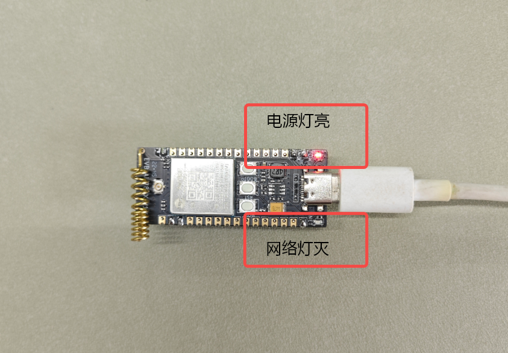
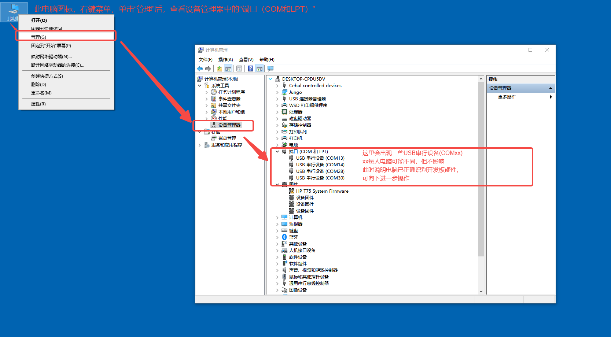

## 一、JSON 介绍

JSON（JavaScript Object Notation）是一种轻量级的数据交换格式，易于人类阅读和编写，同时也易于机器解析和生成。它基于 JavaScript 编程语言的一个子集，但独立于语言，广泛用于不同编程环境中。

### 1.1 JSON 的基本结构

#### 1.1.1 **对象**

由花括号 `{}` 包围，包含键值对。键是字符串，值可以是字符串、数字、布尔值、数组、对象或 `null`。
{
"name": "Alice",
"age": 30,
"isStudent": false
}

#### 1.1.2 **数组**

由方括号 `[]` 包围，包含一个有序的值列表。值可以是任何类型的数据，包括对象和其他数组。
[
"apple",
"banana",
"cherry"
]

### 1.2 JSON 的优点

**简洁性**：结构简单，易于理解和使用。

**可移植性**：语言无关，几乎所有的编程语言都支持 JSON 解析和生成。

**灵活性**：适用于各种数据结构的表示。

### 1.3 常用场景

**Web 应用**：用于客户端与服务器之间的数据交换。

**配置文件**：用于应用程序的配置设置。

**数据存储**：用于存储简单的数据结构。

综上所述，JSON 因其简单和灵活的特性，已经成为现代编程中数据交换的标准格式之一。

## 二、演示功能概述

本文使用 Air780E 核心板，生成与解析 JSON 格式数据，并通过日志观察实验结果。

## 三、准备硬件环境

### 3.1 AIR780E 开发板


[购买链接（注意：需要配套采购 4G 物联网卡！）](https://item.taobao.com/item.htm?id=693774140934&pisk=fhpqwk6HuxH4KGubOZWNYNN42s6AH93Cod_1jhxGcZbD5i6Nja-nDZGtMFRySUCfoqhAjR8HyGZXmsVlrMI4nSXGiaAykHfX7hnAjNYM7NOjNvtvDOBiROkIdnLlWvxH7sbDqzxRA-4062417OBiRVP7IsHFBedNnUSNZ0S1fRjMS1xlraINjRYGo_4lXGBGSbuCaJDS6s0HvaA15B4hHrX5zR2Uvi50onP_QRkNmsbhZw2MVLSVgwxDhJaPbgvWU617f46kvQTc49k4JiRkYtjwBDVN71JAUa8EKRIJiEJl_Lits3JNo6JcaVwwYt-lsL53YJ7Wai6knBrgI3WVSesAgruP-KKkpTfSKD-keEtvUhZiIgTCrnpcQvmd3tbcUgWaWg2F7dd4S55c2g7I40lKbcr6leOTt5FOZ9IPRmsbs54dORN2LJVT6_bd4wibK&skuId=5098266470883&spm=a1z10.5-c-s.w4002-24045920841.33.75b21fd1Su4B3X)

### 3.2 TYPE-C 线快充线


[购买链接（注意：必须是快充线！）](https://item.taobao.com/item.htm?id=693774140934&pisk=fhpqwk6HuxH4KGubOZWNYNN42s6AH93Cod_1jhxGcZbD5i6Nja-nDZGtMFRySUCfoqhAjR8HyGZXmsVlrMI4nSXGiaAykHfX7hnAjNYM7NOjNvtvDOBiROkIdnLlWvxH7sbDqzxRA-4062417OBiRVP7IsHFBedNnUSNZ0S1fRjMS1xlraINjRYGo_4lXGBGSbuCaJDS6s0HvaA15B4hHrX5zR2Uvi50onP_QRkNmsbhZw2MVLSVgwxDhJaPbgvWU617f46kvQTc49k4JiRkYtjwBDVN71JAUa8EKRIJiEJl_Lits3JNo6JcaVwwYt-lsL53YJ7Wai6knBrgI3WVSesAgruP-KKkpTfSKD-keEtvUhZiIgTCrnpcQvmd3tbcUgWaWg2F7dd4S55c2g7I40lKbcr6leOTt5FOZ9IPRmsbs54dORN2LJVT6_bd4wibK&skuId=5098266470883&spm=a1z10.5-c-s.w4002-24045920841.33.75b21fd1Su4B3X)

## 四、准备软件环境

### 4.1 Luatools

[Luatools 日志打印与程序烧录软件下载](https://docs.openluat.com/Luatools/)

### 4.2 core 固件和源码脚本

注：core 固件，是基础环境，该固件由合宙官方提供，用户不可修改；源码脚本，为应用程序，可由客户自行修改；
[右键点我,另存为,下载完整压缩文件包](file/core固件与demo脚本源码.zip){:target="_blank"}

## 五、软硬件资料

1、AIR708E 开发板原理图，打开 [Air780E 产品手册](https://docs.openluat.com/air780e/product/) ，访问页面中的 《[EVB_Air780X_V1.6.zip](https://cdn.openluat-luatcommunity.openluat.com/attachment/20240513100446379_EVB_Air780X_V1.6.zip)》

2、[API 使用介绍说明](https://wiki.luatos.com/api/json.html)

3、AIR708E 开发板使用说明，打开 [Air780E 产品手册](https://docs.openluat.com/air780e/product/) ，访问页面中的 《Core_Air780E 使用说明 V1.0.5.pdf》

### 5.1 开发板按钮与指示灯图示与说明


### 5.2 硬件安装与连接

#### 5.2.1 SIM 卡安装


#### 5.2.2 实物连接图


注：开发板与电脑通过 TYPE-C 线连接，用于通信与供电，所以必须使用“支持快充”的 TYPE-C 线才可以；

## 六、代码示例介绍

### 6.1 完整程序清单

注：完整复制后保存为 main.lua，可直接使用

```lua
-- LuaTools需要PROJECT和VERSION这两个信息
PROJECT = "jsondemo"
VERSION = "1.0.0"

-- 引入必要的库文件(lua编写), 内部库不需要require
sys = require("sys")

log.info("main", PROJECT, VERSION)

-- json库支持将 table 转为 字符串, 或者反过来, 字符串 转 table
-- 若转换失败, 会返回nil值, 强烈建议在使用时添加额外的判断
sys.taskInit(function()
    while 1 do
        sys.wait(1000)
        -- table 转为 字符串
        local t = {abc=123, def="123", ttt=true}
        local jdata = json.encode(t)
        log.info("json", jdata)                                                                          --日志输出：{"ttt":true,"def":"123","abc":123}

        -- 字符串转table
        local str = "{\"abc\":1234545}" -- 字符串可以来源于任何地方,网络,文本,用户输入,都可以
        local t = json.decode(str)
        if t then
                        -- 若解码成功，t不为nil
                        log.info("json", "decode", t.abc)                                                 --日志输出：decode        1234545
                else
                        -- 若解码失败，t为nil
                        log.info("json", "decode failed")
                end

        -- lua中的table是 数组和hashmap的混合体
        -- 这对json来说会有一些困扰, 尤其是空的table
        local t = {abc={}}
        -- 假设从业务上需要输出 {"abc":[]}
        -- 实际会输出 {"abc": {}} , 空table是优先输出 hashmap （即字典模式）形式, 而非数组形式，Lua语言中数组优先级低于hashmap优先级
        log.info("json", "encode", json.encode(t))                                         --日志输出：encode        {"abc":{}}
        -- 混合场景, json场景应避免使用
        t.abc.def = "123"
        t.abc[1] = 345
        -- 输出的内容是 {"abc":{"1":345,"def":"123"}}
        log.info("json", "encode2", json.encode(t))                                  --日志输出：encode2        {"abc":{"1":345,"def":"123"}}

        -- 浮点数演示
        log.info("json", json.encode({abc=1234.300}))                                  --日志输出：{"abc":1234.300}
        -- 限制小数点到1位
        log.info("json", json.encode({abc=1234.300}, "1f"))                 --日志输出：{"abc":1234.3}

 
        local tmp = "ABC\r\nDEF\r\n"
        local tmp2 = json.encode({str=tmp}) --在JSON中，\r\n 被保留为字符串的一部分
        log.info("json", tmp2)                                            --日志输出：{"str":"ABC\r\nDEF\r\n"}
        local tmp3 = json.decode(tmp2)                                                                
        log.info("json", "tmp3", tmp3.str, tmp3.str == tmp)                        --日志输出：tmp3        ABC
                                                                                                                                                --DEF
                                                                                                                                                --                true  注：true前存在一个TAB长度（这个TAB原因未知，但不影响使用）
        -- break

        log.info("json.null", json.encode({name=json.null}))                --日志输出：{}  为空对象
        log.info("json.null", json.decode("{\"abc\":null}").abc == json.null)          --日志输出：false    在 Lua 中，nil 是一种特殊类型，用于表示“无值”或“未定义”。它与任何其他值（包括自定义的 json.null）都不相等
        log.info("json.null", json.decode("{\"abc\":null}").abc == nil)                         --日志输出：false
    end
end)


-- 这里演示4G模块上网后，会自动点亮网络灯，方便用户判断模块是否正常开机
sys.taskInit(function()
    while true do
        sys.wait(6000)
                if mobile.status() == 1 then
                        gpio.set(27, 1)  
                else
                        gpio.set(27, 0) 
                        mobile.reset()
        end
    end
end)
-- 用户代码已结束---------------------------------------------
-- 结尾总是这一句
sys.run()
-- sys.run()之后后面不要加任何语句!!!!!
```

## 七、功能验证

### 7.1 开机

按图 1 所示通过 TYPE-C 线将开发板与电脑连接无误后，开发板电源指示红灯常亮，网络指示灯灭，如下图：



此时按下开机键，约 2 秒后释放，等待几秒网络指示绿灯常亮，即开机成功，如下图：


此时电脑设备管理器中会发现下图所示几个设备，即代表开机成功！



### 7.2 打开 Luatool 软件工具并进入项目管理测试页面


图 4

### 7.3 按序号步骤创建项目


### 7.4 按如下步骤进行程序烧录


### 7.5 观察下载过程后确认烧录结果


### 7.6 关闭项目管理界面，回到调试页面，观察输出


## 总结

至此，我们已使用 AIR708E 开发板验证了 JSON 编、解码功能。

## 给读者的话

> 本篇文章由`肇朔`开发；
>
> 本篇文章描述的内容，如果有错误、细节缺失、细节不清晰或者其他任何问题，总之就是无法解决您遇到的问题；
>
> 请登录[合宙技术交流论坛](https://chat.openluat.com/)，点击[文档找错赢奖金-Air780E-LuatOS-软件指南-通用工具库-json数据处理](https://chat.openluat.com/#/page/matter?125=1848633178781253633&126=%E6%96%87%E6%A1%A3%E6%89%BE%E9%94%99%E8%B5%A2%E5%A5%96%E9%87%91-Air780E-LuatOS-%E8%BD%AF%E4%BB%B6%E6%8C%87%E5%8D%97-%E9%80%9A%E7%94%A8%E5%B7%A5%E5%85%B7%E5%BA%93-json%E6%95%B0%E6%8D%AE%E5%A4%84%E7%90%86&askid=1848633178781253633)
>
> 用截图标注+文字描述的方式跟帖回复，记录清楚您发现的问题；
>
> 我们会迅速核实并且修改文档；
>
> 同时也会为您累计找错积分，您还可能赢取月度找错奖金！