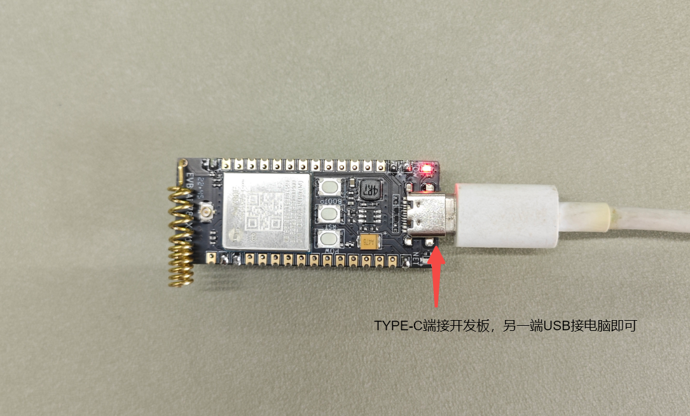
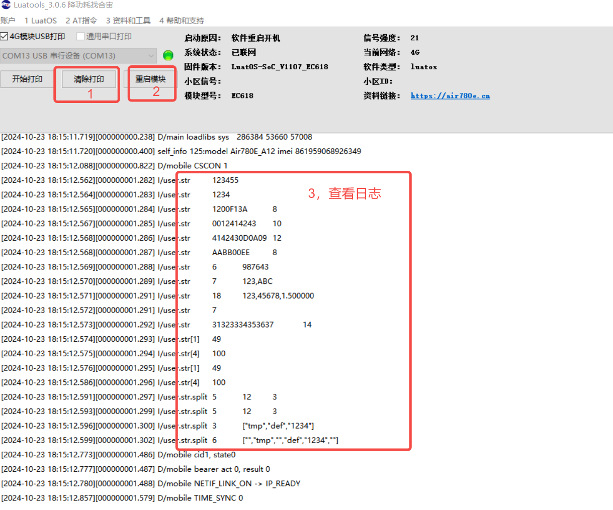

## 一、Lua 字符串介绍

关于字符串，Lua 提供了一些灵活且强大的功能，一些入门知识如下：

### 1.1 **字符串定义**

在 Lua 中，字符串可以用单引号 `'` 或双引号 `"` 来定义。例如：

local str1 = 'Hello, World!'

local str2 = "Hello, Lua!"

### 1.2 **字符串连接**

Lua 使用 `..` 操作符进行字符串连接。例如：

local greeting = "Hello"

local name = "World"

local message = greeting .. ", " .. name .. "!"  -- 结果为 "Hello, World!"

### 1.3 **字符串长度**

可以使用 `#` 操作符获取字符串的长度。例如：

local length = #"Hello, World!"  -- 结果为 13

综上所述，Lua 的字符串功能强大且易于使用，非常适合嵌入式开发中的文本处理需求。通过灵活运用这些功能，可以有效地处理和操作字符串数据。

## 二、演示功能概述

本文使用 Air780E 核心板，对字符串进行定义、连接、计算长度、格式化输出以及分割等处理，并通过日志观察的方式验证实验结果。

## 三、准备硬件环境

### 3.1 Air780E 开发板


[购买链接（注意：需要配套采购 4G 物联网卡！）](https://item.taobao.com/item.htm?id=693774140934&pisk=fhpqwk6HuxH4KGubOZWNYNN42s6AH93Cod_1jhxGcZbD5i6Nja-nDZGtMFRySUCfoqhAjR8HyGZXmsVlrMI4nSXGiaAykHfX7hnAjNYM7NOjNvtvDOBiROkIdnLlWvxH7sbDqzxRA-4062417OBiRVP7IsHFBedNnUSNZ0S1fRjMS1xlraINjRYGo_4lXGBGSbuCaJDS6s0HvaA15B4hHrX5zR2Uvi50onP_QRkNmsbhZw2MVLSVgwxDhJaPbgvWU617f46kvQTc49k4JiRkYtjwBDVN71JAUa8EKRIJiEJl_Lits3JNo6JcaVwwYt-lsL53YJ7Wai6knBrgI3WVSesAgruP-KKkpTfSKD-keEtvUhZiIgTCrnpcQvmd3tbcUgWaWg2F7dd4S55c2g7I40lKbcr6leOTt5FOZ9IPRmsbs54dORN2LJVT6_bd4wibK&skuId=5098266470883&spm=a1z10.5-c-s.w4002-24045920841.33.75b21fd1Su4B3X)

### 3.2 TYPE-C 数据线


[购买链接（注意：必须具备USB通信功能！）](https://item.taobao.com/item.htm?id=693774140934&pisk=fhpqwk6HuxH4KGubOZWNYNN42s6AH93Cod_1jhxGcZbD5i6Nja-nDZGtMFRySUCfoqhAjR8HyGZXmsVlrMI4nSXGiaAykHfX7hnAjNYM7NOjNvtvDOBiROkIdnLlWvxH7sbDqzxRA-4062417OBiRVP7IsHFBedNnUSNZ0S1fRjMS1xlraINjRYGo_4lXGBGSbuCaJDS6s0HvaA15B4hHrX5zR2Uvi50onP_QRkNmsbhZw2MVLSVgwxDhJaPbgvWU617f46kvQTc49k4JiRkYtjwBDVN71JAUa8EKRIJiEJl_Lits3JNo6JcaVwwYt-lsL53YJ7Wai6knBrgI3WVSesAgruP-KKkpTfSKD-keEtvUhZiIgTCrnpcQvmd3tbcUgWaWg2F7dd4S55c2g7I40lKbcr6leOTt5FOZ9IPRmsbs54dORN2LJVT6_bd4wibK&skuId=5098266470883&spm=a1z10.5-c-s.w4002-24045920841.33.75b21fd1Su4B3X)


## 四、准备软件环境

### 4.1 Luatools

[Luatools 日志打印与程序烧录软件下载](https://docs.openluat.com/Luatools/)

### 4.2 core 固件和源码脚本

注：core 固件，是基础环境，该固件由合宙官方提供，用户不可修改；源码脚本，为应用程序，可由客户自行修改；
[右键点我,另存为,下载完整压缩文件包](file/demo配套core固件和应用程序脚本.zip){:target="_blank"}

## 五、软硬件资料

1、Air780E 开发板原理图，打开 [Air780E 产品手册](https://docs.openluat.com/air780e/product/) ，访问页面中的 《[EVB_Air780X_V1.6.zip](https://cdn.openluat-luatcommunity.openluat.com/attachment/20240513100446379_EVB_Air780X_V1.6.zip)》

2、[API 使用介绍说明](https://wiki.luatos.com/api/string.html)

3、Air780E 开发板使用说明，打开 [Air780E 产品手册](https://docs.openluat.com/air780e/product/) ，访问页面中的 《开发板 Core_Air780E 使用说明 V1.0.5.pdf》

### 5.1 开发板按钮与指示灯图示与说明


### 5.2 硬件安装与连接

#### 5.2.1 SIM 卡安装


#### 5.2.2 实物连接图



注：开发板与电脑通过 TYPE-C 线连接，用于通信与供电，所以必须使用支持 USB 通信的 TYPE-C 线才可以；

## 六、代码示例介绍

### 6.1 完整程序清单

注：完整复制后保存为 main.lua，可直接使用

```lua
-- LuaTools需要PROJECT和VERSION这两个信息
PROJECT = "strtest"
VERSION = "2.0.0"

--[[
本demo演示 string字符串的基本操作
1. lua的字符串是带长度, 这意味着, 它不依赖0x00作为结束字符串, 可以包含任意数据
2. lua的字符串是不可变的, 就不能直接修改字符串的一个字符, 修改字符会返回一个新的字符串
]]

-- sys库是标配
_G.sys = require("sys")

sys.taskInit(function ()
    sys.wait(1000) -- 免得看不到日志
    local tmp

    ----------------------------------------------
    --================================================
    -- 字符串的声明和生成
    --================================================

    -- 常量声明
    local str = "123455" 
    log.info("str", str)                                                                                                                --日志输出：123455

    -- 合成式
    str = string.char(0x31, 0x32, 0x33, 0x34)  --0x31为字符 1的ASCII码
    log.info("str", str)                                                                                                           --日志输出：1234                   
    -- lua的字符串可以包含任意数据, 包括 0x00
    str = string.char(0x12, 0x00, 0xF1, 0x3A)
    log.info("str", str:toHex()) -- 注意, 这里用toHex(), 因为包含了不可见字符   --日志输出：1200F13A        8（其中8为输出字符串长度）
    -- 使用转义字符
    str = "\x00\x12ABC"                         -- 字符串中的\x表示十六进制转义序列                                                                
    log.info("str", str:toHex()) -- 注意, 这里用toHex(), 因为包含了不可见字符   --日志输出：0012414243        10 （其中41，42，43分别分字符 ABC的ASCII值的十六进制形式，10为输出字符串长度）
    str = "ABC\r\n\t"
    log.info("str", str:toHex()) -- 注意, 这里用toHex(), 因为包含了不可见字符   --日志输出：4142430D0A09        12（其中0D为\r回车键值的ASCII值的十六进制形式，
                                                                                    --0A为\n换行键值的ASCII值的十六进制形式，\t 是一个转义字符，表示一个水平制表符（Tab））


    -- 解析生成
    str = string.fromHex("AABB00EE")                                                                                        
    log.info("str", str:toHex())                                                                                                --日志输出：AABB00EE        8
    str = string.fromHex("393837363433")       --将字符串转换为十六进制形式
    log.info("str", #str, str)                                                                                                    --日志输出：6        987643（其中6为输出字符长度，987643为输出字符串）

    -- 连接字符串, 操作符 ".."
    str = "123" .. "," .. "ABC"  --将3段字符串连接起来
    log.info("str", #str, str)                                                                                                    --日志输出：7        123,ABC（其中7为输出字符长度，123,ABC为连接后的字符串）


    -- 格式化生成
    str = string.format("%s,%d,%f", "123", 45678, 1.5)                --格式化输出，        %s为字符串输出，%d为十进制输出，%f为浮点形式输出                        
    log.info("str", #str, str)                                                                                                        --日志输出：18        123,45678,1.500000


    --================================================
    -- 字符串的解析与处理
    --================================================
    -- 获取长度
    str = "1234567"
    log.info("str", #str)                                                                                                                --日志输出：7为字符串长度
    -- 获取字符串的HEX字符串显示
    log.info("str", str:toHex())                                                                                                --日志输出：31323334353637        14（用字符格式输出十六进制）

    -- 获取指定位置的值, 注意lua的下标是1开始的
    str = "123ddss"
    log.info("str[1]", str:byte(1))                                             --日志输出：49         （字符1，对应十进制ASCII值）
    log.info("str[4]", str:byte(4))                                                                                                --日志输出: 100         （字符d，对应十进制ASCII值）
    log.info("str[1]", string.byte(str, 1))                                                                                --日志输出：49   （str位置1的字符，也是数字1）
    log.info("str[4]", string.byte(str, 4))                                                                                --日志输出: 100         （str位置4的字符，也是数字d）

    -- 按字符串分割
    str = "12,2,3,4,5"
    tmp = str:split(",")
    log.info("str.split", #tmp, tmp[1], tmp[3])                                                                        --日志输出：5        12        3
    tmp = string.split(str, ",") -- 与前面的等价
    log.info("str.split", #tmp, tmp[1], tmp[3])                                 --日志输出：5        12        3
    str = "/tmp//def/1234/"
    tmp = str:split("/")
    log.info("str.split", #tmp, json.encode(tmp))                                                                --日志输出：3        ["tmp","def","1234"]

    -- 2023.04.11新增的, 可以保留空的分割片段
        --在 Lua 中，str:split("/", true) 语句表示将字符串 str 按照字符 "/" 进行分割，并且 true 参数通常用于表示保留空字符串（这取决于具体的 split 函数实现，因为 Lua 标准库中没有内置的 split 函数）。根据你的描述，输出结果是 6 ["","tmp","","def","1234",""]。这是因为：
    --假设 str 是 "/tmp//def/1234/"，在这种情况下，字符串以 "/" 开头和结尾，并且有连续的 "/"。
    --split 函数将字符串分割成多个部分，每个 "/" 都会作为一个分割符。
    --因为 true 参数表示保留空字符串，所以在分割过程中，连续的 "/" 和开头、结尾的 "/" 都会导致空字符串被保留。

    tmp = str:split("/", true) 
    log.info("str.split", #tmp, json.encode(tmp))                                                                --日志输出：6        ["","tmp","","def","1234",""]

    -- 更多资料
    -- https://wiki.luatos.com/develop/hex_string.html
    -- https://wiki.luatos.com/_image/lua53doc/manual.html#3.4
end)
-- 这里演示4G模块上网后，会自动点亮网络灯，方便用户判断模块是否正常开机
sys.taskInit(function()
    while true do
        sys.wait(6000)
                if mobile.status() == 1 then
                        gpio.set(27, 1)  
                else
                        gpio.set(27, 0) 
                        mobile.reset()
        end
    end
end)
-- 用户代码已结束---------------------------------------------
-- 结尾总是这一句
sys.run()
-- sys.run()之后后面不要加任何语句!!!!!
```

## 七、功能验证

### 7.1 开机

按图 1 所示通过 TYPE-C 线将开发板与电脑连接无误后，开发板电源指示红灯常亮，网络指示灯灭，如下图：


此时按下开机键，约 2 秒后释放，等待几秒网络指示绿灯常亮，即开机成功，如下图：


此时电脑设备管理器中会发现下图所示几个设备，即代表开机成功！


### 7.2 打开 Luatool 软件工具并进入项目管理测试页面


图 4

### 7.3 按序号步骤创建项目


### 7.4 按如下步骤进行程序烧录


### 7.5 观察下载过程后确认烧录结果


### 7.6 关闭项目管理界面，回到调试页面，观察输出

注：详细日志输出内容，在程序中有增强注释说明，请详细查看。



## 总结

至此，我们已使用 Air780E 开发板验证了字符串的相关操作功能。

## 给读者的话

> 本篇文章由`肇朔`开发；
>
> 本篇文章描述的内容，如果有错误、细节缺失、细节不清晰或者其他任何问题，总之就是无法解决您遇到的问题；
>
> 请登录[合宙技术交流论坛](https://chat.openluat.com/)，点击[文档找错赢奖金-Air780E-LuatOS-软件指南-通用工具库-字符串处理](https://chat.openluat.com/#/page/matter?125=1849696959087116289&126=%E6%96%87%E6%A1%A3%E6%89%BE%E9%94%99%E8%B5%A2%E5%A5%96%E9%87%91-Air780E-LuatOS-%E8%BD%AF%E4%BB%B6%E6%8C%87%E5%8D%97-%E9%80%9A%E7%94%A8%E5%B7%A5%E5%85%B7%E5%BA%93-%E5%AD%97%E7%AC%A6%E4%B8%B2%E5%A4%84%E7%90%86&askid=1849696959087116289)
>
> 用截图标注+文字描述的方式跟帖回复，记录清楚您发现的问题；
>
> 我们会迅速核实并且修改文档；
>
> 同时也会为您累计找错积分，您还可能赢取月度找错奖金！

