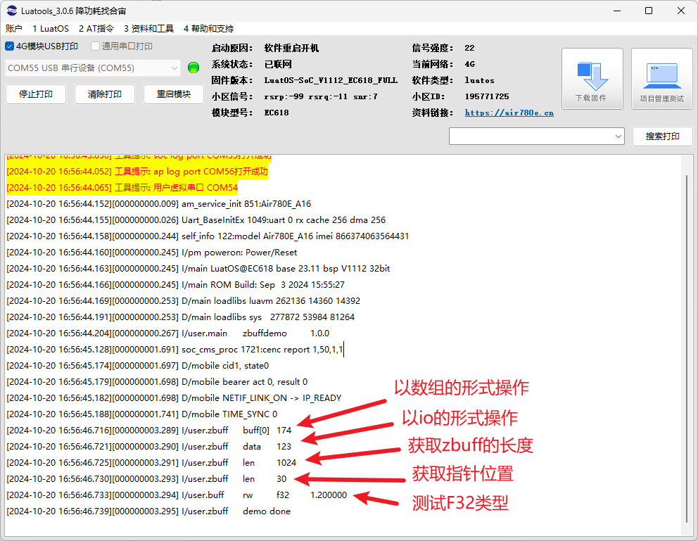

## 一、ZBUFF(C 内存数组)简介

zbuff 库可以用 c 风格直接操作(下标从 0 开始)，例如 buff[0] = buff[3]

可以在 sram 上或者 psram 上申请空间，也可以自动申请(如存在 psram 则在 psram 进行申请,如不存在或失败则在 sram 进行申请)。

操作里面的元素时，可以根据 光标进行增删改查。偏移方式有三种：从头、当前位置、末尾开始。常用参数如下：

| **常量**<br/>         | **类型**<br/> | **解释**<br/>                                                                    |
| --------------------- | ------------- | -------------------------------------------------------------------------------- |
| zbuff.SEEK_SET<br/>   | number<br/>   | 以头为基点<br/>                                                                  |
| zbuff.SEEK_CUR<br/>   | number<br/>   | 以当前位置为基点<br/>                                                            |
| zbuff.SEEK_END<br/>   | number<br/>   | 以末尾为基点<br/>                                                                |
| zbuff.HEAP_AUTO<br/>  | number<br/>   | 自动申请(如存在 psram 则在 psram 进行申请,如不存在或失败则在 sram 进行申请)<br/> |
| zbuff.HEAP_SRAM<br/>  | number<br/>   | 在 sram 申请<br/>                                                                |
| zbuff.HEAP_PSRAM<br/> | number<br/>   | 在 psram 申请<br/>                                                               |

## 二、演示功能概述

本 demo 将演示 ZBUFF 的创建、写入数据、读取数据、获取 zbuff 长度、获取光标位置

## 三、准备硬件环境

### 3.1 780E 开发板一套，包括天线、USB 数据线.

淘宝购买链接：[Air780E 核心板淘宝购买链接](https://item.taobao.com/item.htm?id=693774140934&pisk=f1eiwOqL25l1_HYiV6D1ize3wN5d5FMjRrpxkx3VT2uIHCCskWm4kysffAEqor4KRRIskGT0ooqi_coq7DWE000qbVr2mmzKQjNtkV3mnoalvaBRelZshA7RyTFdpD4xQco2_VS2Tcnvc89h5lZshq-pu_FUfEDVVdOmgrkET0ir3mkq_MDEmmM2QjJaY2uI0UGAoNueWRjiw4YTC-_opNr-zluaXleFpfR_X2fhTJVn94W--KJ4KcqQreCDEs3zNVh-DyWpIxqEmyc8savgoor7gX2D7GUzmW4jBJS2_4PTWjestFRZqA0iaRlwjdkIgW2nBR7XNkEn7bDL96_tMA4gN4GNOwa0xVU4IX8G4iReapZyhDSYLIOj_DinyhbSB2IHjbEhxMA51foIXaIhxItMPKJlyMjHNEGZAcQR.&spm=a1z10.5-c-s.w4002-24045920841.33.639f1fd1YrS4b6&skuId=5098266470883) ；

此核心板的详细使用说明参考：[Air780E 产品手册](https://docs.openluat.com/air780e/product/) 中的 << 开发板 Core_Air780E 使用说明 V1.0.5.pdf>>，X.X.X 指版本号；核心板使用过程中遇到任何问题，可以直接参考这份使用说明 pdf 文档。


### 3.2 SIM 卡

请准备一张可正常上网的 SIM 卡，该卡可以是物联网卡或您的个人手机卡。

**特别提醒：**请确保 SIM 卡未欠费且网络功能正常，以便顺利进行后续操作。

### 3.3 数据通信线

typec 接口 USB 数据线即可。

### 3.4 PC 电脑

WINDOWS 系统。

## 四、准备软件环境

### 4.1 基本的下载调试工具

使用说明参考：[Luatools 下载和详细使用](https://docs.openluat.com/Luatools/) ；

## 五、ZBUFF 操作软硬件资料

### 5.1 文档和工具：

- 780E 模块使用固件：[SDK& Demo - 合宙文档中心](https://docs.openluat.com/air780e/luatos/firmware/)，本 demo 使用的固件版本是：LuatOS-SoC_V1112_EC618_FULL.soc
- 本教程使用的 demo：[https://gitee.com/openLuat/LuatOS-Air780E/tree/master/demo/zbuff](https://gitee.com/openLuat/LuatOS-Air780E/tree/master/demo/zbuff)
- 将固件和脚本烧录到模块中：[Luatools 下载和使用教程 - 合宙模组资料中心](https://docs.openluat.com/Luatools/)
- 源码和固件已打包，如下所示：
[点我,下载完整压缩文件包](file/完整文件包.zip){:target="_blank"}

### 5.2 demo 使用 api 介绍

#### zbuff.create(length,data,type)

作用：创建 zbuff。

**参数：**

| **传入值类型**<br/> | **解释**<br/>                                                                                                                                                                                                   |
| ------------------- | --------------------------------------------------------------------------------------------------------------------------------------------------------------------------------------------------------------- |
| int<br/>            | 字节数<br/>                                                                                                                                                                                                     |
| any<br/>            | 可选参数，number 时为填充数据，string 时为填充字符串<br/>                                                                                                                                                       |
| number<br/>         | 可选参数，内存类型，可选：zbuff.HEAP_SRAM(内部 sram,默认) zbuff.HEAP_PSRAM(外部 psram) zbuff.HEAP_AUTO(自动申请,如存在 psram 则在 psram 进行申请,如不存在或失败则在 sram 进行申请) 注意:此项与硬件支持有关<br/> |

**返回值：**

| **返回值类型**<br/> | **解释**<br/>                           |
| ------------------- | --------------------------------------- |
| object<br/>         | zbuff 对象，如果创建失败会返回 nil<br/> |

#### buff:write(para,…)

作用：zbuff 写数据（从当前指针位置开始；执行后指针会向后移动）。

**参数：**

| **传入值类型**<br/> | **解释**<br/>                                                     |
| ------------------- | ----------------------------------------------------------------- |
| any<br/>            | 写入 buff 的数据，string 时为一个参数，number 时可为多个参数<br/> |

**返回值：**

| **返回值类型**<br/> | **解释**<br/>           |
| ------------------- | ----------------------- |
| number<br/>         | 数据成功写入的长度<br/> |

#### buff:read(length)

作用：zbuff 读数据（从当前指针位置开始；执行后指针会向后移动）

**参数：**

| **传入值类型**<br/> | **解释**<br/>             |
| ------------------- | ------------------------- |
| int<br/>            | 读取 buff 中的字节数<br/> |

**返回值：**

| **返回值类型**<br/> | **解释**<br/> |
| ------------------- | ------------- |
| string<br/>         | 读取结果<br/> |

#### buff:clear(num)

作用：zbuff 清空数据（与当前指针位置无关；执行后指针位置不变）

**参数：**

| **传入值类型**<br/> | **解释**<br/>                                             |
| ------------------- | --------------------------------------------------------- |
| int<br/>            | 可选，默认为 0。要设置为的值，不会改变 buff 指针位置<br/> |

**返回值：**

无

#### buff:seek(base,offset)

作用：zbuff 设置光标位置（可能与当前指针位置有关；执行后指针会被设置到指定位置）

**参数：**

| **传入值类型**<br/> | **解释**<br/>                                                                                                                              |
| ------------------- | ------------------------------------------------------------------------------------------------------------------------------------------ |
| int<br/>            | 偏移长度<br/>                                                                                                                              |
| int<br/>            | where, 基点，默认 zbuff.SEEK_SET。zbuff.SEEK_SET: 基点为 0 （文件开头），zbuff.SEEK_CUR: 基点为当前位置，zbuff.SEEK_END: 基点为文件尾<br/> |

**返回值：**

| **返回值类型**<br/> | **解释**<br/>                                 |
| ------------------- | --------------------------------------------- |
| int<br/>            | 设置光标后从 buff 开头计算起的光标的位置<br/> |

#### buff:pack(format,val1, val2,…)

作用：将一系列数据按照格式字符转化，并写入（从当前指针位置开始；执行后指针会向后移动）

**参数：**

| **传入值类型**<br/> | **解释**<br/>                               |
| ------------------- | ------------------------------------------- |
| string<br/>         | 后面数据的格式（符号含义见下面的例子）<br/> |
| val<br/>            | 传入的数据，可以为多个数据<br/>             |

**返回值：**

| **返回值类型**<br/> | **解释**<br/>           |
| ------------------- | ----------------------- |
| int<br/>            | 成功写入的数据长度<br/> |

**例子：**

```lua
buff:pack(">IIHA", 0x1234, 0x4567, 0x12,"abcdefg") -- 按格式写入几个数据
-- A string
-- f float
-- d double
-- n Lua number
-- c char
-- b byte / unsignen char
-- h short
-- H unsigned short
-- i int
-- I unsigned int
-- l long
-- L unsigned long
-- < 小端
-- > 大端
-- = 默认大小端
```

#### buff:unpack(format)

作用：将一系列数据按照格式字符读取出来（从当前指针位置开始；执行后指针会向后移动）

**参数：**

| **传入值类型**<br/> | **解释**<br/>                                     |
| ------------------- | ------------------------------------------------- |
| string<br/>         | 数据的格式（符号含义见上面 pack 接口的例子）<br/> |

**返回值：**

| **返回值类型**<br/> | **解释**<br/>               |
| ------------------- | --------------------------- |
| int<br/>            | 成功读取的数据字节长度<br/> |
| any<br/>            | 按格式读出来的数据<br/>     |

#### buff:read 类型()

作用：读取一个指定类型的数据（从当前指针位置开始；执行后指针会向后移动）

**参数：**

| **传入值类型**<br/> | **解释**<br/>                                                     |
| ------------------- | ----------------------------------------------------------------- |
| 注释<br/>           | 读取类型可为：I8、U8、I16、U16、I32、U32、I64、U64、F32、F64<br/> |

**返回值：**

| **返回值类型**<br/> | **解释**<br/>                     |
| ------------------- | --------------------------------- |
| number<br/>         | 读取的数据，如果越界则为 nil<br/> |

#### buff:write 类型()

作用：写入一个指定类型的数据（从当前指针位置开始；执行后指针会向后移动）

**参数：**

| **传入值类型**<br/> | **解释**<br/>                                                     |
| ------------------- | ----------------------------------------------------------------- |
| number<br/>         | 待写入的数据<br/>                                                 |
| 注释<br/>           | 写入类型可为：I8、U8、I16、U16、I32、U32、I64、U64、F32、F64<br/> |

**返回值：**

| **返回值类型**<br/> | **解释**<br/>       |
| ------------------- | ------------------- |
| number<br/>         | 成功写入的长度<br/> |

#### buff:len()

作用：获取 zbuff 对象的长度（与当前指针位置无关；执行后指针位置不变）

**参数：**

无

**返回值：**

| **返回值类型**<br/> | **解释**<br/>         |
| ------------------- | --------------------- |
| int<br/>            | zbuff 对象的长度<br/> |

#### buff:used()

作用：获取 zbuff 里最后一个数据位置指针到首地址的偏移量，来表示 zbuff 内已有有效数据量大小，注意这个不同于分配的空间大小，由于 seek()会改变最后一个数据位置指针，因此也会影响到 used()返回值。

**参数：**

无

**返回值：**

| 返回值类型<br/> | 解释<br/>           |
| --------------- | ------------------- |
| int<br/>        | 有效数据量大小<br/> |

## 六、代码示例介绍

### 6.1 zbuff 操作示例

#### 6.1.1 创建 zbuff，以 c 语言数组的形式操作 zbuff

```lua
local buff = zbuff.create(1024)
    -- 可当成数组直接赋值和取值
    buff[0] = 0xAE
    log.info("zbuff", "buff[0]", buff[0])
```

#### 6.1.2 以 io 的形式操作

```lua
-- 写数据write, 操作之后指针会移动,跟文件句柄一样
    buff:write("123") -- 字符串
    buff:write(0x12, 0x13, 0x13, 0x33) -- 直接写数值也可以

    -- 设置指针位置, seek
    buff:seek(5, zbuff.SEEK_CUR) -- 指针位置+5
    -- 指针位置设置为0
    buff:seek(0)                 -- 绝对地址

    -- 读数据read, 指针也会移动
    -- 读取前三个字节，即"123"
    local data = buff:read(3)
    log.info("zbuff", "data", data)
```

#### 6.1.3 清除 zbuff

```lua
-- 清除全部数据,但指针位置不变
    buff:clear() -- 默认填0
    buff:clear(0xA5) -- 也可以指定填充的内容
```

#### 6.1.4 以 pack 库的形式写入或读取数据

```lua
-- 支持以pack库的形式写入或读取数据
    buff:seek(0)
    buff:pack(">IIHA", 0x1234, 0x4567, 0x12,"abcdefg")
    buff:seek(0)
    local cnt,a,b,c,s = buff:unpack(">IIHA10")
```

#### 6.1.5 按类型读写数据

读取类型可为：I8、U8、I16、U16、I32、U32、I64、U64、F32、F64

读取的时候，记得注意下标位置。

```lua
-- 也可以直接按类型读写数据
    local len = buff:writeI8(10)
    local len = buff:writeU32(1024)
    local i8data = buff:readI8()
    local u32data = buff:readU32()
```

#### 6.1.6 取出指定区间的数据

```lua
-- 取出指定区间的数据
    local fz = buff:toStr(0,5)
```

#### 6.1.7 获取创建的 zbuff 的长度，和指针当前位置

```lua
-- 获取其长度
    log.info("zbuff", "len", buff:len())
    -- 获取其指针位置
    log.info("zbuff", "len", buff:used())
```

#### 6.1.8 测试 F32（32 位单精度浮点数）类型数据的读写

```lua
-- 测试writeF32, 注意, EC618系列(Air780E等), V1106会死机, 在V1107修复
    buff:seek(0, zbuff.SEEK_SET)
    buff:writeF32(1.2)
    buff:seek(0, zbuff.SEEK_SET)
    log.info("buff", "rw", "f32", buff:readF32())
```

## 七、功能验证

测试 zbuff 的使用



## 八、总结

本示例介绍了 zbuff 的作用和用法。

## 扩展

## 常见问题

### 1、先 buff:write(0x12)，再设置光标到正确位置后，使用 buff:read(1)读取不到数据。

直接读取是不可见字符，要使用 buff:read(1):toHex()读取数据。

## 给读者的话

> 本篇文章由`Linden`开发；
>
> 本篇文章描述的内容，如果有错误、细节缺失、细节不清晰或者其他任何问题，总之就是无法解决您遇到的问题；
>
> 请登录[合宙技术交流论坛](https://chat.openluat.com/)，点击[文档找错赢奖金-Air780E-LuatOS-软件指南-通用工具库-C语言内存数组(zbuff)](https://chat.openluat.com/#/page/matter?125=1849697273223708673&126=%E6%96%87%E6%A1%A3%E6%89%BE%E9%94%99%E8%B5%A2%E5%A5%96%E9%87%91-Air780E-LuatOS-%E8%BD%AF%E4%BB%B6%E6%8C%87%E5%8D%97-%E9%80%9A%E7%94%A8%E5%B7%A5%E5%85%B7%E5%BA%93-C%E8%AF%AD%E8%A8%80%E5%86%85%E5%AD%98%E6%95%B0%E7%BB%84(zbuff)&askid=1849697273223708673)；
>
> 用截图标注+文字描述的方式跟帖回复，记录清楚您发现的问题；
>
> 我们会迅速核实并且修改文档；
>
> 同时也会为您累计找错积分，您还可能赢取月度找错奖金！
